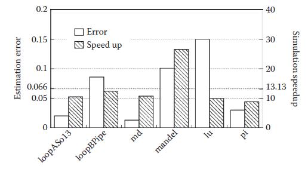
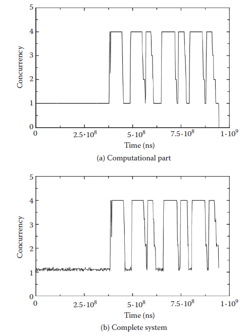
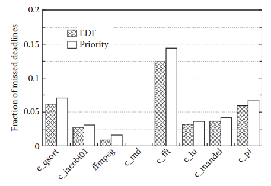
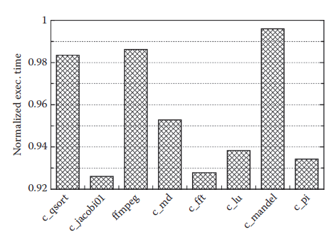

[10.3 <--- ](10_3.md) [   Зміст   ](README.md) [--> 10.5](10_5.md)

## 10.4. EXPERIMENTAL RESULTS

The methodology has been tested on a large set of OpenMP-based benchmarks (namely the OMPScr suite) and a large parallel application, namely ffmpeg (video encoding/decoding).

The basic assumption of this work is that the system is subject to a mixed application workload: a computationally intensive element with soft real-time constraints and a set of elements with very strict hard real-time characteristics, here called computational and real-time parts, respectively. The number and parameters of both the computational and real-time parts varies and strictly depends on the system being considered. This model well represents applications such as observation spacecraft payload, where massive data processing is required with high availability, while response to external stimuli within a given time is paramount (e.g., for the spacecraft’s navigation system).

The purpose of our methodology is to answer a set of key questions during the development of real-time applications running on an MPSoC:

1. What is the performance of the real-time applications? Is the system missing any deadlines with the current hardware and scheduling setup?

2. What is the performance of the computational part? Is it performing within requirements?

3. How much performance can the current hardware and software setup deliver? Is it possible to add additional computational or real-time tasks without affecting global performance? Can we reduce the number of hardware resources? What is the benefit of moving parts of the application or OS to hardware?

All tests have been executed using ReSP on a multi-ARM architecture consisting of a variable number of cores with caches, and a shared memory, all interconnected by a shared bus. Simulations where timing was recorded were run on a Core 2 Duo 2.66GHz Linux machine.

To evaluate the performance and accuracy of OS emulation with respect to a real OS, twelve OmpSCR benchmarks were run with the real-time operating system eCos [15], using a 4-core platform. A large set of eCos system calls were measured running six of these benchmarks as a training or calibration set, and the average latency of each class of system calls was determined. The Lilliefors/Van Soest test of normality [16] applied to the residuals of each class shows evidence of nonnormality (*L* = 0.30 and *L*critical = 0.28 with α = .01), but given that the population variability remains limited (with a within-group mean square MSS(A) = 7602 clock cycles), it can be assumed that each average latency is representative of its class.

The derived latencies were introduced for each system call in our OS emulation system, and the remaining six benchmarks (used as a validation set) were executed. Since profiling did not include all functions used by the OS and for which the latency was considered zero, the overall results were uniformly biased for underestimation. This bias can be easily corrected considering the average error, leading to an average error of 6.6 ± 5.5%, as shown in Figure 10.5. Even with this simple scheme, the methodology can very well emulate the behavior of a specific OS with minimal error, especially considering that full code equivalence is present for the application and library functions, but threading, multiprocessor management, and low-level OS functions are emulated.

In addition, the use of the OS emulation layer introduces a noticeable speedup (13.12 ± 6.7 times) when compared to running the OS on each ISS. This is because of several factors, including the absence of some hardware components such as

debugging UARTs and timers (the TE implements a terminal in the host OS and the configuration manager uses SystemC and its events to keep track of time), and the fact that, in our mechanism, idle processors do not execute busy loops but they are, instead, suspended. The latter is implemented by trapping the busy loop wait function in the TE and redirecting it to a SystemC wait() call.

Using the proposed methodology, a designer can verify the real-time performance of a multiprocessor system under load and explore the use of different interrupt distribution and handling schemes. As proof-of-concept, we ran the benchmarks as computationally intensive applications, while the real-time tasks are implemented by synthetic functions, with varying deadlines. These functions can be categorized as (1) housekeeping (scheduled regularly, perform sanity checks, repetitive tasks, etc.) and (2) response to external events (when an alarm is fired, its response is usually required within a given deadline).

**FIGURE 10.5** Simulation speedup and estimation error using the emulation layer instead of eCos.

A first analysis that is performed with the current methodology is to run the realtime part separately from the computational part, reducing all OS-related latencies (such as the latency of the mutex lock operation) to zero. The obtained *concurrency* *profile* shows the number of active PEs in time, that is, the effective utilization of the system resources. A similar graph is derived for the computational part, allowing the designer to determine if sufficient resources are available to run the application within its performance constraints. Finally, the computational and real-time parts are combined together and the concurrency profile is drawn as shown in Figure 10.6. This graph helps the designer tweak the hardware and software to match the desired requirements. As an example, the combination diagram (Figure 10.6b) can show a lower-than-expected utilization in case access to a shared bus represents a bottleneck in the system. If, instead, utilization is already at a maximum, the designer can conclude that more processing elements are necessary to reach the performance requirements. Simulating the system with realistic OS-related latencies (that can be targeted to any possible OS choice) leads to determining the best OS choice for the current application.

**FIGURE 10.6** The concurrency profiles of the ffmpeg benchmark, showing the computational parts (a) and the combination of the computational and real-time parts (b).

Figure 10.7 shows how the methodology is used to determine the best scheduler for the system where the performance is graphed for two schedulers (Priority and EDF). Running the application with and without RT tasks shows the different computational performance of the system, as depicted in Figure 10.8. As in our methodology, the RT or non-RT status of a task can be changed without modifications to the code, and this evaluation is simply made with two runs of the simulator. The designer can see how changes in the OS scheduling affect the performance of the system.

**FIGURE 10.7** Fraction of missed deadlines with different schedulers and high real-time workload (1 kHz).

**FIGURE 10.8** The performance impact of the real-time (RT) part on the computational part, that is, their relative execution time when compared to execution without the RT part. 

[10.3 <--- ](10_3.md) [   Зміст   ](README.md) [--> 10.5](10_5.md)