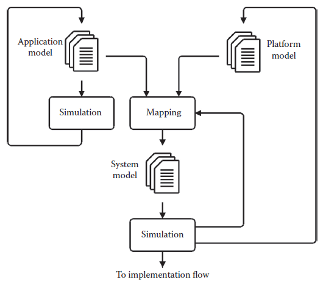

[11 <--- ](11.md) [   Зміст   ](README.md) [--> 11.2](11_2.md)

## 11.1. INTRODUCTION

The advances of the semiconductor industry seen in the last decades have brought the possibility of integrating evermore functionality onto a single chip. These integration possibilities also imply that the design complexity increases and so does the design time and effort. This challenge is widely acknowledged throughout academia and the industry, and to address this, novel frameworks and methods that will both automate design steps and raise the level of abstraction used to design systems are being called upon. 

Розвиток напівпровідникової промисловості за останні десятиліття приніс можливість інтегрувати все більше функціональних можливостей на одному чіпі. Ці можливості інтеграції також означають, що складність дизайну зростає, а також час і зусилля на проектування. Ця проблема широко визнана в академічних колах і промисловості, і для її вирішення потрібні нові структури та методи, які автоматизують етапи проектування та підвищать рівень абстракції, що використовується для проектування систем.

### 11.1.1 System-Level Performance Estimation

To allow efficient system-level design, a flexible framework for performance estimation providing fast and accurate estimates is required. Several methods have been presented in recent years allowing performance estimation through formal analysis or simulations of architectures at high levels of abstraction [1–6].

Щоб забезпечити ефективне проектування на рівні системи, потрібна гнучка структура для оцінки продуктивності, яка забезпечує швидкі та точні оцінки. В останні роки було представлено кілька методів, які дозволяють оцінювати продуктивність через формальний аналіз або моделювання архітектур на високих рівнях абстракції [1–6].

Recently, approaches that rely, at least partly, on formal methods of analysis to allow performance estimation have been presented [4]. In theory, these approaches eliminate the need for simulations to predict performance. However, in most cases, the accuracy of these approaches only justifies their use in the very early stages of the system design phase, where they can be used to reduce the number of potential candidate architectures as is done in Kunzli et al. [4], and the detailed performance estimates are obtainable only through simulation in the later design stages.

Нещодавно були представлені підходи, які, принаймні частково, спираються на формальні методи аналізу, щоб дозволити оцінку продуктивності [4]. Теоретично ці підходи усувають потребу в моделюванні для прогнозування продуктивності. Однак у більшості випадків точність цих підходів виправдовує їх використання лише на дуже ранніх стадіях фази проектування системи, де їх можна використовувати для зменшення кількості потенційних архітектур-кандидатів, як це зроблено в Kunzli et al. [4], а детальні оцінки ефективності можна отримати лише шляхом моделювання на пізніх стадіях проектування.

The majority of the approaches based on fast simulations, for example [1,3], are using high speed instruction set simulators with high-level modeling of data memories, caches, interconnect structures, etc. They are performing a number of abstractions and thereby trading accuracy for simulation speed. These approaches have their merit, especially in the early design stages. Often, they even allow software developers to start the target-specific software development in parallel with the hardware developers long before low-level register transfer level descriptions of the platform exist or the actual hardware bringup.

Більшість підходів, заснованих на швидкому моделюванні, наприклад [1,3], використовують високошвидкісні симулятори набору інструкцій з високорівневим моделюванням пам’яті даних, кеш-пам’яті, структур з’єднання тощо. Вони виконують низку абстракцій і, таким чином, точність торгівлі для швидкості моделювання. Ці підходи мають свої переваги, особливо на ранніх стадіях проектування. Часто вони навіть дозволяють розробникам програмного забезпечення розпочинати розробку цільового програмного забезпечення паралельно з розробниками апаратного забезпечення задовго до того, як з’являться описи рівня передачі регістрів низького рівня платформи або фактичне встановлення апаратного забезпечення.

The high-level models fulfill the needs for early software development and initial architectural exploration. However, in many cases, one must be able to generate accurate performance estimates to reason about the actual performance of the system so as to verify architectural design choices. To do so, cycle accurate models are required, implying that, currently, register transfer level descriptions of the architectural elements of the target platform are often the only viable solution. The simulation of large-scale systems described at the register transfer level, however, suffers from tremendous slowdown in the simulation speed compared to the high-level simulations. Even worse, the development of such detailed descriptions is long and costly, which implies that when these are finally available, often at a very late stage of the development phase, changes of the architecture are very difficult to incorporate, resulting in limited opportunities for design space exploration. 

Високорівневі моделі відповідають потребам ранньої розробки програмного забезпечення та початкового дослідження архітектури. Однак у багатьох випадках необхідно мати можливість генерувати точні оцінки продуктивності, щоб міркувати про фактичну продуктивність системи, щоб перевірити вибір архітектурного дизайну. Для цього потрібні циклічні точні моделі, що означає, що в даний час описи рівня передачі реєстрів архітектурних елементів цільової платформи часто є єдиним життєздатним рішенням. Однак моделювання великомасштабних систем, описане на рівні передачі регістрів, страждає від величезного уповільнення швидкості моделювання порівняно з моделюванням високого рівня. Що ще гірше, розробка таких детальних описів є довгою та дорогою, а це означає, що коли вони нарешті доступні, часто на дуже пізній стадії фази розробки, зміни архітектури дуже важко включити, що призводить до обмежених можливостей для проектування дослідження космосу.

Thus, there exists a gap between the fast semiaccurate methods, which are highly useful in modern design flows, allowing the construction of high-level virtual platforms, in which rough estimates of the performance of the system can be generated, and the detailed and very accurate estimates that can be produced through register transfer level simulations.

Таким чином, існує розрив між швидкими напівточними методами, які дуже корисні в сучасних потоках проектування, що дозволяють побудувати віртуальні платформи високого рівня, на яких можна генерувати приблизні оцінки продуктивності системи, і детальними і дуже точні оцінки, які можна отримати за допомогою моделювання рівня передачі реєстру.

This chapter introduces a compositional framework for system-level performance estimation, first presented in Tranberg-Hansen et al. [7], for use in the design space exploration of heterogeneous embedded systems. The framework is simulation-based and allows performance estimation to be carried out throughout all design phases, ranging from early functional to cycle accurate and bit true descriptions of the system. The key strengths of the framework are the flexibility and refinement possibilities and the possibility of having components described at different levels of abstraction to coexist and communicate within the same model instance. This is achieved by separating the specification of functionality, communication, cost, and implementation (which resembles the ideas advocated in Keutzer et al. [8]) and by using an interface-based approach combined with the use of abstract communication channels. The interface-based approach implies that component models can be seamlessly interchanged. This enables one to investigate different implementations, possibly described at different levels of abstraction, constrained only by the requirement that the same interface must be implemented. Additionally, the use of component models allows the construction of component libraries, with a high degree of reusability as a result.

У цьому розділі представлено композиційну структуру для оцінки продуктивності на системному рівні, вперше представлену в Tranberg-Hansen et al. [7], для використання в дослідженні простору проектування неоднорідних вбудованих систем. Структура заснована на моделюванні і дозволяє проводити оцінку продуктивності на всіх етапах проектування, починаючи від ранніх функціональних до циклічних точних і біт-правдивих описів системи. Ключовими перевагами фреймворку є гнучкість і можливості вдосконалення, а також можливість мати компоненти, описані на різних рівнях абстракції, щоб співіснувати та спілкуватися в одному екземплярі моделі. Це досягається шляхом розділення специфікації функціональних можливостей, зв’язку, вартості та реалізації (що нагадує ідеї, які відстоюють Keutzer та ін. [8]) і використання підходу, заснованого на інтерфейсі, у поєднанні з використанням абстрактних каналів зв’язку. Підхід, заснований на інтерфейсі, передбачає, що моделі компонентів можуть бути легко взаємозамінні. Це дає змогу досліджувати різні реалізації, можливо, описані на різних рівнях абстракції, обмежені лише вимогою, що має бути реалізований той самий інтерфейс. Крім того, використання моделей компонентів дозволяє створювати бібліотеки компонентів із високим ступенем повторного використання.

### 11.1.2 Overview of the Framework

The framework presented, illustrated in [Figure 11.1](#_bookmark62), is related to what is known as the Y-chart approach [9,10]. However, in our case, the application model is refined in its own iteration branch as step one, verifying the functionality of the application model only. Once this step is completed, the application model is left unchanged and only the mapping and platform model are being refined in step two. A need to change the application model implies that the functionality of the application has changed. Hence, step one must be redone to verify the new functionality before repeating step two.

Представлена структура, зображена на [Рисунок 11.1] (#_bookmark62), пов’язана з підходом, відомим як Y-діаграма [9,10]. Однак у нашому випадку модель програми вдосконалюється у власній ітераційній гілці на першому етапі, перевіряючи лише функціональність моделі програми. Після завершення цього кроку модель програми не змінюється, а на другому кроці уточнюється лише модель відображення та платформи. Необхідність змінити модель програми означає, що функціональність програми змінилася. Отже, перед повторенням другого кроку перший крок потрібно виконати повторно, щоб перевірити нову функціональність.

A key concept in the framework is the notion of service, which plays an important role to achieve a decoupling of the specification of functionality, communication, cost, and implementation. A service is defined as a logical abstraction that represents a specific functionality or a set of functionalities offered by a component. In this way, services are used to abstract away the implementation details of the functionality that is offered by the component. Thus, the service abstraction allows two different models to offer the same services, having the same functional behavior but with a different implementation, cost, and/or latency associated. Consequently, different implementations of a model can be investigated easily.

Ключовим поняттям у структурі є поняття сервісу, яке відіграє важливу роль у досягненні відокремлення специфікації функціональності, зв’язку, вартості та впровадження. Сервіс визначається як логічна абстракція, яка представляє певну функціональність або набір функціональних можливостей, пропонованих компонентом. Таким чином служби використовуються для абстрагування деталей реалізації функціональності, яку пропонує компонент. Таким чином, абстракція сервісу дозволяє двом різним моделям пропонувати однакові сервіси з однаковою функціональною поведінкою, але з різною реалізацією, вартістю та/або затримкою. Отже, різні реалізації моделі можуть бути легко досліджені.

The functionality of the target application is captured by an *application model*. Application models are composed of a number of tasks, each represented by a service model. The tasks serve as a functional specification of the application only specifying a partial order of service requests necessary to preserve the functionality to capture the functionality of the application. No assumptions on who will provide the required services are made, thus separating the specification of functionality and implementation.

Функціональність цільової програми фіксується за допомогою *моделі програми*. Моделі додатків складаються з кількох завдань, кожна з яких представлена моделлю сервісу. Завдання служать функціональною специфікацією програми, вказуючи лише частковий порядок запитів на обслуговування, необхідний для збереження функціональності для захоплення функціональності програми. Жодних припущень щодо того, хто надаватиме необхідні послуги, не робиться, таким чином розмежовуючи специфікацію функціональності та впровадження.

**FIGURE 11.1** Overview of the presented system-level performance estimation framework.

The target architecture is modeled by a *platform model* that is composed of one or more service models. The service models of a platform model can be described at arbitrary levels of abstraction. In one extreme, they only associate a cost with the execution of a service, while on the other end of the spectrum, the service request is modeled in the platform model both cycle accurate and bit true. Costs can be associated with service requests irrespective of whether they are computed dynamically or precomputed. It is the cost of the execution of a service that differentiates various implementations of the particular service.

Цільова архітектура моделюється за допомогою *моделі платформи*, яка складається з однієї або кількох моделей обслуговування. Сервісні моделі моделі платформи можна описати на довільних рівнях абстракції. В одній крайності вони пов’язують вартість лише з виконанням послуги, тоді як на іншому кінці спектру запит на послугу моделюється в моделі платформи як циклічно, так і бітово. Витрати можуть бути пов’язані із запитами на обслуговування, незалежно від того, обчислюються вони динамічно чи попередньо обчислюються. Це вартість виконання послуги, яка відрізняє різні реалізації конкретної послуги.

Quantitative performance estimation is performed at the system level through the simulation of a *system model*. A system model is constructed through an explicit mapping of the components of an application model onto the components of a platform model. The components of an application model, when executed, request the services offered by the component onto which they are mapped. This models the execution of the requested functionality, taking the implementation-specific details and required resources into consideration and associates a cost with each service requested. In this way, it becomes possible to associate a quantitative measure with a given system model and, hence, it becomes possible to compare systems and select the best-suited one from well-defined criteria.

Кількісна оцінка продуктивності виконується на системному рівні шляхом моделювання *моделі системи*. Системна модель будується шляхом явного відображення компонентів прикладної моделі на компоненти моделі платформи. Компоненти прикладної моделі під час виконання запитують послуги, які пропонує компонент, на який вони зіставлені. Це моделює виконання запитаної функції, враховуючи специфічні для реалізації деталі та необхідні ресурси, і пов’язує вартість із кожною запитаною послугою. Таким чином, стає можливим пов’язати кількісну міру з даною системною моделлю і, отже, стає можливим порівнювати системи та вибирати найкраще з чітко визначених критеріїв.

### 11.1.3 Organization of the Chapter

The remaining part of this chapter is organized as follows: First an introduction to the modeling framework and its components is given followed by a small example of its use. Then, an extract of an industrial case study performed is presented and finally conclusions are given.

Частина цього розділу, що залишилася, організована таким чином: спочатку дається вступ до структури моделювання та її компонентів, а потім невеликий приклад її використання. Потім представлено витяг із проведеного промислового прикладу та, нарешті, надано висновки.

[11 <--- ](11.md) [   Зміст   ](README.md) [--> 11.2](11_2.md)