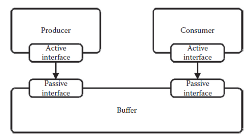
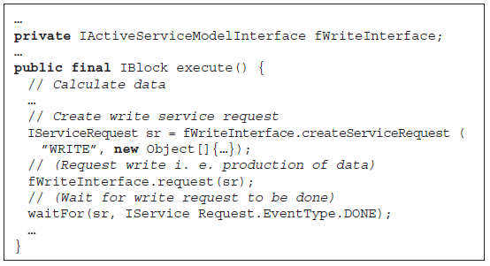
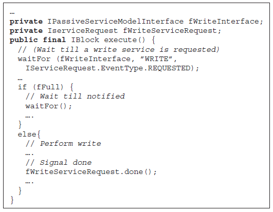
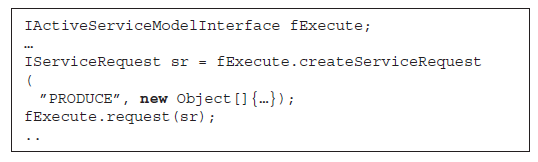
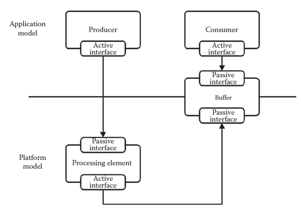
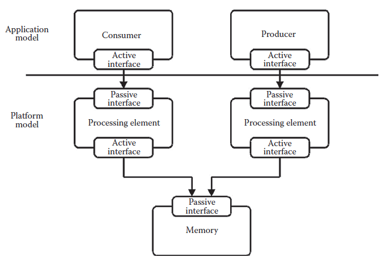

[11.9 <--- ](11_9.md) [   Зміст   ](README.md) [--> 11.11](11_11.md)

## 11.10. PRODUCER–CONSUMER EXAMPLE

To illustrate the use of the framework and elaborate on the different elements, a simple producer–consumer application is considered in the following.

The current implementation of the framework is in Java [19] and models are specified directly in Java as well through the use of a number of libraries developed for supporting the concept of service models, application models, platform models, and system models. In addition to the libraries, a simple graphical user interface has been implemented. The graphical user interface is built on the Eclipse [20] platform. It allows simulations to be controlled and inspected in a more convenient way than pure text-based simulations.

The first step to start using the presented framework is to construct an application model. The application model captures the functional behavior of the application in a number of tasks. It also specifies the communication requirements of the individual tasks explicitly, without any assumptions on the implementation, following the principle, on which the framework is founded, of separating the specification of functionality, communication, cost, and implementation. The application model serves as the functional reference in the refinement steps toward the final implementation. However, at this application level of abstraction, there is no notion of time or physical resources—hence only very rough performance estimates can be generated from a profiling of the application model.

[Figure 11.9 ](#_bookmark65)shows an application model composed of a consumer task and a producer task, which communicate through an abstract buffer. Both the tasks and the abstract buffer are modeled by service models. The producer has an active interface that is connected to the passive write interface of the buffer offering a write service.

**FIGURE 11.9** A simple application model consisting of a producer and a consumer communicating through an abstract buffer. 

Similarly, the consumer has an active interface that is connected to the passive read interface of the buffer model offering a read service. The producer and consumer models are the only active models, that is, only the producer and consumer models can initiate the request of services.

The service models are specified as one or more concurrently executing processes. Processes execute till they are blocked, waiting for some condition to become true. When the condition becomes true, the process can continue. Such behavior can be implemented using threads. The thread-context switching required, each time a process is being blocked or activated, has a high impact on simulation performance. Because we currently employ a global notion of time in the discrete event simulation engine, most processes will execute in a lock-step fashion. As a consequence, blocking and unblocking require frequent context switches. At the same time, threads provide more functionality than actually necessary now that only one process can be active at a time in the *physical* simulation engine. Thus, the desired behavior can be implemented in the much simpler concept of coroutines, which allows execution to be stopped and continued from the point where it was stopped. The current implementation of the simulation kernel thus uses a concept very similar to coroutines implemented in Java [19]. This requires that the designer of a process must divide the code body of the process into blocks. Blocks are executing sequentially and the execution of a block cannot be stopped. When the code contained in a block completes execution, the block returns a reference to the next block to be executed. In this way it is possible to model the blocking of a process on some condition and then when the condition becomes true, the process will resume its execution by executing the block of code returned by the previous executing block. Listing 11.1 shows the description of the main body of the producer service model.

In this case a single process is used to capture the behavior of the producer. A similar description is made for the consumer which, however, is not shown. The main body of the producer is actually an infinite loop in which the producer first calculates some value, then instantiates a write service request with the calculated value as argument and then requests the write service via an active service model interface. It is possible to request a service and then continue the execution directly, however. In such a case, a waitFor statement is used to block the producer service model until the requested write service has been executed, signaled by the firing of a service-done event. When the service-done event is fired, the producer will be activated and rescheduled for execution in the simulation engine. The producer will then resume execution continuing from the point at which it was blocked.

**LISTING 11.1** Body of the producer service model main process.

As can be seen, the write service request is used for both signaling the request of a write service and for transporting the actual data values that are to be exchanged between the producer and buffer service model and that will be written into the buffer, eventually. In this way, arbitrary data and objects can be transferred.

The buffer model is activated only when a service request is requested through one of its passive interfaces. In such a case, the behavior of the read and write services depends on the implementation of the buffer. So, by simply interchanging the buffer model, different blocking or nonblocking read and write schemes can be conveniently investigated.

As an example, the buffer service model described in Listing 11.2 uses a blocking write policy.

Again, the main body is actually executing an infinite loop. The main body starts executing a waitFor statement, blocking the execution till the arrival of a write service request, indicated by the firing of a service request requested event of type write. In this case, the waitFor statement is not instance-sensitive as in the case of the producer, which was blocking for a service request done event on the instance of the requested write service request. Instead, it is blocking until a service request requested event of the specified type is fired, indicating a request through the active service model interface. This implies that whenever a service request requested event of type write is fired, the write process of the buffer service model will be scheduled for execution in the simulation engine and the write process will become active and continue its execution from the point at which it halted. It then starts the actual execution of the requested write service. If the buffer is already full, the write process will block once more until an empty slot in the buffer becomes available. Otherwise, the actual write to the buffer will be executed and a service request done event will be fired to notify the requester, in this case the producer, that the service request has been executed. A read process that implements a blocking read policy can be described analogously. To generate quantitative performance estimates, the task and buffer service models of the application model must be mapped to the service models of a platform model, which creates a system model. Performance estimates relevant for evaluating the different platform options can then be extracted from the simulation of the system model. When the service models of an application model are mapped to the service models of a platform model, the service models of the application model can, when executed, request the services offered by the platform service models. In this way, the functionality of, for example, a task, is represented by an arbitrary number of requests to services. When these requests are executed, they model the execution of a particular operation or set of operations. The execution of a service in the platform model can include the modeling of required resource accesses and latency only, or, depending on the level of abstraction used to describe the service model, even include the actual functionality including bit true operations.

**LISTING 11.2** Main body of the write process of the buffer service model.

The mapping of the service models of the application model to the service models of the platform model need not be complete, that is, it is allowed that only a subset of the service models of the application model are mapped.

In this case, the unmapped service models of the application model represent all functionality (i.e., both the control flow and data operations within the application model) and have no costs associated. In [Figure 11.10](#_bookmark66), the consumer service model is an example of an unmapped service model.

On the other hand, the service model of the producer in Figure 11.10 is an example of a mapped task. As a first refinement step, the service model of the platform model, onto which the producer service model is mapped, is only used for latency modeling and for associating a cost with the execution of the producer. This is achieved by modeling a processing element that offers the service produce through a passive service model interface.

**FIGURE 11.10** Only the producer task is mapped to the processing element of the platform model. The consumer task is unmapped and modeled functionally only.

**LISTING 11.3** The refined production of data values, now depending on the platform model mapping.

The producer service model, as shown in Listing 11.3, then requests the produce service via its active service model interface during execution of the produce service, modeling a particular implementation in terms of cost and latency. In this example, the produce service is a very abstract service. In general, it is up to the designer to determine the level of abstraction used to associate with each service. One could also imagine the specification of required services for each arithmetic operation required to calculate the produced value. Currently, required services are specified manually, and to have a valid mapping of a service model from the application model onto the service model in a platform model, all required services must be provided by the service model of the platform model. The higher level of abstraction used to specify required services also implies that there are more options for mapping a model because the separation of functionality and implementation is retained.

**FIGURE 11.11** Only the producer task is mapped onto a processing element of the platform model. The consumer task is unmapped and modeled functionally only. Similarly, the FIFO buffer is only partially mapped, allowing it to be accessed from the active interface of the processing element in the platform model and at the same time be accessible from the active interface of the consumer task in the application model.

If preferred, it may also be possible to refine the processing element to include the calculation of actual data values. In this case, part of the behavior of the producer is modeled according to the functional specification in the application model, while another part is modeled according to a particular implementation in the platform model. As a result, different levels of abstractions are mixed seamlessly. This is particularly useful in the early stages of the design process where rough models of the platform may be constructed. In such a scenario, fast estimations of the effect of adding redundant hardware support for specific operations or even rough estimates of the effect of using multiprocessor systems, the effect of buffer sizes, etc. can be explored. This scenario may be refined to a level where cycle accurate and bit true models are described, but still leaving the control flow of the application to be handled in the application model and modeling only the cost of control operations in the platform model.

Such an example is seen in Figure 11.11, where the producer task could be implementing, for example, loop control in the application model directly. At the same time, it only implements part of the functionality of the loop body through requests to services offered by the service model of the processing element in the platform model onto which it is mapped. Figure 11.11 also shows how it is possible for the producer, mapped to and executing on the processing element, to communicate through a partially mapped buffer with the functional consumer service model, which is modeled only in the application model.

**FIGURE 11.12** Both the producer and consumer tasks are now mapped onto processing elements of the platform model. The FIFO buffer is mapped to the service model, modeling a block of shared memory to which both processing elements have access.

Finally, as shown in Figure 11.12, it is possible to model a full mapping of an application model onto a platform model, including both the active service models, in this case the producer and consumer running on one or more processing elements, and the passive service models, in this case the buffer mapped onto a block of memory. Still, it is possible to mix partially functional behavior modeled in the application model with the actual behavior of the implementation modeled in the platform model. In the most extreme case, the producer and consumer is represented solely by a set of requests to the services offered by the processing element of the platform model onto which it is mapped. In this case, the complete functionality is modeled in the platform model. Consequently, the complete task is represented by a service request image, directly equivalent to a binary application image of a processor. Another advantage of the support for such compiled tasks is that a platform model described at this level of abstraction can also be used for performance estimation of compiler technologies.

It is important to notice that service models described at different levels of abstraction can be mixed freely, providing great expressiveness and flexibility. Thus, depending on the level of abstraction used to describe the service models of a platform model, the execution of a requested service can model the actual functionality of the target architecture. Furthermore, the required resources and cost in terms of, for example, latency or power of the service can be included. Thereby, the functionality of the application model mapped onto the platform model is modeled according to the actual implementation, including, for example, the correct bit widths and availability of resources, simply by refining the platform model without changing the application model. It then becomes possible to annotate a given task in the application model with the cost of execution. This then adds a quantitative cost measure for use in the assessment of the platform.

[11.9 <--- ](11_9.md) [   Зміст   ](README.md) [--> 11.11](11_11.md)