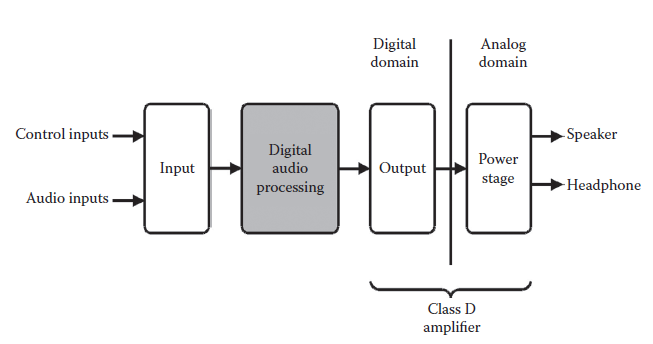
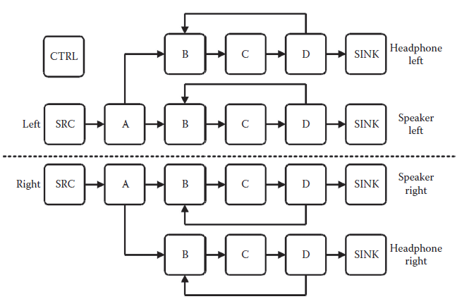

[11.10 <--- ](11_10.md) [   Зміст   ](README.md) [--> 11.12](11_12.md)

## 11.11. AN INDUSTRIAL CASE STUDY

As an illustration of the usage of the presented framework, an extract of the industrial case study presented in Tranberg-Hansen et al. [21] is given, in which a mobile audio processing platform developed by the Danish company Bang & Olufsen ICEpower was explored.

Як ілюстрацію використання представленої структури, витяг із промислового прикладу, представленого у Tranberg-Hansen та ін. Наведено [21], в якому досліджено мобільну платформу обробки звуку, розроблену датською компанією Bang & Olufsen ICEpower.

### 11.11.1 A Mobile Audio Process ing Platform

The mobile audio processing platform, illustrated in Figure 11.13, is comprised of a digital front end and a class D amplifier including the analog power stage on-chip. The platform offers stereo speaker and stereo headphone audio processing, resulting in a total of four audio channels being processed.

Мобільна платформа обробки аудіо, зображена на малюнку 11.13, складається з цифрового переднього кінця та підсилювача класу D, включаючи аналоговий каскад живлення на кристалі. Платформа пропонує обробку звуку стереодинаміків і стереонавушників, у результаті чого обробляються чотири аудіоканали.

The application receives one common stereo audio stream, consisting of a left and right audio stream. After the processing of algorithm **A**, these are split into four separate audio streams. Two are for speakers and two are for headphones, to allow a separate processing of the speaker and the headphone streams. The resulting application model is shown in [Figure 11.14](#_bookmark67).

Додаток отримує один загальний стереоаудіопотік, що складається з лівого та правого аудіопотоків. Після обробки алгоритмом **A** вони розбиваються на чотири окремі аудіопотоки. Два призначені для динаміків і два для навушників, щоб забезпечити окрему обробку потоків динаміків і навушників. Отриману модель програми показано на [Рис. 11.14] (#_bookmark67).

The platforms considered here are based on the use of an application-specific instruction set processor (ASIP), which is optimized to execute the type of algorithms necessary in the case-study application. The ASIP has a shallow three-stage pipeline and offers 61 different instructions. Even though the pipeline is shallow, the instructions are relatively complex: the processor offers a dedicated second-order IIR filter instruction that is used heavily in the application considered. Two versions of the ASIP were described: (1) a high-level model that models only the latency of each instruction offered and (2) a detailed cycle accurate and bit true model. The latency models do not model the actual functionality but only the resource access and latency of each service without any modeling of data dependencies.

Платформи, які тут розглядаються, базуються на використанні процесора набору інструкцій для конкретної програми (ASIP), який оптимізований для виконання типу алгоритмів, необхідних у прикладній програмі. ASIP має неглибокий триступеневий конвеєр і пропонує 61 різну інструкцію. Незважаючи на те, що конвеєр неглибокий, інструкції є відносно складними: процесор пропонує спеціальну інструкцію IIR-фільтру другого порядку, яка активно використовується в розглянутій програмі. Було описано дві версії ASIP: (1) модель високого рівня, яка моделює лише затримку кожної запропонованої інструкції, і (2) модель із детальною точністю циклу та бітовою правдою. Моделі затримки моделюють не фактичну функціональність, а лише доступ до ресурсів і затримку кожної служби без будь-якого моделювання залежностей даних.

 

**FIGURE** **11.13** Overview of the case-study platform.

**FIGURE 11.14** The application model of the case study. The application model contains 14 tasks (2 × A, 4 × B, 4 × C, 4 × D) for modeling the processing of the audio streams, 6 tasks (2 × SRC, 4 × SINK) for modeling the audio interfaces to and from the environment, as well as the environment itself, and finally an additional task (CTRL) for modeling the changes of the application state and/or control parameter changes that influence the individual audio processing parts.

**МАЛЮНОК 11.14** Модель застосування прикладу. Модель програми містить 14 завдань (2 × A, 4 × B, 4 × C, 4 × D) для моделювання обробки аудіопотоків, 6 завдань (2 × SRC, 4 × SINK) для моделювання аудіоінтерфейсів до та від середовища, а також саме середовище, і, нарешті, додаткове завдання (CTRL) для моделювання змін стану програми та/або змін параметрів керування, які впливають на окремі частини обробки звуку.

A number of platform models were constructed consisting of one to four ASIPs (ASIPx1-ASIPx4). Subsequently, the application model, capturing the functional requirements of the application, was mapped onto the platform models based on the latency ASIP service models. Because the latency-based service models do not model the actual functionality, the control flow of the application must be handled in the application model and the tasks mapped to the individual latency-based service models. This group of system models is hence named latency. The four platforms were then refined to use the bit true and cycle accurate service model of the ASIP using the compositional properties of the framework. The tasks of the application models were mapped to the ASIP service model processing elements. The tasks were represented as service request images generated using the existing compiler infrastructure associated with the ASIP. In this way, a one-to-one correspondence with the physical execution of the application can be obtained. These system models are referred to as compiled system models.

Було створено ряд моделей платформ, що складаються з одного-чотирьох ASIP (ASIPx1-ASIPx4). Згодом модель додатка, яка враховує функціональні вимоги додатка, була зіставлена на моделі платформи на основі моделей обслуговування ASIP із затримкою. Оскільки моделі обслуговування на основі затримки не моделюють фактичну функціональність, потік керування програмою потрібно обробляти в моделі додатка, а завдання відображати в окремих моделях обслуговування на основі затримки. Тому ця група системних моделей називається затримкою. Чотири платформи потім були вдосконалені для використання бітової істинної та циклічної моделі обслуговування ASIP з використанням композиційних властивостей каркаса. Завдання прикладних моделей були зіставлені з елементами обробки сервісної моделі ASIP. Завдання були представлені як зображення запитів на обслуговування, згенеровані за допомогою існуючої інфраструктури компілятора, пов’язаної з ASIP. Таким чином можна отримати однозначну відповідність із фізичним виконанням заявки. Ці системні моделі називають компільованими системними моделями.

To relate the simulation speed and quality of the performance estimates produced by the models described using the modified HCPN model-of-computation, a register transfer level implementation of the ASIPx1 platform was created in the hardware description language Verilog, referred to as the RTL model in the following.

Щоб зв’язати швидкість моделювання та якість оцінок продуктивності, вироблених моделями, описаними з використанням модифікованої моделі обчислень HCPN, була створена реалізація рівня передачі реєстру платформи ASIPx1 на мові опису обладнання Verilog, що називається моделлю RTL у наступному.

**TABLE** **11.2**  **Estimated Number  of Cycles for  the Processing of 3000 Samples in One Audio Channel at Three  Levels of Abstraction. A, B, C,** **and D Are the Different Tasks of the  Application Being Executed**

|           | **Latency** | **Compiled** | **RTL**     |
| --------- | ----------- | ------------ | ----------- |
| A         | 84,034      | 102,034      | 102,034     |
| B         | 123,041     | 129,384      | 129,384     |
| C         | 33,011      | 33,011       | 33,011      |
| D         | 153,051     | 168,056      | 168,056     |
| **Total** | **393,137** | **429,143**  | **429,143** |

### 11.11.2 Accuracy

The simulations performed, using the RTL model, were compared with the results obtained from the performance estimation framework.

Моделювання, виконане за допомогою моделі RTL, порівнювалося з результатами, отриманими за допомогою системи оцінки ефективності.

Table 11.2 shows the estimated number of cycles used to process a stereo audio channel produced by the framework for the latency and the compiled ASIPx1-system model and estimates extracted from the RTL model simulations. The table shows that the cycle estimates obtained from the latency model in which only the latencybased service models are used is *not* cycle accurate. The cycle estimates produced by the latency model are, in general, too optimistic. This is caused by the fact that the latency-based model does not take data dependencies into account. In the other range of the scale, in terms of accuracy, the table also shows the cycle estimates of the refined compiled model in which a cycle accurate and bit true modeling of the components was used. In this case, the cycle estimates are identical with the estimates obtained from the RTL model as can be seen from the table.

Таблиця 11.2 показує розрахункову кількість циклів, використаних для обробки стереофонічного аудіоканалу, створеного структурою для затримки та скомпільованої моделі системи ASIPx1, а також оцінки, отримані з симуляції моделі RTL. У таблиці показано, що оцінки циклу, отримані з моделі затримки, у якій використовуються лише моделі обслуговування на основі затримки, є *не* точними до циклу. Оцінки циклу, отримані моделлю затримки, загалом є надто оптимістичними. Це викликано тим, що модель на основі затримки не враховує залежності даних. В іншому діапазоні шкали, з точки зору точності, таблиця також показує оцінки циклу уточненої скомпільованої моделі, в якій використовувалося циклічне та бітове моделювання компонентів. У цьому випадку оцінки циклу ідентичні оцінкам, отриманим з моделі RTL, як видно з таблиці.

The RTL model constructed was also used to make a comparison of the functional results produced by the framework using the compiled version of the ASIPx1 platform, which proved to be 100% identical to the results obtained from the RTL model. Furthermore, the time required to describe the model using the presented framework is much less than the time required to describe the equivalent RTL model because of the higher level of abstraction used. More importantly, it is significantly faster to modify a model of the framework in case of bug fixes or functionality extensions. 

Створену RTL-модель також використовували для порівняння функціональних результатів, отриманих фреймворком з використанням скомпільованої версії платформи ASIPx1, яка виявилася на 100% ідентичною результатам, отриманим з RTL-моделі. Крім того, час, необхідний для опису моделі за допомогою представленої структури, набагато менший, ніж час, необхідний для опису еквівалентної моделі RTL через вищий рівень абстракції. Що ще важливіше, у разі виправлення помилок або розширення функціональності модифікувати модель фреймворку значно швидше.

### 11.11.3 Simulation Speed

[Table 11.3 ](#_bookmark68)shows the measured simulation speeds expressed as cycles per second for the individual system models investigated. Simulations were performed on a 2.0 GHz Intel Core 2 Duo processor with 2 GB RAM. What is most interesting is the substantial speedup seen when comparing the simulation speed of a detailed bit true and cycle accurate version of the ASIPx1-system model as opposed to the equivalent register transfer level simulation. The ASIPx1-system model runs at approximately 20 million cycles per second with all algorithms enabled, including data logging, and the functionally equivalent RTL description runs with approximately 15,000 cycles/second resulting in a speedup of more than 1000× compared to the RTL simulation.

[Таблиця 11.3 ](#_bookmark68) показує виміряні швидкості моделювання, виражені як цикли в секунду для окремих досліджуваних системних моделей. Моделювання проводилося на процесорі Intel Core 2 Duo з частотою 2,0 ГГц і 2 ГБ оперативної пам’яті. Що найбільш цікаво, так це значне прискорення, яке спостерігається при порівнянні швидкості моделювання версії моделі системи ASIPx1 з детальною бітовою і точною точністю до циклу на відміну від еквівалентного моделювання рівня передачі регістрів. Модель системи ASIPx1 працює зі швидкістю приблизно 20 мільйонів циклів на секунду з увімкненими всіма алгоритмами, включаючи реєстрацію даних, а функціонально еквівалентний опис RTL працює приблизно з 15 000 циклів на секунду, що призводить до прискорення більш ніж у 1000 разів порівняно з симуляцією RTL.

**TABLE** **11.3** **Obtainable Simulation Speed (Simulation Cycles per** **Second) of the Investigated System Models**

|        | **Latency** | **Compiled** | **RTL** |
| ------ | ----------- | ------------ | ------- |
| ASIPx1 | 21.7M       | 19.9M        | 15,324  |
| ASIPx2 | 18.6M       | 15.8M        | N/A     |
| ASIPx3 | 17.2M       | 13.8M        | N/A     |
| ASIPx4 | 15.9M       | 12.4M        | N/A     |

[11.10 <--- ](11_10.md) [   Зміст   ](README.md) [--> 11.12](11_12.md)