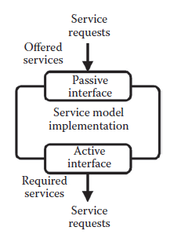

[11.1 <--- ](11_1.md) [   Зміст   ](README.md) [--> 11.3](11_3.md)

## 11.2. SERVICE MODELS

A service model captures the functional behavior of a component through the notion of services. Services are used to represent the functionality offered by a given component without making any assumptions about the actual implementation. Concrete examples of services are functions of a software library, arithmetic operations offered by a hardware functional unit, or the instructions offered by a processor depending on the level of abstraction used to model the component.

Сервісна модель фіксує функціональну поведінку компонента через поняття послуг. Послуги використовуються для представлення функціональних можливостей, пропонованих даним компонентом, без будь-яких припущень щодо фактичної реалізації. Конкретними прикладами послуг є функції бібліотеки програмного забезпечення, арифметичні операції, пропоновані функціональним блоком апаратного забезпечення, або інструкції, пропоновані процесором, залежно від рівня абстракції, який використовується для моделювання компонента.

The functionality offered by a service model, represented as services, can be requested by other service models through requests to the offered services. The detailed operation of a service model, that is, the implementation of the services offered, is hidden to other models. In that sense, a service model can be viewed as a black box component where the services offered are visible but not their implementation. Service models can be described at multiple levels of abstraction and need not be described at the same level to communicate. The clear separation of functionality and implementation through the concept of services implies that there is no distinction between hardware or software components seen from the point of view of the modeling framework. It is the cost associated with each service, which eventually dictates whether a component is modeling a hardware or software component.

Функціональність, пропонована моделлю обслуговування, представлена як служби, може запитуватися іншими моделями послуг через запити до запропонованих послуг. Детальна робота моделі обслуговування, тобто реалізація пропонованих послуг, прихована для інших моделей. У цьому сенсі модель обслуговування можна розглядати як компонент чорної скриньки, де видно пропоновані послуги, але не їх реалізацію. Сервісні моделі можна описати на кількох рівнях абстракції, і для зв’язку їх не потрібно описувати на одному рівні. Чітке поділ функціональних можливостей і реалізації через концепцію послуг передбачає відсутність різниці між апаратними чи програмними компонентами з точки зору структури моделювання. Це вартість, пов’язана з кожною послугою, яка зрештою визначає, чи буде компонент моделювати апаратний чи програмний компонент.

A service model is composed of one or more *service model interfaces* and a *service model implementation* as illustrated in Figure 11.2. Interfaces are used to connect models, allowing models to communicate through the exchange of service requests. In this way, there is a clear separation of how behavior and communication of a component is described. The service model interfaces provide a uniform way of accessing the services offered and enabling service models to communicate and facilitate structural composition by specifying the sets of services that are offered and are required by the model. It is the active interfaces that specify required services and the passive interfaces that specify the offered services. In this way, structural composition is dictated by the interfaces that each service model implements and subsequently by the services offered and required. Only models fulfilling the required–provided service constraints can be connected. Although the interfaces dictate the rules of composition, the service model implementation is responsible for specifying the actual behavior of the service model. The specification implements the functionality of each of the services that are offered while optionally associating a cost with them.

Сервісна модель складається з одного або кількох *інтерфейсів сервісної моделі* та *реалізації сервісної моделі*, як показано на малюнку 11.2. Інтерфейси використовуються для підключення моделей, що дозволяє моделям спілкуватися через обмін запитами на обслуговування. Таким чином, існує чітке розділення того, як описується поведінка та комунікація компонента. Інтерфейси моделі сервісу забезпечують уніфікований спосіб доступу до пропонованих послуг і дозволяють моделям сервісів спілкуватися та сприяти структурній композиції, вказуючи набори послуг, які пропонуються та необхідні моделлю. Саме активні інтерфейси визначають необхідні послуги, а пасивні – пропоновані послуги. Таким чином, структурна композиція визначається інтерфейсами, які реалізує кожна модель сервісу, а згодом – пропонованими та необхідними послугами. Можна підключити лише моделі, які відповідають вимогам щодо надання послуг. Хоча інтерфейси диктують правила композиції, реалізація сервісної моделі відповідає за визначення фактичної поведінки сервісної моделі. Специфікація реалізує функціональні можливості кожної з послуг, які пропонуються, і за бажанням пов’язує з ними вартість.

**FIGURE 11.2** The service model basics.

The use of services allows a decoupling of the functionality and of the implementation of a component. In this fashion, several service models can offer the same service, implemented differently, however, and thus having different associated cost. In this way different implementations can be compared and evaluated based on a specific, preferred cost metric.

Використання служб дозволяє відокремити функціональність і реалізацію компонента. У такий спосіб кілька моделей послуг можуть пропонувати ту саму послугу, однак реалізовану по-різному, і, отже, мати різну пов’язану вартість. Таким чином різні реалізації можна порівнювати та оцінювати на основі конкретного бажаного показника вартості.

Intermodel communication is handled through service requests that have the benefit of allowing the initiator model to request one of the services specified, as required by the model, without knowing any details about the model that provides the required service or how it is implemented. When the service is requested, the service model providing the required service will execute the requested service according to the specification of the model. When the service has been executed, the initiator model is notified that the execution of the service requested has completed.

Міжмодельний зв’язок обробляється за допомогою запитів на обслуговування, перевага яких полягає в тому, що модель ініціатора може запитувати одну з послуг, визначених відповідно до вимог моделі, не знаючи жодних деталей про модель, яка надає необхідну послугу, або про те, як вона реалізована. Коли послуга запитується, сервісна модель, що надає необхідну послугу, виконає запитану послугу відповідно до специфікації моделі. Коли послугу було виконано, модель ініціатора повідомляється про те, що виконання запитуваної послуги завершено.

[11.1 <--- ](11_1.md) [   Зміст   ](README.md) [--> 11.3](11_3.md)