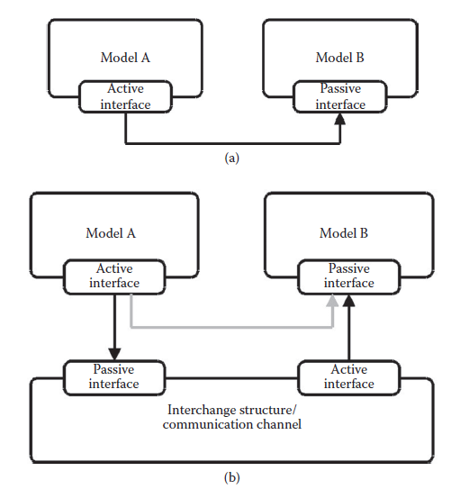
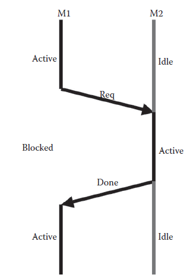

[11.3 <--- ](11_3.md) [   Зміст   ](README.md) [--> 11.5](11_5.md)

## 11.4. SERVICE REQUESTS

As mentioned briefly before, all intermodel communication is modeled using service requests exchanged via active–passive interface connections.

Як коротко згадувалося раніше, усі міжмодельні комунікації моделюються за допомогою запитів на обслуговування, якими обмінюються через з’єднання активного–пасивного інтерфейсу.

A service request can be viewed as a communication transaction between two components, similar to the concept of transaction-level modeling [11]. However, it is the implementation of the two service models that will determine if the service request will be implemented as a function call from, for example, a sequential executing piece of code to a function library or if it will be a bus transfer. Communication refinement is supported in several ways. Service requests can include arbitrary data structures as preferred by the designer of the model. If a communication channel must be modeled, an extra service model can be inserted between the two primary communicating service models as illustrated in Figure 11.3. The extra service model inserted will be transparent to the two communicating service models. This allows, for example, simple properties such as reliability of the communication channel to be modeled. More elaborate communication interconnects such as buses and networkon-chips can also be modeled.

Сервісний запит можна розглядати як комунікаційну транзакцію між двома компонентами, подібно до концепції моделювання на рівні транзакцій [11]. Однак саме реалізація двох моделей сервісу визначатиме, чи буде запит на сервіс реалізований як виклик функції, наприклад, від фрагмента коду, що виконується послідовно, до бібліотеки функцій, чи це буде передача по шині. Покращення зв’язку підтримується кількома способами. Запити на обслуговування можуть включати довільні структури даних, які віддають перевагу розробнику моделі. Якщо потрібно змоделювати канал зв’язку, додаткову модель сервісу можна вставити між двома основними моделями сервісу зв’язку, як показано на малюнку 11.3. Вставлена додаткова модель сервісу буде прозорою для двох моделей сервісу, що спілкуються. Це дозволяє, наприклад, моделювати прості властивості, такі як надійність каналу зв'язку. Також можна моделювати складніші комунікаційні з’єднання, такі як шини та мережеві мікросхеми.

**FIGURE 11.3** Intermodel communication. a) Model A is the active model, initiating communication with model B. b) The communication medium is now modeled explicitely using a separate service model.

**МАЛЮНОК 11.3** Міжмодельне спілкування. a) Модель A є активною моделлю, яка ініціює зв’язок із моделлю B. b) Середовище зв’язку тепер моделюється явно за допомогою окремої моделі обслуговування.

A service request specifies the requested service, a list of arguments (which can be empty), and a unique request number used to identify the service request, for example, to annotate it with a cost. The argument list can be used to provide input arguments to the implementation of a service, for example, to allow modeling of dynamic dependencies or arithmetic operations on actual data values. Depending on the implementation of the service model, an arbitrary number of service requests can be processed in parallel, for example, modeling operating system schedulers, pipelines, very long instruction word, single instruction multiple data, and super scalar architectures.

У запиті на послугу вказується запитана послуга, список аргументів (який може бути порожнім) і унікальний номер запиту, який використовується для ідентифікації запиту на послугу, наприклад, щоб позначити його вартістю. Список аргументів можна використовувати для надання вхідних аргументів для реалізації служби, наприклад, щоб дозволити моделювання динамічних залежностей або арифметичних операцій над фактичними значеннями даних. Залежно від реалізації моделі обслуговування довільна кількість запитів на обслуговування може оброблятися паралельно, наприклад, моделювати планувальники операційної системи, конвеєри, дуже довге слово інструкції, одну інструкцію з кількома даними та суперскалярні архітектури.

A service request can be requested as either blocking or nonblocking. It is the designer of a model who determines whether a service request is requested as a blocking or a nonblocking request. The request of a blocking service request implies that the process of the source model that requested the service request is put into its blocked state until it has been executed, indicated by the destination model, as illustrated in Figure 11.4. A nonblocking service request, on the other hand, will be requested and the process of the source model, which requested the service request, will proceed—not waiting for the execution of the request to finish.

Запит на послугу можна запитувати як блокуючий або неблокуючий. Розробник моделі визначає, чи запитується запит на послугу як блокуючий чи неблокуючий запит. Запит блокуючого запиту служби означає, що процес вихідної моделі, який запитав запит служби, переводиться в заблокований стан, доки він не буде виконано, як зазначено моделлю призначення, як показано на малюнку 11.4. З іншого боку, буде подано запит на неблокуючий сервісний запит, і процес вихідної моделі, яка запитала сервісний запит, продовжиться, не чекаючи завершення виконання запиту.

**FIGURE 11.4** A process of model *M*1 requests a blocking service request from *M*2. *M*1 is blocked till the completion of the request.

**МАЛЮНОК 11.4** Процес моделі *M*1 запитує запит на службу блокування від *M*2. *M*1 заблоковано до завершення запиту.

A number of events are associated with a service request to notify the requester and receiver model of different phases of the lifetime of the service request. The lifetime and corresponding events of a service request are as follows:

Ряд подій пов’язаний із запитом на обслуговування, щоб сповістити модель запитувача та одержувача про різні фази життєвого циклу запиту на обслуговування. Нижче наведено тривалість життя та відповідні події запиту на обслуговування:

1. The service request is being requested, indicated by a service request requested event.

2. The service request is being accepted for processing of the model by which it is requested, indicated by a service request accepted event.

3. The service request may be blocked, indicated by a service request blocked event.

4. The service request has been executed, indicated by a service request done event.

1. Надсилається запит на послугу, що позначається подією запиту на послугу.

2. Запит на обслуговування приймається для обробки моделі, за допомогою якої він запитується, що вказується подією прийнятого запиту на обслуговування.

3. Сервісний запит може бути заблоковано, про що свідчить подія «Сервісний запит заблоковано».

4. Запит на обслуговування виконано, про що свідчить подія виконання запиту на обслуговування.

When a service request is being requested at a model interface, the receiver model has the possibility of receiving a notification to change its status to active. The requesting service model will similarly have the possibility of being notified when the request is accepted for processing in the receiver model (i.e., before the actual execution of the service request) and when it has finished executing the service request. During the evaluation of a service request, the request itself can become blocked because of one or more requirements not being fulfilled (e.g., because of mutually exclusive access to resources and missing availability of data operands). When a service request is being blocked during evaluation, the source model is notified to allow it to take appropriate actions, if any. However, the author of the requesting service model need not be interested in receiving these notifications and, hence, the model is allowed to ignore these. In this way, it is the designer who chooses event sensitivity for the individual processes of the service model implementation.

Коли в інтерфейсі моделі надсилається запит на послугу, модель отримувача має можливість отримати сповіщення про зміну свого статусу на активний. Сервісна модель, яка запитує, також матиме можливість отримати сповіщення, коли запит буде прийнято для обробки в моделі отримувача (тобто до фактичного виконання сервісного запиту) і коли вона завершить виконання сервісного запиту. Під час оцінки запиту на послугу сам запит може бути заблоковано через невиконання однієї або кількох вимог (наприклад, через взаємовиключний доступ до ресурсів і відсутність доступності операндів даних). Коли запит на службу блокується під час оцінювання, вихідна модель отримує сповіщення, щоб дозволити їй виконати відповідні дії, якщо такі є. Однак автор запитуваної моделі сервісу не повинен бути зацікавлений в отриманні цих сповіщень, і, отже, моделі дозволено ігнорувати їх. Таким чином, саме дизайнер вибирає чутливість до подій для окремих процесів реалізації сервісної моделі.

To handle multiple simultaneous service requests, the designer of a service model must incorporate a desired arbitration scheme. The arbitration scheme may be an integrated part of the model or it may be a separate service model itself. The latter is often advantageous if different arbitration schemes are to be investigated.

Щоб обробляти кілька одночасних запитів на обслуговування, розробник моделі обслуговування повинен включити бажану схему арбітражу. Арбітражна схема може бути інтегрованою частиною моделі або сама по собі може бути окремою моделлю послуг. Останнє часто є вигідним, якщо необхідно досліджувати різні арбітражні схеми.

[11.3 <--- ](11_3.md) [   Зміст   ](README.md) [--> 11.5](11_5.md)