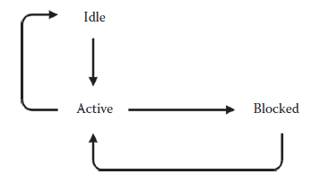
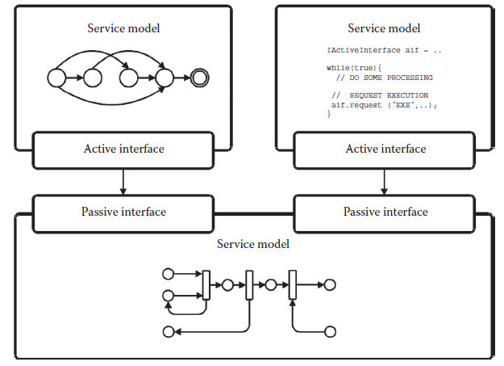
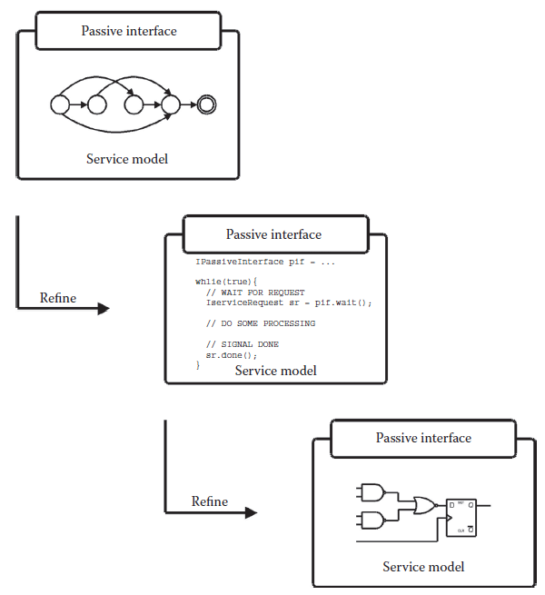

[11.4 <--- ](11_4.md) [   Зміст   ](README.md) [--> 11.6](11_6.md)

## 11.5. SERVICE MODEL IMPLEMENTATIONS

To capture the behavior of a service model, the service model implementation must be defined. It is the service model implementation that captures the actual behavior of a service, possibly taking implementation-specific details into consideration. A service model must provide an implementation of all services offered by the passive interfaces implemented and optionally specify the latency, resource requirements, and cost of each service. There are no restrictions on how a service should be implemented. The abstract representation of the functionality, using services, implies that there is no immediate distinction between the representations of the hardware or software components. Whether a service model represents a hardware or software component is determined solely by its implementation and, eventually, its cost and thus an elegant unified modeling approach can be achieved.

Щоб охопити поведінку моделі сервісу, необхідно визначити реалізацію моделі сервісу. Саме реалізація моделі сервісу фіксує фактичну поведінку сервісу, можливо, беручи до уваги деталі реалізації. Сервісна модель повинна забезпечувати реалізацію всіх послуг, які пропонуються реалізованими пасивними інтерфейсами, і додатково вказувати затримку, вимоги до ресурсів і вартість кожної служби. Немає жодних обмежень щодо способу реалізації послуги. Абстрактне представлення функціональних можливостей, що використовують сервіси, означає, що немає безпосередньої різниці між представленнями апаратних або програмних компонентів. Те, чи представляє модель сервісу апаратний чи програмний компонент, визначається виключно його реалізацією та, зрештою, його вартістю, і, таким чином, можна досягти елегантного уніфікованого підходу до моделювання.

**FIGURE 11.5** The possible states of a process of a service model.

### 11.5.1 Model-of-Computation

To capture the implementation of a service model, concurrently executing processes are used as the general execution semantics. The service model implementation can contain one or more processes that each have the possibility of executing concurrently. A process executes sequentially and interprocess communication within a service model is done through events communicated via channels in which the order of events is preserved. All intermodel communication between processes residing in different service models is done using service requests via the service model interfaces defined by the model in which the processes reside.

Щоб зафіксувати реалізацію моделі сервісу, паралельно виконувані процеси використовуються як загальна семантика виконання. Реалізація сервісної моделі може містити один або кілька процесів, кожен з яких може виконуватися одночасно. Процес виконується послідовно, а зв’язок між процесами в моделі сервісу здійснюється через події, які передаються через канали, у яких зберігається порядок подій. Усі міжмодельні зв’язки між процесами, що знаходяться в різних моделях обслуговування, здійснюються за допомогою запитів на обслуговування через інтерфейси моделі обслуговування, визначені моделлю, в якій знаходяться процеси.

A process can be in one of three states: idle, active, or blocked as shown in Figure 11.5, which also shows the valid transitions between the possible states. If a process is idle, it indicates that it is inactive but ready for execution upon activation. If a process is active, it is currently executing. If a process is blocked, it is currently waiting for a condition to become true and will not resume execution until this condition has been fulfilled.

Процес може перебувати в одному з трьох станів: неактивний, активний або заблокований, як показано на малюнку 11.5, де також показано допустимі переходи між можливими станами. Якщо процес неактивний, це означає, що він неактивний, але готовий до виконання після активації. Якщо процес активний, він зараз виконується. Якщо процес заблоковано, він зараз очікує, поки умова стане істинною, і не відновить виконання, доки ця умова не буде виконана.

To overcome the problem of finding a single golden model-of-computation for capturing all parts of an embedded system, the service model concept supports the existence of multiple different models-of-computation within the same model instance. [Figure 11.6 ](#_bookmark63)shows an example of a system composed of service models, each described by a different model-of-computation. The service model concept allows these to coexist and communicate through well-defined communication semantics in the form of service requests being exchanged via active–passive interface connections.

Щоб подолати проблему пошуку єдиної золотої моделі обчислень для охоплення всіх частин вбудованої системи, концепція сервісної моделі підтримує існування кількох різних моделей обчислень в одному екземплярі моделі. [Малюнок 11.6] (#_bookmark63) показує приклад системи, що складається з моделей обслуговування, кожна з яких описується окремою моделлю обчислень. Концепція моделі обслуговування дозволяє їм співіснувати та спілкуватися через чітко визначену семантику зв’язку у формі запитів на обслуговування, якими обмінюються через активні та пасивні з’єднання інтерфейсу.

Interesting work on supporting multiple different models-of-computation within a single model instance is presented in the theoretically well-founded tagged signal model [12] and the absent-event approach [13]. Both approaches show that it is possible to allow models-of-computation, defined within different domains, to be coupled together and allowed to coexist within the same model instance. In principle, the service model concept does not impose a particular model-of-computation. The individual models can be described using any preferred model-of-computation as long as communication between models is performed using service requests.

Цікава робота з підтримки кількох різних моделей обчислень в одному екземплярі моделі представлена в теоретично добре обґрунтованій моделі сигналу з тегами [12] і підході за відсутністю подій [13]. Обидва підходи показують, що можна дозволити моделям обчислень, визначеним у різних доменах, поєднуватися разом і дозволяти співіснувати в одному екземплярі моделі. В принципі, концепція моделі обслуговування не нав’язує конкретну модель обчислень. Окремі моделі можна описати за допомогою будь-якої бажаної моделі обчислення, якщо зв’язок між моделями здійснюється за допомогою запитів на обслуговування.

Currently, the focus of the framework is the modeling of the discrete elements of an embedded system only, that is, hardware and software parts, which can be represented by untimed, synchronous, or discrete event–based models-of-computation. To synchronize models described using different models-of-computation and ensure a correct execution order, the underlying simulation engine is assumed to be based on a global notion of time that is distributed to all processes, no matter which model-of-computation is used. This contrasts with both the tagged signal model and the absent event approach. The former distributes time to the different processes through events, while the latter relies on the special absent event. The drawback of using a global notion of time is that processes cannot execute independently, which impacts simulation performance—it is very hard to parallelize such a simulation engine—the advantage, however, is that great expressiveness can be obtained in such a simulation engine. The simulation engine also tags all events with a simulation time value so that the event can be related to a particular point of simulation time, no matter which model-of-computation was used to describe the process that generated the event. However, this does not mean the individual service models must use this time tag and it is merely a practical requirement to schedule the execution order of the processes of the individual service models.

На даний момент у центрі уваги інфраструктури – моделювання лише дискретних елементів вбудованої системи, тобто апаратних і програмних частин, які можуть бути представлені безчасовими, синхронними або моделями обчислень на основі дискретних подій. Щоб синхронізувати моделі, описані з використанням різних моделей обчислень, і забезпечити правильний порядок виконання, передбачається, що основний механізм моделювання базується на глобальному понятті часу, який розподіляється на всі процеси, незалежно від того, яка модель обчислень використовується . Це контрастує як з моделлю сигналу з тегами, так і з підходом за відсутністю події. Перший розподіляє час між різними процесами через події, а другий покладається на спеціальну відсутню подію. Недоліком використання глобального поняття часу є те, що процеси не можуть виконуватися незалежно, що впливає на продуктивність моделювання — дуже важко розпаралелювати такий механізм моделювання — однак перевага полягає в тому, що в такому механізмі моделювання можна отримати велику виразність. Механізм моделювання також позначає всі події значенням часу моделювання, щоб подію можна було пов’язати з певним моментом часу моделювання, незалежно від того, яка модель обчислення використовувалася для опису процесу, який породив подію. Однак це не означає, що окремі моделі послуг повинні використовувати цей тег часу, і це лише практична вимога для планування порядку виконання процесів окремих моделей послуг.

**FIGURE 11.6** The service model concept provides support for heterogeneous models-of- computation to coexist.

Service models that have processes described using untimed models-of-computation obviously have no notion of time and perform computation and communication in zero time. This implies that a process of a service model that is described using an untimed model-of-computation is activated on the request of services offered by the model only (and not based on a specific point in time). The corresponding process then evaluates and produces possible outgoing service requests immediately.

Сервісні моделі, які мають процеси, описані за допомогою моделей обчислень без часу, очевидно, не мають поняття часу та виконують обчислення та зв’язок за нульовий час. Це означає, що процес сервісної моделі, який описується за допомогою моделі обчислень без часу, активується лише за запитом послуг, які пропонує модель (а не на основі конкретного моменту часу). Потім відповідний процес оцінює та негайно створює можливі вихідні запити на обслуговування.

Service models having processes described using synchronous models-of- computation do not use an explicit notion of time. Instead, a notion of time slots is used and each execution cycle lasts one time slot. In order for such models-of- computation to be used, the service model using a model-of-computation within this domain must specify the frequency of how often the processes of the model should be allowed to execute. The simulation engine will then ensure that the processes are evaluated at the specified frequency, in this way implicitly defining the actual time of the current time slot of the model.

Сервісні моделі, що містять процеси, описані за допомогою синхронних моделей обчислень, не використовують явного поняття часу. Замість цього використовується поняття часових інтервалів, і кожен цикл виконання триває один часовий інтервал. Щоб використовувати такі моделі обчислень, модель сервісу, що використовує модель обчислень у цьому домені, повинна визначати частоту того, як часто має бути дозволено виконувати процеси моделі. Потім механізм моделювання гарантує, що процеси оцінюються із заданою частотою, таким чином неявно визначаючи фактичний час поточного часового інтервалу моделі.

Discrete-time models-of-computation are supported directly by the simulation engine, which provides a global notion of time that can be accessed from all processes. In this way, a process can describe behaviors that use timing information directly.

Моделі обчислень з дискретним часом підтримуються безпосередньо системою моделювання, яка забезпечує глобальне уявлення про час, доступ до якого можна отримати з усіх процесів. Таким чином, процес може описати поведінку, яка безпосередньо використовує інформацію про час.

The generality of service models imposes few restrictions on the model-of- computation used to capture the behavior of the component being modeled. New models-of-computation can be added freely under the constraint that they *must* implement intermodel communication through the exchange of service requests and they must fit under the general execution semantics defined—that is, it must be possible to implement the preferred model-of-computation as one or more concurrently executing processes. It is the implementation of the service models that determines their actual behavior, and thus, it is the designer of the service model implementation who determines the model-of-computation used.

Загальність моделей обслуговування накладає кілька обмежень на модель обчислень, яка використовується для фіксації поведінки компонента, що моделюється. Нові моделі-обчислень можна додавати вільно за умови, що вони *мають* реалізовувати міжмодельний зв’язок через обмін запитами на обслуговування, і вони повинні підходити під визначену загальну семантику виконання, тобто має бути можливим реалізувати бажану модель -of-computation як один або більше процесів, що виконуються одночасно. Саме реалізація моделей сервісу визначає їх фактичну поведінку, і, отже, саме дизайнер реалізації моделі сервісу визначає використовувану модель обчислень.

### 11.5.2 Composition

To tackle complexity, the service model concept supports both hierarchy and abstraction-level refinement. Here, the term abstraction-level refinement covers the process of going from a high level of abstraction to a lower level through gradual refinements of a given component, where a component may be replaced by a more detailed version ([Figure 11.7](#_bookmark64)).

Щоб усунути складність, концепція моделі обслуговування підтримує як ієрархію, так і уточнення на рівні абстракції. Тут термін уточнення на рівні абстракції охоплює процес переходу від високого рівня абстракції до нижчого шляхом поступового уточнення даного компонента, де компонент може бути замінений більш детальною версією ([Малюнок 11.7](#_bookmark64 )).

This type of refinement is supported quite easily by the service model concept because of the fundamental property of the service model in which the functionality offered by a model is separated from the implementation. Two service models implementing the same set of interfaces, and thus offering the same set of services, can be freely interchanged, even though they differ in the level of detail used to model the functionality offered.

Цей тип уточнення досить легко підтримується концепцією сервісної моделі через фундаментальну властивість сервісної моделі, в якій функціональні можливості, пропоновані моделлю, відокремлені від реалізації. Дві моделі послуг, що реалізують однаковий набір інтерфейсів і, таким чином, пропонують однаковий набір послуг, можна вільно замінювати, навіть якщо вони відрізняються рівнем деталізації, який використовується для моделювання пропонованої функціональності.

Furthermore, service models can be constructed hierarchically to investigate different implementations of a specific subpart of the model or to hide model complexity. One service model can be composed of several subservice models. However, it will then be only the interfaces implemented by the topmost model in the hierarchy that dictate which services are offered to other models. The hierarchical properties, combined with the use of interfaces, imply that designers who are using a model need only know the details of the interfaces implemented by the model and need not be concerned about the implementation details at lower levels in the model hierarchy.

Крім того, сервісні моделі можна побудувати ієрархічно, щоб досліджувати різні реалізації конкретної частини моделі або приховувати складність моделі. Одна модель сервісу може складатися з кількох моделей субсервісу. Однак тоді лише інтерфейси, реалізовані найвищою моделлю в ієрархії, визначатимуть, які послуги пропонуються іншим моделям. Ієрархічні властивості в поєднанні з використанням інтерфейсів означають, що дизайнери, які використовують модель, повинні знати лише деталі інтерфейсів, реалізованих моделлю, і не повинні турбуватися про деталі реалізації на нижчих рівнях ієрархії моделі.

To summarize, service models can be viewed as black-box components. The behavior of a service model is determined by the services requested via its active interfaces. The use of interfaces and service request, on the one hand, implies that there are no restrictions on the service model implementation, which is part of the service model that actually determines the behavior. This also implies that in principle there are no restrictions on which model-of-computation is used to describe the implementation of a service model.

Підводячи підсумок, моделі обслуговування можна розглядати як компоненти чорної скриньки. Поведінка моделі обслуговування визначається послугами, запитуваними через її активні інтерфейси. Використання інтерфейсів і сервісного запиту, з одного боку, передбачає відсутність обмежень на реалізацію сервісної моделі, яка є частиною сервісної моделі, яка фактично визначає поведінку. Це також означає, що в принципі немає обмежень на те, яка модель обчислень використовується для опису реалізації моделі сервісу.

**FIGURE** **11.7** Abstraction-level refinement.

[11.4 <--- ](11_4.md) [   Зміст   ](README.md) [--> 11.6](11_6.md)