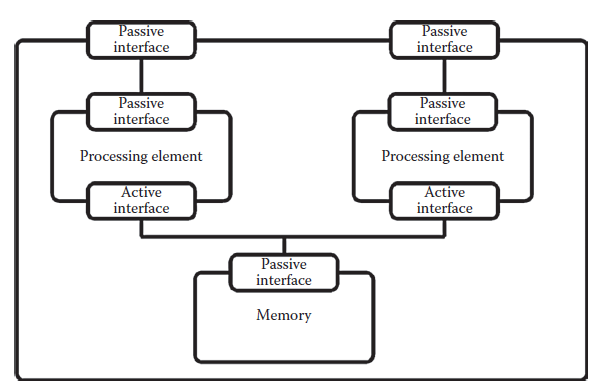

[11.6 <--- ](11_6.md) [   Зміст   ](README.md) [--> 11.8](11_8.md)

## 11.7. ARCHITECTURE MODELING

In contrast to the application models, the goal of the platform model is to capture a specific implementation of the functionality offered by the target architecture. In order for a platform model to be valid, it must offer *all* the services required by the application models that are mapped onto the platform. Several platform models can offer the same set of services, representing the same functionality, through different implementations. The differentiating factor will then be the cost associated with the execution of the applications on each of the candidate platforms.

На відміну від прикладних моделей, метою моделі платформи є охоплення конкретної реалізації функціональності, запропонованої цільовою архітектурою. Щоб модель платформи була дійсною, вона має пропонувати *всі* послуги, необхідні моделям додатків, які відображаються на платформі. Кілька моделей платформ можуть пропонувати той самий набір послуг, що представляють ту саму функціональність, через різні реалізації. Фактором диференціації буде вартість, пов’язана з виконанням заявок на кожній із платформ-кандидатів.

The platform model of a given target architecture is implemented as a service model having one or more passive service model interfaces, as illustrated in Figure 11.8. Platform models are composed of an arbitrary number of service models, each modeling a component of the architecture, thereby forming a hierarchical model. The compositional properties of service models even allow multiple platform models to be merged into a single platform model. In this way, a modular approach can be taken in which subblocks of the target architecture are modeled and explored individually, if preferred.

Модель платформи даної цільової архітектури реалізована як модель сервісу, що має один або більше інтерфейсів пасивної моделі сервісу, як показано на малюнку 11.8. Моделі платформи складаються з довільної кількості моделей сервісів, кожна з яких моделює компонент архітектури, утворюючи таким чином ієрархічну модель. Композиційні властивості моделей обслуговування навіть дозволяють об’єднати кілька моделей платформи в одну модель платформи. Таким чином можна застосувати модульний підхід, у якому субблоки цільової архітектури моделюються та досліджуються окремо, якщо це бажано.

**FIGURE 11.8** Illustration of a simple platform model consisting of two processing elements both connected to a block of shared memory. 

The resulting set of services offered by a platform model is dictated by the composition of internal service models. From the tasks of the application models, which are mapped to the platform, the services of the platform model are accessible through the passive service model iinterfaces. This allows the tasks to request the services offered during simulation and so models the execution of the tasks.

Отриманий набір послуг, пропонованих моделлю платформи, продиктований складом внутрішніх моделей обслуговування. Із завдань моделей додатків, які відображаються на платформі, сервіси моделі платформи доступні через пасивні інтерфейси моделі обслуговування. Це дозволяє завданням запитувати послуги, запропоновані під час моделювання, і таким чином моделює виконання завдань.

The platform model also specifies how the service models, of which it is composed, are interconnected, thereby specifying the communication possibilities of the models. There are restrictions neither on how intercomponent communication is modeled, nor on the level of abstraction that is used. This implies that, in principle, all types of intercomponent communication methods are supported. In this way, platform models can represent arbitrary target architectures.

Модель платформи також визначає, як моделі обслуговування, з яких вона складається, взаємопов’язані, тим самим уточнюючи комунікаційні можливості моделей. Немає обмежень ні на те, як моделюється міжкомпонентний зв’язок, ні на рівень абстракції, який використовується. Це означає, що в принципі підтримуються всі типи методів міжкомпонентного зв'язку. Таким чином, моделі платформ можуть представляти довільні цільові архітектури.

[11.6 <--- ](11_6.md) [   Зміст   ](README.md) [--> 11.8](11_8.md)