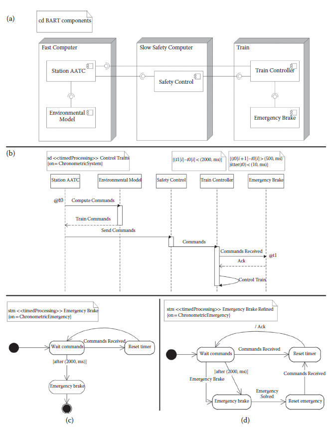

[12 <--- ](12.md) [   Зміст   ](README.md) [--> 12.2](12_2.md)

## 12.1. INTRODUCTION

Model-based engineering (MBE) [1] approaches support the use of models throughout the development process from requirements elicitation, to architecture specification, to system analysis, and deployment. Models can be leveraged in a variety of ways. During requirements elicitation, models help in defining the problem domain and communicating with stakeholders. During development, models can be used to define clear interfaces between components developed by separate suppliers. Modeling can also provide support for system synthesis by using model transformations and automatic code generation. For analysis, models can be used to verify system properties before the system is actually deployed. Moreover, models can also be used at runtime to monitor the system behavior and identify compliance to behavior interfaces and QoS properties.

Підходи розроблення на основі моделей (MBE) [1] підтримують використання моделей протягом усього процесу розробки від визначення вимог до специфікації архітектури, аналізу системи та розгортання. Моделі можна використовувати різними способами. Під час виявлення вимог моделі допомагають визначити предметну область і спілкуватися із зацікавленими сторонами. Під час розробки моделі можна використовувати для визначення чітких інтерфейсів між компонентами, розробленими окремими постачальниками. Моделювання також може забезпечити підтримку системного синтезу за допомогою перетворень моделі та автоматичної генерації коду. Для аналізу моделі можна використовувати для перевірки властивостей системи до фактичного розгортання системи. Крім того, моделі також можна використовувати під час виконання для моніторингу поведінки системи та визначення відповідності інтерфейсам поведінки та властивостям QoS.

Notably, modeling languages are most useful when they fulfill some key requirements. Two important requirements for modeling real-time embedded systems are a clear definition of the semantics of models together with the ability to guarantee that models are consistent. In fact, without a consistent set of models and a precise and complete semantics it is impossible to leverage models to synthesize code or to verify properties of the modeled system, which are two important activities in MBE of embedded systems. It is worth noting that consistency and semantics are two closely related aspects of a language. In fact, without a formal semantics it is impossible to prove the absence of inconsistencies.

Примітно, що мови моделювання є найбільш корисними, коли вони відповідають деяким ключовим вимогам. Двома важливими вимогами до моделювання вбудованих систем реального часу є чітке визначення семантики моделей разом із можливістю гарантувати узгодженість моделей. Фактично, без узгодженого набору моделей і точної і повної семантики неможливо використовувати моделі для синтезу коду або перевірки властивостей змодельованої системи, що є двома важливими видами діяльності в MBE вбудованих систем. Варто зазначити, що послідовність і семантика є двома тісно пов’язаними аспектами мови. Насправді без формальної семантики неможливо довести відсутність суперечностей.

The OMG’s Unified Modeling LanguageTM (UML®) [2,3] is a general-purpose modeling language widely used across application domains. It is a family of graphical notations underpinned by a single metamodel [4]. It provides 14 types of diagrams, which support modeling structural (i.e., static) and behavioral (i.e., dynamic) views of a system. The UML provides a built-in extension mechanism through profiles, which allows tailoring the UML for a particular domain or target platform. The recent UML profile for Modeling and Analysis of Real-Time and Embedded Systems (MARTE) [5] allows specifying timing properties, supports componentbased architectures and different computational paradigms, allows for modeling of both software and hardware platforms along with their nonfunctional properties, and supports schedulability and performance analysis.

Уніфікована мова моделювання OMG (UML®) [2,3] — це мова моделювання загального призначення, яка широко використовується в різних областях застосування. Це сімейство графічних нотацій, підкріплених єдиною метамоделлю [4]. Він надає 14 типів діаграм, які підтримують моделювання структурних (тобто статичних) і поведінкових (тобто динамічних) поглядів системи. UML забезпечує вбудований механізм розширення за допомогою профілів, що дозволяє адаптувати UML для конкретного домену або цільової платформи. Нещодавній профіль UML для моделювання та аналізу систем реального часу та вбудованих систем (MARTE) [5] дозволяє вказувати властивості синхронізації, підтримує компонентні архітектури та різні обчислювальні парадигми, дозволяє моделювати як програмні, так і апаратні платформи разом із їхніми нефункціональними властивостями та підтримує планування та аналіз продуктивності.

In Chapter 5, we presented the modeling capabilities of UML and MARTE and discussed how ensuring consistency and defining a formal semantics is still an open issue in UML. In this chapter, we discuss various approaches to model consistency and we present an innovative solution. We picked the topic of model consistency to explore in detail because we believe it is paramount for a comprehensive modeling methodology.

У розділі 5 ми представили можливості моделювання UML і MARTE і обговорили, як забезпечення узгодженості та визначення формальної семантики все ще є відкритим питанням в UML. У цьому розділі ми обговорюємо різні підходи до узгодженості моделі та представляємо інноваційне рішення. Ми вибрали тему узгодженості моделі для детального вивчення, оскільки вважаємо, що вона має першорядне значення для комплексної методології моделювання.

In the following paragraphs, we discuss the consistency problem in UML and give an example of inconsistent models.

У наступних параграфах ми обговорюємо проблему узгодженості в UML і наводимо приклад неузгоджених моделей.

### 12.1.1 Multiview Models and Consistency Challenges

To tackle complexity, MBE approaches support multiple perspectives with associated modeling languages, each focusing on a particular subset of system properties. Each perspective can cover a separate aspect of the same part of the system or depict the same aspect with different notations to clarify or stress a modeling concept. For instance, we could use a sequence diagram to show the communication protocol between two class instances and two state-machine diagrams to describe the proper ordering of the method calls upon each class. These two perspectives clearly overlap. This overlapping requires that all models are consistent.

Щоб усунути складність, підходи MBE підтримують кілька точок зору з пов’язаними мовами моделювання, кожна з яких зосереджується на певній підмножині властивостей системи. Кожна перспектива може охоплювати окремий аспект тієї самої частини системи або зображувати той самий аспект з різними позначеннями, щоб уточнити або підкреслити концепцію моделювання. Наприклад, ми могли б використати діаграму послідовності, щоб показати протокол зв’язку між двома екземплярами класу та двома діаграмами кінцевого автомата, щоб описати правильний порядок викликів методів для кожного класу. Ці дві точки зору явно перетинаються. Це накладання вимагає узгодженості всіх моделей.

The UML standard from the Object Management Group® (OMG®) comprises many languages (14 types of diagrams), each emphasizing a different structural or behavioral modeling aspect. The most recent version is UML 2.3, whose specification consists of the UML Superstructure [3] defining the notation and semantics for diagrams and the UML Infrastructure [2] defining the language on which the Superstructure is based. Constraints can be expressed in the textual Object Constraint Language [6].

Стандарт UML від Object Management Group® (OMG®) містить багато мов (14 типів діаграм), кожна з яких наголошує на різних аспектах структурного або поведінкового моделювання. Найновішою версією є UML 2.3, специфікація якої складається з UML Superstructure [3], що визначає нотацію та семантику для діаграм, і UML Infrastructure [2], що визначає мову, на якій базується Superstructure. Обмеження можуть бути виражені текстовою мовою обмежень об’єктів [6].

When using multiple modeling perspectives, the central question from an engineering point of view is this: Is the modeled system realizable? However, UML does not provide a complete formal semantics, which leaves issues such as model consistency unsolved.

При використанні кількох перспектив моделювання центральне питання з інженерної точки зору полягає в наступному: чи реалізована змодельована система? Однак UML не забезпечує повної формальної семантики, що залишає невирішеними такі проблеми, як узгодженість моделі.

In this chapter, we will focus on the issues related to consistency of UML models. We discuss the UML consistency problem in detail, explain how it originates or is worsened by the trade-offs in the language design, and propose an avenue to solve it. We chose this problem for its importance not only in the real-time systems domain but also in most areas where MBE is applied. One important example is the field of feature modeling. In this field, different software functionalities (features) are modeled separately and programs are generated by composing features. A recent article [7] argues that model consistency is still an open and important issue in this area. Furthermore, Model-Driven Architecture® (MDA®) [8] is an MBE approach that distinguishes between a platform-independent model (PIM) and a platformspecific model (PSM). PIM captures the core system entities and their interactions without specifying how these are implemented. PIM can be mapped to multiple PSMs, each capturing all aspects of a particular deployment architecture. UML is the language choice of MDA, where both PIM and PSM are expressed as UML models. The distinction between PIM and PSM also introduces a requirement for model consistency.

У цій главі ми зосередимося на питаннях, пов’язаних із узгодженістю моделей UML. Ми детально обговорюємо проблему узгодженості UML, пояснюємо, як вона виникає або погіршується через компроміси в дизайні мови, і пропонуємо шлях її вирішення. Ми вибрали цю проблему через її важливість не лише в області систем реального часу, але й у більшості областей, де застосовується MBE. Важливим прикладом є сфера моделювання функцій. У цьому полі різні функціональні можливості програмного забезпечення (функції) моделюються окремо, а програми генеруються шляхом компонування функцій. У недавній статті [7] стверджується, що узгодженість моделі все ще є відкритим і важливим питанням у цій галузі. Крім того, Model-Driven Architecture® (MDA®) [8] — це підхід MBE, який розрізняє незалежну від платформи модель (PIM) і модель, що залежить від платформи (PSM). PIM фіксує основні системні сутності та їх взаємодію, не вказуючи, як вони реалізовані. PIM можна відобразити на кількох PSM, кожен з яких охоплює всі аспекти певної архітектури розгортання. UML є вибором мови MDA, де як PIM, так і PSM виражаються моделями UML. Різниця між PIM і PSM також вводить вимогу узгодженості моделі.

The first issue to solve when discussing model consistency for UML is to clearly define what kind of consistency we are interested in and how to effectively determine whether or not a UML model is consistent. Of course, UML is a broad-spectrum language with an informally defined semantics, which serves the goal to be inclusive with respect to modeling styles and domains. However, this creates the first hurdle we have to overcome in our consistency definition. Any approach aiming at defining consistency needs to explicitly or implicitly define a more precise semantics for UML. A rich body of work exists in the literature on defining multiview or multiperspective consistency based on UML semantics definitions. In Section 12.2, we will examine this related work.

Перше питання, яке потрібно вирішити під час обговорення узгодженості моделі для UML, — це чітко визначити, який тип узгодженості нас цікавить, і як ефективно визначити, чи є модель UML узгодженою. Звичайно, UML — це мова широкого спектру з неформально визначеною семантикою, яка служить меті бути інклюзивною щодо стилів і доменів моделювання. Однак це створює першу перешкоду, яку ми маємо подолати у визначенні узгодженості. Будь-який підхід, спрямований на визначення узгодженості, потребує явного чи неявного визначення більш точної семантики для UML. У літературі існує велика кількість робіт щодо визначення багаторакурсної або мультиперспективної узгодженості на основі визначень семантики UML. У розділі 12.2 ми розглянемо цю пов’язану роботу.

Although the consistency problem has been extensively studied in the literature, a solution has been elusive—especially in the context of the UML with its rich set of interrelated description techniques for system structure and behavior. Existing approaches to defining UML model consistency lead to complex definitions of the notion of consistency or address only a subset of the available modeling notations. Our goal is to create a consistency checking approach that is flexible enough to be able to target the full UML language. However, we do not want the engineer to be forced to fully define the semantics of all UML notations, only the semantics of a subset (profile) of the UML language used in the specification should be defined.

Незважаючи на те, що проблема узгодженості була широко досліджена в літературі, рішення було невловимим, особливо в контексті UML з його багатим набором взаємопов’язаних методів опису структури та поведінки системи. Існуючі підходи до визначення узгодженості моделі UML призводять до складних визначень поняття узгодженості або стосуються лише підмножини доступних нотацій моделювання. Наша мета полягає в тому, щоб створити підхід перевірки узгодженості, який є достатньо гнучким, щоб мати можливість використовувати повну мову UML. Однак ми не хочемо, щоб інженер був змушений повністю визначати семантику всіх нотацій UML, має бути визначена лише семантика підмножини (профілю) мови UML, яка використовується в специфікації.

The main novelty of the consistency checking approach we present in this chapter is in the comprehensive, yet simple mechanism we introduce for specifying consistency rules. Instead of analyzing the semantics of the UML at the metamodel level and extracting consistency rules between different diagram types, we define a simple execution framework (similar to a “virtual machine”), based on a target ontology whose concepts map one-to-one to elements of the system class we are interested in modeling, i.e., distributed, reactive systems. All UML diagram types are then treated as model generators for this virtual machine; each diagram selects entities of the virtual machine and constrains their structure or behavior. Model consistency is then simply defined as the presence of virtual machine behaviors under the specified constraints.

Основна новизна підходу до перевірки узгодженості, який ми представляємо в цій главі, полягає в комплексному, але простому механізмі, який ми представляємо для визначення правил узгодженості. Замість того, щоб аналізувати семантику UML на рівні метамоделі та витягувати правила узгодженості між різними типами діаграм, ми визначаємо просту структуру виконання (подібну до «віртуальної машини»), засновану на цільовій онтології, чиї концепції відображаються один до одного. до елементів класу систем, які нас цікавлять для моделювання, тобто розподілених, реактивних систем. Усі типи діаграм UML потім розглядаються як генератори моделей для цієї віртуальної машини; кожна діаграма вибирає сутності віртуальної машини та обмежує їх структуру або поведінку. Тоді узгодженість моделі просто визначається як наявність поведінки віртуальної машини за заданих обмежень.

### 12.1.2 Inconsistency Example

We revisit the example from the Bay Area Rapid Transit (BART) [9] system, introduced in Chapter 5, Sections 5.3.2.3 and 5.4.2.3. BART is the commuter rail train system in the San Francisco Bay area. The BART system automatically controls over 50 trains on a large track network with several different lines. We show three modeling perspectives of BART using UML 2.3 and the MARTE profile: component, sequence, and state-machine diagrams (see [Figure 12.1](#_bookmark69)). We present an inconsistency that can arise when modeling behavior in the different diagrams, namely sequence and state-machine diagrams.

Ми повертаємося до прикладу системи швидкого транзиту Bay Area Rapid Transit (BART) [9], представленого в розділі 5, розділи 5.3.2.3 і 5.4.2.3. BART — система приміських поїздів у районі затоки Сан-Франциско. Система BART автоматично контролює понад 50 поїздів на великій мережі колій з кількома різними лініями. Ми показуємо три перспективи моделювання BART з використанням UML 2.3 і профілю MARTE: діаграми компонентів, послідовностей і кінцевих автоматів (див. [Рисунок 12.1](#_bookmark69)). Ми представляємо неузгодженість, яка може виникнути під час моделювання поведінки на різних діаграмах, а саме на діаграмах послідовності та на діаграмах кінцевого автомата.

We focus on the Advanced Automatic Train Control (AATC) system, which controls the train movement for BART. The AATC system consists of computers at train stations, a radio communications network that links the stations with the trains, and AATC controllers on board of each train. Most of the control computation is done at the stations. Each station is responsible for controlling all trains in its area. Trains receive acceleration and brake commands from the station via the radio communication network. The train controller is responsible for operating the brakes and motors of all cars in the train. Controlling the trains must occur efficiently with a high throughput of trains on the congested parts of the network, while ensuring train safety. The station’s control algorithm takes the track information, train speed and acceleration, train position estimation, and information from the neighboring stations into account to compute new commands that never violate the safety conditions. To ensure this, each station computer is attached to an independent safety control computer that validates all computed commands for conformance with the safety conditions.

Ми зосереджуємось на системі Advanced Automatic Train Control (AATC), яка контролює рух поїздів для BART. Система AATC складається з комп’ютерів на вокзалах, мережі радіозв’язку, яка з’єднує станції з поїздами, і контролерів AATC на борту кожного поїзда. Більшість контрольних обчислень виконується на станціях. Кожна станція відповідає за контроль усіх поїздів у своїй зоні. По мережі радіозв'язку поїзди отримують команди прискорення та гальмування зі станції. Поїзний диспетчер відповідає за роботу гальм і двигунів усіх вагонів поїзда. Управління поїздами має відбуватися ефективно з високою пропускною здатністю поїздів на перевантажених ділянках мережі, забезпечуючи безпеку руху поїздів. Алгоритм керування станцією враховує інформацію про шлях, швидкість і прискорення поїзда, оцінку положення поїзда та інформацію з сусідніх станцій, щоб обчислити нові команди, які ніколи не порушують умови безпеки. Для забезпечення цього кожен станційний комп’ютер підключено до незалежного комп’ютера керування безпекою, який перевіряє всі обчислені команди на відповідність умовам безпеки.

The component diagram for AATC is depicted in Figure 12.1a. It has three nodes: two for the train station and one for the train. The first node, Fast Computer, represents the station computer that computes the commands to be sent to all trains under the control of that station. It contains two components: one represents the Station AATC control system and the other called Environmental Model, which models the physical environment of a station. The Station AATC uses the Environmental Model to compute commands to send to trains. The second node, Slow Safety Computer, contains the Safety Control component, which checks all commands sent by the Station AATC for safety before forwarding them to each train. The safety computation is based on a simpler model than the one used to compute commands and, therefore, requires less computation resources. However, the Slow Safety Computer is required to have high reliability. The third node in the figure is the Train. It has two components: the Train Controller manages the train accelerations and decelerations, and the Emergency Brake is activated only in case of an emergency and stops the train as quickly as possible.

Діаграма компонентів для AATC зображена на малюнку 12.1a. Він має три вузли: два для вокзалу та один для поїзда. Перший вузол, Fast Computer, представляє станційний комп’ютер, який обчислює команди, які надсилаються всім поїздам під керуванням цієї станції. Він містить два компоненти: один представляє систему керування станцією AATC, а інший називається моделлю середовища, яка моделює фізичне середовище станції. Station AATC використовує модель навколишнього середовища для обчислення команд для надсилання потягам. Другий вузол, Slow Safety Computer, містить компонент Safety Control, який перевіряє на безпеку всі команди, надіслані станцією AATC, перш ніж пересилати їх кожному поїзду. Обчислення безпеки базується на простішій моделі, ніж та, що використовується для обчислення команд, і, отже, вимагає менше обчислювальних ресурсів. Однак від Slow Safety Computer вимагається висока надійність. Третій вузол на малюнку – це поїзд. Він складається з двох компонентів: Train Controller керує прискоренням і уповільненням поїзда, а аварійне гальмування активується лише в разі надзвичайної ситуації та зупиняє поїзд якнайшвидше.

**FIGURE 12.1** Three different perspectives of the Bay Area Rapid Transit (BART) case study: (a) component diagram defining the structure, (b) sequence diagram describing the train commands computation and delivery, and (c, d) state-machine diagrams describing the Emergency Brake system.

**МАЛЮНОК 12.1** Три різні перспективи прикладу дослідження швидкого транзиту в зоні затоки (BART): (a) діаграма компонентів, що визначає структуру, (b) діаграма послідовності, що описує обчислення та доставку команд поїзда, і (c, d) стан -схеми машин, що описують систему екстреного гальмування.

The AATC system operates in half a second cycles. In each cycle, the station receives train information, computes commands for all trains under its control, and forwards these commands to the train controllers. The Station AATC system obtains the status information regarding train speed, acceleration, and range by using the radio network, which allows the system to track train positions. The Station AATC system computes the train position from the status information and updates its Environmental Model. Then, the Station AATC interacts with the Environmental Model and the Safety Control components to compute and send the new commands, as depicted in the sequence diagram from Figure 12.1b. The behavior specified in the diagram is the following:

Система AATC працює в півсекундних циклах. У кожному циклі станція отримує інформацію про поїзди, обчислює команди для всіх поїздів під її управлінням і передає ці команди диспетчерам поїздів. Система Station AATC отримує інформацію про стан поїзда щодо швидкості, прискорення та дальності за допомогою радіомережі, що дозволяє системі відстежувати положення поїзда. Станційна система AATC обчислює позицію поїзда на основі інформації про стан і оновлює свою екологічну модель. Потім станція AATC взаємодіє з моделлю навколишнього середовища та компонентами контролю безпеки, щоб обчислити та надіслати нові команди, як показано на діаграмі послідовності на малюнку 12.1b. Поведінка, указана на схемі, така:

•   Station AATC sends a request to Environmental Model to compute the commands for the train.

•   Environmental Model computes the commands, taking into account all parameters such as passenger comfort (e.g., not too strong braking and acceleration changes), train schedule, engine wear, and most importantly safety.

•   After receiving the commands from Environmental Model, Station AATC sends the commands to Safety Control to ensure the commands computed are safe.

•   Safety Control checks that the commands do not exceed maximum bounds for safety. If the commands are safe, Safety Control forwards them to Train Controller.

•   Train Controller informs Emergency Brake that the commands have been received.

•   Emergency Brake acknowledges the commands received.

•   Finally, Train Controller controls the train engine according to the commands received.

• Станція AATC надсилає запит до Environmental Model для обчислення команд для поїзда.

• Environmental Model обчислює команди, беручи до уваги всі параметри, такі як комфорт пасажирів (наприклад, не надто сильні зміни гальмування та прискорення), розклад руху поїздів, знос двигуна та, що найважливіше, безпека.

• Після отримання команд від Environmental Model станція AATC надсилає команди до Safety Control, щоб переконатися, що обчислені команди безпечні.

• Контроль безпеки перевіряє, чи команди не перевищують максимальних меж безпеки. Якщо команди безпечні, служба безпеки передає їх диспетчеру поїздів.

• Поїзний диспетчер повідомляє екстрене гальмування, що команди отримані.

• Екстрене гальмування підтверджує отримані команди.

• Нарешті, Train Controller керує двигуном поїзда відповідно до отриманих команд.

The model in Figure 12.1b is annotated with MARTE time constraints to specify the real-time requirements of the BART case study. We annotated two time instants *t*0 and *t*1 using TimedInstantObservations as defined in MARTE, which is indicated by the graphical representations @*t*0 and @*t*1. A TimedInstantObservation denotes an instant in time associated with an event occurrence (e.g., send or receive of a message) and observed on a given clock. *t*0 is the instant when the message Compute Commands is *sent* by Station AATC, whereas *t*1 is the time instant when the message Commands Received is *received* by Emergency Brake. Because the system operates in cycles, the notation *t*0[*i*] and *t*1[*i*] represents the generic *i*th instantiation of the interaction scenario.

Модель на рисунку 12.1b анотована часовими обмеженнями MARTE, щоб визначити вимоги реального часу для прикладу BART. Ми анотували два моменти часу *t*0 і *t*1 за допомогою TimedInstantObservations, як визначено в MARTE, що вказується графічними представленнями @*t*0 і @*t*1. TimedInstantObservation позначає момент часу, пов’язаний із подією (наприклад, надсиланням або отриманням повідомлення) і спостережуваний за даним годинником. *t*0 — це момент, коли станція AATC *надсилає* повідомлення Compute Commands, тоді як *t*1 — момент часу, коли повідомлення Commands Received *отримує* екстрене гальмування. Оскільки система працює циклічно, позначення *t*0[*i*] і *t*1[*i*] представляють загальний *i*й екземпляр сценарію взаємодії.

Given those two instants, we leverage MARTE to define three time constraints in our system. Commands to trains become invalid after 2 seconds. If a train does not receive a valid command within 2 seconds, it goes into emergency braking. Therefore, with the time constraint (*t*1[*i*] − *t*0[*i*]) < (2000, ms), we limit the duration of each iteration of this scenario to 2 seconds. The AATC control algorithm needs to take this timing constraint, track information, and train status into account to compute new commands that never violate the trains’ safety.

Враховуючи ці два моменти, ми використовуємо MARTE для визначення трьох часових обмежень у нашій системі. Команди потягам стають недійсними через 2 секунди. Якщо поїзд не отримує дійсну команду протягом 2 секунд, він починає екстрене гальмування. Тому з обмеженням часу (*t*1[*i*] − *t*0[*i*]) < (2000, мс) ми обмежуємо тривалість кожної ітерації цього сценарію 2 секундами. Алгоритм керування AATC має враховувати це часове обмеження, інформацію про трек і статус поїзда, щоб обчислювати нові команди, які ніколи не порушують безпеку поїздів.

The second constraint, (*t*0[*i* + 1] − *t*0[*i*]) > (500, ms), imposes that between each instantiation of the scenario at least half a second passes. Finally, the last constraint, jitter(*t*0) < (10, ms), limits the jitter of the *t*0 event enforcing that between each iteration of the event at *t*0 there are between 500 and 510 ms.

Друге обмеження (*t*0[*i* + 1] − *t*0[*i*]) > (500, мс) передбачає, що між кожним екземпляром сценарію проходить принаймні півсекунди. Нарешті, останнє обмеження, тремтіння (*t*0) < (10, мс), обмежує тремтіння події *t*0, забезпечуючи, щоб між кожною ітерацією події *t*0 було від 500 до 510 мс .

In normal operations, the AATC system computes the train commands in fixed time cycles. However, in case of a detected emergency condition, the system has to react immediately and take appropriate measures to ensure maximum safety of passengers and equipment. Figure 12.1c and Figure 12.1d present state-machine diagrams for the Emergency Brake component. A train will continue to exercise a command until a new one arrives or until that command expires, 2 seconds after the originating time. The state-machine diagram for the Emergency Brake has states for waiting for commands and entering emergency mode if the timer of 2 seconds expires. When commands are received, the timer is reset. These state machines are two different versions of the same perspective where the one in Figure 12.1d is a refined version that enables restarting the system after an emergency brake. If we consider the three graphs from Figure 12.1a, 12.1b, and 12.1c together, we have an inconsistent model: the state-machine diagram Figure 12.1c does not acknowledge the Commands Received call from Train Controller—contrary to what the sequence diagram from Figure 12.1b demands. Replacing the diagram from Figure 12.1c with Figure 12.1d, we obtain a consistent model. 

У звичайних умовах система AATC обчислює команди поїздів у фіксованих часових циклах. Однак у разі виявлення аварійної ситуації система має негайно відреагувати та вжити відповідних заходів для забезпечення максимальної безпеки пасажирів та обладнання. На рисунках 12.1c і 12.1d представлені діаграми станів для компонента аварійного гальмування. Поїзд продовжуватиме виконувати команду, доки не прийде нова або поки ця команда не закінчиться через 2 секунди після часу початку. Автоматична діаграма для аварійного гальмування має стани для очікування команд і входу в аварійний режим, якщо таймер у 2 секунди закінчується. Коли надходять команди, таймер скидається. Ці кінцеві автомати є двома різними версіями однієї точки зору, де одна на малюнку 12.1d є вдосконаленою версією, яка дозволяє перезавантажити систему після екстреного гальмування. Якщо ми розглядаємо три графіки з малюнків 12.1a, 12.1b і 12.1c разом, ми маємо неузгоджену модель: діаграма кінцевого автомата на малюнку 12.1c не підтверджує виклик команд, отриманих від диспетчера поїзда, на відміну від діаграми послідовності. з рисунка 12.1b вимагає. Замінивши діаграму з рисунка 12.1c на малюнок 12.1d, ми отримаємо узгоджену модель.

### 12.1.3 Outline

In the preceding paragraphs, we discussed the role of modeling, multiview models in UML, and the problem of consistency management. We also presented an example of inconsistent models, which we will use later in the chapter as an example for applying our consistency checking solution.

У попередніх параграфах ми обговорювали роль моделювання, багаторакурсні моделі в UML і проблему управління узгодженістю. Ми також представили приклад неузгоджених моделей, які ми будемо використовувати пізніше в цьому розділі як приклад для застосування нашого рішення перевірки узгодженості.

The remainder of the chapter is structured as follows. In Section 12.2, we identify a set of core requirements to address the consistency problem of UML adequately and we analyze related approaches in the literature. Because none of the approaches fully addresses all requirements, we propose an innovative approach to UML consistency in Section 12.3. Our approach is based on defining (1) an explicit ontology that captures the target domain we are modeling and (2) a simple execution framework based on this target ontology. Sections 12.4 and 12.5 contain discussions and outlook.

Решта розділу структурована таким чином. У розділі 12.2 ми визначаємо набір основних вимог для адекватного вирішення проблеми узгодженості UML і аналізуємо відповідні підходи в літературі. Оскільки жоден із підходів повністю не відповідає всім вимогам, ми пропонуємо інноваційний підхід до узгодженості UML у розділі 12.3. Наш підхід ґрунтується на визначенні (1) явної онтології, яка охоплює цільову область, яку ми моделюємо, і (2) простої структури виконання, заснованої на цій цільовій онтології. Розділи 12.4 і 12.5 містять обговорення та перспективи. 

[12 <--- ](12.md) [   Зміст   ](README.md) [--> 12.2](12_2.md)