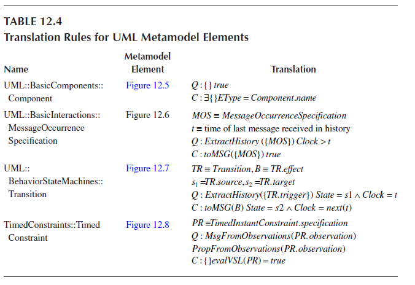
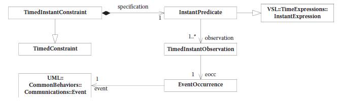

[12.2 <--- ](12_2.md) [   Зміст   ](README.md) [--> 12.4](12_4.md)

## 12.3. SOLVING UML CONSISTENCY

None of the approaches surveyed in the previous section fully address all requirements of [Table 12.1](#_bookmark70). We believe that the common challenge of previous work is in losing track of the abstractions implemented in the models that are checked for consistency.

Жоден із розглянутих у попередньому розділі підходів повністю не відповідає всім вимогам [Таблиці 12.1] (#_bookmark70). Ми вважаємо, що загальна проблема попередньої роботи полягає у втраті абстракцій, реалізованих у моделях, які перевіряються на узгодженість.

Previous work has taken two routes: either analyzing the semantics of the diagrams at the metamodel level (or defining consistency rules between different notation types from there) or translating the models into an existing formal language leveraged for verification. In contrast, we propose an approach that defines an explicit ontology that captures the target domain we are modeling and, further, we define a simple execution framework (similar to a “virtual machine”) based on this target ontology. The ontology concepts map one-to-one onto elements of the system class we are interested in modeling.

Попередня робота йшла двома шляхами: або аналіз семантики діаграм на рівні метамоделі (або визначення звідти правил узгодженості між різними типами позначень), або переклад моделей на існуючу формальну мову, яка використовується для перевірки. На відміну від цього, ми пропонуємо підхід, який визначає явну онтологію, яка фіксує цільову область, яку ми моделюємо, і, далі, ми визначаємо просту структуру виконання (подібну до «віртуальної машини») на основі цієї цільової онтології. Концепції онтології відображаються один-до-одного на елементи класу системи, який нас цікавить моделювання.

The main novelty of the consistency checking approach presented here is in the comprehensive, yet simple mechanism we introduce for specifying consistency rules. By defining a simple “virtual machine” containing the abstraction used in our models, we can treat all UML diagram types as model generators for this virtual machine. Each diagram selects entities of the virtual machine and constrains their structure or behavior. Model consistency is then simply defined as the presence of virtual machine behaviors under the specified constraints.

Основна новизна представленого тут підходу до перевірки узгодженості полягає у комплексному, але простому механізмі, який ми запроваджуємо для визначення правил узгодженості. Визначивши просту «віртуальну машину», що містить абстракцію, що використовується в наших моделях, ми можемо розглядати всі типи діаграм UML як генератори моделей для цієї віртуальної машини. Кожна діаграма вибирає сутності віртуальної машини та обмежує їх структуру або поведінку. Тоді узгодженість моделі просто визначається як наявність поведінки віртуальної машини за заданих обмежень.

We encode constraints as a set of logic propositions over elements of our target ontology and reduce the verification of virtual machine behaviors to a satisfiability (SAT) problem. Although the work presented here is specific to UML, the same approach can be leveraged to integrate other modeling languages with UML-like models.

Ми кодуємо обмеження як набір логічних пропозицій щодо елементів нашої цільової онтології та зводимо перевірку поведінки віртуальної машини до проблеми виконання (SAT). Хоча робота, представлена тут, стосується UML, той самий підхід може бути використаний для інтеграції інших мов моделювання з UML-подібними моделями.

For the proposed approach to work, we first tailor the UML to the target domain that we are interested in—we leverage the UML MARTE profile to target embedded real-time systems. For the purposes of this chapter, we limit ourselves to a subset of the MARTE notations, rich enough for us to show the value of our consistency notion. In particular, the subset we demonstrate in this chapter includes state diagrams, component diagrams, and interaction diagrams. In Section 12.4, we will analyze avenues to extending this approach to a richer subset of UML 2.0 and to other modeling languages.

Щоб запропонований підхід працював, ми спочатку адаптуємо UML до цільового домену, який нас цікавить — ми використовуємо профіль UML MARTE для націлювання на вбудовані системи реального часу. Для цілей цієї глави ми обмежимося підмножиною нотацій MARTE, достатньо багатою, щоб показати цінність нашого поняття узгодженості. Зокрема, підмножина, яку ми демонструємо в цій главі, включає діаграми станів, діаграми компонентів і діаграми взаємодії. У Розділі 12.4 ми проаналізуємо шляхи поширення цього підходу на більш багату підмножину UML 2.0 та на інші мови моделювання.

### 12.3.1 Queries and Constraints Semantics

To provide the backdrop for our definition of model consistency, we provide a formal semantic framework based on an abstract model of distributed reactive systems, similar to a “virtual machine.” We call this model of our target domain the “abstract semantic space.” In this space, we show how each element of a model can be interpreted as a constraint on the system. The consistency property can then be trivially defined over the “abstract semantic space” as the existence of a system in that domain satisfies all constraints imposed by the models.

Щоб створити основу для нашого визначення узгодженості моделі, ми надаємо формальну семантичну структуру, засновану на абстрактній моделі розподілених реактивних систем, подібних до «віртуальної машини». Ми називаємо цю модель нашої цільової області «абстрактним семантичним простором». У цьому просторі ми показуємо, як кожен елемент моделі можна інтерпретувати як обмеження для системи. Тоді властивість узгодженості може бути тривіально визначена над «абстрактним семантичним простором», оскільки існування системи в цій області задовольняє всі обмеження, накладені моделями.

Our semantics is based on two elements: queries and constraints. Each model element of a UML specification is interpreted as a set of (query, constraint) tuples. Each query selects some elements in the “abstract semantic space” that we have defined where the corresponding constraint defines a restriction on the structure or behavior of these elements in a system satisfying the specification. The key benefits of our approach are (1) a mathematically simple, yet comprehensive definition of consistency, (2) the ability to tie the reasoning about consistency to entities of the target domain—resulting in a nongeneric model subclass to which the consistency notion applies, and (3) the interpretation of model elements as constraints over the target domain.

Наша семантика базується на двох елементах: запитах і обмеженнях. Кожен елемент моделі специфікації UML інтерпретується як набір (запит, обмеження) кортежів. Кожен запит вибирає деякі елементи в «абстрактному семантичному просторі», який ми визначили, де відповідне обмеження визначає обмеження на структуру або поведінку цих елементів у системі, що задовольняє специфікації. Ключовими перевагами нашого підходу є (1) математично просте, але вичерпне визначення узгодженості, (2) здатність прив’язувати міркування про узгодженість до сутностей цільової області, що призводить до створення незагального підкласу моделі, до якого застосовується поняття узгодженості. і (3) інтерпретація елементів моделі як обмежень цільової області.

Our consistency checking approach contrasts with other translation-based approaches that we surveyed in the literature in the way we perform the translation. In fact, the target model of our translation abstracts the main components of the target implementation domain. The semantics is then specified by directly mapping each element of the UML model onto some configuration of the target model. Our first step is to define an ontology for real-time distributed systems. This ontology is used to assign precise semantics to the UML models we use and is formalized with Queries and Constraints. This step allows us to formally reason about the specification (using first-order logic). After the formalization, we present the grammar of a language to describe systems based on the target ontology formalism. This step enables the translation of UML models to the new domain. The final steps are the definition of the semantics for our abstract language and, based on such semantics, the definition of consistency.

Наш підхід до перевірки узгодженості відрізняється від інших підходів, заснованих на перекладі, які ми досліджували в літературі, за способом виконання перекладу. Насправді цільова модель нашого перекладу абстрагує основні компоненти цільової області реалізації. Потім семантика визначається прямим відображенням кожного елемента моделі UML на деяку конфігурацію цільової моделі. Наш перший крок — визначити онтологію для розподілених систем реального часу. Ця онтологія використовується для призначення точної семантики моделям UML, які ми використовуємо, і формалізована за допомогою запитів і обмежень. Цей крок дозволяє нам формально міркувати про специфікацію (використовуючи логіку першого порядку). Після формалізації ми представляємо граматику мови для опису систем на основі формалізму цільової онтології. Цей крок дає змогу транслювати моделі UML до нового домену. Останніми кроками є визначення семантики для нашої абстрактної мови та, на основі такої семантики, визначення узгодженості.

[Figure 12.2 ](#_bookmark73)captures the core elements of our ontology for distributed systems with real-time constraints. A real-time system in our ontology is described by five types of elements: two elements, Entities and Channels, form the structural configuration of the system; another two, Messages and Properties, define the behavior; and the Clock captures real-time constraints.

[Малюнок 12.2 ](#_bookmark73) містить ключові елементи нашої онтології для розподілених систем з обмеженнями реального часу. Система реального часу в нашій онтології описується п'ятьма типами елементів: два елементи, Entities і Channels, утворюють структурну конфігурацію системи; ще два, Повідомлення та Властивості, визначають поведінку; і годинник фіксує обмеження в реальному часі.

**FIGURE 12.2** Core elements.

An Entity captures the concept of a process in a distributed system. An Entity has local variables, captures state information, has computational capabilities, and can communicate with other Entities by means of sending and receiving messages over channels. Channels are the communication infrastructure. Each entity that must send or receive messages subscribes to a channel. Channels transport Messages. When a message is sent on a channel, all entities that have subscribed to the channel eventually receive the message. Properties can be used to capture variables and their state. Each entity has a named set of properties that can be evaluated at runtime. Finally, the Clock captures the time relative to an entity. We could have used different notions of time, the choice depends on the type of system we intend to model and the profile of UML we use. MARTE supports not only the type of time we model here but also other time models, for example, modeling of synchronous reactions.

Сутність фіксує концепцію процесу в розподіленій системі. Сутність має локальні змінні, фіксує інформацію про стан, має обчислювальні можливості та може спілкуватися з іншими сутностями за допомогою надсилання та отримання повідомлень через канали. Канали - це комунікаційна інфраструктура. Кожна особа, яка повинна надсилати або отримувати повідомлення, підписується на канал. Канали передають повідомлення. Коли повідомлення надсилається на каналі, усі суб’єкти, які підписалися на канал, зрештою отримують це повідомлення. Властивості можна використовувати для захоплення змінних та їх стану. Кожна сутність має іменований набір властивостей, які можна оцінити під час виконання. Нарешті, годинник фіксує час відносно сутності. Ми могли б використовувати різні поняття часу, вибір залежить від типу системи, яку ми збираємося моделювати, і профілю UML, який ми використовуємо. MARTE підтримує не лише тип часу, який ми тут моделюємо, але й інші моделі часу, наприклад, моделювання синхронних реакцій.

Figure 12.2 shows these five core elements forming the *abstract* state of the system. At each instant, the structural part of the system state is defined by the existing Entities and Channels and by the subscription of Entities to Channels. The behavioral part is defined by the Messages exchanged on each Channel and by the internal state of each Entity defined by the valuation of its Properties. Timing relations are expressed by the collections of all clocks associated to entities. Each Entity has its own reference of time given by the clock. At any given instant, when we capture the state of the system, different clocks can have different time values. It is interesting to note that, because the state comprises both a behavioral and a structural part, it is possible to represent a reconfiguration of the system as a change of state.

На малюнку 12.2 показано ці п'ять основних елементів, що утворюють *абстрактний* стан системи. У кожен момент структурна частина стану системи визначається наявними сутностями та каналами та підпискою сутностей на канали. Поведінкова частина визначається Повідомленнями, якими обмінюються на кожному каналі, і внутрішнім станом кожної сутності, що визначається оцінкою її властивостей. Відношення часу виражаються сукупністю всіх годинників, пов’язаних з сутностями. Кожна сутність має свій власний відлік часу, заданий годинником. У будь-який момент, коли ми фіксуємо стан системи, різні годинники можуть мати різні значення часу. Цікаво відзначити, що, оскільки стан містить як поведінкову, так і структурну частини, реконфігурацію системи можна представити як зміну стану.

Based on the concept of state, we can now define a run as an infinite sequence of states (cf. Figure 12.3). In turn, we now define the semantics of a system based on runs. In Figure 12.4, we show the full ontology that we use to assign a semantics to UML. A system is defined by a set of runs. A specification defines a set of acceptable runs. The specification can constrain the acceptable runs by specifying the initial states and the acceptable transitions.

Базуючись на концепції стану, тепер ми можемо визначити цикл як нескінченну послідовність станів (див. рис. 12.3). У свою чергу, ми тепер визначаємо семантику системи, заснованої на прогонах. На малюнку 12.4 ми показуємо повну онтологію, яку ми використовуємо для призначення семантики UML. Система визначається набором прогонів. Специфікація визначає набір прийнятних циклів. Специфікація може обмежити прийнятні прогони шляхом визначення початкових станів і прийнятних переходів.

**FIGURE 12.3** Definition of a run.

 

**FIGURE 12.4** Ontology for distributed real-time system semantics.

Another interesting element of [Figure 12.4 ](#_bookmark74)is the definition of Specification. A Specification can either be composite or elementary. Every Elementary Specification is made up of two elements: Query and Constraint. A Query selects states from all possible runs while the corresponding Constraint defines the characteristics for the run to be acceptable. We can think of the selector as an operator that is applied to all possible runs. All states selected by the Query are compared with the rules specified in the constraints. If they match, the run is accepted as part of the system whereas if they do not match, the run is discarded.

Іншим цікавим елементом [Рис. 12.4] (#_bookmark74) є визначення специфікації. Специфікація може бути складовою або елементарною. Кожна елементарна специфікація складається з двох елементів: запиту та обмеження. Запит вибирає стани з усіх можливих циклів, тоді як відповідне обмеження визначає характеристики, щоб цикл був прийнятним. Ми можемо розглядати селектор як оператор, який застосовується до всіх можливих прогонів. Усі стани, вибрані Запитом, порівнюються з правилами, зазначеними в обмеженнях. Якщо вони збігаються, цикл приймається як частина системи, а якщо вони не збігаються, цикл відхиляється.

An important point to notice is how time is treated in the ontology. Each Entity has access to one private Clock. The Clock defines a series of Instants. At any given time, the Clock refers to one of the instants as Now. Each message has one Send Time (an instant on the clock of the entity that sends the message) and one Source Entity (the sender of the message). Therefore, it is possible to reason about when each Message was sent and by which Entity. Messages can be received by different Entities at different times. When an Entity that has subscribed to a Channel receives a Message, it can identify the local Entity time using its Clock and obtain the time of the sending Entity from the Message. Depending on the system and the requirements, it is possible to define synchronization strategies between the Clocks so as to be able to reason about times of events across different Clocks.

Важливо зауважити, як час розглядається в онтології. Кожна сутність має доступ до одного приватного годинника. Годинник визначає ряд миттєвих моментів. У будь-який момент часу Годинник посилається на один із моментів як Зараз. Кожне повідомлення має один час надсилання (момент на годиннику об’єкта, який надсилає повідомлення) та один вихідний об’єкт (відправник повідомлення). Таким чином, можна міркувати про те, коли було надіслано кожне повідомлення та якою сутністю. Повідомлення можуть бути отримані різними сутностями в різний час. Коли Суб’єкт, який підписався на Канал, отримує Повідомлення, він може визначити місцевий час Суб’єкта за допомогою свого Годинника та отримати час Суб’єкта, що надсилає, з Повідомлення. Залежно від системи та вимог, можна визначити стратегії синхронізації між годинниками, щоб мати можливість обґрунтовувати час подій на різних годинниках.

We can now give a formalization of the semantics informally described above. To this end, we first formalize the concepts of state and run as a foundation for the semantics of a distributed system specification. Then we present a simple grammar for a specification based on Queries and Constraints and use the formal definitions introduced before to provide a semantic for it. 

Тепер ми можемо дати формалізацію семантики, неофіційно описаної вище. З цією метою ми спочатку формалізуємо концепції стану та запускаємо як основу для семантики специфікації розподіленої системи. Потім ми представляємо просту граматику для специфікації на основі запитів і обмежень і використовуємо формальні визначення, введені раніше, щоб забезпечити її семантику.

#### 12.3.1.1 Notational Preliminaries and System Formalization

We represent sets with capital Greek letters. For instance, the set of properties will be represented by Y. Each element of the set will be represented by the corresponding lowercase letter. For instance, a property in Y would be represented by Y. A function from a domain *A* to a codomain *B* is expressed as f: *A* ® *B*. A tuple is defined as *y* = (*y*1, *y*2 , ) Î*Y*1 ´ *Y*2 ´ and p*i* × *y* = *yi* is the projection operator returning the *i*th element of the tuple. Given a set *X* , P(*X* ) is the power set of *X*, where |*X* | returns the cardinality of *X*. Furthermore, with B we indicate the set of Boolean values (true and false), N the set of natural numbers, N+ the set of natural numbers without 0, and with N¥ the set of natural numbers with its supremum ¥.

Зображуємо набори великими грецькими літерами. Наприклад, набір властивостей буде представлено Y. Кожен елемент набору буде представлено відповідною малою літерою. Наприклад, властивість у Y буде представлена Y. Функція з домену *A* до кодомену *B* виражається як f: *A* ® *B*. Кортеж визначається як *y* = (*y*1, *y*2 , ) Î*Y*1 ´ *Y*2 ´ і p*i* × *y* = *yi* є оператором проекції, що повертає *i*-й елемент кортежу. Дано набір *X* , P(*X* ) — це набір степенів *X*, де |*X* | повертає потужність *X*. Крім того, за допомогою B ми вказуємо набір логічних значень (істинних і хибних), N — набір натуральних чисел, N+ — набір натуральних чисел без 0, а за допомогою N¥ — набір натуральних чисел із верхньою сумою ¥.

A stream [32] is a finite or infinite sequence of Messages. Given a set of Messages *M*, we indicate with *M* * the set of finite sequences over *M*, with *M*¥ the set of infinite sequences, and with *M*w the union of those two sets. We can obtain the *i*th element of a stream *x* by using the infix dot operator *x*.*i*. The notation *x* ¯ *i* returns the prefix stream of length *i*, whereas *x* ­ *i* returns the tail stream obtained by removing the first *i* elements from *x*. The concatenation of two streams *x* and *x*¢ is denoted as *x* *x*¢. We overload this notation to work with sets of streams *X* *X* ¢ such that the resulting set contains all streams of the form *x* *x*, where *x* Î*X* Ù *x*¢ Î*X* ¢.

Потік [32] — це кінцева або нескінченна послідовність повідомлень. Маючи набір повідомлень *M*, ми вказуємо *M* * набір скінченних послідовностей над *M*, *M*¥ набір нескінченних послідовностей, а *M*w об’єднання цих двох наборів. Ми можемо отримати *i*-й елемент потоку *x* за допомогою оператора інфіксної крапки *x*.*i*. Нотація *x* ¯ *i* повертає префіксний потік довжини *i*, тоді як *x* *i* повертає кінцевий потік, отриманий шляхом видалення перших елементів *i* з *x*. Конкатенація двох потоків *x* і *x*¢ позначається як *x* *x*¢. Ми перевантажуємо цю нотацію для роботи з наборами потоків *X* *X* ¢ так, що результуючий набір містить усі потоки у формі *x* *x*, де *x* Î*X* Ù *x*¢ Î* X* ¢.

We can now give a formal definition of the elements of our ontology. For the two structural elements, Entities and Channels, we define two sets: the set *E* of Entities and the set *X* of Channels. For each Channel c we have a set sigma Sc keeping track of the Entities subscribed to c. A Channel valuation relates the Channels (elements of the set *X*) to Messages exchanged over the Channels. Because a Channel can be used to send multiple Messages at any given moment, for every Channel c we define a set *M*c of Messages currently sent over it. Furthermore, for each Entity e we define a set Ye of Properties. A special Property *v*e encodes the current time of entity ’s Clock.

Тепер ми можемо дати формальне визначення елементів нашої онтології. Для двох структурних елементів, сутностей і каналів, ми визначаємо два набори: набір *E* сутностей і набір *X* каналів. Для кожного каналу c ми маємо набір sigma Sc, який відстежує сутності, підписані на c. Оцінка каналу пов’язує канали (елементи набору *X*) із повідомленнями, якими обмінюються через канали. Оскільки канал можна використовувати для надсилання кількох повідомлень у будь-який момент, для кожного каналу c ми визначаємо набір *M*c повідомлень, які наразі надсилаються через нього. Крім того, для кожної сутності e ми визначаємо набір властивостей Ye. Спеціальна властивість *v*e кодує поточний час годинника сутності.

State is defined by (1) a structural configuration formed by Entities, Channels, and the subscriptions of Entities to Channels; (2) a behavioral configuration formed by Messages on each Channel, and valuation of Properties for each Entity; and (3) the current time value of the Clock property for each Entity.

Стан визначається (1) структурною конфігурацією, утвореною сутностями, каналами та підписками сутностей на канали; (2) поведінкова конфігурація, сформована Повідомленнями на кожному Каналі, і оцінка Властивостей для кожної Сутності; і (3) значення поточного часу властивості Clock для кожної сутності.

Properties are intended to encode the state of an Entity. To abstract from the concrete data types used to define the variable space we define a set of functions F. Each f ÎF is a function defined from the values of a tuple of Properties to a Boolean: "f ÎF : ({f : Y ´ Y ´ ® B}). This allows for easy translation of UML specifications. For instance, if we want to model a UML Deployment Diagram specifying that a node would run a particular program *P*, we can define a function *run* and have it evaluate to *true* on the entity corresponding to the node (*run*(*P*) = *true*). The evaluation of the function set F over an entity e is defined as Fe º {(f, fe ) : f ÎF ÙfeÎB}.

Властивості призначені для кодування стану сутності. Щоб абстрагуватися від конкретних типів даних, які використовуються для визначення простору змінних, ми визначаємо набір функцій F. Кожна f ÎF є функцією, визначеною зі значень кортежу Властивостей до логічного значення: "f ÎF : ({f : Y ´ Y ´ ® B}). Це дозволяє легко перекладати специфікації UML. Наприклад, якщо ми хочемо змоделювати діаграму розгортання UML, вказуючи, що вузол виконуватиме певну програму *P*, ми можемо визначити функцію *run* і попросіть його оцінити як *true* для сутності, що відповідає вузлу (*run*(*P*) = *true*). Оцінка набору функцій F над сутністю e визначається як Fe º {(f, fe ) : f ÎF ÙfeÎB}.

We can now define structural configuration as

We define behavioral configuration as

We define state as

  

where *State* is an element of the *StateUniverse* set containing all possible states.

We can now define the concept of a run using streams: *Run* Î *StateUniverse*¥. The semantics of a system specification in this framework emerges as the set of admissible runs:

#### 12.3.1.2 Abstract Specification Language

We now define the abstract language we use to specify Queries and Constraints (and, therefore, systems). The benefits of defining this language are twofold. First, it provides an explicit context for mapping specifications (both composite and elementary) to systems in the semantic framework. Second, it provides a target language for the UML translation. The goal of the language is not to introduce a new textual syntax, and, therefore, we keep it simple by ignoring punctuation and other syntactic sugar necessary for a complete textual language definition.

Тепер ми визначаємо абстрактну мову, яку ми використовуємо для визначення запитів і обмежень (і, отже, систем). Переваги визначення цієї мови подвійні. По-перше, він забезпечує явний контекст для відображення специфікацій (як складених, так і елементарних) на системи в семантичній структурі. По-друге, він забезпечує цільову мову для перекладу UML. Метою мови не є введення нового текстового синтаксису, тому ми зберігаємо його простим, ігноруючи пунктуацію та інші синтаксичні цукри, необхідні для повного визначення текстової мови.

​         We present the grammar of the language in a Backus–Naur Form using production rules of the following form:

 

Nonterminals are enclosed in angular brackets, the symbol || separates alternative productions, optional terms are enclosed in square brackets, and the notation {T}* represents the repetition of term {T} for 0 or more times.

Нетермінали взяті в кутові дужки, символ || розділяє альтернативні виробництва, необов’язкові терміни взяті в квадратні дужки, а позначення {T}* представляє повторення терміна {T} 0 або більше разів.

​	Operator definitions are not part of this grammar. Instead, they will be introduced when necessary in the translation of UML. In particular, we express all unary operators with the nonterminal UN-OPERATOR and binary operators with BIN-OPERATOR . FUNCTION is a Boolean formula from property names to Boolean. Using this grammar, we can specify a system based on the ontology we have devised using Queries and Constraints. In the next section, we define the semantics of such specifications.

Визначення операторів не є частиною цієї граматики. Натомість їх буде введено, коли це необхідно, у перекладі UML. Зокрема, ми виражаємо всі унарні оператори за допомогою нетермінального UN-OPERATOR, а двійкові — за допомогою BIN-OPERATOR. ФУНКЦІЯ — це булева формула від імен властивостей до логічних. Використовуючи цю граматику, ми можемо визначити систему на основі онтології, яку ми розробили за допомогою запитів і обмежень. У наступному розділі ми визначаємо семантику таких специфікацій.

​	Using the CONSTRAINT optional operators $ and Ø$, it is possible to affect the structure of the system. We use $\exists$ to create new entities and channels, Ø$ to remove them.

 Використовуючи додаткові оператори CONSTRAINT $ і Ø$, можна впливати на структуру системи. Ми використовуємо $\exists$ для створення нових сутностей і каналів, Ø$ для їх видалення.

​	Time is addressed in this language as a property of entities. In particular, we use the notation *next*(*t*) to indicate the value of an entity clock in the first state where the value is greater than *t*. With *next* we are able to reason about next states without constraining their occurrence to a particular time value. Moreover, the messages contain the SENDER entity and the sending TIME of the message in its parameter list.

Час розглядається цією мовою як властивість сутностей. Зокрема, ми використовуємо позначення *next*(*t*), щоб вказати значення годинника сутності в першому стані, де значення більше за *t*. За допомогою *next* ми можемо міркувати про наступні стани, не обмежуючи їх виникнення певним значенням часу. Крім того, повідомлення містять сутність SENDER і ЧАС надсилання повідомлення в списку параметрів.

#### 12.3.1.3 Specification Language Semantics

 An elementary specification ELEM-SPEC is captured in our abstract language by a tuple QUERY , CONSTRAINT . The goal of a specification is to define what runs are part of a system implementing such a specification. The QUERY identifies what parts of the run the specification is constraining, whereas the CONSTRAINT specifies how those parts are constrained. A run that fulfills a pair of query and constraint is such that in all states following a state where the query is true the constraint is true. Therefore, an ELEM-SPEC encodes a transition function between two states.

Елементарна специфікація ELEM-SPEC записується нашою абстрактною мовою за допомогою кортежу QUERY, CONSTRAINT. Метою специфікації є визначення того, які цикли є частиною системи, що реалізує таку специфікацію. QUERY визначає, які частини циклу обмежує специфікація, тоді як CONSTRAINT визначає, як ці частини обмежені. Запуск, який виконує пару запиту та обмеження, такий, що в усіх станах, наступних за станом, де запит є істинним, обмеження є істинним. Таким чином, ELEM-SPEC кодує функцію переходу між двома станами.

​      We define a QUERY as a communication context selecting the states that follow a particular message interaction, and a Boolean formula over properties, which identifies states to constrain. A query thus addresses both the contents of channels (the channel history) and predicates over the local data state of the relevant entities. We first define the channel configuration *X*c as

Ми визначаємо ЗАПИТ як контекст зв’язку, що вибирає стани, які слідують за певною взаємодією повідомлення, і логічну формулу над властивостями, яка визначає стани, які потрібно обмежити. Таким чином, запит стосується як вмісту каналів (історії каналів), так і предикатів щодо стану локальних даних відповідних об’єктів. Спочатку ми визначаємо конфігурацію каналу *X*c як

​      This definition captures the part of a state *S* that specifies the channel configuration and the messages being exchanged in the given state. The semantics *q* of a QUERY *q* is, therefore,

Це визначення охоплює частину стану *S*, яка визначає конфігурацію каналу та повідомлення, якими обмінюються в даному стані. Таким чином, семантика *q* запиту *q* така:

 

   where *X*c* is a finite stream of channel configurations, the channel history *h* ÎP(*X*c*) is a set of such streams, and the assertion *a* is a function from a set of properties to Boolean values.

We define a helper function

 

​      that, given a QUERY semantics and a run, returns a set of tuples containing (1) the indexes of the states where one of the message histories is matched and (2) the corresponding set of entities for which the evaluation of the function is true. This helper function gives us all states in the run where we have to constrain the next state, as well as the corresponding entities to be constrained.

який, враховуючи семантику QUERY і виконання, повертає набір кортежів, що містить (1) індекси станів, де збігається одна з історій повідомлень, і (2) відповідний набір сутностей, для яких оцінка функції є істинною. . Ця допоміжна функція надає нам усі стани в циклі, де ми маємо обмежити наступний стан, а також відповідні сутності, які потрібно обмежити.

​            CONSTRAINT is defined as a tuple of channel configurations, Boolean functions over properties, and one of the three quantifiers {$, Ø$, -}. Similar to what we did for queries, we define the semantics of CONSTRAINT as

ОБМЕЖЕННЯ визначається як кортеж конфігурацій каналів, логічних функцій над властивостями та одного з трьох кванторів {$, Ø$, -}. Подібно до того, що ми зробили для запитів, ми визначаємо семантику CONSTRAINT як

 

We can define a helper function

 

where *constr* takes as arguments a run, the result of a query operation, and the semantics of a constraint. This function returns true if the constraint is satisfied. To be satisfied, the channel configuration of the selected states must match the *X*c specified by the constraint. Moreover, how the rest of the constraints is satisfied depends on the choice among the three quantifiers {$, Ø$, -}. If the chosen quantifier is –, the assertion *s* must evaluate to true in all entities selected. If the quantifier is $\neg \exists$, the assertion *s* must evaluate to true in some entities not part of the selected ones. Finally, if the quantifier is Ø$ the selected entities must not be present in the selected states.

де *constr* приймає як аргументи виконання, результат операції запиту та семантику обмеження. Ця функція повертає true, якщо обмеження виконано. Щоб бути задоволеним, конфігурація каналу вибраних станів має відповідати *X*c, визначеному обмеженням. Крім того, те, як задовольняються інші обмеження, залежить від вибору серед трьох кванторів {$, Ø$, -}. Якщо вибраний квантор дорівнює –, твердження *s* має бути істинним у всіх вибраних сутностях. Якщо квантифікатор $\neg \exists$, твердження *s* має оцінюватися як істинне в деяких сутностях, які не є частиною вибраних. Нарешті, якщо квантор дорівнює Ø$, вибрані сутності не повинні бути присутніми у вибраних станах.

​      Now we can define a SPEC in the semantic domain as a set of tuples of the form (query, constraint), and the system corresponding to the specification as the set of all possible runs that fulfill all such tuples (query, constraint) of the set.

Тепер ми можемо визначити SPEC у семантичній області як набір кортежів форми (запит, обмеження), а систему, що відповідає специфікації, як набір усіх можливих прогонів, які виконують усі такі кортежі (запит, обмеження) встановити.

Formally,

 

### 12.3.2 Notion of Consistency

We are interested in defining dynamic consistency for real-time distributed systems. This is the reason why we have tailored our semantic framework to this domain rather than staying within the generality of the UML language metamodels. Given the semantic framework presented in the previous section, it is now straightforward to define dynamic consistency for models in this system class. We will first define horizontal consistency and then vertical consistency.

Ми зацікавлені у визначенні динамічної узгодженості для розподілених систем реального часу. Це причина, чому ми пристосували нашу семантичну структуру до цієї області, а не залишалися в межах загальності метамоделей мови UML. Враховуючи семантичну структуру, представлену в попередньому розділі, тепер легко визначити динамічну узгодженість для моделей у цьому системному класі. Спочатку ми визначимо горизонтальну, а потім вертикальну узгодженість.

​      We can define horizontal consistency as follows: a specification is horizontally consistent if the system it defines admits at least one run. This is consistent with the definition of horizontal consistency we gave before. In fact, a specification SPEC is formed of multiple views at the same level of abstraction (in our formalism this means multiple sets of query and constraint tuples).

Ми можемо визначити горизонтальну узгодженість наступним чином: специфікація є горизонтально узгодженою, якщо система, яку вона визначає, допускає принаймні один запуск. Це узгоджується з визначенням горизонтальної узгодженості, яке ми дали раніше. Насправді специфікація SPEC формується з кількох представлень на одному рівні абстракції (у нашому формалізмі це означає кілька наборів запитів і кортежів обмежень).

**Definition** **12.1**

This definition captures the idea that the specification is implementable. There are two possibilities for a system to fulfill this property. Either there are no contradictions in the specification or the admissible runs do not match any query that defines inconsistent constraints. There is nothing wrong in using different perspectives to constrain the system behavior specified by other perspectives. However, if a perspective constrains the behavior of the system such that no run satisfying the specifications of that perspective is allowed in the final system, there can be a consistency problem. A stricter rule for horizontal consistency requires that the system has at least one run admissible for each perspective, meaning that there is at least one run satisfying some queries of each perspective specification.

Це визначення відображає ідею того, що специфікація реалізована. Існують дві можливості системи для виконання цієї властивості. Або в специфікації немає суперечностей, або допустимі прогони не відповідають жодному запиту, який визначає суперечливі обмеження. Немає нічого поганого у використанні різних точок зору для обмеження поведінки системи, визначеної іншими точками зору. Однак, якщо перспектива обмежує поведінку системи таким чином, що жоден запуск, який задовольняє специфікації цієї перспективи, не допускається в кінцевій системі, може виникнути проблема узгодженості. Більш суворе правило для горизонтальної узгодженості вимагає, щоб система мала принаймні один прогін, допустимий для кожної перспективи, що означає, що є принаймні один прогін, який задовольняє деякі запити кожної специфікації перспективи.

**Definition** **12.2**

A possible problem with our first definition of horizontal consistency is that we could have a system specification with no runs satisfying any query of the general specification. The consistency specification for such a system is vacuously satisfied (i.e., runs are possible because selectors never match). The second definition solves this problem requiring that some runs matching the specification queries are present. The two definitions of horizontal consistency we gave support two different usage scenarios. In fact, we can identify two main reasons to create a specification. First, we can be interested in constraining how the system works in a given scenario. The scenario we want to constraint must, therefore, be possible and the corresponding query must select some runs. For this type of usage we should use consistency Definition 2. A different use case is when we want to specify recovery from some failure of the system. For example, we may identify that a given interaction can happen as a result of a failure even if the specification would not allow for it. In this case, the goal is to describe the detection and recovery from a given failure. In this case, we can use consistency Definition 1. Vertical consistency is defined between two specifications at different levels of abstraction. We can define this consistency notion by a containment relation between runs. If we have a more abstract specification SPEC*a* and a more concrete specification SPEC*c*, we define vertical consistency as follows: a concrete specification SPEC*c* is consistent with an abstract specification SPEC*a* if all runs allowed in the concrete system specification are also allowed in the abstract one. Moreover, the abstract system allows runs that the concrete system does not allow. This definition requires that the concrete systems admit a strict subset of the runs admitted by the abstract one. 

Можлива проблема з нашим першим визначенням горизонтальної узгодженості полягає в тому, що ми можемо мати специфікацію системи без жодних прогонів, які задовольняють будь-які запити загальної специфікації. Специфікація узгодженості для такої системи точно задовольняється (тобто запуски можливі, оскільки селектори ніколи не збігаються). Друге визначення вирішує цю проблему, вимагаючи наявності деяких прогонів, що відповідають запитам специфікації. Два визначення горизонтальної узгодженості, які ми надали, підтримують два різні сценарії використання. Фактично, ми можемо визначити дві основні причини створення специфікації. По-перше, нас може зацікавити обмеження того, як система працює в певному сценарії. Таким чином, сценарій, який ми хочемо обмежити, має бути можливим, а відповідний запит має вибирати кілька запусків. Для цього типу використання ми повинні використовувати визначення узгодженості 2. Інший варіант використання – це коли ми хочемо вказати відновлення після деякого збою системи. Наприклад, ми можемо визначити, що дана взаємодія може відбутися в результаті збою, навіть якщо специфікація не передбачає цього. У цьому випадку мета полягає в тому, щоб описати виявлення та відновлення після даного збою. У цьому випадку ми можемо використати визначення узгодженості 1. Вертикальна узгодженість визначається між двома специфікаціями на різних рівнях абстракції. Ми можемо визначити це поняття узгодженості через відношення стримування між циклами. Якщо у нас є більш абстрактна специфікація SPEC*a* і більш конкретна специфікація SPEC*c*, ми визначаємо вертикальну узгодженість наступним чином: конкретна специфікація SPEC*c* узгоджується з абстрактною специфікацією SPEC*a*, якщо всі запуски дозволені в специфікація конкретної системи також допускається в абстрактній. Крім того, абстрактна система допускає запуски, які не дозволяє конкретна система. Це визначення вимагає, щоб конкретні системи допускали строгу підмножину циклів, які допускає абстрактна система.

**Definition** **12.3**

Given the definitions of SPEC and SPEC of the previous section, we can now define a modularity theorem. We first observe that each specification has a set of tuples containing one query and one constraint. Therefore, each of these tuples defines a set of runs. From the definition of SPEC , we can infer a lemma asserting that the semantics of a complex SPEC (i.e., formed by multiple tuples of query and constraint) is the intersection of the semantics of all the subspecifications formed by single query/constraint tuples. The modularity theorem states that for any complex specification SPEC we can always identify two subspecifications such that the intersection of the runs permitted by the two contains exactly the runs permitted by the original specification. Moreover, the theorem states that, to obtain such subspecifications we can simply take two subsets of the tuples of the original specification, provided that all tuples of the original specification are in at least one of the two subspecifications. Now we can formally define the lemma and the theorem as follows.

Враховуючи визначення SPEC і SPEC у попередньому розділі, тепер ми можемо визначити теорему модульності. Спочатку ми зауважимо, що кожна специфікація має набір кортежів, що містять один запит і одне обмеження. Отже, кожен із цих кортежів визначає набір прогонів. З визначення SPEC ми можемо вивести лему, яка стверджує, що семантика складного SPEC (тобто, утвореного кількома кортежами запиту та обмеження) є перетином семантики всіх підспецифікацій, утворених одним кортежем запиту/обмеження. Теорема модульності стверджує, що для будь-якої складної специфікації SPEC ми завжди можемо ідентифікувати дві підспецифікації, щоб перетин прогонів, дозволених двома, містив саме прогони, дозволені вихідною специфікацією. Крім того, теорема стверджує, що для отримання таких підспецифікацій ми можемо просто взяти дві підмножини кортежів вихідної специфікації, за умови, що всі кортежі вихідної специфікації знаходяться принаймні в одній із двох підспецифікацій. Тепер ми можемо формально визначити лему та теорему наступним чином.

**Lemma 12.1**

The Modularity theorem asserts that complex query/constraint specifications can be split into two simpler ones without losing information.

​      **Theorem 12.1**

 

The proof of Theorem 12.1 derives easily form Lemma 12.1. In fact, because the semantics of a specification is equivalent to the intersection of the semantics of all its constituent query and constraint tuples, we can use the commutative and associative properties of intersection to prove Theorem 12.1.

Доведення теореми 12.1 легко виводиться з леми 12.1. Насправді, оскільки семантика специфікації еквівалентна перетину семантики всіх її складових запитів і кортежів обмежень, ми можемо використовувати комутативні та асоціативні властивості перетину, щоб довести теорему 12.1.

### 12.3.3 Example of Consistency Management

To show how the methodology outlined in this chapter applies to consistency checking in the context of UML for real time, we are required to provide a translation from UML and from its MARTE profile to the abstract language we introduced. Translating the entire UML and MARTE metamodels is beyond the scope of this chapter. Instead, we chose a simple subset of UML and MARTE that uses three graphical notations: component diagrams, sequence diagrams, and state diagrams, which we used in the example of [Figure 12.1](#_bookmark69). Furthermore, we translate MARTE timed constraints as we used them in our example.

Щоб показати, як методологія, викладена в цьому розділі, застосовується до перевірки узгодженості в контексті UML у реальному часі, ми повинні надати переклад з UML і з його профілю MARTE на абстрактну мову, яку ми представили. Переклад усіх метамоделей UML і MARTE виходить за рамки цієї глави. Замість цього ми вибрали просту підмножину UML і MARTE, яка використовує три графічні позначення: діаграми компонентів, діаграми послідовності та діаграми станів, які ми використовували в прикладі [Рис. 12.1] (#_bookmark69). Крім того, ми перекладаємо часові обмеження MARTE, як ми використовували їх у нашому прикладі.

The translation from UML models to our query and constraint language assigns a precise semantics to each model. Several options for assigning semantics to each notation exist. For the sequence diagram, for instance, we have many possibilities for interpreting them existentially (at least the specified behavior must be possible) or universally (precisely the specified behavior is required) [43]. Notice that the decision of interpreting the diagrams existentially or universally depends on what the goal of the specification is. For example, in a requirements document an interaction can exemplify one of many possible scenarios and the existential interpretation would be correct. For real-time systems modeling we interpret sequence diagrams universally. All messages exchanged in the system must be represented in diagrams. This interpretation of sequence diagrams is viable for our application domain. In fact, one of the key uses of models of communication in real-time systems is to analyze the network traffic and ensure that real-time constraints can be met. To this end a complete view of which messages are exchanged over the communication channels is necessary.

Переклад з моделей UML на нашу мову запитів і обмежень призначає точну семантику кожній моделі. Існує кілька варіантів призначення семантики кожній нотації. Для діаграми послідовності, наприклад, у нас є багато можливостей для їх інтерпретації екзистенціально (принаймні задана поведінка має бути можливою) або універсально (потрібна саме задана поведінка) [43]. Зауважте, що рішення щодо інтерпретації діаграм екзистенціально чи універсально залежить від мети специфікації. Наприклад, у документі вимог взаємодія може служити прикладом одного з багатьох можливих сценаріїв, і екзистенціальна інтерпретація буде правильною. Для моделювання систем у реальному часі ми універсально інтерпретуємо діаграми послідовності. Усі повідомлення, якими обмінюються в системі, повинні бути представлені на діаграмах. Ця інтерпретація діаграм послідовності життєздатна для нашої області застосування. Фактично, одним із ключових застосувань моделей зв’язку в системах реального часу є аналіз мережевого трафіку та забезпечення дотримання обмежень реального часу. Для цього необхідне повне уявлення про те, якими повідомленнями обмінюються по каналах зв’язку.

Our translation strategy interprets every element of a UML graph as a query and constraint tuple. We introduce an operator to compose those elementary specifications—this closes the loop with the introduction of the abstract query/constraint syntax. For demonstration purposes, we introduce the parallel operator. This operator is applied between any two specifications in our translation and returns the specification containing all query and constraint tuples of the operand specifications.

Наша стратегія перекладу інтерпретує кожен елемент графа UML як запит і кортеж обмежень. Ми вводимо оператор для складання цих елементарних специфікацій — це замикає цикл із введенням абстрактного синтаксису запиту/обмеження. Для демонстрації ми введемо паралельний оператор. Цей оператор застосовується між будь-якими двома специфікаціями в нашому перекладі та повертає специфікацію, що містить усі кортежі запитів і обмежень специфікацій операндів.

In [Table 12.4](#_bookmark75), we provide translation rules for some of the interesting model elements used in our example. The entire set of rules is beyond the scope of this chapter. Each rule provides a set of query/constraint tuples that can be composed in a specification using the parallel operator. To support the translations, we define a small set of helper functions.

У [Таблиці 12.4] (#_bookmark75) ми надаємо правила перекладу для деяких цікавих елементів моделі, використаних у нашому прикладі. Весь набір правил виходить за рамки цього розділу. Кожне правило надає набір кортежів запитів/обмежень, які можна скласти в специфікації за допомогою паралельного оператора. Для підтримки перекладів ми визначаємо невеликий набір допоміжних функцій.

The function *toMSG*() is used to convert two elements of the UML metamodel, MessageOccurrenceSpecification and Triggers, into objects suitable for our abstract language. Informally, we can think of MessageOccurrenceSpecification as representations on sequence diagram lifelines of the events related to message sending and receiving (plus execution of actions and other details we do not consider in our simplified model). The function *toMSG*() expresses the translation from OccurrenceSpecification elements of the UML metamodel to messages in our abstract language specification.

Функція *toMSG*() використовується для перетворення двох елементів метамоделі UML, MessageOccurrenceSpecification і Triggers, в об’єкти, придатні для нашої абстрактної мови. Неофіційно ми можемо думати про MessageOccurrenceSpecification як про представлення на життєвих лініях діаграми послідовності подій, пов’язаних із надсиланням і отриманням повідомлень (плюс виконання дій та інші деталі, які ми не враховуємо в нашій спрощеній моделі). Функція *toMSG*() виражає переклад з елементів OccurrenceSpecification метамоделі UML на повідомлення в нашій специфікації абстрактної мови.

Similarly, the *ExtractHistory*() function applied to a model element of type Message Occurrence Specification returns the sequence of messages that maps to the Event sin the life line before the one defined by the given Message Occurrence Specification. Intuitively, this function returns the history necessary for a query to select the correct interactions before applying the constraint to match the message event defined by the Message Occurrence Specification model element. We do not describe the details of how this translation is performed because it is beyond the scope of this chapter. In fact, the UML metamodel is very complex. Extracting relations between events and specification elements in different diagrams often requires the exploration of a deep class hierarchy. For example, by inspecting the metamodel of [Figure 12.6](#_bookmark77), we can observe that to extract the history of events before a given message in a sequence diagram, we have to identify the Lifeline the Occurrence Specification is covered by. Then, leveraging the fact that the set of events of a lifeline is ordered, we could extract all the Occurrence Specifications that precedes the one for which we are creating the history. Once we have the ordered list of Occurrence Specifications in the history, we can navigate their event property to obtain the corresponding Events. By reflection, we can identify the events that are related to sending and receiving messages and use this information to generate the list of message specifications.

Подібним чином функція *ExtractHistory*(), застосована до елемента моделі типу Специфікації виникнення повідомлень, повертає послідовність повідомлень, які зіставляються з подією, починаючи з життєвої лінії перед тією, що визначена специфікацією виникнення повідомлень. Інтуїтивно зрозуміло, що ця функція повертає історію, необхідну для запиту для вибору правильних взаємодій перед застосуванням обмеження для відповідності події повідомлення, визначеній елементом моделі специфікації появи повідомлення. Ми не описуємо деталі того, як виконується цей переклад, оскільки це виходить за рамки цього розділу. Насправді метамодель UML дуже складна. Вилучення зв’язків між подіями та елементами специфікації в різних діаграмах часто вимагає дослідження глибокої ієрархії класів. Наприклад, перевіряючи метамодель [Рисунок 12.6](#_bookmark77), ми можемо помітити, що для вилучення історії подій перед даним повідомленням на діаграмі послідовності ми маємо ідентифікувати лінію життя, на яку поширюється специфікація події. Потім, використовуючи той факт, що набір подій лінії життя впорядкований, ми можемо витягти всі специфікації подій, які передують тій, для якої ми створюємо історію. Отримавши впорядкований список специфікацій події в історії, ми можемо переміщатися по їхній властивості події, щоб отримати відповідні події. Шляхом роздумів ми можемо ідентифікувати події, пов’язані з надсиланням і отриманням повідомлень, і використовувати цю інформацію для створення списку специфікацій повідомлень.

The four translations given in [Table 12.4](#_bookmark75) map the elements of UML and MARTE metamodels depicted in Figures 12.5 through 12.8 to query and constraint tuples. The first line of the table gives a translation for Figure 12.5. This part of the metamodel defines UML components in a component diagram. The simple model in the figure captures the relation between Components and Interfaces, which can be required or provided by the Component. Our translation simply asserts that a specification of a component always imposes the existence of an entity with a property called *EType* and value equal to the component name in the UML diagram.

Чотири переклади, наведені в [таблиці 12.4] (#_bookmark75), відображають елементи метамоделей UML і MARTE, зображених на малюнках 12.5-12.8, на кортежі запитів і обмежень. У першому рядку таблиці подано переклад рисунка 12.5. Ця частина метамоделі визначає компоненти UML на діаграмі компонентів. Проста модель на малюнку відображає зв’язок між компонентами та інтерфейсами, які можуть бути потрібні або надані компонентом. Наш переклад просто стверджує, що специфікація компонента завжди нав’язує існування сутності з властивістю під назвою *EType* і значенням, що дорівнює назві компонента на діаграмі UML.

The translation of line 2 of Table 12.4 defines constraints imposed by a Message Occurrence Specification in a UML sequence diagram. The query extracts the message history before the given Message Occurrence Specification. As we already mentioned discussing Extract History, this is not a trivial operation. [Figure 12.6](#_bookmark77) presents the relevant subset of the UML model for sequence diagrams. Interactions are the type of behavior specified by this type of diagram. In particular, an Interaction is a type of Interaction Fragment that can be composed of other such fragments. Special types of Interaction Fragments are Occurrence Specifications which reference communication Events and Lifelines. An example of such specifications is Message Occurrence Specifications, which represent messages exchanged according to the interaction modeled. The constraint in our translation is the existence of the message corresponding to the Message Occurrence Specification. This translation covers only events that are messages. Other types of events cause properties in some entity to be set and are not covered in our example.

Трансляція рядка 2 таблиці 12.4 визначає обмеження, накладені специфікацією появи повідомлень на діаграмі послідовності UML. Запит витягує історію повідомлень перед заданою специфікацією появи повідомлення. Як ми вже згадували під час обговорення вилучення історії, це не тривіальна операція. [Малюнок 12.6] (#_bookmark77) представляє відповідну підмножину моделі UML для діаграм послідовності. Взаємодії - це тип поведінки, визначений цим типом діаграми. Зокрема, взаємодія — це тип фрагмента взаємодії, який може складатися з інших подібних фрагментів. Особливі типи фрагментів взаємодії – це специфікації подій, які посилаються на комунікаційні події та лінії життя. Прикладом таких специфікацій є специфікації виникнення повідомлень, які представляють повідомлення, якими обмінюються відповідно до змодельованої взаємодії. Обмеженням у нашому перекладі є існування повідомлення, яке відповідає специфікації появи повідомлення. Цей переклад охоплює лише події, які є повідомленнями. Інші типи подій спричиняють встановлення властивостей у певній сутності та не охоплюються в нашому прикладі.

 

**FIGURE 12.5** Subset of the UML Component metamodel. (Adapted from Object Management Group, “Unified Modeling Language (OMG UML), Superstructure, Version 2.3.” 2010, formal/2010-05-05, OMG.)

**МАЛЮНОК 12.5** Підмножина метамоделі компонента UML. (Адаптовано з Object Management Group, “Unified Modeling Language (OMG UML), Superstructure, Version 2.3.” 2010, formal/2010-05-05, OMG.)

**FIGURE 12.6** Subset of the UML Message metamodel. (Adapted from Object Management Group, “Unified Modeling Language (OMG UML), Superstructure, Version 2.3.” 2010, formal/2010-05-05, OMG.)

The third line of [Table 12.4 ](#_bookmark75)defines a Translation for state-machine transitions. To this end, we introduce an entity property named State. [Figure 12.7 ](#_bookmark78)depicts the relevant subset of the UML metamodel for state-machine diagrams. According to the UML metamodel, a Transition has a source and target Vertex, and State is a type of Vertex. A Transition can be taken only if the guard constraint is true and, in this case, is taken when a given trigger occurs. Moreover, a Transition can have an effect. The effect is a Behavior. An example of Behavior is the Interaction (as depicted in Figure 12.6), which can contain message-related events (because Message Occurrence Specifications are also Interaction Fragments). For our case study, we simplify the translation to address just triggers and effects that are messages. The query part of the translation of Transition selects entities, where the State variable coincides with the source state of the model. Other propositions in the query can be used to restrict the selection to only specific entities. In fact, state diagrams define the behavior of particular model elements. For example, in our case study we want to apply the state diagram of Figure 12.1c only to the component Emergency Brake. In this case, the query should also limit the selection to states of the entity Emergency Brake. To this end, we can add to the query another clause that selects only entities of the correct type (i.e., *EType* = “Emergency Brake”). The other part of the query limits the selection to states where the trigger message is present. The constraint simply forces the next state of the selected entities to have the target state in the State property.

Третій рядок [таблиці 12.4] (#_bookmark75) визначає трансляцію для переходів кінцевого автомата. З цією метою ми вводимо властивість сутності під назвою State. [Малюнок 12.7 ](#_bookmark78) зображує відповідну підмножину метамоделі UML для діаграм кінцевого автомата. Відповідно до метамоделі UML, перехід має вихідну та цільову вершину, а стан є типом вершини. Перехід можна здійснити, лише якщо захисне обмеження є істинним і, в цьому випадку, виконується, коли виникає заданий тригер. Крім того, перехід може мати ефект. Ефект - це поведінка. Прикладом поведінки є взаємодія (як показано на малюнку 12.6), яка може містити події, пов’язані з повідомленням (оскільки специфікації виникнення повідомлень також є фрагментами взаємодії). Для нашого прикладу ми спростили переклад, щоб розглянути лише тригери та ефекти, які є повідомленнями. Частина запиту трансляції Transition вибирає сутності, де змінна State збігається з вихідним станом моделі. Інші пропозиції в запиті можна використовувати, щоб обмежити вибір лише певними об’єктами. Насправді діаграми стану визначають поведінку окремих елементів моделі. Наприклад, у нашому прикладі ми хочемо застосувати діаграму стану на малюнку 12.1c лише до компонента Emergency Brake. У цьому випадку запит також має обмежити вибір станами сутності Emergency Brake. З цією метою ми можемо додати до запиту іншу пропозицію, яка вибирає лише об’єкти правильного типу (тобто *EType* = “Emergency Brake”). Інша частина запиту обмежує вибір станами, де присутнє тригерне повідомлення. Обмеження просто змушує наступний стан вибраних сутностей мати цільовий стан у власності State.

   **FIGURE 12.7** Subset of the UML Transition metamodel. (Adapted from Object Management Group, “Unified Modeling Language (OMG UML), Superstructure, Version 2.3.” 2010, formal/2010-05-05, OMG.)

 

**FIGURE 12.8** Subset of the MARTE TimedConstraints metamodel. (Adapted from Object Management Group, “UML Profile for MARTE: Modeling and Analysis of Real-Time Embedded Systems, Version 1.0.” 2009, formal/2009-11-02, OMG.)

Finally the last line of [Table 12.4](#_bookmark75) defines the translation for MARTE TimedInstantConstraint. Figure 12.8 shows the relevant MARTE metamodel. A TimedInstantConstraint has a specification that is a predicate over a set of observations (TimedInstantObservations). Each observation identifies an event occurrence. EventOccurrences relate MARTE observations to UML Event elements.

Нарешті, останній рядок [таблиці 12.4] (#_bookmark75) визначає переклад для MARTE TimedInstantConstraint. На малюнку 12.8 показано відповідну метамодель MARTE. TimedInstantConstraint має специфікацію, яка є предикатом для набору спостережень (TimedInstantObservations). Кожне спостереження ідентифікує виникнення події. EventOccurrences пов’язує спостереження MARTE з елементами UML Event.

MARTE introduces the Value Specification Language (VSL) to formulate algebraic and time expressions. The translation of MARTE InstantPredicates has to interpret the VSL InstantExpression. To this end, in our translation, we use an *evalVSL* Boolean function that evaluates a VSL expression. Moreover, we use two functions, *MsgFromObservations* and *PropFromObservations* , to obtain the messages and properties that correspond to the events referred to by the observation of a predicate. From [Figure 12.8](#_bookmark78), we can observe the complexity of obtaining an event from a TimedConstraint. Obtaining messages and properties from events requires a good understanding of the UML metamodel and the exploration of many nested relations. Although complex, those functions can be implemented in a program. The translation then selects the correct messages and entities in the query part of the specification and asserts that the specification in VSL evaluates to true in the constraint.

MARTE представляє мову специфікації значень (VSL) для формулювання алгебраїчних і часових виразів. Трансляція MARTE InstantPredicates має інтерпретувати VSL InstantExpression. З цією метою в нашому перекладі ми використовуємо логічну функцію *evalVSL*, яка обчислює вираз VSL. Крім того, ми використовуємо дві функції, *MsgFromObservations* і *PropFromObservations*, щоб отримати повідомлення та властивості, які відповідають подіям, на які посилається спостереження предикату. З [Рис. 12.8] (#_bookmark78) ми можемо побачити складність отримання події з TimedConstraint. Отримання повідомлень і властивостей із подій вимагає хорошого розуміння метамоделі UML і вивчення багатьох вкладених зв’язків. Незважаючи на складність, ці функції можна реалізувати в програмі. Потім переклад вибирає правильні повідомлення та сутності в частині запиту специфікації та підтверджує, що специфікація у VSL оцінює значення true в обмеженні.

We can now show how to detect inconsistency with this query and constraint framework using the example of [Figure 12.1](#_bookmark69). Thanks to the modularity theorem defined in the previous section, we can split each specification into simpler specifications. In particular, because the intersection of the specifications obtained with the modularity theorem is equivalent to the original specification, we can prove inconsistency by just translating a subset of the model and proving that such subset is inconsistent (no runs allowed).

Тепер ми можемо показати, як виявити невідповідність цьому запиту та структурі обмежень на прикладі [Рис. 12.1] (#_bookmark69). Завдяки теоремі про модульність, визначеній у попередньому розділі, ми можемо розділити кожну специфікацію на простіші специфікації. Зокрема, оскільки перетин специфікацій, отриманих за допомогою теореми про модульність, еквівалентний вихідній специфікації, ми можемо довести невідповідність, просто переклавши підмножину моделі та довівши, що така підмножина є неузгодженою (прогони не допускаються).

For example, we can translate the model element of Figure 12.1b that represents the sending of an Ack message from the Emergency Brake to the Train Controller. This translation, according to [Table 12.4](#_bookmark75), would look like

Наприклад, ми можемо перекласти елемент моделі на малюнку 12.1b, який представляє надсилання повідомлення Ack від екстреного гальмування до диспетчера поїзда. Цей переклад, згідно з [Таблицею 12.4](#_bookmark75), виглядатиме так

The translation of the Figure 12.1c transition triggered by the Commands Received message is

 

Let us analyze the type of runs that satisfy the translation of the sequence diagram. We can observe that, for a run to satisfy the specification, if in a state there is a Commands Received message received by the Emergency Brake component, it must send an Ack message. In the sequence diagram translation, we do not specify if there is some other action local to the Emergency Brake. In fact, our simplified translation for sequence diagrams deals only with messages sent and received, not local actions. So the message can be returned immediately (next state) or after some local transitions (that is the meaning of {}*, which represents a sequence of zero or more states where the channel is empty). The specification, however, is clear in identifying that no other messages are sent or received by Emergency Brake before returning a message.

Проаналізуємо тип прогонів, які задовольняють трансляцію діаграми послідовності. Ми можемо помітити, що, щоб запуск задовольняв специфікації, якщо в стані є повідомлення Commands Received, отримане компонентом Emergency Brake, він повинен надіслати повідомлення Ack. У перекладі діаграми послідовності ми не вказуємо, чи існує якась інша дія, локальна для екстреного гальмування. Насправді наш спрощений переклад для діаграм послідовності стосується лише надісланих і отриманих повідомлень, а не локальних дій. Таким чином, повідомлення може бути повернуто негайно (наступний стан) або після деяких локальних переходів (це значення {}*, яке представляє послідовність нуля або більше станів, де канал порожній). Специфікація, однак, чітко визначає, що жодні інші повідомлення не надсилаються та не приймаються аварійним гальмуванням до повернення повідомлення.

The translation of the state diagram of Figure 12.1c triggers a transition from Wait Commands to Reset Timer when the Commands Received message is received by Emergency Brake. We can identify the inconsistency by observing that all runs that fulfill our translation for Figure 12.1c never send the Ack message. The intersection of sets of runs identified by the two specifications is, therefore, empty. Thus, the two specifications are inconsistent.

Трансляція діаграми стану на малюнку 12.1c запускає перехід від команди очікування до скидання таймера, коли повідомлення отримано команди отримано аварійним гальмуванням. Ми можемо визначити невідповідність, спостерігаючи, що всі запуски, які виконують наш переклад для рисунка 12.1c, ніколи не надсилають повідомлення Ack. Таким чином, перетин наборів прогонів, ідентифікованих двома специфікаціями, є порожнім. Таким чином, дві специфікації є несумісними.

In our formalism, we can prove consistency by composing query and constraint tuples and identifying contradictions. In particular, we chose to encode queries and constraints using Propositional LTL formulae [44]. The encoding changes for each definition of consistency. We can then prove that a system is consistent according to the chosen definition by proving that the LTL formula that encodes such definition is satisfiable. This proof can be automated by means of a SAT solver for LTL formulas. Examples of algorithms for assessing SAT of propositional LTL formulas and tools implementing them can be found in Goranko et al. [45] and Rozier and Vardi [46].

У нашому формалізмі ми можемо довести узгодженість шляхом створення кортежів запитів і обмежень і виявлення протиріч. Зокрема, ми вирішили кодувати запити та обмеження за допомогою пропозиційних формул LTL [44]. Кодування змінюється для кожного визначення узгодженості. Потім ми можемо довести, що система є узгодженою відповідно до вибраного визначення, довівши, що формула LTL, яка кодує таке визначення, є задовільною. Цей доказ можна автоматизувати за допомогою розв’язувача SAT для формул LTL. Приклади алгоритмів для оцінки SAT пропозиційних LTL-формул та інструментів, що їх реалізують, можна знайти в Goranko et al. [45] і Розьє і Варді [46].

In this chapter, we do not give a complete translation for all definitions. Instead, we use the example of inconsistent specification from Figure 12.1b and 12.1c and encode the query and constraint specification to prove inconsistency according to Definition 1. For each tuple of query (*Q*) and constraint (*C*), we create the implication *Q* Þ **X***C*, where **X** is the next operator in LTL. If we can find a set of variables that satisfies the disjunction of all these implications, the specification is consistent according to Definition 1.

У цьому розділі ми не надаємо повний переклад усіх визначень. Замість цього ми використовуємо приклад неузгодженої специфікації з малюнків 12.1b і 12.1c і кодуємо специфікацію запиту та обмеження, щоб довести невідповідність згідно з визначенням 1. Для кожного кортежу запиту (*Q*) і обмеження (*C*) ми створити імплікацію *Q* Þ **X***C*, де **X** є наступним оператором у LTL. Якщо ми можемо знайти набір змінних, який задовольняє диз’юнкцію всіх цих імплікацій, специфікація є узгодженою згідно з визначенням 1.

We capture this in the following theorem. 

**Theorem 12.2**

In this theorem, we assume that messages in the channel history are encoded using appropriate variables and nested temporal operators. The exact discussion of how to encode these messages is beyond the scope of this chapter. The proof of Theorem 12.2 follows from the definition of SPEC . In fact, the semantics of SPEC is defined as the set of runs that satisfy all query/constraint tuples. We encode each tuple as an implication in LTL that is true if a run satisfies it. The conjunction of all the LTL implications is true only if a run satisfies all of them. If the formula in Theorem 12.2 is not satisfiable, there exists no run that can satisfy all implications at the same time, thus SPEC is empty. On the other hand, if the expression is satisfiable, there exists at least one run that can satisfy all queries and constraints, thus SPEC is nonempty. This proves Theorem 12.2.

У цій теоремі ми припускаємо, що повідомлення в історії каналу кодуються за допомогою відповідних змінних і вкладених часових операторів. Точне обговорення того, як закодувати ці повідомлення, виходить за рамки цієї глави. Доведення теореми 12.2 випливає з визначення SPEC. Фактично, семантика SPEC визначається як набір прогонів, які задовольняють усі кортежі запитів/обмежень. Ми кодуємо кожен кортеж як імплікацію в LTL, яка є істинною, якщо цикл задовольняє її. Кон’юнкція всіх імплікацій LTL є істинною, лише якщо прогон задовольняє їх усі. Якщо формула в теоремі 12.2 не виконується, не існує циклу, який може задовольнити всі імплікації одночасно, таким чином SPEC є порожнім. З іншого боку, якщо вираз виконується, існує принаймні один запуск, який може задовольнити всі запити та обмеження, таким чином SPEC є непорожнім. Це доводить теорему 12.2.

Now we can consider how Theorem 12.1 and Theorem 12.2 apply to our example. From Theorem 1 we know that to prove inconsistency we are not required to compose all the queries and constraints. Instead we can split the specification into two sub-specifications, and the original one will be equivalent to the intersection of the new specifications. Then, if we can prove that one of the two is empty we know that the full specification must be inconsistent. We chose to compose only the specifications of Figure 12.1b and 12.1c. We prove that this subspecification is inconsistent (i.e., has an empty set of runs) and from Theorem 1 we obtain that the full specification is also inconsistent.

Тепер ми можемо розглянути, як теорема 12.1 і теорема 12.2 застосовуються до нашого прикладу. З теореми 1 ми знаємо, що для доведення невідповідності нам не потрібно складати всі запити та обмеження. Натомість ми можемо розділити специфікацію на дві підспецифікації, і вихідна буде еквівалентна перетину нових специфікацій. Тоді, якщо ми можемо довести, що одне з двох порожнє, ми знаємо, що повна специфікація повинна бути непослідовною. Ми вирішили скласти лише специфікації на рисунках 12.1b і 12.1c. Ми доводимо, що ця підспецифікація несумісна (тобто має порожній набір прогонів), а з теореми 1 отримуємо, що повна специфікація також несумісна.

Consider all runs satisfying the translation of the transition from Wait Commands to Reset Timer in Figure 12.1c. We identify all runs with a trigger message Commands Received and a transition in the entity Emergency Brake with State changing from “Wait Commands” to “Reset Timer.”

Розглянемо всі прогони, що задовольняють переклад переходу від команд очікування до скидання таймера на малюнку 12.1c. Ми ідентифікуємо всі запуски за допомогою тригерного повідомлення Commands Received і переходу в сутності Emergency Brake зі зміною стану з «Wait Commands» на «Reset Timer».

Because the constraint of this specification is the query of the translation for the transition from Reset Timer to Wait Commands in Figure 12.1c, if we compose the two specifications, we obtain all runs where Emergency Brake reacts to a Commands Received by changing two states without sending any message.

Оскільки обмеження цієї специфікації є запитом перекладу для переходу від Reset Timer до Wait Commands на малюнку 12.1c, якщо ми складемо дві специфікації, ми отримаємо всі прогони, де Emergency Brake реагує на отримані команди зміною двох станів без відправка будь-якого повідомлення.

We can now compose the current system into the translation of the Ack message specification in Figure 12.1b and discover that one of the next states of the runs selected must send an Ack message before any other messages are received by Emergency Brake. However, from state Wait Commands the system can exit only if the trigger message Commands Received is received. Therefore, by exploring specification tuples we can argue that because the Clock time greater than *t*1, at which the Ack message must be sent by the sequence diagram constraint, is finite and the specification of the state diagram does not allow any transition that sends messages without receiving anything from the state that it enters after the trigger message, we have a contradiction, and, therefore, the specifications are inconsistent.

Тепер ми можемо скомпонувати поточну систему в переклад специфікації повідомлення Ack на малюнку 12.1b і виявити, що один із наступних станів вибраних циклів має надіслати повідомлення Ack до того, як будь-які інші повідомлення будуть отримані аварійним гальмуванням. Однак із стану Wait Commands система може вийти, лише якщо отримано тригерне повідомлення Commands Received. Таким чином, досліджуючи кортежі специфікації, ми можемо стверджувати, що оскільки час годинника більше *t*1, за який повідомлення Ack має бути надіслано обмеженням діаграми послідовності, є скінченним, а специфікація діаграми стану не допускає жодного переходу, який надсилає повідомлення, не отримуючи нічого від стану, який він переходить після тригерного повідомлення, ми маємо протиріччя, а отже, специфікації несумісні.

If we observe the specification of the state diagram in Figure 12.1d, we can give the following translation for the transition from Reset Timer to Wait Commands:

Якщо ми спостерігаємо специфікацію діаграми стану на малюнку 12.1d, ми можемо надати наступний переклад для переходу від Reset Timer до Wait Commands:

With this change, the composition of the specifications for the state machine identifies a sequence of states initiated by the trigger message Commands Received that ends with the sending of an Ack message. In the composition with the specification from Figure 12.1b, we have that the state where the Ack message is sent must happen at a time *next* (*next*(*t*¢¢)) that is greater than *t*1. Therefore, there is no contradiction between constraints and, thus, no inconsistency. To prove that the entire specification is consistent we would be required to add the translations of the remaining elements. Although this process is long and error-prone if performed by hand, the existence of automated tools for solving the SAT problem makes it a viable solution.

З цією зміною склад специфікацій для кінцевого автомата визначає послідовність станів, ініційовану тригерним повідомленням Commands Received, яке закінчується надсиланням повідомлення Ack. У композиції зі специфікацією на малюнку 12.1b ми маємо, що стан, у якому надсилається повідомлення Ack, має відбуватися в момент часу *next* (*next*(*t*¢¢)), який перевищує *t*1 . Таким чином, немає суперечності між обмеженнями і, таким чином, немає неузгодженості. Щоб довести, що вся специфікація узгоджена, нам потрібно буде додати переклади решти елементів. Хоча цей процес є тривалим і схильним до помилок, якщо його виконувати вручну, наявність автоматизованих інструментів для вирішення проблеми SAT робить його життєздатним рішенням.

[12.2 <--- ](12_2.md) [   Зміст   ](README.md) [--> 12.4](12_4.md)