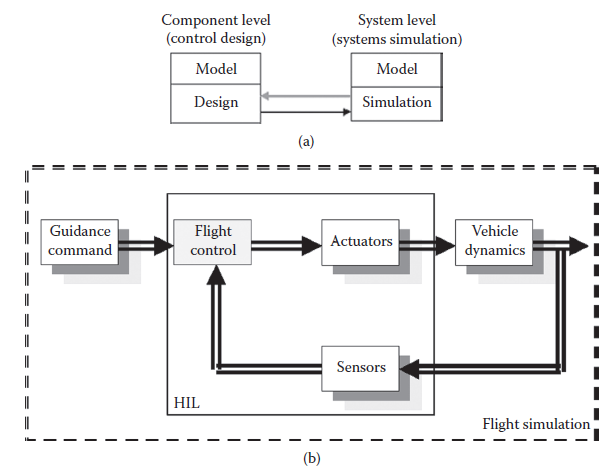
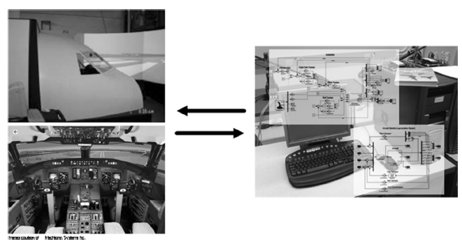
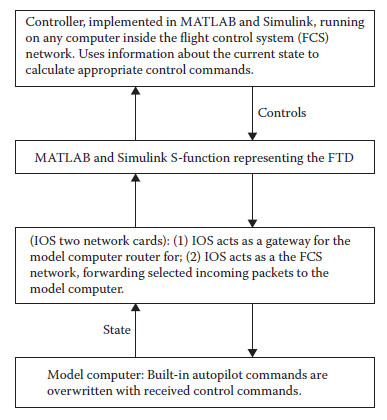

[13.3 <--- ](13_3.md) [   Зміст   ](README.md) [--> 13.5](13_5.md)

## 13.4. INTERACTIVE FLIGHT CONTROL SYSTEM DEVELOPMENT TEST BED

One of the key requirements for an integrated development process is the “plug-and-play” capability, which enables decoupled component (subsystem) design and integrated testing based on the same model. Therefore, design decisions are gradually finalized through iterations between component-level and system-level developments. For complex control systems development, strategies have been proposed or developed including the computer-automated multiparadigm modeling, actor-oriented control system design approach, cosimulation, code integration, model encapsulation, and model translation ([8] and the references therein). Generally speaking, not only are these efforts time-consuming, but they are also still facing technical difficulties to reach seamless integration. Furthermore, the auto-generated code is often not sufficiently optimized to be used in a production environment. As the complexity of the system is increasing rapidly, these challenges become more and more evident. In this section, we introduce an interactive design and simulation platform for flight vehicle systems development. The proposed platform adopts the cosimulation concept and avoids code generation challenges faced by other integration approaches. It enables the component design “plug-and-play” in a systems simulation environment, thereby bringing the “systems simulation” into the “control design” for integrated development. Moreover, the seamless interactive design and simulation is achieved by an adaptive “connect-and-play” capability. The following presentation is based on the work by Liu and Berndt [8].

Однією з ключових вимог до інтегрованого процесу розробки є можливість «підключи і працюй», яка дає змогу проектувати відокремлені компоненти (підсистеми) та інтегроване тестування на основі однієї моделі. Таким чином, проектні рішення поступово завершуються через ітерації між розробками на рівні компонентів і рівнях системи. Для розробки складних систем управління були запропоновані або розроблені стратегії, включаючи комп’ютерне автоматизоване мультипарадигмальне моделювання, підхід до проектування системи керування, орієнтований на акторів, косимуляцію, інтеграцію коду, інкапсуляцію моделі та трансляцію моделі ([8] та посилання в ньому). Загалом, ці зусилля не тільки забирають багато часу, але й досі стикаються з технічними труднощами, щоб досягти бездоганної інтеграції. Крім того, автоматично згенерований код часто недостатньо оптимізований для використання у виробничому середовищі. Оскільки складність системи швидко зростає, ці виклики стають дедалі очевиднішими. У цьому розділі ми представляємо інтерактивну платформу проектування та моделювання для розробки систем літальних апаратів. Запропонована платформа приймає концепцію косимуляції та уникає проблем із створенням коду, з якими стикаються інші підходи до інтеграції. Це дає змогу розробляти компоненти за принципом «підключай і працюй» у середовищі моделювання систем, таким чином перетворюючи «симуляцію системи» в «дизайн керування» для інтегрованої розробки. Крім того, бездоганний інтерактивний дизайн і симуляція досягаються завдяки адаптивній можливості «підключи і грай». Наступна презентація базується на роботі Лю та Берндта [8].

A popular approach in FCS development follows the concept of *code encapsulation* in principle. The controller is designed and validated in isolation by desktop off-line simulation. The controller algorithm codes are generated (in C code as one example). 

Популярний підхід у розробці FCS в принципі дотримується концепції *інкапсуляції коду*. Контролер розроблений і перевірений ізольовано за допомогою автономного моделювання робочого столу. Генеруються коди алгоритму контролера (як один приклад у коді C).

Then, encapsulated as a monolithic submodel, it is integrated into the model of an enclosing system for systems validation and verification. The challenges of the codegeneration-based integration approaches include the level of automation, compatibility, and synchronization of the models and simulations. Since design codes are used as the media, one must ensure that the generated codes can work on heterogeneous simulation platforms, with proper interfaces. If so, it is expected that the code generation can be processed automatically, to avoid tedious manual labor and errors. These challenges are still open research topics. In this section, instead, we adopt a different integration strategy that is similar to cosimulation in principle. As shown in Figure 13.1a, this proposed interactive platform allows the component model to be simulated (plug-and-play) in a different, system-level environment. Moreover, the platform is adaptable such that the systems simulator can “connect” to the design model directly. We believe that this “connect-and-play” capability is one significant improvement over the “plug-and-play” capability. Since there is only one physical design model that takes residence at the component level, one can work with this model to make modifications and perform testing “online” without the intermediate code-generation process. Obviously, the “connect-and-play” property and the adaptability make the design and simulation platform truly interactive and integrated in development. Under the proposed platform (Figure 13.1b), the integrated FCS results in a multiparadigm control framework. It represents a standard FCS block diagram with some special features.

Потім, інкапсульований як монолітна підмодель, він інтегрується в модель огороджувальної системи для валідації та верифікації систем. Проблеми підходів інтеграції на основі генерації коду включають рівень автоматизації, сумісності та синхронізації моделей і симуляцій. Оскільки коди розробки використовуються як засоби масової інформації, необхідно переконатися, що згенеровані коди можуть працювати на гетерогенних платформах моделювання з відповідними інтерфейсами. Якщо це так, очікується, що генерація коду може оброблятися автоматично, щоб уникнути виснажливої ручної праці та помилок. Ці виклики все ще є відкритими темами дослідження. Натомість у цьому розділі ми приймаємо іншу стратегію інтеграції, яка в принципі схожа на косимуляцію. Як показано на малюнку 13.1a, ця запропонована інтерактивна платформа дозволяє імітувати модель компонента (підключи і працюй) в іншому середовищі системного рівня. Крім того, платформа адаптована таким чином, що системний симулятор може «підключитися» до моделі дизайну безпосередньо. Ми вважаємо, що ця можливість «підключи та працюй» є одним із значних покращень у порівнянні з можливістю «підключи та працюй». Оскільки існує лише одна модель фізичного проектування, яка є постійною на рівні компонентів, можна працювати з цією моделлю, щоб вносити зміни та виконувати тестування «онлайн» без проміжного процесу генерації коду. Очевидно, властивість «підключай і грай» і можливість адаптації роблять платформу проектування та моделювання дійсно інтерактивною та інтегрованою в розробку. Відповідно до запропонованої платформи (рис. 13.1b), інтегрована FCS призводить до мультипарадигмальної системи управління. Він являє собою стандартну блок-схему FCS з деякими спеціальними функціями.

The blocks with a drop-down shadow represent “swapping” features. The guidance and command block represents the flight path generation (guidance) or command inputs (for controller design). The actuation and sensor blocks can be replaced by software modules with different levels of fidelity or even hardware equipment. The vehicle dynamics module can also be replaced by different software modules for different simulation purposes. A simplified linearized dynamics model is used for control system design, while full-scale nonlinear flight equations will be used for highfidelity simulations such as flight simulations. To emulate the reality that different flight systems components are physically installed in different locations and their interactions are communicated through mechanical links or electrical bus, the proposed framework allows for a distributed modeling structure. Each block can be individually modeled, as one software module in different processors. Therefore, it is possible to distribute different parts of a computing task across individual processors operating at the same time, or “in parallel,” and thus reduce the overall time to complete the task. Furthermore, the distributed modeling structure makes it feasible to “swap” different modules of the same block, including the HITL simulation. Because of the distributed modeling and “swapping” feature, it is possible to replace block modules developed under different platforms, and even to run simulations on machines from different manufacturers. Therefore, the proposed framework supports heterogeneous simulations.

Блоки з тінню, що розкривається, представляють функції, що змінюються. Блок наведення та команди представляє генерацію траєкторії польоту (наведення) або введення команд (для конструкції контролера). Виконавчі та сенсорні блоки можуть бути замінені програмними модулями з різним рівнем вірності або навіть апаратним обладнанням. Модуль динаміки автомобіля також можна замінити різними програмними модулями для різних цілей моделювання. Спрощена лінеаризована динамічна модель використовується для проектування системи керування, тоді як повномасштабні нелінійні рівняння польоту використовуватимуться для моделювання високої точності, наприклад моделювання польоту. Щоб імітувати реальність того, що різні компоненти польотних систем фізично встановлені в різних місцях, а їх взаємодія передається через механічні зв’язки або електричну шину, запропонована структура дозволяє використовувати структуру розподіленого моделювання. Кожен блок може бути індивідуально змодельований, як один програмний модуль у різних процесорах. Таким чином, можна розподілити різні частини обчислювального завдання між окремими процесорами, що працюють одночасно або «паралельно», і таким чином скоротити загальний час для виконання завдання. Крім того, структура розподіленого моделювання робить можливим «міняти місцями» різні модулі одного блоку, включаючи симуляцію HITL. Завдяки функції розподіленого моделювання та «обміни» можна замінювати блокові модулі, розроблені на різних платформах, і навіть запускати моделювання на машинах різних виробників. Таким чином, запропонована структура підтримує неоднорідне моделювання.

**FIGURE 13.1** (a) An illustration of cosimulation concept; (b) Interactive flight control system design and simulation platform.

To demonstrate the proposed FCS framework and the interactive design and simulation platform, an experimental test bed is set up. A real-time systems simulator and a flight training device (RTSS-FTD) are equipped to provide a suitable proof-of- concept facility, as shown in Figure 13.2.

Щоб продемонструвати запропоновану структуру FCS та інтерактивну платформу проектування та моделювання, створено експериментальний стенд. Симулятор систем реального часу та пристрій для навчання польоту (RTSS-FTD) обладнані для забезпечення відповідного засобу підтвердження концепції, як показано на малюнку 13.2.

The RTSS facility is a networked cluster of high-end COTS computers. Its core computing features include three host computers, each having dual-Pentium processors running Windows 2000 OS; four real-time computers, each having dual-Pentium processors running the QNX real-time operating system; and real-time nodes that are directly connected by 400 Mbit/s FireWire and communicate with hosts over a dedicated 100-Mbit/s Ethernet network. Furthermore, the system consists of a 108 multiple channel input/output (I/O) system for HITL simulation. The RTSS is also connected through a 1.25 Gb/s Giganet to a similar facility to share data and sources, and it is connected to a 56-alpha-processor high-power computer for off-line computing and simulation, as well as data storage. This configuration provides the following key capabilities to support our proposed framework.4

Об’єкт RTSS – це мережевий кластер високоякісних комп’ютерів COTS. Його основні обчислювальні функції включають три хост-комп'ютери, кожен з яких має два процесори Pentium під керуванням ОС Windows 2000; чотири комп'ютери реального часу, кожен з яких має два процесори Pentium під управлінням операційної системи реального часу QNX; і вузли реального часу, які безпосередньо підключені за допомогою 400 Мбіт/с FireWire і спілкуються з хостами через виділену мережу Ethernet 100 Мбіт/с. Крім того, система складається з 108 багатоканальної системи введення/виведення (I/O) для моделювання HITL. RTSS також підключений через Giganet 1,25 Гбіт/с до подібного засобу для обміну даними та джерелами, і він підключений до високопотужного комп’ютера з 56-альфа-процесором для автономних обчислень і моделювання, а також для зберігання даних. . Ця конфігурація надає наступні ключові можливості для підтримки запропонованої нами структури.4

     

**FIGURE 13.2** Integrated flight control system development test bed.

A separate FTD is set up for flight simulation. It simulates the operation of a generic jet aircraft within the tolerances and conditions set out by the Transport Canada Authority. The major aircraft subsystems include the automatic controls; the auxiliary power unit (APU); doors; the engine indication and crew alerting system (EICAS); the electrical systems; the environmental control systems; flight controls and flight instruments; the fuel, pneumatic, and hydraulic systems; the landing gear; the lighting; and the navigation and communications systems. The design of the FTD is such that all the simulated functionality is concentrated in the software model running on the host computer. This software model contains all the mathematical and logic modeling to make the FTD behave like the Generic Jet aircraft. All the other computers and hardware are I/O interfaces between the pilot/copilot and the model software running on the host computer. The control loading is handled by a PC on the network. It communicates with the host on the Ethernet switch. This computer has digital wiring running to the primary flight controls in the cockpit. The computer systems are networked through a 100 Mbaud Ethernet switch. All the simulated aircraft panels are intelligent; they each contain an embedded CPU that manages their local I/O and communicates with the host computer through a CAN bus network. The aircraft flight and subsystem models are developed using the C programming language. The visual database is developed using the MultiGen paradigm ([www.](http://www.presagis.com/) [presagis.com](http://www.presagis.com/)). The control system is developed under the MATLAB® (version 7.6) and Simulink® (version 7.1) platform. Both MATLAB and Simulink are software packages provided by MathWorks Inc. ([www.mathworks.com](http://www.mathworks.com/)). A fully functional FTD also includes an instructor operation station (IOS).

Для імітації польоту встановлено окремий FTD. Він імітує роботу звичайного реактивного літака в межах допусків і умов, встановлених Управлінням транспорту Канади. Основні підсистеми літака включають автоматичне керування; допоміжна силова установка (ДСУ); двері; система індикації двигуна та оповіщення екіпажу (EICAS); електричні системи; системи екологічного контролю; органи управління польотом і польотні прилади; паливна, пневматична та гідравлічна системи; шасі; освітлення; і системи навігації та зв'язку. Конструкція FTD така, що всі змодельовані функції зосереджені в моделі програмного забезпечення, що працює на головному комп’ютері. Ця модель програмного забезпечення містить усі математичне та логічне моделювання, щоб FTD поводився як реактивний літак Generic Jet. Усі інші комп’ютери та апаратне забезпечення є інтерфейсами вводу/виводу між пілотом/другим пілотом і програмним забезпеченням моделі, що працює на головному комп’ютері. Керування завантаженням здійснюється ПК у мережі. Він спілкується з хостом через комутатор Ethernet. Цей комп’ютер має цифрову проводку до основних елементів керування польотом у кабіні. Комп’ютерні системи об’єднані в мережу через комутатор Ethernet 100 Мбод. Усі змодельовані панелі літака є інтелектуальними; кожен з них містить вбудований центральний процесор, який керує їхнім локальним вводом-виводом і спілкується з головним комп’ютером через мережу шини CAN. Моделі польоту та підсистеми літака розроблені на мові програмування C. Візуальна база даних розроблена з використанням парадигми MultiGen ([www.](http://www.presagis.com/) [presagis.com](http://www.presagis.com/)). Система керування розроблена на платформі MATLAB® (версія 7.6) та Simulink® (версія 7.1). І MATLAB, і Simulink — це програмні пакети, надані MathWorks Inc. ([www.mathworks.com](http://www.mathworks.com/)). Повнофункціональний FTD також включає робочу станцію інструктора (IOS).

In summary, the RTSS is able to simulate the aircraft systems and flight maneuvers. The features of reconfigurability, modeling, and customization of cockpit displays are critical to our systems integration research. The FTD presents a more complete and realistic aircraft model, which includes factors not taken into account in the RTSS development. It offers a different perspective as the flight mission may be observed from a cockpit with out-the-window visual and instrument displays. The RTSS and FTD facilities are connected through Ethernet cables to form a networked RTSS-FTD test bed for integrated modeling and simulation activities.

Підсумовуючи, RTSS здатний імітувати системи літака та маневри польоту. Особливості реконфігурації, моделювання та налаштування дисплеїв у кабіні є критично важливими для наших досліджень системної інтеграції. FTD представляє більш повну та реалістичну модель літака, яка включає фактори, не враховані при розробці RTSS. Він пропонує іншу перспективу, оскільки за виконанням польоту можна спостерігати з кабіни пілота з візуальними дисплеями та дисплеями приладів, що знаходяться поза вікном. Обладнання RTSS і FTD з’єднані через кабелі Ethernet, щоб утворити об’єднану в мережу тестову платформу RTSS-FTD для інтегрованого моделювання та симуляції.

To use the FTD as a test bed for interactive controller design and simulation, a network connection is established for “connect-and-play.” As introduced before, the control development environment uses the MATLAB and Simulink platform that offers an application programming interface called “S-function” that can be used to integrate blocks with user-defined behavior into a Simulink block diagram. The idea is to let an S-function for MATLAB and Simulink work as a network I/O layer, which outputs the current state vector of the FTD and takes control commands as inputs, as it is commonly done with HITL approaches ([Figure 13.3](#_bookmark79)). Note that the control input can carry additional payload, if necessary. In particular, the S-function allows for three values of wind components, which, if given, will be used to overwrite the built-in wind model. It was then decided that a transmission control protocol and Internet protocol (TCP/IP) connection offers the robustness needed for controller operation. The packet format used for the network connection is simple, yet extensible. A fixed-length integer specifying the total packet length is followed by an arbitrary number of triples specifying an identifier, a value, and a delimiter. The S-function is written in the programming language C and can be further customized at compile time using preprocessor macros. This way, among other preferences, maximum allowable packet length and floating point data formats can be adjusted.

Щоб використовувати FTD як тестовий стенд для інтерактивного проектування контролера та моделювання, мережеве з’єднання встановлюється для «підключення та роботи». Як зазначалося раніше, середовище розробки керування використовує платформу MATLAB і Simulink, яка пропонує інтерфейс прикладного програмування під назвою «S-функція», який можна використовувати для інтеграції блоків із визначеною користувачем поведінкою в блок-схему Simulink. Ідея полягає в тому, щоб дозволити S-функції для MATLAB і Simulink працювати як мережевий рівень вводу-виводу, який виводить вектор поточного стану FTD і приймає команди керування як вхідні дані, як це зазвичай робиться з підходами HITL ([Малюнок 13.3). ](#_bookmark79)). Зверніть увагу, що керуючий вхід може нести додаткове корисне навантаження, якщо необхідно. Зокрема, S-функція допускає три значення компонентів вітру, які, якщо їх надати, використовуватимуться для перезапису вбудованої моделі вітру. Потім було вирішено, що протокол керування передачею та з’єднання Інтернет-протоколу (TCP/IP) забезпечують надійність, необхідну для роботи контролера. Формат пакетів, який використовується для підключення до мережі, простий, але розширюваний. Ціле число фіксованої довжини, що вказує загальну довжину пакета, супроводжується довільною кількістю потрійок, що визначають ідентифікатор, значення та розділювач. S-функція написана на мові програмування C і може бути додатково налаштована під час компіляції за допомогою макросів препроцесора. Таким чином, серед інших параметрів, можна налаштувати максимально допустиму довжину пакета та формати даних із плаваючою комою.

**FIGURE 13.3** Network communication.

[13.3 <--- ](13_3.md) [   Зміст   ](README.md) [--> 13.5](13_5.md)