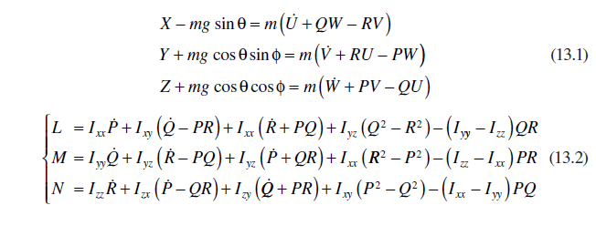
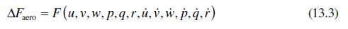
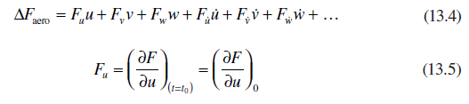
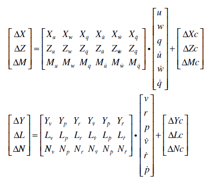
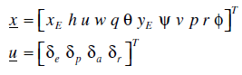
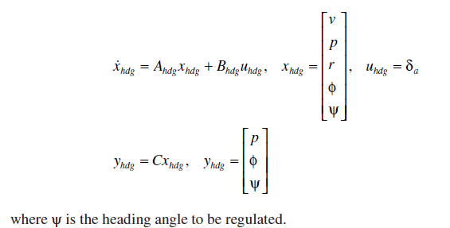
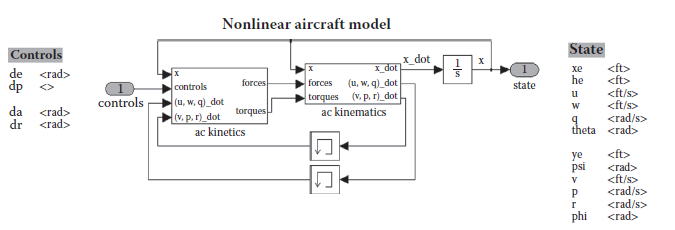
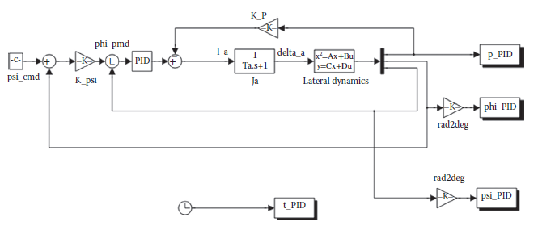

[13.4 <--- ](13_4.md) [   Зміст   ](README.md) [--> 13.6](13_6.md)

## 13.5. DESIGN CASE STUDY

We provide a business jet aircraft model to illustrate the interactive FCS development. The 50-seat Canadair Regional Jet 200 (CRJ200) series was announced by Bombardier in 1995 and introduced into service in 1996. The design of the CRJ200, which evolved from the Challenger 604 business jet, is for regional airline operations. The aircraft is equipped with high-efficiency engines giving a range up to 3050 km. The wings are transonic and are fitted with winglets for efficient high-speed flight.

The general equations of motion of this flight vehicle are described by the general rigid-body dynamics when choosing the body reference frame:

where the aerodynamic forces and moments are expressed in the body frames [X Y Z]T and [*L M N*]T, respectively. In most cases, a perturbed fluid-aerodynamic force (moment) is a function of perturbed linear and angular velocities and their rates are as follows:

Thus, the aerodynamic force at time *t*0 is determined by its series expansion of the right-hand side of this equation:

and so on are known as the *stability derivatives*, or more generally as *aerodynamic derivatives*. Because of the assumed symmetry of the vehicle, derivatives of *X*,*Z*,*M* with respect to motions out of the longitudinal plane are zero. This may be visualized by noting that *X*,*Z*,*M* must be symmetrical with respect to lateral perturbations. In other words, we neglect the symmetric derivatives with respect to the asymmetric motion variables, that is, for aerodynamic force *X*, *Xv* = *Xp* = *Xr* = 0, and so on:

The fully nonlinear dynamic model of the aircraft is implemented in MATLAB and Simulink, as shown in [Figure 13.4](#_bookmark80), where the states also include the inertial position displacement *xE*, *yE*, altitude *h*, and control inputs are specified by the control surface deflection angles:

In this example, we design and test the altitude hold and steady-turn (heading hold) autopilot function ([Figure 13.5](#_bookmark80)). To carry out the control design, we start by developing a linearized lateral system design model about a reference equilibrium. The reference steady flight condition is cruising at 33,000 ft altitude, Mach 0.74 (or speed of 726.5928 fps). The linearized *G*(*s*) is represented by

**FIGURE 13.4** Nonlinear aircraft model.

**FIGURE 13.5** Autopilot in heading control.

We then use the linear system platform LinAC _ Hdg _ Hold _ Sample.mdl to design a heading-hold controller. During the steady flight at 33,000 ft, command  the airplane for a steady 90-degree turn under the heading-holding autopilot, that is, the autopilot controls the heading step change of ψ = 0 ⇒ 90 (deg).

The design requirements are as follows:

1. The aircraft is stable during the motion.

2. The heading overshoot is less than 10%.

3. The steady heading error is less than 5%.

A sample proportional-integral-derivative (PID) control structure is provided. Once the design is complete and satisfactory, the validation is carried out through simulations on the nonlinear Simulink model nonLinAC _ Hdg _ Hold _ Sample.mdl ([Figures 13.6 ](#_bookmark81)and 13.7). Two test cases should be performed:

1. Heading command of ψ = 90 (deg) only while maintaining altitude at 33,000 ft.

2. Heading command of ψ = 90 (deg) with altitude climb to 35,000 ft.

The linear simulation result is shown in [Figure 13.8](#_bookmark82); the nonlinear simulation results are presented in [Figures 13.9 ](#_bookmark83)and 13.10.

The next step is to incorporate the design into the interactive FCS platform as described before. To assure that there exists a stable solution and it is feasible to run successful flight simulation, we demonstrate a successful design, using a linear quadratic regulation (LQR) approach. In this case, both nonlinear off-line simulation results ([Figure 13.11](#_bookmark84)) and flight simulation results ([Figure 13.12](#_bookmark84)) are quite satisfactory. Note that the flight simulation model is similar to [Figure 13.7 ](#_bookmark82)except the aircraft model inside the box will directly connect to the FTD according to the communication protocol. The snapshots of the FTD simulation results can either be read from the cockpit panel or recorded at the remote desktop computer, as shown in [Figure 13.13](#_bookmark85).

[13.4 <--- ](13_4.md) [   Зміст   ](README.md) [--> 13.6](13_6.md)