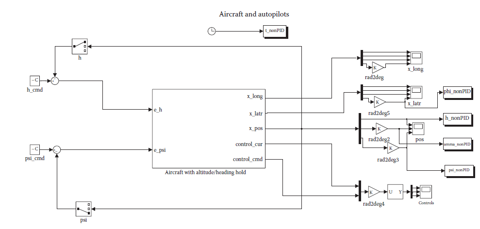
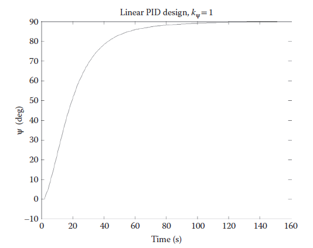
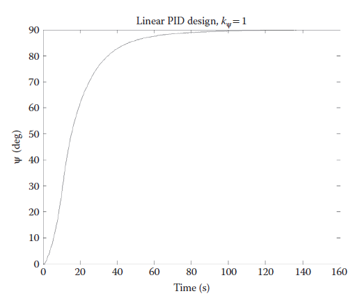
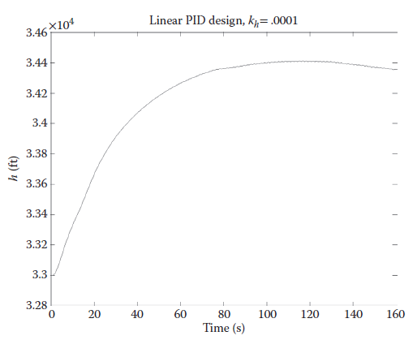
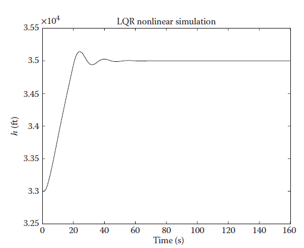
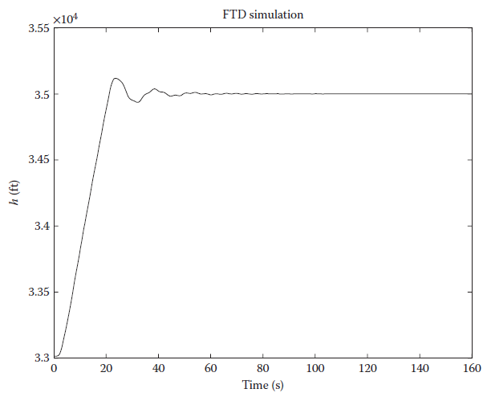
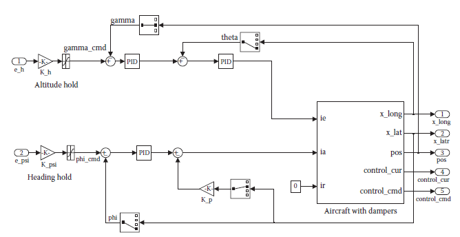
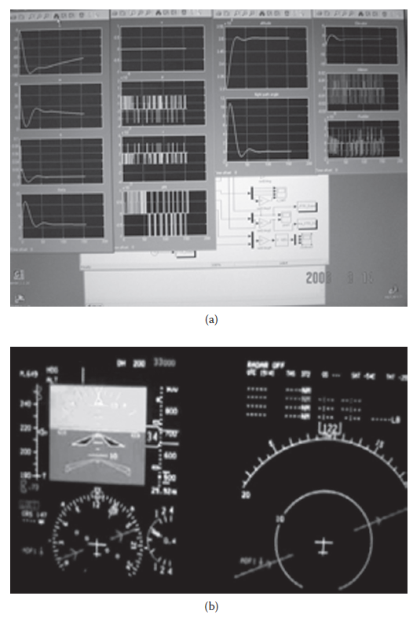

[13.5 <--- ](13_5.md) [   Зміст   ](README.md) [--> 13.7](13_7.md)

## 13.6. CHALLENGES AND LESSONS LEARNED

To develop the interactive FCS and implement it to the flight simulation platform, a number of challenges were encountered and have been addressed in the research investigation.

Щоб розробити інтерактивну FCS і впровадити її на платформу моделювання польоту, виникла низка проблем, які були розглянуті в дослідницькому дослідженні.

•   The design, simulation, and integration architecture. The I/O interface is required to be consistent, such that the model can be substituted seamlessly.

•   The switch between the simulator built-in autopilot function and the designed one must be smooth. It is activated by a command to turn on the design (and automatically overwrites the default one). It is automatically turned off once the testing phase is complete.

•   Version control. Even though it is a relatively trivial issue, we did experience on a couple of occasions that the off-line design and simulation model was not compatible with the nonlinear platform for flight simulation. It was solved by specifying the version and release of the software environment.

• Архітектура проектування, моделювання та інтеграції. Інтерфейс вводу/виводу повинен бути узгодженим, щоб модель могла легко замінюватися.

• Перемикання між вбудованою функцією автопілота симулятора та розробленою має бути плавним. Він активується командою для ввімкнення дизайну (і автоматично перезаписує стандартний). Він автоматично вимикається після завершення фази тестування.

• Контроль версій. Незважаючи на те, що це відносно тривіальна проблема, ми кілька разів стикалися з тим, що модель автономного дизайну та імітаційної моделі не були сумісні з нелінійною платформою для симуляції польоту. Вирішувалося шляхом вказівки версії та випуску програмного середовища.

**FIGURE 13.6** Nonlinear model for simulation.

**FIGURE 13.7** Control design implemented in nonlinear model.

**FIGURE 13.8** Linear simulation result: ψ.

**FIGURE 13.9** Nonlinear simulation result: ψ.

**FIGURE 13.10** Nonlinear simulation result: *h*.

**FIGURE 13.11** Nonlinear simulation of altitude from linear quadratic regulation design.

**FIGURE 13.12** Flight simulation of altitude from linear quadratic regulation design.

**FIGURE 13.13** Interactive flight control system flight training device simulation (a) realtime simulation results display; (b) real-time cockpit display.

[13.5 <--- ](13_5.md) [   Зміст   ](README.md) [--> 13.7](13_7.md)