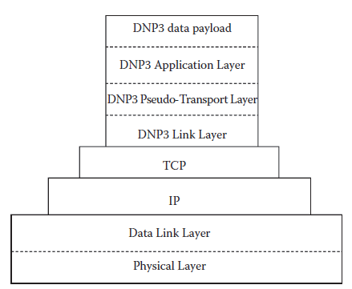

[14.1 <--- ](14_1.md) [   Зміст   ](README.md) [--> 14.3](14_3.md)

## 14.2. SIMULATING DNP3

### 14.2.1 RINSE

The Scalable Simulation Framework (SSF) [20] is a framework that can be extended to support complex systems such as fluid dynamics, raytracing, and computer networks. Based on SSF, RINSE is a network simulator that serves as the basis for this research and has been through several iterations. RINSE is currently maintained by a team of developers working on the TCIP project at the University of Illinois. Developers are working on various topics including wireless communications, switch modeling, and intrusion prevention through game theory. RINSE has traditionally been used as a wireline network communications simulator to explore malicious behavior in the Internet—namely, worms, botnets, and denial-of-service attacks. The scalability that RINSE allows and the similarity of the Internet to the SCADA infrastructure make it a good candidate for simulating SCADA traffic.

Scalable Simulation Framework (SSF) [20] — це структура, яка може бути розширена для підтримки складних систем, таких як гідродинаміка, трасування променів і комп’ютерні мережі. Заснований на SSF, RINSE — це симулятор мережі, який служить основою для цього дослідження та пройшов кілька ітерацій. Зараз RINSE підтримується командою розробників, які працюють над проектом TCIP в Університеті Іллінойсу. Розробники працюють над різними темами, включаючи бездротовий зв’язок, моделювання комутаторів і запобігання вторгненням через теорію ігор. RINSE традиційно використовувався як симулятор дротової мережі зв’язку для дослідження зловмисної поведінки в Інтернеті, а саме черв’яків, ботнетів і атак типу «відмова в обслуговуванні». Масштабованість, яку дозволяє RINSE, і схожість Інтернету з інфраструктурою SCADA роблять його хорошим кандидатом для моделювання трафіку SCADA.

RINSE has a number of properties that make it amenable to large-scale simulation. SSF enables highly parallelizable models by partitioning graphs into submodels. These submodels, which compose the main model, are divided such that communication between them is kept to a minimum, which allows the maximal advantage of multicore systems. Also, RINSE supports multiple resolutions. That is, RINSE can calibrate the fidelity of a simulation to ensure that it runs in real time. It does this by providing a fluid model [21] for traffic and allowing both full-fidelity traffic and fluid models to exist within the same simulation. These fluid models exist for various components of RINSE such as transport protocols, routers, and links. These models also exist for modeling network topologies, and by utilizing these models, RINSE achieves a significant speedup over using a full-resolution model.

RINSE має ряд властивостей, які роблять його придатним для широкомасштабного моделювання. SSF забезпечує високорозпаралелізовані моделі шляхом поділу графіків на підмоделі. Ці субмоделі, які складають основну модель, розділені таким чином, що зв’язок між ними зведений до мінімуму, що забезпечує максимальну перевагу багатоядерних систем. Крім того, RINSE підтримує кілька роздільних здатностей. Тобто RINSE може відкалібрувати точність моделювання, щоб забезпечити його виконання в режимі реального часу. Він досягає цього, надаючи рідинну модель [21] для трафіку та дозволяючи існувати повноцінному трафіку та рідинним моделям в одній симуляції. Ці рідинні моделі існують для різних компонентів RINSE, таких як транспортні протоколи, маршрутизатори та канали зв’язку. Ці моделі також існують для моделювання мережевих топологій, і, використовуючи ці моделі, RINSE досягає значного прискорення порівняно з використанням моделі з повною роздільною здатністю.

RINSE also supports simulation speeds that are faster than real time such that the simulator is not dependent on wall-clock time to advance the simulator time. This is important when interfacing with real devices through emulation. Instead of synchronizing with the wall clock, the simulator keeps track of its own timeline and, where possible, computes traffic ahead of when it will be needed. Combined with prioritizing emulated packets, RINSE can provide a large-scale simulation environment that is not slowed down by interacting with physical devices.

RINSE також підтримує швидкості симуляції, які є вищими за реальний час, тому симулятор не залежить від часу настінного годинника для випередження часу симулятора. Це важливо при взаємодії з реальними пристроями через емуляцію. Замість синхронізації з настінним годинником симулятор відстежує власну часову шкалу та, де це можливо, обчислює трафік наперед, коли це буде потрібно. У поєднанні з пріоритезацією емульованих пакетів RINSE може забезпечити широкомасштабне середовище моделювання, яке не сповільнюється взаємодією з фізичними пристроями.

Additionally, RINSE is modular in such a way that new protocols and new models can be developed. By implementing new protocols through extending the base *ProtocolMessage*, RINSE can support the integration of existing or nascent protocols. Likewise, the *ProtocolSession* class allows us to develop new layers in the protocol stack. In the case of DNP3, for instance, the relays are derived from the *ProtocolSession* class and communicate with the data aggregators through messages derived from the *ProtocolMessage* class. The *ProtocolSessions* that comprise a host are indicated in a file by using the Domain Modeling Language (DML). DML describes a model as a tree of key-value pairs, and a file containing a DML model is passed to the simulation engine at runtime. These key-value pairs are then interpreted and used to derive the network topology, hosts, protocols, and traffic patterns. This allows RINSE to simulate any number of models without having to recompile, thus increasing the turnaround time between testing iterations of the same model.

Крім того, RINSE є модульним таким чином, що дозволяє розробляти нові протоколи та нові моделі. Впроваджуючи нові протоколи шляхом розширення базового *ProtocolMessage*, RINSE може підтримувати інтеграцію існуючих або нових протоколів. Так само клас *ProtocolSession* дозволяє нам розробляти нові рівні в стеку протоколів. У випадку DNP3, наприклад, ретранслятори походять від класу *ProtocolSession* і спілкуються з агрегаторами даних через повідомлення, отримані від класу *ProtocolMessage*. *ProtocolSessions*, які складають хост, позначаються у файлі за допомогою мови моделювання домену (DML). DML описує модель як дерево пар ключ-значення, а файл, що містить модель DML, передається механізму моделювання під час виконання. Потім ці пари ключ-значення інтерпретуються та використовуються для отримання топології мережі, хостів, протоколів і моделей трафіку. Це дозволяє RINSE симулювати будь-яку кількість моделей без необхідності перекомпілювати, таким чином збільшуючи час виконання між ітераціями тестування однієї моделі.

To use RINSE to model the power grid, we must first define the protocol that virtual SCADA devices will use to communicate with one another. When simulating a new protocol or device, there always exists the question of how accurately we must model the proposed design. The option of tweaking parameters of a different model to estimate the new model rarely works because often there are fundamental features that do not lend themselves to be portrayed by a different model. For instance, we could hypothetically model the power grid as a purely Transmission Control Protocol/Internet Protocol (TCP/IP)-oriented network, with parameters such as poll interval, packet size, latency, and bandwidth set to portray the parameters present in the power grid. However, this would completely ignore the idiosyncrasies of the grid itself. For instance, if there is a vulnerability in the protocol specification or implementation, it would be agnostic to the network layout and configuration. In this manner, we can say that to capture the quirks and security assumptions of a protocol, we must model that protocol as accurately as the scale of the network permits. Here, we provide a brief overview of the three DNP3 layers.

Щоб використовувати RINSE для моделювання електромережі, ми повинні спочатку визначити протокол, який віртуальні пристрої SCADA використовуватимуть для зв’язку один з одним. При моделюванні нового протоколу або пристрою завжди виникає питання про те, наскільки точно ми повинні змоделювати запропонований дизайн. Варіант налаштування параметрів іншої моделі для оцінки нової моделі рідко працює, оскільки часто існують фундаментальні особливості, які не піддаються зображенню в іншій моделі. Наприклад, ми могли б гіпотетично змоделювати електромережу як мережу, орієнтовану виключно на протокол керування передачею/протокол Інтернету (TCP/IP), із такими параметрами, як інтервал опитування, розмір пакету, затримка та пропускна здатність, встановлені для зображення параметрів, присутніх у енергосистема. Однак це повністю ігнорує особливості самої сітки. Наприклад, якщо є вразливість у специфікації або реалізації протоколу, вона не залежить від схеми та конфігурації мережі. Таким чином, ми можемо сказати, що, щоб вловити особливості та припущення щодо безпеки протоколу, ми повинні моделювати цей протокол настільки точно, наскільки це дозволяє масштаб мережі. Тут ми надаємо короткий огляд трьох рівнів DNP3.

### 14.2.2 DNP3 Overview

Designed to provide interoperability and an open standard to device manufacturers, DNP v3.0[22] has gained prominence in the U.S. electrical grid as the communication protocol among power grid equipment. Versions 1.0 and 2.0 were never released to the public. So as to not confuse this protocol with previous implementations, this chapter will refer to DNP v3.0 as DNP3. DNP3 is designed to operate in environments with a high electronics density. These environments can be fairly noisy, and therefore, DNP3 is designed to be as robust as possible with respect to detecting and recovering from error. Cyclic redundancy check (CRC) bytes are extensively used to detect when bits have been flipped and a small frame size (292 bytes) is used to localize errors and reduce the overhead imposed by resending frames.

Розроблений для забезпечення сумісності та відкритого стандарту для виробників пристроїв, DNP v3.0[22] отримав популярність в електричній мережі США як протокол зв’язку між обладнанням електромережі. Версії 1.0 і 2.0 ніколи не були оприлюднені. Щоб не плутати цей протокол із попередніми реалізаціями, у цій главі DNP v3.0 називатиметься DNP3. DNP3 призначений для роботи в середовищах з високою щільністю електроніки. Ці середовища можуть бути досить шумними, і тому DNP3 розроблено таким чином, щоб бути максимально надійним щодо виявлення та відновлення після помилки. Циклічна надлишкова перевірка (CRC) байтів широко використовується для виявлення, коли біти були перевернуті, а малий розмір кадру (292 байти) використовується для локалізації помилок і зменшення накладних витрат, пов’язаних із повторним надсиланням кадрів.

The protocol was designed as a stack of three layers: the Data Link Layer, the Pseudo Transport Layer, and the Application Layer. The physical medium is generally either Ethernet or RS-485. Since these standards are common, DNP3 can be run over existing networks or networks can be built from the ground up to support DNP3 SCADA networks. The Data Link Layer can either be run directly on the physical medium or it can be encapsulated by other protocols as seen in Figure 14.1.

Протокол був розроблений як стек із трьох рівнів: канальний рівень, псевдотранспортний рівень і прикладний рівень. Фізичним носієм зазвичай є Ethernet або RS-485. Оскільки ці стандарти є загальними, DNP3 можна запускати в існуючих мережах або мережі можна будувати з нуля для підтримки мереж DNP3 SCADA. Канальний рівень можна або запускати безпосередньо на фізичному носії, або він може бути інкапсульований іншими протоколами, як показано на малюнку 14.1.

**FIGURE 14.1** DNP3 Protocol stack encapsulated by Transmission Control Protocol/Internet Protocol (TCP/IP).

This layer provides framing information and reliability. On top of the Data Link Layer is the Pseudo-Transport Layer. This simple layer is used to support fragmentation. Finally, the top layer is the Application Layer that acts on behalf of the user for requesting/confirming/sending/receiving requests and data.

Цей рівень забезпечує формування інформації та надійність. Поверх канального рівня даних розташований псевдотранспортний рівень. Цей простий шар використовується для підтримки фрагментації. Нарешті, верхній рівень — це прикладний рівень, який діє від імені користувача для запиту/підтвердження/надсилання/отримання запитів і даних.

#### 14.2.2.1 Data Link Layer

The DNP3 Data Link Layer is responsible for point-to-point communication. Essentially, what is contained in this layer is addressing. More specifically, the individual fields for this layer can be seen in the top portion of Figure 14.2. From this layer, we obtain information about the direction of travel, which party initiated the communication, whether the stream is on an odd- or even-numbered frame, and for what function the frame is going to be used. Finally, there is one byte for the length of the packet. This length is the number of bytes in the message *disregarding* the CRC bytes, which are computed against the first eight bytes.

Канальний рівень DNP3 відповідає за зв’язок «точка-точка». По суті, те, що міститься на цьому рівні, є адресацією. Більш конкретно, окремі поля для цього шару можна побачити у верхній частині рисунка 14.2. З цього рівня ми отримуємо інформацію про напрямок руху, яка сторона ініціювала зв’язок, чи знаходиться потік у кадрі з парним чи непарним номером і для якої функції цей кадр буде використовуватися. Нарешті, є один байт для довжини пакета. Ця довжина є кількістю байтів у повідомленні *без урахування* байтів CRC, які обчислюються проти перших восьми байтів.

 

**FIGURE 14.2** Three layers of DNP3. (Form DNP Users Group, *DNP v3.0 Guide: A Protocol Primer*, 2008. With permission.)

#### 14.2.2.2 Psuedo-Transport Layer

This layer is responsible for the segmentation of the Application Layer into lower- level frames. It is a rather simple layer that consists of only one byte. As seen in the middle box in [Figure 14.2](#_bookmark86), this byte is divided into three fields. The most significant bit, *FIN*, indicates whether this frame is the last in a sequence of frames that correspond to one Application Layer fragment. The second bit, *FIR*, indicates whether this frame is the first in a sequence of frames that correspond to one Application Layer fragment. For a message that can fit into one frame, both of these bits would be set.

Цей рівень відповідає за сегментацію прикладного рівня на кадри нижчого рівня. Це досить простий шар, який складається лише з одного байта. Як видно в середньому полі на [Рис. 14.2] (#_bookmark86), цей байт поділено на три поля. Старший біт, *FIN*, вказує, чи є цей кадр останнім у послідовності кадрів, які відповідають одному фрагменту прикладного рівня. Другий біт, *FIR*, вказує, чи є цей кадр першим у послідовності кадрів, які відповідають одному фрагменту прикладного рівня. Для повідомлення, яке може поміститися в один кадр, буде встановлено обидва ці біти.

The lower six bits act as the sequence number, which serves to detect dropped frames, out-of-order frames, and other such errors. Once the counter reaches 0×3*F*, it simply resets to 0. Further information can be found in the DNP3 specification for the transport function, volume 3 [24].

Молодші шість бітів діють як порядковий номер, який слугує для виявлення пропущених кадрів, кадрів не в порядку та інших подібних помилок. Коли лічильник досягає 0×3*F*, він просто скидається на 0. Додаткову інформацію можна знайти в специфікації DNP3 для транспортної функції, том 3 [24].

#### 14.2.2.3 Application Layer

The bottom box of Figure 14.2 shows the Application Layer. The Application Layer is composed of two sections—the Application Protocol Control Information (APCI) and the Application Service Data Unit (ASDU). The APCI can either be a response header or a request header depending on the purpose of the packet. The fields in the APCI contain fragmentation information as well as a function code describing the purpose of the message. A response header also contains Internal Indications that are spread across 2 bytes as 16 separate bit fields. Their values are described here, but their general purpose is to indicate device status or provide an error message. Following this identification code in a response is any data that the master may have requested. Information can be found in the DNP3 specification, volume 2 [25]. 

У нижньому полі на малюнку 14.2 показано прикладний рівень. Рівень додатків складається з двох розділів — контрольної інформації протоколу додатків (APCI) і блоку даних служби додатків (ASDU). APCI може бути або заголовком відповіді, або заголовком запиту залежно від мети пакета. Поля в APCI містять інформацію про фрагментацію, а також код функції, що описує мету повідомлення. Заголовок відповіді також містить внутрішні індикації, які розподілені на 2 байти як 16 окремих бітових полів. Їхні значення описані тут, але їхнє загальне призначення — вказувати стан пристрою або надавати повідомлення про помилку. Після цього ідентифікаційного коду у відповіді вказуються будь-які дані, які міг запросити майстер. Інформацію можна знайти в специфікації DNP3, том 2 [25].

### 14.2.3 Attacking DNP3

As one of the primary protocols used to transmit information in the power grid, it is important that we model DNP3 as accurately as possible. One reason for this is that there exist deficiencies in the protocol that allow it to be compromised. For instance, related work has developed a taxonomy to describe attacks against DNP3 that comprises 28 generic attacks (of which there are 91 specific instances) [26], thus showing how vulnerable the protocol is. Countermeasures for these holes could be tested in a simulation environment before becoming part of the standard. Other work has compiled a survey of SCADA-related attacks and discusses techniques such as attack trees, fault trees, and risk analysis as they pertain to CIs [27]. Indeed, much research has been done on both SCADA security gaps [12,28,29,30] and their countermeasures, including data set security [31], SCADA-specific intrusion prevention systems [32], and encapsulating DNP3 in another protocol such as SSL/ TLS (commonly used for secure internet communications, operating at layer 6 of the network stack) or IPSec (a less common protocol used for securing internet connections at network layer 3) [33]. In general, the power grid is susceptible to attack, and while the exact nature of these vulnerabilities is out of the scope of this chapter, this knowledge provides the impetus to model DNP3 accurately enough to reproduce the vulnerabilities in our virtual test bed.

Як один із основних протоколів, що використовуються для передачі інформації в електромережі, важливо, щоб ми моделювали DNP3 якомога точніше. Одна з причин цього полягає в тому, що в протоколі існують недоліки, які дозволяють його скомпрометувати. Наприклад, у відповідній роботі розроблено таксономію для опису атак проти DNP3, яка включає 28 загальних атак (з яких є 91 конкретний випадок) [26], таким чином показуючи, наскільки вразливим є протокол. Контразаходи для цих отворів можуть бути перевірені в середовищі моделювання, перш ніж стати частиною стандарту. В іншій роботі зібрано огляд атак, пов’язаних із SCADA, і обговорюються такі методи, як дерева атак, дерева несправностей та аналіз ризиків, оскільки вони стосуються КІ [27]. Дійсно, було проведено багато досліджень як щодо прогалин у безпеці SCADA [12,28,29,30], так і щодо їх протидії, включаючи безпеку набору даних [31], специфічні для SCADA системи запобігання вторгненням [32] та інкапсуляцію DNP3 в інший протокол, наприклад як SSL/TLS (зазвичай використовується для безпечного Інтернет-зв’язку, що працює на рівні 6 мережевого стеку) або IPSec (менш поширений протокол, який використовується для захисту Інтернет-з’єднань на рівні 3 мережі) [33]. Загалом, електромережа сприйнятлива до атак, і хоча точна природа цих уразливостей виходить за рамки цієї глави, ці знання дають поштовх для моделювання DNP3 достатньо точно, щоб відтворити вразливості на нашому віртуальному тестовому стенді.

### 14.2.4 Mod eling DNP3

No matter the actual implementation of the protocol in the simulator, the protocol must be able to handle all three layers of the stack (Data Link, Transport, and Application). Inside the simulator, we treat the three layers as a combined payload to be transported by TCP/IP, and packets are routed using the IP header as opposed to the Data Link Layer header. However, when dealing with emulated packets, the Data Link source and destination fields are used to direct packets to and from the proper hosts. More information about this can be found in Section 14.2.3, which discusses how translation is done between the IDs of the virtual hosts and their emulated DNP3 addresses.

Незалежно від фактичної реалізації протоколу в симуляторі, протокол повинен мати можливість обробляти всі три рівні стека (канал даних, транспорт і додаток). У симуляторі ми розглядаємо три рівні як об’єднане корисне навантаження, яке транспортується TCP/IP, а пакети маршрутизуються за допомогою заголовка IP, а не заголовка рівня канального зв’язку. Однак при роботі з емульованими пакетами поля джерела та призначення посилання даних використовуються для спрямування пакетів до відповідних хостів і з них. Додаткову інформацію про це можна знайти в Розділі 14.2.3, де обговорюється, як виконується трансляція між ідентифікаторами віртуальних хостів та їхніми емульованими адресами DNP3.

Dealing with emulated packets is an important concern for our use of this virtual DNP3 model. Being compliant with physical devices enables many potential use cases. Without external communications, the RINSE model would provide limited usefulness. It would provide background traffic, metrics regarding correctness and scaling of technologies, and insight into large-scale SCADA networks. However, by being interoperable with physical equipment, more use cases are available that involve a control station. This provides benefit by potentiating training with human-in-the-loop event analysis, incremental deployment analysis, and attack robustness analysis [34]. 

Робота з емульованими пакетами є важливою проблемою для нашого використання цієї віртуальної моделі DNP3. Сумісність із фізичними пристроями дає змогу використовувати багато потенційних випадків. Без зовнішнього зв’язку модель RINSE забезпечить обмежену корисність. Це забезпечить фоновий трафік, показники щодо правильності та масштабування технологій, а також уявлення про великомасштабні мережі SCADA. Однак завдяки сумісності з фізичним обладнанням доступно більше варіантів використання, які включають станцію керування. Це дає перевагу завдяки посиленню навчання за допомогою аналізу подій за допомогою людини в циклі, аналізу поступового розгортання та аналізу стійкості атак [34].

#### 14.2.4.1 Approach

Instead of using a full-fledged implementation of the DNP3 stack, we model our own slightly abstract view because of a number of different reasons. The main reason is scalability. With the potential of modeling hundreds of thousands of relays, it would be intractable to model the full functionality of DNP3. Instead, by focusing on supporting two classes of reads, with only a few object types, and one type of command, we can simplify the control flow to enable quick computation and low-latency replies. However, if requested by a collaborator, the structure to extend the models to support extra function codes does exist.

Замість того, щоб використовувати повноцінну реалізацію стека DNP3, ми моделюємо наше власне трохи абстрактне уявлення через низку різних причин. Основною причиною є масштабованість. З потенціалом моделювання сотень тисяч реле було б важко змоделювати повну функціональність DNP3. Натомість, зосередившись на підтримці двох класів читання, лише з кількома типами об’єктів і одним типом команд, ми можемо спростити потік керування, щоб забезпечити швидке обчислення та відповіді з низькою затримкою. Однак за запитом співавтора існує структура для розширення моделей для підтримки додаткових кодів функцій.

Since the IP layer of our simulator provides routing, it would seem that we do not necessarily have to rely on the DNP3 Data Link Layer to route information from one device to another. We justify this by noting that industry is making a move toward encapsulating DNP3 to take advantage of its routing strengths. Some reasons that we choose to still include the Data Link Layer are that there may be unknown interactions between layers. For instance, if an adversary tampers with a field in this layer, the Application Layer may not function properly. Since some of the attacks mentioned in Section 14.2.3 directly attack the Data Link Layer, without modeling this layer, we would not know whether defenses properly address the vulnerabilities. Also, since our simulator has the capability to emulate nodes (i.e., representing a real host as a stub in the simulation), we must support communication with real hosts. All the pieces of physical equipment in our lab require a well-formed packet to function properly. If we fail to deliver that, then our simulation will not work.

Оскільки IP-рівень нашого симулятора забезпечує маршрутизацію, здається, що нам не обов’язково покладатися на канальний рівень DNP3 для маршрутизації інформації з одного пристрою на інший. Ми виправдовуємо це тим, що промисловість робить крок до інкапсуляції DNP3, щоб скористатися перевагами його маршрутизації. Деякі причини, з яких ми вирішуємо включити рівень зв’язку даних, полягають у тому, що між шарами можуть існувати невідомі взаємодії. Наприклад, якщо зловмисник втручається в поле на цьому рівні, прикладний рівень може не працювати належним чином. Оскільки деякі з атак, згаданих у Розділі 14.2.3, атакують безпосередньо канальний рівень, без моделювання цього рівня ми б не знали, чи належним чином захист усуває вразливості. Крім того, оскільки наш симулятор має можливість емулювати вузли (тобто представляти реальний хост як заглушку в симуляції), ми повинні підтримувати зв’язок із реальними хостами. Для належної роботи всіх частин фізичного обладнання в нашій лабораторії потрібен добре сформований пакет. Якщо нам цього не вдасться, наша симуляція не працюватиме.

#### 14.2.4.2 Trade-offs

We have also made some decisions about the implementation of the protocol. One such decision that is left up to the vendor is how to implement the CRC function. We chose to implement it as a shift/accumulator, since this method has a constant calculation time. The table lookup method, on the contrary, is faster in the best case scenario but endures a penalty if the table is ever evicted from the cache. The RINSE implementation for this function was based on an algorithm released by the DNP3 User’s Group [35], with some modifications to fit within the RINSE framework. In general, when we had to make a decision like this, we decided to follow the industry norms.

Ми також прийняли деякі рішення щодо реалізації протоколу. Одним із таких рішень, яке залишається на розсуд постачальника, є те, як реалізувати функцію CRC. Ми вирішили реалізувати його як зміну/накопичувач, оскільки цей метод має постійний час розрахунку. Метод пошуку таблиці, навпаки, є швидшим у найкращому випадку, але зазнає штрафу, якщо таблицю коли-небудь буде вилучено з кешу. Реалізація RINSE для цієї функції була заснована на алгоритмі, випущеному DNP3 User’s Group [35], з деякими модифікаціями, щоб відповідати структурі RINSE. Загалом, коли нам довелося приймати таке рішення, ми вирішили дотримуватися галузевих норм.

While modeling the three layers as one layer can accelerate simulation time, it also means that DNP3 cannot be used on its own to provide any of its functionality. Currently, this is not a problem, but if there is a need to model DNP3 directly on top of the physical link, it would require a reworking of the DNP3 implementation. Additionally, it would require a rewrite to the way RINSE handles routing as it currently routes based on IP address. In illuminating these drawbacks, it is our hope that we have further illustrated the trade-offs of our design decisions. Where possible, speed and scalability have been optimized over other characteristics.

Хоча моделювання трьох рівнів як одного шару може пришвидшити час моделювання, це також означає, що DNP3 не можна використовувати окремо для забезпечення будь-яких своїх функцій. Наразі це не проблема, але якщо є потреба моделювати DNP3 безпосередньо поверх фізичного зв’язку, це потребуватиме переробки реалізації DNP3. Крім того, це вимагатиме перезапису того, як RINSE обробляє маршрутизацію, оскільки зараз маршрутизується на основі IP-адреси. Висвітлюючи ці недоліки, ми сподіваємося, що ми ще більше проілюстрували компроміси наших дизайнерських рішень. Там, де це можливо, швидкість і масштабованість оптимізовано порівняно з іншими характеристиками.

[14.1 <--- ](14_1.md) [   Зміст   ](README.md) [--> 14.3](14_3.md)