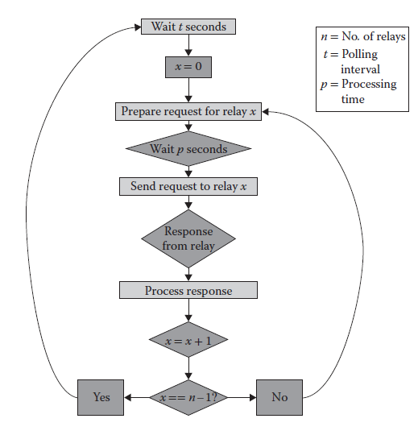

[14.2 <--- ](14_2.md) [   Зміст   ](README.md) [--> 14.4](14_4.md)

## 14.3. VIRTUALIZING HOSTS

To utilize the virtual DNP3 protocol, we now discuss the virtual *hosts* that use DNP3 to communicate with one another. A *host* is the term we give to nodes in the simulator that have some sort of computational power. That is, a host models some physical device. Namely, we have chosen to simulate data aggregators and relays. On the contrary, we have chosen *not* to simulate control stations because of a number of factors including their complex structure, their proprietary nature, and heavy customizability. Instead, we rely on our physical control station, which provides the added benefit of allowing a human to view the simulated network as part of an operational network. These virtual hosts represent a portion of the network that is purely cyber. The underlying electrical properties of this portion of the grid is simulated by PowerWorld—a commercially available power flow simulator, which we use due to its prevalent use in industry. To bridge the gap between PowerWorld and these hosts, we have implemented the State Server, which is discussed in Section 14.3.3.

Щоб використовувати віртуальний протокол DNP3, ми обговоримо віртуальні *хости*, які використовують DNP3 для зв’язку один з одним. *Хост* — це термін, який ми називаємо вузлами в симуляторі, які мають певну обчислювальну потужність. Тобто хост моделює деякий фізичний пристрій. Зокрема, ми вирішили імітувати агрегатори та ретранслятори даних. Навпаки, ми вирішили *не* моделювати контрольні станції через низку факторів, включаючи їхню складну структуру, запатентований характер і великі можливості налаштування. Натомість ми покладаємося на нашу станцію фізичного керування, яка забезпечує додаткову перевагу, дозволяючи людині переглядати змодельовану мережу як частину робочої мережі. Ці віртуальні хости представляють частину мережі, яка є суто кібернетичною. Основні електричні властивості цієї частини мережі моделює PowerWorld — комерційно доступний симулятор потоку електроенергії, який ми використовуємо через його поширене використання в промисловості. Щоб подолати розрив між PowerWorld і цими хостами, ми реалізували State Server, який обговорюється в розділі 14.3.3.

### 14.3.1 Virtual Relays

Relays are responsible for control of physical lines as well as gathering data pertaining to their operation. Relays must determine various characteristics of these lines, such as phase angle, voltage, real and reactive power, and other such values. Additionally, relays must provide information about their own operation such as status values, counters, and synchronization efforts. It is unrealistic to support all of these features in a virtual relay, as that would severely hamper scalability. As such, it is important to determine which subset of features must be supported to provide the largest functional coverage at the lowest computational cost. The functionality that covers a large majority of typical requests is as follows:

Реле відповідають за контроль фізичних ліній, а також за збір даних, що стосуються їх роботи. Реле повинні визначати різні характеристики цих ліній, такі як фазовий кут, напруга, реальна та реактивна потужність та інші подібні значення. Крім того, реле має надавати інформацію про свою роботу, таку як значення стану, лічильники та спроби синхронізації. Нереально підтримувати всі ці функції у віртуальному ретрансляторі, оскільки це серйозно завадить масштабованості. Таким чином, важливо визначити, який піднабір функцій має підтримуватися, щоб забезпечити найбільше функціональне покриття за найменших обчислювальних витрат. Функціональні можливості, які охоплюють переважну більшість типових запитів, такі:

•   *Read Class X data*—*X* can be 0, 1, 2, or 3. Different values of *X* represent different priorities, where 1 refers to data that changes the most often, and 3 the least. Class 0 data includes all data points. Since PowerWorld provides some of these values either directly or indirectly (through simple mathematical operations), this sort of data can be provided to the data aggregators at the substation level.

•   *Turn breaker on/off*—A request sent to the relay to turn on or off can then be passed on to the State Server 

• *Читання даних класу X*—*X* може бути 0, 1, 2 або 3. Різні значення *X* представляють різні пріоритети, де 1 стосується даних, які змінюються найчастіше, а 3 — найменше. Дані класу 0 включають усі точки даних. Оскільки PowerWorld надає деякі з цих значень прямо чи опосередковано (за допомогою простих математичних операцій), такі дані можна надавати агрегаторам даних на рівні підстанції.

• *Увімкнути/вимкнути вимикач* — запит, надісланий до ретранслятора для ввімкнення або вимкнення, може бути передано на державний сервер

When not processing a request, the relays are sitting idle. During this time, they are waiting for a data aggregator to issue a request. Currently, the relays support a limited subset of what their physical analogues support. The relay will thus determine if it can answer the request, and if it is either a data read request or a command, it will perform the required actions. If the request is a read, then the relay will retrieve data from the State Server through its own designated shared memory. If the data aggregator request is a command, the relay takes a corresponding action by writing to shared memory. The State Server is then responsible for forwarding this command to PowerWorld. Once the appropriate action is taken, the relay prepares a response. The response contains either the data or a confirmation, depending on whether the request was a data request or a command, respectively. Once sent, the relay reenters the idle mode and waits for the next request. Some of the difficulties of detecting events and issuing unsolicited responses are discussed in Section 14.6.2.

Коли запит не обробляється, реле простоює. Протягом цього часу вони чекають запиту від агрегатора даних. Наразі реле підтримують обмежену підмножину того, що підтримують їхні фізичні аналоги. Таким чином ретранслятор визначить, чи може він відповісти на запит, і якщо це запит на читання даних або команда, він виконає необхідні дії. Якщо запит є читанням, то ретранслятор буде отримувати дані з State Server через власну призначену спільну пам’ять. Якщо запит агрегатора даних є командою, ретранслятор виконує відповідну дію шляхом запису в спільну пам’ять. Тоді сервер стану відповідає за пересилання цієї команди в PowerWorld. Після виконання відповідної дії реле готує відповідь. Відповідь містить або дані, або підтвердження, залежно від того, був запит запитом даних чи командою відповідно. Після надсилання реле знову переходить у режим очікування та чекає наступного запиту. Деякі з труднощів виявлення подій і видачі небажаних відповідей обговорюються в розділі 14.6.2.

### 14.3.2 Virtual Data Aggregators

The virtual data aggregators have a control flow similar to that of the virtual relays. However, since they require data from the relays instead of PowerWorld, their polling patterns are somewhat different. Instead of sending out one data request per window, an aggregator will send out *n* requests per window, where *n* is the number of relays reporting to it.

Віртуальні агрегатори даних мають потік керування, подібний до віртуальних реле. Однак, оскільки їм потрібні дані з ретрансляторів, а не з PowerWorld, їхні шаблони опитування дещо відрізняються. Замість того, щоб надсилати один запит даних на вікно, агрегатор надсилатиме *n* запитів на вікно, де *n* — це кількість ретрансляторів, які йому надсилають звіти.

The control flow for the master thread, seen in [Figure 14.3](#_bookmark87), describes how the virtual data aggregator polls the relays for which it is responsible. First, the data aggregator waits *t* seconds before beginning the round of requests. Starting with relay 0, the data aggregator prepares a request and waits the appropriate amount of time that its physical analogue would take to produce the request. Then it sends the request and waits for the reply. Once it receives the response, the data aggregator then begins processing the command. Processing the command depends on which data were requested and how the response is formatted. In the basic scenario, the data supplied by the response is simply entered as a corresponding entry into a table, which can be queried by the control station. Once the response is processed, the data aggregator moves on to the next relay and starts the request flow again. Once the data aggregator has polled all of the relays in its list, it waits until the next polling period and resets the current relay to 0.

Потік керування для головного потоку, показаний на [Рис. 14.3] (#_bookmark87), описує, як віртуальний агрегатор даних опитує ретранслятори, за які він відповідає. По-перше, агрегатор даних чекає *t* секунд перед початком циклу запитів. Починаючи з ретранслятора 0, агрегатор даних готує запит і чекає відповідну кількість часу, який знадобиться його фізичному аналогу для створення запиту. Потім надсилає запит і чекає на відповідь. Отримавши відповідь, агрегатор даних починає обробку команди. Обробка команди залежить від того, які дані були запитані та як відформатовано відповідь. У базовому сценарії дані, надані відповіддю, просто вводяться як відповідний запис у таблицю, яку може запитувати станція керування. Після обробки відповіді агрегатор даних переходить до наступного реле й знову запускає потік запитів. Після того як агрегатор даних опитує всі ретранслятори у своєму списку, він чекає до наступного періоду опитування та скидає поточне реле на 0.

**FIGURE 14.3** Data aggregator control flow (master thread).

The data aggregator also acts as a source of data for the control station. This responsibility is handled by the virtual data aggregator’s slave thread. The slave thread essentially acts as a server, remaining idle until it receives an incoming request from the control station. When it receives a request, it begins to process it. The data aggregator then makes a decision based on the function code in the request. If the function corresponds to a read, then the data aggregator will provide the requested data out of its table. If the function is a command, then the data aggregator passes the command to the correct relay and waits for a response. Once either the relay responds or the data is ready (depending on which function code was sent to the data aggregator), the data aggregator prepares a response to the control station. After this, the data aggregator waits for an appropriate delay, corresponding to the delay its physical analogue would take for preparing the packet. Finally, the data aggregator sends the response and goes idle.

Агрегатор даних також виступає джерелом даних для станції керування. Цю відповідальність виконує підлеглий потік віртуального агрегатора даних. Підлеглий потік по суті діє як сервер, залишаючись бездіяльним, доки не отримає вхідний запит від станції керування. Отримавши запит, він починає його обробку. Потім агрегатор даних приймає рішення на основі коду функції в запиті. Якщо функція відповідає читанню, агрегатор даних надасть запитувані дані зі своєї таблиці. Якщо функція є командою, то агрегатор даних передає команду на правильний ретранслятор і чекає на відповідь. Як тільки реле відповість або дані будуть готові (залежно від коду функції, надісланого агрегатору даних), агрегатор даних готує відповідь на станцію керування. Після цього агрегатор даних чекає відповідної затримки, що відповідає затримці, яку його фізичний аналог прийняв би для підготовки пакету. Нарешті, агрегатор даних надсилає відповідь і переходить у режим очікування.

### 14.3.3 State Server

The State Server acts as a single point of contact between the RINSE and the PowerWorld simulation environments. The same procedure that generates the DML file also generates a mapping between PowerWorld entities and the virtual relays that are assigned to monitoring them. Using this mapping, the State Server generates requests according to the PowerWorld Application Programming Interface (API). The requests are split into four different groups—lines, generators, loads, and shunts—which correspond to power grid components. After PowerWorld processes these commands, it sends back a response with the appropriate values.

State Server діє як єдина точка контакту між середовищем моделювання RINSE та PowerWorld. Та сама процедура, яка генерує файл DML, також генерує зіставлення між об’єктами PowerWorld і віртуальними ретрансляторами, яким призначено їх моніторинг. Використовуючи це відображення, State Server генерує запити відповідно до програмного інтерфейсу PowerWorld Application Programming Interface (API). Запити поділяються на чотири різні групи — лінії, генератори, навантаження та шунти — які відповідають компонентам електромережі. Після обробки цих команд PowerWorld надсилає відповідь із відповідними значеннями.

PowerWorld was designed with a server thread, which can serve data to external applications, for which no DNP3 converter had been developed. Hence, we have created this State Server, which consists of four similar tasks being carried out in succession. Polling periods start by preparing a request for shunt values from PowerWorld. After waiting for a response, it processes the response and moves on to requesting generator values. The State Server then repeats the process for load and line values. Finally, the State Server waits *t* seconds before starting the process over again.

PowerWorld було розроблено з серверним потоком, який може передавати дані зовнішнім програмам, для яких не було розроблено конвертер DNP3. Таким чином, ми створили цей сервер стану, який складається з чотирьох подібних завдань, які виконуються послідовно. Періоди опитування починаються з підготовки запиту на значення шунтів від PowerWorld. Після очікування відповіді він обробляє відповідь і переходить до запиту значень генератора. Потім сервер станів повторює процес для значень завантаження та рядків. Нарешті, державний сервер чекає *t* секунд, перш ніж почати процес знову.

Once the data is transferred from PowerWorld to RINSE, it is the responsibility of the State Server to partition the data. Depending on which values were requested, the amount of data a relay will receive can vary from five to nine bytes total. Then, the State Server splits up the response into appropriately sized portions and shares them with the relays through shared memory.

Після того, як дані передано з PowerWorld до RINSE, державний сервер несе відповідальність за розділення даних. Залежно від запитуваних значень, кількість даних, які отримає ретранслятор, може коливатися від п’яти до дев’яти байтів. Потім State Server розбиває відповідь на частини відповідного розміру та передає їх ретрансляторам через спільну пам’ять.

This choice of using shared memory as opposed to explicitly passing a message with the data was made to better represent the practical circumstances. Its sole role is to deliver data from PowerWorld to the virtual relays, and since the State Server has no physical analogue, its latency should be no greater than the time it takes for a relay to measure the line it is connected to—essentially zero. Transmitting this information over the routing network would introduce latency into the system that has no real world analogue.

Вибір використання спільної пам’яті на відміну від явної передачі повідомлення з даними був зроблений для кращого представлення практичних обставин. Його єдина роль полягає в доставці даних із PowerWorld до віртуальних ретрансляторів, і оскільки State Server не має фізичного аналога, його затримка не повинна перевищувати час, потрібний ретранслятору для вимірювання лінії, до якої він підключений, по суті, дорівнює нулю. Передача цієї інформації через мережу маршрутизації призведе до затримки в системі, яка не має аналогів у реальному світі.

[14.2 <--- ](14_2.md) [   Зміст   ](README.md) [--> 14.4](14_4.md)