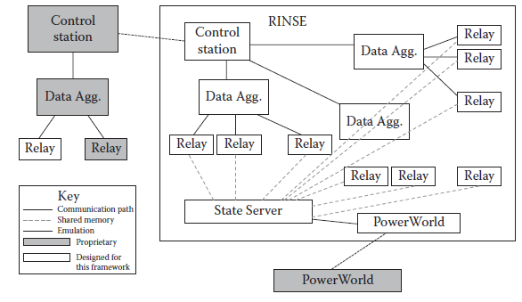

[14.3 <--- ](14_3.md) [   Зміст   ](README.md) [--> 14.5](14_5.md)

## 14.4. DEVELOPMENT AND VALIDATION

### 14.4.1 Lab Setup

To connect our complete virtual SCADA system to physical devices, we rely on the generosity of several donors, who have donated a number of SCADA devices, software, and technical support. VPST currently utilizes two SEL-421 relays, an SEL-3351 data aggregator, and a workstation running the OSI Monarch OpenView Energy Management System (EMS) software suite [36]. The relays are each attached to an Adaptive Multichannel Source (AMS) that supports lab testing of Schweitzer Engineering Laboratories (SEL) devices by providing sinusoidal waveforms that feed into the relays.

Щоб підключити нашу повну віртуальну систему SCADA до фізичних пристроїв, ми покладаємося на щедрість кількох донорів, які пожертвували низку пристроїв SCADA, програмне забезпечення та технічну підтримку. В даний час VPST використовує два реле SEL-421, агрегатор даних SEL-3351 і робочу станцію, на якій працює пакет програмного забезпечення OSI Monarch OpenView Energy Management System (EMS) [36]. Кожне реле підключено до адаптивного багатоканального джерела (AMS), який підтримує лабораторні випробування пристроїв Schweitzer Engineering Laboratories (SEL), забезпечуючи синусоїдальну форму сигналу, що подається на реле.

Our communications simulator, RINSE, provides the SCADA simulation for our local lab environment. Its components have been described in Sections 14.2.1 and 14.3. Using these components, we can generate any desired topology. Shown in [Figure 14.4 ](#_bookmark88)is a simple topology that includes a virtual control station proxy, multiple substations with one data aggregator each and multiple relays per substation, and a State Server that communicates with a virtual PowerWorld proxy. The PowerWorld proxy is directed through emulation to a computer running PowerWorld, which runs a steady-state power simulation. PowerWorld has an API that can interface with external devices using its proprietary protocol. In this figure, we do not show PowerWorld interfacing with anything besides RINSE, although the capability is there, and may be beneficial to certain use cases.

Наш комунікаційний симулятор RINSE забезпечує моделювання SCADA для нашого локального лабораторного середовища. Його компоненти описано в розділах 14.2.1 і 14.3. Використовуючи ці компоненти, ми можемо створити будь-яку бажану топологію. На [Рисунок 14.4 ](#_bookmark88) показана проста топологія, яка включає проксі-сервер віртуальної станції керування, кілька підстанцій з одним агрегатором даних кожна та кілька ретрансляторів на підстанцію, а також державний сервер, який спілкується з віртуальним проксі-сервером PowerWorld. Проксі-сервер PowerWorld направляється за допомогою емуляції на комп’ютер, на якому запущено PowerWorld, який запускає симуляцію живлення в стаціонарному стані. PowerWorld має API, який може взаємодіяти із зовнішніми пристроями за допомогою власного протоколу. На цьому малюнку ми не показуємо, що PowerWorld взаємодіє з чимось, окрім RINSE, хоча ця можливість є та може бути корисною для певних випадків використання.

**FIGURE** **14.4** Simulation framework.

To provide emulation support, we also utilize proxies hosted on physical machines. Although they are not shown in Figure 14.4, our setup would not function without them. Since RINSE operates on its own virtual private network, to direct traffic toward one of the virtual nodes, the traffic must originate from within that virtual private network. To allow external traffic passing, RINSE comes equipped with a gateway that supports OpenVPN connections. From a workstation, we connect using an OpenVPN client to the OpenVPN server on RINSE’s host machine. This allows a physical machine to be in the same private address space as the virtual machines. Once this connection is complete, we can redirect this proxy machine’s incoming traffic to any destination inside RINSE. We also can redirect any traffic that arrives on the private network address to physical computers. In this manner, the State Server can communicate with PowerWorld in both directions. Also, by redirecting different ports to different addresses, we can allow the Control Station to poll any device in RINSE.

Щоб забезпечити підтримку емуляції, ми також використовуємо проксі-сервери, розміщені на фізичних машинах. Хоча вони не показані на малюнку 14.4, наша установка не функціонувала б без них. Оскільки RINSE працює у власній віртуальній приватній мережі, щоб спрямувати трафік до одного з віртуальних вузлів, трафік має виходити з цієї віртуальної приватної мережі. Щоб дозволити проходження зовнішнього трафіку, RINSE оснащено шлюзом, який підтримує підключення OpenVPN. З робочої станції ми підключаємося за допомогою клієнта OpenVPN до сервера OpenVPN на хост-машині RINSE. Це дозволяє фізичній машині перебувати в тому ж приватному адресному просторі, що й віртуальні машини. Після встановлення з’єднання ми можемо перенаправити вхідний трафік цього проксі-машини до будь-якого пункту призначення всередині RINSE. Ми також можемо перенаправляти будь-який трафік, який надходить на адресу приватної мережі, на фізичні комп’ютери. Таким чином, State Server може спілкуватися з PowerWorld в обох напрямках. Крім того, перенаправляючи різні порти на різні адреси, ми можемо дозволити Control Station опитувати будь-який пристрій у RINSE.

The lab is on a switched network, which provides two useful capabilities. The first is that we can use WireShark to examine traffic between all of these hosts. This allows us to troubleshoot communications between the devices, which is important since the relays only support maintenance through *telnet*. For instance, if we notice that the control station is no long updating, we can pinpoint the break in communication. In addition, it also allows us to inspect the packets themselves. This has proved helpful for meeting timing requirements as well as modeling both the DNP3 and the virtual hosts.

Лабораторія працює в комутованій мережі, що надає дві корисні можливості. По-перше, ми можемо використовувати WireShark для перевірки трафіку між усіма цими хостами. Це дозволяє нам виправляти неполадки зв’язку між пристроями, що важливо, оскільки ретранслятори підтримують обслуговування лише через *telnet*. Наприклад, якщо ми помічаємо, що станція керування довго не оновлюється, ми можемо точно визначити перерву в зв’язку. Крім того, це також дозволяє нам перевіряти самі пакети. Це виявилося корисним для виконання вимог щодо синхронізації, а також для моделювання як DNP3, так і віртуальних хостів.

When building a system such as this test bed, fidelity is an important concern. That is, the system must perform in the same manner as the operational analogue. There are varying degrees of fidelity, and development of this system has gone through phases addressing different levels of fidelity. First, the system must interact with physical equipment in such a way that the physical equipment does not realize that it is operating inside a partially virtualized environment. This is termed interoperability. Second, the virtual hosts must accurately reflect characteristics such as response times and accuracy of data. This can be achieved by tuning the corresponding parameters. Third, verification must be run on the virtual system itself to ensure that no race conditions exist in the modeling code. Finally, since SCADA network information is closely guarded, an expert must be brought in to verify that the virtual network reflects a practical network. The following process should serve as a guideline for incorporating new virtual hosts into our framework.

Під час створення системи, такої як цей тестовий стенд, точність є важливою проблемою. Тобто система повинна працювати так само, як і робочий аналог. Існують різні ступені точності, і розробка цієї системи пройшла через фази, що стосуються різних рівнів точності. По-перше, система повинна взаємодіяти з фізичним обладнанням таким чином, щоб фізичне обладнання не усвідомлювало, що воно працює в частково віртуалізованому середовищі. Це називається сумісністю. По-друге, віртуальні хости повинні точно відображати такі характеристики, як час відгуку та точність даних. Цього можна досягти шляхом налаштування відповідних параметрів. По-третє, перевірка повинна виконуватися на самій віртуальній системі, щоб переконатися, що в коді моделювання немає умов змагання. Нарешті, оскільки інформація про мережу SCADA ретельно охороняється, необхідно залучити експерта, щоб переконатися, що віртуальна мережа відображає реальну мережу. Наступний процес має слугувати вказівкою для включення нових віртуальних хостів у нашу структуру.

### 14.4.2 Interoperability

The first goal in creating a virtual host is allowing it to communicate with an external device. Reaching this goal requires several steps. First, we create a new virtual host that receives a transmission and responds with a hard-coded message. This hard- coded message can be devised by examining traffic between physical devices. For instance, when devising responses for virtual data aggregators, we look at requests from the actual control station to the actual data aggregator and copy the response. With this model, it allows us to test the communication channel. The communication channel, which is made up of the virtual networking stack, a virtual proxy, a physical proxy, a physical routing network, and a physical end-host, can have some robustness issues that must be resolved before experimenting with a more dynamic response. Once the physical end-host receives and successfully decodes the hard-coded message, we consider this stage a success.

Перша мета у створенні віртуального хосту — дозволити йому спілкуватися із зовнішнім пристроєм. Досягнення цієї мети вимагає кількох кроків. Спочатку ми створюємо новий віртуальний хост, який отримує передачу та відповідає жорстко закодованим повідомленням. Це жорстко закодоване повідомлення може бути розроблено шляхом дослідження трафіку між фізичними пристроями. Наприклад, розробляючи відповіді для віртуальних агрегаторів даних, ми переглядаємо запити від фактичної контрольної станції до фактичного агрегатора даних і копіюємо відповідь. Ця модель дозволяє перевірити канал зв’язку. Канал зв’язку, який складається зі стеку віртуальної мережі, віртуального проксі-сервера, фізичного проксі-сервера, фізичної мережі маршрутизації та фізичного кінцевого хоста, може мати певні проблеми з надійністю, які потрібно вирішити перед експериментуванням із більш динамічною відповіддю. . Після того, як фізичний кінцевий хост отримає й успішно розшифрує жорстко закодоване повідомлення, ми вважаємо цей етап успішним.

The next step is to generate responses dynamically. To do this, there are two steps. The first step is to create a virtual analogue of the physical protocol. In this case, the protocol is DNP3.0 encapsulated by TCP/IP. Within RINSE, this is represented as a *ProtocolMessage* with a corresponding *ProtocolSession*. The *ProtocolMessage* class contains member data to correspond to each of the fields specified in Section 14.2.2. When communicating with a physical host, the class structure must be converted to a byte stream and there are functions that perform this for both directions. Additionally, there is a helper function to compute and interpose the CRCs when converting to a byte stream.

Наступним кроком є динамічна генерація відповідей. Для цього є два кроки. Першим кроком є створення віртуального аналога фізичного протоколу. У цьому випадку це протокол DNP3.0, інкапсульований TCP/IP. У RINSE це представлено як *ProtocolMessage* із відповідним *ProtocolSession*. Клас *ProtocolMessage* містить дані члена, які відповідають кожному з полів, указаних у розділі 14.2.2. Під час спілкування з фізичним хостом структуру класу потрібно перетворити на потік байтів, і існують функції, які виконують це в обох напрямках. Крім того, існує допоміжна функція для обчислення та вставлення CRC під час перетворення на потік байтів.

After the protocol is implemented, the next step is to produce the dynamically generated message with static data. To do this, we extract the DNP3.0 request, convert it to a DNP3.0 *ProtocolMessage*, and process it. The control flow has been discussed in Section 14.3.2.

Після впровадження протоколу наступним кроком є створення динамічно згенерованого повідомлення зі статичними даними. Для цього ми витягуємо запит DNP3.0, перетворюємо його на *ProtocolMessage* DNP3.0 і обробляємо. Потік керування обговорювався в розділі 14.3.2.

Once we ensure that the virtual data aggregator is able to correctly generate a response with static data, it is time to generate a response with dynamic data. For the control station to observe a changing environment, responses from the data aggregators must reflect a changing environment. Therefore, each of the relays must also derive its state from a changing environment. Each could poll PowerWorld independently, but this would not scale well. Instead, we chose to implement a single point of contact—namely, the state server. In this manner, we eliminate costly overhead by compressing multiple requests and responses into one.

Коли ми переконаємося, що віртуальний агрегатор даних здатний правильно генерувати відповідь зі статичними даними, настав час генерувати відповідь із динамічними даними. Щоб станція керування могла спостерігати за мінливим середовищем, відповіді від агрегаторів даних повинні відображати мінливе середовище. Тому кожне з реле також має отримувати свій стан від мінливого середовища. Кожен міг би самостійно опитувати PowerWorld, але це не буде добре масштабуватися. Замість цього ми вирішили створити єдину точку контакту, а саме державний сервер. Таким чином ми усуваємо дорогі накладні витрати, стискаючи кілька запитів і відповідей в один.

### 14.4.3 Tuning Param eters

Once we have a generalized virtual model, it can be tuned to represent any number of physical analogues. By tuning parameters such as polling interval, polling pattern, and response time, we can model various types of data aggregator computers. New features could also be added by specifying them in the DML without designing brand new virtual data aggregators. Virtual relays do not have any polling interval (the data is already available upon receiving a request); however, they can be matched to their physical analogues by changing their response time. Were a virtual Modbus protocol created, another parameter in DML could be specified for protocol support. If a new physical device cannot be modeled by changing some of these parameters, then either altering the model or creating a new device class would provide the necessary functionality.

Коли у нас є узагальнена віртуальна модель, її можна налаштувати для представлення будь-якої кількості фізичних аналогів. Налаштовуючи такі параметри, як інтервал опитування, шаблон опитування та час відповіді, ми можемо моделювати різні типи комп’ютерів-агрегаторів даних. Нові функції також можна додати, вказавши їх у DML без розробки абсолютно нових віртуальних агрегаторів даних. Віртуальні реле не мають інтервалу опитування (дані вже доступні після отримання запиту); однак їх можна зіставити з фізичними аналогами, змінивши час відгуку. Якщо створено віртуальний протокол Modbus, у DML можна буде вказати інший параметр для підтримки протоколу. Якщо новий фізичний пристрій не можна змоделювати, змінивши деякі з цих параметрів, то або зміна моделі, або створення нового класу пристрою забезпечить необхідну функціональність.

### 14.4.4 Expert Ana lysis

Because of the critical nature of the power grid operations, it is difficult to acquire network topologies. It is also difficult to acquire the designs for SCADA devices from their vendors. In addition to creating models based on observation of the lab devices, some power experts in TCIP have offered their expertise. According to them, aspects such as polling patterns and the parameterization of virtual models appear to be sufficient. Network topologies can be managed through DML files and do not require RINSE development access. The topology described in [Figure 14.4 ](#_bookmark88)is simplified, but accurate enough to start security analysis. The two suggested topics to be tackled next are expanded functionality of the meters and extra virtual models for other devices. However, this ought to be done on a case-by-case basis as model development consumes time and resources. For current models, there exist enough parameters to allow an experimenter to model a device without delving into the RINSE source code, but future models may require extensive familiarity with the simulation engine.

Через критичний характер роботи електромережі складно отримати топологію мережі. Також важко придбати проекти пристроїв SCADA у їх постачальників. На додаток до створення моделей на основі спостереження за лабораторними пристроями, деякі експерти з енергетики в TCIP запропонували свій досвід. За їх словами, таких аспектів, як шаблони опитування та параметризація віртуальних моделей, видається достатнім. Топологією мережі можна керувати за допомогою файлів DML і не вимагають доступу для розробки RINSE. Топологія, описана на [Рис. 14.4 ](#_bookmark88), є спрощеною, але достатньо точною, щоб почати аналіз безпеки. Дві запропоновані теми, які слід розглянути далі, це розширена функціональність лічильників і додаткові віртуальні моделі для інших пристроїв. Однак це слід робити в кожному окремому випадку, оскільки розробка моделі потребує часу та ресурсів. Для поточних моделей існує достатньо параметрів, щоб дозволити експериментатору моделювати пристрій, не заглиблюючись у вихідний код RINSE, але для майбутніх моделей може знадобитися глибоке знайомство з механізмом моделювання.

[14.3 <--- ](14_3.md) [   Зміст   ](README.md) [--> 14.5](14_5.md)