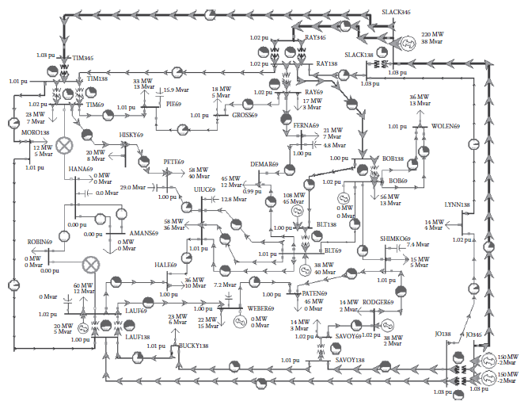
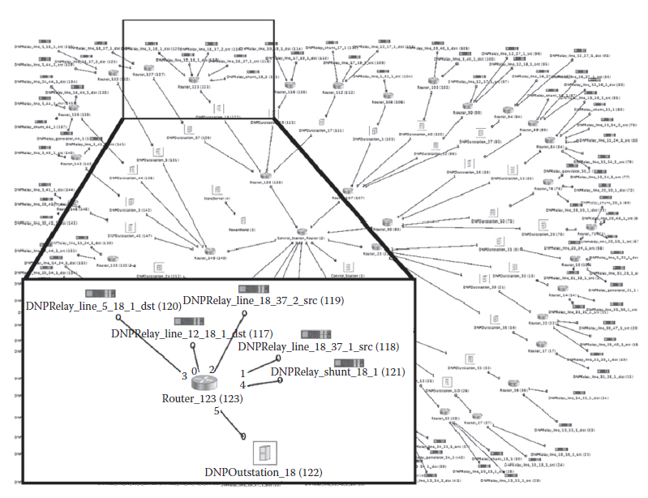
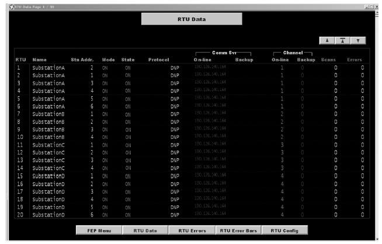

[14.4 <--- ](14_4.md) [   Зміст   ](README.md) [--> 14.6](14_6.md)

## 14.5. SAMPLE WORKFLOW

Now that we have demonstrated a fully functional test bed, when a third party wishes to collaborate with us, we will use a workflow similar to the following.

Тепер, коли ми продемонстрували повністю функціональний тестовий стенд, коли третя сторона бажає співпрацювати з нами, ми будемо використовувати робочий процес, подібний до наведеного нижче.

### 14.5.1 Create the Basic Network

The first step in the process is to design a power network that exhibits traits that may be of interest. Someone who is knowledgeable of a typical power grid network will design this, as their knowledge should translate into a realistic representation. One such power network can be seen in [Figure 14.5](#_bookmark89), which shows a power transmission network system for a large city, as displayed by PowerWorld. The long lines are transmissions lines that transmit power between buses, which are the short lines with dots in the figure. Connected to the buses are generators and loads, represented by the circled arrows and ground symbols, respectively. PowerWorld itself offers many tools for designing, interacting, and assessing power flow models. For the purpose of VPST, the important features that it offers are the abilities to manually create and export a design as well as support a real-time simulation.

Першим кроком у цьому процесі є проектування електромережі, яка демонструє риси, які можуть зацікавити. Хтось, хто знає типову мережу електромережі, розробить це, оскільки їхні знання мають перетворитися на реалістичне уявлення. Одну з таких електромереж можна побачити на [Рисунок 14.5] (#_bookmark89), де показано систему електропередачі для великого міста, як показано в PowerWorld. Довгі лінії – це лінії електропередач, які передають електроенергію між автобусами, а це короткі лінії з крапками на малюнку. До шин підключені генератори та навантаження, зображені відповідно стрілками та заземленням. Сам PowerWorld пропонує багато інструментів для проектування, взаємодії та оцінки моделей потоку електроенергії. Для цілей VPST важливими функціями, які він пропонує, є можливість вручну створювати та експортувати дизайн, а також підтримувати моделювання в реальному часі.

**FIGURE** **14.5** PowerWorld sample design.

From the PowerWorld simulation, key information will be extracted. Typically, these are the IDs of lines, buses, generators, shunts, and loads. From here, we generate the DML and EMS configuration as well as set up the proxies. The corresponding RINSE model is shown in [Figure 14.6](#_bookmark90). From the PowerWorld view, 36 buses and 196 distinct connections were found. These distinct connections have been categorized into lines, loads, generators, and shunts and are then represented by relays in the DML. As can be seen in the zoomed-in box in Figure 14.6, the relays are then annotated to provide a reference point in the PowerWorld model. Likewise, the corresponding EMS configuration in [Figure 14.7 ](#_bookmark90)shows a list of RTUs (i.e., data aggregators) that the EMS is aware of and is able to poll for data. Currently, configuring the EMS is done by hand, but efforts are under way to automate this process as well. This portion of the workflow is set up to be as automatic as possible. There are scripts to extract the information from PowerWorld, to create the DML model and its corresponding routing information, to log in the proxy machines and set up the redirects, and to produce the control station configuration file. Future efforts are ongoing to reproduce the entire lab setup in another location, provided similar resources exist there as well.

Ключова інформація буде витягнута з симуляції PowerWorld. Як правило, це ідентифікатори ліній, шин, генераторів, шунтів і навантажень. Звідси ми створюємо конфігурацію DML і EMS, а також налаштовуємо проксі-сервери. Відповідна модель RINSE показана на [Рис. 14.6] (#_bookmark90). З точки зору PowerWorld було знайдено 36 автобусів і 196 різних сполучень. Ці окремі з’єднання були класифіковані на лінії, навантаження, генератори та шунти, а потім представлені реле в DML. Як можна побачити у збільшеному вікні на малюнку 14.6, реле потім анотуються, щоб забезпечити контрольну точку в моделі PowerWorld. Подібним чином відповідна конфігурація EMS на [Рис. 14.7] (#_bookmark90) показує список RTU (тобто агрегаторів даних), про які EMS знає та може опитувати дані. В даний час налаштування EMS виконується вручну, але зараз також робляться спроби автоматизувати цей процес. Ця частина робочого процесу налаштована максимально автоматично. Існують сценарії для отримання інформації з PowerWorld, для створення моделі DML і відповідної інформації про маршрутизацію, для входу в систему проксі-машин і налаштування перенаправлення, а також для створення файлу конфігурації станції керування. Подальші зусилля тривають, щоб відтворити всю лабораторну установку в іншому місці, за умови, що там також існують подібні ресурси.

**FIGURE** **14.6** Corresponding Real-Time Immersive Network Simulation Environment view.

  

**FIGURE 14.7** Corresponding Energy Management System (EMS) view.

### 14.5.2 Integrate New Techno logy

To integrate a new technology into the framework, there exist two options. The first option is to provide a stand-alone device or model that can be accessed through a network device. By doing this, the actual technology is tested, as opposed to a recreation. The way in which this is done is similar to how the State Server receives its values from PowerWorld (see Section 14.3.3).

Щоб інтегрувати нову технологію у фреймворк, існує два варіанти. Перший варіант полягає в тому, щоб надати окремий пристрій або модель, до якої можна отримати доступ через мережевий пристрій. Таким чином перевіряється справжня технологія, а не рекреація. Спосіб, у який це робиться, подібний до того, як State Server отримує свої значення від PowerWorld (див. Розділ 14.3.3).

The other option is to incorporate a model of the technology directly into RINSE. When using this option, the two parties will develop an accurate model of the new technology, whether that is a protocol or a bump-in-the-wire device or anything else. RINSE is written in C++ and as such can accept a C++ implementation of the new technology. The original implementation must be ported to C++, allowing some modifications to provide networking support inside RINSE. Further efforts are planned to make RINSE as modular as possible, to ease extensibility for cases such as this.

Інший варіант полягає в тому, щоб включити модель технології безпосередньо в RINSE. Використовуючи цю опцію, обидві сторони розроблять точну модель нової технології, незалежно від того, чи це протокол, чи пристрій з підтримкою дроту, чи щось інше. RINSE написаний мовою C++ і тому може приймати реалізацію нової технології на C++. Оригінальна реалізація має бути перенесена на C++, дозволяючи деякі модифікації для забезпечення підтримки мережі всередині RINSE. Плануються подальші зусилля, щоб зробити RINSE максимально модульним, щоб полегшити розширюваність для таких випадків, як цей.

There are trade-offs to consider here, which must be evaluated on a case-by-case basis. For instance, in the C++ implementation case, there are issues of fidelity and time of development. It takes time to develop a model and ensure that it corresponds to the actual technology. There are also issues of ensuring that the C++ model is in lockstep with the current iteration of the product. In the emulation case, there may be issues of scalability, latency, and availability of measurement data. If time allows, implementing the technology directly inside of RINSE will usually allow for better results, as the full benefit of scalable simulation can be realized.

Тут слід враховувати компроміси, які слід оцінювати в кожному конкретному випадку. Наприклад, у випадку реалізації C++ виникають проблеми з точністю та часом розробки. Щоб розробити модель і переконатися, що вона відповідає реальній технології, потрібен час. Існують також проблеми із забезпеченням узгодженості моделі C++ із поточною ітерацією продукту. У випадку емуляції можуть виникнути проблеми з масштабованістю, затримкою та доступністю даних вимірювань. Якщо дозволяє час, впровадження технології безпосередньо в RINSE зазвичай дає кращі результати, оскільки можна реалізувати всі переваги масштабованого моделювання.

### 14.5.3 Evaluate Experiment

Once all of the connections are set up and the entire communication flow is shown to be working, it is time to test the technology in silico. During the course of the experiment, it is possible to interact with the model and test how it reacts to certain commands. For instance, the EMS software can provide a place for an operator to monitor the grid. Depending on the new technology, it may become easier or more difficult for the operator to understand what is happening in the system. For instance, new technology implemented in RINSE may simplify the job of the operator so that fewer errors occur. On the contrary, it may accidentally drop communication under certain conditions. PowerWorld can offer information about the performance of a new technology. For instance, if a command sent from the EMS never produces a change in PowerWorld, this can be seen quickly in PowerWorld and traced to its root cause in RINSE by looking at metrics such as bandwidth usage, dropped packets, and average latency, or by using *tcpdump* for postmortem evaluation. From there, RINSE supports quick turnaround time through network creation at runtime, easily configurable network topologies, and immediate feedback.

Коли всі з’єднання налаштовано та весь потік зв’язку працює, настав час перевірити технологію in silico. Під час експерименту можна взаємодіяти з моделлю і перевіряти, як вона реагує на певні команди. Наприклад, програмне забезпечення EMS може надати оператору місце для моніторингу мережі. Залежно від нової технології, оператору може стати простіше або складніше зрозуміти, що відбувається в системі. Наприклад, нова технологія, реалізована в RINSE, може спростити роботу оператора таким чином, щоб виникало менше помилок. Навпаки, за певних умов він може випадково перервати зв’язок. PowerWorld може надати інформацію про продуктивність нової технології. Наприклад, якщо команда, надіслана з EMS, ніколи не викликає змін у PowerWorld, це можна швидко побачити в PowerWorld і відстежити її першопричину в RINSE, дивлячись на такі показники, як використання пропускної здатності, скинуті пакети та середня затримка, або використання *tcpdump* для посмертної оцінки. Звідти RINSE підтримує швидкий час виконання за рахунок створення мережі під час виконання, легкої конфігурації топології мережі та негайного зворотного зв’язку.

[14.4 <--- ](14_4.md) [   Зміст   ](README.md) [--> 14.6](14_6.md)