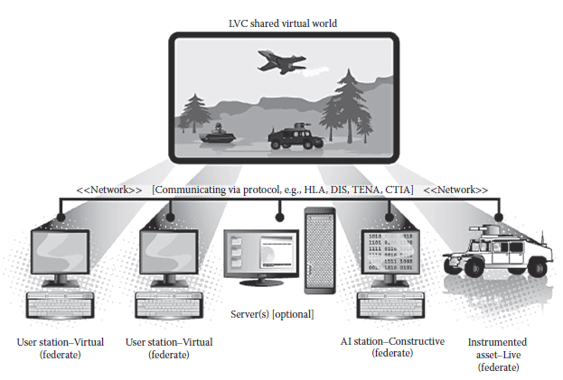

[15 <--- ](15.md) [   Зміст   ](README.md) [--> 15.2](15_2.md)

## 15.1. INTRODUCTION

Parallel and distributed simulation (PADS) emerged in the early 1980s, and over the past three decades, PADS systems have matured into vital technologies, particularly for military applications. This chapter provides a basic overview of one specific PADS application area: *distributed real-time simulation-based training* (SBT)*.* The chapter opens with a brief description of distributed real-time SBT and its development. It then lists the recurrent challenges faced by such systems with respect to instructional best practices, technology, and use. 

Паралельне та розподілене моделювання (PADS) з’явилося на початку 1980-х років, а за останні три десятиліття системи PADS перетворилися на життєво важливі технології, особливо для військових застосувань. У цьому розділі наведено базовий огляд однієї конкретної області застосування PADS: *розподілене навчання на основі симуляції в реальному часі* (SBT)*. Глава починається з короткого опису розподіленого SBT у реальному часі та його розвитку. Потім у ньому перераховуються постійні проблеми, з якими стикаються такі системи щодо найкращих методів навчання, технології та використання.

### 15.1.1 What Is Distributed Real-Time SBT ?

We begin by clarifying the phrase “distributed real-time SBT.” Consider each key word, in turn. First, *distributed* simulations are networks of geographically dispersed simulators (often called “federates”) that execute a single overall model, or more colloquially, that share a single “place.” Next, *real-time* simulations are those that advance at the same rate as actual time [1]. Finally, *training* simulations are instructional tools that employ training strategies (such as scenario-based training) and represent a problem-solving context to facilitate guided practice [2,3]. Thus, for this chapter, consider the following definition (see Figure 15.1 for an illustration):

Ми починаємо з уточнення фрази «розподілений SBT у реальному часі». Розглянемо кожне ключове слово по черзі. По-перше, *розподілене* моделювання — це мережі географічно розпорошених симуляторів (часто званих «федератами»), які виконують одну загальну модель або, кажучи більш просторічно, які спільно використовують одне «місце». Далі, *симуляції в реальному часі* - це ті, які просуваються з тією ж швидкістю, що й фактичний час [1]. Нарешті, симуляції *навчання* є навчальними інструментами, які використовують стратегії навчання (такі як навчання на основі сценаріїв) і представляють контекст вирішення проблем для полегшення керованої практики [2,3]. Таким чином, для цієї глави розглянемо таке визначення (див. Малюнок 15.1 для ілюстрації):

> Distributed real-time SBT involves two or more geographically distributed computerbased simulations that are interconnected through a network and track the passing of real time; they are used concurrently by multiple trainees, whose individual inputs affect the overall shared environment, and they include instructionally supported, sufficiently realistic problem-solving environments in which trainees can learn or practice their knowledge, skills, and attitudes. 

> Розподілений SBT у реальному часі включає два або більше територіально розподілених комп’ютерних симуляцій, які з’єднані між собою через мережу та відстежують проходження реального часу; вони використовуються одночасно декількома слухачами, чиї індивідуальні внески впливають на загальне спільне середовище, і вони включають середовище, що підтримується навчанням, достатньо реалістичне для вирішення проблем, у якому слухачі можуть вивчати або практикувати свої знання, навички та ставлення.

Distributed real-time SBT is considered a primary enabling technology for the U.S. military. It supports Joint (i.e., across military branches) and interagency training and mission rehearsal, development and testing of new tactics and techniques, and assessment of personnel skills [4]. In turn, these capabilities reduce risks, save lives and money, and engender increased operational capabilities. Section 15.2 offers a sketch of the historic milestones that have led to the development of distributed real-time SBT and contributed to its widespread use within the Defense sector.

Розподілений SBT у реальному часі вважається основною технологічною технологією для армії США. Він підтримує спільне (тобто між військовими підрозділами) і міжвідомче навчання та відпрацювання завдань, розробку та випробування нових тактик і методів, а також оцінку навичок особового складу [4]. У свою чергу, ці можливості зменшують ризики, рятують життя та гроші, а також сприяють збільшенню операційних можливостей. У розділі 15.2 наведено історичні віхи, які призвели до розвитку розподіленого SBT у реальному часі та сприяли його широкому використанню в оборонному секторі.

**FIGURE 15.1** Illustration of a generic live, virtual, and constructive (LVC) distributed real-time simulation-based training system.

[15 <--- ](15.md) [   Зміст   ](README.md) [--> 15.2](15_2.md)