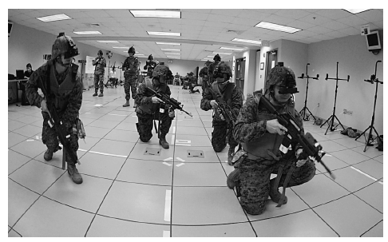

[15.2 <--- ](15_2.md) [   Зміст   ](README.md) [--> 15.4](15_4.md)

## 15.3. PERSISTENT CHALLENGES

Over the past 30 years, the pipedream of distributed real-time simulation has transformed into a fundamental training technology; still, challenges persist. These include long-standing technology issues, questions regarding how to best attain distributed simulation instructional goals, and discussions on how to best employ this distributed real-time SBT.

За останні 30 років нездійсненна мрія про розподілене моделювання в реальному часі перетворилася на фундаментальну технологію навчання; все ж проблеми залишаються. До них належать давні технологічні проблеми, питання про те, як найкраще досягти навчальних цілей розподіленого моделювання, а також обговорення того, як найкраще використовувати цей розподілений SBT у реальному часі.

### 15.3.1 Interoperability

*Interoperability* concerns the interlinking of the many diverse systems involved with distributed simulation. In other words, an interoperable simulation must be able to both pass and interpret data among its federates [16]. Naturally, interoperability was among the first issues distributed SBT developers confronted, and, although great advances have been made, significant technological gaps remain.

*Сумісність* стосується взаємозв’язку багатьох різноманітних систем, залучених до розподіленого моделювання. Іншими словами, взаємодіюча симуляція повинна мати можливість як передавати, так і інтерпретувати дані між своїми федератами [16]. Природно, що взаємодію була однією з перших проблем, з якою зіткнулися розробники розподілених SBT, і, незважаючи на великі успіхи, значні технологічні прогалини залишаються.

#### 15.3.1.1 Software Protocols

Generally speaking, many interoperability gaps result from limitations found in the software protocols used to communicate data among interlinked simulations. Common protocol issues include the following: 

•   Scalability limitations

•   Challenges regarding time synchronization

•   Lack of interoperability among different protocols

•   Lack of true plug-and-play capabilities

•   Lack of support for semantic interoperability

Взагалі кажучи, багато прогалин у сумісності виникають через обмеження, виявлені в програмних протоколах, які використовуються для передачі даних між взаємопов’язаними симуляціями. Загальні проблеми протоколу включають наступне:

• Обмеження масштабованості

• Проблеми щодо синхронізації часу

• Відсутність взаємодії між різними протоколами

• Відсутність справжніх можливостей plug-and-play

• Відсутність підтримки семантичної сумісності

DIS and HLA remain the most common interoperability protocols; yet, they still only achieve moderate ratings of practical relevance: “(3.5 and 3.4 respectively [out of 5.0]), a value which is relatively high, but might be expected to be even higher considering that both standards have been on the market for more than 10 years (HLA) or 15 years (DIS)” [17]. Both DIS and HLA are most notability affected by scalability, plug-and-play, and semantic interoperability problems [12].

DIS і HLA залишаються найпоширенішими протоколами взаємодії; однак вони все ще мають лише помірні оцінки практичної значущості: «(3,5 і 3,4 відповідно [з 5,0]), значення, яке є відносно високим, але можна очікувати, що воно буде ще вищим, враховуючи, що обидва стандарти були на ринку протягом більше 10 років (HLA) або 15 років (DIS)» [17]. І DIS, і HLA є найбільш помітними проблемами масштабованості, plug-and-play і семантичної сумісності [12].

More recent protocols attempt to address the difficulties of DIS and HLA; however, the introduction of new protocols, ironically, contributes to another significant challenge—lack of interoperability among protocols. To use simulations that employ different protocols, developers must use special bridges or gateways, which introduce “increased risk, complexity, cost, level of effort, and preparation time into the event” [12, pp. 8–9]. Plus, the ability to reuse models and applications across different protocols is limited.

Більш сучасні протоколи намагаються вирішити труднощі DIS і HLA; однак запровадження нових протоколів, за іронією долі, сприяє ще одній значній проблемі — відсутності сумісності між протоколами. Щоб використовувати симуляції, які використовують різні протоколи, розробники повинні використовувати спеціальні мости або шлюзи, які вводять «підвищений ризик, складність, вартість, рівень зусиль і час підготовки в подію» [12, с. 8–9]. Крім того, можливість повторного використання моделей і програм у різних протоколах обмежена.

To help address these issues, the MSCO recently completed a large-scale effort to identify the best way forward for interoperability. The Live Virtual Constructive Architecture Roadmap (LVCAR) study examined technical architectures, business models, and standards and then considered various strategies for improving the state of simulation interoperability [18]. The study produced 13 documents, including an extensive main report and several companion papers that were delivered in 2008. Although formal next steps have not yet been announced, the results of this effort will undoubtedly shape MSCO policy in the years to come, directly affecting which protocols are developed and/or used.

Щоб допомогти у вирішенні цих проблем, MSCO нещодавно завершила масштабну роботу з визначення найкращого шляху для взаємодії. Дослідження Live Virtual Constructive Architecture Roadmap (LVCAR) вивчало технічні архітектури, бізнес-моделі та стандарти, а потім розглядало різні стратегії для покращення стану взаємодії моделювання [18]. Дослідження підготувало 13 документів, у тому числі розширений основний звіт і кілька супровідних документів, які були надані в 2008 році. Хоча офіційні наступні кроки ще не оголошено, результати цих зусиль, безсумнівно, формуватимуть політику MSCO в найближчі роки, безпосередньо впливаючи на неї. розробляються та/або використовуються протоколи.

#### **15.1.1.2**  **Domain** **Architectures**

At the component level, various domain architectures have been established to maximize the potential for interoperability of simulations. Such frameworks attempt to create common software platforms for use across the (mainly government) simulation community. For example, created in the early 1990s, the Joint Simulation System (JSIMS) and One Semi-Automated Forces (OneSAF) systems aim to provide common architectures for synthetic environments and computer generated forces, respectively.

На рівні компонентів були створені різні доменні архітектури, щоб максимізувати потенціал взаємодії симуляцій. Такі фреймворки намагаються створити загальні програмні платформи для використання спільнотою симуляторів (головним чином державним). Наприклад, створені на початку 1990-х років системи спільного моделювання (JSIMS) і єдині напівавтоматичні сили (OneSAF) мають на меті забезпечити загальні архітектури для синтетичних середовищ і сил, згенерованих комп’ютером, відповідно.

New components are commonly added to government domain architectures, and as a result, these packages are routinely upgraded. Regrettably, many simulation practitioners fail to upgrade their simulations, and now a hodgepodge of versions are found across the user community. Moreover, different versions of an architecture do not necessarily support federation. In other words, the variety of versions actually creates a hindrance to interoperability [19].

До архітектур державних доменів зазвичай додаються нові компоненти, і в результаті ці пакети регулярно оновлюються. На жаль, багатьом фахівцям із симуляції не вдається оновити свої симуляції, і тепер у спільноті користувачів можна знайти купу версій. Крім того, різні версії архітектури не обов’язково підтримують об’єднання. Іншими словами, різноманітність версій фактично створює перешкоду сумісності [19].

No clear solution yet exists to this challenge. However, unifying agencies, such as Simulation Interoperability Standards Organization (SISO), attempt to encourage more standardized architecture use throughout the M&S community. SISO, whose roots can be traced back to SIMNET, is an international organization that hosts regular meetings as well as annual Simulation Interoperability Workshops. SISO also maintains interoperability standards and common components packages, such as SEDRIS, an enabling technology that supports the representation of environmental data and the interchange of environmental data sets among distributed simulation systems [20].

Чіткого вирішення цієї проблеми ще не існує. Проте об’єднуючі агенції, такі як Організація стандартів взаємодії моделювання (SISO), намагаються заохочувати використання більш стандартизованої архітектури в усій спільноті M&S. SISO, чиє коріння можна простежити до SIMNET, є міжнародною організацією, яка проводить регулярні зустрічі, а також щорічні семінари з імітаційної сумісності. SISO також підтримує стандарти сумісності та пакети загальних компонентів, такі як SEDRIS, сприятлива технологія, яка підтримує представлення даних про навколишнє середовище та обмін наборами даних про навколишнє середовище між розподіленими системами моделювання [20].

Agencies such as SISO can help remove some barriers to interoperability and promote more homogeneous use of common domain architectures. However, for change to truly occur, user communities must participate with standard activities and commit to building a more cohesive sense of community among distributed SBT practitioners [18].

Такі агенції, як SISO, можуть допомогти усунути деякі бар’єри для взаємодії та сприяти більш однорідному використанню архітектур спільного домену. Однак, щоб зміни дійсно відбулися, спільноти користувачів повинні брати участь у стандартних заходах і взяти на себе зобов’язання створити більш згуртоване почуття спільноти серед розподілених практиків SBT [18].

#### 15.3.1.3 Fair Play

Finally, a range of other interoperability issues can be roughly grouped under the concept of “fair play.” *Fair play* means ensuring that no trainee has an unfair advantage because of technical issues outside of the training, such as improved graphics giving an undue visual advantage. Fair play issues often involve *time synchronization* or *model composability*.

Нарешті, ряд інших проблем сумісності можна приблизно згрупувати під поняттям «чесна гра». *Чесна гра* означає гарантію, що жоден слухач не матиме несправедливої переваги через технічні проблеми поза тренуванням, наприклад покращену графіку, що дає надмірну візуальну перевагу. Проблеми чесної гри часто стосуються *синхронізації часу* або *компонування моделі*.

Achieving optimal time synchronization (sometimes called “time coherence”) is a complicated, ongoing struggle for software developers. In brief, time synchronization concerns controlling the timing of simulation events so that they are reflected in the proper order at each participating federate [21]. As of the penning of this chapter, no clear mitigation strategy has been established to overcome distributed synchronization issues; however, investigators continue to search for a solution.

Досягнення оптимальної синхронізації часу (іноді її називають «узгодженістю часу») є складною, постійною боротьбою для розробників програмного забезпечення. Коротше кажучи, синхронізація часу стосується контролю часу симуляційних подій таким чином, щоб вони відображалися в належному порядку в кожній федерації-учаснику [21]. На момент написання цієї глави не було розроблено чіткої стратегії подолання проблем розподіленої синхронізації; однак слідчі продовжують шукати рішення.

*Model composability*, another as-yet unsolved technological conundrum, is concerned with using the data models of a simulation to effectively represent the common virtual environment in which the distributed participants interact [22]. When simply stated, this challenge seems manageable, but the complexity becomes apparent once one considers the array of intricate, heterogeneous systems—often LVC—that must be capable of expressing the same environment, agents, and behaviors. As with synchronization challenges, no clear resolution has yet emerged, and researchers continue to publish extensively, seeking a more optimal solution.

*Компонування моделей*, ще одна невирішена технологічна головоломка, пов’язана з використанням моделей даних симуляції для ефективного представлення спільного віртуального середовища, в якому взаємодіють розподілені учасники [22]. Простіше кажучи, ця проблема здається вирішальною, але складність стає очевидною, якщо взяти до уваги набір складних гетерогенних систем — часто LVC — які повинні бути здатні виражати те саме середовище, агентів і поведінку. Як і у випадку з проблемами синхронізації, чіткого рішення ще не виявлено, і дослідники продовжують багато публікувати, шукаючи оптимальніші рішення.

### 15.3.2 Fidelity

Since the early days of simulation, the M&S community has debated the necessary degree of fidelity. Originally, many practitioners believed that the more physical fidelity a simulator offered, the better its learning environment became. Toward that end, early SBT efforts often focused on perfecting the realism of the simulator, so as to mimic the real world as closely as possible. Consider this quotation describing (but not necessarily condoning) early views on simulation:

З перших днів моделювання спільнота M&S обговорювала необхідний ступінь точності. Спочатку багато практиків вважали, що чим більшу фізичну точність пропонує тренажер, тим кращим стає середовище навчання. З цією метою перші зусилля SBT часто зосереджувалися на вдосконаленні реалістичності симулятора, щоб якомога точніше імітувати реальний світ. Розгляньте цю цитату, яка описує (але не обов’язково виправдовує) ранні погляди на моделювання:

> The more like the real-world counterpart, the greater is the confidence that performance in the simulator will be equivalent to operational performance and, in the case of training, the greater is the assurance that the simulator will be capable of supporting the learning of the relevant skills . . . Designing a simulator to realistically and comprehensively duplicate a real-world item of equipment or system is a matter of achieving physical and functional correspondence. The characteristics of the human participant can be largely ignored.
>
> Чим більше подібний до аналога в реальному світі, тим більша впевненість, що продуктивність тренажера буде еквівалентна робочій продуктивності, а у випадку навчання, тим більша впевненість, що тренажер зможе підтримувати навчання відповідні навички. . . Розробка симулятора для реалістичного та повного дублювання реального обладнання чи системи є питанням досягнення фізичної та функціональної відповідності. Характеристики людини-учасника можна здебільшого ігнорувати.

**National Research Council [23, p. 27]** 

The idea of *selected fidelity* was articulated in the late 1980s, and it suggests that individual stimuli within a simulation can be more-or-less realistic (depending on the specific task) and still support effective training [24]. Later research led to the notion that *psychological fidelity* was more important than physical fidelity. With psychological fidelity, simulations could be successful without high physical fidelity—so long as the overall fidelity configuration supported the educational goals of the system (e.g., [2,23,25,26]).

Ідея *вибраної вірності* була сформульована наприкінці 1980-х років, і вона передбачає, що окремі стимули в симуляції можуть бути більш-менш реалістичними (залежно від конкретного завдання) і все ще підтримувати ефективне навчання [24]. Пізніше дослідження привело до думки, що *психологічна вірність* була важливішою за фізичну вірність. З психологічною точністю моделювання може бути успішним без високої фізичної точності — за умови, що загальна конфігурація точності підтримує освітні цілі системи (наприклад, [2,23,25,26]).

Today, effective simulators come in an array of different fidelity levels, and social scientists better understand (although not completely) how to use more limited degrees of fidelity appropriately. Still, the idea that “more fidelity is better” remains entrenched among many practitioners and simulation users, as a recent U.S. Army Research Institute survey discovered [27].

Сьогодні ефективні симулятори представлені в ряді різних рівнів точності, і соціологи краще розуміють (хоча не повністю), як належним чином використовувати більш обмежені ступені точності. Тим не менш, ідея про те, що «більше точності — краще» залишається вкоріненою серед багатьох практиків і користувачів моделювання, як показало нещодавнє опитування Дослідницького інституту армії США [27].

#### 15.3.2.1 Expanding Fidelity into New Domains

In addition to meeting basic fidelity constraints, new requirements call for M&S capabilities in novel application domains. For instance, the U.S. Marine Corps has recently embarked on an effort to deliver pilot-quality SBT to infantry personnel:

На додаток до основних обмежень щодо точності, нові вимоги вимагають можливостей M&S у нових сферах застосування. Наприклад, Корпус морської піхоти США нещодавно розпочав роботу з надання SBT пілотної якості піхотному персоналу:

> Today, there are cockpit trainers that are so immersive—for both pilot training and evaluation—that the Services and the Federal Aviation Administration (FAA) allow their substitution for much of the actual flying syllabus. Unfortunately, this level of maturity has not been reached for immersive small unit infantry training which necessarily includes an almost limitless variety of localities, environments, and threats.
>
> Сьогодні існують тренажери в кабіні, які настільки захоплюючі — як для навчання пілотів, так і для оцінювання — що Служби та Федеральне управління цивільної авіації (FAA) дозволяють замінювати ними більшу частину фактичної навчальної програми польотів. На жаль, такого рівня зрілості не було досягнуто для глибокої підготовки невеликих піхотних підрозділів, яка обов’язково включає майже безмежну різноманітність місцевостей, середовищ і загроз.

**NRAC [28, p. 58]** 

Other Defense simulation goals are concerned with replicating the stress, cognitive load, and emotional fatigue found in the real-life combat situations, or refining human social, cultural, and behavioral models to the point where agents act realistically—down to their body language [29]. These new requirements challenge developers, who must extend the supporting technologies. Even more, they challenge instructional and behavioral scientists, who must define the features of each new domain and determine what levels of fidelity support their instruction.

Інші цілі симуляції оборони стосуються відтворення стресу, когнітивного навантаження та емоційної втоми, які спостерігаються в реальних бойових ситуаціях, або вдосконалення людських соціальних, культурних і поведінкових моделей до точки, коли агенти діють реалістично – аж до мови їхнього тіла [ 29]. Ці нові вимоги кидають виклик розробникам, які повинні розширити підтримку технологій. Навіть більше, вони кидають виклик науковцям, які навчаються та поведінці, які повинні визначити особливості кожної нової області та визначити, які рівні вірності підтримують їхні інструкції.

The Defense sector has apportioned substantial resources to meet these challenges, from both the technological and the behavioral science perspectives. For example,

Сектор оборони виділив значні ресурси для вирішення цих викликів як з технологічної точки зору, так і з погляду поведінкової науки. Наприклад,

U.S. Joint Forces Command (USJFCOM) recently began the Future Immersive Training Environment (FITE) effort, which seeks to deliver highly realistic infantry training to ensure that the first combat action of personnel is no more difficult or stressful than their last simulated mission. As of mid-2010, FITE investigators had successfully demonstrated a wearable, dismounted immersive simulation system (see [Figure 15.2](#_bookmark91)). The body-worn system provides interconnectivity among users, who interact with a virtual environment through synchronized visual, auditory, olfactory, and even haptic events. If shot, the participant even feels a slight electrical charge so that they know they are “injured” or “dead” [30].

Командування об’єднаних сил США (USJFCOM) нещодавно започаткувало програму Future Immersive Training Environment (FITE), яка спрямована на реалістичну підготовку піхоти, яка гарантує, що перша бойова дія особового складу не буде складнішою чи напруженою, ніж остання імітована місія. Станом на середину 2010 року дослідники FITE успішно продемонстрували систему імітаційного моделювання, яку можна носити, демонтувати (див. [Рисунок 15.2](#_bookmark91)). Система, що носить на тілі, забезпечує взаємозв’язок між користувачами, які взаємодіють із віртуальним середовищем за допомогою синхронізованих візуальних, слухових, нюхових і навіть тактильних подій. У разі пострілу учасник навіть відчуває невеликий електричний заряд, щоб знати, що він «поранений» або «мертвий» [30].

Other military programs seek to more faithfully model humans. For instance, the Human Social Culture Behavior (HSCB) initiative is a Defense-wide effort to “develop a military science base and field technologies that support socio-cultural understanding and human terrain forecasting in intelligence analysis, operations analysis/planning, training, and Joint experimentation” [29, p. 4]. Under this venture, numerous projects are improving the fidelity of human models, cognitive/behavioral models, and the interaction among the behaviors of agents. By increasing the fidelity of such components, next-generation simulations will be able to support unique “nonkinetic” (i.e., noncombat) training, such as the acquisition of cultural competence, which is not presently well supported in SBT.

Інші військові програми прагнуть точніше моделювати людей. Наприклад, ініціатива «Поведінка соціальної культури людини» (HSCB) — це зусилля Міністерства оборони «розробити військову наукову базу та польові технології, які підтримують соціокультурне розуміння та прогнозування людської місцевості в аналізі розвідки, аналізі/плануванні операцій, навчанні та Спільне експериментування» [29, с. 4]. У рамках цього підприємства багато проектів покращують точність людських моделей, когнітивних/поведінкових моделей і взаємодію між поведінкою агентів. Підвищуючи точність таких компонентів, симуляції наступного покоління зможуть підтримувати унікальне «некінетичне» (тобто небойове) навчання, таке як набуття культурної компетентності, яка зараз не підтримується SBT.

                                                    

**FIGURE 15.2** Camp Lejeune, North Carolina (February 24, 2010). Marines from the 2d Battalion, 8th Marine Regiment, train with the Future Immersive Training Environment (FITE) Joint Capabilities Technology Demonstration (JCTD) virtual reality system in the simulation center at Camp Lejeune, North Carolina. Sponsored by the U.S. Joint Forces Command, with technical management provided by the Office of Naval Research, the FITE JCTD allows an individual wearing a self-contained virtual reality system, with no external tethers and a small joystick mounted on the weapon, to operate in a realistic virtual world displayed in a helmet mounted display. (U.S. Navy photo by John F. Williams/Released.)

**РИСУНОК 15.2** Кемп-Лежен, Північна Кароліна (24 лютого 2010 р.). Морські піхотинці з 2-го батальйону 8-го полку морської піхоти тренуються з системою віртуальної реальності Future Immersive Training Environment (FITE) Joint Capabilities Technology Demonstration (JCTD) у симуляційному центрі в Кемп-Лежен, Північна Кароліна. Спонсорований Командуванням об’єднаних сил США та технічне управління Управлінням військово-морських досліджень, FITE JCTD дозволяє людині, яка носить автономну систему віртуальної реальності, без зовнішніх прив’язків і невеликого джойстика, встановленого на зброї, працювати в реалістичний віртуальний світ, який відображається на дисплеї на шоломі. (Фото ВМС США Джона Ф. Вільямса/Оприлюднено.)

These are just two of many Defense efforts designed to expand the range of high- fidelity SBT. These two instances exemplify a trend with respect to SBT fidelity endeavors. Specifically, much of the “low-hanging fruit” has been plucked, leaving instead requirements for nuanced capability improvements (such as precision tuning of character models), expansion into new content domains (such as cultural training), and expansion into new delivery modalities (such as wearable, immersive systems).

Це лише два з багатьох зусиль Міністерства оборони, спрямованих на розширення діапазону SBT високої точності. Ці два випадки є прикладом тенденції щодо зусиль SBT вірності. Зокрема, більшу частину «низько висячого фрукта» було зірвано, залишивши натомість вимоги до тонких удосконалень можливостей (таких як точне налаштування моделей персонажів), розширення на нові домени вмісту (наприклад, культурне навчання) і розширення на нові способи доставки (наприклад, носяться системи з ефектом занурення).

### 15.3.3 Instructional Strategies

As discussed in Section 15.2, a number of factors converged through the 1970s to reshape the general approach of practitioners to SBT. The cognitive revolution had finally taken hold in the United States, and constructivist theories were gaining attention. Instructional designers were beginning to apply ISD approaches to simulation curricula, and behavioral researchers were finally invited to help address the negative training potential of simulations.

Як обговорювалося в Розділі 15.2, протягом 1970-х років низка факторів зійшлася, щоб змінити загальний підхід практикуючих лікарів до SBT. Когнітивна революція нарешті запанувала в Сполучених Штатах, і конструктивістські теорії привернули увагу. Розробники інструкцій почали застосовувати підходи ISD до навчальних програм моделювання, а дослідників поведінки нарешті запросили допомогти у вирішенні негативного навчального потенціалу моделювання.

These factors contributed to the development and widespread use of simulation- specific instructional strategies such as the event-based [31] or scenario-based training approach [3]. Proponents of such event-based strategies first debunked “the widely held belief that just more practice automatically leads to better skills” by demonstrating that unstructured simulation-based practice engenders “rote behaviors and an inflexibility to recognize errors” [32, p. 15]. They then called for the scenarios to be systematically organized around predictable training objectives and employ guided-practice principles [31].

Ці фактори сприяли розвитку та широкому використанню стратегій навчання, спрямованих на симуляцію, таких як підхід до навчання, заснований на подіях [31] або на основі сценаріїв [3]. Прихильники таких стратегій, заснованих на подіях, вперше розвінчали «широко поширене переконання, що лише більше практики автоматично призводить до кращих навичок», продемонструвавши, що неструктурована практика, заснована на симуляції, породжує «запам’ятовування поведінки та негнучкість розпізнавати помилки» [32, с. 15]. Потім вони закликали систематично організовувати сценарії навколо передбачуваних цілей навчання та використовувати принципи керованої практики [31].

Thanks to these efforts, contemporary SBT is more effective. However, three areas of concern remain with respect to instructional strategies. First, while current practice provides some general recommendations for instructional design, few, if any, specific instructional strategies have been identified that span the entire simulation-based learning process (from design to execution, feedback, and remediation). Second, instructional strategies for unique problem domains, such as improving infantry personnel’s perceptual abilities or more rapidly imbuing novice trainees with sophisticated higher-order cognitive abilities have not been well developed. Third, the impact of many uncommon and/or combined strategies has not yet been well documented [33]. Consequently, SBT instructors are often left to choose their own instructional approach, which contributes to wide variations in training effectiveness and puts a greater task burden on SBT facilitators [34].

Завдяки цим зусиллям сучасна СБТ є більш ефективною. Проте три сфери, що викликають занепокоєння, залишаються щодо стратегій навчання. По-перше, хоча поточна практика дає деякі загальні рекомендації щодо дизайну навчання, було виявлено небагато конкретних навчальних стратегій, які охоплюють весь процес навчання, заснований на симуляції (від проектування до виконання, зворотного зв’язку та виправлення). По-друге, навчальні стратегії для унікальних проблемних областей, таких як покращення перцептивних здібностей особового складу піхоти або швидше наповнення новачків складними когнітивними здібностями вищого рівня, не були добре розроблені. По-третє, вплив багатьох незвичайних та/або комбінованих стратегій ще недостатньо задокументований [33]. Отже, інструкторам SBT часто доводиться вибирати власний навчальний підхід, що сприяє широким варіаціям ефективності навчання та накладає більший тягар завдань на фасилітаторів SBT [34].

The military has funded several projects intended to identify theoretical frameworks for improving the pedagogy (or more accurately, “andragogy”) of its SBT. For example, the Office of Naval Research (ONR) recently sponsored the Next- generation Expeditionary Warfare Intelligent Training (NEW-IT) initiative, which seeks to improve SBT instructional effectiveness, in part, by including automated instructional strategies within distributed SBT software. NEW-IT is scheduled to complete in 2011; however, its investigators already report training performance gains of 26–50% in their empirical field testing [35]. Another ONR effort, called Algorithms Physiologically Derived to Promote Learning Efficiency (APPLE), aims to systematically inform the selection of instructional strategies across a wide range of domains, including distributed SBT [36]. The APPLE effort just began, but it has potential to greatly improve our collective understanding of optimum instructional methods. Programs such as NEW-IT and APPLE promise to improve the state of instructional strategy use within the military SBT community, but many more investigations into methods for improving the effectiveness of SBT are required before a full understanding of SBT instructional best practices is achieved.

Військові профінансували кілька проектів, спрямованих на визначення теоретичних основ для вдосконалення педагогіки (точніше, «андрагогіки») її SBT. Наприклад, Управління військово-морських досліджень (ONR) нещодавно виступило спонсором ініціативи інтелектуального навчання експедиційної війни нового покоління (NEW-IT), яка спрямована на підвищення ефективності навчання SBT, зокрема, шляхом включення автоматизованих стратегій навчання в розподілене програмне забезпечення SBT. NEW-IT планується завершити в 2011 році; однак його дослідники вже повідомляють про підвищення ефективності навчання на 26–50% у своїх емпіричних польових тестуваннях [35]. Інша спроба ONR під назвою «Алгоритми, отримані фізіологічно для підвищення ефективності навчання» (APPLE), спрямована на систематичне інформування вибору навчальних стратегій у широкому діапазоні доменів, включаючи розподілену SBT [36]. Робота APPLE тільки розпочалася, але вона має потенціал значно покращити наше колективне розуміння оптимальних методів навчання. Такі програми, як NEW-IT та APPLE, обіцяють покращити стан використання стратегії навчання у військовому співтоваристві SBT, але для досягнення повного розуміння найкращих методів навчання SBT необхідно ще багато досліджень методів підвищення ефективності SBT.

### 15.3.4 Instructor Workload

To be effective, SBT systems rely on significant involvement from expert instructors, who often have all-encompassing duties. The workload of instructors becomes even more pronounced in distributed training contexts, where additional human effort is required to configure and initialize system setup, monitor distributed trainees and LVC entities during the exercise, and manage the delivery of distributed postexercise feedback (e.g., [37,38]). This has led some to argue that a good instructor is the primary determinant of the effectiveness of SBT (e.g., [26,23]) or that “simulators without instructors are virtually useless for training” [39, p. 5]. For distributed real-time SBT, these workload dilemmas become especially pronounced during After Action Review (AAR). 

Щоб бути ефективними, системи SBT покладаються на значну участь експертів-інструкторів, які часто мають всеохоплюючі обов’язки. Робоче навантаження інструкторів стає ще більш помітним у контексті розподіленого навчання, де потрібні додаткові людські зусилля для налаштування та ініціалізації налаштування системи, моніторингу розподілених слухачів та об’єктів LVC під час вправи та керування доставкою розподіленого зворотного зв’язку після тренування (наприклад, [37, 38]). Це змусило декого стверджувати, що основним фактором ефективності SBT є хороший інструктор (наприклад, [26, 23]) або що «тренажери без інструкторів практично марні для навчання» [39, с. 5]. Для розподіленого SBT у реальному часі ці дилеми робочого навантаження стають особливо помітними під час аналізу після дії (AAR).

#### 15.3.4.1 Human Effort Required for Distributed AAR

AAR became a formalized military training technique in the 1940s, and it is intended to provide a structured, nonpunitive approach to feedback delivery. Naturally, once the capacity existed, the objective data generated by simulations began to inform AARs, and as simulators have grown in complexity, greater and greater amounts of objective data have became available. With the introduction of SIMNET in the 1980s, the amount of information that could be utilized in the AAR increased dramatically and so too did the workload on instructors [40].

AAR став формальною технікою військового навчання в 1940-х роках, і він призначений для забезпечення структурованого, некарального підходу до надання зворотного зв’язку. Природно, щойно з’явилася спроможність, об’єктивні дані, отримані за допомогою моделювання, почали інформувати AAR, і в міру того, як симулятори ускладнювалися, ставала доступною все більша кількість об’єктивних даних. З появою SIMNET у 1980-х роках обсяг інформації, яку можна було використати в AAR, різко зріс, а також робоче навантаження на інструкторів [40].

Typically, an instructor must attend to each distributed training “cell.” This means that the instructors, like the trainees, are geographically dispersed and cannot readily respond to all trainees or interact with one another. During a training exercise, instructors are responsible for observing actions of trainees to identify critical details not objectively captured by the simulation. These details may include radio communications that occur among trainees (outside of the simulation itself) or strategic behaviors too subtle for the simulation to analyze [41]. After observing an exercise, instructors typically facilitate the AAR delivery; they assemble the AAR material, find and discuss key points, explain performance outcomes, and lead talks among the trainees [42].

Як правило, інструктор повинен відвідувати кожну розподілену навчальну «комірку». Це означає, що інструктори, як і слухачі, географічно розосереджені й не можуть оперативно відповідати всім слухачам або взаємодіяти один з одним. Під час навчань інструктори відповідають за спостереження за діями слухачів, щоб виявити критичні деталі, які не були об’єктивно зафіксовані симуляцією. Ці деталі можуть включати радіозв’язок, який відбувається між слухачами (поза самою симуляцією) або стратегічну поведінку, надто тонку для аналізу симуляції [41]. Після спостереження за вправою інструктори зазвичай сприяють проведенню AAR; вони збирають матеріал AAR, знаходять і обговорюють ключові моменти, пояснюють результати роботи та проводять бесіди між слухачами [42].

Heavy reliance on instructors in distributed AAR is not merely an issue of individuals’ tasking. It affects the cost of deployment and, depending on the quantity and ability of the facilitators, can limit training effectiveness. An apparent mitigation for these issues involves supporting AAR through improved automated performance capture, analysis, and debrief. Such systems could also serve as collaborative tools for the distributed instructors.

Велика залежність від інструкторів у розподіленому AAR – це не просто проблема окремих завдань. Це впливає на вартість розгортання та, залежно від кількості та здібностей фасилітаторів, може обмежити ефективність навчання. Очевидне пом’якшення цих проблем передбачає підтримку AAR за допомогою покращеного автоматизованого збору продуктивності, аналізу та підведення підсумків. Такі системи також можуть служити інструментами для спільної роботи для розподілених інструкторів.

The Services have been working toward such solutions for decades. For instance, the Army Research Institute funded development of the Dismounted Infantry Virtual After Action Review System (DIVAARS), which supports “DVD-like” replay of simulation and provides some data analysis support. A similarly focused effort, called Debriefing Distributed Simulation-Based Exercises (DDSBE), was sponsored by ONR. Other, more particular, AAR systems also exist—from AAR support for analyzing the physical positioning of infantrymen on a live range (e.g., BASE-IT, sponsored by ONR [43]) to interpretation of trainees’ cognitive states through neurophysiological sensors (e.g., AITE, sponsored by ONR [44]).

Служби працюють над такими рішеннями десятиліттями. Наприклад, Науково-дослідний інститут армії профінансував розробку віртуальної системи огляду після дії десмонтованої піхоти (DIVAARS), яка підтримує «DVD-подібне» відтворення симуляції та забезпечує певну підтримку аналізу даних. Подібне цілеспрямоване зусилля під назвою «Дебрифінг розподілених вправ на основі моделювання» (DDSBE) було спонсоровано ONR. Також існують інші, більш конкретні, системи AAR — від підтримки AAR для аналізу фізичного позиціонування піхотинців на стрільбі (наприклад, BASE-IT, спонсорована ONR [43]) до інтерпретації когнітивних станів слухачів за допомогою нейрофізіологічних датчиків (наприклад, , AITE, за підтримки ONR [44]).

A number of other AAR tools, both general and specifically targeted, can be readily discovered. On the one hand, the variety of tools gives practitioners a range of options; however, on the other hand, many of these tools operate within narrow domains and software specifications, have been mainly demonstrated in carefully scripted use-case settings, and fail to interoperate with one another. In practice, current AAR technologies rarely provide adequate support for trainers and fail to provide deep diagnosis of performance [41]. Nonetheless, ongoing efforts continue to attempt to remedy these problems.

Можна легко знайти ряд інших інструментів AAR, як загальних, так і спеціально націлених. З одного боку, різноманітність інструментів дає практикам широкий вибір можливостей; однак, з іншого боку, багато з цих інструментів працюють у вузьких доменах і специфікаціях програмного забезпечення, в основному були продемонстровані в ретельно розроблених сценаріях параметрів використання та не можуть взаємодіяти один з одним. На практиці сучасні технології AAR рідко забезпечують адекватну підтримку для тренерів і не забезпечують глибокої діагностики ефективності [41]. Тим не менш, тривають зусилля, спрямовані на вирішення цих проблем.

### 15.3.5 Lack of Effectiveness Assessment

In contrast to the AAR challenge (upon which many researchers and developers are concentrating), few investigators have addressed the question of effectiveness assessment. A recent Army Research Institute report explains:

На відміну від проблеми AAR (на якій зосереджено багато дослідників і розробників), небагато дослідників зверталися до питання оцінки ефективності. Недавній звіт Інституту армійських досліджень пояснює:

>  More often than not, the simulators are acquired without knowing their training effectiveness, because no empirical research has been done. The vendors, who manufacture and integrate these devices, do not conduct such research because they are in the business of selling simulators, not research. Occasionally training effectiveness research is conducted after the simulators have been acquired and integrated, but this is narrowly focused on these specific simulators, training specific tasks, in this specific training environment. The research tends to produce no general guidance to the training developer, because of its narrow focus, and because it is conducted on a noninterference basis, making experimental control difficult if not impossible.
>
>  Найчастіше тренажери купують, не знаючи ефективності їх навчання, оскільки емпіричних досліджень не проводилося. Постачальники, які виробляють та інтегрують ці пристрої, не проводять таких досліджень, оскільки вони займаються продажем симуляторів, а не дослідженнями. Іноді дослідження ефективності навчання проводяться після того, як тренажери були придбані та інтегровані, але вони вузько зосереджені на цих конкретних тренажерах, конкретних навчальних завданнях у цьому конкретному навчальному середовищі. Дослідження, як правило, не дає загальних вказівок для розробника навчання через його вузьку спрямованість і тому, що воно проводиться на основі невтручання, що робить експериментальний контроль важким, якщо не неможливим.

**Stewart, Johnson, and Howse [27, p. 3]**

Effectiveness assessments fall roughly into two categories. They may consider specific instances or approaches, as the preceding quotation suggests, or they may be carried out at the enterprise level (i.e., strategy-wide impact assessment). Such strategic impact assessments involve identifying future consequences of a course of action, such as the expected return-on-investment from pursuing large-scale SBT curriculum.

Оцінки ефективності поділяються приблизно на дві категорії. Вони можуть розглядати конкретні випадки чи підходи, як випливає з попередньої цитати, або вони можуть проводитися на рівні підприємства (тобто оцінка впливу всієї стратегії). Такі стратегічні оцінки впливу включають визначення майбутніх наслідків курсу дій, таких як очікувана віддача від інвестицій від виконання широкомасштабної навчальної програми SBT.

Assessing the impact and value of distributed SBT—at either the project or the enterprise levels—is challenging and costly. Many benefits of distributed SBT, such as avoidance of future errors, are difficult to measure, and simulation analysts lack the ability to conduct upfront impact assessments or communicate their results [45]. In addition, developers and sponsors are often reluctant to spend resources on verifying the effectiveness of a system that they already expect (or at least very much hope) to work.

Оцінка впливу та цінності розподіленого SBT — на рівні проекту чи підприємства — є складною та дорогою справою. Багато переваг розподіленого SBT, такі як уникнення майбутніх помилок, важко виміряти, а аналітики моделювання не мають можливості проводити попередні оцінки впливу або повідомляти свої результати [45]. Крім того, розробники та спонсори часто не бажають витрачати ресурси на перевірку ефективності системи, яка, як вони очікують (або принаймні дуже сподіваються), буде працювати.

Although Defense organizations encourage researchers and developers to conduct effectiveness evaluations, such efforts are carried out intermittently. Fortunately, MSCO is leading attempts to increase such testing. MSCO publishes standards for project-level VV&A evaluation, and the office recently completed a strategy-level evaluation of return-on-investment for Defense M&S [46]. Nonetheless, many more researchers will have to follow the example set by MSCO before this gap is mitigated.

Хоча оборонні організації заохочують дослідників і розробників проводити оцінку ефективності, такі зусилля здійснюються з перервами. На щастя, MSCO очолює спроби збільшити кількість таких тестувань. MSCO публікує стандарти для оцінки VV&A на рівні проекту, і офіс нещодавно завершив оцінку стратегічного рівня повернення інвестицій для оборонного M&S [46]. Тим не менш, багатьом іншим дослідникам доведеться наслідувати приклад MSCO, перш ніж ця прогалина буде зменшена.

### 15.3.6 Lack of Use Outside of the Defense Sector

The roots of distributed simulation can be traced back primarily to the Defense sector [47], and unfortunately, its use has remained largely confined to that community [46,48]. Around 2002, academic papers began routinely appearing asking why commercial industry has yet to embrace distributed simulation (e.g., Ref. [49]). This publishing trend continues to date, and the obstacles to adoption outside of the military sector include the following (for more details see Refs. [48] and [50]):

Коріння розподіленого моделювання можна простежити в першу чергу до сектору оборони [47], і, на жаль, його використання залишається в основному обмеженим цією спільнотою [46,48]. Приблизно в 2002 році почали регулярно з’являтися наукові статті, які запитували, чому комерційна індустрія ще не охопила розподілене моделювання (наприклад, Ref. [49]). Ця тенденція до публікації продовжується досі, і перешкоди для впровадження за межами військового сектору включають наступне (додаткову інформацію див. у посиланнях [48] і [50]):

•   Insufficient integration with commercial off-the-shelf (COTS) simulation packages

•   Technical difficultly (or perceived technical difficulty) of federating systems

•   Inefficiency of synchronization algorithms

•   Bugs and lack of verification in distributed models

•   Overly complex runtime management

•   Perceived lack of practical return-on-investment

•   Too much functionality in existing distributed packages not relevant for industry

• Недостатня інтеграція з комерційними готовими (COTS) пакетами моделювання

• Технічна складність (або уявна технічна складність) систем об’єднання

• Неефективність алгоритмів синхронізації

• Помилки та відсутність верифікації в розподілених моделях

• Надто складне керування часом виконання

• Відчуття відсутності практичної віддачі від інвестицій

• Забагато функціональних можливостей в існуючих розподілених пакетах, які не відповідають галузі

The dearth of effectiveness testing also contributes to the reluctance of some to embrace distributed SBT. As Randall Gibson explains:

Відсутність тестування ефективності також сприяє небажанню деяких використовувати розподілений SBT. Як пояснює Рендалл Гібсон:

> I would have to conclude that the simulation community is not doing an adequate job of selling simulation successes. Too often I see management deciding *not* to commit to simulation for projects where it could be a significant benefit.
>
> Я мав би зробити висновок, що спільнота симуляторів не виконує належної роботи з продажу успіхів симуляторів. Дуже часто я бачу, як керівництво вирішує *не* займатися моделюванням для проектів, де це може принести значну користь.

**Gibson et al. [45, p. 2027]**

In short, money is the major driver in business, and most businesses fail to see sufficient return-on-investment for their use of distributed SBT. Additionally, most commercial practitioners claim to be interested in low-cost, throw-away COTS tools, instead of more robust enterprise systems. However, current COTS simulation tools do not adequately support distributed simulation applications, and most industry practitioners are not willing to pay much more than a 10% increase in cost to upgrade current technologies [48].

Коротше кажучи, гроші є головною рушійною силою бізнесу, і більшість підприємств не бачать достатньої віддачі від інвестицій для використання розподіленого SBT. Крім того, більшість комерційних практиків стверджують, що їх цікавлять недорогі одноразові інструменти COTS, а не більш надійні корпоративні системи. Однак поточні інструменти моделювання COTS недостатньо підтримують програми розподіленого моделювання, і більшість практиків галузі не бажають платити набагато більше, ніж 10% збільшення вартості для оновлення поточних технологій [48].

Recently, several pilot projects investigated the benefits of distributed SBT for businesses such as car manufacturing (see the work by Boer [51]). These studies help advance the cause of distributed SBT for business. However, greater numbers of use cases and return-on-investment analyses are required. A 2008 survey of simulation practitioners also suggests that more “success stories” are necessary to overcome industry representatives’ “psychological barriers” to accepting distributed SBT. Other responses in this survey indicate that “ready and robust solutions” and “technological advances” must also be made before the commercial sector fully embraces distributed SBT [17].

Нещодавно кілька пілотних проектів досліджували переваги розподіленого SBT для таких підприємств, як виробництво автомобілів (див. роботу Бура [51]). Ці дослідження допомагають просувати справу розподіленого SBT для бізнесу. Однак потрібна більша кількість випадків використання та аналізу повернення інвестицій. Опитування практикуючих симуляторів у 2008 році також показує, що необхідно більше «історій успіху», щоб подолати «психологічні бар’єри» представників галузі для прийняття розподіленого SBT. Інші відповіді в цьому опитуванні вказують на те, що «готові та надійні рішення» та «технологічні досягнення» також повинні бути зроблені до того, як комерційний сектор повністю охопить розподілену SBT [17].

[15.2 <--- ](15_2.md) [   Зміст   ](README.md) [--> 15.4](15_4.md)