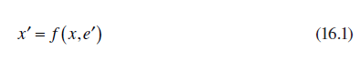
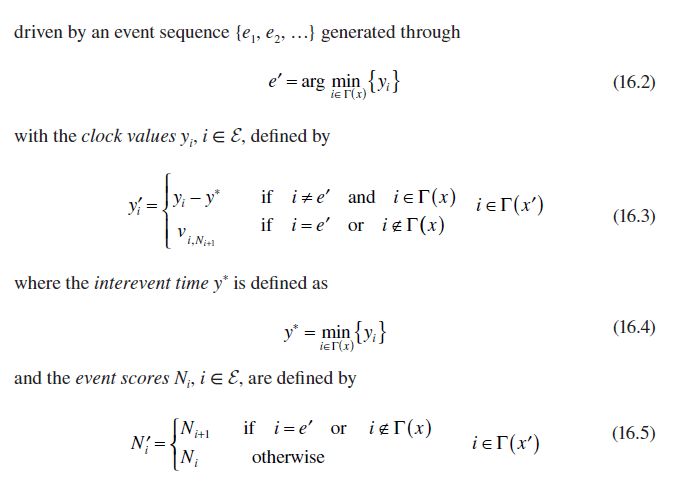
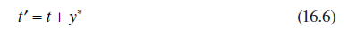
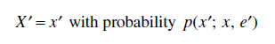
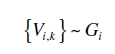

[16.1 <--- ](16_1.md) [   Зміст   ](README.md) [--> 16.3](16_3.md)

## 16.2. MODELING AND SIMULATING DISCRETE EVENT SYSTEMS

We begin with a DES modeled as an automaton (X, E, f, Γ, x0), where X is a countable state space, E is a countable event set, f:X × E→X is a state transition function, Γ:X→2E is the active (or feasible) event function so that Γ(x) is the set of all events e ∈ E for which f(x, e) is defined, and it is called the active event set (or feasible event set), and finally, x0 is the initial state. The automaton is easily modified to (X, E, Γ, x0, p, p0) to include probabilistic state transition mechanisms: the state transition probability p(x′; x, e′) is defined for all x, x′ ∈ X, e′ ∈ E and is such that p(x′; x, e′) = 0 for all e′ ∉ Γ(x); in addition, p0(x) is the probability mass function (pmf) P [x0 = x], x ∈ X, of the initial state x0. For simplicity, we assume that the DES satisfies the “noninterruption condition,” that is, once an event is enabled, it cannot be disabled; however, this is not essential to the rest of our discussion.

Ми починаємо з DES, змодельованого як автомат (X, E, f, Γ, x0), де X — рахунковий простір станів, E — лічильний набір подій,  f:X × E→X є функцією переходу стану, Γ:X→2E є активною (або можливою) функцією події, так що Γ(x) є множиною усіх подій e ∈ E, для яких визначено f(x, e), і це називається набором активних подій (або набором можливих подій), і, нарешті, x0 є початковий стан. Автомат легко модифікується до (X, E, Γ, x0, p, p0), щоб включити імовірнісні механізми переходу стану: ймовірність переходу стану p(x′ ; x, e′) визначено для всіх x, x′ ∈ X, e′ ∈ E і є таким, що p(x′; x , e′) = 0 для всіх e′ ∉ Γ(x); крім того, p0(x) — функція маси ймовірності (pmf) P [x0 = x], x ∈ X, початкового стану x0 . Для простоти ми припускаємо, що DES задовольняє «умові безперебійності», тобто коли подію ввімкнено, її неможливо вимкнути; однак це не має істотного значення для решти нашої дискусії.

This model is referred to as an untimed automaton,3 since it provides no information as to which among all events feasible at some state x will occur next. To resolve this issue, we define a clock structure associated with an event set E (which we will hencefoth assume finite with cardinality N) to be a set V = {V1, … , VN} of event lifetime sequences Vi = {vi,1, vi,2, …}, one for each event i ∈ E, with vi,k ∈ ℝ+. This leads to the definition of a timed automaton (X, E, f, Γ, x0, V), where V is a clock structure, and (X, E, f, Γ, x0) is an (untimed) automaton. The timed automaton generates a state sequence

Цю модель називають автоматом без часу, оскільки вона не надає інформації про те, яка з усіх подій, можливих у деякому стані x, відбудеться наступною. Щоб вирішити цю проблему, ми визначаємо структуру годинника, пов’язану з набором подій E (який ми надалі вважатимемо скінченним із потужністю N) як набір V = {V1 , … , VN} послідовностей тривалості подій Vi = {vi,1, vi,2, …}, по одній для кожної події i ∈ E, де vi,k ∈ ℝ+. Це призводить до визначення часового автомата (X, E, f, Γ, x0, V), де V — структура годинника, а (X, E, f, Γ, x0) — автомат (без часу). Тимчасовий автомат генерує послідовність станів

In addition, initial conditions are yi = vi,1 and Ni = 1 for all i ∈ Γ(x0). If i ∉ Γ(x0), then yi is undefined and Ni = 0.

Note that this is precisely how a discrete event simulator generates state trajectories of DES using the event lifetime sequences Vi = {vi,1, vi,2, …} as input. The simulator maintains the Clock, the State x, and the Event Calendar where all feasible events at state x along with their clock values are maintained. The entries of the Event Calendar are ordered so as to determine y through Equation 16.4 and hence determine the “triggering event” e′ in Equation 16.2. Once this is accomplished, the simulator updates the State through Equation 16.1 and the Clock by setting its new value to

Зверніть увагу, що це саме те, як симулятор дискретних подій генерує траєкторії стану DES, використовуючи послідовності тривалості подій Vi = {vi,1, vi,2, …} як вхідні дані. Симулятор підтримує годинник, стан x і календар подій, де зберігаються всі можливі події в стані x разом із їхніми значеннями годинника. Записи календаря подій упорядковані таким чином, щоб визначити y через рівняння 16.4 і, отже, визначити «ініціюючу подію» e′ у рівнянні 16.2. Після цього симулятор оновлює стан через рівняння 16.1 і годинник, встановлюючи його нове значення на

 

Then, since x′ is available, Γ(x′) is determined, and all Clock values for i ∈ Γ(x′) are updated through Equation 16.3. This results in an updated Event Calendar and the process repeats. It is important to note that this state trajectory construction is entirely event driven and not time driven. In other words, it is the Event Calendar that determines the next State of the system as well as the next value of the Clock. If the Event Calendar ever becomes empty, the process cannot continue, a situation that we often identify as a “deadlock” in the system. This event-driven mechanism is to be contrasted to a time-driven approach where the clock is updated through t′ = t + ∆, where ∆ is a fixed time step. This is clearly inefficient, since often there is a large interval between the current event and the next event; during this interval, the simulator needlessly updates the clock. What is worse, however, is that one or more events may in fact occur within an interval [t, t + ∆] in which case such a time-driven procedure fails to update the state until t + ∆. To counteract that, one might use a smaller value of ∆, which in turn forces more needless clock updates.

Тоді, оскільки x′ доступний, Γ(x′) визначається, і всі значення Clock для i ∈ Γ(x′) оновлюються за допомогою рівняння 16.3. Це призводить до оновленого календаря подій, і процес повторюється. Важливо зазначити, що ця побудова траєкторії стану повністю керується подіями, а не часом. Іншими словами, саме календар подій визначає наступний стан системи, а також наступне значення годинника. Якщо календар подій стає порожнім, процес не може продовжуватися, і цю ситуацію ми часто визначаємо як «тупикову ситуацію» в системі. Цей керований подіями механізм слід протиставити підходу, керованому часом, коли годинник оновлюється через t′ = t + ∆, де ∆ є фіксованим кроком у часі. Це явно неефективно, оскільки часто існує великий інтервал між поточною подією та наступною подією; протягом цього інтервалу симулятор без потреби оновлює годинник. Що гірше, однак, те, що одна або кілька подій можуть фактично відбутися в межах інтервалу [t, t + ∆], і в цьому випадку така керована часом процедура не може оновити стан до моменту t + ∆. Щоб протидіяти цьому, можна використовувати менше значення ∆, що, у свою чергу, змушує більше непотрібних оновлювати годинник.

The final step is to incorporate randomness into a timed automaton by allowing the elements of an event lifetime sequence to be random variables. Furthermore, in a more general setting, the state transition mechanisms can be assumed probabilistic. Thus, we define a stochastic clock structure associated with an event set E to be a set of distribution functions G = {Gi: i ∈ E} characterizing the stochastic clock sequences. This leads to the definition of a STA (E, X, Γ, p, p0, G), where (E, X, Γ, p, p0) is an automaton with a probabilistic state transition mechanism and G is a stochastic clock structure. The STA generates a stochastic state sequence {X0, X1, …} (i.e., a sample path) through a transition mechanism (based on observations X = x, E′ = e′): 

Останнім кроком є включення випадковості в часовий автомат, дозволяючи елементам послідовності часу життя події бути випадковими змінними. Крім того, у більш загальному положенні механізми переходу стану можна вважати імовірнісними. Таким чином, ми визначаємо структуру стохастичного годинника, пов’язану з набором подій E, як набір функцій розподілу G = {Gi: i ∈ E}, що характеризують послідовності стохастичного годинника. Це призводить до визначення STA (E, X, Γ, p, p0, G), де (E, X, Γ, p, p0) є автоматом з імовірнісним механізмом переходу стану, а G є структурою стохастичного годинника . STA генерує стохастичну послідовність станів {X0, X1, …} (тобто вибірковий шлях) через механізм переходу (на основі спостережень X = x, E′ = e′):

and it is driven by a stochastic event sequence {E1, E2, …} generated through the same process as Equations 16.2 through 16.5 with E replacing e, Yi replacing yi, and Vi,k replacing vi,k. In addition,

і він керується стохастичною послідовністю подій {E1, E2, …}, згенерованою за допомогою того самого процесу, що й рівняння 16.2–16.5, де E замінює e, Yi замінює yi, а Vi,k замінює vi,k. На додачу,

 

where the tilde (∼) notation denotes “with distribution” and initial conditions are X0 ∼ p0(x), and Yi = Vi,1 and Ni = 1 if i ∈ Γ(X0). If i ∉ Γ(X0), Yi is undefined and Ni = 0. For simplicity, for the remainder of the chapter, we will assume a STA with deterministic state transition functions (E, X, f, Γ, G) where the source of randomness is the stochastic nature of event lifetimes. 

де тильда (∼) позначає «з розподілом», а початкові умови X0 ∼ p0(x), і Yi = Vi,1 і Ni = 1, якщо i ∈ Γ(X0). Якщо i ∉ Γ(X0), Yi не визначений і Ni = 0. Для простоти, для решти глави, ми припустимо STA з детермінованими функціями переходу стану (E, X, f, Γ, G), де джерело випадковість — це стохастичний характер тривалості подій.

Example

To illustrate the definition of a STA, let us apply it to a simple single-server queueing system with a sequence of arriving tasks waiting in a First-In-First-Out (FIFO) queue with infinite capacity. This is normally written as “G/G/1,” where the first two Gs denote the probability distribution characterizing the arrival process and the service process, respectively: the letter G stands for “General” to indicate that neither distribution is assumed known. The number 1 indicates that there is a single server processing arriving task requests. In this case, we set X = {0, 1, …} to be the state space, so that x ∈ X is the number of tasks in the system (including one in process), and E = {a, d} to denote an arrival and a departure event, respectively. Clearly, Γ(x) = {a, d} for all x ∈ X except for Γ(0) = {a}, since a departure from an empty system is infeasible. Since all state transitions are deterministic, we revert to the usual state transition mechanism x′ = f(x, e′), and we have x′ = x + 1 if e′ = a and x′ = x − 1 if e′ = d and x > 0.

Щоб проілюструвати визначення STA, давайте застосуємо його до простої односерверної системи масового обслуговування з послідовністю прибулих завдань, які очікують у черзі FIFO (First In-First Out) з нескінченною місткістю. Зазвичай це записується як «G/G/1», де перші два G позначають розподіл ймовірностей, що характеризує процес прибуття та процес обслуговування, відповідно: літера G означає «Загальне», щоб вказати, що жоден розподіл не вважається відомим. Цифра 1 вказує на те, що є єдиний сервер, який обробляє надходять запити завдань. У цьому випадку ми встановлюємо X = {0, 1, …} як простір станів, так що x ∈ X є кількістю завдань у системі (включаючи одне в процесі), а E = {a, d} для позначають події прибуття та відправлення відповідно. Очевидно, що Γ(x) = {a, d} для всіх x ∈ X, крім Γ(0) = {a}, оскільки відхід від порожньої системи є неможливим. Оскільки всі переходи станів є детермінованими, ми повертаємося до звичайного механізму переходів станів x′ = f(x, e′), і ми маємо x′ = x + 1, якщо e′ = a, і x′ = x − 1, якщо e′ = d і x > 0.

A G/G/1/K queueing system is one where the queueing capacity is limited to K tasks. In this case, the model above is modified so that X = {0, 1, … , K} and x' = x + 1 if e' = a, x < K, while x' = x if e' = a, x = K. If, in addition, there is some information regarding the distribution functions of the arrival and service processes, then these are specified through stochastic clock structure G = {Ga, Gd}. For example, if the arrival process is Poisson with rate λ, we have Ga(t) = 1 − e−λt, t ≥ 0 with Ga(t) = 0 for t < 0, and if the service process is uniformly distributed over [0, 1], we have Gd(t) = t for t ∈ [0, 1], Gd(t) = 0 for t < 0, and Gd(t) = 1 for t > 1. In this case, the queueing system is represented by the notation M/U/1/K.

Система масового обслуговування G/G/1/K — це система масового обслуговування, у якій пропускна здатність черги обмежена K завданнями. У цьому випадку наведену вище модель модифіковано таким чином, що X = {0, 1, …, K} і x' = x + 1, якщо e' = a, x < K, тоді як x' = x, якщо e' = a, x = K. Якщо, крім того, є деяка інформація щодо функцій розподілу процесів прибуття та обслуговування, то вони вказуються за допомогою стохастичної тактової структури G = {Ga, Gd}. Наприклад, якщо процес надходження є пуассонівським зі швидкістю λ, ми маємо Ga(t) = 1 − e−λt, t ≥ 0 з Ga(t) = 0 для t < 0, і якщо процес обслуговування рівномірно розподілений по [0, 1] маємо Gd(t) = t для t ∈ [0, 1], Gd(t) = 0 для t < 0 і Gd(t) = 1 для t > 1. У цьому випадку система масового обслуговування представлена позначенням M/U/1/K.

[16.1 <--- ](16_1.md) [   Зміст   ](README.md) [--> 16.3](16_3.md)