[16.2 <--- ](16_2.md) [   Зміст   ](README.md) [--> 16.4](16_4.md)

## 16.3. SAMPLE PATH CONSTRUCTABILITY

Let us consider a DES modeled as a STA and let Q = {θ0, θ1, … , θM} be a finite set containing all possible values that a parameter θ in this model may take. As mentioned earlier, in general, θ is a vector, so if θ = [θ1, … , θN] and θi can take Mi values, then we can write Q = {q1 ,…,q1 0 ,…,qN ,…,qN N } . Moreover, it is possible that Q is a set of feasible operating policies or design choices that affect the dynamics of the DES. For example, in a G/G/1/θ queueing system, we may consider the capacity θ as a model parameter taking integer values for some set Q1 = {1, … , K}. Alternatively, we may want to study the performance of this DES as a function of different queueing disciplines such as FIFO, Last-In-First-Out (LIFO), and Random; in this case, Q2 = {FIFO, LIFO, Random}. Yet another example is the simultaneous investigation of the queue capacity and the queueing discipline, and in this case, Q3 = Q1 ´ Q2. Let J(θ) denote a performance metric of the system under θ. Since the DES is in general stochastic, let

Розглянемо DES, змодельований як STA, і нехай Q = {θ0, θ1, …, θM} буде кінцевим набором, що містить усі можливі значення, які може приймати параметр θ у цій моделі. Як згадувалося раніше, загалом θ є вектором, тому якщо θ = [θ1, … , θN] і θi може приймати значення Mi, то ми можемо записати Q = {q1 ,…,q1 0 ,…,qN ,…,qN N } . Крім того, можливо, що Q є набором можливих операційних політик або варіантів дизайну, які впливають на динаміку DES. Наприклад, у системі масового обслуговування G/G/1/θ ми можемо розглядати потужність θ як параметр моделі, який приймає цілі значення для деякого набору Q1 = {1, …, K}. Крім того, ми можемо захотіти вивчити продуктивність цього DES як функцію різних дисциплін масового обслуговування, таких як FIFO, останній прийшов - перший вийшов (LIFO) і випадковий; у цьому випадку Q2 = {FIFO, LIFO, Random}. Ще одним прикладом є одночасне дослідження місткості черги та дисципліни масового обслуговування, і в цьому випадку Q3 = Q1 ´ Q2. Нехай J(θ) позначає показник ефективності системи під θ. Оскільки DES загалом є стохастичним, нехай

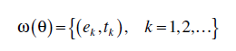

be a sample path of the system when it is operating under θ, where ek ∈ E is the kth event observed in this sample path and tk is the associated occurrence time. The corresponding sample performance metric is denoted by L[ω(θ)], and we are interested in estimating performance metrics of the form

бути прикладом шляху системи, коли вона працює під θ, де ek ∈ E — це k-та подія, що спостерігається в цьому зразку шляху, а tk — пов’язаний час появи. Відповідна метрика ефективності вибірки позначається L[ω(θ)], і нас цікавить оцінка метрики продуктивності у вигляді

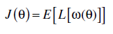

Our premise is that there is no closed-form expression for J(θ); therefore, we rely on simulation to obtain sample paths ω(θ) from which we can compute L[ω(θ)] and ultimately estimate the expected value E[L[ω(θ)]], typically through

Наша передумова полягає в тому, що немає замкнутого виразу для J(θ); отже, ми покладаємося на моделювання, щоб отримати зразки шляхів ω(θ), на основі яких ми можемо обчислити L[ω(θ)] і остаточно оцінити очікуване значення E[L[ω(θ)]], зазвичай через

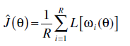

where ωi(θ) is the ith sample path (equivalently, simulation run or, for online applications, a finite length observation interval). In applications where the objective is to select the value of θ in Q = {θ0, θ1, … , θM} that minimizes J(θ), then the “brute force” trial-and-error approach involves a total of (M + 1)·R simulation runs to estimate performance for each of the M + 1 settings and then select the optimal one. For offline optimization, assuming all event lifetime distributions are known, then this is feasible, although possibly computationally expensive. For online applications, however, where event lifetime distributions may not be known exactly or where event lifetime distributions may be time varying, the brute force approach is infeasible. The goal of concurrent simulation methods is to extract estimates Jˆ(qi ), i = 1,… , M by observing only one sample path under parameter θ0. To study whether this is possible and under what conditions, we pose the sample path constructability problem as follows:

де ωi(θ) — i-й вибірковий шлях (еквівалентно, запуск моделювання або, для онлайн-додатків, інтервал спостереження кінцевої довжини). У програмах, де метою є вибір значення θ у Q = {θ0, θ1, … , θM}, яке мінімізує J(θ), підхід «грубої сили» методом проб і помилок передбачає загальна кількість (M + 1)·R прогонів моделювання для оцінки продуктивності для кожного з параметрів M + 1, а потім вибору оптимального. Для офлайн-оптимізації, припускаючи, що всі розподіли тривалості подій відомі, це можливо, хоча, можливо, обчислювально дорого. Однак для онлайн-додатків, де розподіли тривалості подій можуть бути невідомі точно або де розподіли тривалості подій можуть змінюватися в часі, підхід грубої сили є неможливим. Метою методів паралельного моделювання є отримання оцінок Jˆ(qi), i = 1,…, M шляхом спостереження лише за одним шляхом вибірки під параметром θ0. Щоб дослідити, чи можливо це і за яких умов, ми ставимо приклад проблеми конструктивності шляху наступним чином:

For a DES under θ0, construct all sample paths ω(θ1), … , ω(θM) given a realization of lifetime sequences V1, … , VN and the sample path ω(θ0).

Для DES під θ0 побудуйте всі вибіркові шляхи ω(θ1), …, ω(θM), враховуючи реалізацію життєвих послідовностей V1, …, VN і вибірковий шлях ω(θ0).

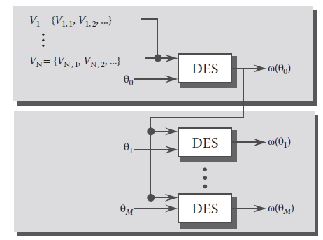

FIGURE 16.1 The sample path constructability problem.

This is illustrated in Figure 16.1. There is a simple sufficient condition under which the constructability problem can be solved. This condition consists of two parts. First, let {Xk(θ)}, k = 1, 2, … , be the state sequence observed in a sample path ω(θ) under θ in which the lifetime sequences are Vi = {V\i,1, V\i,2, …}, i = 1, … , N. We refer to this as the nominal sample path. Then, for θm ≠ θ, suppose the DES is driven by the same event sequence generated under θ, giving rise to a new state sequence {Xk(θm)}, k = 1, 2, … , and sample path ω(θm). We say that ω(θm) is observable with respect to ω(θ) if Γ(Xk(θm)) ⊆ Γ(Xk(θ)) for all k = 1, 2, … . Thus, we have the following observability condition (OB): (OB) Let ω(θ) be a sample path under θ, and {Xk(θ)}, k = 0, 1, … , the corresponding state sequence. For θm ≠ θ, let ω(θm) be the sample path generated by the event sequence in ω(θ). Then, for all k = 0, 1, … , Γ(Xk(θm)) ⊆ Γ(Xk(θ)).

Це показано на малюнку 16.1. Існує проста достатня умова, за якої можна розв’язати задачу конструктивності. Ця умова складається з двох частин. По-перше, нехай {Xk(θ)}, k = 1, 2, …, буде послідовністю станів, що спостерігається у зразковому шляху ω(θ) під θ, у якому послідовності часу життя Vi = {V\i,1, V\ i,2, …}, i = 1, …, N. Ми називаємо це номінальним шляхом вибірки. Тоді, для θm ≠ θ, припустимо, що DES керується тією самою послідовністю подій, згенерованою під θ, що породжує нову послідовність станів {Xk(θm)}, k = 1, 2, …, і вибірковий шлях ω(θm) . Ми говоримо, що ω(θm) є спостережуваним відносно ω(θ), якщо Γ(Xk(θm)) ⊆ Γ(Xk(θ)) для всіх k = 1, 2, …. Таким чином, ми маємо наступну умову спостережуваності (OB): (OB) Нехай ω(θ) — вибірковий шлях під θ, а {Xk(θ)}, k = 0, 1, …, — відповідна послідовність станів. Для θm ≠ θ нехай ω(θm) буде зразковим шляхом, створеним послідовністю подій у ω(θ). Тоді для всіх k = 0, 1, … Γ(Xk(θm)) ⊆ Γ(Xk(θ)).

By construction, the two sample paths are “coupled” so that the same event sequence drives them both. As the two state sequences subsequently unfold, condition (OB) states that every state observed in the nominal sample path is always “richer” in terms of feasible events. In other words, from the point of view of ω(θm), all feasible events required at state Xk(θm) are observable in the corresponding state Xk(θ).

Відповідно до конструкції, два шляхи вибірки «з’єднані», так що одна й та сама послідовність подій керує ними обома. Оскільки дві послідовності станів згодом розгортаються, умова (OB) стверджує, що кожен стан, який спостерігається на шляху номінального зразка, завжди є «багатшим» з точки зору можливих подій. Іншими словами, з точки зору ω(θm), усі можливі події, необхідні в стані Xk(θm), спостерігаються у відповідному стані Xk(θ).

The second part of the constructability condition involves the clock values Yi of events i ∈ E. Let H(t, z) be the conditional distribution of Yi defined as follows:

Друга частина умови конструктивності включає значення годинника Yi подій i ∈ E. Нехай H(t, z) буде умовним розподілом Yi, визначеним таким чином:

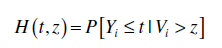

where z is the observed age of the event at the time H(t, z) is evaluated (i.e., the time elapsed since event i was last triggered). Given the lifetime distribution Gi(t), and since Vi = Yi + z, we have

де z — спостережуваний вік події на момент оцінки H(t, z) (тобто час, що минув з моменту останнього запуску події i). Враховуючи розподіл Gi(t) за часом життя та оскільки Vi = Yi + z, ми маємо

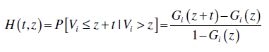

Since both the distribution H(t, z) and the event age generally depend on the parameter θ, we write H(t, zi,k(θ); θ) to denote the cumulative distribution function (cdf) of the clock value of event i ∈ E, given its age zi,k(θ). Then, the constructability condition (CO) is as follows:

Оскільки і розподіл H(t, z), і вік події загалом залежать від параметра θ, ми пишемо H(t, zi,k(θ); θ), щоб позначити кумулятивну функцію розподілу (cdf) значення годинника подія i ∈ E, враховуючи її вік zi,k(θ). Тоді умова конструктивності (КО) має такий вигляд:

(CO) Let ω(θ) be a sample path under θ, and {Xk(θ)}, k = 0, 1, … , the corresponding state sequence. For θm ≠ θ, let ω(θm) be the sample path generated by the event sequence in ω(θ). Then,

(CO) Нехай ω(θ) — вибірковий шлях під θ, а {Xk(θ)}, k = 0, 1, …, — відповідна послідовність станів. Для θm ≠ θ нехай ω(θm) буде зразковим шляхом, створеним послідовністю подій у ω(θ). Потім,

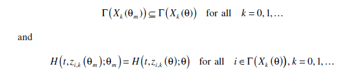

The first part is simply (OB), while the second part imposes a requirement on the event clock distributions. Details on (CO) are found in the work by Cassandras and Lafortune,3 but we note here two immediate implications: (1) if the STA has a Poisson clock structure, then (OB) implies (CO), and (2) if Γ(Xk(θm)) = Γ(Xk(θ)) for all k = 0, 1, … , then (CO) is satisfied. Clearly, (1) simply follows from the memoryless property of the exponential distribution, and it reduces the test of constructability to the purely structural condition (OB). Regarding (2), it follows from the fact that if feasible event sets are always the same under θ and θm, then all event clock values are also the same. 

Перша частина є простою (OB), тоді як друга частина накладає вимоги на розподіл годинника подій. Подробиці про (CO) можна знайти в роботі Кассандраса та Лафортюна3, але ми зауважимо тут два безпосередні наслідки: (1) якщо STA має структуру годинника Пуассона, то (OB) означає (CO), і (2) якщо Γ(Xk(θm)) = Γ(Xk(θ)) для всіх k = 0, 1, …, тоді (CO) виконується. Очевидно, що (1) просто випливає з властивості експоненціального розподілу без пам’яті, і воно зводить перевірку конструктивності до чисто структурної умови (OB). Стосовно (2), це випливає з того факту, що якщо набори можливих подій завжди однакові при θ і θm, то всі значення годинника подій також однакові.

Example

Consider a G/G/1/K queueing system, where K = 1, 2, … is the parameter of interest. Under K = 3, a sample path ω3 is obtained. We then pose the question whether a sample path ω2, constructed under K = 2, is observable with respect to ω3. In what follows, {Xk(K)}, k = 1, 2, … , denotes the state sequence in a sample path generated with queueing capacity K = 1, 2, … . The two state transition diagrams are shown in [Figure 16.2](#_bookmark93).

Розглянемо систему масового обслуговування G/G/1/K, де K = 1, 2, … є параметром, який цікавить. При K = 3 отримано вибірковий шлях ω3. Потім ми ставимо питання, чи вибірковий шлях ω2, побудований при K = 2, є спостережуваним відносно ω3. У подальшому {Xk(K)}, k = 1, 2, …, позначає послідовність станів у зразковому шляху, створеному з потужністю масового обслуговування K = 1, 2, …. Дві діаграми переходу між станами показані на [Малюнок 16.2] (#_bookmark93).

Since condition (OB) must be tested under the assumption that both sample paths are generated by the exact same input, it is convenient to construct a new system whose state consists of the joint queue lengths of the two original systems. This is referred to as an augmented system. As shown in Figure 16.2, we assume both sample paths start from a common state (say 0, for simplicity). On the left part of the augmented system state transition diagram, the two states remain the same. In fact, a difference arises only when (1) Xk(3) = Xk(2) = 2 for some k, and (2) event a occurs. At this point, the state transition gives Xk + 1(3) = 3, but Xk + 1(2) = 2. From this point on, the two states satisfy Xk(3) = Xk(2) + 1, as seen in Figure 16.2, until state (1, 0) is visited. At this point, the only feasible event is a departure d, bringing the state back to (0, 0).

Оскільки умова (OB) має бути перевірена за припущенням, що обидва шляхи вибірки генеруються однаковими вхідними даними, зручно побудувати нову систему, стан якої складається із сумісних довжин черги двох вихідних систем. Це називається доповненою системою. Як показано на малюнку 16.2, ми припускаємо, що обидва шляхи зразків починаються із спільного стану (скажімо, 0, для простоти). У лівій частині діаграми переходу стану доповненої системи два стани залишаються незмінними. Насправді різниця виникає лише тоді, коли (1) Xk(3) = Xk(2) = 2 для деякого k, і (2) відбувається подія a. У цей момент перехід стану дає Xk + 1(3) = 3, але Xk + 1(2) = 2. З цього моменту два стани задовольняють Xk(3) = Xk(2) + 1, як видно на малюнку 16.2, доки не буде відвідано стан (1, 0). У цей момент єдиною можливою подією є вихід d, що повертає стан до (0, 0).

By inspection of the augmented system state transition diagram, we see that (OB) is trivially satisfied for the three states such that Xk(3) = Xk(2). It is also easily seen to be satisfied at (3, 2) and (2, 1), since Γ(x) = {a, d} for all x > 0. The only remaining state is (1, 0), where we see that Γ(Xk(2)) = Γ(0) = {a} ⊂ {a, d} = Γ(1) = Γ(Xk(3)), and (OB) is satisfied. Thus, sample paths of this system under K = 2 are indeed observable with respect to sample paths under K = 3.

Перевіривши діаграму переходів станів розширеної системи, ми бачимо, що (OB) тривіально виконується для трьох станів, таких що Xk(3) = Xk(2). Також легко побачити, що це виконується в (3, 2) і (2, 1), оскільки Γ(x) = {a, d} для всіх x > 0. Єдиним станом, що залишився, є (1, 0), де бачимо, що Γ(Xk(2)) = Γ(0) = {a} ⊂ {a, d} = Γ(1) = Γ(Xk(3)), і (OB) виконується. Таким чином, траєкторії вибірки цієї системи при K = 2 справді можна спостерігати відносно шляхів вибірки при K = 3.

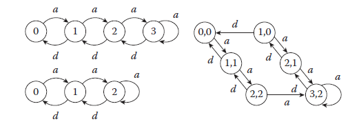

FIGURE 16.2 State transition diagrams for G/G/1/3 and G/G/1/2 along with the corresponding augmented system.

Let us now reverse the roles of the two parameter values and corresponding sample paths. Thus, the question is whether a sample path constructed under K = 3 is observable with respect to a sample path under K = 2. Returning to Figure 16.2, and state (1, \0) in particular, note that Γ(Xk(3)) = Γ(1) = {a, d} ⊃ {a} = Γ(0) = Γ(Xk(2)). Thus, the feasible event d, needed at state Xk(3) = 1 is unobservable at the corresponding state Xk(2) = 0. Therefore, it is interesting to note that condition (OB) is not symmetric with respect to the role of the parameter chosen as the “nominal” one.

Давайте тепер поміняємо ролі двох значень параметрів і відповідних шляхів вибірки. Таким чином, питання полягає в тому, чи шлях вибірки, побудований при K = 3, є спостережуваним відносно шляху вибірки при K = 2. Повертаючись до рисунка 16.2 і стану (1, \0), зокрема, зауважте, що Γ(Xk(3 )) = Γ(1) = {a, d} ⊃ {a} = Γ(0) = Γ(Xk(2)). Таким чином, можлива подія d, необхідна в стані Xk(3) = 1, є неспостережною у відповідному стані Xk(2) = 0. Отже, цікаво відзначити, що умова (OB) не є симетричною щодо ролі параметр, обраний як «номінальний».

As the previous example illustrates, even for DES modeled as Markov chains, condition (CO) is not generally satisfied because (OB) may fail. However, it is possible to enforce (OB) at the expense of some computational cost or the cost of temporarily “suspending” the construction of the sample paths under some values in {θ1, … , θM}. We will review next two methods that accomplish this goal, the SC method and ASA, before addressing the more general question of solving the constructability problem for arbitrary DES. 

Як показано в попередньому прикладі, навіть для DES, змодельованого як ланцюги Маркова, умова (CO) зазвичай не виконується, оскільки (OB) може не виконуватись. Проте, можливо застосувати (OB) за рахунок деяких обчислювальних витрат або вартості тимчасового «призупинення» побудови вибіркових шляхів під деякими значеннями в {θ1, …, θM}. Ми розглянемо наступні два методи, які досягають цієї мети, метод SC і ASA, перш ніж розглянути більш загальне питання вирішення проблеми конструктивності для довільного DES.

### 16.3.1 Standard Clock Approach

The SC approach11 applies to stochastic timed automata with a Poisson clock structure –λ t so that all event lifetime distributions are exponential, and we have Gi(t) = 1 – e i for all i ∈ E. Thus, every event process in such systems is characterized by a single Poisson parameter λi. As already pointed out, the distributional part of (CO) is immediately satisfied by the memoryless property of the exponentially distributed event lifetimes.

Підхід SC11 застосовується до стохастичних часових автоматів зі структурою годинника Пуассона –λ t, так що всі розподіли часу життя подій є експоненціальними, і ми маємо Gi(t) = 1 – e i для всіх i ∈ E. Таким чином, кожен процес події в таких системах характеризується одним параметром Пуассона λi. Як уже зазначалося, розподільна частина (CO) негайно задовольняється властивістю безпам’яті експоненціально розподілених подій.

The observability condition (OB) will be forced to be satisfied by choosing a nominal sample path to simulate such that Γ(x) = E for all states x. To accomplish this, let

Умова спостережуваності (OB) буде змушена бути задоволена шляхом вибору номінального шляху вибірки для моделювання таким чином, щоб Γ(x) = E для всіх станів x. Щоб досягти цього, дозвольте

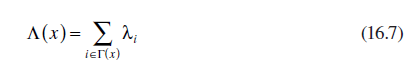

A property of Markov chains is that the distribution of the triggering event taking place at state x is given by

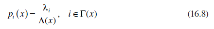

Moreover, exploiting the uniformization of Markov chains, we replace Λ(x) by a uniform rate γ ≥ Λ(x) common to all x so that the additional probability flow [γ − Λ(x)] at state x corresponds to “fictitious events” that leave the state unchanged. In our case, we choose this uniform rate to be the maximal rate over all events:

Крім того, використовуючи уніфікацію ланцюгів Маркова, ми замінюємо Λ(x) рівномірною швидкістю γ ≥ Λ(x), спільною для всіх x, так що додатковий потік ймовірностей [γ − Λ(x)] у стані x відповідає «фіктивному події», які залишають стан без змін. У нашому випадку ми вибираємо цю єдину ставку як максимальну ставку для всіх подій:

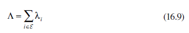

In the uniformized model, every event is always feasible. However, events i such that i ∉ Γ(x) for the original model leave the state unchanged, and they are ignored. Moreover, the mechanism through which the triggering event at any state is determined becomes independent of the state. Specifically, in Equation 16.7, we can now set Λ(x) = Λ for all x. Therefore, the triggering event distribution at any state is simply pi = λi/Λ. The fact that all events are permanently feasible in the uniformized model, combined with the memoryless property of the exponential event lifetime distribution, immediately implies the constructability condition (CO). In short, the way the SC approach gets around the problem of potentially unobservable events is by simulating a system in which all events are forced to occur at all states, and hence satisfy (OB).

У уніфікованій моделі кожна подія завжди здійсненна. Однак події i такі, що i ∉ Γ(x) для вихідної моделі залишають стан незмінним, і вони ігноруються. Крім того, механізм, за допомогою якого визначається подія запуску в будь-якому стані, стає незалежним від стану. Зокрема, у рівнянні 16.7 тепер ми можемо встановити Λ(x) = Λ для всіх x. Тому розподіл ініціюючих подій у будь-якому стані є просто pi = λi/Λ. Той факт, що всі події є постійно здійсненними в уніфікованій моделі, у поєднанні з властивістю експоненціального розподілу часу життя подій без пам’яті відразу означає умову конструктивності (CO). Коротше кажучи, підхід SC обходить проблему потенційно неспостережуваних подій шляхом моделювання системи, в якій усі події змушені відбуватися в усіх станах і, отже, задовольняють (OB).

Although this results in several fictitious events, that is, events i such that i ∉ Γ(x), it also makes for a general-purpose methodology within the realm of Poisson event processes.

Хоча це призводить до кількох фіктивних подій, тобто таких подій i, що i ∉ Γ(x), це також створює методологію загального призначення в області процесів подій Пуассона.

There is one additional simplification we can make to this scheme. We can generate all interevent times {V1, V2, …} from the cdf G(t) = 1 − e−t and then rescale any specific Vk through Vk(Λ) = Vk/Λ for any given Λ. This allows us to define all event times: assuming the system starts at time zero, we have t1 = V1, t2 = t1 + V2, and so on. The resulting sequence is referred to as the SC and can be generated in advance of any simulation. The specific SC algorithm for constructing sample paths under {θ0, … , θM} concurrently with the simulation of a nominal system constructed in this manner is as follows:

Існує ще одне спрощення, яке ми можемо зробити для цієї схеми. Ми можемо згенерувати всі міжподійні часи {V1, V2, …} із cdf G(t) = 1 − e−t, а потім змінити масштаб будь-якого конкретного Vk через Vk(Λ) = Vk/Λ для будь-якого заданого Λ. Це дозволяє нам визначити час усіх подій: якщо припустити, що система запускається в нульовий час, ми маємо t1 = V1, t2 = t1 + V2 і так далі. Отримана послідовність називається SC і може бути згенерована перед будь-яким моделюванням. Конкретний алгоритм SC для побудови вибіркових шляхів під {θ0, …, θM} одночасно з моделюванням номінальної системи, побудованої таким чином, виглядає наступним чином:

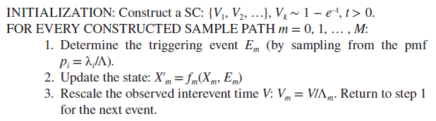 

The SC concurrent simulation scheme is extremely simple and applies to any Markov chain regardless of its state transition mechanism. Its main drawback is that it is not applicable for online applications where some of the rates of the event lifetime distributions are not known a priori since fictitious events are not observable. Futhermore, for offline applications, several of the events generated at step 1 of the algorithm may be wasted in the sense that they are fictitious and cause no change in the state of one or more of the constructed sample paths. 

Схема одночасного моделювання SC є надзвичайно простою і застосовується до будь-якого ланцюга Маркова незалежно від механізму переходу стану. Його основним недоліком є те, що він не застосовується для онлайн-додатків, де деякі швидкості розподілу тривалості подій невідомі апріорі, оскільки фіктивні події не можна спостерігати. Крім того, для офлайн-додатків кілька подій, згенерованих на кроці 1 алгоритму, можуть бути втрачені даремно в тому сенсі, що вони є фіктивними та не спричиняють жодних змін у стані одного або кількох побудованих зразкових шляхів.

### 16.3.2 Augmented System Analysis

Unlike the SC method, ASA12,13 is based on observing a real sample path under some setting θ0 and accepting the fact that constructability must be satisfied based on whatever events this observed sample path provides. Let ω(θ0) denote the observed sample path, and we need to check whether we can use information extracted from ω(θ0) to construct ω(θm) for some θm ≠ θ0. As the observed state sequence {Xk(θ0)} unfolds, we can construct the sequence {Xk(θm)} as long as Γ(Xk(θm)) ⊆ Γ(Xk(θ0)). Now, suppose that we encounter a state pair (X(θ0), X(θm)) such that Γ(X(θm)) ⊃ Γ(X(θ0)). This means that there is at least one event, say i ∈ Γ(X(θm)), which is unobservable at state X(θ0). At this point, the construction of ω(θm) must be suspended, since the triggering event at state X(θm) cannot be determined. Then, the key idea in ASA is the following: keep the state in ω(θm) fixed at X(θm) and keep on observing ω(θ0) until some new state X′(θ0) is entered that satisfies Γ(X(θm)) ⊆ Γ(X′(θ0)). The only remaining question is how long ω(θm) must wait in suspension. Note that we do not require “state matching,” that is, we do not require that X′(θ0) = X(θm) to continue the construction, but the weaker condition of “event matching”: Γ(X(θm)) ⊆ Γ(X′(θ)).

На відміну від методу SC, ASA12,13 базується на спостереженні за реальним шляхом вибірки при певному налаштуванні θ0 і прийнятті того факту, що конструктивність має бути задоволена на основі будь-яких подій, які забезпечує цей спостережуваний шлях вибірки. Нехай ω(θ0) позначає спостережуваний шлях вибірки, і нам потрібно перевірити, чи можемо ми використовувати інформацію, отриману з ω(θ0), щоб побудувати ω(θm) для деякого θm ≠ θ0. Оскільки спостережувана послідовність станів {Xk(θ0)} розгортається, ми можемо побудувати послідовність {Xk(θm)} до тих пір, поки Γ(Xk(θm)) ⊆ Γ(Xk(θ0)). Тепер припустимо, що ми зустрічаємо пару станів (X(θ0), X(θm)), таку, що Γ(X(θm)) ⊃ Γ(X(θ0)). Це означає, що існує принаймні одна подія, скажімо, i ∈ Γ(X(θm)), яка є неспостережною в стані X(θ0). На цьому етапі побудова ω(θm) повинна бути призупинена, оскільки подія запуску в стані X(θm) не може бути визначена. Тоді ключова ідея в ASA полягає в наступному: підтримувати стан в ω(θm) фіксованим на X(θm) і продовжувати спостерігати ω(θ0), доки не буде введено якийсь новий стан X′(θ0), який задовольняє Γ(X( θm)) ⊆ Γ(X′(θ0)). Єдине питання, яке залишається, полягає в тому, як довго ω(θm) має чекати в підвішеному стані. Зауважте, що ми не вимагаємо «відповідності станів», тобто ми не вимагаємо, щоб X′(θ0) = X(θm) для продовження конструкції, але слабша умова «відповідності подій»: Γ(X(θm) ) ⊆ Γ(X′(θ)).

We will use ℳm to denote the mode of ω(θm), which can take on either the special value ACTIVE or a value from the state space Xm. This gives rise to the following Event Matching algorithm:

Ми будемо використовувати ℳm для позначення режиму ω(θm), який може приймати або спеціальне значення ACTIVE, або значення з простору станів Xm. Це призводить до наступного алгоритму зіставлення подій:

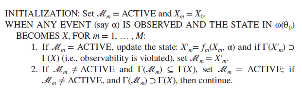

In step 2, the condition Mm ≠ ACTIVE and Γ(Mm) ⊆ Γ(X) implies that ω(θm) was suspended at the time this event occurs, but since the observability condition Γ(Mm) ⊆ Γ(X) is satisfied, the sample path construction can resume. The validity of the event matching scheme rests on basic properties of Markov processes, which enable us to “cut and paste” segments of a given sample path to produce a new sample path that is stochastically equivalent to the original one (for more details, see the work by Cassandras and Lafortune3). Note that no stopping condition is specified, since this is generally application dependent. Also, as in the case of the SC construction, the result of the Event Matching algorithm is a complete sample path; any desired sample function can subsequently be evaluated from it for the purpose of estimating system performance under all {θ0, θ1, … , θM} of interest. The main drawback of ASA is the need to suspend a sample path construction for a potentially long time interval. This problem is the counterpart of the drawback we saw for the SC approach, which consists of “wasted random number generations,” however, unlike SC, ASA can construct sample paths under different parameters using information directly observable from the sample path of an actual system. Finally, it is worth pointing out that the Event Matching algorithm can be modified so as to allow for at most one event process that is not Poisson; details of this extension are given in the work by Cassandras and Lafortune.3

На кроці 2 умова Mm ≠ ACTIVE і Γ(Mm) ⊆ Γ(X) передбачає, що ω(θm) було призупинено під час цієї події, але оскільки умова спостережуваності Γ(Mm) ⊆ Γ(X) задовольняється, , побудова зразкового шляху може бути відновлена. Достовірність схеми зіставлення подій базується на основних властивостях процесів Маркова, які дозволяють нам «вирізати та вставляти» сегменти заданого шляху зразка, щоб створити новий шлях зразка, який стохастично еквівалентний початковому (додаткову інформацію див. твір Кассандра і Лафортуна3). Зауважте, що умови зупинки не вказано, оскільки це, як правило, залежить від програми. Також, як і у випадку побудови SC, результатом алгоритму зіставлення подій є повний вибірковий шлях; будь-яка бажана вибіркова функція може бути згодом оцінена з неї з метою оцінки продуктивності системи при всіх {θ0, θ1, …, θM}, що представляють інтерес. Основним недоліком ASA є необхідність призупинити побудову шляху вибірки на потенційно довгий інтервал часу. Ця проблема є аналогом недоліку, який ми бачили для підходу SC, який складається з «марних генерацій випадкових чисел», однак, на відміну від SC, ASA може будувати вибіркові шляхи за різними параметрами, використовуючи інформацію, яку можна безпосередньо спостерігати з зразкового шляху фактичної системи. . Нарешті, варто зазначити, що алгоритм зіставлення подій можна модифікувати таким чином, щоб дозволити щонайбільше один процес події, який не є Пуассоновим; подробиці цього розширення наведено в роботі Кассандра та Лафортуна.3

[16.2 <--- ](16_2.md) [   Зміст   ](README.md) [--> 16.4](16_4.md)