[16.3 <--- ](16_3.md) [   Зміст   ](README.md) [--> 16.5](16_5.md)

## 16.4. CONCURRENT SIMULATION APPROACH FOR ARBITRARY EVENT PROCESSES

In this section, we describe a method for solving the constructability problem without having to rely on the Markovian structure of the event processes in the DES model, based on the sample path coupling approach first presented in the work by Cassandras and Panayiotou.4 We start by making some assumptions, followed by three subsections. Section 16.4.1 introduces some notation and definitions; Section 16.4.2 presents the *Time Warping Algorithm* (TWA) for implementing the general solution to the constructability problem; Section 16.4.3 quantifies the speedup realized through the TWA; and Section 16.4.4 discusses extensions resulting from relaxing the assumptions presented next.

У цьому розділі ми описуємо метод розв’язання проблеми конструктивності без необхідності покладатися на марковську структуру подійних процесів у моделі DES, заснований на підході сполучення шляхів зразка, вперше представленому в роботі Кассандраса та Панайоту.4 Ми починаємо зробивши деякі припущення, а потім три підрозділи. Розділ 16.4.1 вводить деякі позначення та визначення; Розділ 16.4.2 представляє *Алгоритм деформації часу* (TWA) для реалізації загального рішення проблеми конструктивності; Розділ 16.4.3 кількісно визначає прискорення, реалізоване через TWA; а в розділі 16.4.4 обговорюються розширення, отримані в результаті пом’якшення припущень, представлених далі.

The four assumptions that follow simplify our analysis and apply to a large class of DES. However, they can also be eventually relaxed (see the work by Cassandras and Panayiotou4). 

Чотири наступні припущення спрощують наш аналіз і застосовуються до великого класу DES. Однак їх також можна зрештою послабити (див. роботу Кассандра та Панайоту4).

(**A1**) *Feasibility Assumption*: Let *xn* be the state of the DES after the occurrence of the *n*th event. Then, for any *n*, there exists at least one *r* > *n* such that *e* ∈ *Γ*(*xr*) for any *e* ∈ *E*.

(**A2**) *Invariability Assumption*: Let *E* be the event set under the nominal parameter θ0 and let *E**m* be the event set under θ*m* ≠ θ0. Then, *E**m* = *E*.

(**A3**) *Similarity Assumption*: Let G*i*(θ0), i ∈ *E* be the event lifetime distribution for the event *i* under θ0 and let G*i*(θ*m*), i ∈ *E* be the corresponding event lifetime distribution under θ*m*. Then, G*i*(θ0) = G*i*(θ*m*) for all i ∈ *E*.

(**A4**) *State Invariability Assumption*: Let G*i*(*xk*), *i* ∈ *E* and *xk* ∈ *X* be the event lifetime distribution of event *i* if *i* is activated when the system state is *xk*. Then, G*i*(*xk*) = G*i*(*xl*) for all *xk*, *xl* ∈ *X* and all *i* ∈ *E*.

(**A1**) *Припущення здійсненності*: Нехай *xn* буде станом DES після появи *n*-ої події. Тоді для будь-якого *n* існує принаймні одне *r* > *n* таке, що *e* ∈ *Γ*(*xr*) для будь-якого *e* ∈ *E*.

(**A2**) *Припущення про незмінність*: Нехай *E* — подія, набір за номінальним параметром θ0, а *E**m* — подія, набір за θ*m* ≠ θ0. Тоді *E**m* = *E*.

(**A3**) *Припущення подібності*: Нехай G*i*(θ0), i ∈ *E* — розподіл тривалості події для події *i* під θ0 і нехай G*i*(θ*m* ), i ∈ *E* — відповідний розподіл часу життя події при θ*m*. Тоді G*i*(θ0) = G*i*(θ*m*) для всіх i ∈ *E*.

(**A4**) *Припущення про незмінність стану*: Нехай G*i*(*xk*), *i* ∈ *E* і *xk* ∈ *X* — розподіл події *i* за тривалістю життя, якщо *i* активується, коли стан системи *xk*. Тоді G*i*(*xk*) = G*i*(*xl*) для всіх *xk*, *xl* ∈ *X* і всіх *i* ∈ *E*.

Assumption **A1** guarantees that in the evolution of any sample path, all events in *E* will always become feasible at some point in the future. If, for some DES, assumption **A1** is not satisfied, that is, there exists an event α that never gets activated after some point in time, then, as we will see, it is possible that the construction of some sample path will remain suspended forever waiting for α to happen. Note that a DES with an irreducible state space immediately satisfies this condition.

Припущення **A1** гарантує, що в еволюції будь-якого шляху вибірки всі події в *E* завжди стануть можливими в якийсь момент у майбутньому. Якщо для деякого DES припущення **A1** не виконується, тобто існує подія α, яка ніколи не активується через деякий момент часу, тоді, як ми побачимо, можливо, що побудова деякого зразка шлях залишатиметься призупиненим назавжди в очікуванні α. Зверніть увагу, що DES із незвідним простором станів негайно задовольняє цю умову.

Assumption **A2** states that changing a parameter from θ0 to some θ*m* ≠ θ0 does not alter the event set *E*. More importantly, **A2** guarantees that changing to θ*m* does not introduce any new events so that all event lifetimes for all events can be observed from the nominal sample path (the converse, i.e., fewer events in *Em*, would still make it possible to satisfy (**OB**)).

Припущення **A2** стверджує, що зміна параметра з θ0 на деяке θ*m* ≠ θ0 не змінює набір подій *E*. Що ще важливіше, **A2** гарантує, що зміна на θ*m* не вводить жодних нових подій, тому всі часи існування подій для всіх подій можна спостерігати з номінального шляху вибірки (навпаки, тобто менше подій у *Em* , все одно дозволяло б задовольнити (**OB**)).

Assumption **A3** guarantees that changing a parameter from θ0 to some θ*m* ≠ θ0 does not affect the distribution of one or more event lifetime sequences. This allows us to use exactly the same lifetimes that we observe in the nominal sample path to construct the perturbed sample path. In other words, our analysis focuses on *structural* system parameters rather than *distributional* parameters. As we will see, however, it is straightforward to handle the latter at the expense of some computational cost.

Припущення **A3** гарантує, що зміна параметра від θ0 до деякого θ*m* ≠ θ0 не впливає на розподіл однієї чи кількох подій. Це дозволяє нам використовувати точно той самий час життя, який ми спостерігаємо в номінальному шляху вибірки, щоб побудувати збурений шлях вибірки. Іншими словами, наш аналіз зосереджений на *структурних* системних параметрах, а не на *розподільних* параметрах. Однак, як ми побачимо, впоратися з останнім легко за рахунок певних обчислювальних витрат.

Finally, assumption **A4** guarantees that the observed lifetimes do not depend on the current state of the system. This allows us to use any event lifetime of an event *e* ∈ *E* that has been observed irrespective of the current state of the system and, therefore, to employ “event matching” as opposed to “state matching” when a constructed sample path becomes active after being suspended for violating the (**OB**) condition. 

Нарешті, припущення **A4** гарантує, що спостережувані терміни життя не залежать від поточного стану системи. Це дозволяє нам використовувати будь-який час життя події *e* ∈ *E*, яка спостерігалася незалежно від поточного стану системи, і, отже, використовувати «відповідність подій» на відміну від «відповідності станів», коли побудовано шлях зразка стає активним після призупинення через порушення умови (**OB**).

### 16.4.1 Notation and Definitions

Let

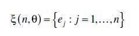

with *ej* ∈ *E*, be the sequence of events that constitute an observed sample path ω(θ) up to *n* total events. Although ξ(*n*,θ) is clearly a function of the parameter θ, we will write ξ(*n*) and adopt the notation

з *ej* ∈ *E*, це послідовність подій, які становлять спостережуваний вибірковий шлях ω(θ) до *n* загальних подій. Хоча ξ(*n*,θ) явно є функцією параметра θ, ми будемо писати ξ(*n*) і приймати позначення

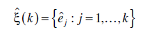

for any constructed sample path under a different value of the parameter up to *k* events in that path. It is important to realize that *k* is actually a function of *n*, since the constructed sample path is coupled to the observed sample path through the observed event lifetimes. However, again for the sake of notational simplicity, we will refrain from continuously indicating this dependence.

для будь-якого побудованого зразкового шляху за іншого значення параметра до *k* подій у цьому шляху. Важливо розуміти, що *k* насправді є функцією від *n*, оскільки побудований вибірковий шлях пов’язаний зі спостережуваним зразковим шляхом через час існування спостережуваної події. Проте знову ж таки задля простоти позначення ми утримаємося від постійного вказівки на цю залежність.

Next, we define the *score* of an event *i* ∈ *E* in a sequence ξ(*n*), denoted by *sn* = [x(*n*)]*i*, to be the nonnegative integer that counts the number of instances of event *i* in this sequence. The corresponding score of *i* in a constructed sample path is denoted by *s*ˆ*k* = éxˆ (*k* )ù . In what follows, all quantities with the symbol “^” above them refer to a typical constructed sample path.

Далі ми визначаємо *оцінку* події *i* ∈ *E* в послідовності ξ(*n*), позначену *sn* = [x(*n*)]*i*, як невід’ємну ціле число, яке підраховує кількість випадків події *i* в цій послідовності. Відповідний бал *i* у побудованому зразковому шляху позначається як *s*ˆ*k* = éxˆ (*k* )ù . У подальшому всі величини із символом «^» над ними відносяться до типового побудованого шляху зразка.

Associated with every event type *i* ∈ *E* in ξ(*n*) is a sequence of *sn* event lifetimes

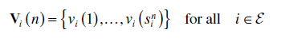

The corresponding set of sequences in the constructed sample path is as follows:

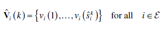

which is a subsequence of **V***i*(*n*) with *k* ≤ *n*. In addition, we define the following sequence of lifetimes:

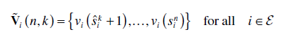

which consists of all event lifetimes that are in **V***i*(*n*) but not in ***V\***ˆ (*k* ). Associated with any one of these sequences are the following operations. Given some 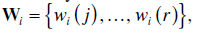

Concurrent Simulation for Online Optimization

 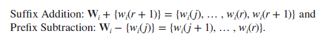

Note that the addition and subtraction operations are defined so that a new element is always added as the *last* element (the *suffix*) of a sequence, whereas subtraction always removes the *first* element (the *prefix*) of the sequence. At this point, it is worth pointing out that to construct the various event lifetime sequences, it is necessary that the event lifetime sequences are observable from the nominal sample path. For offline approaches, this is generally simple since the lifetimes can be directly recorded from the simulator. For online approaches, this is possible for *invertible* systems, that is, systems for which event lifetimes can be recovered from the output of a system (i.e., sequence of events, states, and transition epochs) (see the work by Park and Chong14 for invertibility conditions as well as an appropriate algorithm). Next, define the set

Зауважте, що операції додавання та віднімання визначено таким чином, що новий елемент завжди додається як *останній* елемент (*суфікс*) послідовності, тоді як віднімання завжди видаляє *перший* елемент (*префікс*) із послідовність. На цьому етапі варто зазначити, що для побудови різноманітних життєвих послідовностей подій необхідно, щоб послідовності життєвих подій можна було спостерігати з номінального шляху вибірки. Для офлайн-підходів це, як правило, просто, оскільки час життя можна записувати безпосередньо з симулятора. Для онлайн-підходів це можливо для *інвертованих* систем, тобто систем, для яких час життя подій можна відновити з виходу системи (тобто послідовності подій, станів і епох переходу) (див. роботу Парка та Chong14 для умов оборотності, а також відповідний алгоритм). Далі визначте набір

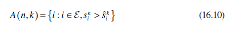

which is associated with **V** *i* (*n*, *k* ) and consists of all events *i* whose corresponding sequence **V** *i* (*n*, *k* ) contains at least one element. Thus, every *i* ∈ *A*(*n*, *k*) is an event that has been observed in ξ(*n*) and has at least one lifetime that has yet to be used in the coupled sample path xˆ(*k*). Hence, *A*(*n*, *k*) should be thought of as the set of *available* events to be used in the construction of the coupled path.

який асоціюється з **V** *i* (*n*, *k* ) і складається з усіх подій *i*, відповідна послідовність яких **V** *i* (*n*, *k* ) містить принаймні один елемент. Таким чином, кожне *i* ∈ *A*(*n*, *k*) є подією, яка спостерігалася в ξ(*n*) і має принаймні один час життя, який ще не використано в сполученому шляху вибірки xˆ(*k*). Отже, *A*(*n*, *k*) слід розглядати як набір *доступних* подій, які будуть використовуватися при створенні зв’язаного шляху.

Finally, we define the following set, which is crucial in our approach:

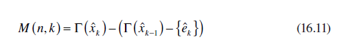

where, clearly, *M*(*n*, *k*) ⊆ *E*. Note that *e*ˆ*k* is the triggering event at the (*k* − 1)th state visited in the constructed sample path. Thus, *M*(*n*, *k*) contains all the events that are in the feasible event set G (*x*ˆ*k* ) but not in G (*x*ˆ*k* -1) ; in addition, *e*ˆ*k* also belongs to *M*(*n*, *k*) if it happens that *e*ˆ*k* ÎG(*x*ˆ*k* ). Intuitively, *M*(*n*, *k*) consists of all *missing* events from the perspective of the constructed sample path when it enters a new state *x*ˆ*k* , that is, those events already in G (*x*ˆ*k* -1) that were not the triggering event remain available to be used in the sample path construction as long as they are still feasible. All other events in the set are “missing” as far as residual lifetime information is concerned.

де, очевидно, *M*(*n*, *k*) ⊆ *E*. Зауважте, що *e*ˆ*k* є ініційною подією в (*k* − 1)-му стані, відвіданому на побудованому шляху вибірки. Таким чином, *M*(*n*, *k*) містить усі події, які є в наборі можливих подій G (*x*ˆ*k* ), але не в G (*x*ˆ*k* -1) ; крім того, *e*ˆ*k* також належить до *M*(*n*, *k*), якщо буває, що *e*ˆ*k* ÎG(*x*ˆ*k* ). Інтуїтивно зрозуміло, що *M*(*n*, *k*) складається з усіх *відсутніх* подій з точки зору побудованого зразкового шляху, коли він переходить у новий стан *x*ˆ*k* , тобто тих подій, які вже є в G (*x*ˆ*k* -1), які не були ініційною подією, залишаються доступними для використання в побудові шляху вибірки, доки вони все ще можливі. Усі інші події в наборі «відсутні», що стосується інформації про залишковий термін служби.

The concurrent sample path construction process we are interested in consists of two coupled processes, each generated by an STA as detailed in Section 16.2, through Equations 16.1 to 16.6. The observed sample path and the one to be constructed both satisfy this set of equations. Our task is to derive an additional set of equations that captures the coupling between them. In particular, our goal is to enable event lifetimes from the observed ξ(*n*) to be used to construct a sequence xˆ (*k* ).

Процес побудови паралельного шляху вибірки, який нас цікавить, складається з двох пов’язаних процесів, кожен з яких генерується STA, як описано в Розділі 16.2 через рівняння 16.1–16.6. Спостережувана траєкторія зразка та траєкторія, яку потрібно побудувати, задовольняють цьому набору рівнянь. Наше завдання полягає в тому, щоб вивести додатковий набір рівнянь, який фіксує взаємозв’язок між ними. Зокрема, наша мета полягає в тому, щоб уможливити використання часу життя подій із спостережуваного ξ(*n*) для побудови послідовності xˆ (*k*).

First, observe that the process described by Equations 16.1 through 16.6 and applied to xˆ (*k* ) hinges on the availability of residual lifetimes *y*ˆ*i* (*k* ) for all *i* ÎG (*x*ˆ*k* ). Thus, the constructed sample path can only be “active” at state *x*ˆ*k* if every *i* ÎG (*x*ˆ*k* ) is such that either *i* Î(G (*x*ˆ*k* -1 ) {*e*ˆ*k* }) (in which case *y*ˆ*i* (*k* ) is a residual lifetime of an event available from the previous state transition) or *i* ∈ *A*(*n*, *k*) (in which case a full lifetime of *i* is available from the observed sample path). This motivates the following: 

По-перше, зауважте, що процес, описаний у рівняннях 16.1–16.6 і застосований до xˆ (*k* ), залежить від наявності залишкових термінів служби *y*ˆ*i* (*k* ) для всіх *i* ÎG (*x* ˆ*k* ). Таким чином, побудований вибірковий шлях може бути «активним» лише у стані *x*ˆ*k*, якщо кожен *i* ÎG (*x*ˆ*k* ) такий, що або *i* Î(G (*x* ˆ*k* -1 ) {*e*ˆ*k* }) (у цьому випадку *y*ˆ*i* (*k* ) — це залишковий час існування події, доступної з попереднього переходу стану) або *i * ∈ *A*(*n*, *k*) (у цьому випадку повний час життя *i* доступний із спостережуваного шляху вибірки). Це мотивує наступне:

**Definition** **16.1**

A constructed sample path is *active* at state *x*ˆ*k* after the occurrence of an observed event *en* if for every *i* ÎG (*x*ˆ*k* ), *i* Î(G (*x*ˆ*k* -1 ) {*e*ˆ*k* }) È *A* (*n*, *k* ). Thus, the start/stop conditions for the construction of a sample path are determined by whether it is active at the current state or not.

Сконструйований вибірковий шлях є *активним* у стані *x*ˆ*k* після виникнення спостережуваної події *en*, якщо для кожного *i* ÎG (*x*ˆ*k* ), *i* Î(G (*x*ˆ*k* -1 ) {*e*ˆ*k* }) È *A* (*n*, *k* ). Таким чином, умови початку/зупинки для побудови зразкового шляху визначаються тим, активний він у поточному стані чи ні.

### 16.4.2 Observed and Constructed Sample Path Coupling Dynamics

Upon occurrence of the (*n* + 1)th observed event, *en* + 1, the first step is to update the event lifetime sequences **V** *i* (*n*, *k* ) as follows:

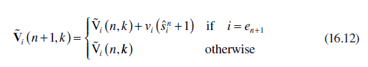

The addition of a new event lifetime implies that the available event set *A*(*n*, *k*) defined in Equation 16.10 may be affected. Therefore, it is updated as follows:

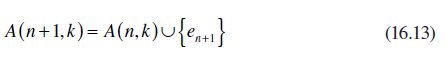

Finally, note that the missing event set *M*(*n*, *k*) defined in Equation 16.11 remains unaffected by the occurrence of observed events:

 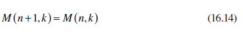

At this point, we are able to decide whether all lifetime information to proceed with a state transition in the constructed sample path is available or not. In particular, the condition

На цьому етапі ми можемо вирішити, чи доступна вся інформація про тривалість життя для продовження переходу стану в побудованому зразковому шляху чи ні. Зокрема, стан

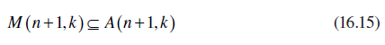

may be used to determine whether the constructed sample path is active at the current state *x*ˆ*k* (in the sense of Definition 16.1). The following is a formal statement of this fact and is proved in the work by Cassandras and Panayiotou.4

може бути використаний для визначення того, чи є побудований шлях вибірки активним у поточному стані *x*ˆ*k* (у сенсі визначення 16.1). Нижче наведено офіційне твердження цього факту, яке доведено в роботі Кассандра та Панайоту.4

**Lemma 16.1**

A constructed sample path is active at state *x*ˆ*k* after an observed event *en* + 1 if and only if *M*(*n* + 1, *k*) ⊆ *A*(*n* + 1, *k*).

Assuming Equation 16.15 is satisfied, Equations 16.1 through 16.6 may be used to update the state *x*ˆ*k* of the constructed sample path. In so doing, lifetimes *vi* (*sk* + 1) for all *i* ∈ *M*(*n* + 1, *k*) are used from the corresponding sequences **V** *i* (*n* + 1, *k* ). Thus, upon completion of the state update steps, all three variables associated with the coupling process, that is,V *i* (*n*, *k* ), *A*(*n*, *k*), and *M*(*n*, *k*) must be updated. In particular,

Припускаючи, що рівняння 16.15 задовольняється, рівняння 16.1–16.6 можна використовувати для оновлення стану *x*ˆ*k* побудованого шляху вибірки. При цьому час життя *vi* (*sk* + 1) для всіх *i* ∈ *M*(*n* + 1, *k*) використовується з відповідних послідовностей **V** *i* ( *n* + 1, *k* ). Таким чином, після завершення етапів оновлення стану всі три змінні, пов’язані з процесом з’єднання, тобто V *i* (*n*, *k*), *A*(*n*, *k*) і *M*(*n*, *k*) необхідно оновити. Зокрема,

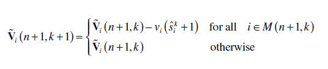

This operation immediately affects the set A(n + 1, k), which is updated as follows:

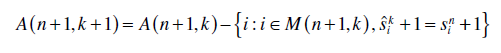

Finally, applying Equation 16.11 to the new state *x*ˆ*k*+1,

 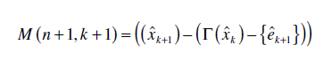

Therefore, we are again in a position to check Equation 16.15 for the new sets *M*(*n* + 1, *k* + 1) and *A*(*n* + 1, *k* + 1). If it is satisfied, then we can proceed with one more state update on the constructed sample path; otherwise, we wait for the next event on the observed sample path until Equation 16.15 is again satisfied. Similar to Lemma 16.1, we have the following: 

Отже, ми знову можемо перевірити рівняння 16.15 для нових наборів *M*(*n* + 1, *k* + 1) і *A*(*n* + 1, *k* + 1). Якщо він задоволений, ми можемо продовжити ще одне оновлення стану на побудованому зразковому шляху; інакше ми чекаємо наступної події на спостережуваному шляху вибірки, доки рівняння 16.15 знову не буде виконано. Подібно до леми 16.1, маємо наступне:

**Lemma 16.2**

A constructed sample path is active at state *x* *k* +1 after event *e* *k* +1 if and only if *M*(*n* + 1, *k* + 1) ⊆ *A*(*n* + 1, *k* + 1). The analysis above can be put in the form of an algorithm termed *TWA,* which is described next.

Сконструйований вибірковий шлях є активним у стані *x* *k* +1 після події *e* *k* +1 тоді і тільки тоді, коли *M*(*n* + 1, *k* + 1) ⊆ *A* (*n* + 1, *k* + 1). Наведений вище аналіз можна представити у формі алгоритму під назвою *TWA*, який описано далі.

**Time Warping Algorithm (TWA):**

The TWA consists of three parts: an initialization, an update of the observed system state and of sample path coupling variables, and the “time warping” operation. 

TWA складається з трьох частин: ініціалізації, оновлення спостережуваного стану системи та змінних зв’язку шляху вибірки, а також операції «викривлення часу».

**1.**  **Initialization**

The event counts, event scores, clocks, and states of the observed and constructed sample paths are initialized in the usual way:

Підрахунки подій, оцінки подій, годинники та стани спостережуваних і побудованих шляхів вибірки ініціалізуються звичайним способом:

 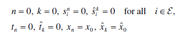

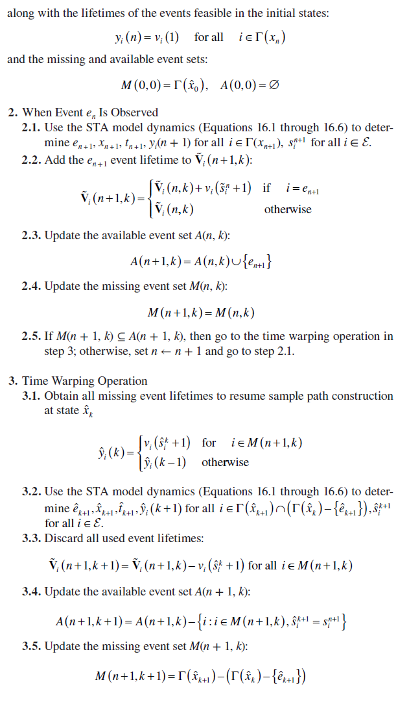

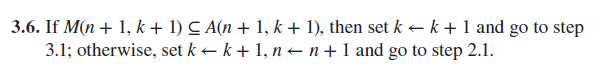

The computational requirements of the TWA are minimal: adding and subtracting elements to sequences, simple arithmetic, and checking conditions (Equation 16.15). It is the storage of additional information that constitutes the major cost of the algorithm.

Обчислювальні вимоги TWA є мінімальними: додавання та віднімання елементів до послідовностей, проста арифметика та умови перевірки (рівняння 16.15). Саме зберігання додаткової інформації становить основну вартість алгоритму.

**Example** 

Let us consider once again a G/G/1/*K* queueing system as in previous examples, where the event set is *E* = {*a*, *d*} and the state space is *X* = {0, 1, … , *K*}. Let the observed sample path be one with queue capacity *K* = 2, and let us try to construct a sample path under *K* = 3 in the framework of [Figure 16.1](#_bookmark92). Let Γ(*x*[*K*]) be the feasible event set at state *x* for the system under *K* and assume that both systems are initially empty. Unlike the SC and ASA methods, we can no longer maintain between the two sample paths (the observed one and the one to be constructed) a coupling that preserves full synchronization of events. This is because of the absence of Markovian event processes that allow us to exploit the memoryless property. Thus, we must maintain each feasible event set, Γ(*x*[2]) and Γ(*x*[3]), separately for each observed state *x*[2] and constructed state *x*[3]. Whenever an event is observed, its lifetime is assumed to become available (i.e., the time when this event was activated is known). Each such lifetime is subsequently used in the construction of the sample path under *K* = 3.

Давайте ще раз розглянемо систему масового обслуговування G/G/1/*K*, як у попередніх прикладах, де набір подій *E* = {*a*, *d*}, а простір станів *X* = { 0, 1, … , *K*}. Нехай спостережуваний вибірковий шлях є одним із ємністю черги *K* = 2, і спробуємо побудувати вибірковий шлях під *K* = 3 у рамках [Рис. 16.1] (#_bookmark92). Нехай Γ(*x*[*K*]) — можлива подія, встановлена в стані *x* для системи під *K*, і припустимо, що обидві системи спочатку порожні. На відміну від методів SC і ASA, ми більше не можемо підтримувати зв’язок між двома шляхами вибірки (спостережуваним і тим, який буде побудовано), який зберігає повну синхронізацію подій. Це через відсутність марковських подійних процесів, які дозволяють нам використовувати властивість без пам’яті. Таким чином, ми повинні підтримувати кожен набір можливих подій, Γ(*x*[2]) і Γ(*x*[3]), окремо для кожного спостережуваного стану *x*[2] і сконструйованого стану *x*[3] . Щоразу, коли спостерігається подія, вважається, що її час життя стає доступним (тобто відомий час, коли ця подія була активована). Кожен такий час життя згодом використовується для побудови зразкового шляху при *K* = 3.

To see precisely how this can be done, we start out with a state *x*[3] = 0 for the constructed sample path so that Γ(*x*[3]) = {*a*}. Since no event lifetimes are initially available, we consider the sample path of this system as “suspended” with a missing event set *M*(0, 0) = {*a*}. The initial state of the observed sample path is *x*[2] = 0 so that Γ(*x*[2]) = {*a*}. Therefore, the first observed event is *a*. At this point, the constructed sample path may be “resumed,” since all lifetimes of the events in Γ(*x*[3]) are now available, namely, the lifetime of *a*, so we have the available event set *A*(1, 1) = {*a*}. This amounts to verifying the condition *M*(1, 1) ⊆ *A*(1, 1) in step 3.6 of the TWA above. The constructed sample path advances time and updates its state to *x*[3] = 1. Now Γ(*x*[3]) = {*a*, *d*}, but neither event has been observed yet, and therefore, the constructed sample path is suspended again until at least one *a* and one *d* event occur at the observed sample path. This start/ stop (or suspend/resume) process goes on until a sample path under *K* = 3 is constructed up to a desired number of events or some specified time, that is, we have *M*(2, 2) = {*a*, *d*}. In this example, assuming that both arrival and service processes have positive rates, it is clear that eventually *M*(*n* + 1, *k* + 1) ⊆ *A*(*n* + 1, *k* + 1) will be satisfied, after both an arrival event and a departure event are observed. Note that it is possible that when an event occurs causing the condition to be satisfied, a series of events on the constructed sample path is triggered, hence a sequence of state transitions and time updates as well. For instance, if Γ(*x*[3]) = {*a*, *d*}, a sequence of events {*a*, *a*, *a*, *d*} will cause four state transitions in a row as soon as *d* is observed. The fact that in this process we move backward in time to revisit a suspended sample path and then forward by one or more event occurrences lends itself to the term “time warping” in the TWA. 

Щоб точно побачити, як це можна зробити, ми починаємо зі стану *x*[3] = 0 для побудованого зразкового шляху, щоб Γ(*x*[3]) = {*a*}. Оскільки початково не доступні терміни існування подій, ми вважаємо зразковий шлях цієї системи «призупиненим» із відсутнім набором подій *M*(0, 0) = {*a*}. Початковий стан спостережуваного шляху вибірки *x*[2] = 0, так що Γ(*x*[2]) = {*a*}. Отже, перша спостережувана подія — це *a*. На цьому етапі побудований вибірковий шлях може бути «відновлений», оскільки тепер доступні всі часи життя подій у Γ(*x*[3]), а саме час життя *a*, тому ми маємо доступний набір подій *A*(1, 1) = {*a*}. Це означає перевірку умови *M*(1, 1) ⊆ *A*(1, 1) на кроці 3.6 TWA вище. Побудований вибірковий шлях зрушує час і оновлює свій стан до *x*[3] = 1. Тепер Γ(*x*[3]) = {*a*, *d*}, але жодна подія ще не спостерігалася, і отже, побудований шлях вибірки знову призупиняється, доки на спостережуваному шляху вибірки не відбудеться принаймні одна подія *a* і одна подія *d*. Цей процес запуску/зупинки (або призупинення/відновлення) триває до тих пір, поки вибірковий шлях під *K* = 3 не буде побудований до бажаної кількості подій або деякого заданого часу, тобто ми матимемо *M*(2, 2) = {*a*, *d*}. У цьому прикладі, якщо припустити, що процеси надходження та обслуговування мають додатні показники, зрозуміло, що в кінцевому підсумку *M*(*n* + 1, *k* + 1) ⊆ *A*(*n* + 1, *k* + 1) буде задоволено після того, як спостерігаються подія прибуття та подія відправлення. Зауважте, що можливо, коли відбувається подія, що спричиняє виконання умови, запускається серія подій на побудованому шляху вибірки, отже, послідовність переходів станів і оновлення часу. Наприклад, якщо Γ(*x*[3]) = {*a*, *d*}, послідовність подій {*a*, *a*, *a*, *d*} спричинить чотири зміни стану підряд, як тільки спостерігається *d*. Той факт, що в цьому процесі ми рухаємося назад у часі, щоб повернутися до призупиненого шляху зразка, а потім вперед на одну або більше подій, піддається терміну «викривлення часу» в TWA.

Regarding the *scalability* of the TWA, as in the case of the SC and ASA methods, it should be clear that the computational effort involved scales with the number of parameters considered, *N*, and the number of values to be explored for each parameter, *Mi*, *i* = 1, … , *N*. Setting *Mi* = *M* for all *i* = 1, … , *N* for simplicity, it follows that *N* · *M* concurrent estimators are active for each simulation run. This number is a worst case scenario. When a specific optimization problem is considered, where one can generally exploit the structure of the DES (as will be seen in the example mentioned in Section 16.5), it is possible to significantly reduce the number of active concurrent sample paths.

Стосовно *масштабованості* TWA, як і у випадку методів SC і ASA, має бути зрозуміло, що обчислювальні зусилля включали масштаби з кількістю розглянутих параметрів, *N*, і кількістю значень, які потрібно дослідити для кожен параметр, *Mi*, *i* = 1, … , *N*. Встановивши *Mi* = *M* для всіх *i* = 1, …, *N* для простоти, випливає, що *N* · *M* одночасні оцінювачі активні для кожного запуску моделювання. Це число є найгіршим сценарієм. Коли розглядається конкретна проблема оптимізації, де можна загалом використовувати структуру DES (як буде видно в прикладі, згаданому в розділі 16.5), можна значно зменшити кількість активних одночасних шляхів вибірки.

### 16.4.3 Speedup Factor

In a simulation setting, it makes sense to use concurrent simulation methods only if they can generate the required results faster than brute-force simulation. Thus, to define a speedup factor associated with a particular concurrent simulation method, suppose that the sample path constructed through such a method were instead generated by a separate simulation whose length is defined by *N* total events. Let *TN* be the time it takes in Central Processor Unit (CPU) units to complete such a simulation run. Furthermore, suppose that when the nominal simulation is executed with a concurrent simulation algorithm as part of it, the total time is given by *T o* + τ , where  *T o* is the simulation time (with no concurrent sample path construction) and τ is the additional time involved in the concurrent construction of a sample path with *K* ≤ *N* events. We then define the *speedup factor* as

У налаштуваннях моделювання має сенс використовувати паралельні методи моделювання, лише якщо вони можуть генерувати необхідні результати швидше, ніж симуляція методом грубої сили. Таким чином, щоб визначити коефіцієнт прискорення, пов’язаний із певним методом одночасної симуляції, припустимо, що вибірковий шлях, побудований за допомогою такого методу, натомість був згенерований окремою симуляцією, тривалість якої визначається *N* загальними подіями. Нехай *TN* буде часом, який потрібен блокам центрального процесора (CPU) для завершення такого циклу моделювання. Крім того, припустимо, що коли номінальне моделювання виконується з алгоритмом паралельного моделювання як його частиною, загальний час задано *T o* + τ , де *T o* є часом моделювання (без паралельної побудови шляху вибірки) і τ – це додатковий час, залучений у одночасну побудову шляху вибірки з подіями *K* ≤ *N*. Потім ми визначаємо *фактор прискорення* як

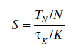

Thus, when a separate simulation (in addition to the one for the observed sample path) is used to generate a sample path under a new value of the parameter of interest, the computation time per event is *TN*/*N*. If, instead, we use a concurrent simulation method in conjunction with the observed path, no such separate simulation is necessary, but the additional time per event imposed by the approach is τ*K*/*K*, where *K* ≤ *N* in general. Clearly, *S* ≥ 1 is required to justify the use of concurrent simulation.

Таким чином, коли окреме моделювання (на додаток до моделі для спостережуваного шляху вибірки) використовується для генерації шляху вибірки під новим значенням цікавого параметра, час обчислення на подію становить *TN*/*N*. Якщо натомість ми використовуємо метод паралельного моделювання в поєднанні з спостережуваним шляхом, таке окреме моделювання не потрібне, але додатковий час на подію, що накладається підходом, становить τ*K*/*K*, де *K* ≤ * N* загалом. Очевидно, що *S* ≥ 1 необхідний для виправдання використання одночасного моделювання.

Speedup factors resulting from the use of the TWA for various queueing systems are extensively investigated in the work by Cassandras and Panayiotou4 where the following upper bound is also derived:

Коефіцієнти прискорення в результаті використання TWA для різних систем масового обслуговування детально досліджуються в роботі Кассандраса та Панайотоу4, де також отримано наступну верхню межу:

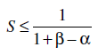

where α is the fraction of time used for generating random numbers and variates (0 ≤ α ≤ 1) in the nominal sample path and β = *rN*/*TN* with *rN* being the time taken to write to and read from memory in the TWA, which depends on the number of random variates observed in the nominal sample path and used in the constructed sample path. As a rule of thumb, when we build and execute a simulation model, we can readily measure α; if (1 *−* α) is relatively small, we can immediately deduce a potential speedup benefit through the TWA (the final result will depend on β as well). Furthermore, the work by Cassandras and Panayiotou4 has defined the class of *Regular DES* for which the cardinality of the missing event set |*M*(*n*, *k*)| in Equation 16.11 is bounded by 2 with the potential to achieve higher speedups. This class includes a large family of common systems such as all open and closed Jackson-like queueing networks.3

де α — це частка часу, використаного для генерування випадкових чисел і змінних (0 ≤ α ≤ 1) у номінальному шляху вибірки, а β = *rN*/*TN*, де *rN* — це час, витрачений на запис і зчитування з пам'яті в TWA, яка залежить від кількості випадкових змінних, що спостерігаються в номінальному шляху вибірки та використовуються в побудованому шляху вибірки. Як правило, коли ми будуємо та виконуємо імітаційну модель, ми можемо легко виміряти α; якщо (1 *−* α) є відносно малим, ми можемо негайно зробити висновок про потенційну вигоду від прискорення через TWA (кінцевий результат також залежатиме від β). Крім того, робота Кассандраса та Панайотоу4 визначила клас *регулярного DES*, для якого потужність відсутньої події набору |*M*(*n*, *k*)| у рівнянні 16.11 обмежена 2 з потенціалом досягнення вищих прискорень. Цей клас включає велике сімейство загальних систем, таких як усі відкриті та закриті мережі масового обслуговування типу Джексона.3

### 16.4.4 Extensions of the TWA

To simplify the notation and presentation of the TWA, at the beginning of Section 16.4, we made four assumptions that can be relaxed and still make TWA applicable. In **A1**, we assumed that that the nominal sample path will never go into an absorbing state, or a set of states, for which an event *e* ∈ *E* will never become feasible at any time in the future. This may freeze indefinitely the construction of one or more concurrent sample paths since such a sample path may have *e* in its missing event set; however, *e* will never occur in the future. In situations such as this, assuming some knowledge of the event lifetime distributions, one can use a random number generator to generate the required event lifetimes, thus allowing the construction of all constructed sample paths. A similar situation may arise when an event occurs rarely, which may force the construction of all concurrent sample paths to be suspended waiting for the occurrence of the rare event. In this case, a possible policy would be to use a random number generator to obtain the required lifetime if a constructed sample path is suspended for more than a certain number of observed events.

Щоб спростити нотацію та представлення TWA, на початку розділу 16.4 ми зробили чотири припущення, які можна пом’якшити, але зробити TWA застосовним. У **A1** ми припустили, що номінальний шлях вибірки ніколи не перейде в стан поглинання або набір станів, для яких подія *e* ∈ *E* ніколи не стане можливою в будь-який час у майбутньому . Це може призупинити на невизначений термін побудову одного або кількох паралельних шляхів вибірки, оскільки такий шлях вибірки може мати *e* у наборі відсутніх подій; однак *e* ніколи не зустрічатиметься в майбутньому. У таких ситуаціях, як ця, припускаючи певні знання розподілу тривалості життя події, можна використовувати генератор випадкових чисел для генерації необхідної тривалості життя події, таким чином дозволяючи побудувати всі побудовані шляхи вибірки. Подібна ситуація може виникнути, коли подія трапляється рідко, що може призвести до призупинення побудови всіх паралельних шляхів вибірки в очікуванні появи рідкісної події. У цьому випадку можлива політика полягала б у використанні генератора випадкових чисел для отримання необхідного часу життя, якщо побудований шлях вибірки призупиняється для більш ніж певної кількості спостережуваних подій.

In **A2**, we assumed that changing a parameter from θ0 to some θ ≠ θ0 does not alter the event set *E*. Clearly, if the new event set *Em* is such that *Em* ⊆ *E*, the development and analysis of TWA is not affected. If, on the contrary, *E* ⊂ *Em*, this implies that events required to cause state transitions under θ*m* are unavailable in the observed sample path, which make the application of our algorithm impossible. Notice the similarity of this problem with the one discussed above. In this case, one can introduce *phantom* event sources that generate all the unavailable events as described, for example, in the work by Cassandras and Shi,15 provided that the lifetime distributions of these events are known.

У **A2** ми припустили, що зміна параметра з θ0 на деяке θ ≠ θ0 не змінює набір подій *E*. Зрозуміло, що якщо новий набір подій *Em* такий, що *Em* ⊆ *E*, це не впливає на розробку та аналіз TWA. Якщо, навпаки, *E* ⊂ *Em*, це означає, що події, необхідні для виклику переходів станів під θ*m*, недоступні в спостережуваному шляху вибірки, що робить застосування нашого алгоритму неможливим. Зверніть увагу на схожість цієї проблеми з розглянутою вище. У цьому випадку можна ввести *фантомні* джерела подій, які генерують усі недоступні події, як описано, наприклад, у роботі Кассандраса та Ши,15 за умови, що відомі розподіли цих подій протягом життя.

In **A3**, we assumed that changing a parameter from θ0 to some θ*m* ≠ θ0 does not affect the distribution of one or more event lifetime sequences. This assumption is used in Equation 16.12 where the observed lifetime *vi* (*sn* + 1) is directly suffix-added to the sequence **V** *i* (*n* + 1, *k* ). Note that this problem can be overcome by transforming observed lifetimes **V***i* = {*vi*(1), *vi*(2), …} with an underlying distribution *Gi*(θ0) into samples of a similar sequence corresponding to the new distribution *Gi*(θ*m*) and then suffix-add them in **V** (*n* + 1, *k* ). This is indeed possible, if *Gi*(θ0), *Gi*(θ*m*) are known, at the expense of some additional computational cost for this transformation (e.g., see the work by Cassandras and Lafortune3). One interesting special case arises when the parameter of interest is a scale parameter of some event lifetime distribution (e.g., it is the mean of a distribution in the Erlang family). Then, simple rescaling suffices to transform an observed lifetime *vi* under θ0 into a new lifetime

У **A3** ми припустили, що зміна параметра від θ0 до деякого θ*m* ≠ θ0 не впливає на розподіл однієї чи кількох подій. Це припущення використовується в рівнянні 16.12, де спостережуваний час життя *vi* (*sn* + 1) безпосередньо додається суфіксом до послідовності **V** *i* (*n* + 1, *k*). Зауважте, що цю проблему можна подолати шляхом перетворення спостережуваних часів життя **V***i* = {*vi*(1), *vi*(2), …} з основним розподілом *Gi*(θ0) у вибірки подібну послідовність, що відповідає новому розподілу *Gi*(θ*m*), а потім додайте їх із суфіксом у **V** (*n* + 1, *k*). Це справді можливо, якщо відомі *Gi*(θ0), *Gi*(θ*m*) за рахунок деяких додаткових обчислювальних витрат на це перетворення (наприклад, див. роботу Кассандраса та Лафортуна3). Один цікавий особливий випадок виникає, коли цікавий параметр є масштабним параметром деякого розподілу тривалості події (наприклад, це середнє значення розподілу в родині Ерланга). Тоді простого масштабування достатньо, щоб перетворити спостережуваний час життя *vi* під θ0 у новий час життя

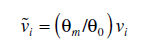

Finally, in principle, one can also relax assumption **A4** and record all observed lifetimes not only based on the associated event but also based on the state in which they have been activated. Computationally, this is feasible. However, depending on the state spaces of the nominal and constructed sample paths, it is likely that the aforementioned “tricks” with *phantom* event sources will be required more frequently. A similar situation may arise if the underlying STA allows probabilistic state transition mechanisms. In this case, the state transitions should also be recorded on a per-state basis unless the state transition mechanism has a structure that can be exploited such that “event matching” is again adequate. For example, consider a system with two parallel FIFO queues with infinite capacity where an arriving customer enters queue 1 with probability *p* or queue 2 with probability 1 − *p*. Let (*x*1, *x*2) denote the state of the system where *xi*, *i* ∈ {1, 2} is the length of each queue. In the event of a customer arrival, the new state will become (*x*1 + 1, *x*2) with probability *p* and (*x*1, *x*2 + 1) with probability 1 − *p*. In this case, the state transition probabilities have a structure that is independent of the current state; thus, one can exploit this and use the observed outcomes irrespective of the current state. Consequently, event matching is no longer necessary.

Нарешті, в принципі, можна також послабити припущення **A4** і записати всі спостережувані періоди життя не тільки на основі пов’язаної події, але й на основі стану, в якому вони були активовані. З обчислювальної точки зору це можливо. Однак, залежно від просторів станів номінального та побудованого шляхів вибірки, ймовірно, що вищезазначені «трюки» з *фантомними* джерелами подій будуть потрібні частіше. Подібна ситуація може виникнути, якщо базовий STA допускає ймовірнісні механізми переходу стану. У цьому випадку переходи станів також слід реєструвати на основі кожного стану, якщо тільки механізм переходу станів не має структуру, яка може бути використана так, щоб «відповідність подій» знову була адекватною. Наприклад, розглянемо систему з двома паралельними чергами FIFO з нескінченною ємністю, де прибулий клієнт потрапляє в чергу 1 з імовірністю *p* або чергу 2 з імовірністю 1 − *p*. Нехай (*x*1, *x*2) позначає стан системи, де *xi*, *i* ∈ {1, 2} є довжиною кожної черги. У разі приходу клієнта новий стан стане (*x*1 + 1, *x*2) з імовірністю *p* і (*x*1, *x*2 + 1) з імовірністю 1 − * p*. У цьому випадку ймовірності переходу стану мають структуру, яка не залежить від поточного стану; таким чином, можна використовувати це та використовувати спостережувані результати незалежно від поточного стану. Отже, зіставлення подій більше не потрібне.

[16.3 <--- ](16_3.md) [   Зміст   ](README.md) [--> 16.5](16_5.md)