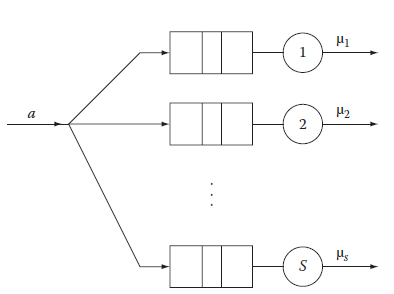
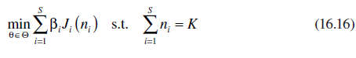
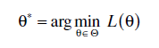
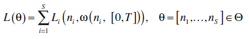
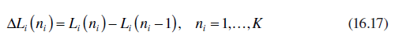
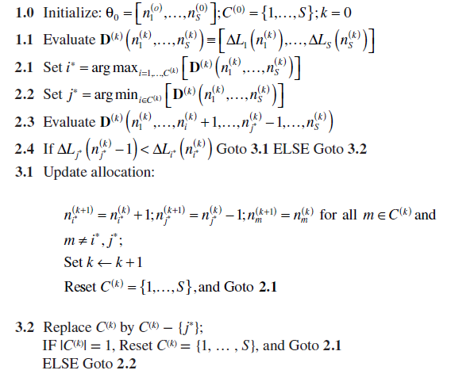
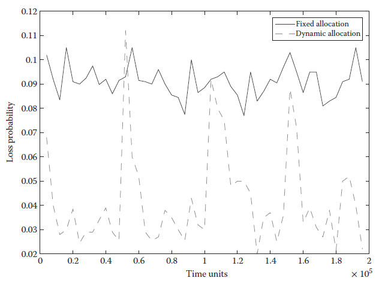
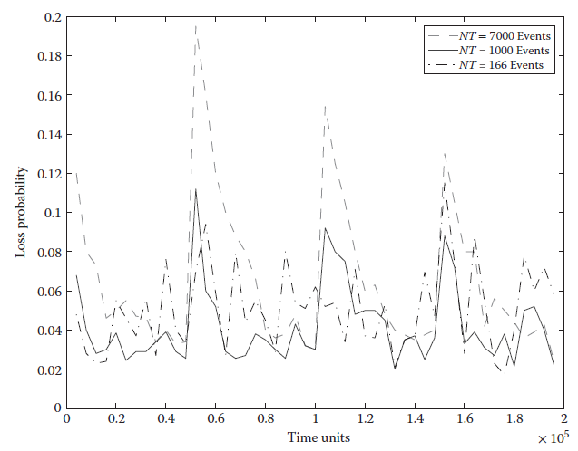

[16.4 <--- ](16_4.md) [   Зміст   ](README.md) [--> 16.6](16_6.md)

## 16.5. USE OF TWA FOR REAL-TIME OPTIMIZATION

In this section, we present an example where the TWA is used together with a real- time controller that controls the buffers allocated to different processes. Specifically, we consider the system shown in Figure 16.3 where customers arrive according to some distribution Ga(·) (generally unknown and possibly time varying) and are probabilistically routed to one of the S available servers. The routing probabilities pi(t), i = 1, … , S, may also be unknown and time varying. Each customer, once assigned to a server, immediately proceeds to the corresponding finite capacity queue where, if there is available space, it waits using a FIFO discipline to receive service from the server. If no buffering space is available, the customer is considered blocked. 

У цьому розділі ми представляємо приклад, коли TWA використовується разом із контролером реального часу, який контролює буфери, призначені для різних процесів. Зокрема, ми розглядаємо систему, показану на малюнку 16.3, де клієнти надходять згідно з деяким розподілом Ga(·) (загалом невідомим і, можливо, змінним у часі) і ймовірнісно направляються на один із доступних серверів S. Імовірності маршрутизації pi(t), i = 1, …, S, також можуть бути невідомими та змінюватися в часі. Кожен клієнт, після призначення серверу, негайно переходить до відповідної черги обмеженої ємності, де, якщо є вільний простір, він чекає, використовуючи дисципліну FIFO, щоб отримати послугу від сервера. Якщо буферне місце недоступне, клієнт вважається заблокованим.

 

FIGURE 16.3 Queueing system with S parallel servers.

Furthermore, the time taken to service a customer at server i is according to some distribution Gd,i(·), i = 1, … , S. In this context, we assume that there are K available buffers that must be allocated to the S servers (and can be freely reallocated to any server) to minimize some metric such as the blocking probability (the probability that a customer that is assigned to a server will find the corresponding buffer full). In other words, we are interested in solving the following optimization problem:

Крім того, час, витрачений на обслуговування клієнта на сервері i, відповідає деякому розподілу Gd,i(·), i = 1, …, S. У цьому контексті ми припускаємо, що існує K доступних буферів, які повинні бути призначені для серверів S (і можуть бути вільно перерозподілені на будь-який сервер), щоб мінімізувати деякі показники, наприклад ймовірність блокування (ймовірність того, що клієнт, який призначений серверу, знайде відповідний буфер заповненим). Іншими словами, ми зацікавлені у вирішенні наступної задачі оптимізації:

where 1 ≤ ni ≤ K − S + 1 is the number of buffer units assigned to server i, Ji(ni) is the blocking probability at queue i when allocated ni buffer units, θ = [n1, … , ns] is an allocation vector and Θ is the set of all feasible allocation vectors. Finally, βi is a weight associated with server i, but for simplicity, we will assume βi = 1 for all i.

де 1 ≤ ni ≤ K − S + 1 — це кількість буферних одиниць, призначених серверу i, Ji(ni) — це ймовірність блокування в черзі i при виділенні ni  буферні одиниці, θ = [n1, …, ns] — вектор розподілу, а Θ — набір усіх можливих векторів розподілу. Нарешті, βi — це вага, пов’язаний із сервером i, але для простоти ми припустимо, що βi = 1 для всіх i.

Typically, one is interested in solving Equation 16.16 when Ji(ni) is of the form of an expectation Ji(ni) = E [Li(ni, ω(ni, [T1, T2]))] where Li(ni, ω(ni, [T1, T2])) is a sample blocking probability observed at the system during the interval [T1, T2]. In general, there exists no closed-form solution for Ji(ni) unless the system is driven by Poisson arrivals and exponential service times, all with known rates as well as known routing probabilities. Thus, a possible approach to solve this problem is to make an initial allocation θ0 and observe the sample path of the system over the interval [0, T ] (where T is a predefined period). Using the information extracted from the observed sample path, one can compute the sample performance metrics Li(·), i = 1, … , S for the allocation θ0 and use TWA to construct the sample paths for all other allocations θ ∈ Θ − {θ0} and from them compute the corresponding sample performance functions. Consequently, at t = T, the controller can determine the allocation

Як правило, хтось зацікавлений у розв’язанні рівняння 16.16, коли Ji(ni) має форму сподівання Ji(ni) = E [Li(ni, ω(ni) , [T1, T2]))], де Li(ni, ω(ni, [T1, T2])) — спостережувана ймовірність блокування вибірки в системі протягом інтервалу [T1, T2]. Загалом, не існує закритого рішення для Ji(ni), якщо система не керується пуассонівськими надходженнями та експоненціальним часом обслуговування, усі з відомими швидкостями, а також відомими ймовірностями маршрутизації. Таким чином, можливий підхід до вирішення цієї проблеми полягає в тому, щоб зробити початковий розподіл θ0 і спостерігати шлях вибірки системи протягом інтервалу [0, T] (де T — попередньо визначений період). Використовуючи інформацію, отриману з спостережуваного шляху вибірки, можна обчислити показники продуктивності вибірки Li(·), i = 1, …, S для розподілу θ0 і використовувати TWA для побудови шляхів вибірки для всіх інших розподіли θ ∈ Θ − {θ0} і з них обчислити відповідні вибіркові функції продуктивності. Отже, при t = T контролер може визначити розподіл

where

Before proceeding any further, it is instructive to comment on an underlying assumption and two important parameters of the proposed optimization approach, namely, the length of the observation interval T and the cardinality of the set Θ. Note that the optimization approach uses data collected in the interval [0, T] to make buffer assignments that will be valid for t > T or, more precisely, for the interval [T, 2T]. Thus, the underlying assumption is that the future behavior of the system will be very similar to its past behavior. In other words, this approach is applicable to systems where the input stochastic processes that drive the system dynamics (in this example, the routing probabilities pi(t), i = 1, … , S) change slowly compared to the observation interval T. Regarding the observation interval, its actual value depends on the variance of the input and output stochastic processes. If set too short, then the obtained performance metrics may be too noisy and, as a result, the controller may pick random allocations. On the contrary, T should not be set too large because the underlying assumption mentioned earlier may not be valid: if T is set too large and the behavior of the system has changed over time, then this will not be detected fast enough, and thus, the system may continue to operate at suboptimal allocations.

Перш ніж продовжувати далі, доцільно прокоментувати основне припущення та два важливі параметри запропонованого підходу до оптимізації, а саме довжину інтервалу спостереження T та потужність набору Θ. Зверніть увагу, що підхід до оптимізації використовує дані, зібрані в інтервалі [0, T], для призначення буферів, які будуть дійсними для t > T або, точніше, для інтервалу [T, 2T ]. Таким чином, основне припущення полягає в тому, що майбутня поведінка системи буде дуже схожою на її минулу поведінку. Іншими словами, цей підхід застосовний до систем, де вхідні стохастичні процеси, що керують динамікою системи (у цьому прикладі ймовірності маршрутизації pi(t), i = 1, …, S) змінюються. повільно порівняно з інтервалом спостереження T. Що стосується інтервалу спостереження, то його фактичне значення залежить від дисперсії вхідних і вихідних випадкових процесів. Якщо встановлено занадто короткий, то отримані показники продуктивності можуть бути занадто шумними, і, як наслідок, контролер може вибрати випадковий розподіл. Навпаки, T не слід встановлювати занадто великим, тому що базове припущення, згадане раніше, може бути недійсним: якщо T встановлено занадто великим і поведінка системи змінилася з часом, це не буде виявлено швидко достатньо, і, таким чином, система може продовжувати працювати з неоптимальним розподілом.

Regarding the cardinality of Θ, one can easily notice that it can become very large, which may cause computational problems due to the large number of sample paths that must be constructed. For the above example, the number of feasible allocations is O æ (K + S 1)!ö. To alleviate the computational problem, one may resort to various  ç K !(S 1)! ÷ø  optimization approaches taking advantage of some properties of the cost function. For the above example, we know that Ji(ni) is decreasing and convex; thus, one may use “gradient”-based optimization approaches. In this case, we use finite differences together with a discrete resource allocation approach,16 which is briefly summarized below to reduce the number of constructed sample paths from O æ (K + S 1)!ö  ç K !(S 1)! ÷ø to only S + 2. The idea of the discrete optimization approach is rather simple: at every step, it reallocates a resource (buffer) from the least “sensitive” server to the most sensitive one where sensitivity is defined as

Що стосується потужності Θ, можна легко помітити, що вона може стати дуже великою, що може спричинити обчислювальні проблеми через велику кількість вибіркових шляхів, які необхідно побудувати. Для наведеного вище прикладу кількість можливих розподілів дорівнює O æ (K + S 1)!ö. Щоб полегшити обчислювальну проблему, можна вдатися до різних ç K !(S 1)! ÷ø підходи до оптимізації з використанням деяких властивостей функції витрат. Для наведеного вище прикладу ми знаємо, що Ji(ni) спадає і опуклий; таким чином, можна використовувати «градієнтні» підходи до оптимізації. У цьому випадку ми використовуємо кінцеві різниці разом із підходом дискретного розподілу ресурсів,16 який коротко підсумовано нижче, щоб зменшити кількість побудованих шляхів вибірки з O æ (K + S 1)!ö ç K  !(S 1)! ÷ø до лише S + 2. Ідея підходу дискретної оптимізації досить проста: на кожному кроці він перерозподіляє ресурс (буфер) від найменш «чутливого» сервера до найбільш чутливого, де чутливість визначається як

Below are the detailed steps of the algorithm: Algorithm: Dynamic Resource Allocation

 

When the system operates under a nominal allocation, one can obtain estimates of Li(ni) while concurrent estimators can provide estimates for Li(ni − 1); thus, the vector D(k) (·) with all finite differences can be computed in step 1.1. Steps 2.1 and 2.2 determine the servers with the maximum and minimum finite differences i and j, respectively. Step 2.3 reevaluates the finite differences after a resource is reallocated from the least sensitive j to the most sensitive i. If the removal of the resource does not make j the most sensitive buffer, the reallocation is accepted in step 3.1, otherwise it is rejected in step 3.2.

Коли система працює з номінальним розподілом, можна отримати оцінки Li(ni), тоді як паралельні оцінювачі можуть надати оцінки для Li(ni − 1); таким чином, вектор D(k) (·) з усіма кінцевими різницями може бути обчислений на кроці 1.1. Кроки 2.1 і 2.2 визначають сервери з максимальними і мінімальними кінцевими різницями i і j відповідно. Крок 2.3 повторно оцінює кінцеві різниці після перерозподілу ресурсу з найменш чутливого j до найбільш чутливого i. Якщо видалення ресурсу не робить j найбільш чутливим буфером, перерозподіл приймається на кроці 3.1, інакше воно відхиляється на кроці 3.2.

Next, we consider a numerical example with S = 4 and K = 16. We assume that the arrival process is Poisson with rate λ = 1.3, and all service times (at any server) are exponential with rates µi = 1.0 for all i = 1, … , 4. At this point, we emphasize that the controller does not know anything about either the arrival or the service processes. Furthermore, we assume that the routing probabilities are also unknown to the controller and are time varying. Specifically, the routing probabilities change every 50,000 time units as given in Table 16.1.

Далі ми розглянемо числовий приклад із S = 4 і K = 16. Ми припускаємо, що процес надходження є пуассонівським зі швидкістю λ = 1,3, а всі часи обслуговування (на будь-якому сервері) є експоненціальними зі ставками µi = 1,0 для всіх i = 1, … , 4. На цьому етапі ми підкреслюємо, що контролер нічого не знає ні про прибуття, ні про процеси обслуговування. Крім того, ми припускаємо, що ймовірності маршрутизації також невідомі контролеру та змінюються в часі. Зокрема, ймовірності маршрутизації змінюються кожні 50 000 одиниць часу, як зазначено в таблиці 16.1.

[Figure 16.4 ](#_bookmark94)presents the performance (loss probability) of the real-time controller (i.e., the dynamic resource allocation algorithm) in comparison to a static policy. Because of symmetry, the static optimal allocation is [4, 4, 4, 4], which achieves a loss probability between 0.08 and 0.1 for the entire simulation interval. As shown in the figure, the real-time controller can significantly improve the overall system performance since the real-time simulation components can “detect” the overloaded buffer and allocate more resources to it, thus reducing the overall loss probability. Initially, the controller adjusts the buffers such that the loss probability is between 0.02 and 0.04. At time 0.5 × 105, the routing probabilities change abruptly, and thus, the loss probability significantly increases; however, as seen in the figure, the real-time controller quickly reallocates the buffers and the loss probability is again reduced. Similar behavior occurs every time the routing probabilities change.

[Малюнок 16.4 ](#_bookmark94) представляє продуктивність (ймовірність втрати) контролера реального часу (тобто алгоритму динамічного розподілу ресурсів) у порівнянні зі статичною політикою. Через симетрію статичний оптимальний розподіл становить [4, 4, 4, 4], що забезпечує ймовірність втрати від 0,08 до 0,1 для всього інтервалу моделювання. Як показано на малюнку, контролер реального часу може значно покращити загальну продуктивність системи, оскільки компоненти моделювання в реальному часі можуть «виявляти» перевантажений буфер і виділяти йому більше ресурсів, таким чином зменшуючи загальну ймовірність втрати. Спочатку контролер регулює буфери так, щоб імовірність втрати становила від 0,02 до 0,04. У момент часу 0,5 × 105 ймовірності маршрутизації різко змінюються, і, таким чином, ймовірність втрати значно зростає; однак, як видно на малюнку, контролер реального часу швидко перерозподіляє буфери, і ймовірність втрати знову зменшується. Подібна поведінка відбувається щоразу, коли змінюються ймовірності маршрутизації.

In [Figure 16.5](#_bookmark94), we also investigate the effect of the observation interval. The scenario investigated is identical to the one presented earlier. The only difference is the length of the observation interval T. In this experiment, we assume that the controller updates the allocation vector every NT observed events (here we use NT instead of T to indicate that the interval is determined by the number of events rather than time units). The figure presents the results for three different values of NT. As indicated in the figure, when NT is too large (NT = 7000), the controller does not capture the change in the routing probabilities, and as a result, it leaves the system operating at suboptimal allocations for long periods of time seriously degrading the overall system performance. On the contrary, when the observation interval is fairly short (NT = 166), the obtained estimates are fairly noisy, and as a result, the controller often makes “wrong” decisions, which also leads to poor performance.

На [Рис. 16.5] (#_bookmark94) ми також досліджуємо вплив інтервалу спостереження. Досліджений сценарій ідентичний представленому раніше. Єдина відмінність полягає в довжині інтервалу спостереження T. У цьому експерименті ми припускаємо, що контролер оновлює вектор розподілу кожні NT спостережуваних подій (тут ми використовуємо NT замість T, щоб вказати, що інтервал визначається кількістю подій, а не ніж одиниці часу). На рисунку представлені результати для трьох різних значень NT. Як показано на малюнку, коли NT є занадто великим (NT = 7000), контролер не фіксує зміни в ймовірності маршрутизації, і, як наслідок, він залишає систему працювати з неоптимальним розподілом протягом тривалих періодів часу, серйозно погіршуючи якість загальна продуктивність системи. Навпаки, коли інтервал спостереження досить короткий (NT = 166), отримані оцінки є досить шумними, і, як наслідок, контролер часто приймає «неправильні» рішення, що також призводить до поганої продуктивності.

 TABLE 16.1  Routing Probabilities

| From    | To      | Distribution              |
| ------- | ------- | ------------------------- |
| 0       | 50,000  | p1 = [0.7, 0.1, 0.1, 0.1] |
| 50,000  | 100,000 | p2 = [0.1, 0.7, 0.1, 0.1] |
| 100,000 | 150,000 | p3 = [0.1, 0.1, 0.7, 0.1] |
| 150,000 | 200,000 | p4 = [0.1, 0.1, 0.1, 0.7] |

FIGURE 16.4 System performance under the dynamic allocation scheme versus a fixed resource allocation vector.

FIGURE 16.5 System performance under different observation intervals.

[16.4 <--- ](16_4.md) [   Зміст   ](README.md) [--> 16.6](16_6.md)