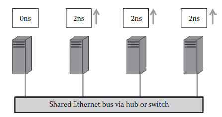
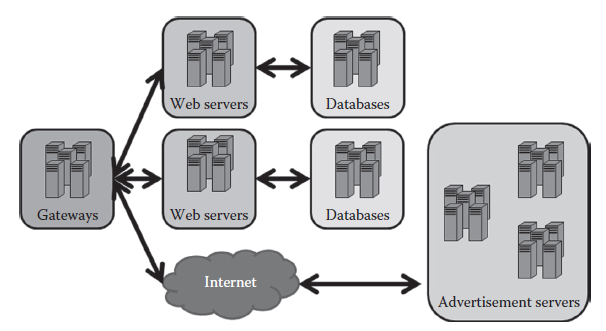

[17.2 <--- ](17_2.md) [   Зміст   ](README.md) [--> 17.4](17_4.md)

## 17.3. MOTIVATING SCENARIOS

To provide a solid motivation for time dilation and simulation of large-scale systems in general, this section presents several testing scenarios that require scalable and sound validation techniques. These examples focus on system environments where the computer infrastructure is mission-critical. Before we deploy large-scale mission-critical computer systems, it is essential to accurately simulate such systems in a smaller, less critical infrastructure where typical functional and performance problems can be observed, analyzed, and ultimately resolved before production deployment occurs. 

Щоб забезпечити надійну мотивацію для уповільнення часу та моделювання великомасштабних систем загалом, у цьому розділі представлено кілька сценаріїв тестування, які вимагають масштабованих та надійних методів перевірки. Ці приклади зосереджені на системних середовищах, де комп’ютерна інфраструктура є критично важливою. Перед розгортанням великомасштабних критично важливих комп’ютерних систем важливо точно змоделювати такі системи в меншій, менш критичній інфраструктурі, де типові функціональні проблеми та проблеми з продуктивністю можна спостерігати, аналізувати та остаточно вирішувати до розгортання виробництва.

We first discuss a smaller situation (connecting two computers together) and specifically look into a phenomenon known as the Ethernet Capture Effect [2,3] that can manifest itself when connecting just two computers together, at least one of which is constantly sending information over an Ethernet connection. To identify the Ethernet Capture Effect during simulation requires the simulator adhering closely to actual performance on a target architecture. We next review Application Services, which are collections of interdependent systems, such as database servers, front end servers, etc. We then expand the second scenario to include collections of such services, which is our targeted large-scale scenario. We refer to these three motivating scenarios when discussing the capacities and capabilities of modeling or simulation techniques.

Спочатку ми обговорюємо меншу ситуацію (з’єднання двох комп’ютерів разом) і окремо розглядаємо явище, відоме як ефект захоплення Ethernet [2,3], який може проявлятися при з’єднанні лише двох комп’ютерів, принаймні один із яких постійно надсилає інформацію через підключення Ethernet. Для виявлення ефекту захоплення Ethernet під час моделювання потрібно, щоб симулятор чітко дотримувався фактичної продуктивності цільової архітектури. Далі ми розглядаємо Служби додатків, які є наборами взаємозалежних систем, таких як сервери баз даних, передні сервери тощо. Потім ми розширюємо другий сценарій, щоб включити колекції таких служб, що є нашим цільовим великомасштабним сценарієм. Ми посилаємося на ці три мотиваційні сценарії, коли обговорюємо потужності та можливості методів моделювання або симуляції.

### 17.3.1 Ethernet Capture Eff ect

The Ethernet Capture Effect [2,3] is a form of emergent misbehavior that plagued system integrators during the 1990s and caused unfairness in a networking system once Ethernet hardware became fast enough to support resend frequencies that approached optimal speeds indicated in the Ethernet protocol standard. Though specific to Ethernet, similar problems during integration and scaling can occur with any other system with a shared bus. To replicate this behavior requires just two hosts, both of which send information frequently.

Ефект захоплення Ethernet (Ethernet Capture Effect) [2, 3] — це форма невідповідної поведінки, яка переслідувала системних інтеграторів у 1990-х роках і викликала несправедливість у мережевій системі, коли апаратне забезпечення Ethernet стало достатньо швидким, щоб підтримувати частоти повторного надсилання, які наближалися до оптимальних швидкостей, зазначених у стандарті протоколу Ethernet. Хоча подібні проблеми під час інтеграції та масштабування є специфічними для Ethernet, можуть виникнути в будь-якій іншій системі зі спільною шиною. Щоб відтворити цю поведінку, потрібні лише два хости, обидва з яких часто надсилають інформацію.

During the 1990s, when a collision occurred between Ethernet connected hosts, all hosts involved in the collision would randomly generate a back-off time to allow the selection of a winner to send information across the Ethernet. The winner of this contest for the shared resource would have its back-off timer reset, while the loser or losers of this contest would essentially accumulate back-off timers until they successfully sent information.

У 1990-х роках, коли між хостами, підключеними до Ethernet, виникала колізія, усі хости, залучені до конфлікту, випадково генерували час відстрочки, щоб дозволити вибрати переможця для надсилання інформації через Ethernet. Переможець цього конкурсу для спільного ресурсу матиме скинутий таймер відстрочки, тоді як переможець або програші цього змагання фактично накопичуватимуть таймери відстрочки, поки вони успішно не надіслать інформацію.

The problem of the Ethernet Capture Effect manifested itself when the winner of these contests had a distinct amount of information to send and the Ethernet hardware was fast enough to allow for the winner to send its next information immediately (see Figure 17.1 for losing hosts increasing their back-off timers).

Проблема ефекту захоплення Ethernet виявлялася, коли переможець цих змагань мав певний обсяг інформації для надсилання, а апаратне забезпечення Ethernet було достатньо швидким, щоб дозволити переможцю негайно надіслати свою наступну інформацію (див. Малюнок 17.1 для програшів хостів, що збільшують їх таймери відключення).

**FIGURE 17.1** Example of the Ethernet Capture Effect in a four host system where one host is publishing constantly and three hosts are being forced to increase their back-offs indefinitely to avoid collisions. This race condition occurred despite extensive modeling of the Ethernet protocol and decades of practical use.

**МАЛЮНОК 17.1** Приклад ефекту захоплення Ethernet у системі з чотирма хостами, де один хост постійно публікує, а три хости змушені збільшувати відставання на невизначений термін, щоб уникнути конфліктів. Ця конкуренція мала місце, незважаючи на широке моделювання протоколу Ethernet і десятиліття практичного використання.

Since its timer had been reset, this host or service would be allowed to win each contest, indefinitely, while the losing hosts would be essentially starved until the winning process or service finished. If the winning process never died, the starvation would be indefinite or last until a developer or technician reset the nodes involved.

Оскільки його таймер було скинуто, цьому хосту або службі було б дозволено вигравати кожне змагання на невизначений термін, тоді як хости, що програли, були б по суті голодними, доки не завершиться переможний процес або служба. Якби процес перемоги ніколи не припинявся, голодування було б безстроковим або тривало б до тих пір, поки розробник або технік не скине задіяні вузли.

Ethernet had been modeled extensively before the problem became apparent. Moreover, Ethernet devices had been in service for decades before the Ethernet Capture Effect manifested itself in any type of scale. The protocol had been standardized and validated by thousands of users across the world, but small increases in hardware capabilities caused this emergent misbehavior to cripple previously functioning networks or integrations between seemingly compatible Ethernet networks of services, processes, and hosts.

Ethernet було широко змодельовано до того, як проблема стала очевидною. Крім того, пристрої Ethernet використовувалися десятиліттями до того, як ефект захоплення Ethernet проявився в будь-якому масштабі. Протокол був стандартизований і підтверджений тисячами користувачів у всьому світі, але незначне збільшення апаратних можливостей призвело до того, що ця нова неправильна поведінка пошкодила раніше функціонуючі мережі або інтеграцію між, здавалося б, сумісними мережами Ethernet служб, процесів і хостів.

The Ethernet Capture Effect represents emergent behaviors that should be caught during simulation on a testbed before deployment. If a simulator cannot catch such behaviors, major problems could manifest themselves in the production deployments. Time dilation does not solve this issue. Instead, the Ethernet Capture Effect scenario is presented as a potential motivator of future work.

Ефект захоплення Ethernet представляє аварійну поведінку, яка повинна бути виявлена під час моделювання на випробувальному стенді перед розгортанням. Якщо симулятор не може вловити таку поведінку, серйозні проблеми можуть виникнути у виробничих розгортаннях. Уповільнення часу не вирішує цю проблему. Натомість сценарій Ethernet Capture Effect представлений як потенційний мотиватор майбутньої роботи.

### 17.3.2 Application Services

Amazon, Google, and various other companies maintain thousands of servers providing software services for millions of end users every year. Application Services can range from a dozen to thousands of hosts (see Figure 17.2 for an example of deployment). Though most of these service providers have proprietary networks and systems, there are other open-source auction, e-commerce, and specialty sites for general testing. Many of these proprietary and legacy systems are closed-source, meaning that formal composition methods may not be feasible for most of the utilized systems (e.g., other than a brief description of what the legacy software does, a developer may not be able to completely model much less formally compose the system without the original developer providing the completed formal model).

Amazon, Google та різні інші компанії щороку обслуговують тисячі серверів, що надають програмні послуги мільйонам кінцевих користувачів. Сервіси додатків можуть охоплювати від десятка до тисяч хостів (приклад розгортання див. на малюнку 17.2). Хоча більшість із цих постачальників послуг мають власні мережі та системи, існують інші аукціони з відкритим кодом, сайти електронної комерції та спеціальні сайти для загального тестування. Багато з цих пропрієтарних і застарілих систем є закритими, що означає, що формальні методи композиції можуть бути неможливими для більшості використовуваних систем (наприклад, окрім короткого опису того, що робить застаріле програмне забезпечення, розробник може не мати змоги повністю модель набагато менш формально створює систему без вихідного розробника, який надає завершену формальну модель).

**FIGURE 17.2** Example of a medium-scale Application Service with application gateways communicating over local area connections to web servers and databases. Internet connections can be a large part of Application Services, as depicted by the advertisement servers’ interactions.

**МАЛЮНОК 17.2** Приклад прикладної служби середнього масштабу зі шлюзами додатків, які спілкуються через локальні підключення до веб-серверів і баз даних. З’єднання з Інтернетом можуть становити значну частину Служб додатків, про що свідчить взаємодія серверів реклами.

Consequently, Modelnet, Emulab, or similar simulators can be used to gauge and validate a target Application Service, though simulation technologies such as USSF (see Section 17.2) may require too much modification for the simulation to be accurate enough for validation before deployment.

Отже, Modelnet, Emulab або подібні симулятори можна використовувати для вимірювання та перевірки цільової служби додатків, хоча технології моделювання, такі як USSF (див. Розділ 17.2), можуть вимагати занадто багато модифікацій, щоб моделювання було достатньо точним для перевірки перед розгортанням.

### 17.3.3 Large-Scale Systems

Large-scale systems are complex systems of systems that evolve over time. For the purposes of this chapter, the motivating scenario here is an integration of a dozen or more Application Services into one large-scale system of 2000 nodes and is comprised of heterogeneous hardware and services. Moreover, we envision a large-scale system to have subsystems linked together via a combination of Internet connections and local area networks.

Великомасштабні системи — це складні системи систем, які розвиваються з часом. Для цілей цієї глави мотивуючим сценарієм тут є інтеграція дюжини або більше прикладних служб в одну великомасштабну систему з 2000 вузлів, яка складається з різнорідного апаратного забезпечення та служб. Більше того, ми передбачаємо створення великомасштабної системи, яка матиме підсистеми, пов’язані між собою за допомогою комбінації підключень до Інтернету та локальних мереж.

Consequently, the motivating scenarios presented in this chapter cover simulation needs from a very small network of two to three nodes (e.g., Ethernet Capture Effect) to a medium-sized network of a few dozen nodes (e.g., Application Services) to a large network of thousands of nodes (e.g., large-scale systems). In Section 17.4.2, we show how time dilation can be used to accurately simulate these latter two scenarios by intrinsically maintaining both accuracy and scale. The Ethernet Capture Effect and race conditions like it will require additional refinements to the time dilation simulation process (discussed more in Section 17.4.3).

Отже, мотиваційні сценарії, представлені в цьому розділі, охоплюють потреби моделювання від дуже маленької мережі з двох-трьох вузлів (наприклад, Ethernet Capture Effect) до мережі середнього розміру з кількох десятків вузлів (наприклад, Application Services) і до великої мережі. тисяч вузлів (наприклад, великомасштабні системи). У Розділі 17.4.2 ми показуємо, як уповільнення часу можна використовувати для точного моделювання цих двох останніх сценаріїв шляхом внутрішнього збереження як точності, так і масштабу. Ефект захоплення Ethernet і подібні до нього умови змагання вимагатимуть додаткових уточнень процесу моделювання затримки часу (докладніше про це в розділі 17.4.3).

[17.2 <--- ](17_2.md) [   Зміст   ](README.md) [--> 17.4](17_4.md)