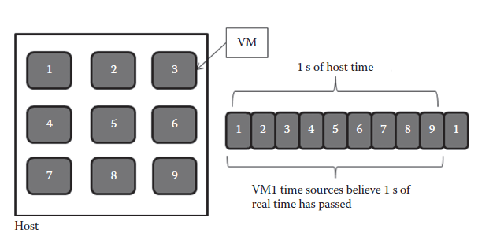
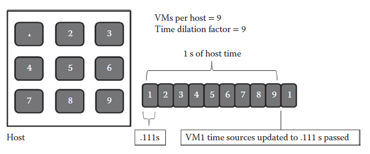
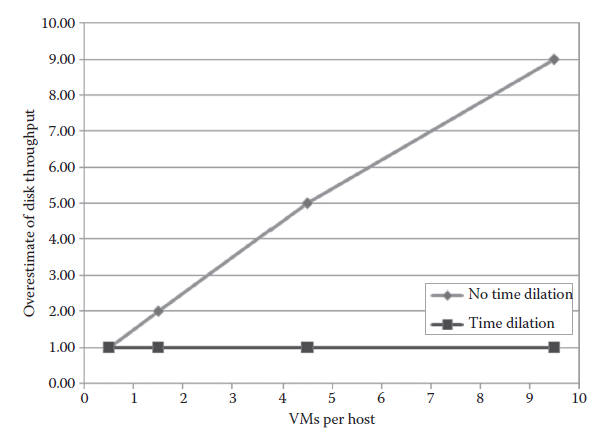

[17.3 <--- ](17_3.md) [   Зміст   ](README.md) [--> 17.5](17_5.md)

## 17.4. APPLYING TIME DILATION WITH DIECAST

Previous sections have examined formal composition and simulation technologies that are being used to approximate and validate large-scale networks. This section expands on these technologies to include descriptions and results of the DieCast simulator system, which is based on the time dilation principle.

У попередніх розділах розглядалися технології формальної композиції та моделювання, які використовуються для апроксимації та перевірки великомасштабних мереж. Цей розділ розширює ці технології, включаючи описи та результати системи симулятора DieCast, яка базується на принципі затримки часу.

### 17.4.1 Overview

#### 17.4.1.1 Time Dilation Factor (TDF) and Scale Factor (SF)

As mentioned in Section 17.1, time dilation has roots in the theory of relativity as the description of a phenomenon where two observers might view each other as having erroneous clocks, even if both clocks are of equivalent scale and construction [5]. In work by Gupta et al. [4,6], time dilation is the process of dividing up real time by the scale of the target system that will be emulated on a particular host. The reasoning for this partitioning is simple. Each host machine will potentially emulate numerous other hosts via VMs in an environment called Xen [23], preferably all requiring the same hardware, resources, and timing mechanisms found on the host machine.

Як згадувалося в Розділі 17.1, уповільнення часу сягає корінням в теорію відносності як опис явища, коли два спостерігачі можуть вважати один одного такими, що мають помилкові годинники, навіть якщо обидва годинники мають еквівалентний масштаб і конструкцію [5]. У роботі Gupta et al. [4, 6], уповільнення часу — це процес поділу реального часу за масштабом цільової системи, яка буде емулюватися на конкретному хості. Обґрунтування такого поділу просте. Кожна хост-машина потенційно буде емулювати численні інші хости через віртуальні машини в середовищі під назвою Xen [23], бажано, щоб усі вимагали того самого апаратного забезпечення, ресурсів і механізмів синхронізації, що й на хост-машині.

A first instinct for emulating nine hosts might be to create nine VMs of the same operating system image and run them with regular system time mechanisms on the testbed hosts. An equivalent to this situation is shown in Figure 17.3. This approach, however, does not emulate the timing of the physical target system because the testing system will be sharing each physical second between the emulated hosts or services, resulting in each VM believing a full second of computational time has passed when the VM was really only able to run for a ninth of that time. This sharing can cause problems in emulation, for example, it can affect throughput to timer firings, sleep statements, etc. Time dilation allows the system developer to adjust the passage of time to more accurately reflect the actual computational time available to each VM. How time dilation affects the simulation of nine VMs on a single host is shown in Figure 17.4.

Першим інстинктом для емуляції дев’яти хостів може бути створення дев’яти віртуальних машин одного образу операційної системи та запуск їх із звичайними механізмами системного часу на тестових хостах. Еквівалент цієї ситуації показано на малюнку 17.3. Цей підхід, однак, не емулює час фізичної цільової системи, оскільки система тестування розподілятиме кожну фізичну секунду між емульованими хостами або службами, у результаті чого кожна віртуальна машина буде вважати, що повна секунда обчислювального часу пройшла, коли віртуальна машина дійсно була здатний бігти лише дев’яту частину цього часу. Такий спільний доступ може спричинити проблеми в емуляції, наприклад, це може вплинути на пропускну здатність для запуску таймера, операторів сну тощо. Зменшення часу дозволяє розробнику системи регулювати плин часу, щоб точніше відображати фактичний обчислювальний час, доступний для кожної віртуальної машини. Як уповільнення часу впливає на симуляцію дев’яти віртуальних машин на одному хості, показано на малюнку 17.4.

SF specifically refers to the number of hosts being emulated, while the TDF refers to the scaling of time. Gupta et al. [6] mentioned that these factors may be set to different values, but for the purpose of experimentation in the paper, TDF and SF are both set to the same values.

SF конкретно стосується кількості хостів, що емулюються, тоді як TDF стосується масштабування часу. Гупта та ін. [6] зазначив, що для цих факторів можуть бути встановлені різні значення, але з метою експерименту в статті TDF і SF встановлені на однакові значення.

**FIGURE 17.3** Most simulators do not modify time sources for virtual machines according to processor time actually used by a virtual machine. This can cause a simulation to drift from actual operation on target hardware because of queuing of timer-related events.

**МАЛЮНОК 17.3** Більшість симуляторів не змінюють джерела часу для віртуальних машин відповідно до процесорного часу, фактично використаного віртуальною машиною. Це може спричинити відхилення симуляції від фактичної роботи цільового обладнання через чергування подій, пов’язаних із таймером.

**FIGURE 17.4** Basics of time dilation. When running nine virtual machines on a single host, programmable interrupt timers, time sources, and other timer-related events for each individual VM should only increment by the amount of processor time used by the VM.

**МАЛЮНОК 17.4** Основи уповільнення часу. Під час запуску дев’яти віртуальних машин на одному хості програмовані таймери переривань, джерела часу та інші пов’язані з таймером події для кожної окремої віртуальної машини мають збільшуватися лише на кількість процесорного часу, який використовується віртуальною машиною.

#### 17.4.1.2 Paravirtualized vs. Fully Virtualized VMs

To accomplish disk input/output emulation, Gupta et al. had to deal with the intricacies of two different types of VMs: paravirtualized and fully virtualized. A paravirtualized VM is a virtualized OS image that was limited to certain flavors of Linux and was soft-emulated on the host. Fully virtualized, in contrast, requires hardware support via Intel Virtualization Technology or AMD Secure VM, but does allow for any operating system image to be emulated directly on the hardware—rather than just a certain type of supported OS.

Щоб виконати емуляцію вводу/виводу диска, Gupta et al. довелося мати справу з тонкощами двох різних типів віртуальних машин: паравіртуалізованих і повністю віртуалізованих. Паравіртуалізована віртуальна машина — це віртуалізований образ ОС, який був обмежений певними варіантами Linux і програмно емулювався на хості. Повна віртуалізація, навпаки, потребує апаратної підтримки через Intel Virtualization Technology або AMD Secure VM, але дозволяє емулювати будь-який образ операційної системи безпосередньо на апаратному забезпеченні, а не лише певний тип підтримуваної ОС.

In their previous work on paravirtualized images [4], Gupta et al. created mechanisms that sat between the disk device driver and the OS, allowing emulation of disk latencies, write times, etc. with time dilation mechanisms. For the fully virtualized model of emulation, Gupta et al. used a disk simulator called DiskSim to emulate a disk drive in memory, which provided more control over buffering of read/write tasks. DiskSim gave the DieCast developer the ability to take the number of VMs into account and partition the read/write queuing accordingly.

У своїй попередній роботі над паравіртуалізованими зображеннями [4] Гупта та ін. створив механізми, які знаходилися між драйвером дискового пристрою та ОС, дозволяючи емулювати затримки диска, час запису тощо за допомогою механізмів уповільнення часу. Для повністю віртуалізованої моделі емуляції Gupta et al. використовував симулятор диска під назвою DiskSim для емуляції дисковода в пам’яті, що забезпечувало більше контролю над буферизацією завдань читання/запису. DiskSim надав розробнику DieCast можливість враховувати кількість віртуальних машин і відповідним чином розділяти чергу читання/запису.

The fully virtualized VM implementations give DieCast users the ability to plug in any operating system into the underlying Xen hypervisor and emulate a functional host according to the time slices allocated to each VM via time dilation. Together with changes to the time sources, CPU scheduling, and network emulation, fully virtualized VMs give developers a lot more options and control over what they are going to be testing and amazing scalability (concerning VMs accurately simulated per host). The divergence of a simulation from the target environment (which we call the “overestimation factor”) without taking time dilation into account is shown in Figure 17.5, which is based on Figure 17.2c from Gupta [6]. This overestimation factor in the simulation is a multiple of the correct target system (i.e., simulating 10 VMs per host results in inaccurate simulation by a factor of 9 on disk throughput). We also experienced this same phenomenon when simulating multiple subscribers and publishers per host in our own testing of the Quality-of-Service (QoS)-Enabled Dissemination (QED) middleware [27].

Повністю віртуалізовані реалізації віртуальної машини дають користувачам DieCast можливість підключати будь-яку операційну систему до основного гіпервізора Xen і емулювати функціональний хост відповідно до часових проміжків, виділених кожній віртуальній машині за допомогою сповільнення часу. Разом зі змінами в джерелах часу, плануванні процесора та емуляції мережі повністю віртуалізовані віртуальні машини дають розробникам набагато більше можливостей і контролю над тим, що вони збираються тестувати, а також дивовижну масштабованість (стосовно віртуальних машин, які точно симулюються для кожного хоста). Розбіжність симуляції від цільового середовища (яку ми називаємо «фактором переоцінки») без урахування затримки часу показано на малюнку 17.5, який базується на малюнку 17.2c від Gupta [6]. Цей коефіцієнт переоцінки в симуляції є кратним правильній цільовій системі (тобто імітація 10 віртуальних машин на хост призводить до неточного моделювання з коефіцієнтом 9 щодо пропускної здатності диска). Ми також зіткнулися з цим самим явищем під час моделювання кількох передплатників і видавців на хост під час нашого власного тестування проміжного програмного забезпечення з підтримкою розповсюдження якості обслуговування (QoS) (QED) [27].

**FIGURE 17.5** Analysis of the overestimation of disk throughput without time dilation versus using CPU and disk time dilation scaling.

#### 17.4.1.3 CPU Scheduling

To implement properly scaled CPU scheduling, Gupta et al. had to intercept and scale a number of time sources appropriately. Timer interrupts (e.g., the Programmable Interrupt Timer), specialized counters (e.g., TSC on Intel platforms), and external time sources (e.g., Network Time Protocol) were intercepted and scaled before being handed to VMs.

Щоб реалізувати належним чином масштабоване планування ЦП, Gupta et al. довелося належним чином перехопити та масштабувати ряд джерел часу. Переривання таймера (наприклад, програмований таймер переривань), спеціалізовані лічильники (наприклад, TSC на платформах Intel) і зовнішні джерела часу (наприклад, мережевий протокол часу) були перехоплені та масштабовані перед передачею віртуальним машинам.

Timing is more intricate, however, than just allotting 1/(time dilation factor) time to each VM. For IO bound VMs, they may not use their full CPU allocation and this could skew the non-IO-bound VM CPU usage upwards and affect all timing dependent aspects of the emulation. Consequently, Gupta et al. devised a credit- based CPU scheduler in Xen to support a debit/credit scheme, where IO-bound VMs could relinquish CPU, but no VM used more than its exact allocated share of a real time unit. If a VM did not use its share before blocking, the VM received a debit to put towards its next time slice, and the CPU scheduler took into account total usage over a second to make sure that non-IO-bound VMs were not monopolizing the CPU and skewing results. 

Тим не менш, хронометраж є складнішим, ніж просто виділення часу 1/(коефіцієнт уповільнення часу) для кожної віртуальної машини. Для віртуальних машин, пов’язаних із введенням-виведенням, вони можуть не використовувати свій повний розподіл ЦП, і це може спотворити використання ЦП віртуальної машини без прив’язки до вводу-виводу та вплинути на всі залежні від часу аспекти емуляції. Отже, Gupta et al. розробив кредитний планувальник процесора в Xen для підтримки дебетової/кредитної схеми, де віртуальні машини з прив’язкою до вводу-виводу могли відмовлятися від ЦП, але жодна віртуальна машина не використовувала більше, ніж її точна виділена частка одиниці реального часу. Якщо віртуальна машина не використовувала свою частку перед блокуванням, віртуальна машина отримувала дебет, щоб покласти його на наступний часовий проміжок, а планувальник ЦП враховував загальне використання протягом секунди, щоб переконатися, що віртуальні машини без зв’язку з вводом-виводом не монополізують ЦП і результати перекосу.

#### 17.4.1.4 Network Emulation

Network emulation in the DieCast implementation is accomplished via capturing all network traffic and routing it through a network emulator. Though Gupta et al. mention that DieCast has been tested with Dummynet, Modelnet, and Netem, all experiments presented in their work used Modelnet as the network emulator. Since time dilation scales time down, emulating network throughput and latency turns out to be a relatively straightforward task (compared to CPU scheduling). To emulate a 1 Gbps network on a scaled host with time dilation factor of 10, the emulator simply ships 100 Mpbs (1/10 that total) to the host within a second. Latencies are easy to mimic also, since each VM is slowed down to 1/10 speed, and consequently, a system requiring 100 μs latency on the target system could be emulated with data arriving every 1 ms.

Емуляція мережі в реалізації DieCast здійснюється шляхом захоплення всього мережевого трафіку та його маршрутизації через емулятор мережі. Хоча Гупта та ін. згадати, що DieCast було протестовано з Dummynet, Modelnet і Netem, усі експерименти, представлені в їхній роботі, використовували Modelnet як емулятор мережі. Оскільки затримка часу зменшує час, емуляція пропускної здатності мережі та затримки виявляється відносно простим завданням (порівняно з плануванням ЦП). Щоб емулювати мережу зі швидкістю 1 Гбіт/с на масштабованому хості з коефіцієнтом уповільнення часу 10, емулятор просто надсилає 100 Мбіт/с (1/10 загальної суми) на хост протягом секунди. Затримки також легко імітувати, оскільки кожна віртуальна машина сповільнюється до 1/10 швидкості, і, отже, систему, яка потребує затримки 100 мкс у цільовій системі, можна емулювати з надходженням даних кожні 1 мс.

Time dilation is a powerful, robust mechanism for network emulation. The first paper on time dilation by Gupta et al. [4] shows how time dilation can even be used to emulate network throughput and speeds that are larger than the network capacity available over a link. As a result, not only can a tester using DieCast simulate ultra high network capacities internal to nodes (e.g., when all VMs are on the same host and the network link is completely emulated), but testers may also scale the number of VMs per host while simultaneously scaling the network capacity between hosts, if required. The key to this ability, once again, is effectively slowing down each VM according to a TDF. If all VMs are operating at that time scale, then the network can be emulated at a factor equal to the TDF.

Уповільнення часу — потужний надійний механізм емуляції мережі. Перша стаття про уповільнення часу Гупта та ін. [4] показує, як уповільнення часу можна навіть використовувати для емуляції пропускної здатності мережі та швидкостей, які перевищують пропускну здатність мережі, доступну через канал. У результаті тестувальник, який використовує DieCast, може не тільки симулювати надвисоку мережеву пропускну здатність вузлів (наприклад, коли всі віртуальні машини знаходяться на одному хості, а мережеве з’єднання повністю емульовано), але тестувальники також можуть масштабувати кількість віртуальних машин на хост. з одночасним збільшенням пропускної здатності мережі між хостами, якщо потрібно. Ключем до цієї здатності знову є ефективне сповільнення кожної віртуальної машини відповідно до TDF. Якщо всі віртуальні машини працюють у цьому масштабі часу, мережу можна емулювати з коефіцієнтом, рівним TDF.

### 17.4.2 Application to Motivating Scenarios

Earlier work has focused on time dilation in two scenarios: scaling network characteristics [4] and validating large-scale applications [6]. In the first paper [4] covering time dilation in networked applications, Gupta et al. scale network bandwidth and response time when needed via time dilation in both CPU and network emulation. This work outlined many results concerning how time dilation brought TCP through- put and response times between a simulated and baseline system into harmony in tests between two machines. These results show that time dilation can accurately simulate traffic characteristics (network capacity, response time, and traffic flows down to the TCP layer). As a first step in reflecting our motivating scenarios, therefore, time dilation can accurately simulate scaling the number of VMs and reflecting a target system when the target system is small—down to 1 to 2 machines if needed.

Попередня робота була зосереджена на уповільненні часу за двома сценаріями: масштабування характеристик мережі [4] та перевірка великомасштабних програм [6]. У першій статті [4], яка охоплює уповільнення часу в мережевих програмах, Gupta et al. масштабувати пропускну здатність мережі та час відповіді, коли це необхідно, за допомогою затримки часу як у процесорі, так і в емуляції мережі. Ця робота окреслила багато результатів щодо того, як уповільнення часу привело пропускну здатність TCP і час відгуку між змодельованою та базовою системами в гармонію під час тестів між двома машинами. Ці результати показують, що затримка часу може точно імітувати характеристики трафіку (ємність мережі, час відгуку та потоки трафіку до рівня TCP). Отже, як перший крок у відображенні наших мотивуючих сценаріїв, уповільнення часу може точно імітувати масштабування кількості віртуальних машин і відображення цільової системи, коли цільова система невелика — до 1-2 машин, якщо потрібно.

On the surface, this would appear to signal that the DieCast implementation of time dilation would be able to mimic the Ethernet Capture Effect, presented in Section 17.3, between two or more Ethernet capable hosts. Ethernet is at a lower OSI layer than TCP, however, and it is unlikely that a race condition like the Ethernet Capture Effect, which is essentially a hardware-related phenomenon that requires ultra fast publication to manifest, will occur when a simulator is slowing down publication rates by splitting processor time between multiple VMs. Consequently, the Ethernet Capture Effect and phenomenon like it demonstrate problems in current time dilation implementations and the need for future work to address low level (e.g., hardware level) race conditions that are difficult to emulate in a software environment.

На перший погляд, це означає, що реалізація DieCast затримки часу зможе імітувати ефект захоплення Ethernet, представлений у розділі 17.3, між двома або більше хостами, що підтримують Ethernet. Однак Ethernet знаходиться на нижчому рівні OSI, ніж TCP, і малоймовірно, що коли симулятор уповільнюється, виникне така ситуація, як ефект захоплення Ethernet, який, по суті, є явищем, пов’язаним з апаратним забезпеченням, для прояву якого потрібна надшвидка публікація. швидкість публікації шляхом розподілу процесорного часу між кількома віртуальними машинами. Отже, ефект захоплення Ethernet і подібне йому явище демонструють проблеми в поточних реалізаціях уповільнення часу та потребу в майбутній роботі для вирішення умов гонки низького рівня (наприклад, рівня апаратного забезпечення), які важко імітувати в програмному середовищі.

In another paper on time dilation, Gupta et al. [4] performed testing in two different types of scenarios: (1) a baseline that is run without time dilation on the actual hardware—40 machines on their testbed—and (2) a scaled version running on much less hardware—usually 4 machines scaled to 40 machines via a TDF of 10 Several types of distributed systems were tested in the papers on time dilation, but we will be focusing on specific tests that reflect our motivating scenarios: RUBiS (an academic tool that resembles an auction site, along with automatable item auctioning, comments, etc.), Isaac (a home-grown Internet service architecture that features load balancers, front end servers, database servers, and clients and application servers), and PanFS (a commercial file system used in clustering environments).

В іншій статті про уповільнення часу Gupta et al. [4] провели тестування за двома різними типами сценаріїв: (1) базовий сценарій, який виконується без затримки часу на фактичному апаратному забезпеченні — 40 машин на їх тестовому стенді — і (2) масштабована версія, що працює на набагато меншому апаратному забезпеченні — зазвичай 4 машини масштабується до 40 машин за допомогою TDF із 10. Кілька типів розподілених систем було протестовано в статтях про уповільнення часу, але ми зосередимося на конкретних тестах, які відображають наші сценарії мотивації: RUBiS (академічний інструмент, який нагадує аукціонний сайт, а також автоматичний аукціон предметів, коментарі тощо), Isaac (власна архітектура Інтернет-сервісу, яка включає балансувальники навантаження, зовнішні сервери, сервери баз даних, а також клієнти та сервери додатків) і PanFS (комерційна файлова система, яка використовується в кластерних середовищах) .

In Ref. [4], Gupta et al. experimented with the DieCast system with TDFs of 10 (meaning that 10 VMs were running per host) and showed the effects of turning off CPU scheduling, disk IO, etc. to see how the system diverged from the actual baseline when time dilation was not applied in each of the time dilation mechanisms. When CPU and disk IO time dilation were turned off, the graphs diverge drastically for all experiments—often deviating by factors of two or more in perceived network throughput, disk IO, etc. These particular results demonstrate problems with using only network emulation to validate target systems—namely that these testbed systems may misrepresent the target systems by not just small error ratios but factors of error. Consequently, this result extends to experiments using Modelnet, Emulab, or other network emulation frameworks while simulating multiple VMs per node with ns, VMWare, Xen, or other systems without time dilation. This differential in network throughput, disk throughput, or latency could mean developers missing emergent behaviors on the testbed that will occur on the actual target hardware.

У посил. [4], Гупта та ін. експериментував із системою DieCast із TDF 10 (що означає, що 10 віртуальних машин було запущено на хост) і показав наслідки вимкнення планування ЦП, дискового вводу-виводу тощо, щоб побачити, як система відхиляється від фактичної базової лінії, коли затримка часу не застосовувалася у кожному з механізмів уповільнення часу. Коли уповільнення часу ЦП і дискового вводу-виводу було вимкнено, графіки різко розходяться для всіх експериментів — часто відхиляючись у два чи більше факторів у сприйнятій пропускній здатності мережі, дисковому вводі-виводу тощо. Ці конкретні результати демонструють проблеми з використанням лише емуляції мережі для перевірки цілі системи, а саме те, що ці тестові системи можуть спотворювати цільові системи не лише малими коефіцієнтами помилок, але й факторами помилок. Отже, цей результат поширюється на експерименти з використанням Modelnet, Emulab або інших фреймворків емуляції мережі під час імітації кількох віртуальних машин на вузол за допомогою ns, VMWare, Xen або інших систем без затримки часу. Ця різниця в пропускній здатності мережі, пропускній здатності диска або затримці може означати, що розробники пропускають аварійну поведінку на тестовому стенді, яка відбуватиметься на фактичному цільовому обладнанні.

The RUBiS [30] completion times for file sharing and auctions on scaled systems closely mirrored the actual baselines for time dilation, while the non-TDF enforced versions of Xen did not. The testing data for RUBiS in particular is abundant with Gupta et al. showing results for CPU usage, memory profiling, throughput, and response times closely mirroring the baseline target system.

Час завершення RUBiS [30] для обміну файлами та аукціонів у масштабованих системах точно віддзеркалював фактичні базові лінії для затримки часу, тоді як версії Xen, які не підтримуються TDF, ні. Дані тестування для RUBiS, зокрема, багаті Gupta et al. відображення результатів щодо використання ЦП, профілювання пам’яті, пропускної спроможності та часу відгуку, точно віддзеркалюючи базову цільову систему.

As the number of user sessions increased to 5000 or more, the deviation by non-time-dilation-scaled systems in response time grew to 5 to 7 times more than the target systems. Moreover, the average requests-per-second was less than half the corresponding statistic on the target system when not using time dilation with only 10 VMs per host. This inaccuracy in messaging throughput means that without time dilation, the simulation was attempting to put the testbed under less than half of the load that would be experienced on the actual target system. The time dilation tests, however, closely approximated both response time and requests-per-second.

Коли кількість сеансів користувача зросла до 5000 або більше, відхилення часу відгуку систем без уповільнення часу зросло в 5-7 разів більше, ніж цільові системи. Крім того, середня кількість запитів за секунду була менше половини відповідної статистики в цільовій системі, якщо не використовувати затримку часу з лише 10 віртуальними машинами на хост. Ця неточність у пропускній здатності обміну повідомленнями означає, що без затримки часу симуляція намагалася поставити тестовий стенд під менше половини навантаження, яке зазнає фактична цільова система. Однак тести на уповільнення часу дуже наближені як до часу відповіді, так і до кількості запитів за секунду.

The more complicated Isaac scenario, consisting of load balancers and multiple tiered layers of hosts and services, not only mimicked low-level metrics such as request completion time, but also resembled the base system on high-level application metrics such as time spent at each tier or stage in the transaction. DieCast also matched target systems closely during IO-bound transactions and CPU-bound ones.

Складніший сценарій Isaac, що складається з балансувальників навантаження та кількох багаторівневих рівнів хостів і служб, не тільки імітував низькорівневі показники, такі як час виконання запиту, але також нагадував базову систему на високорівневих показниках додатків, таких як час, витрачений на кожен рівень або етап транзакції. DieCast також точно відповідав цільовим системам під час транзакцій із прив’язкою до вводу-виводу та транзакцій із прив’язкою до ЦП.

The Isaac scenario also demonstrated the ability of time dilation to approximate target systems in fault situations. The DieCast developers caused failures to occur in the database servers in the Isaac scenario at specific times and compared the baseline performance to the time-dilated and non-time-dilated simulations. Without time dilation, the simulated experiments did not follow the baseline experiments. In addition, when requests through the Isaac system were made more CPU-intensive (generating large amounts of SHA-1 hashes) or more database-intensive (each request caused 100 times larger database access), the time dilation simulation was within 10% deviation of the baseline at all times, while non-dilated ended up requiring 3× more time than the baseline to complete the CPU stress tests.

Сценарій Айзека також продемонстрував здатність уповільнення часу наближати цільові системи в ситуаціях збою. Розробники DieCast викликали збої на серверах баз даних у сценарії Isaac у певний час і порівнювали базову продуктивність із симуляціями із затримкою часу та без затримки часу. Без уповільнення часу змодельовані експерименти не слідували за базовими експериментами. Крім того, коли запити через систему Isaac були більш інтенсивними для ЦП (генерування великої кількості хешів SHA-1) або більш інтенсивними для бази даних (кожен запит викликав у 100 разів більший доступ до бази даних), симуляція затримки часу була в межах 10% відхилення від базової лінії за будь-який час, тоді як для нерозширених знадобилося в 3 рази більше часу, ніж базова лінія, щоб завершити стрес-тести ЦП.

The final tests on the commercial PanFS system showed similar aggregate file throughput to the baseline and also allowed Panasas, the company that makes PanFS, to more accurately test their file system according to target client infrastructures before deployment, which they had not previously been able to do due to their clients having much larger clustering infrastructures than the company had available for testing. While RUBiS and Isaac represent classic application services scenarios, the PanFS results were especially interesting because PanFS is regularly used by clients with thousands of nodes (i.e., large-scale systems). To validate the time dilation work in PanFS, Gupta et al. tested the system on 1000 hosts against time dilation on just 100 hosts and closely mirrored the performance of a deployed system, validating that the PanFS servers were reaching peak theoretical throughput bottlenecks. The PanFS results demonstrate that time dilation may be ready to make the leap to larger testing configurations, perhaps into tens of thousands and hundreds of thousands of target system nodes.

Фінальні тести на комерційній системі PanFS показали схожу сукупну пропускну здатність файлів до базової, а також дозволили Panasas, компанії, яка виробляє PanFS, точніше перевірити свою файлову систему відповідно до цільової клієнтської інфраструктури перед розгортанням, чого вони раніше не могли. завдяки тому, що їхні клієнти мають набагато більшу інфраструктуру кластеризації, ніж компанія була доступна для тестування. Хоча RUBiS і Isaac представляють класичні сценарії служб додатків, результати PanFS були особливо цікаві, оскільки PanFS регулярно використовується клієнтами з тисячами вузлів (тобто великомасштабними системами). Щоб підтвердити роботу з уповільненням часу в PanFS, Gupta et al. перевірив систему на 1000 хостах проти затримки часу лише на 100 хостах і точно відобразив продуктивність розгорнутої системи, підтвердивши, що сервери PanFS досягають максимальної теоретичної пропускної здатності. Результати PanFS демонструють, що уповільнення часу може бути готовим до переходу до більших конфігурацій тестування, можливо, до десятків тисяч і сотень тисяч вузлів цільової системи.

### 17.4.3 Future Work

Though DieCast provides an accurate approximation of a large-scale distributed system, time dilation technologies may mask timing-related race conditions (such as the Ethernet Capture Effect and TCP Nagle algorithm problems noted by Mogul [2]) due to DieCast slowing the entire system down and potentially missing boundary conditions that could have happened, for instance, in between real target timer events (which were instead queued up and fired in quick succession in a time dilation system). One of our motivating scenarios, the Ethernet Capture Effect, may not have been caught by systems using time dilation because by slowing down the Ethernet traffic resend rate of an application (by interrupting its resends to run other VMs), we may have allowed the back-off accumulator to reset. The lesson here is that, despite close approximation of the actual target system, DieCast and time dilation may not help catch all types of race conditions and unexpected emergent behavior. Other simulation solutions may be required to catch these types of lowlevel issues.

Хоча DieCast забезпечує точне наближення великомасштабної розподіленої системи, технології уповільнення часу можуть маскувати умови гонки, пов’язані з синхронізацією (такі як ефект захоплення Ethernet і проблеми алгоритму TCP Nagle, зазначені Mogul [2]), через те, що DieCast уповільнює всю систему. вниз і потенційно відсутні граничні умови, які могли статися, наприклад, між реальними цільовими подіями таймера (які натомість ставилися в чергу та запускалися у швидкій послідовності в системі затримки часу). Один із наших мотивуючих сценаріїв, ефект захоплення Ethernet, можливо, не був уловлений системами, які використовують уповільнення часу, оскільки, уповільнюючи швидкість повторного надсилання трафіку Ethernet програми (перериваючи його повторне надсилання для запуску інших віртуальних машин), ми могли дозволити назад -вимкнений акумулятор для скидання. Урок тут полягає в тому, що, незважаючи на близьке наближення до фактичної цільової системи, DieCast і уповільнення часу можуть не допомогти вловити всі типи умов перегонів і несподівану аварійну поведінку. Для виявлення таких проблем низького рівня можуть знадобитися інші рішення для моделювання.

Gupta et al. admit that DieCast may not be able to reproduce certain race conditions or timing errors in the original services [6]. The system also has no way to scale memory usage or disk storage, and this can be a large limiting factor when a testbed host system is unable to emulate the time dilation factor of the target system (e.g., 100 hosts on the testbed with 4 GB of RAM trying to emulate 1000 hosts each requiring 1 GB of dedicated RAM a piece). Moreover, Gupta et al. appear to arbitrarily set the TDF to 10 for all experiments, noting that they had empirically found this value was the most accurate for their tests. No formal methods or description appear in their work to instruct how others may find the optimal TDF for target systems or the TDF corresponding to the number of simulated processes, the maximum delays expected from IO operations, or any other metric of the system. For time dilation to gain widespread acceptance and usage, this matter of obtaining an appropriate TDF for experiments should be addressed.

Гупта та ін. визнати, що DieCast може бути не в змозі відтворити певні умови перегонів або помилки синхронізації в оригінальних службах [6]. Система також не має можливості масштабувати використання пам’яті або дискового сховища, і це може бути великим обмежуючим фактором, коли хост-система тестового стенда не може емулювати коефіцієнт уповільнення часу цільової системи (наприклад, 100 хостів на тестовому стенді з 4 ГБ). оперативної пам’яті, намагаючись емулювати 1000 хостів, кожен з яких вимагає 1 ГБ виділеної оперативної пам’яті). Крім того, Gupta et al. мабуть, довільно встановили TDF на 10 для всіх експериментів, зазначивши, що вони емпірично виявили, що це значення було найточнішим для їхніх тестів. У їхній роботі немає формальних методів чи описів, які б вказували, як інші можуть знайти оптимальний TDF для цільових систем або TDF, що відповідає кількості змодельованих процесів, максимальним затримкам, очікуваним від операцій введення-виведення, або будь-якому іншому показнику системи. Щоб уповільнення часу отримало широке визнання та використання, слід розглянути питання отримання відповідного TDF для експериментів.

Potential vectors of interest may include augmenting the DiskSim to allow virtualization of memory on disk (possibly by further scaling down of time) to allow for the increased latency of disk drives emulating RAM memory access times. DieCast may also be a good vehicle to implement emergent “signatures” detection algorithms [2] into the testing phases and development cycles of large scale system development.

Потенційні вектори інтересу можуть включати розширення DiskSim, щоб дозволити віртуалізацію пам’яті на диску (можливо, шляхом подальшого зменшення часу), щоб забезпечити збільшення затримки дисків, що емулюють час доступу до пам’яті RAM. DieCast також може бути хорошим засобом для впровадження алгоритмів виявлення нових «сигнатур» [2] на етапах тестування та циклах розробки великомасштабної розробки систем.

[17.3 <--- ](17_3.md) [   Зміст   ](README.md) [--> 17.5](17_5.md)