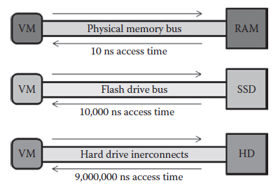

[17.4 <--- ](17_4.md) [   Зміст   ](README.md) [--> 17.6](17_6.md)

## 17.5. ADDRESSING ISSUES OF TIME DILATION IN PHYSICAL MEMORY

Section 17.4 discussed how DieCast can be used to validate large-scale network topologies for production applications. DieCast has built-in support for scaling disk  input/output, networking characteristics, and time sources, but it has no mechanisms for scaling memory. This section, therefore, discusses options available to developers when memory scaling is necessary, including how to determine memory requirements to support scaled experiments and custom modifications that may be made to DieCast or VM managers such as Xen to enable scaling memory. 

У розділі 17.4 обговорювалося, як DieCast можна використовувати для перевірки топології великомасштабної мережі для виробничих програм. DieCast має вбудовану підтримку для масштабування дискового вводу/виводу, мережевих характеристик і джерел часу, але не має механізмів для масштабування пам’яті. Таким чином, у цьому розділі обговорюються варіанти, доступні розробникам, коли потрібне масштабування пам’яті, включно з тим, як визначити вимоги до пам’яті для підтримки масштабованих експериментів і користувацьких модифікацій, які можна внести в DieCast або диспетчери віртуальних машин, такі як Xen, щоб увімкнути масштабування пам’яті.

### 17.5.1 Overview

One aspect of validation that the DieCast implementation of time dilation does not solve is the situation where a host cannot emulate the physical memory required by the user-specified number of VMs per host. Physical memory is a scarce resource, and if it runs out during emulation of the target infrastructure, VM managers like Xen will begin to emulate physical memory using hard drive memory (virtual memory) on the host. Virtual memory is typically set aside from a hard drive, which has orders of magnitude worse fetch time than physical memory.

Одним із аспектів перевірки, який не вирішує реалізація затримки часу DieCast, є ситуація, коли хост не може емулювати фізичну пам’ять, необхідну для визначеної користувачем кількості віртуальних машин на хост. Фізична пам’ять є дефіцитним ресурсом, і якщо вона закінчиться під час емуляції цільової інфраструктури, менеджери віртуальних машин, такі як Xen, почнуть емулювати фізичну пам’ять, використовуючи пам’ять жорсткого диска (віртуальну пам’ять) на хості. Віртуальна пам’ять зазвичай відокремлюється від жорсткого диска, який має на порядки гірший час отримання, ніж фізична пам’ять.

Although emulating in virtual memory will not stop the VMs from functioning (unless virtual memory is similarly exhausted), it may result in major timing differences between the testbed system and the target system. If the TDF were set to 10 (e.g., for 10 VMs hosted per host) and we only had enough physical memory to mimic target system performance for 5 of those VMs properly before virtual memory was used, we would likely miss race conditions, deadlock, and other types of emergent misbehavior during testing.

Хоча емуляція у віртуальній пам’яті не зупинить роботу віртуальних машин (якщо віртуальна пам’ять не буде вичерпана аналогічним чином), це може призвести до великих розбіжностей у часі між тестовою системою та цільовою системою. Якби для TDF було встановлено значення 10 (наприклад, для 10 віртуальних машин, розміщених на одному хості), і у нас було б достатньо фізичної пам’яті лише для імітації цільової продуктивності системи для 5 із цих віртуальних машин належним чином до використання віртуальної пам’яті, ми б, ймовірно, пропустили умови змагання, тупикові блокування, та інші види неправильної поведінки під час тестування.

When using time dilation solutions, users should have options to address this issue. We evaluate potential solutions in this section. 

Під час використання рішень уповільнення часу користувачі повинні мати варіанти вирішення цієї проблеми. У цьому розділі ми оцінюємо потенційні рішення.

### 17.5.2 Solutions

#### 17.5.2.1 More Memory or More Hosts

Adding more physical memory may be possible, especially with increased adoption of 64-bit architectures and the ability of modern operating systems to support more than 4 GB of physical memory. This solution is attractive, and though processor speeds appear to have plateaued recently, availability of larger, inexpensive physical memory continues to increase. Users of time dilation systems or any other simulation system need to make sure that the amount of available memory exceeds the memory profiles required by all individual VMs. We discuss a reliable method for doing so here.

Додавання додаткової фізичної пам’яті може бути можливим, особливо з розширеним впровадженням 64-розрядних архітектур і здатністю сучасних операційних систем підтримувати понад 4 ГБ фізичної пам’яті. Це рішення є привабливим, і хоча швидкість процесора, здається, нещодавно знизилася, доступність більшої та недорогої фізичної пам’яті продовжує зростати. Користувачі систем уповільнення часу або будь-якої іншої системи моделювання повинні переконатися, що обсяг доступної пам’яті перевищує профілі пам’яті, необхідні для всіх окремих віртуальних машин. Ми обговорюємо надійний спосіб зробити це тут.

One available option is to profile physical memory usage of a single VM using Linux’s top utility, the Task Manager of Microsoft Windows, or any other type of monitoring tool. To properly conduct such a memory profile, the VM must not only be up and running when profiling the memory, but also performing in the same type of role that it will be used in on the target system (e.g., serving as a database system during memory profiling). Developers would then have to multiply this maximum physical memory used during the memory profiling session by the number of VMs that the host will be running and add an additional physical memory overhead required by the Xen VM Manager in the case of DieCast, or whatever technology is managing the VMs, and the actual host operating system.

Одним із доступних варіантів є профіль використання фізичної пам’яті окремої віртуальної машини за допомогою головної утиліти Linux, диспетчера завдань Microsoft Windows або будь-якого іншого інструменту моніторингу. Щоб належним чином виконувати такий профіль пам’яті, віртуальна машина має бути не лише запущеною під час профілювання пам’яті, але й виконувати ту саму роль, у якій вона використовуватиметься в цільовій системі (наприклад, слугувати системою бази даних під час профілювання пам'яті). Тоді розробникам доведеться помножити цю максимальну кількість фізичної пам’яті, яка використовується під час сеансу профілювання пам’яті, на кількість віртуальних машин, які будуть запущені на хості, і додати додаткову фізичну пам’ять, необхідну для Xen VM Manager у випадку DieCast або будь-якої іншої технології. керування віртуальними машинами та фактичною операційною системою хоста.

Once these memory overheads are calculated, developers should be able to arrive at the required physical memory for host systems. If implementers or validation testers are unsure of the amount of overhead required by host operating system and the VM manager, it may be best to multiply the amount required by a certain percentage, and remember the following: it is much better to have more physical memory than required than not enough when trying to get an accurate simulation of a target system with time dilation or any simulation system.

Коли ці накладні витрати пам’яті обчислені, розробники зможуть отримати необхідну фізичну пам’ять для хост-систем. Якщо розробники чи тестувальники валідації не впевнені щодо обсягу накладних витрат, необхідних головній операційній системі та менеджеру віртуальної машини, можливо, краще помножити необхідний обсяг на певний відсоток і пам’ятати наступне: набагато краще мати більше фізичної пам’яті. ніж потрібно, ніж недостатньо під час спроби отримати точне моделювання цільової системи з уповільненням часу або будь-якої системи моделювання.

Adding more hosts may also be a feasible solution to this scenario if developers can afford to add more hosts to the testbed system. Gupta et al. recommend a TDF of 10 [6], and although there was not much reasoning or testing presented in the work to support this TDF, developers using DieCast may be best served by following this advice and keeping the host to VM ratio at 10 or less (i.e., 10 VMs per host at a maximum).

Додавання більшої кількості хостів також може бути можливим рішенням цього сценарію, якщо розробники можуть дозволити собі додати більше хостів до тестової системи. Гупта та ін. рекомендують TDF 10 [6], і хоча в роботі не було представлено багато міркувань або тестів для підтримки цього TDF, розробникам, які використовують DieCast, можливо, найкраще буде дотримуватись цієї поради та підтримувати співвідношення хоста до віртуальної машини на рівні 10 або менше ( тобто максимум 10 віртуальних машин на хост).

These two solutions (adding more memory or adding more hosts) are feasible for the vast majority of validation requirements. The next proposed solution tries to cover the other portion of testbed emulation of a target infrastructure.

Ці два рішення (додавання додаткової пам’яті або додавання більшої кількості хостів) здійсненні для більшості вимог перевірки. Наступне запропоноване рішення намагається охопити іншу частину тестової емуляції цільової інфраструктури.

#### 17.5.2.2 Memory Emulation

This solution requires the most augmentation to a time dilation system like DieCast and is the most likely to deviate from a target system. This solution, however, may be the only option available when obtaining sufficient physical memory is infeasible.

Це рішення потребує найбільшого доповнення до системи уповільнення часу, як-от DieCast, і, швидше за все, відхилятиметься від цільової системи. Однак це рішення може бути єдиним доступним варіантом, коли отримати достатню кількість фізичної пам’яті неможливо.

As an example of such a scenario, consider a situation where a testbed system is composed of 10 hosts and a target infrastructure has 1000 nodes. If we were to equally distribute the 1000 VMs required over the 10 hosts, we would require each host to emulate 100 VMs, requiring at least a TDF of 100 to accurately mimic operation of the target system. Assuming that each VM requires a physical memory profile of 4 GB to accurately reflect operation of a target system, a total of 400 GB of physical memory must be installed on each host, before taking into account the memory required by the host operating system and VM manager.

Як приклад такого сценарію розглянемо ситуацію, коли тестова система складається з 10 хостів, а цільова інфраструктура має 1000 вузлів. Якби ми рівномірно розподілили необхідні 1000 віртуальних машин між 10 хостами, ми б вимагали, щоб кожен хост емулював 100 віртуальних машин, вимагаючи принаймні TDF 100 для точного імітування роботи цільової системи. Якщо припустити, що кожна віртуальна машина потребує профілю фізичної пам’яті 4 ГБ для точного відображення роботи цільової системи, загалом на кожному хості має бути встановлено 400 ГБ фізичної пам’яті, перш ніж брати до уваги пам’ять, необхідну операційній системі хоста та віртуальній машині. менеджер.

Assuming an overhead of 20% of the VM requirement for the latter (400 GB × 0.2 = 80 GB for a total of 480 GB required per host), if our hosts actually have only 4 GB of installed memory, this situation will result in a simulation that does not accurately reflect timing of target systems, due to virtual memory being much slower than the physical memory used on the target system. A potential solution to this situation is to completely emulate the instruction set for all VMs on the host and run most of the VMs on virtual memory with a TDF that reflects usage of virtual memory instead of physical memory. This solution will result in a significant increase in the amount of time an experiment will require to run.

Якщо припустити, що накладні витрати становлять 20% від вимоги до віртуальної машини для останнього (400 ГБ × 0,2 = 80 ГБ із загальною кількістю 480 ГБ, необхідних для кожного хоста), якщо наші хости фактично мають лише 4 ГБ встановленої пам’яті, ця ситуація призведе до симуляція, яка неточно відображає синхронізацію цільових систем через те, що віртуальна пам’ять набагато повільніша, ніж фізична пам’ять, що використовується в цільовій системі. Потенційним вирішенням цієї ситуації є повна емуляція набору інструкцій для всіх віртуальних машин на хості та запуск більшості віртуальних машин у віртуальній пам’яті з TDF, який відображає використання віртуальної пам’яті замість фізичної. Це рішення призведе до значного збільшення кількості часу, необхідного для проведення експерименту.

[Figure 17.6 ](#_bookmark95)shows the difference between accessing physical memory and a hard drive for memory needs. The difference between access time in physical memory and hard drive data is typically six orders of magnitude. Consequently, emulating all VMs in virtual memory and adjusting the time dilation accordingly to the access time difference could lead to a time dilation simulation taking over 1 million times longer with emulation on hard disks and over 10 thousand times longer with emulation on a flash memory type drive (shown as SSD for Solid-State Drive in Figure 17.6). SSD flash cards or hard drives are currently able to supplement system memory with over 64 GB of flash memory. There has also been recent success with using SSD memory for virtual memory in enterprise database applications and large clusters [28,29]. Obtaining the 480 GB of additional memory for the ten thousand times longer run time system could potentially be possible via USB hubs or similar technologies.

[Малюнок 17.6 ](#_bookmark95) показує різницю між доступом до фізичної пам’яті та жорсткого диска для потреб пам’яті. Різниця між часом доступу до фізичної пам’яті та даними на жорсткому диску зазвичай становить шість порядків. Отже, емуляція всіх віртуальних машин у віртуальній пам’яті та налаштування затримки часу відповідно до різниці в часі доступу може призвести до того, що симуляція затримки часу триватиме понад 1 мільйон разів довше з емуляцією на жорстких дисках і понад 10 тисяч разів довше з емуляцією на флеш-пам’яті. (показано як SSD для твердотільного накопичувача на малюнку 17.6). Флеш-карти SSD або жорсткі диски наразі можуть доповнити системну пам’ять понад 64 ГБ флеш-пам’яті. Також нещодавно було досягнуто успіху з використанням пам’яті SSD для віртуальної пам’яті в корпоративних програмах баз даних і великих кластерах [28,29]. Отримання 480 ГБ додаткової пам’яті для збільшення часу роботи системи в десять тисяч разів потенційно можливо за допомогою концентраторів USB або подібних технологій.

**FIGURE 17.6** Memory access time comparison between physical memory (RAM), SSD flash drives, and traditional hard drives. All numbers are approximations to provide scale.

**МАЛЮНОК 17.6** Порівняння часу доступу до пам’яті між фізичною пам’яттю (RAM), флеш-накопичувачами SSD і традиційними жорсткими дисками. Усі числа є приблизними для забезпечення масштабу.

[17.4 <--- ](17_4.md) [   Зміст   ](README.md) [--> 17.6](17_6.md)

