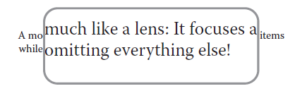
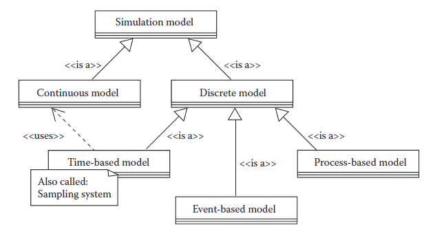

[18 <--- ](18.md) [   Зміст   ](README.md) [--> 18.2](18_2.md)

## 18.1. INTRODUCTION

After a short description of the actual simulation problem, a brief overview of past and present trends in simulation-based operator training is given. The third subsection shows some important aspects of modeling from the view of software engineering. For simulation of fast physical systems such as machines, considerations of real-time aspects are important. Finally, a look at the impact of modern computer games to the development of simulation software is useful before starting the modeling work.

Після короткого опису фактичної проблеми моделювання дається короткий огляд минулих і сучасних тенденцій у навчанні операторів на основі моделювання. Третій підрозділ показує деякі важливі аспекти моделювання з точки зору програмної інженерії. Для моделювання швидких фізичних систем, таких як машини, важливі аспекти реального часу. Нарешті, перед початком роботи з моделювання корисно поглянути на вплив сучасних комп’ютерних ігор на розробку програмного забезпечення для моделювання.

### 18.1.1 Ultra Flexible Reversing Mill

Voestalpine Schienen GmbH is a leading manufacturer of rails and is exploiting a new ultra flexible reversing mill consisting of three identical mill stands [1]. The automation system of the mill provides all necessary control for production, which includes the basic sequential and closed-loop control of the movements of the mechanical equipment and the technological process control such as minimum tension control.

Voestalpine Schienen GmbH є провідним виробником рейок і використовує новий надгнучкий реверсивний стан, що складається з трьох однакових клітей [1]. Система автоматизації млина забезпечує весь необхідний контроль виробництва, який включає основне послідовне та замкнуте управління рухами механічного обладнання та керування технологічним процесом, таке як контроль мінімального натягу.

In normal operation, the complex roll exchange is a process of maintenance and runs fully automated under supervision of the control system. With the help of hydraulic and electric systems, three systems of horizontal and vertical rolls are exchanged. The process goes through about one hundred steps and requires hundreds of actuators and an even larger amount of sensors. Sometimes a failure in the system occurs, and the automatic cylce stops. Then, after a repair, the steps must be carried out without automated sequencing. The danger of making a mistake and damaging some components is high. Such mistakes increase the downtime of the machine significantly. More and regular sessions with a systematic training program are necessary for faster performance. A long period of continuous production, which is of course a desirable advantage, turns out to be a problem for the maintenance personnel, since they have fewer opportunities to train and hone their skills. This was the reason for the development of the training simulator. 

У нормальному режимі роботи комплексний обмін рулонів є процесом технічного обслуговування і працює повністю автоматизовано під наглядом системи управління. За допомогою гідравлічної та електричної систем міняються три системи горизонтальних і вертикальних валків. Процес проходить приблизно в сотню етапів і вимагає сотень приводів і ще більшої кількості датчиків. Іноді відбувається збій в системі, і автоматичний цикл зупиняється. Потім, після ремонту, кроки повинні виконуватися без автоматичної послідовності. Велика небезпека помилитися і пошкодити деякі компоненти. Такі помилки значно збільшують час простою машини. Для більш швидкої роботи необхідно більше і регулярні заняття з систематичною програмою тренувань. Тривалий період безперервного виробництва, який, звичайно, є бажаною перевагою, виявляється проблемою для обслуговуючого персоналу, оскільки у нього менше можливостей для навчання та вдосконалення своїх навичок. Це стало причиною розробки навчального тренажера.

### 18.1.2 Simu lation for Operator Training

The need for training simulation emerged when human mistakes during the operation of technical devices started causing harm to people. Beginning with mechanical simulators in the first decades of aviation, the first computer simulations appeared in the 1960s. Flight simulators for the training of operators of airplanes [2] and spacecraft were indispensable. In addition to modeling and simulation, pedagogical frameworks based on training modules were developed to lead the trainee step-by- step through the basics of operation.

Потреба в тренувальному моделюванні виникла тоді, коли людські помилки під час експлуатації технічних пристроїв почали завдавати шкоди людям. Починаючи з механічних симуляторів у перші десятиліття авіації, перше комп’ютерне моделювання з’явилося в 1960-х роках. Авіатренажери для підготовки операторів літаків [2] і космічних кораблів були незамінними. Окрім моделювання та симуляції, були розроблені педагогічні основи, засновані на навчальних модулях, щоб крок за кроком ознайомити слухача з основами роботи.

The high cost of such equipment is why such simulators were introduced very late to industrial equipment. Nuclear power plants with their high risks were the first to see computer simulation employed [3]. The chemical industry and fossil power plants followed. Recent progress in computer technology, hardware, and software have reduced the cost and enabled the use of simulation also in industries with lower risk and impact, such as heavy machinery [4].

Висока вартість такого обладнання є причиною того, що такі тренажери дуже пізно були впроваджені на промислове обладнання. Атомні електростанції з їх високою небезпекою першими почали застосовувати комп’ютерне моделювання [3]. Далі з’явилася хімічна промисловість і електростанції, що працюють на викопному паливі. Недавній прогрес у комп’ютерних технологіях, апаратному забезпеченні та програмному забезпеченні знизив вартість і дозволив використовувати моделювання також у галузях з меншим ризиком і впливом, таких як важке машинобудування [4].

While conventional training requires access to resources dedicated to production (machine, plant, people), simulation on the computer reduces the danger caused by mistakes of the trainees, and also the cost of potential damage. Beside these points, making the original system available for training reduces the production capacity and is a more recent argument in favor of OTS. For accurate simulation, models for the physical or chemical processes are controlled by a replica of the deployed control system. Having the simulation in a loop with a piece of original hardware is referred to as HIL [5,6].

Хоча звичайне навчання вимагає доступу до ресурсів, призначених для виробництва (машина, завод, люди), симуляція на комп’ютері зменшує небезпеку, спричинену помилками слухачів, а також вартість потенційної шкоди. Окрім цих моментів, надання початкової системи доступності для навчання зменшує виробничу потужність і є новішим аргументом на користь OTS. Для точного моделювання моделями фізичних або хімічних процесів керує копія розгорнутої системи керування. Наявність моделювання в циклі з оригінальним апаратним забезпеченням називається HIL [5,6].

Other fields of training simulation emerge for highly complex systems. For example, the optimization of the market of electrical power supply [7] necessitates optimal operation of the power grid [8]. For medical appliances, training simulation is also well established [9]. A demographic problem, the retirement of aged experts that results in a lack of training facilities for the apprentices, is proposed to be solved with training in simulation [10].

Для дуже складних систем з’являються інші області моделювання навчання. Наприклад, оптимізація ринку постачання електроенергії [7] зумовлює необхідність оптимальної роботи електромережі [8]. Для медичних приладів симуляція навчання також добре запроваджена [9]. Демографічну проблему, а саме вихід на пенсію літніх спеціалістів, що призводить до відсутності можливостей для навчання учнів, пропонується вирішити за допомогою навчання в моделюванні [10].

Embedded simulation is a recent development in military appliances to bring training closer to high fidelity environments. When not in action, weapons can temporarily switch to a simulation mode for training. This allows training not only in training centers and classrooms but also in the actual place of operation. The environment is more realistic and training can occur more often during standby times. Civil equivalents of this technique are conceivable.

Вбудоване моделювання — це нещодавня розробка у військовій техніці, яка наближає навчання до середовищ високої точності. Коли зброя не працює, вона може тимчасово перемикатися в режим симуляції для навчання. Це дозволяє проводити навчання не тільки в навчальних центрах і аудиторіях, а й на місці роботи. Середовище більш реалістичне, і тренування можуть проводитися частіше в режимі очікування. Цивільні еквіваленти цієї техніки можливі.

### 18.1.3 Modeling

Before a simulation of a system can be carried out, a model must be established. Different definitions for a model exist in several standards or books; a useful one can be found in Lieberman [11]:

Перш ніж можна буде здійснити моделювання системи, необхідно створити модель. Різні визначення моделі існують у кількох стандартах або книгах; корисний можна знайти у Лібермана [11]:

>  A model can be defined as the simplification of a complex system for the purpose of communicating specific details.
>
>  Модель можна визначити як спрощення складної системи з метою передачі конкретних деталей.

**Definition of a model** *Lieberman*

The emphasis should be on the word “communication,” telling us that the purpose of a successful modeling process is not to create a model, but to inform a hopefully well-defined group of people about some selected details of the system under study that is modeled. A model should not be built until the modeler understands the intended audience. The same author describes an important property of a model:

Наголос слід зробити на слові «комунікація», яке говорить нам, що метою успішного процесу моделювання є не створення моделі, а інформування чітко визначеної групи людей про деякі вибрані деталі досліджуваної системи, які змодельований. Модель не повинна створюватися, поки модельєр не зрозуміє цільову аудиторію. Той же автор описує важливу властивість моделі:

> A model operates much like a lens: It focuses attention on items while obscuring or omitting everything else!
>
> Модель працює так само, як лінза: вона фокусує увагу на предметах, закриваючи або пропускаючи все інше!

**FIGURE 18.1** Focusing effect of a model. (Adopted from Lieberman, B. A. “The Art of Modeling, Part I: Constructing an Analytical Framework,” 2003, accessed July 3, 2010, [http://](http://download.boulder.ibm.com/) [download.boulder.ibm.com/ibmdl/pub/software/dw/rationaledge/aug03/fmodelingbl.pdf](http://download.boulder.ibm.com/).)

**МАЛЮНОК 18.1** Ефект фокусування моделі. (Взято з Lieberman, B. A. “The Art of Modeling, Part I: Constructing an Analytical Framework”, 2003, доступ 3 липня 2010 р., [http://](http://download.boulder.ibm.com/) [ download.boulder.ibm.com/ibmdl/pub/software/dw/rationaledge/aug03/fmodelingbl.pdf](http://download.boulder.ibm.com/).)

Figure 18.1 explains this property. We and our customer have to accept that a model cannot represent all details of the real system. Trying this, we would fail.

Малюнок 18.1 пояснює цю властивість. Ми та наш клієнт повинні визнати, що модель не може відобразити всі деталі реальної системи. Спробуючи це, ми б зазнали невдачі.

If a system should be modeled for different purposes, different modeling procedures, methods, and tools are applied [12]. In general, separate models for the same plant may be required for, for example, presentation of a machine to sales- people, investigating technical details of the plant behavior, optimizing production and logistic properties, and training of operators.

Якщо система повинна бути змодельована для різних цілей, застосовуються різні процедури моделювання, методи та інструменти [12]. Загалом, окремі моделі для одного заводу можуть знадобитися, наприклад, для презентації машини продавцям, дослідження технічних деталей поведінки заводу, оптимізації виробничих і логістичних властивостей і навчання операторів.

After the requirement analysis for the modeling development is completed, the design may follow one of the strategies: 

1. Top-down

2. Bottom-up

3. Inside-out

4. Hardest first

Після завершення аналізу вимог до розробки моделювання проект може слідувати одній із стратегій:

1. Зверху вниз

2. Знизу вгору

3. Навиворіт

4. Найважче спочатку

These are the same strategies we know from the software development process. The application of the first three strategies is described in Lieberman [13]. For the steel rolling mill project described in this chapter, the “hardest first” approach had to be applied, since the behavior of some critical parts of the system were not known exactly and had to be explored first.

Це ті самі стратегії, які ми знаємо з процесу розробки програмного забезпечення. Застосування перших трьох стратегій описано у Лібермана [13]. Для проекту сталепрокатного цеху, описаного в цьому розділі, довелося застосувати підхід «спочатку найважче», оскільки поведінка деяких критичних частин системи не була точно відома, і їх потрібно було спочатку дослідити.

Before starting the modeling process, a classification is helpful to select the bestsuited language or tool for the actual purpose. A useful classification may be according to [Figure 18.2](#_bookmark96). For *continuous models*, time is a primary simulation variable. This is the way we describe dynamic systems starting from ordinary differential equations (ODE), applying Laplace transform and transfer functions [14]. *Time- based models* running on a computer are inherently of a discrete nature. This means that modeling of dynamic systems requires the z-transform to obtain digital transfer functions. Modern modeling languages such as Simulink® [15] are capable of masking this difference and even allow running discrete-time and continuous-time models concurrently within one system. This simplifies the modeling task and saves us from working with z-transform or similar techniques. *Event-based models* are used when the system primarily reacts to events happening at certain time points, and the state of the system does not change over time between two subsequent events. Finite state machines (FSM) are one example of a basic method to implement such a model. Again, it is state of the art to have continuous-time, discrete-time, and event-driven models combined in a single computer model. Finally, *process-based models* were developed to map workflow processes of practical value into a simulation model, for example, Business Process Modeling Notation [16].

Перед початком процесу моделювання корисно провести класифікацію, щоб вибрати мову чи інструмент, який найкраще підходить для конкретної мети. Корисною може бути класифікація відповідно до [Рис. 18.2] (#_bookmark96). Для *безперервних моделей* час є основною змінною моделювання. Таким чином ми описуємо динамічні системи, починаючи зі звичайних диференціальних рівнянь (ОДВ), застосовуючи перетворення Лапласа та передатні функції [14]. *Моделі на основі часу*, що працюють на комп’ютері, за своєю суттю мають дискретний характер. Це означає, що моделювання динамічних систем потребує z-перетворення для отримання цифрових передавальних функцій. Сучасні мови моделювання, такі як Simulink® [15], здатні маскувати цю різницю і навіть дозволяють запускати моделі з дискретним і неперервним часом одночасно в одній системі. Це спрощує завдання моделювання та позбавляє нас від роботи з z-перетворенням або подібними методами. *Моделі на основі подій* використовуються, коли система в основному реагує на події, що відбуваються в певні моменти часу, і стан системи не змінюється з часом між двома наступними подіями. Кінцеві автомати (FSM) є одним із прикладів базового методу реалізації такої моделі. Знову ж таки, об’єднання моделей безперервного часу, дискретного часу та моделей, керованих подіями, в одну комп’ютерну модель – це сучасний рівень техніки. Нарешті, *моделі на основі процесів* були розроблені для відображення процесів робочого процесу практичної цінності в імітаційну модель, наприклад, Notation Business Process Modeling [16].

**FIGURE 18.2** Classification of mathematical models for simulation

### 18.1.4 Real-Time Simu lation

A simulator for operator training requires a real-time response. This means the time behavior of the simulation must match with the physical system. The definition “real time” demands that the computations that are necessary in a given time interval can be completed in this specified time interval [17]. Not only the calculation of the models, but also data communication must abide by this restriction [18]. Usually, the real-time property is obtained by the utilization of a dedicated operating system. In computers for human–machine interface (HMI), often a standard operating system with some real-time extension is used. Even if the “hard” real-time property cannot be guaranteed, such systems are proven to work properly as simulators. The chosen environment for the actual steel rolling mill project, Winmod®, is one of this type [19].

Тренажер для навчання операторів вимагає відповіді в реальному часі. Це означає, що поведінка симуляції в часі має відповідати фізичній системі. Визначення «реального часу» вимагає, щоб обчислення, які необхідні в заданому інтервалі часу, могли бути завершені в цьому заданому інтервалі часу [17]. Не тільки розрахунок моделей, але й передача даних повинні відповідати цьому обмеженню [18]. Зазвичай властивість реального часу досягається за допомогою спеціальної операційної системи. У комп’ютерах для людино-машинного інтерфейсу (HMI) часто використовується стандартна операційна система з деяким розширенням реального часу. Навіть якщо «жорстка» властивість реального часу не може бути гарантована, доведено, що такі системи належним чином працюють як симулятори. Середовище, обране для фактичного проекту сталепрокатного заводу, Winmod®, є одним із таких [19].

### 18.1.5 Game-Based Learning, Game Programm ing, and Simu lation

Modern computer games are an important pacemaker for developments in the computer industry. So it is worth it to take a look at game programming when investigating the facilities of modern simulation.

Сучасні комп'ютерні ігри є важливим стимулятором розвитку комп'ютерної індустрії. Тому варто звернути увагу на програмування ігор, досліджуючи засоби сучасної симуляції.

Game-based learning (GBL) is an integrated part of eLearning [20]. Even if no GBL is intended, the target audience, the trainees on the simulator, may have grown up with computer games and acquired a different cognitive character (“gamer generation” [21]). Games are applied in learning environments to increase the motivation. Fantasy, rules/goals, stimulus, challenge, mystery, control, and feedback are the characteristics of a game that augment the learning effect [22].

Ігрове навчання (GBL) є невід’ємною частиною електронного навчання [20]. Навіть якщо GBL не передбачається, цільова аудиторія, слухачі на тренажері, можливо, виросла з комп’ютерними іграми та набула іншого когнітивного характеру («покоління геймерів» [21]). Ігри використовуються в навчальних середовищах для підвищення мотивації. Фантазія, правила/цілі, стимул, виклик, таємниця, контроль і зворотний зв’язок є характеристиками гри, які посилюють навчальний ефект [22].

Exploring the possibilities of new media causes enthusiasm, but one must be cautious about the eLearning hype. A game is only a game in a narrower sense, if there is no purpose behind it [23], and people who often play games are more critical about serious games [24].

Вивчення можливостей нових медіа викликає ентузіазм, але слід бути обережним щодо ажіотажу електронного навчання. Гра є грою лише у більш вузькому сенсі, якщо за нею не стоїть мета [23], а люди, які часто грають в ігри, більш критичні до серйозних ігор [24].

For the designer of a training simulator, the following aspects may be important. **Playing the Simulation Game.** A simulation itself is to an extent a game that models parts of the actual world [25]. The topic of simulation for training is given by the actual task, but for presentation, visualization, etc., we can gain inspiration from eLearning and GBL on how to design an attractive environment for the simulation.

Для розробника тренажера важливі такі аспекти. **Гра в симуляційну гру.** Сама симуляція є певною мірою грою, яка моделює частини реального світу [25]. Тема моделювання для навчання визначається фактичним завданням, але для презентації, візуалізації тощо ми можемо отримати натхнення від електронного навчання та GBL щодо того, як створити привабливе середовище для моделювання.

**Trainer or GBL Environment.** Most OTS for industrial production systems require a trainer to guide through a session. This trainer usually observes and rates the session. If the reaction to a fault needs to be trained, the trainer provokes a failure at a certain instant. Substituting this trainer with software would be a step towards GBL. **Game Programming.** For the developer of simulation software, game programming is a rich source of methods and techniques. All required design patterns on how to create successfully virtual worlds for a trainee are developed and published. For example, work has been done on how to design the architecture for simulation in realtime and visualize it in 3D [26]. To model the dynamic behavior of game characters or machines, work that employs FSM, parallel or nondeterministic automata can be found [27]. Scripting techniques that simplify rich but complex programming languages as those employed in design patterns are ideally suited for industrial programmers.

**Тренер або GBL Environment.** Більшість OTS для промислових виробничих систем вимагають інструктора, щоб проводити сеанс. Цей тренер зазвичай спостерігає за сеансом і оцінює його. Якщо реакцію на помилку потрібно тренувати, то в певний момент тренер провокує збій. Заміна цього тренажера програмним забезпеченням була б кроком до GBL. **Програмування ігор.** Для розробників програмного забезпечення для моделювання програмування ігор є багатим джерелом методів і технік. Розроблені та опубліковані всі необхідні шаблони проектування, як успішно створювати віртуальні світи для стажера. Наприклад, була проведена робота над тим, як спроектувати архітектуру для моделювання в реальному часі та візуалізувати її в 3D [26]. Для моделювання динамічної поведінки ігрових персонажів або машин можна знайти роботу, яка використовує FSM, паралельні або недетерміновані автомати [27]. Методи створення сценаріїв, які спрощують багаті, але складні мови програмування, як ті, що використовуються в шаблонах проектування, ідеально підходять для промислових програмістів.

[18 <--- ](18.md) [   Зміст   ](README.md) [--> 18.2](18_2.md)