[18.2 <--- ](18_2.md) [   Зміст   ](README.md) [--> 18.4](18_4.md)

## 18.3. SIMULATOR FOR ROLLING MILL OPERATOR TRAINING

This section describes development work for the actual simulator in a time-ordered manner. First, the requirements are specified, then the design of the software components follows. Taking into consideration how to reduce the enormous complexity to a reasonable extent is important before selecting a tool and doing the coding work.

У цьому розділі описано розробку фактичного симулятора за часом. Спочатку уточнюються вимоги, потім йде дизайн програмних компонентів. Перед вибором інструменту та кодуванням важливо розглянути, як зменшити величезну складність до розумної міри.

### 18.3.1 Requirement Analysis of the Training Simu lator

From the basic considerations described in Section 18.2, some conclusions are drawn: The language for developing training simulators should be one of the typical industrial languages so that machine experts can understand and change the program code of the simulator. C++ or other object-oriented languages, which offer more freedom to the programmer, but may result in unreadable code, are not favored. A training session should not have a game character and no success indicators of a training session should be recorded, since this is demanded by the trade union. The behavior of some critical machine parts are typically not known in sufficient detail so as to initiate their modeling without further preliminary analysis. Consequently, the hardest-first approach to design is to be applied.

З основних міркувань, описаних у розділі 18.2, можна зробити деякі висновки: Мова для розробки навчальних тренажерів має бути однією з типових промислових мов, щоб спеціалісти з машин могли зрозуміти та змінити програмний код тренажера. C++ або інші об’єктно-орієнтовані мови, які пропонують більше свободи для програміста, але можуть призвести до нечитабельного коду, не є перевагою. Тренування не повинно носити ігрового характеру і не фіксуватися показники успішності тренування, оскільки цього вимагає профспілка. Поведінка деяких критичних частин машини зазвичай недостатньо детально відома, щоб почати їх моделювання без подальшого попереднього аналізу. Отже, слід застосувати найважчий підхід до проектування.

The application of a use-case analysis turned out to be a successful part in the phase of requirement specifications. A simplified use-case diagram is shown in Figure 18.3. The machine operator commands the automated roll exchange as well as the manual exchange. In case of problems, a second actor, the maintenance expert, works on the “manual roll exchange.” For training purposes, the simulator should substitute the physical machine for a use case “manual roll exchange.”

Застосування аналізу варіантів використання виявилося успішною частиною на етапі специфікації вимог. Спрощена діаграма варіантів використання показана на малюнку 18.3. Оператор машини керує автоматизованою заміною рулонів, а також ручною заміною. У разі виникнення проблем другий учасник, експерт з обслуговування, працює над «ручною заміною рулонів». Для цілей навчання симулятор має замінити фізичну машину випадком використання «ручного обміну роликами».

During the automated production, the roll exchange also runs autonomously, and the operator supervises the procedure. In the case of a failure in the system, the roll exchange must be done by the operator, thought not manually, on a low level of automation. Several hundred drives must be coordinated in about one hundred steps. After a repair, the machine must be brought into a condition where the automatic sequence may continue. Figure 18.4 shows the configuration of the actual system and the data flows among the components. The operator works with his HMI and a replica of the control system. Several hundred inputs and outputs must be communicated in real time between the control system and the simulator. To avoid the cost of copper wires, serial communication over an industrial fieldbus was the choice.

Під час автоматизованого виробництва обмін рулонів також працює автономно, а оператор контролює процедуру. У разі збою в системі, заміна рулонів повинна здійснюватися оператором, але не вручну, на низькому рівні автоматизації. Кілька сотень приводів повинні бути скоординовані приблизно за сто кроків. Після ремонту машину необхідно привести в стан, коли автоматична послідовність може продовжуватися. На малюнку 18.4 показано конфігурацію фактичної системи та потоки даних між компонентами. Оператор працює зі своїм HMI і копією системи керування. Кілька сотень входів і виходів повинні бути передані в режимі реального часу між системою керування та симулятором. Щоб уникнути витрат на мідні дроти, вибрали послідовний зв’язок через промислову польову шину.

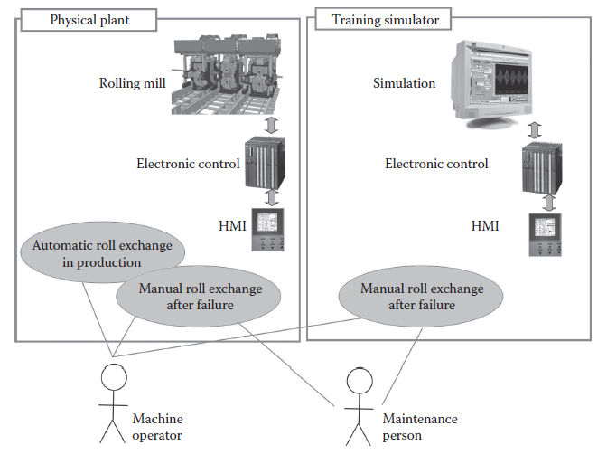

**FIGURE 18.3** Use cases of the roll exchange task.

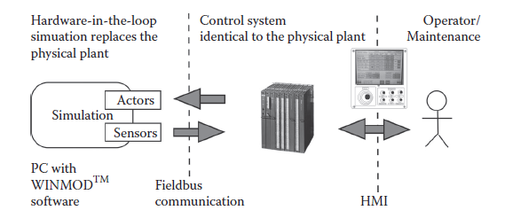

**FIGURE 18.4** Hardware configuration of the training simulator.

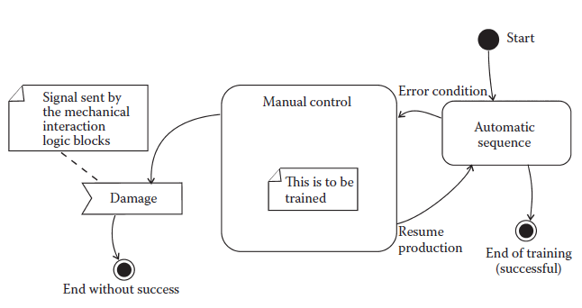

**FIGURE 18.5** State diagram of the training session.

### 18.3.2 System Design of the Training Simu lator

As a first design step, based on the requirement analysis and on the introductory considerations, the course of the training session was defined. It can be documented as a state diagram (see Figure 18.5), according to UML notation [36]. Two exits are designed. One is the successful end, when the machine can resume its normal production again. When the trainee causes damage to the system after a mistake, the session is terminated (“game-over” situation).

Як перший крок проектування, на основі аналізу вимог і вступних міркувань, було визначено курс тренінгу. Його можна задокументувати як діаграму стану (див. рис. 18.5) відповідно до нотації UML [36]. Запроектовано два виходи. Один — це успішний кінець, коли машина може знову відновити нормальне виробництво. Коли стажер завдає шкоди системі після помилки, сеанс припиняється (ситуація «завершення гри»).

An important aspect can be found in Figure 18.5: the automatic sequence (which is not a topic for the training) is a milestone for testing the system. All components of the physical simulation are actuated by the control system and the system is running in a continuous mode.

Важливий аспект можна знайти на малюнку 18.5: автоматична послідовність (яка не є темою навчання) є віхою для тестування системи. Усі компоненти фізичного моделювання приводяться в дію системою керування, і система працює в безперервному режимі.

The next design step is to find a structure for the simulation software. The simulator should replace the physical machine and provide its behavior to the replica of the electronic control system (see [Figure 18.4](#_bookmark97)). The artifacts of the simulation software are shown in Figure 18.6. Apart from the software component simulating the machine, there exists a visualization part. This is not for the trainee, who works with the HMI of the control system, but is required for administration and adjustments of the simulator. Since the operator of the physical machine cannot observe any process and must rely entirely on her/his operating panel, a three-dimensional visualization was not a requirement of the simulation system.

Наступним кроком проектування є пошук структури для програмного забезпечення моделювання. Симулятор має замінити фізичну машину та надати її поведінку копії електронної системи керування (див. [Малюнок 18.4](#_bookmark97)). Артефакти програмного забезпечення моделювання показано на малюнку 18.6. Крім програмного компонента, що моделює машину, існує частина візуалізації. Це не для стажиста, який працює з HMI системи керування, але потрібно для адміністрування та налаштування тренажера. Оскільки оператор фізичної машини не може спостерігати за будь-яким процесом і повинен повністю покладатися на свою панель керування, тривимірна візуалізація не була вимогою системи моделювання.

The exception generator is the component of the software in Figure 18.6 for defining and varying the training scenario. It means that the automatic cycle (see [Figure 18.5](#_bookmark97)) breaks and the actual training can start.

Генератор винятків є компонентом програмного забезпечення на малюнку 18.6 для визначення та зміни сценарію навчання. Це означає, що автоматичний цикл (див. [Малюнок 18.5](#_bookmark97)) переривається, і фактичне навчання може розпочатися.

Another component of the system in Figure 18.6 is the input/output system. Via communication over a fieldbus, this part has to provide the state of about one thousand data points in real time.

Іншим компонентом системи на малюнку 18.6 є система введення/виведення. За допомогою зв’язку через польову шину ця частина має надавати інформацію про стан приблизно тисячі точок даних у режимі реального часу.

The main component of the training simulator is the actual modeling software. A machine or plant consists of an incredible amount of things moving around, delivering signals or interacting with some other parts. To classify this, the machine was considered to consist of components called subassemblies in [Figure 18.6](#_bookmark98). A subassembly is a constructive mechanical part of the machine. It can be a single lever, a carriage for the rolls, or a complex handling system such as a robot. Artifacts called sensors are mounted on these subassemblies to provide information about positions, pressures, etc., while physics and kinematics of these assemblies are to be modeled. One assembly can carry drive units, which are hydraulic or pneumatic cylinders and motors, or electrical drives. Their task is to convert the output signals of the controller into a mechanical force and to apply this to the mechanic subassembly. The motion as a reaction can be found by solving the ODE. Since unrestricted motion is not possible for all components, additionally collisions must be detected. Such interactions can occur among subassemblies or among drives (in a few cases). An interaction can cause damage, which then is a severe mistake of the trainee. Interactions without damage are usually blocking situations, since the machine consists of rigid bodies. Those situations may be resolved by a reversal motion of the drives and are not an illegal condition of the system.

Основною складовою навчального тренажера є власне програмне забезпечення моделювання. Машина або завод складається з неймовірної кількості речей, які рухаються, передають сигнали або взаємодіють з деякими іншими частинами. Щоб класифікувати це, вважалося, що машина складається з компонентів, які називаються вузлами на [Рис. 18.6] (#_bookmark98). Вузол — конструктивна механічна частина машини. Це може бути один важіль, каретка для рулонів або складна система керування, наприклад робот. Артефакти, які називаються датчиками, встановлюються на цих вузлах, щоб надати інформацію про положення, тиск тощо, тоді як фізика та кінематика цих вузлів повинні моделюватися. Один вузол може нести приводи, якими є гідравлічні чи пневматичні циліндри та двигуни, або електричні приводи. Їх завдання полягає в тому, щоб перетворити вихідні сигнали контролера в механічну силу і застосувати її до механічного вузла. Рух як реакцію можна знайти, розв’язавши ОДЗ. Оскільки необмежений рух можливий не для всіх компонентів, необхідно додатково виявляти зіткнення. Такі взаємодії можуть відбуватися між вузлами або між приводами (у деяких випадках). Взаємодія може завдати шкоди, що потім є серйозною помилкою стажера. Взаємодії без пошкоджень зазвичай є блокуючими ситуаціями, оскільки машина складається з твердих тіл. Ці ситуації можуть бути вирішені реверсивним рухом дисків і не є незаконним станом системи.

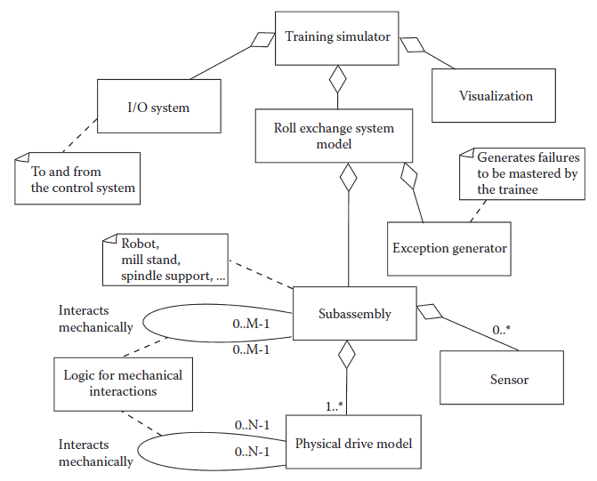

**FIGURE 18.6** Objects of the training simulator. 

The states of a drive during its simulation lifecycle are shown in Figure 18.7. A normal, successful training end does not terminate the simulation, since the design of the deployed production plant also is made for perpetual operation.

Стани накопичувача під час його життєвого циклу моделювання показано на малюнку 18.7. Нормальне, успішне завершення навчання не припиняє моделювання, оскільки проект розгорнутого виробничого підприємства також розроблено для безперервної роботи.

Two points have important implications regarding the design personnel, which are documented in the data-flow diagram in [Figure 18.8](#_bookmark99). The simulator should model the behavior of the machine and its components; consequently, the designers are experts in the mechanical system. The input and output data of the simulation match exactly the sensors and actuators of the deployed system. But this exact mapping concept must be violated. Supplemental data flows must be added (see Figure 18.8):

Два моменти мають важливе значення для проектного персоналу, які задокументовані на діаграмі потоку даних на [Рис. 18.8] (#_bookmark99). Симулятор повинен моделювати поведінку машини та її компонентів; отже, дизайнери є експертами в механічній системі. Вхідні та вихідні дані моделювання точно відповідають датчикам і виконавчим механізмам розгорнутої системи. Але ця точна концепція відображення повинна бути порушена. Необхідно додати додаткові потоки даних (див. рис. 18.8):

 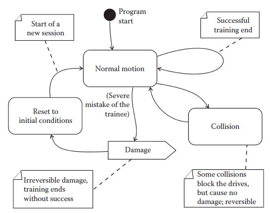

**FIGURE 18.7** States that a drive runs through during simulation.

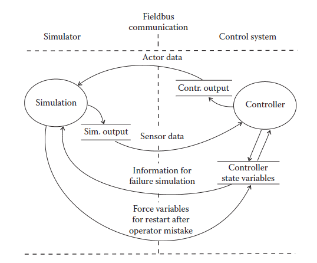

**FIGURE 18.8** Data flow between simulator and controller.

1. The injection of a system fault that the trainee should master is not done by a trainer but automatically in a random manner. This makes it necessary to read the status data out of the control system to determine the instant when a component should fail.

2. Ін’єкція системної помилки, яку повинен освоїти учень, виконується не тренером, а автоматично у випадковому порядку. Це робить необхідним зчитувати дані про стан із системи керування, щоб визначити момент, коли компонент має вийти з ладу.

3. If the trainee causes damage, the entire system must be restarted. It would be too time-consuming to restart the simulator and the control system again. Unfortunately, the machine components cannot fast rewind to their initial positions and states, since the control system does not accept this and would trigger an alarm condition. The solution is to overrule such error conditions by writing internal state variables of the controller.

4. Якщо навчається завдає шкоди, необхідно перезапустити всю систему. Повторний запуск симулятора та системи керування займе надто багато часу. На жаль, компоненти машини не можуть швидко повернутися до початкових положень і станів, оскільки система керування не сприймає це і може викликати стан тривоги. Рішення полягає в тому, щоб скасувати такі умови помилки шляхом запису внутрішніх змінних стану контролера.

Both tasks require knowledge of the controller internals. Consequently, it does not suffice to have experts for the physics modeling only, but also control experts who are familiar with the actual controller must be on the team throughout the project.

Обидва завдання вимагають знання внутрішніх елементів контролера. Отже, недостатньо мати експертів лише для фізичного моделювання, а й експертів з управління, які знайомі з фактичним контролером, повинні бути в команді протягом усього проекту.

Furthermore, any intervention in the control system bears the danger that its behavior is changed for the subsequent training session. A mismatch with the physical system would be the consequence.

Крім того, будь-яке втручання в систему керування несе в собі небезпеку того, що її поведінка буде змінено для наступного тренувального сеансу. Наслідком буде невідповідність фізичній системі.

Now the basic design of the simulator is done. Before a decision for a certain software tool can be made, the complexity of the system should be investigated. Computing time limits the model number of mechanical components and the large number of possible interactions can increase the coding work excessively. 

Тепер базова конструкція тренажера готова. Перш ніж прийняти рішення щодо певного програмного засобу, слід дослідити складність системи. Час обчислення обмежує кількість моделей механічних компонентів, а велика кількість можливих взаємодій може надмірно збільшити роботу кодування.

### 18.3.3 Reduction of Complexity

The most important issue throughout the development process of a simulator is to reduce the complexity to a reasonable extent.

Найважливішим питанням у процесі розробки симулятора є зменшення складності до розумної межі.

#### 18.3.3.1 Hardware Expense

The simulator replaces the machine or plant and communicates with the clone of the control system. An obvious technique is to connect both systems with wires, as in the physical plant. The communication channel in [Figure 18.4 ](#_bookmark97)would consist of wires for every input and output. Looking at the cost, this is only affordable for small systems. Consequently, the usual way to establish this communication is to use a fieldbus system, which enables the transfer of thousands of data points with one single cable. As a further reasonable reduction step, some use a simulation inside the controller running in parallel. Since the exchange of data is done via variables, no additional hardware is required. This minimal configuration is applied for two purposes:

Симулятор замінює машину або завод і спілкується з клоном системи керування. Очевидною технікою є з’єднання обох систем дротами, як у фізичній установці. Канал зв’язку на [Рисунок 18.4 ](#_bookmark97) складатиметься з проводів для кожного входу та виходу. Якщо дивитися на вартість, це доступно лише для невеликих систем. Отже, звичайним способом встановлення цього зв’язку є використання системи польової шини, яка дозволяє передавати тисячі точок даних за допомогою одного кабелю. Як подальший розумний крок зменшення, деякі використовують моделювання всередині контролера, що працює паралельно. Оскільки обмін даними здійснюється через змінні, додаткове обладнання не потрібно. Ця мінімальна конфігурація використовується для двох цілей:

1. To test some critical parts of the control software

2. To replace and simulate parts of the physical plant during service operations to establish a normal production cycle

Perhaps this can be called *embedded simulation*, *on-board simulation*, or *distributed simulation*. It should be mentioned that for safety-related systems, this configuration is not acceptable for FAT.

1. Перевірити деякі критичні частини керуючого програмного забезпечення

2. Замінити та імітувати частини фізичної установки під час сервісних операцій для встановлення нормального виробничого циклу

Можливо, це можна назвати *вбудованим моделюванням*, *вбудованим моделюванням* або *розподіленим моделюванням*. Слід зазначити, що для систем безпеки ця конфігурація неприйнятна для FAT.

#### 18.3.3.2 Reduction of Possible Machine States

The components of a typical production machine have interactions that are to be programmed for simulation. The amount of these artifacts should be estimated on the example of the actual project. In the actual project, we call these machine components subassemblies and drives (see [Figure 18.6](#_bookmark98)). If each unit can interact with every other, the maximum possible number is a combination by two:

Компоненти типової виробничої машини мають взаємодії, які потрібно запрограмувати для моделювання. Кількість цих артефактів слід оцінити на прикладі реального проекту. У реальному проекті ми називаємо ці компоненти машини вузлами та приводами (див. [Малюнок 18.6](#_bookmark98)). Якщо кожна одиниця може взаємодіяти з іншою, максимально можлива кількість — це комбінація з двох:

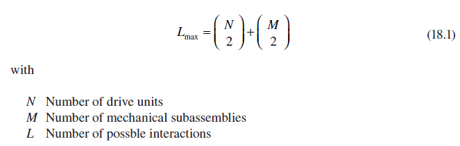

With the example of *N* = 40 and *M* = 8 for one part of the actual rolling mill model, the maximum number of possible interactions will be *L* = 808. It would not be affordable to program all these interactions. Fortunately, this is only the worst case. The nature of heavy machinery yields a reduction of the number of possible interactions. Manipulators usually are designed to form a linear chain, where each drive can have an interaction with another at the end of its path. For example, a piece of load is handed over to the next at the end position of the first manipulator. Consequently, the amount of interactions is reduced to

На прикладі *N* = 40 і *M* = 8 для однієї частини фактичної моделі прокатного стану максимальна кількість можливих взаємодій становитиме *L* = 808. Запрограмувати всі ці взаємодії було б неможливим. На щастя, це лише найгірший випадок. Природа важкої техніки дає змогу зменшити кількість можливих взаємодій. Маніпулятори зазвичай створені для формування лінійного ланцюга, де кожен привод може взаємодіяти з іншим у кінці свого шляху. Наприклад, шматок вантажу передається наступному в кінцевому положенні першого маніпулятора. Отже, кількість взаємодій зменшується до

 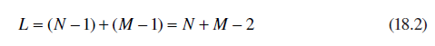

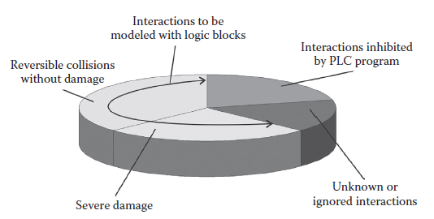

**FIGURE 18.9** Interactions of machine parts (collisions).

For the actual example, the number of interactions is reduced to *L* = 46, which is now realizable.

Для фактичного прикладу кількість взаємодій зменшено до *L* = 46, що тепер можливо.

Additionally, many drives are clamping or locking devices. They have interactions that are possible only at one end of their stroke, which is a further reduction.

Крім того, багато приводів є затискними або блокуючими пристроями. Вони мають взаємодію, яка можлива лише на одному кінці їх ходу, що є подальшим скороченням.

#### 18.3.3.3 Reduction of States by the Control Program

The number of states that must be programmed for the simulation of the machine can be reduced further when we look at Figure 18.9.

Кількість станів, які необхідно запрограмувати для симуляції машини, можна ще більше зменшити, якщо ми поглянемо на малюнок 18.9.

Any control logic has programmed manifold *interlocks* that protect the plant from dangerous conditions and from the most probable operator mistakes. It is possible to exclude these situations to reduce the coding effort, since the PLC will not allow motions leading to them. This saves a lot of development time and also avoids overloading the computing capacity of the simulator. This technique will not be allowed if the purpose of the simulation is to test or commission the control software. But for operator training, this advantage can be taken.

Будь-яка логіка управління має запрограмовані *блокування* колектора, які захищають установку від небезпечних умов і від найбільш імовірних помилок оператора. Ці ситуації можна виключити, щоб зменшити зусилля з кодування, оскільки ПЛК не допускатиме рухів, що призводять до них. Це економить багато часу на розробку, а також дозволяє уникнути перевантаження обчислювальної потужності симулятора. Ця техніка не буде дозволена, якщо метою моделювання є тестування або введення в дію керуючого програмного забезпечення. Але для навчання операторів цією перевагою можна скористатися.

Some collisions are reversible. They block the motion but do not lead to damage. The simulation must provide the opportunity for the operator to take back the move and to continue the training. It is remarkable that the programming of these collisions only requires influencing the motions of parts, but not changing the state of the system. No state logic is necessary to model this kind of interaction.

Деякі зіткнення оборотні. Вони блокують рух, але не призводять до пошкоджень. Симуляція повинна надати оператору можливість повернутися до руху та продовжити навчання. Примітно, що для програмування цих зіткнень потрібно лише впливати на рухи частин, але не змінювати стан системи. Для моделювання такої взаємодії не потрібна державна логіка.

The number of collisions causing severe damage that must be simulated is now much lower than expected. They must be modeled with state logic that determines the course of the training session.

Кількість зіткнень із серйозними пошкодженнями, які необхідно змоделювати, тепер набагато нижча, ніж очікувалося. Вони повинні бути змодельовані з логікою стану, яка визначає хід навчального заняття.

Furthermore, there always exist interactions with extremely improbable occurence. Provided that the system is not safety critical, we can trust the trainees not to act like monkeys on a typewriter [37] and do not model these situations.

Крім того, завжди існують взаємодії з надзвичайно малоймовірною появою. За умови, що система не є критичною для безпеки, ми можемо довіряти слухачам, що вони не поводитимуться як мавпи на друкарській машинці [37] і не моделюватимуть ці ситуації.

Finally, in every automated system there are unknown states that may cause unexpected incidents even years after commission. But it is not the purpose of an OTS to find such failures.

Нарешті, у кожній автоматизованій системі є невідомі стани, які можуть викликати несподівані інциденти навіть через роки після запуску. Але метою OTS не є пошук таких збоїв.

#### 18.3.3.4 Depth of Simulation

Dynamic systems in nature are preferably modeled with systems of ODEs, which can be solved numerically with solvers. Applying, for example, Newton’s law yields a model for every mass in a mechanical system. If further we had ideal springs and viscous friction for the interaction among the masses, the resulting model would be a linear time invariant system, which is preferred for the analysis of dynamic systems [14]. This raises the hope to find a model for every thing in the mechanical system, since it consists of discrete, nearly ideal rigid bodies, but this expectation is misleading. Nonlinear springs, Coulomb friction, thermodynamical gas process, and complex kinematics lead to nonlinear equations of motion. Modern simulation environments can cover these effects, but at the expense of increased computing time. Another setback is the occurrence of time responses spread over several powers of ten, which leads to so-called stiff systems in a numerical sense. They are solvable with dedicated numerical solvers that require a higher sampling rate of data and even can cause instabilities in the result [38]. Hydraulic drives are an archetype of a stiff system [39]. Figure 18.10a shows an example from the actual project that is documented in this chapter. A mechanical load model on the right side of Figure 18.10a calculates speed and position from the force input with the help of Newton’s equation of motion. Force is coming from the cylinder model, accepting incoming oil flows to its chambers. The oil pressures are fed back to the proportional valve that determines the oil flow. Tubes are represented by a first-order capacity. To prevent negative cylinder pressures, a counterbalance valve throttles the outgoing oil stream. Finally, a load-sensing pump reduces the supply pressure to avoid loss of power, when high pressure is not required. On a standard PC, this system is not computable in real time. The computation of the load position in the system of Figure 18.10a motion needs ten times more than the counterpart in reality. Since simulation for operator training necessitates the real-time property, we cannot handle even one such drive. Thinking of the modeling discipline given in Section 18.1.3, the system must be simplified by omitting every detail not necessarily required, which is difficult, cumbersome, and time consuming yet critical work during the requirement analysis. For many drives in the actual project, a minimal version of a simple integrator with upper and lower limits as shown in Figure 18.10b was sufficient.

Динамічні системи в природі переважно моделюються за допомогою систем ОДУ, які можна розв’язувати чисельно за допомогою розв’язувачів. Застосування, наприклад, закону Ньютона дає модель для кожної маси в механічній системі. Якби далі ми мали ідеальні пружини та в’язке тертя для взаємодії між масами, отримана модель була б лінійною інваріантною системою в часі, яка є кращою для аналізу динамічних систем [14]. Це викликає надію знайти модель для кожної речі в механічній системі, оскільки вона складається з дискретних, майже ідеальних твердих тіл, але це очікування оманливе. Нелінійні пружини, кулонівське тертя, термодинамічний газовий процес і складна кінематика призводять до нелінійних рівнянь руху. Сучасні середовища моделювання можуть покрити ці ефекти, але за рахунок збільшення часу обчислення. Іншою проблемою є поява часових відгуків, розподілених на кілька ступенів числа десяти, що призводить до так званих жорстких систем у числовому сенсі. Їх можна розв’язати спеціальними чисельними розв’язувачами, які потребують вищої частоти дискретизації даних і навіть можуть викликати нестабільність результату [38]. Гідроприводи є архетипом жорсткої системи [39]. На малюнку 18.10a показано приклад фактичного проекту, який описано в цій главі. Модель механічного навантаження на правій стороні малюнка 18.10a розраховує швидкість і положення на основі вхідної сили за допомогою рівняння руху Ньютона. Зусилля надходить від моделі циліндра, приймаючи вхідні потоки масла в його камери. Тиск масла подається назад на пропорційний клапан, який визначає потік масла. Трубки представлені ємністю першого порядку. Щоб запобігти негативному тиску в циліндрі, клапан противаги дроселює вихідний потік масла. Нарешті, насос із регулюванням навантаження знижує тиск подачі, щоб уникнути втрати потужності, коли високий тиск не потрібен. На стандартному ПК ця система не обчислюється в реальному часі. Розрахунок положення вантажу в системі руху (Рис. 18.10a) потребує в десять разів більше, ніж відповідник у дійсності. Оскільки симуляція для навчання операторів потребує властивості реального часу, ми не можемо впоратися навіть з одним таким приводом. З огляду на дисципліну моделювання, наведену в Розділі 18.1.3, систему необхідно спростити, опустивши кожну деталь, яка не обов’язково потрібна, що є важкою, громіздкою та трудомісткою, але критичною роботою під час аналізу вимог. Для багатьох приводів у реальному проекті було достатньо мінімальної версії простого інтегратора з верхнім і нижнім обмеженнями, як показано на малюнку 18.10b.

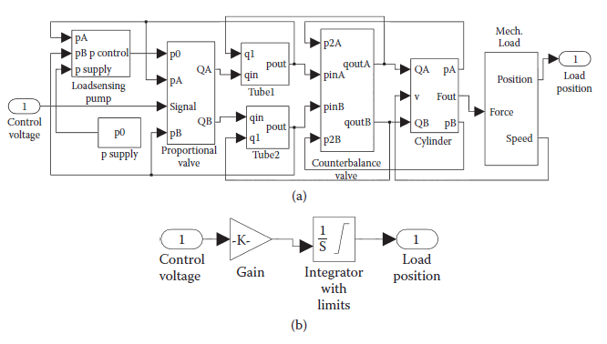

**FIGURE 18.10** Models of hydraulic cylinder drives. (a) Extended functionality, including load sensing pump, proportional valve, tube dynamics, counterbalance valves, cylinder, load; (b)  ultimate simplification of a drive.

**МАЛЮНОК 18.10** Моделі приводів гідроциліндрів. (a) Розширена функціональність, включаючи насос із датчиком навантаження, пропорційний клапан, динаміку трубки, врівноважні клапани, циліндр, навантаження; (b) остаточне спрощення приводу.

Doing this reduction allowed hundreds of models to run on the computer in real time together with other tasks such as communication and visualization. In conclusion, a thorough simplification during the requirement analysis is recommended to obtain a well-performing simulator.

Це зменшення дозволило запускати сотні моделей на комп’ютері в режимі реального часу разом з іншими завданнями, такими як спілкування та візуалізація. Підсумовуючи, рекомендується ретельне спрощення під час аналізу вимог, щоб отримати добре продуктивний симулятор.

### 18.3.4 Simu lation Tool Selection and Program Coding

The requirement analysis in the previous sections was a prerequisite for definitively choosing a simulation tool. The training sequence was defined, the model components were classified, and the basic behavior of moving machine parts was identified. All steps were carried out with the aim to minimize the development expense.

Аналіз вимог у попередніх розділах був необхідною умовою для остаточного вибору інструменту моделювання. Визначено послідовність навчання, класифіковано компоненти моделі та визначено основну поведінку рухомих частин машини. Всі кроки були зроблені з метою мінімізації витрат на розробку.

Most simulation problems in automation are designed as linear processes. For example, a flight landing simulation requires the operator to follow an exact sequence. Any deviation from the sequence causes the disruption of the training. Or, a chemical process has definite sequence steps that must be fulfilled; otherwise, the product would be lost.

Більшість задач моделювання в автоматизації розроблені як лінійні процеси. Наприклад, симуляція посадки в польоті вимагає від оператора дотримання точної послідовності. Будь-яке відхилення від послідовності призводить до зриву навчання. Або хімічний процес має певну послідовність кроків, які повинні бути виконані; інакше продукт буде втрачено.

Quite contrary to these, the maintenance operator in the rolling mill has many degrees of freedom without being punished for an unnecessary, incomplete, or even an incorrect action. In most cases, the person would waste time, but would not destroy machine components. Such a system has a huge amount of possible states, and the preferable modeling method to enable determining which state sequences are irrelevant is the discrete state space approach. This supports a state space search (such as effectively employed in, for example, computer chess) to whittle down all possible scenarios. As a result of the thorough analysis and design described in the previous sections, it turned out that all requirements can be fulfilled with a standard tool. Specific methods of artificial intelligence are not necessary. 

Навпаки, оператор технічного обслуговування на прокатному цеху має багато ступенів свободи, не будучи покараним за непотрібні, неповні чи навіть неправильні дії. У більшості випадків людина витрачає час, але не руйнує компоненти машини. Така система має величезну кількість можливих станів, і кращим методом моделювання для визначення того, які послідовності станів є нерелевантними, є підхід дискретного простору станів. Це підтримує пошук у просторі станів (наприклад, який ефективно використовується, наприклад, у комп’ютерних шахах), щоб зменшити всі можливі сценарії. У результаті ретельного аналізу та розробки, описаних у попередніх розділах, виявилося, що всі вимоги можна виконати за допомогою стандартного інструменту. Спеціальні методи штучного інтелекту не потрібні.

#### 18.3.4.1 Simulation Tool

As the result of the requirement analysis, it was possible to choose a simulation tool that is standard for modeling plant and machinery. The product of choice was Winmod [19].

В результаті аналізу вимог стало можливим вибрати інструмент моделювання, який є стандартним для моделювання установок і машин. Вибраним продуктом був Winmod [19].

##### 18.3.4.1.1 Discrete Time Simulation

This simulation principle is the standard for modeling of physical or chemical processes. The actual simulator for the rolling mill is running in the loop with the logic control (HIL, [Figure 18.4](#_bookmark97)). The time increments have the same order of magnitude as the control program, which is about 0.05 s. Usually, a real-time operating system is required for such short cycle times. Winmod runs under Microsoft Windows with components embedded in some system routines with high priority. Of course, this cannot provide hard real-time behavior [17], but it is sufficient for simulation of systems of low dynamics. Since communication with the control device must fulfil the hard real-time condition, delegated fieldbus hardware (Profibus) in a slot of the simulation computer is used.

Цей принцип моделювання є стандартом для моделювання фізичних або хімічних процесів. Фактичний симулятор для прокатного стану працює в циклі з логічним керуванням (HIL, [Рис. 18.4](#_bookmark97)). Прирости часу мають такий самий порядок величини, як і керуюча програма, тобто приблизно 0,05 с. Зазвичай для таких коротких циклів потрібна операційна система реального часу. Winmod працює під керуванням Microsoft Windows із компонентами, вбудованими в деякі системні процедури з високим пріоритетом. Звичайно, це не може забезпечити жорстку поведінку в реальному часі [17], але цього достатньо для моделювання систем з низькою динамікою. Оскільки зв’язок із пристроєм керування має відповідати умовам жорсткого режиму реального часу, використовується апаратне забезпечення делегованої польової шини (Profibus) у слоті комп’ютера моделювання.

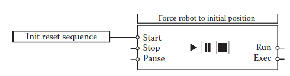

**FIGURE 18.11** Block for generating signal patterns over time. 

##### *18.3.4.1.2*      *Rudimentary Support of Events*

To describe dynamic systems that are driven by events, automation engineers use graphical tools based on the FSM formalism. Defined in the IEC 1131 standard, a language called sequential function chart allows programming of preferably linear chains of discrete steps. In addition to this, Winmod provides a tool to generate signal sequences over time (pattern generation, Figure 18.11). The sequence is defined with a simple text code and the graphical representation has an input to start the sequence. We used this feature to overrule the behavior of the machine model for initialization. This step beyond the physical reality is difficult, since the virtual machine is under the supervision of the actual controller, and error conditions must be avoided. The third possibility to handle events is a library of basic logic elements such as flip flops. All these state-oriented components run within the discrete time system and there is no separate discrete event control.

Для опису динамічних систем, які керуються подіями, інженери з автоматизації використовують графічні інструменти, засновані на формалізмі FSM. Визначена в стандарті IEC 1131 мова, яка називається послідовною функціональною діаграмою, дозволяє програмувати бажано лінійні ланцюги дискретних кроків. На додаток до цього Winmod надає інструмент для генерації сигнальних послідовностей у часі (генерація шаблону, рис. 18.11). Послідовність визначається простим текстовим кодом, а графічне представлення має вхідні дані для початку послідовності. Ми використали цю функцію, щоб скасувати поведінку моделі машини для ініціалізації. Цей крок за межі фізичної реальності складний, оскільки віртуальна машина знаходиться під наглядом фактичного контролера, і слід уникати помилок. Третя можливість обробки подій - це бібліотека основних логічних елементів, таких як тригери. Усі ці орієнтовані на стан компоненти працюють у системі дискретного часу, і окремого дискретного керування подіями немає.

##### 18.3.4.1.3 Graphical Programming

Since engineers prefer graphical descriptions, a representation similar to electric or electronic circuitry is provided. In UML 2.0, this corresponds to the communication diagram.

Оскільки інженери віддають перевагу графічним описам, надається представлення, схоже на електричні чи електронні схеми. В UML 2.0 це відповідає діаграмі зв’язку.

##### 18.3.4.1.4 Object Creation by Composition

Object orientation is an essential concept for all kinds of software systems. Here it is preferred that new objects can be constructed only by combining objects, all derived from classes in a framework library. Some advanced concepts, such as multiple inheritance and object creation during runtime, are not allowed.

Об'єктна орієнтація є важливою концепцією для всіх видів програмних систем. Тут бажано, щоб нові об’єкти можна було створювати лише шляхом комбінування об’єктів, усі похідні від класів у бібліотеці фреймворку. Деякі складні концепції, такі як множинне успадкування та створення об’єктів під час виконання, заборонені.

##### 18.3.4.1.5 Import of Variables

The most powerful feature of a tool designated for machinery simulation is the capability to import variables, inputs, and outputs of the control system directly from its source code. This saves the work to define more than five hundred items for the actual project. 

Найпотужнішою особливістю інструменту, призначеного для моделювання машин, є можливість імпорту змінних, входів і виходів системи керування безпосередньо з її вихідного коду. Це економить роботу з визначення понад п’ятисот елементів для фактичного проекту.

#### 18.3.4.2 Example Details

The program code is a file of graphical drawings, consisting of blocks connected with signal lines (objects and message exchange in software terms). Here two important artifacts from [Figure 18.6 ](#_bookmark98)are explained.

Програмний код - це файл графічних малюнків, що складається з блоків, з'єднаних сигнальними лініями (об'єктами та обміном повідомленнями в програмних термінах). Тут пояснюється два важливі артефакти з [Рис. 18.6 ](#_bookmark98).

##### 18.3.4.2.1 Integrator as Drive Design Pattern

All drives and subassemblies are modeled with first-order behavior (see [Figure 18.12](#_bookmark100)). This makes the basic numerical integrator to a design pattern for these artifacts (left).

Усі диски та вузли моделюються з поведінкою першого порядку (див. [Малюнок 18.12](#_bookmark100)). Це робить базовий чисельний інтегратор для шаблону проектування для цих артефактів (ліворуч).

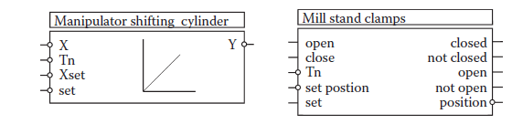

**FIGURE 18.12** Simple drive modeled with integrator (left side); a more complex drive (right).

**МАЛЮНОК 18.12** Простий диск, змодельований з інтегратором (ліва сторона); більш складний привід (праворуч).

More complex drives are composed of several blocks but always have a similar representation (see Figure 18.12, right).

Більш складні диски складаються з кількох блоків, але завжди мають подібне представлення (див. Малюнок 18.12, справа).

##### 18.3.4.2.2 Exception Generator

During a training session, the trainee should resolve exceptional situations. For this reason, faults should be generated, for example, by blocking a cylinder or stalling a signal due to a broken sensor. The trainer may enter a number to select a predefined fault situation. The fault is triggered when the controller (and together with it, the entire plant) is in a certain state (see [Figure 18.8](#_bookmark99)). If the trainee is working alone on the simulator without a trainer, one fault out of a predefined list may be triggered at random. Of course, training without exeption is also possible.

Під час навчального заняття слухач повинен вирішувати виняткові ситуації. З цієї причини несправності повинні виникати, наприклад, блокуванням циліндра або затримкою сигналу через поломку датчика. Тренер може ввести число для вибору попередньо визначеної ситуації помилки. Несправність спрацьовує, коли контролер (а разом з ним і вся установка) перебуває в певному стані (див. [Малюнок 18.8](#_bookmark99)). Якщо учень працює на тренажері сам без інструктора, одна помилка з попередньо визначеного списку може бути викликана випадковим чином. Звичайно, навчання без винятку також можливе.

[18.2 <--- ](18_2.md) [   Зміст   ](README.md) [--> 18.4](18_4.md)