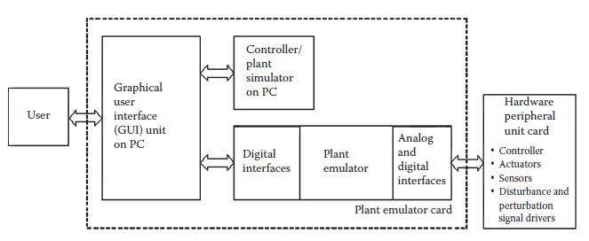
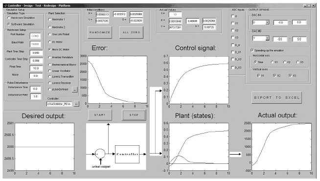

[19.1 <--- ](19_1.md) [   Зміст   ](README.md) [--> 19.3](19_3.md)

## 19.2. STRUCTURE AND FUNCTIONS OF THE CDTRP

The CDTRP comprises four main units, which are a real-time simulator running on a PC, a real-time plant emulator realized in a plant emulator card, a hardware peripheral unit for recreating a physical environment for the plant emulator, and a GUI on the PC that manages the entire platform. The structure and the interconnection of the subunits of CDTRP are depicted in Figure 19.1. The first unit is the software simulator implemented on the PC. It aims to simulate the controller, the plant, and/or the peripheral unit components depending on the operating modes of the platform (i.e., it simulates, for instance, the plant if it is active in the chosen mode of operation). The simulation program consists of MATLAB® 7.04 code and it requires the controller algorithm and plant model as MATLAB code. The simulator is designed to run essentially in real time; however, it can run in any time step faster or slower than real time, which may be preferred depending on the application.

CDTRP складається з чотирьох основних блоків, які включають симулятор реального часу, що працює на ПК, емулятор заводу в режимі реального часу, реалізований у картці емулятора заводу, апаратну периферійну частину для відтворення фізичного середовища для емулятора заводу та графічний інтерфейс користувача на ПК, який керує всією платформою. Структура та взаємозв'язок субодиниць CDTRP зображені на малюнку 19.1. Перший блок – програмний симулятор, реалізований на ПК. Він спрямований на імітацію контролера, установки та/або компонентів периферійного блоку залежно від режимів роботи платформи (тобто моделює, наприклад, установку, якщо вона активна у вибраному режимі роботи). Програма моделювання складається з коду MATLAB® 7.04 і вимагає алгоритму контролера та моделі заводу як код MATLAB. Симулятор розроблено для роботи в основному в режимі реального часу; однак він може працювати на будь-якому часовому етапі швидше або повільніше, ніж у реальному часі, що може бути кращим залежно від програми.

The second unit is the plant emulator card whose core is the PIC microcontroller 18F452. The microcontroller is devoted to emulate the controller, the plant, and/or the peripheral unit components depending on the operating modes of the platform. The plant emulator card also possesses digital and analog interfaces for the communication of the plant emulator with the other units of CDTRP (i.e., the GUI and the hardware peripheral unit card). The PIC is programmed by Custom Computer Services C Program Compiler Version 4.084 software run on the PC before installing it on the plant emulator card, which allows the PIC software to be managed by the GUI and to communicate with the PC and the hardware peripheral unit card. Note that the details on the hardware realization of the emulator card are given in Section 19.5.

Другий блок — це карта емулятора заводу, ядром якої є мікроконтролер PIC 18F452. Мікроконтролер призначений для емуляції контролера, установки та/або компонентів периферійного блоку в залежності від режимів роботи платформи. Плата емулятора заводу також має цифрові та аналогові інтерфейси для зв’язку емулятора заводу з іншими блоками CDTRP (тобто графічним інтерфейсом користувача та платою апаратного периферійного блоку). PIC програмується компілятором програми Custom Computer Services C версії 4.084, який запускається на ПК перед установкою на плату емулятора заводу, що дозволяє програмному забезпеченню PIC керувати за допомогою графічного інтерфейсу користувача та спілкуватися з ПК і платою апаратного периферійного пристрою . Зауважте, що детальна інформація про апаратну реалізацію карти емулятора наведена в розділі 19.5.

The third unit of the CDTRP, that is, the hardware peripheral unit card, is the most flexible part of the platform: depending on the application, it contains a (analog and/or digital) hardware controller, actuators, sensory devices, and signal drivers corresponding to the external disturbance and parameter perturbations to recreate the physical environmental conditions for the plant emulator.

Третій блок CDTRP, тобто апаратна периферійна плата, є найбільш гнучкою частиною платформи: залежно від програми він містить (аналоговий та/або цифровий) апаратний контролер, виконавчі механізми, сенсорні пристрої та сигнальні пристрої. драйвери, що відповідають зовнішнім збуренням і збуренням параметрів, щоб відтворити фізичні умови середовища для емулятора заводу.

The fourth unit of the CDTRP, the GUI, provides the management of the entire platform. The GUI is implemented with more than 2000 lines of MATLAB code in the MATLAB GUI designer tool. The GUI serves as a monitoring and controlling unit for the platform. The GUI manages all operating modes listed in [Tables 19.1](#_bookmark101) through 19.3 and the environmental conditions provided by the hardware peripheral card. A view of the front panel of the GUI is given in Figure 19.2 where the monitoring and controlling tools supplied to the users by the GUI are visible. The main features and management (i.e., monitoring and controlling) facilities of the GUI are presented in more detail in other work [39].

Четвертий блок CDTRP, GUI, забезпечує керування всією платформою. Графічний інтерфейс користувача реалізовано за допомогою понад 2000 рядків коду MATLAB у інструменті конструктора графічного інтерфейсу MATLAB. Графічний інтерфейс користувача служить блоком моніторингу та керування платформою. Графічний інтерфейс користувача керує всіма режимами роботи, переліченими в [таблицях 19.1](#_bookmark101) до 19.3, і умовами навколишнього середовища, що забезпечуються апаратною периферійною платою. Вигляд передньої панелі графічного інтерфейсу наведено на малюнку 19.2, де видно інструменти моніторингу та керування, які надаються користувачам графічним інтерфейсом. Основні функції та засоби управління (тобто моніторингу та контролю) GUI більш детально представлені в іншій роботі [39].

**FIGURE 19.1** Structure of controller design–test–redesign platform.

**FIGURE 19.2** Front panel of the graphical user interface for the platform.

 

[19.1 <--- ](19_1.md) [   Зміст   ](README.md) [--> 19.3](19_3.md)