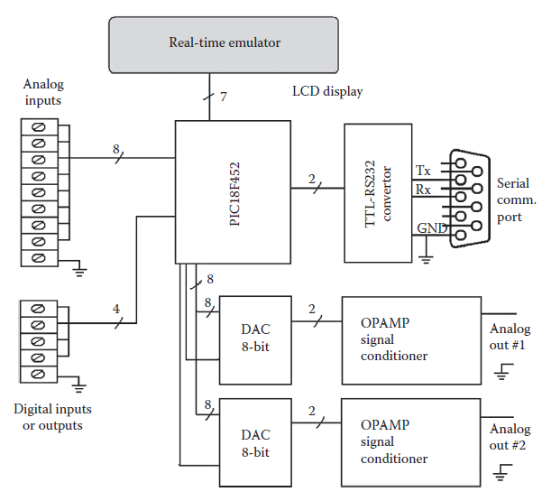

[19.4 <--- ](19_4.md) [   Зміст   ](README.md) [--> 19.6](19_6.md)

## 19.5. IMPLEMENTATION OF THE PLANT EMULATOR CARD WITH PIC MICROCONTROLLER

Microcontrollers that are single-chip computers with limited computer features [41] are widely used for control applications, usually to implement controllers together with digital and analog input interfaces. The plant emulator card of CDTRP has been realized with a PIC18F452 microcontroller. The main reasons for this choice are as follows: (1) It is a low cost and easily programmed device, and so it can be reproduced easily by instructors and students for educational purposes, by engineers for industrial applications, and also by researchers for testing their controllers on emulated plants. (2) Its capability suffices to implement many benchmark plants and even synchronized chaotic systems (Section 19.7.3) and also analog and digital interfaces necessary to communicate with peripheral units for recreating an actual environment in the developed CDTRP.

The schematic diagram of the implemented hardware of the plant emulator card is provided in [Figure 19.3](#_bookmark103). The PIC18F452 microcontroller-based plant emulator card has (1) 32 KB of internal flash Program Memory, (2) 1536-byte RAM area,

(3) 256-byte internal EEPROM, (4) eight channel analog inputs via 10-bit A/D converter, (5) four channel digital input/outputs, and (6) two analog output ports via D/A converter. An LCD character display 4 four lines and 20 columns is also connected to the microcontroller to indicate the outputs and the control inputs of the emulated plant with respect to current time. The PIC18F452 microcontroller is programmed with 5672 lines of C code, which use 95% of the ROM and 27% of the RAM of the microcontroller.

**FIGURE 19.3** Schematic diagram of the hardware of the plant emulator card.

An image of the hardware realization of the plant emulator card is provided in [Figure 19.4](#_bookmark104), where the physical locations of the blocks depicted in the schematic diagram of the plant emulator card are annotated with descriptive tags.

[19.4 <--- ](19_4.md) [   Зміст   ](README.md) [--> 19.6](19_6.md)