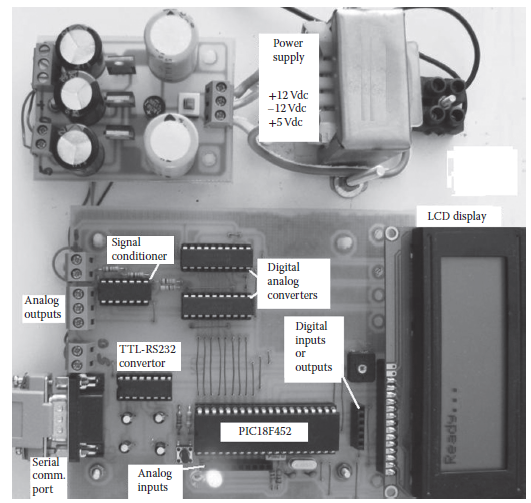
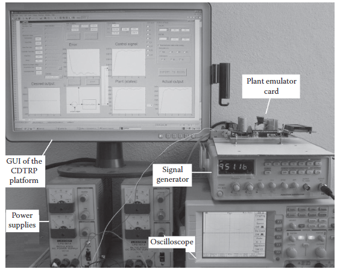
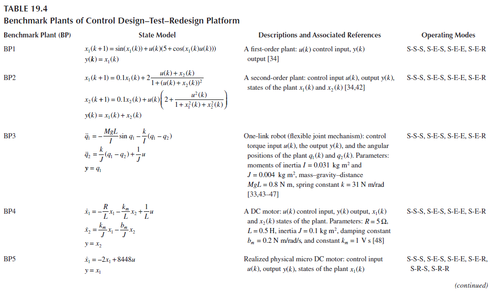
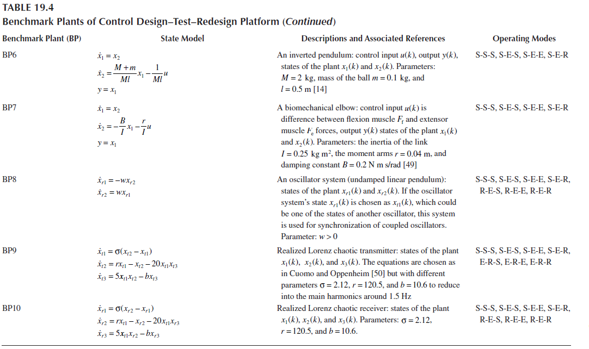

[19.5 <--- ](19_5.md) [   Зміст   ](README.md) [--> 19.7](19_7.md)

## 19.6. EXPERIMENTAL SETUP OF THE DEVELOPED CDTRP

The experimental setup of the developed CDTRP platform is provided in [Figure 19.5](#_bookmark104). It has been used for the design–test–redesigning controllers of the benchmark plants in [Table 19.4 ](#_bookmark105)and other plants by means of operating modes given in [Tables 19.1](#_bookmark101) through 19.3. The CDTRP platform setup is composed of a plant emulator card, a PC, a signal generator, power supplies, and an oscilloscope. The specifications of the plant emulator card have already been provided in Section 19.2. The PC is chosen as having a Centrino processor and a 1 GB memory, which constitute a minimum configuration necessary for running Microsoft Windows XP and MATLAB 7.04 software. The signal generator as part of the hardware peripheral unit card is included to provide external analog signal noise (D_U). Power sources constituting another part of the hardware peripheral unit card are used while DC variacs (i.e., variable power supply) are changed manually to generate the perturbations of the plant variables (D_X1, D_X2, and D_X3).

**FIGURE 19.4** The hardware of the plant emulator card.

**FIGURE 19.5** The experimental setup for the entire controller design–test–redesign platform.

**TABLE** **19.4**  **Benchmark** **Plants** **of** **Control** **Design–Test–Redesign** **Platform**

  

[19.5 <--- ](19_5.md) [   Зміст   ](README.md) [--> 19.7](19_7.md)