[19.6 <--- ](19_6.md) [   Зміст   ](README.md) [--> 19.8](19_8.md)

## 19.7. VERIFICATION AND VALIDATION OF THE CDTRP BASED ON BENCHMARK PLANTS

This subsection presents experimentation results realized for verification and validation of the operating modes of the CDTRP on three physical plants and the results obtained by the investigations on reliable operating frequency of mixed modes of the CDTRP are presented in this subsection.

У цьому підрозділі представлено результати експериментів, реалізованих для перевірки та валідації режимів роботи CDTRP на трьох фізичних установках, і результати, отримані в результаті досліджень надійної робочої частоти змішаних режимів CDTRP, представлені в цьому підрозділі.

### 19.7.1 Benchmark Plants Implemented in CDTR P for Verification of Operating Modes

In this section, the benchmark plants that are implemented as simulation, emulation, or physical hardware for verification of the operating modes of the CDTRP are listed. A set of benchmark plants that can be chosen by the users via the plant selection button in the front panel of the GUI are included in the menu of the CDTRP to help the users expediently analyze their control methods on these selected benchmark plants. This menu is open to be extended by the users to cover a larger class of benchmarks or any other plants of interest. The plants must be defined by at most three-dimensional state equations.*

 У цьому розділі перераховані еталонні установки, які реалізовані як симуляція, емуляція або фізичне обладнання для перевірки робочих режимів CDTRP. Набір еталонних установок, які користувачі можуть вибрати за допомогою кнопки вибору рослин на передній панелі графічного інтерфейсу користувача, включено в меню CDTRP, щоб допомогти користувачам швидко проаналізувати свої методи контролю на цих вибраних еталонних рослинах. Це меню може бути розширене користувачами для охоплення більшого класу тестів або будь-яких інших цікавих установок. Рослини мають бути визначені щонайбільше тривимірними рівняннями стану.*

The benchmark plants available in the menu are listed in [Table 19.4 ](#_bookmark105)and these are also used for verification of the operating modes of the developed CDTRP. The benchmark plants in Table 19.4 are chosen from benchmarks extensively used in the literature (which implies that they are difficult to identify and/or difficult to control) to compare the system identification methods and/or to compare the controller design methods or they are of practical importance in some other sense.

Тестові установки, доступні в меню, перераховані в [Таблиці 19.4 ](#_bookmark105), і вони також використовуються для перевірки режимів роботи розробленого CDTRP. Еталонні установки в таблиці 19.4 вибрані з еталонних тестів, які широко використовуються в літературі (це означає, що їх важко ідентифікувати та/або важко контролювати) для порівняння методів ідентифікації системи та/або для порівняння методів проектування контролера або вони є практичне значення в якомусь іншому сенсі.

### 19.7.2 C ontroller Design, Test, and Redesign by the CDTR P on a Physical Plant: The DC Motor Case

This section is devoted to demonstrating how to implement the controller design– test–redesign procedure introduced in the previous section to reach a controller working well for a physical plant operated under the actual environmental conditions. A micro DC motor is chosen as the plant and the final operating mode is determined as S-R-R, where the PC is used as the controller, the physical plant is the micro DC motor, the sensor, and actuator, that is, the encoder and driver are realized in a PIC microcontroller driver card (see [Figure 19.6](#_bookmark106)). In the initial design stage of the controller design–test–redesign procedure, the S-S-S mode was found to be the most suitable mode for one because of the simulation efficiency of the simple yet realistic DC motor models but also because of its implementation flexibility as observed in a set of experiments conducted in the S-S-S, S-E-S, and S-E-E modes.

Цей розділ присвячено демонстрації того, як реалізувати процедуру проектування контролера – тестування – перепроектування, представлену в попередньому розділі, щоб отримати контролер, який добре працює для фізичної установки, що працює в фактичних умовах навколишнього середовища. Мікродвигун постійного струму вибрано як установку, а кінцевий режим роботи визначається як S-R-R, де ПК використовується як контролер, фізичною установкою є мікродвигун постійного струму, датчик і виконавчий механізм, тобто кодер і драйвер реалізовані в платі драйвера мікроконтролера PIC (див. [Малюнок 19.6](#_bookmark106)). На початковій стадії проектування контролера – випробування – перепроектування процедури було встановлено, що режим S-S-S є найбільш підходящим режимом через ефективність моделювання простих, але реалістичних моделей двигунів постійного струму, а також через гнучкість його реалізації, як спостерігалося у серії експериментів, проведених у режимах S-S-S, S-E-S та S-E-E.

In the test stage, the S-E-E mode was first implemented for testing the considered controller design methods on the emulated plant under emulated environmental conditions. Then, the controller candidates were analyzed in the S-E-R mode. It was found that the S-E-R mode is the most suitable mode for testing the considered control methods, since it enables analysis of the controller candidates under quite realistic conditions, while still providing flexibility in simulating different controller candidates efficiently. In the redesign stage, the S-R-S and S-R-E modes were implemented at the beginning and then the S-R-R mode was implemented as the final mode where the parameters of the controller that were found to be the best in the test stage were tuned.

На стадії тестування режим S-E-E вперше був реалізований для тестування розглянутих методів проектування контролера на емульованому заводі в емульованих умовах навколишнього середовища. Потім кандидатів у контролери аналізували в режимі S-E-R. Було встановлено, що режим S-E-R є найбільш підходящим режимом для тестування розглянутих методів керування, оскільки він дає змогу аналізувати кандидатів у контролери за цілком реалістичних умов, забезпечуючи при цьому гнучкість у ефективній симуляції різних кандидатів у контролери. На етапі редизайну режими S-R-S і S-R-E були реалізовані на початку, а потім режим S-R-R був реалізований як остаточний режим, де параметри контролера, які були визнані найкращими на етапі тестування, були налаштовані.

\* This restriction is because of the capacity limit of the chosen emulator hardware (i.e., PIC18F452).

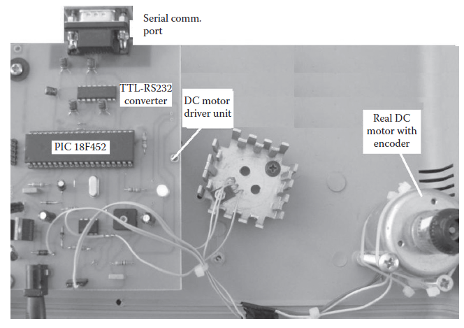

**FIGURE 19.6** DC motor hardware whose driver unit is based on PIC for S-R-R mode.

The details of the above explained steps of the implementation of the controller design–test–redesign procedure for the DC motor example are presented next.

**МАЛЮНОК 19.6** Апаратне забезпечення двигуна постійного струму, драйвер якого базується на PIC для режиму S-R-R.

Далі представлені деталі описаних вище етапів реалізації процедури проектування–випробування–перепроектування контролера для прикладу двигуна постійного струму.

#### 19.7.2.1 Implementation of the Physical Plant Together with Its Physical Actuator and Sensor Units

A micro DC motor was considered. The DC motor driver card (see Figure 19.6) was realized with a PIC18F452 microcontroller driver unit that has a serial interface to communicate with the PC. The speed of the motor was considered as the output and was measured by an encoder to provide feedback to the system. The microcontrollerbased driver unit drives the DC motor speed revolutions per minute (rpm) via pulse width modulation (PWM) changing between 0% and 100%. That is to say, in the implemented S-R-S, S-R-E, and S-R-R operating modes, the control signal from CDTRP is converted into a PWM signal to control physical DC motor speed rpm.

Розглядався мікродвигун постійного струму. Плата драйвера двигуна постійного струму (див. рис. 19.6) була реалізована за допомогою блоку драйвера мікроконтролера PIC18F452, який має послідовний інтерфейс для зв’язку з ПК. Швидкість двигуна вважалася вихідним сигналом і вимірювалася кодером для забезпечення зворотного зв’язку з системою. Блок драйвера на основі мікроконтролера керує частотою обертів двигуна постійного струму за хвилину (об/хв) за допомогою широтно-імпульсної модуляції (ШІМ), змінюючи від 0% до 100%. Тобто в реалізованих режимах роботи S-R-S, S-R-E та S-R-R керуючий сигнал від CDTRP перетворюється на ШІМ-сигнал для керування фізичною швидкістю обертів двигуна постійного струму.

#### 19.7.2.2 Identification of DC Motor to Obtain a Model to Be Simulated and Emulated

To simulate and also emulate the physical DC motor in the simulated-plant and emulated-plant modes that are to be used for the design and test stages, a system identification procedure was applied to the physical DC motor and then the simplest yet realistic model for the considered micro DC motor was obtained.* (\* It should be noted that although more complicated models better suited to the real data measured from the DC motor can be derived, it was preferred to work with this simple model for the plant. Not only does the simple model allow taking advantage of efficient simulation and emulation of the DC motor, but it also allows more focus on testing the controllers’ performances on the considered DC motor and on its simulated/emulated model in a comparative way, rather than on simulating/emulating the DC motor more realistically by more complicated models. In fact, it was observed that choosing a simple first-order dynamic model for the DC motor that was identified by using a step response method provides sufficiently close responses to the ones measured from the physical DC motor and also enables seeing the differences among the performances of the different controllers implemented.)

Для моделювання, а також імітації фізичного двигуна постійного струму в режимах симуляції заводу та емуляції заводу, які будуть використовуватися на стадіях проектування та тестування, процедуру ідентифікації системи було застосовано до фізичного двигуна постійного струму, а потім найпростішу, але реалістичну модель для було отримано розглянутий мікродвигун постійного струму.* (\* Слід зазначити, що хоча складніші моделі, які краще підходять для реальних даних, виміряних від двигуна постійного струму, можуть бути отримані, було віддано перевагу працювати з цією простою моделлю для заводу. Не лише проста модель дозволяє скористатися перевагами ефективного моделювання та емуляції двигуна постійного струму, але вона також дозволяє більше зосередитися на тестуванні продуктивності контролерів на розглянутому двигуні постійного струму та на його змодельованій/емульованій моделі в порівнянні, а не на симуляція/емуляція двигуна постійного струму більш реалістично за допомогою більш складних моделей.Насправді було помічено, що вибір простої динамічної моделі першого порядку для двигуна постійного струму, яка була ідентифікована за допомогою кроку r Метод esponse забезпечує досить близькі відгуки до тих, що вимірюють від фізичного двигуна постійного струму, а також дозволяє побачити відмінності між продуктивністю різних реалізованих контролерів.)

A step function, which is obtained by changing PWM sharply, was fed to the physical DC motor plant. The input–output data pairs of the plant necessary for the identification were measured via the hyper-terminal of the PC. After the process of data gathering, the transfer function of the plant was found under the assumption of a single-input single-output linear dynamic system for the plant. It is known [44,51] that the physical DC motor plant can be well modeled as a first-order delayed dynamic system according to the response of the plant due to the step input. The step response of the first-order system defined with three parameters is provided in the Laplace and time domain, respectively, as follows:

Ступінчаста функція, яка отримується шляхом різкої зміни ШІМ, подається на фізичну установку двигуна постійного струму. Пари вхідних і вихідних даних заводу, необхідні для ідентифікації, вимірювалися через гіпертермінал ПК. Після процесу збору даних була знайдена передавальна функція заводу за припущення лінійної динамічної системи з одним входом і одним виходом. Відомо [44,51], що фізичну установку двигуна постійного струму можна добре змоделювати як динамічну систему першого порядку із затримкою відповідно до відгуку установки через кроковий вхід. Східчаста характеристика системи першого порядку, визначена трьома параметрами, надається в області Лапласа та часовій області, відповідно, таким чином:

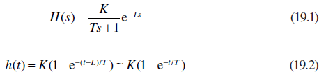

where *T* is the time constant, *L* is the dead-time, and *K* is the gain [52]. If the dead-time *L* is sufficiently small compared to the time constant *T* of the plant, the step response of the system can be approximated as shown in Equation 19.2. Thus, a first-order micro DC motor model (BP5 in [Table 19.4](#_bookmark105)) was obtained with the measured maximum motor speed 4224 rpm, the time constant 0.5 s, and the dead-time 0.011 s. This model was used for the S-S-S, S-E-S, S-E-E, S-E-E, and S-E-R operating modes of the CDRTP. Although the first-order system is sufficient to model the physical micro DC motor for testing the candidate controllers, a second-order model is also identified and implemented for validating the emulator of the platform by analyzing the emulation performance of the platform with a more realistic model. The considered second- order delay dynamic system model is defined in the Laplace domain as follows:

де *T* — постійна часу, *L* — мертвий час, а *K* — підсилення [52]. Якщо мертвий час *L* достатньо малий порівняно з постійною часу *T* установки, ступінчасту реакцію системи можна приблизно оцінити, як показано в рівнянні 19.2. Таким чином, була отримана модель мікродвигуна постійного струму першого порядку (BP5 у [Таблиці 19.4](#_bookmark105)) з виміряною максимальною швидкістю двигуна 4224 об/хв, постійною часом 0,5 с і мертвим часом 0,011 с. Ця модель використовувалася для режимів роботи S-S-S, S-E-S, S-E-E, S-E-E і S-E-R CDRTP. Хоча системи першого порядку достатньо для моделювання фізичного мікродвигуна постійного струму для тестування потенційних контролерів, модель другого порядку також визначена та реалізована для перевірки емулятора платформи шляхом аналізу продуктивності емуляції платформи за допомогою більш реалістичного модель. Розглянута модель динамічної системи із затримкою другого порядку визначається в області Лапласа наступним чином:

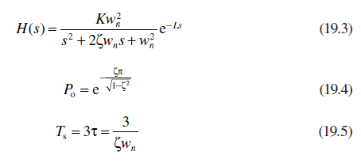

where *K* is the gain, *L* is the dead-time, z is the damping ratio, and *wn* is the natural frequency. The damping ratio and natural frequency were determined from the *P*o overshoot percentage in Equation 19.4 and *T*s settling time in Equation 19.5 [52]. The second-order micro DC motor model was obtained based on the measured *P*o of 10%, *T*s of 4.46, and the dead-time of 0.011 s.

де *K* — підсилення, *L* — мертвий час, z — коефіцієнт демпфування, а *wn* — власна частота. Коефіцієнт демпфування та власна частота були визначені за відсотком перерегулювання *P*o у рівнянні 19.4 та часу встановлення *T*s у рівнянні 19.5 [52]. Модель мікродвигуна постійного струму другого порядку була отримана на основі виміряного *P*o 10%, *T*s 4,46 і мертвого часу 0,011 с.

#### 19.7.2.3 Recreating the Disturbance and Parameter Perturbation Effects* 

The disturbance and parameter perturbation effects that can be implemented in the emulator by means of the signal generator and power supply components of the hardware peripheral unit were produced in the implemented S-E-R and S-R-R modes to recreate an actual environment. Since there is no such interface possibility of the simulators running on the PCs and emulators in the simulation/emulation platforms known in the literature, this is a unique feature of the developed CDTRP platform.

Ефекти збурення та збурення параметрів, які можуть бути реалізовані в емуляторі за допомогою генератора сигналів і компонентів джерела живлення периферійного апаратного блоку, були створені в реалізованих режимах S-E-R і S-R-R для відтворення реального середовища. Оскільки немає такої можливості інтерфейсу симуляторів, що працюють на ПК та емуляторів у платформах моделювання/емуляції, відомих у літературі, це є унікальною особливістю розробленої платформи CDTRP.

#### 19.7.2.4 Controller Design–Test–Redesign Process

The DC motor speed tracking problem was chosen as a case study. The following four different types of controllers were designed using mainly the S-S-S, S-E-S, and S-E-E modes, then tested using the S-E-E and S-E-R modes on the identified model BP5, and finally using the S-R-S, S-R-E, and S-R-R modes on the realized micro DC motor: (1) a proportional-integral-derivative (PID) controller designed by the Ziegler–Nichols (ZN) method [13,14,52], (2) a PID controller designed by the Chien, Hrones, and Reswick (CHR) method [53], (3) a robust controller designed by the partitioned robust control (PRC) method [54], and (4) a direct adaptive controller designed by the Model Reference Adaptive Control (MRAC) method [54].

В якості прикладу було обрано задачу відстеження швидкості двигуна постійного струму. Наступні чотири різні типи контролерів були розроблені з використанням головним чином режимів S-S-S, S-E-S і S-E-E, потім протестовані з використанням режимів S-E-E і S-E-R на ідентифікованій моделі BP5 і, нарешті, з використанням режимів S-R-S, S-R-E і S-R-R на реалізованому мікро постійному струмі. двигун: (1) пропорційно-інтегрально-похідний (ПІД) регулятор, розроблений за методом Циглера–Ніколса (ZN) [13,14,52], (2) ПІД-регулятор, розроблений Чієном, Хронесом і Ресвіком (CHR ) метод [53], (3) надійний контролер, розроблений методом розділеного надійного керування (PRC) [54], і (4) прямий адаптивний контролер, розроблений методом еталонного адаптивного керування (MRAC) [54].

A PID controller that defines the control signal *u* in terms of the error is given as follows:

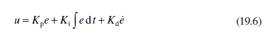

where *e* is the error between the desired and actual output of the plant, *e* is the derivative with respect to time of the error, and *K*p, *K*i, and *K*d are the proportional, integral, and derivative gain parameters, respectively. In the first method, the parameters of the PID controller were calculated based on the BP5 plant model as *K*p = 54.54, *K*i = 2479.3, and *K*d = 0.3 by using the ZN step response method. In the second method (CHR), which was preferred for yielding minimum overshooting [12], the PID controller parameters were calculated* as *K*p = 43.18, *K*i = 1635.6, and *K*d = 0.1995. The PRC is designed as having two separate parts: (1) proportional-derivative (PD) control *ue* and (2) auxiliary control *uy* [54,55]. In this method, given a plant model *x* = -*ax* + *bu* (e.g., BP5 model), the control signal was calculated as follows:

де *e* — похибка між бажаною та фактичною продуктивністю установки, *e* — похідна за часом помилки, а *K*p, *K*i і *K*d — пропорційні , інтегральний і похідний параметри підсилення відповідно. У першому методі параметри ПІД-регулятора були розраховані на основі моделі установки BP5 як *K*p = 54,54, *K*i = 2479,3 і *K*d = 0,3 за допомогою методу ступінчастої характеристики ZN. У другому методі (CHR), якому надавали перевагу для отримання мінімального перевищення [12], параметри ПІД-регулятора були розраховані* як *K*p = 43,18, *K*i = 1635,6 і *K*d = 0,1995. PRC складається з двох окремих частин: (1) пропорційно-похідного (PD) керування *ue* та (2) допоміжного керування *uy* [54,55]. У цьому методі, враховуючи модель заводу *x* = -*ax* + *bu* (наприклад, модель BP5), керуючий сигнал обчислювався таким чином:

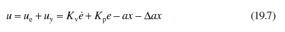

where *Kv* and *K*p gains related to the control input *u*e were chosen greater than zero, and for the auxiliary controller *uy*D*a* = 1.2*a* was chosen for removing the parameter perturbations and plant uncertainties. In the fourth method applied, the MRAC controller is composed of a first-order reference model *x* *m*, two adaptive controller parameters *u* *k*, *u* *k*, and a control signal *u* as follows:

де *Kv* і *K*p підсилення, пов’язані з керуючим входом *u*e, були обрані більшими за нуль, а для допоміжного регулятора *uy*D*a* = 1,2*a* було обрано для усунення збурень параметрів і завод невизначеності. У застосованому четвертому методі контролер MRAC складається з еталонної моделі першого порядку *x* *m*, двох адаптивних параметрів контролера *u* *k*, *u* *k* та керуючого сигналу *u* наступним чином:

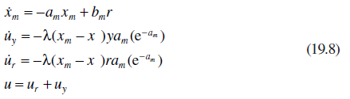

where *y* stands for the actual output, r stands for the reference signal, the designed parameter was chosen as l = 0.5, and the values of the reference model parameters *am* and *bm* are two times the values of the BP5 plant parameters. The equations in Equation 19.8 generate the control signal.

де *y* позначає фактичний вихід, r позначає опорний сигнал, проектований параметр вибрано як l = 0,5, а значення параметрів еталонної моделі *am* і *bm* у два рази перевищують значення BP5 параметри заводу. Рівняння в рівнянні 19.8 генерують керуючий сигнал.

 \* The considered PID controller is actually redesigned at this step within the terminology introduced in this chapter.

#### 19.7.2.5 The Simulation, Emulation, and Physical Measurement Results Obtained along the Entire Design Process
Implemented by CDTRP

The step responses of the physical DC motor and the BP5 implemented in the emulator (both controlled by the same controllers designed with the above-mentioned methods) for the desired output of 2500 rpm are given in Figure 19.7a through d, respectively. It can be seen from the responses depicted in [Figure 19.7 ](#_bookmark107)that one may prefer the first two controllers, that is, the ones designed by the ZN and CHR methods, since the step responses of the emulator have relatively short rise times and are close to the reference signal, that is, the step function. However, the responses of the physical DC motor controlled by these two controllers for the same step input are not close to the emulated first-order model responses in the sense that the physical DC motor demonstrates second-order dynamic behavior rather than first-order.* On the contrary, the responses to the step input of the physical DC motor and the emulated first-order model are very close to each other for the MRAC case.

Відповіді кроку фізичного двигуна постійного струму та BP5, реалізованого в емуляторі (обидва керуються тими самими контролерами, розробленими за допомогою вищезгаданих методів) для бажаної вихідної швидкості 2500 об/хв наведені на рисунку 19.7a–d відповідно. З відповідей, зображених на [Рисунок 19.7] (#_bookmark107), можна побачити, що можна віддати перевагу першим двом контролерам, тобто тим, які розроблені методами ZN і CHR, оскільки відповіді кроку емулятора мають відносно короткий підйом. разів і близькі до опорного сигналу, тобто ступінчастої функції. Однак реакції фізичного двигуна постійного струму, керованого цими двома контролерами, для одного крокового введення не близькі до емульованих відповідей моделі першого порядку в тому сенсі, що фізичний двигун постійного струму демонструє динамічну поведінку другого порядку, а не першого порядку. * Навпаки, реакції на ступінчастий вхід фізичного двигуна постійного струму та емульованої моделі першого порядку дуже близькі одна до одної для випадку MRAC.

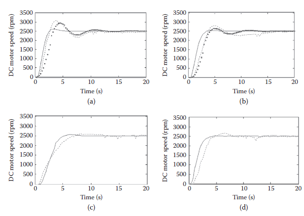

**FIGURE 19.7** Physical DC motor S-R-R results (dashed), real-time emulator S-E-S results for first-order model (solid), and real-time emulator S-E-S results for second-order model (dotted) with (a) a proportional-integral-derivative (PID) controller whose parameters are designed by the Ziegler–Nichols method, (b) a PID controller whose parameters are designed by the Chien, Hrones, and Reswick method, (c) a partitioned robust controller, and (d) a Model Reference Adaptive controller

**МАЛЮНОК 19.7** Фізичні результати S-R-R двигуна постійного струму (пунктир), результати S-E-S емулятора реального часу для моделі першого порядку (суцільний) і результати S-E-S емулятора реального часу для моделі другого порядку (пунктир) з (a) a пропорційно-інтегрально-похідний (ПІД) регулятор, параметри якого розроблені за методом Циглера–Ніколса, (б) ПІД-регулятор, параметри якого розроблені за методом Чієна, Хронса та Ресвіка, (в) розділений надійний контролер, і ( d) еталонний адаптивний контролер

The following can then be concluded: (1) it can be expected that the real plant will behave similar to the emulator for the PRC and MRAC even if the plant model poorly reflects the behavior of the physical plant and (2) it can be expected that the physical plant will behave similar to the emulator for the PID controllers designed by the ZN and CHR methods only when the plant model is realistic so as to be capable of reflecting the behavior of the real plant well. So, the analysis results obtained from the developed CDTRP in the emulated-plant and also the simulated-plant modes are reliable on the realistic plant models for any kind of controller design methods and further reliable even on poor plant models for the PRC and MRAC design methods.

Тоді можна зробити наступний висновок: (1) можна очікувати, що справжня установка буде поводитися подібно до емулятора для PRC і MRAC, навіть якщо модель установки погано відображає поведінку фізичної установки, і (2) можна очікувати, що що фізична установка буде поводитися подібно до емулятора для ПІД-регуляторів, розроблених методами ZN і CHR, тільки якщо модель установки є реалістичною, щоб вона могла добре відображати поведінку реальної установки. Таким чином, результати аналізу, отримані від розробленого CDTRP в емульованому заводі, а також в режимах імітованого заводу, є надійними на реалістичних моделях заводу для будь-яких типів методів проектування контролера та надійні навіть на поганих моделях заводу для проектування PRC та MRAC методи.

#### 19.7.2.6 Recreating the Parameter Perturbations in the S-E-R Mode

Parameter perturbations were created as a multiplicative effect for the model parameters. The perturbation signals were provided by DC power source in the 0–5 V (DC) range and were fed to the hardware peripheral unit card via the D_X1 port that was activated by the ADC options in the GUI, where 1 V for D_X1 corresponds to the nominal plant parameters case. The observed responses of the emulated BP5 controlled by the PRC for four different parameter values are given in Figure 19.8a. The responses observed for the MRAC case are given in Figure 19.8b. In addition, the responses obtained for the PRC and MRAC are compared to each other in terms of their performances for two parameter perturbation values in [Figure 19.9](#_bookmark109). No results are depicted for the PID controller case, since it behaves very poorly in the face of parameter variations. It can be said that the responses under parameter variations are close to each other for the PRC and MRAC. As observed in the above analysis part, (1) choosing more realistic models yields better emulation results to be obtained by the CDTRP platform and (2) for the MRAC and to a lesser extent for the PRC cases, the responses of the emulator are very close to the physical plant. In light of these facts, it may be concluded that the performances of the controllers on the physical plants under parameter perturbations can be examined using S-E-R mode in the manner that the CDTRP implements.

Збурення параметрів були створені як мультиплікативний ефект для параметрів моделі. Сигнали збурень надавалися джерелом живлення постійного струму в діапазоні 0–5 В (постійного струму) і подавалися на карту апаратного периферійного пристрою через порт D_X1, який був активований параметрами АЦП у графічному інтерфейсі користувача, де 1 В для D_X1 відповідає випадок номінальних параметрів установки. Спостережувані відповіді емульованого BP5 під контролем PRC для чотирьох різних значень параметрів наведено на малюнку 19.8a. Відповіді, спостережувані для випадку MRAC, наведені на малюнку 19.8b. Крім того, відповіді, отримані для PRC і MRAC, порівнюються один з одним з точки зору їх продуктивності для двох значень збурення параметра на [Рис. 19.9] (#_bookmark109). Жодних результатів не зображено для випадку ПІД-регулятора, оскільки він поводиться дуже погано в умовах зміни параметрів. Можна сказати, що відповіді за варіаціями параметрів близькі одна до одної для PRC та MRAC. Як було зазначено в наведеній вище частині аналізу, (1) вибір більш реалістичних моделей дає кращі результати емуляції, які може отримати платформа CDTRP, і (2) для випадків MRAC і, меншою мірою, для випадків КНР, відповіді емулятора є дуже близько до фізичної рослини. У світлі цих фактів можна зробити висновок, що продуктивність контролерів на фізичних установках під час збурень параметрів можна перевірити за допомогою режиму S-E-R у спосіб, який реалізує CDTRP.

#### 19.7.2.7 Recreating Noise Disturbance in the S-E-R Mode

Noise disturbances were created as additive to the control signal (i.e., input of the plant model). The noise signal was provided by the signal generator whose range is given in [Table 19.5](#_bookmark108). It was fed to the hardware peripheral unit card via D_U port that is activated by the ADC options in the GUI. The noise signal amplitude can be scaled via the front panel of the GUI for CDTRP applications. For the noise signal du = 0.1 sin(2π*f* ) with *f* = 1Hz, which was created by the noise scaling factor of 0.1 set by using the front panel of the GUI, the corresponding responses obtained for PID, PRC, and MRAC are given in [Figure 19.10](#_bookmark110). As expected, the CDTRP confirms that the PID has quite poor performance under the applied additive noise, whereas the PRC and MRAC perform well. It should be noted that the MRAC shows the best steady state performance.

Шумові перешкоди створювалися як доповнення до керуючого сигналу (тобто введення моделі установки). Шумовий сигнал надавався генератором сигналів, діапазон якого наведено в [таблиці 19.5] (#_bookmark108). Він подавався на карту апаратного периферійного пристрою через порт D_U, який активується параметрами АЦП у графічному інтерфейсі користувача. Амплітуду шумового сигналу можна масштабувати за допомогою передньої панелі графічного інтерфейсу користувача для програм CDTRP. Для шумового сигналу du = 0,1 sin(2π*f*) з *f* = 1 Гц, який був створений коефіцієнтом масштабування шуму 0,1, встановленим за допомогою передньої панелі GUI, відповідні відповіді, отримані для PID, PRC, і MRAC наведено на [Малюнок 19.10] (#_bookmark110). Як і очікувалося, CDTRP підтверджує, що PID має досить низьку продуктивність за застосованого додаткового шуму, тоді як PRC і MRAC працюють добре. Слід зазначити, що MRAC показує найкращу стабільну продуктивність.

\* As seen in Figures 19.7a and b, the responses of the emulated second-order system model are much closer to the real DC motor responses.

\* Як видно на малюнках 19.7a і b, відгуки емульованої моделі системи другого порядку набагато ближчі до реальних відгуків двигуна постійного струму.

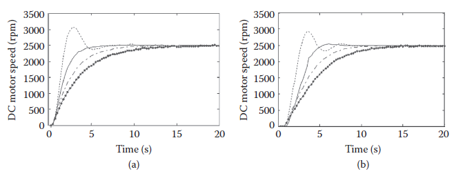

**FIGURE 19.8** Responses of BP5 to the step input for parameter variation coefficients of 0.5 (dashed, --), 1 (solid, -), 1.5 (dotted-solid, -·), and 2 (dotted on solid, -·-). Note that the coefficient values are the factors multiplying the nominal parameter value to obtain the perturbed parameter. The responses in (a) and (b) are for the partitioned robust controller and the Model Reference Adaptive controller, respectively.

**МАЛЮНОК 19.8** Відповіді BP5 на покроковий вхід для коефіцієнтів варіації параметра 0,5 (пунктир, --), 1 (суцільний, -), 1,5 (суцільний пунктир, -·) і 2 (суцільний пунктир, -·-). Зверніть увагу, що значення коефіцієнтів є множниками номінального значення параметра для отримання збуреного параметра. Відповіді в (a) і (b) стосуються розділеного надійного контролера та адаптивного контролера Model Reference, відповідно.

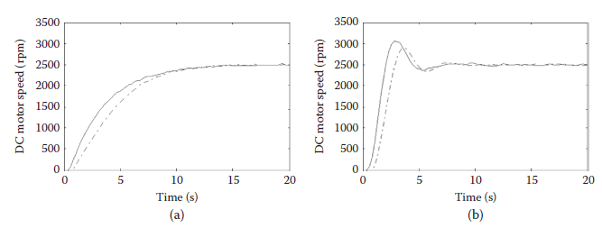

**FIGURE 19.9** Responses of BP5 to the step input for the parameter variation coefficients of 2 in (a) and 0.5 in (b). The responses (solid) and (dotted-solid, -·) were obtained for the partitioned robust controller and the Model Reference Adaptive controller, respectively.

**МАЛЮНОК 19.9** Відповіді BP5 на покрокове введення для коефіцієнтів варіації параметра 2 у (a) та 0,5 у (b). Відповіді (суцільний) і (суцільний пунктир, -·) були отримані для розділеного надійного контролера та адаптивного контролера Model Reference, відповідно.

| **TABLE** **19.5**  **Noise** **Disturbances** **Range** **Scaling** |                               |
| ------------------------------------------------------------ | ----------------------------- |
| **Volt (AC)** **from Signal** **Generator**                  | **Volt** **(DC)** **for ADC** |
| +1 V                                                         | 5 V                           |
| 0 V                                                          | 2.5  V                        |
| –1 V                                                         | 0 V                           |

 

**FIGURE 19.10** Responses of the emulator controlled by proportional-integral-derivative controller (dashed, --), partitioned robust controller (solid, -), and Model Reference Adaptive controller (dotted-solid, -·) under the noise du = 0.1 sin(2π*1t*).

**МАЛЮНОК 19.10** Реакції емулятора, керованого пропорційно-інтегрально-похідним контролером (штриховий, --), розділеним надійним контролером (суцільним, -) і еталонним адаптивним контролером моделі (суцільним пунктиром, -·) на шум du = 0,1 sin(2π*1t*).

#### 19.7.2.8 Response to Single Short-in-Time Large-in-Amplitude Pulse Disturbance in the S-E-R and S-R-R Modes

Recreating the effects of relatively small amplitude noise disturbances in the emulation have been presented above. Now, another kind of disturbance effect, that is, a single short-in-time and large-in-amplitude pulse disturbance effect was created and applied to both the emulated BP5 model and the physical DC motor. This enables a better understanding of the validity of the developed platform in mimicking the behavior of the physical plants under actual disturbances. The disturbance was created as a multiplicative effect to the output of the model. The pulse time and amplitude were chosen in the front panel of the GUI. In the tests, the pulses were created after the transient regime (e.g., at 10 s as shown in [Figure 19.11](#_bookmark111)) to mimic the disturbances appearing in the steady state working conditions for the plant. The measured responses of the physical DC motor and the emulator controlled by the PID, robust, and MRAC controllers are given in Figure 19.11. 

Вище було представлено відтворення ефектів шумових збурень відносно невеликої амплітуди в емуляції. Тепер був створений інший вид збурювального ефекту, тобто єдиний короткий за часом і з великою по амплітуді імпульсний збурюючий ефект, який був застосований як до емульованої моделі BP5, так і до фізичного двигуна постійного струму. Це дає змогу краще зрозуміти ефективність розробленої платформи для імітації поведінки фізичних установок за реальних порушень. Збурення було створено як мультиплікативний ефект на вихід моделі. Час та амплітуду імпульсу вибирали на передній панелі GUI. Під час випробувань імпульси створювалися після перехідного режиму (наприклад, через 10 с, як показано на [Рис. 19.11](#_bookmark111)), щоб імітувати порушення, що з’являються в умовах стаціонарної роботи установки. Виміряні відгуки фізичного двигуна постійного струму та емулятора, керованого контролерами PID, robust і MRAC, наведено на малюнку 19.11.

### 19.7.3 Investigation of Reliable Operating Frequency of Mixed Modes of CDTR P: Coupled Oscillators as Benchmarks

All mixed operating modes of CDTRP require at least two of the controller, plant, and peripheral components to be implemented in different units of CDTRP, that is, in two of the simulator (PC), the emulator, and the hardware peripheral unit. So, the mixed modes necessitate real-time compatibility of the PC, emulator, and hardware peripheral unit. In other words, these units have to communicate in a (real-time) synchronized fashion. To examine this ability of the CDTRP, Lorenz systems–based chaotic synchronization is chosen as the benchmark application. As will be seen below, chaotic synchronization is a good example to understand the operating (frequency) limits of the CDTRP.

Усі змішані режими роботи CDTRP вимагають, щоб принаймні два компоненти контролера, установки та периферійних пристроїв були реалізовані в різних блоках CDTRP, тобто в двох симуляторі (ПК), емуляторі та периферійному апаратному блоці. Таким чином, змішані режими вимагають сумісності в реальному часі ПК, емулятора та апаратного периферійного блоку. Іншими словами, ці пристрої мають спілкуватися синхронізовано (у реальному часі). Щоб перевірити цю здатність CDTRP, хаотичну синхронізацію на основі систем Лоренца вибрано як еталонну програму. Як буде показано нижче, хаотична синхронізація є хорошим прикладом для розуміння робочих (частотних) обмежень CDTRP.

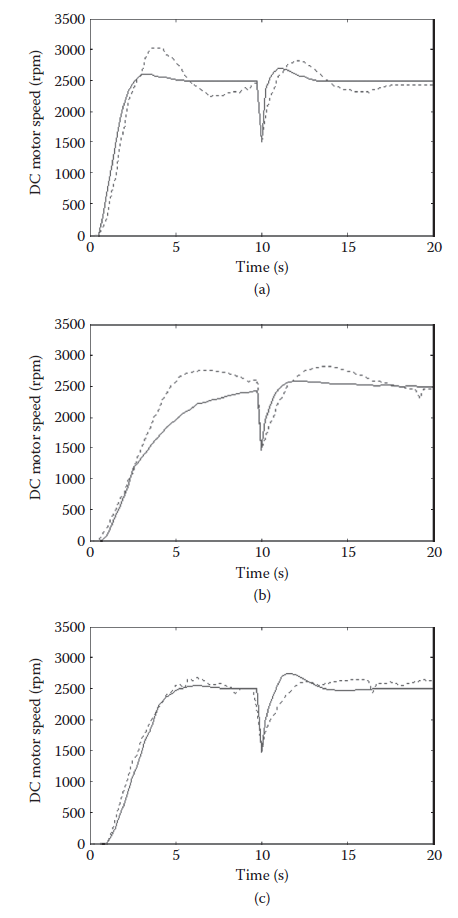

**FIGURE 19.11** Responses of the physical DC motor and the emulator controlled by the proportional-integral-derivative (whose parameters are calculated with the Ziegler-Nichols method), robust, and Model Reference Adaptive controllers are given, respectively, in (a), (b), and (c). The pulse amplitude is chosen as *k* = 0.6 and the time when the pulse is applied as 10 s. Note that (dashed, --) is for the physical plant and (solid, -) is for the emulator of CDTRP.

**МАЛЮНОК 19.11** Відповіді фізичного двигуна постійного струму та емулятора, керованого пропорційно-інтегрально-похідною (параметри якого обчислюються за методом Циглера-Ніколса), надійного та адаптивного контролерів за еталонною моделлю, наведено, відповідно, у ( a), (b) і (c). Амплітуда імпульсу вибирається як *k* = 0,6, а час, коли подається імпульс, становить 10 с. Зауважте, що (штриховий, --) для фізичної установки, а (суцільний, -) для емулятора CDTRP.

The following were observed* in a set of experiments conducted:

1. The emulator and the simulator cannot be synchronized to each other and to external hardware because of the high frequency dynamics intrinsic to the chaotic (Lorenz) system.

2. As a consequence of the maximum achievable sampling frequency that can be realized in the MATLAB environment used for the PC simulator and in the emulator implemented by using the PIC microcontroller, the simulator and the emulator of the developed CDTRP can be synchronized to each other when implementing the dynamics up to 25 Hz while the simulator and the emulator can implement the dynamics up to 300 Hz and 25 Hz, respectively, if they are operated as uncoupled.

3. The frequency range of the simulated/emulated system dynamics for which mutual synchronization among the emulator, the simulator, and the external hardware are achievable can be enlarged by using a suitable feedback control.

У ряді проведених експериментів спостерігалося* таке:

1. Емулятор і симулятор не можуть бути синхронізовані один з одним і із зовнішнім апаратним забезпеченням через високочастотну динаміку, притаманну хаотичній (Лоренца) системі.

2. Як наслідок максимально досяжної частоти дискретизації, яка може бути реалізована в середовищі MATLAB, що використовується для симулятора ПК, і в емуляторі, реалізованому за допомогою мікроконтролера PIC, симулятор і емулятор розробленого CDTRP можуть бути синхронізовані один з одним при реалізації динаміки до 25 Гц, тоді як симулятор і емулятор можуть реалізувати динаміку до 300 Гц і 25 Гц відповідно, якщо вони працюють як незв'язані.

3. Діапазон частот симульованої/емульованої динаміки системи, для якого можлива взаємна синхронізація між емулятором, симулятором і зовнішнім апаратним забезпеченням, може бути розширений за допомогою відповідного керування зворотним зв’язком.

In the sequel, the experimental results obtained for a set of different kinds of implementations of synchronized coupled Lorenz systems are given first and then the coupled linear undamped pendulums are examined to find the limit for the frequency that enables synchronous operation for the implemented dynamics. 

У подальшому спочатку наводяться експериментальні результати, отримані для набору різних типів реалізацій синхронізованих зв’язаних систем Лоренца, а потім досліджуються зв’язані лінійні незатухаючі маятники, щоб знайти межу для частоти, яка забезпечує синхронну роботу для реалізованої динаміки.

#### 19.7.3.1 Analog Hardware Implementation of Synchronized Lorenz Chaotic Systems

Before examining the CDTRP in the E-R-R and R-E-R operating modes for the synchronized system of coupled Lorenz systems, the systems were first implemented as analog hardware (i.e., in the R-R-R mode). The master–slave configuration proposed in Cuomo et al. [56] was used for the implementation. The transmitter and receiver circuits of the Lorenz chaotic systems, whose scaled state equations are given as BP9 and BP10, respectively, in [Table 19.4](#_bookmark105), were realized with the circuit configuration in [Figure 19.12 ](#_bookmark112)using the analog multiplier AD633, opamp LF353, and passive circuit elements (R1 = R2 = R6 = R7 = 100 kΩ, R3 = R5 = R8 = R10 = 10 kΩ, R4 = R9 = 1 MΩ, RV1 = RV3 = 100 kΩ, RV2 = RV4 = 220 kΩ, and C1 = … = C6 = 100 nF).†

Перед дослідженням CDTRP у робочих режимах E-R-R і R-E-R для синхронізованої системи з’єднаних систем Лоренца, системи спочатку були реалізовані як аналогове обладнання (тобто в режимі R-R-R). Конфігурація головний-підлеглий, запропонована в Cuomo et al. Для реалізації використано [56]. Схеми передавача та приймача хаотичних систем Лоренца, чиї масштабовані рівняння стану подані як BP9 та BP10, відповідно, у [Таблиці 19.4](#_bookmark105), були реалізовані за допомогою конфігурації схеми на [Малюнок 19.12](#_bookmark112) за допомогою аналоговий помножувач AD633, операційний підсилювач LF353 та елементи пасивної схеми (R1 = R2 = R6 = R7 = 100 кОм, R3 = R5 = R8 = R10 = 10 кОм, R4 = R9 = 1 МОм, RV1 = RV3 = 100 кОм, RV2 = RV4 = 220 кОм, а C1 = … = C6 = 100 нФ).†

The synchronization result for the analog hardware realization of the master–slave synchronization of the coupled systems is shown in [Figure 19.13](#_bookmark112). 

Результат синхронізації для аналогової апаратної реалізації синхронізації головного та підлеглого зв’язаних систем показано на [Рис. 19.13] (#_bookmark112).

\* It should be noted that the last (interesting) observation can be interpreted as follows: The interfaces among the simulator, emulator, and external hardware have delays due to the interrupt routines, which can be modeled by (complex frequency) poles determining an upper cutoff frequency. And, where the synchronization is achieved, these poles that limit the frequency range can be shifted to a higher frequency point by using feedback control.

\* Слід зазначити, що останнє (цікаве) спостереження можна інтерпретувати наступним чином: інтерфейси симулятора, емулятора та зовнішнього обладнання мають затримки через програми переривань, які можуть бути змодельовані полюсами (комплексної частоти), що визначають верхня частота зрізу. І там, де досягається синхронізація, ці полюси, які обмежують частотний діапазон, можуть бути зміщені до більш високочастотної точки за допомогою керування зворотним зв’язком.

#### 19.7.3.2 Synchronization of (Lorenz Ttransmitter) Emulator with a Physical Analog (Lorenz Receiver) Plant

As a second implementation of master–slave synchronization of coupled Lorenz systems, the CDTRP was operated in the E-R-R mode such that the transmitter BP9 was implemented in the emulator of the CDTRP and the receiver implemented as analog hardware shown in Figure 19.12 was used as the plant. The X1 state was observed from the hardware peripheral unit card via the DAC port that was activated by the DAC options in the GUI. The implementation of the system in E-R-R mode is given in [Figure 19.14](#_bookmark113). As seen in [Figure 19.15](#_bookmark113), when operating in the E-R-R mode, the emulator of the CDTRP can roughly mimic the chaotic behavior of the Lorenz system. In this E-R-R mode, the master Lorenz system was realized in the emulator and the slave Lorenz system was realized in the analog hardware. During the experiments, such master–slave coupled Lorenz systems were never observed as synchronized.

Як друга реалізація синхронізації головний-підлеглий зв’язаних систем Лоренца, CDTRP працював у режимі E-R-R таким чином, що передавач BP9 був реалізований в емуляторі CDTRP, а приймач, реалізований як аналогове обладнання, показане на малюнку 19.12, використовувався як Рослина. Стан X1 спостерігався з карти апаратного периферійного пристрою через порт DAC, який був активований опціями DAC у GUI. Реалізація системи в режимі E-R-R наведена на [Рисунок 19.14](#_bookmark113). Як показано на [Мал. 19.15] (#_bookmark113), під час роботи в режимі E-R-R емулятор CDTRP може приблизно імітувати хаотичну поведінку системи Лоренца. У цьому режимі E-R-R головна система Лоренца була реалізована в емуляторі, а підлегла система Лоренца була реалізована в аналоговому обладнанні. Під час експериментів такі системи Лоренца, з’єднані головним і підлеглим, ніколи не спостерігалися як синхронізовані.

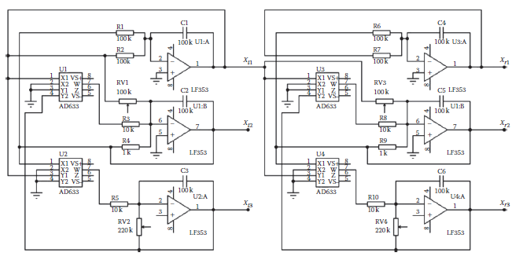

**FIGURE 19.12** Realized analog circuit for master–slave synchronization of Lorenz chaotic systems.

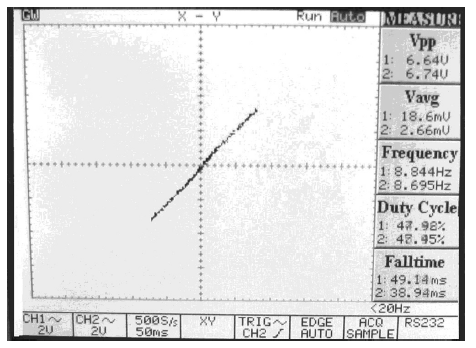

**FIGURE 19.13** A snapshot in the *X*-*Y* mode of the oscilloscope where the signals in the *X* and *Y* channels are the first state variables of the master and slave Lorenz circuits, respectively.

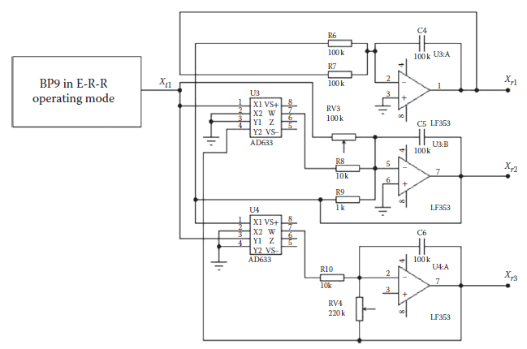

**FIGURE 19.14** Implementation of the E-R-R mode of the controller design–test–redesign platform for the synchronized Lorenz systems.

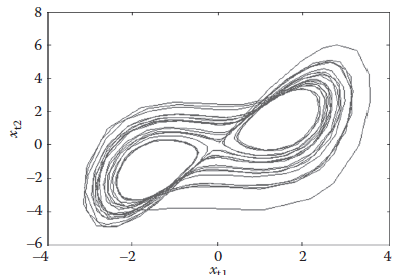

**FIGURE 19.15** Phase portrait for the *x*t1 and *x*t2 states of the emulated BP9 Lorenz chaotic system as observed via the graphical user interface when the controller design–test–redesign platform is operated in the E-R-R mode.

**МАЛЮНОК 19.15** Фазовий портрет для станів *x*t1 і *x*t2 емульованої хаотичної системи Лоренца BP9 за допомогою графічного інтерфейсу користувача, коли платформа проектування–тестування–перепроектування контролера працює в режимі E-R-R.

#### 19.7.3.3 Synchronization of the (Lorenz Receiver) Emulator with Physical Analog (Lorenz Transmitter) Hardware

As a third implementation of master–slave synchronization of coupled Lorenz systems, the CDTRP was operated in the R-E-R mode such that the receiver BP10 was implemented in the emulator of the CDTRP and the transmitter implemented as analog hardware shown in [Figure 19.12 ](#_bookmark112)was used as the master. The X1 state was applied to the emulator of the CDTRP via the hardware peripheral unit card by the mode of operation, the master Lorenz system was implemented in the analog hardware card and the slave Lorenz system was implemented in the emulator. During the experiments conducted for this realization of the master–slave Lorenz system, synchronization was never observed.

Як третя реалізація синхронізації головний-підлеглий зв’язаних систем Лоренца, CDTRP працював у режимі R-E-R таким чином, що приймач BP10 був реалізований в емуляторі CDTRP, а передавач реалізований як аналогове апаратне забезпечення, показане на [Рис. 19.12](# _bookmark112) використовувався як майстер. Стан X1 було застосовано до емулятора CDTRP через апаратну периферійну плату за режимом роботи, головна система Лоренца була реалізована в аналоговій апаратній карті, а підлегла система Лоренца була реалізована в емуляторі. Під час експериментів, проведених для цієї реалізації ведучої-підлеглої системи Лоренца, синхронізація ніколи не спостерігалася.

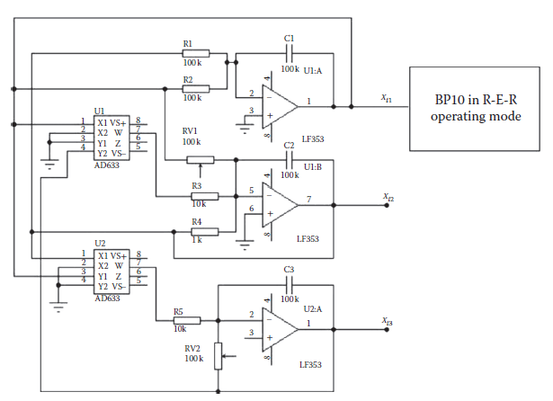

**FIGURE 19.16** Implementation of the R-E-R mode of the controller design–test–redesign platform for the synchronized Lorenz systems.

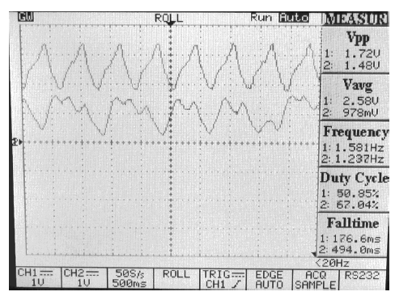     

**FIGURE 19.17** First state variables of the analog transmitter and the emulated receiver in the R-E-R mode for synchronized Lorenz systems. The receiver state is the top trace and the transmitter state is the bottom trace.

**МАЛЮНОК 19.17** Перші змінні стану аналогового передавача та емульованого приймача в режимі R-E-R для синхронізованих систем Lorenz. Станом приймача є верхня траса, а станом передавача є нижня траса.

#### 19.7.3.4 Synchronization of (Lorenz Transmitter) Simulator with (Lorenz Receiver) Eemulator

As a fourth implementation of master–slave synchronization of coupled Lorenz systems, the CDTRP was operated in the S-E-E mode such that the receiver BP10 was implemented in the emulator of the CDTRP and the transmitter was implemented in the simulator of the CDTRP. As seen in Figure 19.18, although both the simulator and emulator can roughly mimic the chaotic behavior of the Lorenz system, they fail to be synchronized to each other in the master–slave configuration.

Як четверта реалізація синхронізації головний-підлеглий сполучених систем Лоренца, CDTRP працював у режимі S-E-E таким чином, що приймач BP10 був реалізований в емуляторі CDTRP, а передавач був реалізований в симуляторі CDTRP. Як показано на малюнку 19.18, хоча і симулятор, і емулятор можуть приблизно імітувати хаотичну поведінку системи Лоренца, вони не можуть бути синхронізовані один з одним у конфігурації головний-підлеглий.

#### 19.7.3.5 Effect of Feedback on Chaotic Synchronization

The above implemented master–slave configuration for chaotic synchronization is, indeed, an open loop control system where the receiver is the plant and the transmitter output is the reference signal to be tracked by this plant. One can argue that not only the lack of implementing the high frequency components of the chaotic signals is the source of failure to achieve the chaotic synchronization, but also the master–slave configuration is another source of dissynchronization as this open loop control configuration is sensitive to internal/external disturbances and delays. To clarify this point, in a unity feedback closed loop configuration, a PID controller with the parameters *K*p = 1, *K*i = 100, and *K*d = 0.01 is used to provide a suitable control input to the receiver Lorenz system for deriving its output to track the reference chaotic signal produced by the transmitter Lorenz system. As seen in [Figure 19.19](#_bookmark114), the PID controller with unity feedback closed-loop configuration provides the desired synchronization for the Lorenz receiver system whose output tracks the reference chaotic signal at least for the main harmonics corresponding to low frequency components.

Реалізована вище конфігурація ведучий-підлеглий для хаотичної синхронізації справді є системою керування з відкритим контуром, де приймач є установкою, а вихід передавача є опорним сигналом, який слід відстежувати цією установкою. Можна стверджувати, що не тільки відсутність реалізації високочастотних компонентів хаотичних сигналів є джерелом невдачі в досягненні хаотичної синхронізації, але також конфігурація ведучий-підлеглий є ще одним джерелом диссинхронізації, оскільки ця конфігурація керування відкритим контуром чутлива до внутрішні/зовнішні перешкоди та затримки. Щоб прояснити цей момент, у конфігурації замкнутого контуру єдиного зворотного зв’язку використовується ПІД-регулятор з параметрами *K*p = 1, *K*i = 100 і *K*d = 0,01, щоб забезпечити відповідний керуючий вхід для приймач системи Лоренца для отримання вихідного сигналу для відстеження еталонного хаотичного сигналу, виробленого системою передавача Лоренца. Як видно на [Малюнок 19.19] (#_bookmark114), ПІД-регулятор із замкнутою конфігурацією єдиного зворотного зв’язку забезпечує бажану синхронізацію для системи приймача Лоренца, вихід якої відстежує опорний хаотичний сигнал принаймні для основних гармонік, що відповідають низькочастотним компонентам.

 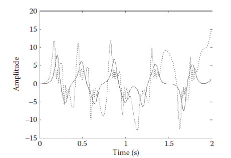

**FIGURE 19.18** Time waveforms of the first states of the Lorenz transmitter and receiver, which are implemented in the simulator and the emulator, respectively.

**МАЛЮНОК 19.18** Часові хвилі перших станів передавача та приймача Лоренца, які реалізовані в симуляторі та емуляторі відповідно.

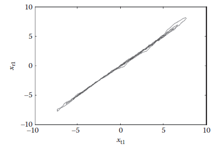

**FIGURE 19.19** First state variable of the receiver Lorenz system as compared to the reference signal, which is the first state variable of the transmitter Lorenz system in the S-E-E mode.

**МАЛЮНОК 19.19** Перша змінна стану системи Лоренца приймача порівняно з опорним сигналом, який є першою змінною стану системи Лоренца передавача в режимі S-E-E.

The above-mentioned limits of the CDTRP in implementing the synchronized Lorenz systems are natural consequences of the chaotic dynamics of the Lorenz systems that intrinsically possess high frequency components. Moreover, the implementation is limited by the maximum achievable sampling frequencies that can be realized in the MATLAB environment used for the PC simulator and in the emulator implemented by the PIC microcontroller. As seen in the last closed-loop implementation of coupled Lorenz systems based on a simple PID controller, the synchronization can be achieved by using a suitable feedback at least for the main (low frequency) harmonics of the chaotic signals. The exact frequency range for the control system dynamics that allows synchronous operations of the units of the CDTRP platform in implementing these dynamics was investigated by considering what may be the simplest yet challenging example, namely the linear undamped pendulums. The corresponding results are presented in the next section.

Вищезазначені обмеження CDTRP у реалізації синхронізованих систем Лоренца є природними наслідками хаотичної динаміки систем Лоренца, які внутрішньо мають високочастотні компоненти. Крім того, реалізація обмежена максимально досяжними частотами дискретизації, які можуть бути реалізовані в середовищі MATLAB, що використовується для симулятора ПК, і в емуляторі, реалізованому мікроконтролером PIC. Як видно з останньої реалізації зв’язаних систем Лоренца із замкнутим контуром, заснованих на простому ПІД-регуляторі, синхронізація може бути досягнута за допомогою відповідного зворотного зв’язку принаймні для основних (низькочастотних) гармонік хаотичних сигналів. Точний частотний діапазон для динаміки системи керування, який дозволяє синхронно працювати блокам платформи CDTRP у реалізації цієї динаміки, досліджувався на найпростішому, але складному прикладі, а саме лінійних незатухаючих маятниках. Відповідні результати представлені в наступному розділі.

#### 19.7.3.6 Synchronization of (Linear Undamped Pendulum Receiver) Simulator/Emulator with (Signal Generator
Transmitter) Simulator

To determine the reliable operating frequency range for the simulator and emulator when communicating with each other, first, a signal generator was used as a transmitter in a master–slave configuration for deriving the emulator or simulator where the BP8 pendulum model was implemented (Figure 19.20a). Then, a PID controller with parameters *K*p = 1, *K*i = 100, and *K*d = 0.001 in the unity feedback closed-loop configuration was used to control the receiver pendulum to track the output of the signal generator. For both the configurations, the CDTRP was operated in the S-E-E mode and also in the S-S-S mode (Figure 19.20b.). It was observed that both the implemented modes yield almost identical results up to *f* =25 Hz, as shown by the results obtained for the S-S-S mode given in [Figure 19.21](#_bookmark115).

Для визначення надійного діапазону робочих частот для симулятора та емулятора під час обміну даними один з одним, спочатку генератор сигналу використовувався як передавач у конфігурації головний-підлеглий для отримання емулятора або симулятора, де була реалізована модель маятника BP8 (Малюнок 19.20). а). Потім ПІД-регулятор з параметрами *K*p = 1, *K*i = 100 і *K*d = 0,001 у замкнутій конфігурації єдиного зворотного зв’язку використовувався для керування маятником приймача для відстеження вихідного сигналу генератор. Для обох конфігурацій CDTRP працював у режимі S-E-E, а також у режимі S-S-S (Малюнок 19.20b.). Було помічено, що обидва реалізовані режими дають майже ідентичні результати до *f* =25 Гц, як показано в результатах, отриманих для режиму S-S-S, наведених на [Рис. 19.21] (#_bookmark115).

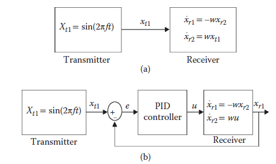

**FIGURE 19.20** (a) Receiver emulator or simulator was derived by a simulated signal generator (*x*t1) in open-loop master–slave configuration for S-S-S or S-E-E modes of the controller design–test–redesign platform. (b) Receiver emulator or simulator was derived by a simulated signal generator (*x*t1) in closed-loop for S-S-S or S-E-E modes of the controller design–test–redesign platform.

**МАЛЮНОК 19.20** (a) Емулятор або симулятор приймача був отриманий за допомогою змодельованого генератора сигналу (*x*t1) у конфігурації ведучий-підлеглий з відкритим циклом для режимів S-S-S або S-E-E платформи проектування–тестування–модернізації контролера. (b) Емулятор приймача або симулятор був отриманий за допомогою змодельованого генератора сигналу (*x*t1) у замкнутому циклі для режимів S-S-S або S-E-E платформи проектування–тестування–перепроектування контролера.

On the one hand, in the open-loop configuration, the synchronization that was achieved for *f* = 1 Hz was observed to fail beyond *f* = 10 Hz. On the other hand, in the closed-loop configuration, it was observed that the synchronizations sustained up to *f* = 100 Hz and *f* = 25 Hz in the S-S-S mode and the S-E-E mode, respectively. These observations actually determine the limit of the operating frequency for the control systems dynamics whose real-time implementations in the S-E-E and S-S-S modes of the CDTRP are reliable in the sense that they can be considered as valid real-time implementations.

З одного боку, у конфігурації з відкритим контуром синхронізація, яка була досягнута для *f* = 1 Гц, спостерігалася невдачею за *f* = 10 Гц. З іншого боку, у конфігурації замкнутого циклу спостерігалося, що синхронізація зберігалася до *f* = 100 Гц і *f* = 25 Гц у режимах S-S-S і S-E-E відповідно. Ці спостереження фактично визначають межу робочої частоти для динаміки систем керування, чиї реалізації в реальному часі в режимах S-E-E та S-S-S CDTRP є надійними в тому сенсі, що їх можна вважати дійсними реалізаціями в реальному часі.

#### 19.7.3.7 Synchronization of (Linear Undamped Pendulum) Receiver Emulator with (Signal Generator) Transmitter

To determine the reliable frequency range for the emulator in the R-E-E and R-E-R modes of CDTRP where it receives a signal from external analog hardware, the receiver BP8 was implemented in the emulator and analog signal generator test equipment was used for the transmitter as shown in [Figure 19.22](#_bookmark116). The *x*t analog signal was applied to the emulator via the hardware peripheral unit card by the U port that was activated by the ADC options in the GUI. The difference between the experiments done in the S-E-E mode shown in Figure 19.20 and in the R-E-E and R-E-R modes shown in Figure 19.22 is in the transmitter part such that in the former one the transmitter is realized in the simulator and in the other ones the transmitter is realized in analog hardware. The analog signal received by the emulator and also the output of the pendulum created in the emulator are transferred from the emulator to the GUI. Therefore, the unique additional source of limiting the frequency range of the emulated dynamics in this experiment is the usage of the input U port of the emulator operated by the ADC. As shown in [Figure 19.23](#_bookmark116), it was observed that in the open-loop configuration of [Figure 19.22](#_bookmark116), the synchronization was achieved up to *f* = 1.52 Hz. It should be noted that the relatively narrower frequency range than the one obtained for S-E-E mode was due to the ADC interface of the PIC microcontroller.

Щоб визначити надійний діапазон частот для емулятора в режимах R-E-E і R-E-R CDTRP, де він отримує сигнал із зовнішнього аналогового обладнання, приймач BP8 був реалізований в емуляторі, а для передавача використовувалося тестове обладнання генератора аналогового сигналу, як показано в [ Малюнок 19.22](#_bookmark116). Аналоговий сигнал *x*t був застосований до емулятора через плату апаратного периферійного пристрою за допомогою U-порту, який був активований параметрами ADC у GUI. Різниця між експериментами, проведеними в режимі S-E-E, показаному на малюнку 19.20, і в режимах R-E-E і R-E-R, показаних на малюнку 19.22, полягає в передавальній частині, так що в першому передавач реалізований у симуляторі, а в інших передавач реалізовано в аналоговому обладнанні. Аналоговий сигнал, отриманий емулятором, а також вихідні дані маятника, створені в емуляторі, передаються з емулятора в графічний інтерфейс користувача. Тому унікальним додатковим джерелом обмеження частотного діапазону емульованої динаміки в цьому експерименті є використання вхідного порту U емулятора, керованого АЦП. Як показано на [Рисунок 19.23](#_bookmark116), було помічено, що в конфігурації з відкритим контуром [Рисунок 19.22](#_bookmark116) синхронізація була досягнута до *f* = 1,52 Гц. Слід зазначити, що відносно більш вузький діапазон частот, ніж отриманий для режиму S-E-E, був зумовлений інтерфейсом АЦП мікроконтролера PIC.

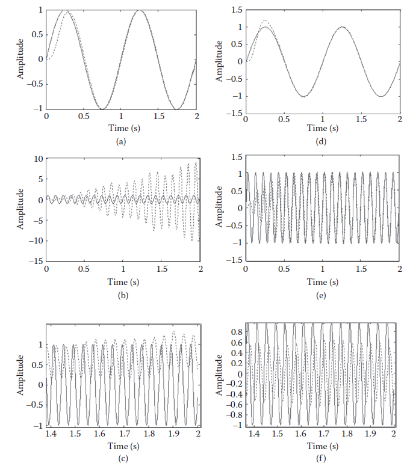

**FIGURE 19.21** (a) Master–slave synchronization at *f* = 1 Hz. (b) Master–slave synchronization failure at *f* = 10 Hz. (c) Master–slave synchronization failure at *f* = 100 Hz. (d) Proportionalintegral-derivative (PID)-based closed-loop synchronization at *f* = 1 Hz. (e) PID-based closed-loop synchronization at *f* = 10 Hz. (f) PID-based closed-loop synchronization at *f* = 100 Hz. Note that (dashed, --) is for the receiver (pendulum) signal and (solid, -) for the transmitter (generator) signal in S-S-S mode of the controller design–test–redesign platform.

**МАЛЮНОК 19.21** (a) Синхронізація ведучий-підпорядкований при *f* = 1 Гц. (b) Помилка синхронізації головного та підлеглого при *f* = 10 Гц. (c) Помилка синхронізації головного та підлеглого при *f* = 100 Гц. (d) Синхронізація із замкнутим циклом на основі пропорційно-інтегральної похідної (PID) при *f* = 1 Гц. (e) Синхронізація замкнутого циклу на основі ПІД при *f* = 10 Гц. (f) Синхронізація із замкнутим контуром на основі PID при *f* = 100 Гц. Зауважте, що (штриховий, --) призначений для сигналу приймача (маятника), а (суцільний, -) для сигналу передавача (генератора) у режимі S-S-S платформи проектування–тестування–перепроектування контролера.

Figure 19.22b shows that the above given frequency limit can be extended up to *f* = 2.92 Hz ([Figure 19.24](#_bookmark116)) by using a PID controller with the parameters *K*p = 1, *K*i = 100, and *K*d = 0.001 in the unity feedback closed-loop configuration for controlling the receiver pendulum to track the output of the analog signal generator. The PID controller was implemented as analog hardware (Leybold LH 734 06 PID- Controller Lab Equipment), so the CDTRP was operated in the (closed-loop) R-E-E and R-E-R modes. Note that the frequency limit is lower than *f* = 25 Hz, which is the one observed for the closed-loop (signal generator–pendulum) synchronization in the S-E-E mode since the analog output of the DAC interface of the plant emulator card was also used in addition to the analog input of the ADC interface of the emulator.* The above results show that the real-time implementations of the control systems dynamics realized in the R-E-E and R-E-R modes are reliable up to the *f* = 2.92 Hz frequency.

На малюнку 19.22b показано, що наведене вище обмеження частоти можна розширити до *f* = 2,92 Гц ([Малюнок 19.24](#_bookmark116)) за допомогою ПІД-регулятора з параметрами *K*p = 1, *K*i = 100 і *K*d = 0,001 у замкнутій конфігурації зворотного зв’язку одиниці для керування маятником приймача для відстеження вихідного сигналу генератора аналогового сигналу. ПІД-регулятор був реалізований як аналогове апаратне забезпечення (Leybold LH 734 06 PID-Controller Lab Equipment), тому CDTRP працював у (замкненому циклі) режимах R-E-E та R-E-R. Зауважте, що обмеження частоти є нижчим за *f* = 25 Гц, яке спостерігається для синхронізації замкнутого контуру (генератор сигналів–маятник) у режимі S-E-E, оскільки аналоговий вихід інтерфейсу ЦАП карти емулятора заводу був також використовується на додаток до аналогового входу інтерфейсу АЦП емулятора.* Наведені вище результати показують, що реалізації динаміки систем керування в реальному часі, реалізовані в режимах R-E-E та R-E-R, є надійними до *f* = 2,92 Гц частота.

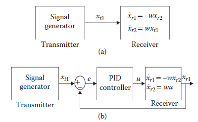

**FIGURE 19.22** (a) Receiver (pendulum) emulator was derived by analog signal generator. (b) Receiver (pendulum) emulator controlled by a proportional-integral-derivative controller tracks transmitter signal in R-E-E and R-E-R modes.

**МАЛЮНОК 19.22** (a) Емулятор приймача (маятника) був отриманий за допомогою генератора аналогового сигналу. (b) Емулятор приймача (маятника), керований пропорційно-інтегрально-похідною контролером, відстежує сигнал передавача в режимах R-E-E та R-E-R.

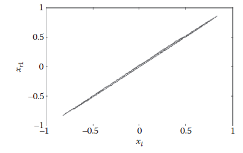

**FIGURE 19.23** Master–slave synchronization between analog generator signal and first state of pendulum realized in the emulator as observed from data transferred to graphical user interface.

**МАЛЮНОК 19.23** Синхронізація головного та підлеглого між сигналом аналогового генератора та першим станом маятника, реалізована в емуляторі, як видно з даних, переданих до графічного інтерфейсу користувача.

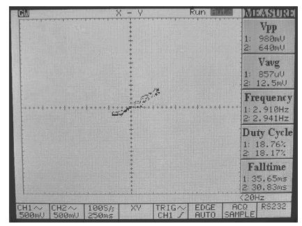     

**FIGURE 19.24** A snapshot on the *X*-*Y* mode of the oscilloscope where the signals in the *X* and *Y* channels are the signal generator signal and the pendulum emulator output, respectively, in the R-E-E and R-E-R modes.

**МАЛЮНОК 19.24** Знімок у режимі *X*-*Y* осцилографа, де сигнали в *X* і *Y* каналах є сигналом генератора сигналів і виходом емулятора маятника відповідно в R-E-E і режими R-E-R.

#### 19.7.3.8 Synchronization of a Physical Analog (Lorenz Receiver) Hardware with Transmitter Emulator

As the last implementation, the emulator implementing transmitter was used for deriving an analog receiver, that is, the Lorenz system. Then, the reliable frequency range for the emulator in the E-R-E and E-R-R modes of CDTRP was examined. The pure sinusoidal signal generated in the emulator was applied via the DAC interface of the emulator in an additive manner to the first state of the Lorenz system implemented in the hardware peripheral unit card (see [Figure 19.25](#_bookmark117)). Note that the Lorenz system was realized by the capacitances for reducing the main harmonics of the chaotic signal around the maximum reliable real-time operation frequency of the emulator. The source of limiting the frequency range of the implemented dynamics in this experiment is the usage of analog output of the DAC interface of the plant emulator card. As shown in [Figures 19.26 ](#_bookmark117)and 19.28, it was observed that the synchronization is achieved up to *f* = 4.05 Hz in the open-loop configuration of [Figure 19.28 ](#_bookmark118)and achieved up to *f* = 9.09 Hz for the closed-loop configuration with a PID controller with the parameters *K*p = 1, *K*i = 100, and *K*d = 0.001 in the unity feedback in [Figure 19.27 ](#_bookmark118)(where Leybold LH 734 06 PID-Controller Lab Equipment was used again).

В якості останньої реалізації емулятор, що реалізує передавач, використовувався для отримання аналогового приймача, тобто системи Лоренца. Потім перевірявся надійний частотний діапазон для емулятора в режимах E-R-E і E-R-R CDTRP. Чистий синусоїдальний сигнал, згенерований в емуляторі, застосовувався через інтерфейс DAC емулятора в адитивний спосіб до першого стану системи Лоренца, реалізованої на платі апаратного периферійного пристрою (див. [Малюнок 19.25](#_bookmark117)). Зазначимо, що система Лоренца була реалізована ємностями для зменшення основних гармонік хаотичного сигналу навколо максимально надійної робочої частоти емулятора в реальному часі. Джерелом обмеження частотного діапазону реалізованої динаміки в цьому експерименті є використання аналогового виходу інтерфейсу ЦАП карти емулятора заводу. Як показано на [Рис. 19.26 ](#_bookmark117) і 19.28, було помічено, що синхронізація досягається до *f* = 4,05 Гц у конфігурації з відкритим контуром [Рис. 19.28 ](#_bookmark118) і досягається до * f* = 9,09 Гц для конфігурації замкнутого циклу з ПІД-регулятором з параметрами *K*p = 1, *K*i = 100 і *K*d = 0,001 у одиничному зворотному зв’язку на [Малюнок 19.27](# _bookmark118)(де знову використовувалося лабораторне обладнання ПІД-регулятора Leybold LH 734 06).

It should be noted that the Lorenz system derived by the pure sinusoidal transmitter signal did not exhibit a chaotic Lorenz signal for the large amplitude values of transmitter signal anymore and that the synchronization was indeed achieved for the main harmonic of the disturbed Lorenz signal. So the phase synchronizations seen in Figures 19.26 and 19.27 were not exact because of the subharmonics. The subharmonics appear as a consequence of the considered operating mode, which requires the implementation of a part of the Lorenz system in the analog hardware and the other part in the emulator so that their interface is a source of nonlinearity causing subharmonics. The results show that the real-time implementations of the control systems dynamics realized in the E-R-E and E-R-R modes are reliable up to the *f* = 9.09 Hz frequency.     

Слід зазначити, що система Лоренца, отримана за допомогою чистого синусоїдального сигналу передавача, більше не виявляла хаотичного сигналу Лоренца для великих значень амплітуди сигналу передавача, і що синхронізація дійсно була досягнута для основної гармоніки збуреного сигналу Лоренца. Отже, фазова синхронізація, показана на малюнках 19.26 і 19.27, не була точною через субгармоніки. Субгармоніки виникають як наслідок розглянутого режиму роботи, який вимагає реалізації частини системи Лоренца в аналоговому апаратному забезпеченні, а іншої частини в емуляторі, щоб їхній інтерфейс був джерелом нелінійності, що викликає субгармоніки. Результати показують, що реалізації динаміки систем керування в реальному часі, реалізовані в режимах E-R-E та E-R-R, надійні до частоти *f* = 9,09 Гц.

\* Observe from Figure 19.22 that the analog output of the emulator was fed to the oscilloscope and also to the analog PID hardware.

\* На малюнку 19.22 видно, що аналоговий вихід емулятора подавався на осцилограф, а також на апаратне забезпечення аналогового ПІД.

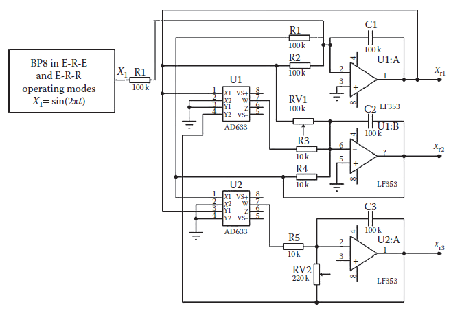

**FIGURE 19.25** Transmitter emulator derives analog Lorenz system receiver in E-R-E and E-R-R modes of the controller design–test–redesign platform (a chaotic state modulation system where a transmitter signal is injected into the chaotic system as additive to the first state).

**МАЛЮНОК 19.25** Емулятор передавача створює аналоговий приймач системи Лоренца в режимах E-R-E та E-R-R платформи проектування–тестування–перепроектування контролера (система модуляції хаотичного стану, де сигнал передавача вводиться в хаотичну систему як доповнення до першого стану) .

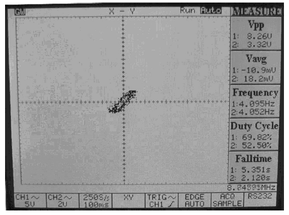

**FIGURE 19.26** A snapshot on the *X*-*Y* mode of the oscilloscope where the signals in the *X* and *Y* channels are the transmitter signal and the first-state variable of the Lorenz system, respectively.

**МАЛЮНОК 19.26** Знімок у режимі *X*-*Y* осцилографа, де сигнали в каналах *X* і *Y* є сигналом передавача та змінною першого стану системи Лоренца відповідно .

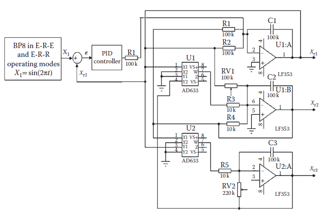

**FIGURE 19.27** A snapshot in the *X*-*Y* mode of the oscilloscope where the signals in the *X* and *Y* channels are the transmitter signal and the first-state variable of the Lorenz system, respectively, in proportional-integral-derivative-based closed-loop control.

**МАЛЮНОК 19.27** Знімок у режимі *X*-*Y* осцилографа, де сигнали в каналах *X* і *Y* є сигналом передавача та змінною першого стану системи Лоренца відповідно , у замкнутому управлінні на основі пропорційно-інтегральної похідної.

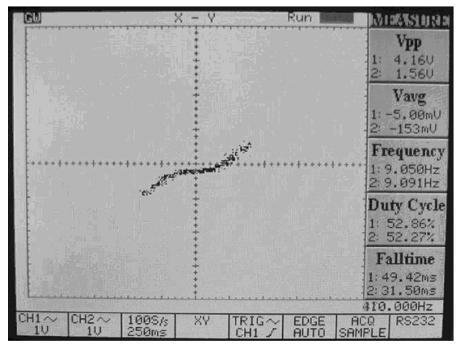 

**FIGURE 19.28** Proportional-integral-derivative-based closed-loop control for Lorenz system receiver to track output of the transmitter emulator in E-R-E and E-R-R modes of the controller design–test–redesign platform.

**МАЛЮНОК 19.28** Пропорційно-інтегрально-похідна замкнутого циклу керування для приймача системи Lorenz для відстеження виходу емулятора передавача в режимах E-R-E та E-R-R платформи проектування–тестування–перепроектування контролера.

[19.6 <--- ](19_6.md) [   Зміст   ](README.md) [--> 19.8](19_8.md)