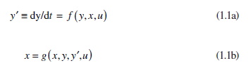

[1.2 <--- ](1_2.md) [   Зміст   ](README.md) [--> 1.4](1_4.md)

## 1.3. CONTINUOUS MODELING

A continuous model is one in which the system state is assumed to vary in a continu- ous manner with no instantaneous changes in the values of system states or their derivatives. 

### 1.3.1 Nature of Continuous Models

Continuous models normally consist of a mathematical description of the actual system by means of a combination of differential and algebraic equations. This type of mathematical model can be expressed in the form of first-order differential equations, each defining a system state variable, and additional equations that define auxiliary variables. The independent variable is time, producing a mathematical model for a continuously varying dynamic system. Some models may have additional independent variables (usually spatial dimensions), in which case the mathematical model is formulated as a set of partial differential equations. A simple example is the simulation of temperature changes along a thin metal rod as it is heated. The state variable is temperature, and it varies with both time and displacement along the rod.

The mathematical model is a partial differential equation with two independent variables, time and displacement.

Simulation using a continuous model involves the initialization of the values of system states followed by calculation of the initial values of the other algebraic variables. This initialization process establishes the initial values of all system variables and is followed by a repetitive process of advancing time in steps using an algorithm for the numerical solution of differential equations. The time steps may be of constant size (usually the case for real-time simulation) or of variable size. Variable-step routines typically include an estimation of the error generated in the current step and a strategy to change the step size to satisfy a user-supplied error tolerance. Such variable-step routines are not normally suitable for real-time simulation because their computation times vary from step to step.

### 1.3.2 Time Management for Continuous Simulations

Continuous simulations are based on solutions of ordinary or partial differential equations for which time is a continuously changing variable with no instantaneous changes from one value of time to the next, in contrast to the behavior of a discrete simulation in which time jumps from one event time to the next. Computers are programmed to produce approximate solutions of the mathematical model using numerical approximation in which time does advance in small discrete steps. The way in which time advances is specified partly by the programmer and controlled largely by the algorithm chosen by the programmer to solve the equations in the mathematical model. There are many algorithms available for solving differential equations, and the choice of algorithm is one of the key decisions made by the user of a continuous simulation. It will be helpful at this stage to embark on a brief digression about different types and properties of numerical integration algorithms.

#### 1.3.2.1 Types of Numerical Integration Algorithm

Assume a continuous mathematical model of the form

where *y* is a vector of states, *y*′ is a vector of state derivatives, *x* is a vector of auxiliary variables (algebraic variables), *u* is a vector of inputs, and *f* and *g* are arbitrary but well-behaved functions.

Numerical integration algorithms normally calculate the next state of a system in terms of the current state and, in some cases, past states. Time is assumed to advance in finite steps leading to equations of the form

where *t* is current time; *h* is the time increment for the current step; and *y*, *x*, and *u* are the system state, other system variables, and system inputs, respectively. In many cases, the algorithm can be expanded into a finite or infinite series that matches the Taylor series expansion for the first several terms.

The Taylor series can be expressed as

The simple Euler integration method, for example, solves Equations 1.1a and 1.1b by calculating

In other words, Euler integration simply extrapolates the states, *y*, by assuming that the derivatives of *y* remain constant throughout the step and equal to the value at the start of the step. The process is illustrated in Figure 1.1.

Assume a first-order system,

 

FIGURE 1.1 Euler integration

[Figure 1.1 ](#_bookmark0)shows part of the true solution for a state variable, *y*(*t*). The initial value of *y* is *y*0 at time *t* = *t*(0). The initial value of the derivative, from Equation 1.5, is given by

Applying Euler integration over a step of length *h*, we have

The derivatives at (*t*0 + *h*) can now be calculated from

This process can be repeated until the final time is reached.

This algorithm matches the first two terms in the Taylor series (up to the term in the first derivative, *y*′) and is known as a first-order method. More complex methods are available that match the Taylor series to the terms in *y*″ (second-order methods), *y*‴ (third-order methods), and so on. These Taylor-series-based methods attempt to approximate the solution over a single step using a polynomial approximation, linear for first order (Euler), a quadratic for second-order methods, and so on. An alternative approach, based on exponential approximations, will be introduced in Section 1.5.3. In general, a method of order *n* will have an approximation error dependent on the neglected terms of the Taylor series, which are the terms in $h^{n+1}$ and above. This error is known as the truncation error. Additional errors can arise from the accumulation of round-off error, particularly when using lower-precision data formats and large numbers of steps. As we shall see, this can be of particular importance in some real-time simulations. There are many different numerical integration algorithms available. Runge–Kutta methods of different orders are widely used. Fourth-order Runge–Kutta methods are often chosen as providing a good trade-off between accuracy and computational complexity [10].

The two major factors that affect the accuracy of a numerical integration are order and step size. Generally speaking, errors decrease with decreasing step size and increasing order. In extreme cases, steps can be so short that round-off error can become an issue, particularly with lower-precision data formats. As step size increases, some algorithms can become unstable, even when the unstable behavior appears at a point at which errors were, up to that point, acceptable. In other words, acceptable stable solutions can make a rapid transition to unacceptable unstable solutions with very small increases in step size.

#### 1.3.2.2 Fixed versus Variable Step

One of the choices faced by users of continuous simulation is whether to use an algorithm that advances time in equal increments (a fixed-step algorithm) or one that varies the size of time increments in order to satisfy user-supplied error tolerances.

Modern variable-step routines often use an approach in which estimated solutions of order *n* and *n* − 1 are generated at each step, and the error estimate is based on the difference between the two. The justification for this is that this difference approximates the value of the last term in the Taylor series before truncation. This is assumed to be a conservative estimate of the total truncation error. The default routine in MATLAB® and Simulink® [11] (ODE45) is, for example, a method of this type that compares fifth- and fourth-order approximations to the solution.

Fixed-step routines are simpler and are favored for real-time simulation because they result in a constant computation time. Variable-step routines are safer, popular, and often used as defaults in those simulation systems that offer a choice of algorithms.

#### 1.3.2.3 Explicit versus Implicit

Algorithms that calculate the next state in terms of the current (and possibly earlier) states have right-hand sides that can be evaluated directly and are referred to as explicit algorithms. For some algorithms, however, Equation 1.2 is modified to include one or more terms in (*t* + *h*) on the right-hand side:

which results in an implicit formula. This normally necessitates the solution of a set of simultaneous algebraic equations in each step. If the system of equations is linear, this can often be done by direct calculation, but nonlinear systems require an iterative solution procedure at each step. Implicit methods are generally unsuitable for real-time simulation because the amount of computation can vary from step to step without an *a priori* known upper bound. Moreover, it may prove necessary to provide external hardware-in-the-loop inputs ahead of time (i.e., *u*(*t* + *h*) may be required at time *t*). Implicit methods can, however, offer improved stability and are often used for stiff systems (see Section 1.3.2.5).

#### 1.3.2.4 Single-Step versus Multistep

The methods discussed so far are self-contained within each step and are called single-step methods. Some methods spread the calculation over more than one step and are called multistep methods. For example, the value of the system state at the next step may be determined in terms of the system state at the current and previous step times. Some algorithms require data from the past three or four steps. Equation 1.2 is now modified as follows:

 

These methods are often cost-effective (in terms of the amount of computation necessary to achieve a given accuracy), but they do require special procedures to start them since past data is not available at the start of the simulation. These methods can also cause problems with hybrid and real-time simulations.

#### 1.3.2.5 Variable-Order Algorithms and Stiff Systems

Many integration algorithms experience stability problems when applied to stiff systems. Stiff systems are systems that have a wide variation in the system dynamics, often described as having widely varying time constants or eigenvalues. These systems are characterized by containing both high-speed and low-speed dynamic properties, all of which must be captured by the method of solution. When the high-speed modes are active (i.e., variables are changing rapidly), short step sizes, commensurate with the time constants involved, are necessary to capture the rapid changes of state. The major problem with stiff systems arises when the fast modes are inactive (i.e., damped out) and the solution trajectories are smooth. Typically, longer steps would be used to cover the smooth trajectories, but in a stiff-system simulation, the dormant high-frequency modes can be stimulated by the integration algorithm causing instability unless the step size remains short, which can be very time-consuming. This problem is often addressed by the use of special stable, stiff-system algorithms. One of the best known is the method of Gear [12], an implicit method based on backward differentiation, which adjusts the order as well as the step size of the algorithm to maintain both accuracy and stability while minimizing the amount of computation required. The original Gear DIFSUB routine was subsequently improved by Hindmarsh in the widely used GEAR routine [13]. Variable-order, variable-step methods of this kind are not normally suitable for time-critical real-time simulations.

#### 1.3.2.6 Difference Equations

Whichever method is chosen to solve the differential equations in the mathematical model, the effect is to convert them into a set of approximately equivalent difference equations. It is these difference equations that are actually evaluated in each step of the simulation, and the way in which this process is implemented can have a significant bearing on the way the simulation is coded, particularly for real-time applications.

### 1.3.3 Software for Continuous Simulation

There is a long history of languages for continuous simulation (traditionally referred to as continuous system simulation languages or CSSLs) dating back to the 1950s and 60s. Initially the software available to support continuous simulation developed from analog computer techniques. Analog computers used specially designed electronic amplifiers that were configured to perform mathematical operations such as integration, addition, multiplication, and function generation. These amplifiers were connected together by the programmer using patch cords to represent the differential equations to be solved. System constants and parameters were set on potentiometers (variable voltage dividers). The first continuous simulation systems for digital computers mimicked this approach. Names such as DAS (Digital Analog Simulator) and MIDAS (Modified Integration DAS) [14,15] were common. These systems required the programmer to produce a flow diagram showing the interconnection of components (adders, multipliers, integrators, etc.), which were similar to the physical components of an analog computer. In effect, the digital program simulated an analog computer simulation of the system! Since graphical input was not available, the flow diagrams were entered in tabular form showing how the various inputs and outputs were interconnected (similar to the Netlist for a modern electric circuit simulator such as SPICE). The expressiveness of this approach was limited by the available repertoire of components, and flow diagrams based only on these primitive elements rapidly became very large. With the increasing popularity of general-purpose high-level programming languages such as FORTRAN and Algol 60, a demand developed for simulation languages in which the program could be expressed in terms of program statements rather than flow diagrams. To distinguish between the two approaches, the names *block-structured* (for the flow-diagram method) and *statement-structured* (for the statement-based languages) were introduced. The emergence of statement- structured simulation languages as a replacement for the block-structured simulators was hailed as a great step forward.

The statement-structured languages include CSMP (Continuous System Modeling Program), DSL (Digital Simulation Language), ACSL (Advanced Continuous Simulation Language), CSSL4 (Continuous System Simulation Language 4), ESL (European Simulation Language), and, more recently, MATLAB and Simulink. An important development was the publication, in 1967, of a specification for a CSSL by Simulation Councils, Inc. (SCi) in their journal *SIMULATION* [16]. Although this specification was far from providing a complete standard, it did provide a template for the CSSLs that followed its publication. One of its main and enduring features was a simulation execution structure made up of three main regions designated the *Initial, Dynamic,* and *Terminal* regions. These names are fairly self-explanatory with calculations at time zero (or some other user-specified initial time) performed in the Initial region, the solution of the mathematical model with advancing time in the Dynamic region, and the terminating conditions and postrun calculations in the Terminal region.

Later, by virtue of the combination of greatly increased computer power and inexpensive graphical displays, a new generation of block-structured simulation software was developed. Modern continuous simulation software typically provides a graphical editor by means of which a flow diagram of the system can be defined. Unlike the original block-structured languages, modern simulation software offers a hierarchical approach in which primitive elements can be combined into more complex components and added to libraries. Extensive libraries are available from the software vendors, and users also have the capability of developing their own model libraries. Some products still provide the user with access to an underlying equivalent statement-structured form of the program, which experienced users can revise to meet special needs. Current versions of ESL and ACSL, for example, provide this feature. With modern graphically based simulation languages, the user is able to build a block diagram of the simuland, often using simulation elements selected from toolboxes of common components and subsystems. The management of the simulation is implicit and controlled by the user through the use of interactive screens by which the parameters of the simulation (e.g., start time, terminating condition, integration algorithm and step size, output details, etc.) are selected. Some critics view the use of toolboxes with concern, claiming that this removes the details of the precise nature of the models used from the user and that this has the potential to generate convincing but inaccurate simulations. Used with care, however, and with adequate knowledge of the details of the model of each subsystem, this approach provides a very convenient way to develop simulations quickly.

### 1.3.4 Example of a Continuous Simulation

Consider the simple example of a small metal sphere that has been heated to a temperature *T*0 at time *t* = 0 and is cooling down in air with an ambient temperature *T*a.

The differential equation that describes this process, at least approximately, is

 

Note that we can calculate the initial value of $dT/dt = K*(T_a − T_0)$. If $T_a < T_0$, then d*T*/d*t* will be negative, indicating cooling, and if *T*a > *T*0, then d*T*/d*t* is positive for heating. Using the Euler method, this would produce an estimate for *T*(*h*) of

 

The derivative d*T*/d*t* at *T* = *h* can then be calculated and the process repeated until the terminating condition is reached.

The process is the same for more complex integration algorithms or for larger systems of differential equations. In all cases, the calculation alternates between the determination of the current values of derivatives and auxiliary variables and the use of the integration algorithm to advance time by one step and calculate the corresponding values of the state variables. This alternation between establishing the current system state and advancing time mirrors the process used in discrete simulations in which the advance of time to the next event time alternates with the reevaluation of the system state.

 

[1.2 <--- ](1_2.md) [   Зміст   ](README.md) [--> 1.4](1_4.md)