[1.3 <--- ](1_3.md) [   Зміст   ](README.md) [--> 1.5](1_5.md)

## 1.4. ГІБРИДНІ МОДЕЛІ

Говорячи простою мовою, гібридна модель — це модель, яка містить характеристики як дискретної, так і безперервної моделей. Існує велика література з теорії та аналізу гібридних систем (наприклад, Ref. [17]).

Для цілей розробки імітаційних моделей гібридну систему в деяких випадках можна розглядати як дискретну модель, що містить один або більше станів, які безперервно змінюються між подіями, а в інших – як безперервну модель, у якій стани змінюються безперервно протягом більшої частину часу, але в якому один або більше станів або їх похідних можуть іноді миттєво змінюватися. В інших випадках дискретні та безперервні процеси можуть бути збалансовані в інтегрованій моделі, рівномірно розподіленій між дискретними та безперервними компонентами.

Ця відмінність є важливою. Багато доступних на даний момент програмних продуктів моделювання забезпечують повну підтримку дискретних або безперервних моделей з обмеженими додатковими функціями, які підтримують альтернативний підхід. Таким чином, баланс між дискретними та неперервними елементами в моделі часто диктує вибір програмного забезпечення для виконання моделювання.

### 1.4.1 Керування часом для гібридного моделювання

Незалежно від балансу між дискретними та безперервними елементами в моделі, керування часом для гібридного моделювання вимагає синхронізації між обробкою подій і безперервним випередженням часу для безперервних елементів. У деяких випадках період безперервного моделювання, який може мати обмежену тривалість, може бути викликаний окремою подією. У цьому випадку тайм-менеджмент керування перемикатиметься з дискретного на безперервний режими з тривалістю часових кроків, визначеною алгоритмом інтегрування. Імітаційна модель залишатиметься в безперервному режимі, доки безперервне імтаціне моделювання не завершиться (генеруючи іншу подію) або не відбудеться подія в дискретній частині моделі, яка вплине на безперервну частину. Це може спричинити припинення безперервного моделювання або спричинити зміну вхідних даних або навіть певним чином змінити безперервну математичну модель. І навпаки, зміни в стані безперервної системи можуть генерувати нові дискретні події, наприклад, коли безперервна змінна перевищує деяке критичне значення, таке як межа температури або тиску.

Коли дискретні події відбуваються протягом періоду, в якому активний безперервний процес, важливо керувати випередженням безперервного процесу в часі так, щоб кінець кроку збігався з часом події. У цьому відношенні корисно використовувати розрізнення, яке вперше ввів Сельє [18], між *часовими подіями* і *подіями стану*.

**Часова подія (timed event)** – це подія, для якої час події відомий заздалегідь. Прикладом може бути тактовий сигнал у системі вибірки даних. Розмір кроку чисельного інтегрування слід, де можливо, контролювати таким чином, щоб він збігався з відомим часом часових подій.

**Подія стану (state event )** – це подія, яка ініціюється умовою, яка залежить від значень стану або інших динамічних змінних у моделюванні, наприклад, підвищення температури вище встановленого значення. Природа подій стану така, що час їх подій зазвичай невідомий заздалегідь, і для їх обробки потрібні спеціальні процедури.

У застунках, що не працюють у реальному часі, синхронізація з обома типами подій часто досягається за допомогою алгоритму інтеграції зі змінними кроками та додаткових процедур синхронізації між дискретним і безперервним моделюванням. У застосунках реального часу може знадобитися зменшити розмір кроку алгоритму інтеграції з фіксованим кроком, щоб мінімізувати похибки синхронізації. У випадку подій стану дискретна подія ініціюється безперервним моделюванням, і знову необхідно або використовувати алгоритм зі змінними кроками, щоб забезпечити точний час події, або, особливо для програм реального часу, прийняти достатньо короткий розмір кроку.

### 1.4.2 Програмне забезпечення для гібридного моделювання

Кілька програмних пакетів, які спочатку були розроблені спеціально для дискретного або безперервного моделювання, згодом додали функції, які підтримують гібридне моделювання.

Ранні роботи з розробки процедур чисельного інтегрування для обробки розривів були проведені Хей, Кросбі та Чаплін [19,20]. Вони адаптували звичайну програму змінних кроків четвертого/п’ятого порядку, додавши стадію інтерполяції, яка активується щоразу, коли перевірка кінця кроку показує, що під час кроку сталася подія стану. Вони використали послідовність інтерполяцій, починаючи з лінійної інтерполяції між початком і кінцем кроку, щоб отримати перше наближення до часу події. Після цього виконується квадратична інтерполяція з використанням значень на початку, приблизного часу події та кінця кроку, щоб отримати більш точне значення часу події. Подальші ітерації з інтерполяцією третього та вищого порядку можливі, але для визначення місця події з прийнятною точністю зазвичай не є необхідними. Цей підхід є дуже ефективним у імітаційному моделюванні не в реальному часі та широко поширений, але він не підходить для імітаційного моделювання в реальному часі через змінний та розширений час обчислення щоразу, коли подія стану відбувається на кроці.

Пізніше ця техніка була включена в ESL, одну з перших мов безперервного моделювання, яка представила методи точної та автоматичної обробки розривів. ESL був розроблений для Європейського космічного агентства Хеєм, Кросбі та Пірсом [21]. Спосіб, у який розриви (події) вказуються користувачем, є елегантним і ґрунтується на використанні логічних операторів і конструкції програми, відомої як *when clause*. `when clause` — це частина коду, яка виконується тоді і тільки тоді, коли (тобто лише один раз) задана умова стає істинною. Більш звичайні умовні оператори `if` також можна використовувати для перемикання між різними описами підсистеми. Майже будь-який розривний елемент можна описати за допомогою конструкцій `if` і `when`.

Простим прикладом використання пропозиції *when* є код підмоделі для тригера T flip-flop. Передбачається, що цей пристрій перемикає свій єдиний логічний вихід кожного разу, коли до його входу застосовується тригер, який можна вказати в ESL як

```pascal
SUBMODEL TFLOP(LOGICAL:flag:=LOGICAL:trigger);
    INITIAL
    	flag:=false;
    DYNAMIC
    when trigger then
    	flag:=not flag;
    end_when;
END TFLOP;
```

Перший рядок означує підмодель під назвою TFLOP, яка має один логічний вихід під назвою *flag* і один логічний вхід під назвою *trigger*. *Прапор* встановлено на *false* у регіоні INITIAL. У регіоні DYNAMIC , який виконується на кожному часовому кроці, *прапор* інвертується тоді і тільки тоді, коли логічна змінна *trigger* змінюється з *false* на *true*. Більше операторів можна вставити між *when* і *end_when*, і всі вони виконуватимуться щоразу, коли *тригер* стане *true*.

Більш складний приклад із використанням як *if*, так і *when* проілюстрований наступним шаблоном коду, який реалізує метод визначення системи, яка перемикається між трьома різними станами. Рядок, перед яким стоїть подвійний дефіс (--), є рядком коментаря.

```pascal
INITIAL
-- Initialize state state := 1;
DYNAMIC
    when state=1 AND transition12 then state := 2;
    when state=1 AND transition13 then state := 3;
    when state=2 AND transition21 then state := 1;
    when state=2 AND transition23 then state := 3;
    when state=3 AND transition31 then state := 1;
    when state=3 AND transition32 then state := 2;
	end_when
-- Assign variables depending on state v1 :=if state=1 then <expression11>
	else_if state=2 then <expression12> else_if state=3 then <expression13>;
--Repeat for all variables
```

Передбачається, що імітація ініціалізується системою в стані 1. У регіоні INITIAL може бути додатковий код ініціалізації. Область DYNAMIC використовує умови *when* для визначення шести можливих переходів між трьома станами за допомогою логічних змінних *transition12* тощо, які зазвичай є *false*. Перехід стану позначається встановленням відповідної змінної переходу на *true*. Значення змінних у певному стані встановлюються за допомогою умовних операторів *if*. Зверніть увагу, що вони структуровані як призначення (:=) з умовними правими частинами.

Однією з сильних сторін ESL є те, що як тільки розрив було визначено в коді за допомогою конструкцій *if* або *when* (або шляхом вибору графічного елемента, який сам визначений за допомогою таких операторів), він автоматично розпізнається та неявно виявляється, коли програмне забезпечення працює з відповідним керуванням розміру кроку. Коли моделі, що містять такі розриви, моделюються за допомогою підпрограми інтеграції зі змінними кроками, і коли значення однієї зі змінних *переходу* змінюється з *false* на *true*, запускається механізм виявлення розривів, який регулює розмір кроку таким чином що гарантує, що час події збігається з закінченням кроку інтеграції в межах допустимого відхилення, визначеного користувачем. Цей підхід не є ідеальним для імітаційного моделювання в реальному часі, якщо не можна гарантувати, що процес завжди досягне задовільного завершення протягом доступного кадрового часу. ESL, однак, підтримує імітаційне моделювання в реальному часі цих гібридних систем. Об’єктно-орієнтована мова моделювання Modelica [22] і продукт MathWorks Simscape™ [23] також використовують поняття операторів *if* і *when* і відповідну семантику. Інші мови, включаючи ACSL і Simulink, надали альтернативні способи означення подій стану на основі означення детекторів перетину. Зазвичай необхідне додаткове написання коду, щоб зв’язати специфікацію події з її обробкою під час виконання.

Переходячи тепер до моделей, які в основному є дискретними, деякі старіші дискретні мови мають додані функції для обробки безперервних елементів. Simscript, наприклад, має безперервний процес, який ілюструється прикладом у наступному розділі.

Як зазначалося раніше, коли він був вперше розроблений у 1976 році, формалізм DEVS і програмні продукти, які його реалізували, були зосереджені на дискретних моделях. У 1990-х роках були розроблені безперервні функції. Ми вже встановили, що чисельний розв'язок диференціальних рівнянь є, по суті, дискретним процесом і тому доступний для представлення за допомогою формалізму DEVS. Необхідно зафіксувати різницеві рівняння, які виникають із безперервної математичної моделі в поєднанні з вибраним алгоритмом чисельного інтегрування з DEVS. Завдяки такій функції реалізація DEVS явно здатна працювати з гібридними моделями. Одним із прикладів є PowerDEVS [24], версія DEVS, призначена спеціально для силових електронних схем і систем, але здатна підтримувати ряд гібридних імітаційних моедлювань, включаючи моделювання в реальному часі. PowerDEVS також цікавий тим, що використовує підхід QSS (Quantized State System) [6,25] до безперервного моделювання. QSS має справу з системами, в яких стани системи, а також час змінюються кінцевими кроками. Імітаційне моделювання з використанням QSS, таким чином, передбачають дискретизацію як часу, так і змінних стану.

### 1.4.3 Приклади гібридного моделювання

Розуміння методів гібридного моделювання можна полегшити, якщо спочатку розділити їх на три групи: 

- в основному неперервні з дискретними елементами, 
- в основному дискретні з неперервними елементами 
- та однаково збалансовані. 

Ці відмінності найкраще можна проілюструвати простими прикладами.

#### 1.4.3.1 Безперервна модель з дискретним елементом

Одним із прикладів гібридної системи, який найчастіше цитується в літературі, є стрибаючий м’яч. Імітаційна модель стрибучого м’яча є прикладом безперервної моделі (динаміка руху м’яча) з дискретними елементами (удар об тверду поверхню). У своїй найпростішій формі неперервна модель прирівнює прискорення м’яча до прискорення сили тяжіння ($d^2x/dt^2=−g$ для *x >* 0) і передбачає сильний удар, при якому швидкість м’яча кулька змінюється миттєво ($dx/dt^+ =−k*dx/dt$), де коефіцієнт відновлення $k$ є коефіцієнтом розсіювання.

Іншим простим прикладом, який буде розглянуто пізніше, є електрична схема на Рис. 1.2. Джерело змінного струму живить навантаження, що складається з резистора та конденсатора паралельно через послідовний опір та діод. Діод представлений дуже простою моделлю ідеального вимикача. Якщо напруга на ньому позитивна, його опір вважається нульовим, і діод можна представити коротким замиканням. Якщо напруга негативна, опір нескінченний і діод представлений розімкненим ланцюгом. Напруга, створена джерелом живлення, дорівнює *v* = *V*cos(*wt*). Якщо припустити, що конденсатор спочатку розряджений, початкове значення *v* дорівнює *V*, і діод буде провідним. Можна створити просту математичну модель, яка розпізнає два режими роботи ланцюга: провідний режим і непровідний режим.

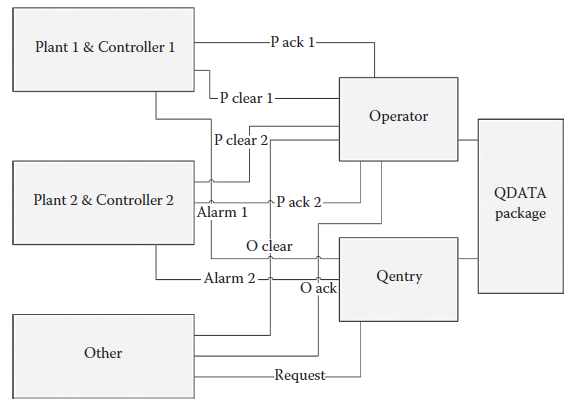

**FIGURE 1.2** Приклад гібридної моделі: електричне коло з перемикачем

##### 1.4.3.1.1 Провідний режим

Припускаючи ідеальні компоненти, ключове диференціальне рівняння забезпечується співвідношенням між напругою та струмом для конденсатора, яке можна виразити як

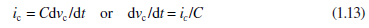

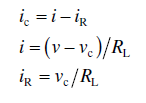


Послідовність розрахунків така:

The value of the state *v*c is known at the beginning of a time step, either as an initial condition or the result of the calculation from the previous step. Given the value of *v*c at the current time *t*, it is possible to calculate the values of *i*R, *i*, and *i*c also at time *t* (in addition to *v*, which is defined for all time in the model). Given *i*c, it is then possible to calculate the current value of the derivative d*v*c/d*t*. This completes the computation of the state of the system at the given time instant. This is the point at which the algorithm chosen by the user to solve the differential equation takes over. Time is advanced by one time step, and the value of *v*c at time *t* + *h*, where *h* is the time increment, is calculated using the integration algorithm. A simple example would be to use Euler integration, which simply assumes that the value of d*v*c/d*t* at *t* is maintained constant over the next time increment so that the new value of *v*c is calculated as

Значення стану *v*c відоме на початку часового кроку або як початкова умова, або як результат обчислення з попереднього кроку. Враховуючи значення *v*c у поточний момент часу *t*, можна обчислити значення *i*R, *i* та *i*c також у момент часу *t* (на додаток до *v*, який визначено на весь час у моделі). Враховуючи *i*c, тоді можна обчислити поточне значення похідної d*v*c/d*t*. На цьому обчислення стану системи в заданий момент часу завершено. Це момент, коли алгоритм, вибраний користувачем для вирішення диференціального рівняння, вступає в дію. Час зміщується на один часовий крок, а значення *v*c у момент часу *t* + *h*, де *h* — приріст часу, обчислюється за допомогою алгоритму інтеграції. Простим прикладом може бути використання інтеграції Ейлера, яка просто припускає, що значення d*v*c/d*t* при *t* підтримується постійним протягом наступного приросту часу, так що нове значення *v*c є розраховується як

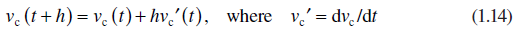

Потім процес повторюється, починаючи з *t* = *t* + *h* з відповідним значенням *v*c і продовжується, доки режим системи не зміниться на непровідний або не буде досягнуто умови завершення моделювання.

##### 1.4.3.1.2 Непровідний режим

У непровідному режимі навантаження RC відключено від джерела живлення. Керівні рівняння тепер

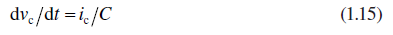

де

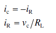

Враховуючи *v*c на початку часового кроку, можна обчислити *i*R і *i*c, а потім d*v*c/d*t*. Алгоритм числового інтегрування можна використовувати для обчислення *v*c наприкінці наступного кроку.

Ключове питання зараз полягає в тому, як прийняти рішення про перемикання між режимами. Як обговорювалося раніше, відповідь на це питання може бути досить різною для імітаційного моделювання в реальному часі та не в реальному часі. Якщо виконання в режимі реального часу не потрібне, може бути найбільш прийнятним алгоритм зі змінними кроками, бажано поєднаний зі схемою виявлення розривів. Для реального часу може знадобитися використовувати метод фіксованого кроку, у цьому випадку довжина кроку обмежена необхідністю обмеження часових похибок. Це питання обговорюється далі в розділі 1.5.1.

#### 1.4.3.2 Приклад дискретного гібридного моделювання

Дискретні моделі широко використовуються для представлення промислових процесів. Багато з цих моделей стосуються просування матеріалів або компонентів у процесі виробництва. Об’єкти утримуються в чергах, очікуючи, поки обладнання стане доступним для виконання наступного етапу виробничого процесу. Час обслуговування часто генерується випадковим чином за допомогою відповідного розподілу. У деяких випадках необхідно більш точно представити процес, і це може передбачати використання безперервної моделі певної частини загального виробничого процесу. Файєк [26] описує застосування, яке передбачає рух металевих зливків у та з печі.

На металургійному заводі є піч з котлом, яка використовується для нагрівання сталевих зливків. Визначено, що час між надходженнями злитків має експоненціальний розподіл із середнім значенням 1,5 години. Якщо при надходженні злитка є вільний відварний котлован, його негайно кладуть у піч. В іншому випадку його поміщають у яму для нагрівання, де передбачається, що вона зберігає свою початкову температуру, доки не буде доступна яма для замочування.

Фаєк описує як повністю дискретні, так і комбіновані безперервно-дискретні (або гібридні) моделі для вирішення цієї проблеми. У дискретному варіанті час нагрівання злитка в печі рівномірно розподіляється між 4 і 8 годинами. У гібридному варіанті вона визначається шляхом вирішення диференціального рівняння, що представляє зміну температури злитка:

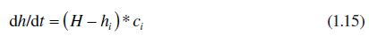

де *hi* — температура 1000°F *i*го зливка, *H* — температура печі (передбачається 1500°F), а *ci* — коефіцієнт часу нагріву *i*го зливка , що дорівнює (0,07 + *x*), де *x* має нормальний розподіл із середнім значенням 0,05 і стандартним відхиленням 0,01.

Злитки повинні бути нагріті до кінцевої температури, яка зазвичай розподіляється між 800 і 1000°F.

У подальшому варіанті моделювання температура печі вважається змінною. Зазвичай вона нагрівається до заданої кінцевої температури і також зменшується, коли в піч поміщають холодні злитки. Це додає друге диференціальне рівняння для температури печі таким чином:

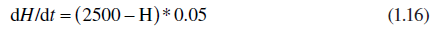

Передбачається, що введення холодного зливка призводить до миттєвого падіння температури печі залежно від різниці між температурами печі та зливка, поділеної на кількість зливків у печі. Це гібридне моделювання було реалізовано у версії Simscript V, яка підтримує безперервні функції. Моделювання пройшло успішно, а можливість моделювати динаміку ефектів нагрівання та охолодження забезпечила більш достовірне уявлення про весь процес.

#### 1.4.3.3 Збалансоване гібридне моделювання

Багато із задокументованих застосувань, що включають гібридне моделювання, належать до вищезазначених типів, переважно дискретних або переважно безперервних. Прикладом більш збалансованого гібридного моделювання є дослідження, виконане для Європейського космічного агентства автором та його колегами з використанням ESL [27]. Він включає в себе штучно створене моделювання, яке мало на меті продемонструвати здатність ESL виконувати моделювання, які поєднують баланс безперервних елементів і елементів черги. Це, як правило, не просте завдання для більшості програмних систем моделювання. Він містить безперервні та обидва типи дискретних елементів, розглянутих раніше (черги та вибіркові дані). Безперервна модель (отримана з прикладу ACSL) проілюстрована на рисунку 1.3.

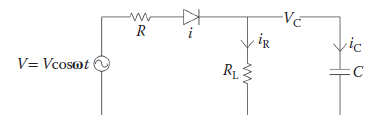

**Рис. 1.3** Безперервна частина комбінованого неперервно-дискретного контрольного показника.

Він містить підсистему з передаточною функцією 1/*s*(*s* + 1). Вихід, *X*, цієї системи порівнюється з заданим значенням *X*c для формування сигналу похибки *E*. Вибрана версія *E* передається в цифровий контролер, який генерує керуючий сигнал *U*. Елемент керування — це лінійна комбінація поточної похибки *E*(*n*), попередньої помилки *E*(*n* − 1) і попереднього керування *U*(*n* − 1) . Різницеве рівняння, що описує регулятор

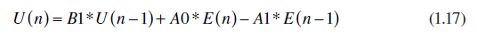 

Константи *A*0, *A*1 і *B*1 залежать від еквівалентних констант часу випередження і затримки контролера (*T*випередження і *T*затримка) і періоду вибірки *T*s. До оновлення *U* додається затримка, щоб представити затримку обчислення в цифровому контролері.

Цей базовий приклад було розширено (див. Рис.1.4), зробивши припущення, що фактичне задане значення, невідоме контролеру, дрейфує (представлене додатковою синусоїдальною зміною). Передбачається, що існує механізм для вказівки, коли справжня похибка від фактичного заданого значення перевищує заданий поріг, шляхом генерації логічного сигналу тривоги. Це аварійне повідомлення передається по лінії зв’язку на консоль оператора, де воно ставиться в чергу разом з іншими повідомленнями, доки оператор не буде готовий вжити коригувальних дій. Потім у систему надсилається повідомлення про коригування, що призводить до скидання заданого значення. Система також має можливість визначати, коли стан тривоги спонтанно очищається, і в цьому випадку вона надсилає повідомлення про скасування, яке скасовує вихідну тривогу, якщо повідомлення отримане до того, як тривога виникла. Ця система включає такі особливості комбінованих неперервних/дискретних систем:

• Події стану, створені з безперервної підсистеми

• Синхронна дискретизація безперервних змінних

• Оновлення безперервних змінних через цифро-аналоговий перетворювач

• Компоненти, описані різницевими рівняннями/z-перетвореннями

• Затримки цифрових обчислень

• Черга подій, що очікують обробки

• Скасування подій у черзі

• Сервер (оператор), який послідовно відповідає на події в черзі

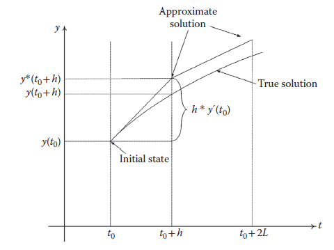

**Рис. 1.4** Комбінований безперервно-дискретний контрольний показник.

Вся імітаційна модель була запрограмована на ESL з використанням примітивів ESL. ESL — це традиційний CSSL з окремими функціями. Слід очікувати, що новітні програмні продукти гібридного моделювання, які спеціально спрямовані на гібридні системи, сприятимуть розробці імітаційного моделювання такого роду.

Одним із результатів цього дослідження був список рекомендованих удосконалень мови ESL, щоб зробити її більш здатною підтримувати збалансовані гібридні моделі з функціями, подібними до тих, що в тесті. До них входять

- Додати підтримку типів дискретних змінних і позначення для різницевих рівнянь

- Підтримка використання z-перетворень

- Покращення обробки подій часу

- Введення блоку EVENT для визначення подій стану та часу

- Підтримка черг, щоб користувач міг легко вказувати їх і керувати ними

- Забезпечте більший діапазон розподілу випадкових чисел

- Забезпечити підтримку визначених користувачем статистичних виходів

- Надавати підтримку для отримання результатів у формі списків подій

Ці зміни були спрямовані на створення більш збалансованої можливості гібридного моделювання. Більшість із них залишаються нереалізованими.

[1.3 <--- ](1_3.md) [   Зміст   ](README.md) [--> 1.5](1_5.md)