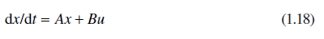

[1.4 <--- ](1_4.md) [   Зміст   ](README.md) [--> 1.6](1_6.md)

## 1.5. REAL-TIME HYBRID SIMULATION

Most real-time simulations are characterized by the necessity to incorporate some physical component in the simulation. This can be hardware, software, or a human or humans in the loop. In all cases, it is necessary for the simulation to be synchronous with a real-time clock to ensure correct timing of the interactions between the simulation and the external agent.

### 1.5.1 Timing Issues in Real-Time Hybrid Simulation

Challenges face the potential user of hybrid simulation, whether real time or not. The choice of software to support the development of the simulation can be critical, and using it to properly represent both the continuous and discrete features of the model and their interaction requires great care. Precise time management, particularly the accurate interchange of timing control between discrete and continuous processes, is essential. At this point, it is necessary to draw a distinction between integration step size and frame time in real-time simulations. The integration step size is precisely what it says, the increment of time by which the current time is advanced in a single application of the selected numerical integration algorithm. In real-time simulation, it is normally constant. The frame time is the normally constant time interval between data transfers to external elements such as hardware in the loop or other simulations, and a frame may consist of several integration time steps. It can be regarded as a real-time equivalent of the communication interval in standard CSSL terminology. The required frame time can dictate the choice of integration algorithm, especially for higher-speed, real-time simulations with the need for very short frame times.

Taken together, these factors pose a formidable challenge to the designer of hybrid real-time simulations. We now consider some of the specific issues that arise in their creation.

The basic requirement for a real-time simulation is that all computation within a frame should be completed within the fixed frame time. In some applications, this requirement can be relaxed, allowing occasional data drops (perhaps caused by communication delays, for example, with hardware-in-the-loop), but in general, the hard real-time requirement must be observed.

The detailed nature of real-time hybrid simulations depends to some extent on the length of the acceptable frame time, which can vary, in different types of applications, from seconds to microseconds. For longer frame times, the ability of the processor or processors to perform the necessary calculations in the available time is less often an issue, but time synchronization between different parts of the simulation, particularly in those cases where the simulation is distributed over different systems, is key.

Distributed real-time simulations often involve different software components to be integrated into a joint simulation. The question of interoperability between software elements then becomes of major concern. Special software environments have been developed to support this kind of interoperability. One of the most widely used is the high-level architecture (HLA) [28]. This architecture is widely used, particularly in military applications, where different simulations running on different platforms in different geographical locations are involved. An HLA simulation is known as a *federation* and its components as *federates*. Data that is passed between different federates using a publish-and-subscribe technique is time stamped to ensure that time synchronization is maintained using a real-time interface.

Wainer, Kim, et al. [29,30] have described some interesting DEVS-based realtime hybrid simulations, which make use of an interface that supports combinations of model components that use different DEVS-based software. A simulation of a robot that negotiates obstacles uses PowerDEVS to simulate the robot and ECD++ (another DEVS-based software) to simulate the interaction with the obstacles.

A number of commercial systems are available that support real-time hybrid simulations including MathWorks xPC Target™ [31] and Real-Time Windows Target™ [32], the combination of National Instruments (NI) LabView with MathWorks Simulink using the Simulation Interface Toolkit from NI [33], RT-Lab from OPAL-RT [34], the rtX simulator from Applied Dynamics International [35], and the Real-Time Digital Simulator (RTDS), a simulator that specifically targets electrical power systems, from RTDS Technologies [36].

### 1.5.2 High-Speed Real-Time Hybrid Simulation

Particular problems arise with those applications that involve short intervals between repeated discrete events. This is true for instance of real-time simulations of modern power-electronic systems. Electric power can be delivered in many different forms. The most obvious distinction is between alternating current (ac) and direct current (dc). Although line frequencies of 50 or 60 Hz are commonly used for domestic supply, other frequencies may be used. For example, 400 Hz is a common choice for many power distribution systems, in aircraft for example. Higher frequencies require smaller transformers, filters, and other related equipment but involve higher losses over longer distances. Many pieces of equipment (such as computers, phones, radios, televisions, for example) require dc supplies and commonly incorporate a converter from ac to dc in the line cord. The dc voltages vary for different applications and for both ac and dc supplies, there are different limits on the amount of allowable harmonic distortion (unwanted ac frequencies).

Converters convert electric power both ways between ac and dc. Converters involve a significant amount of switching whether they are producing dc from an ac waveform or vice versa. The switching is often controlled by pulse-width modulation controllers that vary the intervals between switching events while keeping the average frequency constant. In modern converters, the switching frequencies are set as high as possible to minimize harmonic distortion and to limit the size of associated components. For higher power applications (such as the power system for an electric ship), switching frequencies may be in the kilohertz range. For small appliances, frequencies may be measured in tens or even hundreds of kilohertz. For a 10 kHz switching frequency, the average interval between switching events is 100 μs. In a non-real-time simulation, a variable-step integration algorithm with discontinuity detection would probably be used to minimize errors in the timing of the switching event. In a real-time simulation, using a fixed-step integration algorithm, timing errors are minimized by using sufficiently short steps. If, for example, the maximum allowable timing error is 2% of the average period of the controller switching waveform, then the step size should be no longer than 2 μs. The worst case arises when the actual switch time is immediately after the end of a step. In this case, the integration step will proceed using the equations that were valid before the switching event for the entire step, and the corresponding simulated switching event will not occur until the end of the step. In this case, the timing error is equal to the integration step length. Techniques aimed at compensating for switch-timing errors in real-time simulations are discussed in Section 1.5.3.

Note that real-time simulations that require frame times of less than about 10–20 μs require special processing systems because conventional real-time simulation systems are not capable of reliably maintaining such short frames. Digital signal processors (DSPs) [37] and field-programmable gate arrays (FPGAs) [38] have been used for this purpose. The DSPs or FPGAs need not be more powerful (in a MFLOPS sense) than the conventional system. The key is that the processor that executes the critical simulation code is not vulnerable to interruption by the operating system. A dedicated core or cores in a multicore processor could also be employed in this manner. The RTDS power-system simulator uses both DSPs and FPGA-based processors and offers high-speed units capable of 2-μs frame times.

### 1.5.3 Numerical Integration for High-Speed Real-Time Simulation

Methods to address the need for short frame times in high-speed real-time (HSRT) simulation can be divided into the use of simple algorithms that minimize the amount of computation and the use of techniques that compensate for midstep switching events.

As discussed earlier, the simplest integration algorithm is provided by the Euler method, which only requires that the derivatives of system variables at the start of a step (all of which are known) are multiplied by the fixed-step length to provide an estimate of the change in the value of each variable during the step. This simple extrapolation has the advantage of simplicity. It is not widely used in general in continuous simulations because of its larger truncation errors, but in cases where the step size is constrained for other reasons, it can be effective. It does, however, present stability concerns. Euler integration is the simplest of a class of single-step methods of different orders, known as Runge–Kutta methods, which produce an approximation to the average rate of change of a state variable during a step. Stability margins for integration algorithms can generally be expressed in terms of the eigenvalues of the system (which can be viewed as corresponding roughly to inverse time constants). Euler integration becomes unstable if the step size exceeds twice the shortest time constant (more strictly 2/λ, where λ is the largest eigenvalue). This situation can arise at a point at which slightly shorter (stable) step lengths produce acceptably accurate results, so the transition from acceptable to totally unusable results can be immediate. For nonlinear systems with eigenvalues that can change from step to step, this can be a serious problem. It is consequently advisable for users to be fully aware of the dynamics of their systems and of the potential for numerical instability. Higher-order Runge–Kutta methods have slightly improved stability behavior, but the margin is still, in general, no more than about 2.8/λ (an improvement of only about 40% over the Euler method). One of the advantages of using variable-step algorithms is that they usually ensure that the step length remains in the stable region, but their use is not normally an option in real-time simulation.

Another option for real-time simulation is a fixed-length, explicit, multistep method such as Adams–Bashforth. This approach has been advocated by Robert M. Howe [39], who has a long history of innovative contributions to real-time simulation methodology. Howe has also developed techniques specifically for switched linear circuits, such as those found in power-electronic applications, that compensate for the fact that switching instants occur during a step [40]. Howe’s approach involves splitting a step into substeps separated by switching events and calculating analytic solutions to the differential equations using precomputed coefficients. These techniques require additional computation but can also reduce errors significantly. They permit the use of longer steps for the same accuracy at a cost of more computation per step, and they represent a serious option for HSRT simulation involving linear differential equation models.

De Kelper et al. [41] has also developed techniques for minimizing the effect of switching errors in real-time simulations of electrical power systems that adapt the methods for non-real-time variable-step integration described in Section 1.4.2 to fixed-step methods, particularly for real-time applications. De Kelper has adapted the method to real-time fixed-step simulations in two ways. The first is to limit the interpolation to a single linear process, and the second is to advance the solution from the switching point by the same fixed-step length but to again use linear interpolation to produce a solution at the end of the original step. In other words, the first step goes from *t* to *t* + *h* and is interpolated to find a solution at *t* + *d*, which is the time at which the linear interpolation locates the switching event. The second step goes from *t* + *d* to *t* + *d* + *h*, and a linear interpolation is used to produce a solution at *t* + *h*. Bednar and Crosbie [42] has developed an efficient integration method for linear models that builds on a state-transition approach [43]. The state-transition approach is based on the solution to the vector differential equation

 

Assuming a sample and hold input,

 

then the approximate solution is

where Φ is the transition matrix.

This approach provides a class of fixed-step, explicit methods of varying complexity and accuracy depending on how many terms of two infinite series are used. A version using three and two terms, respectively, and known as the ST(3,2) method has proved effective. In a number of tests, it compared favorably with other methods for accuracy, stability, and computation time. The method can also be applied to some nonlinear systems of equations [44].

### 1.5.4 HSRT Multirate Simulation

Most applications that require HSRT simulation involve components with lower bandwidth dynamics that do not require the short frame-time that HSRT methods are designed to deliver. In these cases, it is better to design a multirate simulation in which the system is separated into segments that are simulated using different frame rates. This means that those segments that do not depend on HSRT techniques can be implemented on conventional processors. A multirate benchmark has been devised to support the study of high-speed, real-time, multirate simulations.

Multirate simulation has been a recognized simulation technique for many years (e.g., Ref. [45]). It has often been used to accelerate the execution of large simulations. The basic idea is that it is not necessary to update the dynamics of the slower parts of a system at the same rates as are required for the faster parts. It is a simple idea that has stood the test of time when applied carefully and conservatively. It is particularly suitable for HSRT applications for which it is possible to execute the high-speed segments on the special high-speed processors and the slower segments on more conventional computer systems.

It is not, however, without its problems. Step sizes for the different segments must be chosen with care. It is also necessary to distinguish between integration step size and communication interval. The segments in a multirate simulation communicate with each other at communication intervals that are normally related by integer multiples. Within a communication interval, the simulation can proceed using a single integration step, equal in length to the communication interval, or by using several integration steps, which together advance the simulation by the duration of one communication interval. These integration steps can be of either fixed or variable length as long as synchronism with the communication interval is maintained.

A multirate simulation is effectively a sampled-data system, and issues can arise with the adequacy of the data passed between segments, particularly when a faster segment has to wait several communication intervals before it receives an update from a slower segment. The input from the slow segment can be kept constant between updates (zero-order hold), but this introduces an effective time delay of approximately half the slower frame time. Extrapolation techniques (first-, second-, or even fractional-order hold) can be used to compensate. Another question is how data is passed from a faster to a slower segment given that the faster segment will produce several data points between data transfers to the slower one. Some method of averaging the fast outputs over each slow frame is required. There is a danger of aliasing if rapidly changing outputs from a fast segment are not filtered or averaged in some way. In some cases, this can be achieved by carefully selecting the segment boundaries so that the outputs from the fast segment do not have high-frequency components. In other cases, it may be necessary to add antialiasing filters. If sufficient care is not taken in selecting communication intervals and data interchange processes, multirate simulations can become inaccurate or even unstable.

A multirate benchmark simulation, based on a simulation of an unmanned underwater vehicle (UUV), was developed in cooperation with the University of South Carolina and the University of Glasgow [46,47]. The UUV uses a battery bank as its energy source feeding an ac motor drive through a dc to ac converter. The drive powers the vessel, which is modeled as a six-degree-of-freedom platform with control surfaces. The system is divided into subsystems that are simulated with different frame rates: (1) converter and switching controller (fast), (2) feedback controller (slow medium), (3) motor drive (fast medium), and (4) the vessel, battery, and interface graphics (slow). The UUV system is illustrated in Figure 1.5. Typical simulation frame rates used in this simulation are

Battery, ship, 3D graphics: 100 mS Converter, switch controller: 2–5 μS Motor: 50–100 μS

Feedback controller: 1 mS

**FIGURE 1.5** Simplified representation of unmanned underwater vehicle model (vessel inputs and outputs and controls are omitted).

The simulation has been implemented using the Virtual Test Bed (VTB), developed by the University of South Carolina [48] in both non-real-time and real-time versions. As an indication of the increase in speed afforded by the use of multirate techniques, implementations of this simulation on a Microsoft Windows system running in non–real time showed a speedup of three orders of magnitude from versions that used the fastest rate for the entire system, with no significant change in the accuracy of the results. The VTB provides a flexible simulation environment with 2D and 3D graphics for output and user controls. It supports multidisciplinary simulation with both mechanical and electrical components and has a library containing a large range of electrical and mechanical components.

The real-time version replaced the UUV drive system (motor and propulsion drive shaft) with hardware. It was not feasible to reproduce the actual physical components in the laboratory, so a small low-power motor was used to represent the actual motor. The load on the drive shaft was represented by a generator coupled to the motor output shaft. The output of the generator was connected to a programmable resistive load that was controlled by the simulation. This configuration supported an equivalent real-time simulation of the UUV system that could support the development of high-speed, real-time, multirate simulation techniques.

[1.4 <--- ](1_4.md) [   Зміст   ](README.md) [--> 1.6](1_6.md)

