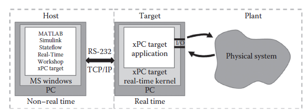

[20 <--- ](20.md) [   Зміст   ](README.md) [--> 20.2](20_2.md)

## 20.1 INTRODUCTION

The automotive industry is continuously demanding shorter development cycles in order to maintain competitiveness. For this reason, car manufacturers have always been adopting state-of-the-art strategies to shorten the time to market such as simultaneous engineering, rapid product development, and front loading of the development process. These are examples where simulation techniques are key enablers. The use of simulation in the development process leads to an early increase of knowledge. Consequently, subsequent processes can start sooner, which amounts to time and cost savings. Nowadays, simulation is used throughout all phases of product development, in the conceptual design and requirements phase, during design of hardware and software, and in computer-aided production planning. However, it still is most efficient in early stages of the development process. Particularly, the modeling and simulation of dynamic systems accelerates development in early phases, for example, in feasibility studies by evaluating the potential of new topologies using virtual prototypes or in the automated and model-based design of control strategies.

Автомобільна промисловість постійно вимагає скорочення циклів розробки, щоб підтримувати конкурентоспроможність. З цієї причини виробники автомобілів завжди застосовували найсучасніші стратегії для скорочення часу виходу на ринок, такі як одночасне проектування, швидка розробка продукту та початкове завантаження процесу розробки. Це приклади, коли методи моделювання є ключовими факторами. Використання моделювання в процесі розробки призводить до раннього збільшення знань. Відповідно, наступні процеси можуть початися раніше, що означає економію часу та коштів. Сьогодні моделювання використовується на всіх етапах розробки продукту, на етапі концептуального проектування та вимог, під час проектування апаратного та програмного забезпечення, а також у автоматизованому плануванні виробництва. Однак він все ще є найбільш ефективним на ранніх стадіях процесу розробки. Зокрема, моделювання та симуляція динамічних систем прискорює розвиток на ранніх етапах, наприклад, у техніко-економічних обґрунтуваннях шляхом оцінки потенціалу нових топологій за допомогою віртуальних прототипів або в автоматизованому та заснованому на моделі проектуванні стратегій керування.

Simulation allows technical prototypes to mature quicker and at the same time reduce their number. Moreover, fewer experiments on test stands are necessary.

Симуляція дозволяє швидше дозрівати технічним прототипам і водночас зменшувати їх кількість. Крім того, потрібно менше експериментів на випробувальних стендах.

The behavior of technical systems can be described and investigated by dynamic system modeling and simulation. Real-time (RT) techniques serve as a natural supplement to modeling and simulation and allow for the running simulation to “connect” with real-world systems in various ways. Hardware-in-the-loop (HIL) methods are an explicit incarnation of this coupling of virtual and technical systems in that one or more virtual components of the simulation model are replaced with physical ones. The physical parts of the technical system interact with the numerical model that simulates the realistic physical behavior of the remaining virtual components as sketched in Figure 20.1.

Поведінка технічних систем може бути описана та досліджена за допомогою динамічного системного моделювання та моделювання. Методи реального часу (RT) служать природним доповненням до моделювання та симуляції та дозволяють запущеній симуляції «підключатися» до систем реального світу різними способами. Методи апаратного забезпечення в циклі (HIL) є явним втіленням цього зв’язку віртуальних і технічних систем у тому, що один або кілька віртуальних компонентів імітаційної моделі замінюються фізичними. Фізичні частини технічної системи взаємодіють із чисельною моделлю, яка імітує реалістичну фізичну поведінку решти віртуальних компонентів, як показано на малюнку 20.1.

The HIL system has two main requirements that must be met: Firstly, the interface has to provide real physical entities such as force, torque, current, etc. This is done by actuators, sensors, and their controls. If the system to be interfaced is a computer such as an embedded system, coupling is somewhat simpler because it takes place at an electrical signal level. This method is beneficial especially for the development and testing of electronic control units of computer-based systems, for example, engine control units (ECUs) in Schuette and Ploeger (2007). Secondly, physical behavior of the simulation model must execute synchronously with the physical system parts, or in *real time*. A closer look reveals that it is sufficient to have the relevant physical information, or *states*, from the simulation available only at every point in time when virtual and physical parts, which may also be human operators, must interact through the interface.

Система HIL має дві основні вимоги, які мають бути виконані: по-перше, інтерфейс має надавати реальні фізичні об’єкти, такі як сила, крутний момент, струм тощо. Це виконується виконавчими механізмами, датчиками та їх елементами керування. Якщо системою, яку необхідно з’єднати, є комп’ютер, наприклад вбудована система, з’єднання дещо простіше, оскільки воно відбувається на рівні електричного сигналу. Цей метод є корисним особливо для розробки та тестування електронних блоків керування комп’ютерними системами, наприклад, блоків керування двигуном (ECU) у Schuette та Ploeger (2007). По-друге, фізична поведінка імітаційної моделі має виконуватися синхронно з фізичними частинами системи або в *реальному часі*. При ближчому розгляді виявляється, що достатньо мати відповідну фізичну інформацію, або *стани*, з симуляції, доступну лише в кожен момент часу, коли віртуальні та фізичні частини, якими також можуть бути люди-оператори, повинні взаємодіяти через інтерфейс.

This chapter presents some aspects of how automotive development benefits from RT and HIL methods. Section 20.2 provides an overview of challenges and restrictions of modeling automotive systems in a RT context. Simulating multidomain systems such as passenger cars requires special care when choosing modeling approaches, approximations, and mathematical formalisms. Section 20.3 focuses on the RT simulation and control of a combustion engine—itself a classic multidomain system—as a prime example. Section 20.4 highlights several applications of the RT methods and models but also addresses the limitations of these approaches. Finally, Section 20.5 presents some concluding thoughts.

У цьому розділі представлені деякі аспекти того, як розвиток автомобілів отримує переваги від методів RT і HIL. Розділ 20.2 містить огляд проблем і обмежень моделювання автомобільних систем у контексті RT. Моделювання багатодомних систем, таких як легкові автомобілі, вимагає особливої обережності при виборі підходів моделювання, наближень і математичних формалізмів. Розділ 20.3 зосереджується на RT моделюванні та керуванні двигуном внутрішнього згоряння, який сам по собі є класичною багатодомною системою, як яскравий приклад. Розділ 20.4 висвітлює декілька застосувань методів і моделей RT, але також розглядає обмеження цих підходів. Нарешті, у Розділі 20.5 представлені деякі підсумкові думки.

**FIGURE 20.1** Example of a HIL system layout (From Mosterman, P. J. et al., *Handbook of Networked and Embedded Control Systems*, edited by Dimitrios Hristu-Varsakelis and William S. Levine, 419–46, Birkhäuser, Boston, 2005. With permission.)

**РИСУНОК 20.1** Приклад компонування системи HIL (з Mosterman, P.J. et al., *Handbook of Networked and Embedded Control Systems*, edited by Dimitrios Hristu-Varsakelis and William S. Levine, 419–46, Birkhäuser, Boston , 2005. З дозволу.)

[20 <--- ](20.md) [   Зміст   ](README.md) [--> 20.2](20_2.md)