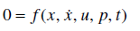

[20.1 <--- ](20_1.md) [   Зміст   ](README.md) [--> 20.3](20_3.md)

## 20.2 RT TECHNIQUES FOR AUTOMOTIVE SYSTEMS

Numerical RT simulation of the behavior of any dynamic system is based on specific formulations of the dynamics. These models are mathematical relationships represented either as differential equations, difference equations, or hybrid approaches (Mosterman and Biswas 2002). Particularly, the modeling of automotive systems imposes several challenges:

•   A vehicle comprises a plurality of physical domains.

•   The time scales of the dynamics cover several orders of magnitude.

•   A combinatorial variety of vehicle types and configurations exists.

•   A vital need for disclosure of intellectual property by the original equipment manufacturers (OEM) is evident.

Чисельне РТ моделювання поведінки будь-якої динамічної системи базується на конкретних формулюваннях динаміки. Ці моделі є математичними співвідношеннями, представленими у вигляді диференціальних рівнянь, різницевих рівнянь або гібридних підходів (Mosterman and Biswas 2002). Зокрема, моделювання автомобільних систем накладає кілька проблем:

• Транспортний засіб складається з безлічі фізичних доменів.

• Часові масштаби динаміки охоплюють декілька порядків.

• Існує різноманітність типів і конфігурацій транспортних засобів.

• Життєво необхідне розкриття інтелектуальної власності виробниками оригінального обладнання (OEM) є очевидною.

Although today’s vehicles rely increasingly on computers, they are still classical multidomain systems. Table 20.1 lists the predominant domains involved and common ways to model these domains in the field of RT simulation.

Незважаючи на те, що сучасні транспортні засоби все більше покладаються на комп’ютери, вони все ще є класичними мультидоменними системами. У таблиці 20.1 наведено переважні задіяні домени та загальні способи моделювання цих доменів у сфері RT моделювання.

According to the continuous nature of almost all technical parts, their physics is described by partial differential equations (PDEs) and hence numerically best through the finite element method (FEM) and related methods. As shown in Table 20.1, this abstraction of physical reality is not often considered in the field of automotive RT simulation. With this in mind, which abstractions are considered and for what reasons?

Відповідно до безперервної природи майже всіх технічних частин, їх фізика описується диференціальними рівняннями в частинних похідних (PDE) і, отже, чисельно найкраще за допомогою методу кінцевих елементів (FEM) і пов’язаних методів. Як показано в таблиці 20.1, ця абстракція фізичної реальності не часто розглядається в області автомобільного RT моделювання. З огляду на це, які абстракції розглядаються та з яких причин?

**TABLE** **20.1**  **Modeling** **Domains** **in** **Automotive** **RT** **Simulation** 

| **Domain**                       | **Technical** **aspect**                          | **Typical** **modeling** **formalism**                       |
| -------------------------------- | ------------------------------------------------- | ------------------------------------------------------------ |
| Rigid and elastic body mechanics | Drivetrain, engine  crank, chassis, axles,  tires | Multibody dynamics, machine dynamics                         |
| Electrical                       | Electrical  system, ancillaries, drives           | Analog/digital  circuit simulation                           |
| Chemistry                        | Combustion, battery, exhaust  after-treatment     | Rate  equations of net reactions                             |
| Thermodynamics                   | Combustion, air/exhaust, battery                  | Equilibrium  thermodynamics, filling  and emptying,  one-dimensional flows |
| Hydraulics                       | Fuel system, brakes, steering                     | Filling and  emptying, one-dimensional  flows                |
| Thermal                          | Cooling system                                    | Phenomenological  linear  thermodiffusion                    |
| Control                          | ECU                                               | Linear control, neural networks (Meder  et al. 2007)         |
| Computer science                 | ECU, smart components                             | Automata, statecharts, RT-UML (Douglass 2004)                |

Many types of formalisms, such as FEM or computational fluid dynamics (CFD) with their fine-grained discretization in space and time, can be ruled out for RT applications. Complex models that must observe an immense number of variables over an extended period of time, such as those for simulating gas flow, challenge current computing hardware. If that is the case, then how can one accelerate the computational ability of a technical system model? Computational demand is proportional to the number of simulation state variables *x*(*t*). Reducing to a lower number of simulation state variables is beneficial for two reasons: First, the smaller system can be formulated by ordinary nonlinear differential equations (ODEs) or differential algebraic equations (DAE), where

Багато типів формалізмів, таких як FEM або обчислювальна гідродинаміка (CFD) з їхньою дрібною дискретністю в просторі та часі, можна виключити для додатків RT. Складні моделі, які повинні спостерігати за величезною кількістю змінних протягом тривалого періоду часу, такі як моделі для імітації потоку газу, кидають виклик поточному обчислювальному обладнанню. Якщо це так, то як можна прискорити обчислювальну здатність моделі технічної системи? Обчислювальна потреба пропорційна кількості змінних стану моделювання *x*(*t*). Зменшення до меншої кількості змінних стану моделювання є вигідним з двох причин: по-перше, меншу систему можна сформулювати за допомогою звичайних нелінійних диференціальних рівнянь (ODE) або диференціальних алгебраїчних рівнянь (DAE), де

governs the time evolution of *x*(*t*) (Vidyasagar 1993). The variable *u* represents the control inputs, and the variable *p* represents all parameters that do not appear as time derivatives. This approach often delivers satisfying quality of simulation results. The vast amount of simulation variables present in an FEM formulation is condensed to several physically meaningful states and allows for control laws to be designed much easier. The restrictions of this process are obvious: one must be careful when fundamental assumptions for the reduced model will not hold or when interesting phenomena will be completely neglected. In the field of internal combustion engine (ICE) simulation, these are certainly regions where one approaches the limits of thermodynamic equilibrium. The most prominent ones are the near-supersonic processes that take place in a turbocharger or the processes of combustion and gas exchange in a cylinder.

керує часовою еволюцією *x*(*t*) (Vidyasagar 1993). Змінна *u* представляє керуючі входи, а змінна *p* представляє всі параметри, які не відображаються як похідні за часом. Цей підхід часто забезпечує задовільну якість результатів моделювання. Величезна кількість змінних моделювання, присутніх у формулюванні FEM, зведена до кількох фізично значущих станів і дозволяє набагато легше розробляти закони керування. Обмеження цього процесу очевидні: потрібно бути обережним, коли фундаментальні припущення для скороченої моделі не будуть виконуватися або коли цікаві явища будуть повністю знехтувані. У сфері моделювання двигунів внутрішнього згоряння (ДВЗ) це, безперечно, області, де людина наближається до меж термодинамічної рівноваги. Найпомітнішими з них є близьконадзвукові процеси, що відбуваються в турбокомпресорі, або процеси згоряння і газообміну в циліндрі.

Secondly, an often overseen issue is that the reduction to a few simulation states affects the necessity for obtaining suitable data. Efforts to parameterize the model may reduce considerably because the governing differential equations take lumped values. For instance, a total mass is required instead of a mass distribution, or a scalar value or characteristic map of a heat transfer coefficient is used instead of a thermodiffusion process. Particularly in the automotive field, a valid and consistent set of data leading to parameters *p* for the parameterization of simulation models is difficult to obtain. Intellectual property issues are one reason for this. The main reason, however, lies in the early, or conceptual, phase of technical design where employing simulation tools is most advantageous: necessary data at this point in time are either scarce, unconsolidated, or simply not available for use in the simulation. This situation is aggravated by the fact that good data are essential for reliable simulation results. The reader is referred to Section 20.3.2 for more details.

По-друге, проблема, яка часто розглядається, полягає в тому, що скорочення до кількох станів моделювання впливає на необхідність отримання відповідних даних. Зусилля щодо параметризації моделі можуть значно зменшитися, оскільки керівні диференціальні рівняння приймають зосереджені значення. Наприклад, замість розподілу маси потрібна загальна маса, або замість процесу термодифузії використовується скалярне значення чи характерна карта коефіцієнта тепловіддачі. Особливо в автомобільній галузі важко отримати дійсний і послідовний набір даних, що веде до параметрів *p* для параметризації імітаційних моделей. Проблеми інтелектуальної власності є однією з причин цього. Основна причина, однак, полягає в ранній, або концептуальній, фазі технічного проектування, де використання інструментів моделювання є найбільш вигідним: необхідні дані на даний момент часу або дефіцитні, неконсолідовані, або просто недоступні для використання в моделюванні. Ця ситуація ускладнюється тим фактом, що якісні дані необхідні для надійних результатів моделювання. Додаткову інформацію можна знайти в розділі 20.3.2.

Apart from the mathematical formulation of the causal behavior of an automotive system, there is a second distinctly important aspect to RT modeling and simulation: the notion of *time*. The most obvious way in which the treatment of time affects RT simulation is through the time discretization within the numerical simulation. Numerical integration schemes make time discrete by using fixed or variable step sizes and project the approximation of the exact ODE/DAE solution onto a sampling grid (Brenan et al. 1987). This grid must satisfy several requirements in order to lead to a meaningful solution:

Окрім математичного формулювання причинно-наслідкової поведінки автомобільної системи, існує ще один надзвичайно важливий аспект RT моделювання та симуляції: поняття *часу*. Найбільш очевидний спосіб, у який обробка часу впливає на моделювання RT, полягає в дискретизації часу в рамках чисельного моделювання. Схеми чисельної інтеграції роблять час дискретним за допомогою фіксованих або змінних розмірів кроку та проектують наближення точного рішення ODE/DAE на сітку вибірки (Бренан та ін. 1987). Ця сітка має відповідати декільком вимогам, щоб забезпечити значуще рішення:

•   The computational load induced by the evaluation of the simulation model at each grid point must match the computing power of the RT platform to avoid task overruns. Depending on the type of RT system, such task overruns either can be tolerable or must be avoided at all costs (Schuette and Ploeger 2007). Automotive applications such as vehicle dynamics test rigs traditionally use sampling rates of 1 kHz. This restricts the integration scheme to being a fixed-step method where the number of grid points is proportional to computational load. The Forward Euler method (Brenan et al. 1987) is the most prominent among them in that it guarantees a finite execution time.

• Обчислювальне навантаження, спричинене оцінкою імітаційної моделі в кожній точці сітки, має відповідати обчислювальній потужності платформи RT, щоб уникнути перевиконання завдань. Залежно від типу системи RT, такі перевиконання завдань можуть бути прийнятними або їх слід уникати будь-якою ціною (Schuette and Ploeger 2007). Автомобільні програми, такі як випробувальні установки для динаміки транспортних засобів, традиційно використовують частоту дискретизації 1 кГц. Це обмежує схему інтеграції до методу з фіксованим кроком, де кількість точок сітки пропорційна обчислювальному навантаженню. Метод прямого Ейлера (Brenan et al. 1987) є найвидатнішим серед них, оскільки він гарантує кінцевий час виконання.

•   The eigenfrequencies of the model impose an upper boundary on the used step size. Especially for engine applications, this leads to sampling rates of at least 100 kHz as mentioned in Section 20.3.1 for calculating the in-cylinder pressure.

• Власні частоти моделі накладають верхню межу на використовуваний розмір кроку. Особливо для двигунів це призводить до частот дискретизації принаймні 100 кГц, як зазначено в розділі 20.3.1 для розрахунку тиску в циліндрі.

•   Automotive systems often contain highly reactive subsystems. As a consequence, it is, for example, for a HIL application, not sufficient (although necessary) to have the simulation run in synchrony with a physical process. Synchronicity with the physical process is superseded by the more stringent requirement of reactivity. Well-defined reaction times to external stimulation are crucial in embedded ECU applications. Particularly, the reaction of the cylinder and combustion model to the timing-critical fuel injection signals must take place within a time frame of tens of microseconds (see Section 20.4.2).

• Автомобільні системи часто містять високореактивні підсистеми. Як наслідок, наприклад, для програми HIL недостатньо (хоча й необхідно), щоб симуляція запускалася синхронно з фізичним процесом. Синхронність із фізичним процесом замінюється більш суворою вимогою реактивності. Чітко визначений час реакції на зовнішню стимуляцію має вирішальне значення для вбудованих додатків ECU. Зокрема, реакція циліндра та моделі згоряння на критичні для часу сигнали впорскування палива має відбуватися протягом десятків мікросекунд (див. Розділ 20.4.2).

Amenability to RT execution is also affected by the way time itself is modeled, which tends to be less obvious as it is more implicitly incorporated in the modeling formalism. The states in a continuous-time model, for example, formulated as an ODE/DAE system, may change smoothly over time. In contrast with this type of model, there are discrete-event models where the state is an element belonging to a discrete set and will change abruptly over time, which is well suited to efficiently model abstract-switching behavior. This discontinuous behavior is often modeled as a finite-state machine, statecharts, or a state-transition diagram. In RT applications where computational efficiency is paramount, RT simulation models are usually combinations of continuous and discrete behavior, also known as hybrid dynamic systems. Although well-suited to RT applications, these introduce additional complexity in terms of numerics and modeling; see Mosterman and Biswas (2002) for more details. There is a large variety of tools for RT modeling and simulation. Some approaches provide the possibility to model any hybrid dynamic system, without restrictions to the physical domain, in a modular and block-oriented way. Prominent examples are native Simulink® (Simulink 2004) and Modelica (Modelica 2010). While the first employs causal modeling, the latter is an acausal modeling formalism, which has certain advantages, for example, for model inversion. Multidomain tools with a special focus on automotive systems are, for example, ASCET-MD (ASCET-MD 2009), for the development of embedded automotive control systems, GT-Suite (GT-Suite 2009), and AMESim (AMESim 2009) for zero and one-dimensional modeling of physical systems with an option to generate RT capable code.

На піддатливість виконання RT також впливає спосіб моделювання самого часу, який, як правило, менш очевидний, оскільки більш неявно включений у формалізм моделювання. Стани в моделі безперервного часу, наприклад, сформульованій як система ODE/DAE, можуть плавно змінюватися з часом. На відміну від цього типу моделі, існують моделі дискретних подій, у яких стан є елементом, що належить до дискретного набору та різко змінюється з часом, що добре підходить для ефективного моделювання поведінки абстрактного перемикання. Ця переривчаста поведінка часто моделюється як кінцевий автомат, діаграми станів або діаграми переходів між станами. У програмах RT, де обчислювальна ефективність має першорядне значення, імітаційні моделі RT зазвичай являють собою комбінації безперервної та дискретної поведінки, також відомі як гібридні динамічні системи. Незважаючи на те, що вони добре підходять для додатків RT, вони створюють додаткову складність з точки зору чисел і моделювання; див. Mosterman and Biswas (2002) для отримання додаткової інформації. Існує велика різноманітність інструментів для RT моделювання та симуляції. Деякі підходи надають можливість моделювати будь-яку гібридну динамічну систему, без обмежень фізичної області, у модульному та блочно-орієнтованому вигляді. Яскравими прикладами є рідні Simulink® (Simulink 2004) і Modelica (Modelica 2010). У той час як перший використовує причинне моделювання, останній є формалізмом акаузального моделювання, який має певні переваги, наприклад, для інверсії моделі. Багатодоменними інструментами з особливим акцентом на автомобільних системах є, наприклад, ASCET-MD (ASCET-MD 2009) для розробки вбудованих автомобільних систем керування, GT-Suite (GT-Suite 2009) і AMESim (AMESim 2009) для нульове та одновимірне моделювання фізичних систем з можливістю генерації коду, що підтримує RT.

[20.1 <--- ](20_1.md) [   Зміст   ](README.md) [--> 20.3](20_3.md)