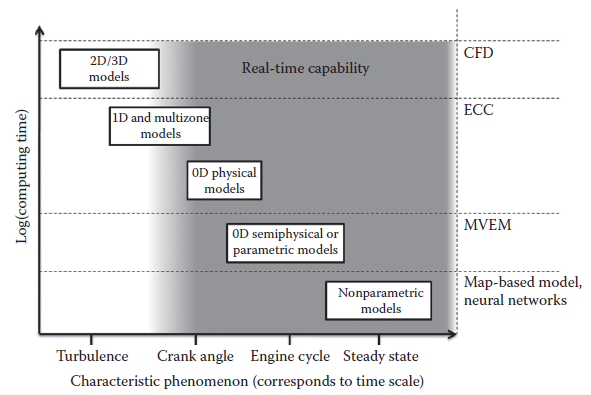

[20.2 <--- ](20_2.md) [   Зміст   ](README.md) [--> 20.4](20_4.md)

## 20.3 ACHIEVING RT IN ENGINE SIMULATION

This section shows the tasks and challenges in practical RT modeling of automotive systems. Like a passenger vehicle, the combustion engine is a complex multiphysics system in its own right. Without neglecting generality, this section focuses on the modeling of combustion engines, particularly their crucial intake/exhaust gas and fuel subsystems.

У цьому розділі показано завдання та виклики практичного RT моделювання автомобільних систем. Як і пасажирський транспортний засіб, двигун внутрішнього згоряння є складною мультифізичною системою. Не нехтуючи загальністю, цей розділ зосереджується на моделюванні двигунів внутрішнього згоряння, зокрема їх важливих підсистем впуску/вихлопу та палива.

### 20.3.1 Choosing the Right Type of Model

There are a considerable number of approaches to modeling combustion engines, but just a few are amenable to RT applications. A physical formulation of the dynamics will be stressed because of its superior properties in terms of its ability In this section, black-box approaches such as neural networks or model order reduction are considered a complement to PDE- or ODE-based methods (Meder et al. 2007). The number of domains involved is considerable, leading to a heterogeneous physical description and rich dynamics of the complete system. That is why most resulting models are either restricted to being a single domain model or a hybrid of both black-box and physical formulation, often resulting in gray-box models.

Існує значна кількість підходів до моделювання двигунів внутрішнього згоряння, але лише деякі з них піддаються застосуванню RT. Буде наголошено на фізичному формулюванні динаміки через його чудові властивості з точки зору його здатності. У цьому розділі підходи чорної скриньки, такі як нейронні мережі або зниження порядку моделі, вважаються доповненням до методів на основі PDE або ODE (Meder et ін. 2007). Кількість задіяних доменів є значною, що призводить до неоднорідного фізичного опису та багатої динаміки повної системи. Ось чому більшість результуючих моделей або обмежені моделлю однієї області, або гібридом чорної скриньки та фізичної формулювання, що часто призводить до моделей сірої скриньки.

1. To extrapolate into regions where no measurements are available

2. To reuse models and parameters

3. To reduce the effort required for parameterization

4. To immediately understand the modeled phenomena

1. Екстраполювати на регіони, де вимірювання недоступні

2. Повторно використовувати моделі та параметри

3. Зменшити зусилля, необхідні для параметризації

4. Негайно розуміти змодельовані явища

Among the most complicated, and also most interesting, dynamics in an automotive system may be the gas-exchange phenomena during a working cycle in the cylinder and the intake air and exhaust paths. Turbulent flows of multiphase media within complex geometries, heat transfer, and intricate chemical reactions, for example, during combustion, call for CFD models because of their resolution capabilities in time and space (Chung 2003). These models, however, are still far from being RT capable on standard hardware, for example, FIRE (AVL FIRE 2006), mainly because of the discretization in two or three dimensions. Classical methods of order reduction or the usage of neural networks with a focus on control theory are sometimes applied to reduce complexity. Papadimitriou, for example, shows a method to transform complex one-dimensional flow models into an RT neural network model of a combustion engine (Papadimitriou et al. 2005).

Серед найскладніших, а також найцікавіших, динамік в автомобільній системі можуть бути явища газообміну під час робочого циклу в циліндрі та шляхах всмоктування повітря та випуску. Турбулентні потоки багатофазних середовищ у складних геометріях, передачі тепла та складних хімічних реакціях, наприклад, під час горіння, вимагають CFD-моделей через їх здатність розділяти в часі та просторі (Chung 2003). Однак ці моделі все ще далекі від можливості RT на стандартному апаратному забезпеченні, наприклад, FIRE (AVL FIRE 2006), головним чином через дискретизацію в двох або трьох вимірах. Класичні методи зменшення порядку або використання нейронних мереж з акцентом на теорії управління іноді застосовуються для зменшення складності. Пападімітріу, наприклад, демонструє метод перетворення складних одновимірних моделей потоку в модель RT нейронної мережі двигуна внутрішнього згоряння (Пападімітріу та ін. 2005).

A more physical way of reducing the complexity of PDE solutions is the use of modal and lumped formulations of the dynamics in which symmetries are exploited or assumed. The engine cycle calculation (ECC) partitions gas volumes into ideally mixed finite volumes and ends up with a set of coupled ODEs that are solved while satisfying the conservation laws, as shown in Merker et al. (2006). The technical analogy is a set of plenums or coolers coupled by nozzles. The very complex and nonequilibrium aspects such as heat release rate and heat transfer are augmented as parametric or semiphysical models (see, e.g., Vibe [1970]) that allow for the adaptation of the model to varying operating points. An investigation of the eigenfrequencies of these models reveals that typical sampling rates must lie in the order of magnitude of 100 kHz to obtain realistic results for, for example, the in-cylinder pressure of a high-rev gasoline engine. Especially, the heat transfer to the cylinder walls, the piston, and the cylinder head is treated usually by empirical models as this process is much too complex to model from first principles. A more realistic modeling of a direct injection combustion process or the formation of engine emissions can be approximated within the ECC. The cylinder volume then has to be partitioned into two to several hundred coupled zones (Heywood 1989). The ECC is a powerful method offering a wide range of application. Common applications are development of control strategies, sensitivity analysis, combustion process development, and ECU testing. The computational complexity is at the limits of current processor power providing cause to the emergence of commercial RT models (DYNA4Engine 2009; ASM InCylinder 2006).

Більш фізичний спосіб зменшення складності рішень PDE - це використання модальних і зосереджених формулювань динаміки, в яких використовуються або припускаються симетрії. Розрахунок циклу двигуна (ECC) розбиває об’єми газу на ідеально змішані кінцеві об’єми та закінчується набором пов’язаних ODE, які розв’язуються, задовольняючи закони збереження, як показано в Merker et al. (2006). Технічною аналогією є набір пленумів або охолоджувачів, з’єднаних соплами. Дуже складні та нерівноважні аспекти, такі як швидкість виділення тепла та передача тепла, доповнюються як параметричні або напівфізичні моделі (див., наприклад, Vibe [1970]), які дозволяють адаптувати модель до змінних робочих точок. Дослідження власних частот цих моделей показує, що для отримання реалістичних результатів для, наприклад, тиску в циліндрі високооборотного бензинового двигуна типова частота дискретизації повинна бути в порядку величини 100 кГц. Зокрема, передача тепла до стінок циліндра, поршня та головки блоку циліндрів зазвичай розглядається за допомогою емпіричних моделей, оскільки цей процес надто складний для моделювання з початкових принципів. Більш реалістичне моделювання процесу згоряння з прямим упорскуванням або утворення викидів двигуна може бути наближено за допомогою ECC. Потім об’єм циліндра необхідно розділити на дві-кілька сотень пов’язаних зон (Heywood 1989). ECC — це потужний метод із широким спектром застосування. Загальні програми – це розробка стратегій керування, аналіз чутливості, розробка процесу згоряння та тестування ECU. Обчислювальна складність знаходиться на межі поточної потужності процесора, що є причиною появи комерційних моделей RT (DYNA4Engine 2009; ASM InCylinder 2006).

Mean value engine models (MVEMs) are a classical way of modeling the processes inside the combustion engine. Similar to ECC, these are based on a DAE/ ODE formulation, but the physical states are considered within a more macroscopic time scale. States are considered mean values with respect to a time range of three to five engine revolutions (Jensen et al. 1991). This is sufficient to model fast changing processes such as the opening of the exhaust gas recirculation (EGR) valve. Desired states are engine speed, engine torque, and manifold pressure to name just a few. In terms of complexity and computational effort, they rank below the ECC (Hendricks and Sorenson 1990). For the description of engine phenomena that are too complex for modeling the physics from first principles, dependent and independent variables are separated to be able to employ simple empirical models or mapped data from measurements (Jensen et al. 1991). The strength of MVEMs lies in their ability to be easily adapted to other engines. Their compact mathematical formulation requires only a comparably small number of parameters and can be calibrated to a particular engine with a small set of measurements (Hendricks and Sorenson 1990). MVEMs are often utilized in the development of control strategies and in model-based diagnostics. See Section 20.4 for some HIL applications.

Моделі середнього значення двигуна (MVEM) є класичним способом моделювання процесів усередині двигуна внутрішнього згоряння. Подібно до ECC, вони базуються на формулюванні DAE/ODE, але фізичні стани розглядаються в більш макроскопічному масштабі часу. Стани вважаються середніми значеннями по відношенню до діапазону часу від трьох до п'яти обертів двигуна (Jensen et al. 1991). Цього достатньо для моделювання швидко мінливих процесів, таких як відкриття клапана рециркуляції вихлопних газів (EGR). Бажаними станами є швидкість двигуна, крутний момент двигуна та тиск у колекторі, щоб назвати лише деякі з них. З точки зору складності та обчислювальних зусиль вони нижчі за ECC (Hendricks and Sorenson 1990). Для опису явищ двигуна, які є надто складними для моделювання фізики з перших принципів, залежні та незалежні змінні відокремлюються, щоб мати можливість використовувати прості емпіричні моделі або відображені дані вимірювань (Jensen et al. 1991). Сила MVEM полягає в їх здатності легко адаптуватися до інших двигунів. Їхня компактна математична формулювання потребує порівняно невеликої кількості параметрів і може бути відкалібрована для конкретного двигуна за допомогою невеликого набору вимірювань (Hendricks and Sorenson 1990). MVEM часто використовуються в розробці стратегій управління та в діагностиці на основі моделі. Дивіться Розділ 20.4 для деяких програм HIL.

State-free approaches such as engine torque maps represent a simple way to model engine behavior. These are very popular, especially in ECU applications, because they are computationally robust and efficient while offering fairly high accuracy if using data obtained by (often relatively few) engine measurements. On the other hand, maps are almost ruled out for modeling transient behavior accurately (Gheorghiu 1996), and they can potentially introduce undesired nonlinearities into the dynamics of a controlled system.

Підходи без стану, такі як карти крутного моменту двигуна, являють собою простий спосіб моделювання поведінки двигуна. Вони дуже популярні, особливо в додатках ECU, тому що вони обчислювально надійні та ефективні, водночас пропонуючи досить високу точність, якщо використовувати дані, отримані (часто відносно небагато) вимірювань двигуна. З іншого боку, карти майже виключені для точного моделювання перехідних процесів (Gheorghiu 1996), і вони потенційно можуть внести небажані нелінійності в динаміку керованої системи.

In the end, the purpose of RT engine simulation is to deliver a system’s response with respect to time that is physically correct and free of contradictions. Therefore, the choice of an appropriate model for a specific investigation or task is an intricate trade-off between available computing power, required sample rates and response times, and validity of the modeled dynamics. [Figure 20.2 ](#_bookmark119)relates the computational complexity to time scales of characteristic phenomena in engine modeling. The gray area depicts the region of applications currently possible on standard processing hardware.

Зрештою, метою моделювання двигуна RT є надання реакції системи щодо часу, яка є фізично правильною та вільною від протиріч. Таким чином, вибір відповідної моделі для конкретного дослідження або завдання є складним компромісом між доступною обчислювальною потужністю, необхідною частотою дискретизації та часом відповіді, а також валідністю змодельованої динаміки. [Малюнок 20.2 ](#_bookmark119) пов’язує обчислювальну складність із часовими масштабами характерних явищ у моделюванні двигуна. Сіра зона зображує область застосування, яка зараз можлива на стандартному апаратному забезпеченні обробки.

**FIGURE 20.2** Relationship between engine model complexity and modeled phenomena.

### 20.3.2 Data Preparation

As pointed out in Section 20.2, a model of the dynamics of a technical system is composed of (1) a description of the physical behavior, (2) model parameters *p*, and (3)   initial conditions. In order for a model to be able to sufficiently replace the physical component of a system, it is imperative that the data used are sufficiently precise and correct. Insufficient care while preparing model data or modeling will almost certainly lead to erroneous simulation results. Furthermore, data preparation takes a significant amount of time as part of the process of modeling and simulation. For these reasons, the steps of data preparation as well as model verification and validation are investigated in more depth here.

Як зазначено в розділі 20.2, модель динаміки технічної системи складається з (1) опису фізичної поведінки, (2) параметрів моделі *p* і (3) початкових умов. Для того, щоб модель могла достатньою мірою замінити фізичний компонент системи, вкрай важливо, щоб дані, які використовуються, були достатньо точними та правильними. Недостатня ретельність під час підготовки модельних даних або моделювання майже напевно призведе до помилкових результатів моделювання. Крім того, підготовка даних займає значну кількість часу як частина процесу моделювання та імітації. З цих причин кроки підготовки даних, а також верифікації та валідації моделі досліджуються тут більш глибоко.

Data is almost never directly suitable to be used “as is” with the simulation model. Because of this, data preparation, sometimes known as preprocessing, is necessary to extract and transform raw data into a form suitable for the model. Data preparation is, in essence, a model of the parameters for the simulation model. For RT models, two practicalities stand out. Firstly, any calculation that can be done prior to simulating decreases the computational load. Secondly, the data must be adapted regarding structure and type to suit the model, if only because RT models often approximate complicated physical relationships, as shown in Section 20.3.1, by using lookup tables.

Дані майже ніколи безпосередньо не придатні для використання «як є» з імітаційною моделлю. Через це підготовка даних, іноді відома як попередня обробка, необхідна для вилучення та перетворення вихідних даних у форму, придатну для моделі. Підготовка даних, по суті, є моделлю параметрів для імітаційної моделі. Для моделей RT виділяються дві практичні особливості. По-перше, будь-які обчислення, які можна виконати до моделювання, зменшують обчислювальне навантаження. По-друге, дані повинні бути адаптовані щодо структури та типу, щоб відповідати моделі, хоча б тому, що моделі RT часто наближають складні фізичні зв’язки, як показано в Розділі 20.3.1, за допомогою таблиць пошуку.

Data preparation requires prior knowledge of the simulation model to know which data are required as both data and model are intimately linked. Designing the data preparation process can take up a substantial amount of time and end up being an iterative process. Data preparation can roughly be divided into (1) data extraction and (2) data transformation for our purposes here. The process is schematically depicted in [Figure 20.3](#_bookmark120).

Підготовка даних вимагає попереднього знання імітаційної моделі, щоб знати, які дані потрібні, оскільки і дані, і модель тісно пов’язані між собою. Розробка процесу підготовки даних може зайняти значну кількість часу та в кінцевому підсумку стати ітераційним процесом. Підготовку даних можна грубо розділити на (1) вилучення даних і (2) перетворення даних для наших цілей. Процес схематично зображено на [Мал. 20.3] (#_bookmark120).

**FIGURE 20.3** Flow diagram of data preparation steps.

The sources of data are manifold. They could be measurements, simulation results, data sheets, or spread sheets provided from a supplier. For the case that not all input data is available, missing data must be estimated until the remaining data are provided. This may be sufficient to get the model up and running and to even start with testing. The following three steps will lead to correct and consistent data regarding units and values:

Джерела даних різноманітні. Це можуть бути вимірювання, результати моделювання, аркуші даних або розширені таблиці, надані постачальником. У випадку, якщо не всі вхідні дані доступні, відсутні дані необхідно оцінити, поки не буде надано решту даних. Цього може бути достатньо, щоб запустити модель і навіть почати тестування. Наступні три кроки приведуть до правильних і послідовних даних щодо одиниць і значень:

•   Parameter selection is the process of identifying the correct parameters necessary to parameterize the model. There may often be many more parameters measured or provided (e.g., in a data sheet) than is necessary.

• Вибір параметрів – це процес визначення правильних параметрів, необхідних для параметризації моделі. Часто може бути виміряно або надано набагато більше параметрів (наприклад, у таблиці даних), ніж необхідно.

•   Often the provided data is not specific in terms of physical units, coordinate systems, and measurement conditions. A typical problem that arises in engine applications is the absence of reference conditions for a table of turbocharger operating points, which renders the data practically unusable (Moraal and Kolmanovsky 1999). Some modeling languages such as Modelica or Simscape™ have variable classifications that support using correct units or even the type of variable such as force or mass.

• Часто надані дані не є конкретними з точки зору фізичних одиниць, систем координат і умов вимірювання. Типовою проблемою, яка виникає при застосуванні двигунів, є відсутність еталонних умов для таблиці робочих точок турбокомпресора, що робить дані практично непридатними для використання (Moraal and Kolmanovsky 1999). Деякі мови моделювання, такі як Modelica або Simscape™, мають класифікації змінних, які підтримують використання правильних одиниць або навіть тип змінної, як-от сила чи маса.

•   Removing outliers and invalid data will be necessary as soon as measurements are intended to be used as model inputs or for the extraction of model parameters. Problems during experiments can be sensor failures or incorrect settings that can lead to invalid data.

• Видалення викидів і недійсних даних буде необхідним, як тільки вимірювання будуть використовуватися як вхідні дані моделі або для вилучення параметрів моделі. Проблемами під час експериментів можуть бути збої датчиків або неправильні налаштування, які можуть призвести до недійсних даних.

Data transformation will process the data according to the model requirements regarding quality, type, and structure of the input data. Data quality refers to the smoothness of data and the availability of data as a usable format. Filtering and smoothing remove discontinuities in the input data. This can help prevent the simulation of models based on such data from aborting and increases computational efficiency even for cases where a simulation could run but must take small time steps over a discontinuity to satisfy tolerances. Because data were measured at scattered points, it is often necessary to carry out interpolation to map the values onto an equidistant grid. Extrapolation will extend input data to cover regions that lie beyond the range of the measurements. Regression techniques (Izenman 2008; Ljung 1999) are used to identify model input parameters from measured data. The type of parameter depends on the number of input variables and can be, for example, scalars or *n*-dimensional lookup tables. Finally, all input data must conform to the requirements of the simulation model with respect to file format, memory specifications, and similar formal matters. It is a part of the data transformation process to ensure such requirements are fulfilled.

Перетворення даних оброблятиме дані відповідно до вимог моделі щодо якості, типу та структури вхідних даних. Якість даних означає плавність даних і доступність даних у форматі, який можна використовувати. Фільтрація та згладжування усувають розриви у вхідних даних. Це може допомогти запобігти перериванню симуляції моделей, заснованих на таких даних, і підвищити ефективність обчислень навіть у випадках, коли симуляція може працювати, але має виконувати невеликі часові кроки через розрив, щоб задовольнити допуски. Оскільки дані були виміряні в розсіяних точках, часто необхідно виконувати інтерполяцію, щоб відобразити значення на еквідистантній сітці. Екстраполяція розширить вхідні дані, щоб охопити регіони, що знаходяться за межами діапазону вимірювань. Методи регресії (Izenman 2008; Ljung 1999) використовуються для ідентифікації вхідних параметрів моделі з виміряних даних. Тип параметра залежить від кількості вхідних змінних і може бути, наприклад, скалярами або *n*-вимірними таблицями пошуку. Нарешті, усі вхідні дані повинні відповідати вимогам імітаційної моделі щодо формату файлу, специфікацій пам’яті та подібних формальних питань. Це частина процесу перетворення даних, щоб забезпечити виконання таких вимог.

An automated process can be very valuable for data preparation because, if implemented, the user is rewarded with a reliable, time-saving, and convenient method of creating the input data set necessary for the simulation model. This is especially advantageous when the input data have been modified or improved. Directly after data preparation, it is helpful to visualize the results. Simply visualizing data in the form of plots is not only a way of identifying errors in the data, it is also a way of understanding the simulation model and its implementation. One beneficial side effect of preparing data is revealed when the user of the simulation model also carries out the data preparation but was not involved in the modeling: The user is then forced to view the data that indicate how the model was implemented. In this manner, the user becomes more aware of the model while working with the data.

Автоматизований процес може бути дуже цінним для підготовки даних, оскільки, якщо він реалізований, користувач винагороджується надійним, економним у часі та зручним методом створення набору вхідних даних, необхідних для імітаційної моделі. Це особливо вигідно, коли вхідні дані були змінені або покращені. Відразу після підготовки даних корисно візуалізувати результати. Проста візуалізація даних у вигляді графіків — це не лише спосіб виявлення помилок у даних, це також спосіб розуміння імітаційної моделі та її реалізації. Один корисний побічний ефект підготовки даних виявляється, коли користувач імітаційної моделі також виконує підготовку даних, але не бере участі в моделюванні: тоді користувач змушений переглядати дані, які вказують на те, як була реалізована модель. Таким чином, користувач стає більш обізнаним про модель під час роботи з даними.

### 20.3.3 Model Verification and Validation

Along with building a simulation model and preparing data to be used in the model, the process of verifying and validating (V&V) the simulation model is an essential step in striving toward accurate and reliable simulation results. Performing V&V is important for all types of simulation models but even more so for RT simulation applications where coupling to real-world subsystems requires quantitative correctness of the model behavior.

Поряд із створенням імітаційної моделі та підготовкою даних для використання в моделі, процес верифікації та перевірки (V&V) імітаційної моделі є важливим кроком у прагненні до точних і надійних результатів моделювання. Виконання V&V важливе для всіх типів імітаційних моделей, але ще більше для додатків моделювання RT, де підключення до підсистем реального світу вимагає кількісної коректності поведінки моделі.

Model verification can be defined as ensuring that the computer program of the computerized model and its implementation are correct (Sargent 2007). This could be the transformation of a flowchart or a mathematical model consisting of equations into a computer program that can be executed. Model validation may be defined as substantiation that a computerized model within its domain of applicability possesses a satisfactory range of accuracy consistent with the intended application of the model (Schlesinger et al. 1979). The relationships between the computerized model, the conceptual model, and the technical system that is being modeled (the “real system”) are illustrated as the Sargent Circle shown in [Figure 20.4](#_bookmark121). The cross-dependencies stand out in the sense that the entire process of V&V is iterative. Finding a mistake late in the model validation phase may even require reevaluating the conceptual model and modifying it. Such a change can have an extensive influence on the model behavior, leading to an entirely new testing process that must be started from the very beginning. This can have far-reaching consequences as there may be other models or components being designed that depend on having an accurate model and the design of which now must be postponed. It is for this reason that modeling errors should be caught as soon as possible.

Перевірку моделі можна визначити як перевірку правильності комп’ютерної програми комп’ютеризованої моделі та її реалізації (Sargent 2007). Це може бути перетворення блок-схеми або математичної моделі, що складається з рівнянь, у комп’ютерну програму, яку можна виконати. Перевірка моделі може бути визначена як підтвердження того, що комп’ютеризована модель у своїй області застосування має задовільний діапазон точності, що відповідає передбачуваному застосуванню моделі (Schlesinger et al. 1979). Взаємозв’язки між комп’ютеризованою моделлю, концептуальною моделлю та технічною системою, яка моделюється («реальна система»), проілюстровані як коло Сарджента, показане на [Рис. 20.4] (#_bookmark121). Перехресні залежності виділяються в тому сенсі, що весь процес V&V є ітеративним. Виявлення помилки на пізньому етапі перевірки моделі може навіть вимагати переоцінки концептуальної моделі та її модифікації. Така зміна може значно вплинути на поведінку моделі, що призведе до абсолютно нового процесу тестування, який необхідно розпочати з самого початку. Це може мати далекосяжні наслідки, оскільки можуть розроблятися інші моделі або компоненти, які залежать від наявності точної моделі, і розробку яких зараз слід відкласти. Саме з цієї причини помилки моделювання слід виявляти якнайшвидше.

There are many principles that should be accounted for to ensure successful V&V. Some of the most prominent ones are 

•   The simulation model is only valid for the tested conditions.

•   A valid model does not imply credible and accurate results.

•   Successful subsystem testing does not guarantee model credibility in its entirety.

Є багато принципів, які слід враховувати, щоб забезпечити успішне V&V. Деякі з найвидатніших з них

• Імітаційна модель дійсна лише для перевірених умов.

• Дійсна модель не передбачає достовірних і точних результатів.

• Успішне тестування підсистеми не гарантує достовірності моделі в повному обсязі.

**FIGURE 20.4** Simplistic overview of the process of model verification and validation. (From Sargent, R. G., *Proceedings of the 2007 Winter Simulation Conference*, Washington, DC, 2007. With permission.)

**РИСУНОК 20.4** Спрощений огляд процесу верифікації та підтвердження моделі. (Від Сарджента, Р. Г., *Матеріали зимової конференції з моделювання 2007 р.*, Вашингтон, округ Колумбія, 2007 р. З дозволу.)

Carrying out V&V requires extensive testing for dynamic system models. One general method of doing this is presented by Lehmann (2003). Different types of tests are examined in Sargent (2007), for example:

Виконання V&V вимагає ретельного тестування динамічних системних моделей. Один із загальних методів, як це зробити, представлено Леманном (2003). У Sargent (2007) розглядаються різні типи тестів, наприклад:

•   Compare simulation results to real measured values from the technical system.

•   Compare simulation results to results from other valid models with at least comparable complexity.

•   Test extreme inputs or initial conditions.

•   Obtain expert opinion on the input–output relationship of model.

•   Perform steady-state and transient testing.

• Порівняйте результати моделювання з реальними виміряними значеннями технічної системи.

• Порівняйте результати моделювання з результатами інших дійсних моделей принаймні порівнянної складності.

• Перевірте екстремальні входи або початкові умови.

• Отримати експертний висновок про взаємозв'язок між витратами та результатами моделі.

• Виконайте тестування в стаціонарному та перехідному режимах.

As suggested above, there can never be 100% validity. Ideally, the best chances for success derive from testing thoroughly and often by starting at the function level, continuing up through the subsystem and component level, and finally ending at the top system level. Each simulation model is unique, though, and so benefits from customized and detailed testing procedures. Moreover, testing thoroughly and efficiently is further complicated because the model implementation blends complex behavior on mathematical, numerical, and execution levels as described in the following section.

Як було запропоновано вище, ніколи не може бути 100% дійсності. В ідеалі найкращі шанси на успіх випливають із ретельного та частого тестування, починаючи з функціонального рівня, продовжуючи на рівні підсистеми та компонентів і, нарешті, закінчуючи на верхньому рівні системи. Кожна симуляційна модель є унікальною, тому виграє від індивідуальних і детальних процедур тестування. Крім того, ретельне й ефективне тестування ще більше ускладнюється, оскільки реалізація моделі поєднує складну поведінку на математичному, числовому рівнях і рівнях виконання, як описано в наступному розділі.

### 20.3.4 From the Model to a RT Executable

Simulation in this context mainly denotes numerical time integration. Given the  *x*, model of a dynamic system 0 = *f*(*x*, *. u*, *p*, *t*) with parameters *p*, control inputs *u*, and the initial states *x*(*t* = *t*start), one can solve the initial-value problem by means of numerical integration schemes. As pointed out in Section 20.2, under RT conditions one is mostly restricted to using schemes with a guaranteed execution time and, therefore, mainly to explicit and fixed-step-size methods. Unfortunately, these methods in particular provide limited accuracy and stability when solving stiff, discontinuous, or constrained systems that often arise in the field of engineering (EichSoellner and Führer 1998). In order to reconcile accuracy and efficiency, integration schemes can be carefully chosen for each domain and RT model or submodel. For example, higher order single-step methods, or approximations of implicit methods where iterative solutions are truncated (Eich-Soellner and Führer 1998), can be implemented in order to meet RT requirements. Some high-performance RT solutions are even able to switch the equations *and* integration schemes depending on the current engine model state (DYNA4Engine 2009).

Моделювання в цьому контексті в основному означає чисельне інтегрування часу. Задано *x* модель динамічної системи 0 = *f*(*x*, *. u*, *p*, *t*) з параметрами *p*, керуючими входами *u* та початковими станами *x*(*t* = *t*start), можна вирішити початкову задачу за допомогою схем чисельного інтегрування. Як зазначено в Розділі 20.2, в умовах RT здебільшого обмежено використанням схем із гарантованим часом виконання, а отже, переважно явними методами та методами з фіксованим розміром кроку. На жаль, ці методи, зокрема, забезпечують обмежену точність і стабільність при розв’язанні жорстких, розривних або обмежених систем, які часто виникають у галузі техніки (EichSoellner and Führer 1998). Щоб узгодити точність і ефективність, схеми інтеграції можна ретельно вибирати для кожної області та моделі або підмоделі RT. Наприклад, одноетапні методи вищого порядку або апроксимації неявних методів, де ітераційні рішення скорочуються (Eich-Soellner and Führer 1998), можуть бути реалізовані для задоволення вимог RT. Деякі високопродуктивні рішення RT можуть навіть перемикати рівняння *та* схеми інтеграції залежно від поточного стану моделі двигуна (DYNA4Engine 2009).

Code generation is the final step influencing the performance of an executable RT simulator. Though tedious, some dynamics model descriptions, controller, and integration schemes are still implemented by manual coding, for example, for reasons of limited resources in embedded systems. However, nowadays this approach is restricted to specific automotive applications and very expensive because of the combinatorial complexity in terms of vehicle types and configurations. When using modeling formalisms such as Simulink, the high-level, possibly graphical, model description can be automatically transferred to C code or binaries for a specific RT platform or embedded system. Prevalent tools are Real-Time Workshop® or TargetLink for generating code from Simulink models. Dymola (2009) compiles textual or graphical models in Modelica. Exploiting a symbolic representation of the model offers interesting options to automatically enhance computational performance. Mixed-mode integration, and particularly the method of *inline-integration* (Elmqvist et al. 1995), leads to potentially large but computationally efficient code, especially attractive in RT applications.

Генерація коду є останнім кроком, який впливає на продуктивність виконуваного симулятора RT. Незважаючи на виснажливість, деякі описи динамічних моделей, контролери та схеми інтеграції все ще реалізуються за допомогою ручного кодування, наприклад, через обмежені ресурси у вбудованих системах. Однак сьогодні цей підхід обмежений конкретними автомобільними додатками та є дуже дорогим через комбінаторну складність з точки зору типів і конфігурацій транспортних засобів. При використанні формалізмів моделювання, таких як Simulink, високорівневий, можливо графічний, опис моделі може бути автоматично перенесений у код C або двійкові файли для конкретної платформи RT або вбудованої системи. Поширеними інструментами є Real-Time Workshop® або TargetLink для генерації коду з моделей Simulink. Dymola (2009) компілює текстові або графічні моделі в Modelica. Використання символічного представлення моделі пропонує цікаві варіанти автоматичного підвищення обчислювальної продуктивності. Інтеграція в змішаному режимі, а особливо метод *inline-integration* (Elmqvist et al. 1995), призводить до потенційно великого, але обчислювально ефективного коду, особливо привабливого в програмах RT.

[20.2 <--- ](20_2.md) [   Зміст   ](README.md) [--> 20.4](20_4.md)