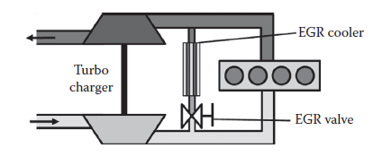
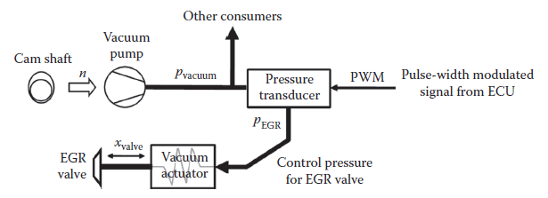
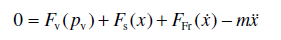
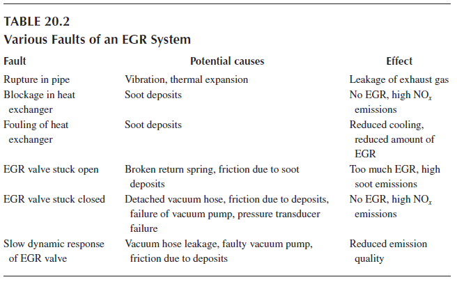
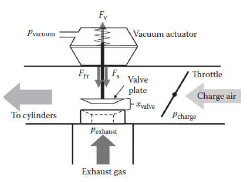
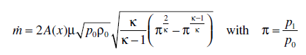
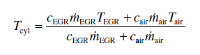
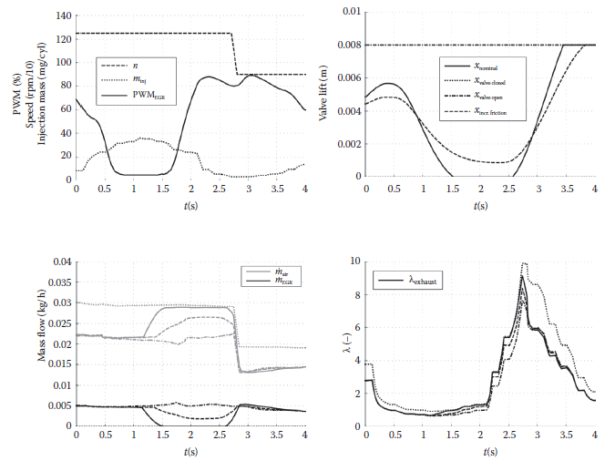
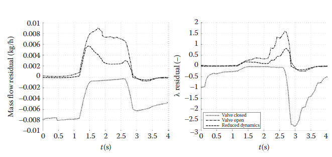
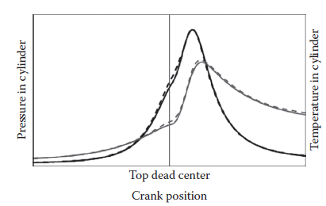

[20.3 <--- ](20_3.md) [   Зміст   ](README.md) [--> 20.5](20_5.md)

## 20.4 RT IMPLEMENTATIONS IN THE AUTOMOTIVE INDUSTRY

RT methods couple virtual and physical technical subsystems. The goal is to test physical and virtual components under practical conditions without requiring the complete system. Actual target hardware ECUs are tested using signals generated from an engine simulation on HIL test stands. Earlier stages in a model-based design process might rely on more virtual configurations: in the software-in-the-loop (SIL) configuration generated code of a control unit model is connected with a plant model. The system might neglect, for example, sensor effects and does not even run in RT. The same holds for processor-in-the-loop (PIL), but in this case, controller code runs on the target platform (Mosterman et al. 2004). Methods like HIL are attractive options in model-based development of control schemes for dynamic systems. Within the automotive industry these methods are not restricted to controller design and parameterization but are also applied (1) to quality assurance and approval of functions for testing the reaction to short circuits, cable failure, electromagnetic compatibility, and fail-safe behavior, (2) to compatibility within the control unit network in terms of interfaces and communication, and (3) to the testing of diagnostic functions (Schuette and Ploeger 2007).

There are a number of advantages of HIL methods in the field of combustion engines: 

•   Reproducibility: A simulation environment eliminates unwanted influences, such as those resulting from varying ambient pressure or temperature, and there is no limit to the amount of testing since there is no wear on virtual components.

•   Cost effectiveness: Fuel and preconditioning of media are not necessary, which leads to less energy consumption and therefore significantly reduced operating costs.

•   Development time: HIL component testing allows for fewer engine test bed or roller test bench experiments.

•   Automation: Tests can be run in an automated fashion, without requiring human interaction, which enables many configurations to be used simply by loading a different engine model.

•   Safety: Testing extreme modes of operation does not carry the risk of damaging expensive prototypes or injuring a test operator.

The additional effort required in setting up a HIL experiment consists of the implementation of an appropriate RT simulation model that is sufficiently accurate and validated with experimental data. In some cases (e.g., when no prototype of a new engine is available), it will also be necessary to create a detailed, predictive model that can be used to validate the RT model.

The following applications outline the power of RT methods notably in the field of ECUs.

### 20.4.1 Diagnosing a Faulty EG R Valve

Component diagnostics have become a crucial issue in the field of combustion engines. Legislation and the necessity to support repair technicians in error searching are the driving forces in the ongoing expansion of On-Board Diagnostics (OBD) requirements. It allows the control of engine emissions not by direct measurement of the exhaust gas but by monitoring the components that either directly or indirectly influence the quality of the emissions. A further goal of OBD is the automatic identification of the faulty component or part being responsible for poor emissions, which is stored as an error code in memory. This enables a technician to read the error memory and receive advice as to which parts require replacement in order to remedy the problem. This can avoid time-consuming error searching and saves costs as a result. In this section, diagnostic functions for an EGR valve using HIL methods are investigated.

The goal of EGR is to reduce NO*x* emissions by adding inert gas to the cylinder charge. The exhaust gas is channeled from the exhaust manifold, cooled with engine coolant, and fed into the fresh intake air flowing toward the cylinders. The amount of recirculated exhaust gas is controlled by the EGR valve. The system layout is shown in [Figure 20.5](#_bookmark122).

The EGR valve is actuated by a DC motor or by a vacuum actuator as shown in [Figure 20.6](#_bookmark122). The necessary vacuum is provided by the vacuum pump of the engine and controlled by a pressure transducer in order to achieve the desired EGR valve lift also shown in Figure 20.6.

**FIGURE 20.5** Engine layout of a high-pressure EGR system.

 

**FIGURE 20.6** Method of actuation of the EGR valve.

The EGR system is subject to very high temperatures and exposed to deposits from the soot in the exhaust gas. This makes the system susceptible to failure. As EGR is used to lower NO*x* emissions, any deviation from the prescribed behavior will have a substantial impact on emission quality. A variety of fault possibilities is shown in [Table 20.2](#_bookmark123).

It can be seen that different faults can lead to the same effect. In order to uniquely identify the cause for a fault, it is therefore not sufficient to solely detect it but also to determine particular characteristics that can be traced back to a failed component. There are many causalities in the engine behavior, which can be used for fault detection and identification, and often it is not clear even to the experienced engineer as to which ones are most relevant. For this reason, the HIL method is a valuable tool for the development of diagnostic functions as it reveals the causalities in a reproducible and cost-effective manner. A prerequisite is the usage of an appropriate RT engine model. The model equations are derived by applying Newton’s Second Law to the EGR valve plate and valve stem. Besides the inertial force due to the mass of the moving valve, acting loads occur from the friction force, the return spring force, and the force as a result of the vacuum (see [Figure 20.7](#_bookmark124)). There are additional loads resulting from the pressure difference between inlet and exhaust port. These loads are neglected because they are small and can hardly be quantified once the valve has left its closed position.

Newton’s Second Law as applied with the forces acting on the valve

is used to determine the valve position *x*. The force from the vacuum actuator *F*v depends on the pressure difference because of the vacuum *p*v, the spring force *F*s depends on the valve position, the friction force *F*Fr, implemented as a Coulomb–Stribeck function, depends on the valve velocity, and the mass *m* represents the sum of the moving masses.

**FIGURE 20.7** EGR valve system overview.

The EGR mass flow is calculated using the equation for an orifice

 

and depends on the gas states before and after the orifice, which are represented by density of the exhaust gas ρ, the pressure *p*, and the adiabatic exponent κ (Merker et al. 2006). The index 0 represents the upstream state of the orifice, and the index 1 represents the downstream state. The parameter *A*(*x*) is the flow area through the orifice dependent on valve lift. With the known values of EGR mass flow air mass flow *m*air, and their respective heat capacities *c*, the cylinder mass flow *m*cyl, and temperature *T*cyl can be calculated:

The model is embedded in a mean-value model of a diesel engine as presented, for example, in Jensen et al. (1991) and in Guzzella and Amstutz (1998). The main advantage of the model is that faults can be easily simulated, which renders it very convenient for the testing of diagnostic functions on the HIL test bed. For simplicity, only the last three fault cases from [Table 20.2 ](#_bookmark123)are considered further. These faults are introduced into the engine model by setting the valve lift to its minimum or maximum level, which represents the errors of the EGR valve stuck in a closed or open position, respectively. The increased friction is simulated by scaling the friction force by a factor of about 1.6, resulting in slow dynamic response of the valve.

Figure 20.8 shows a section of the cycle that was used for the OBD investigation. The engine speed and load were set independently as is possible on an engine test bed. The corresponding actuator signal for the EGR valve (PWMEGR) is shown in the top-left plot of [Figure 20.8](#_bookmark125). The top-right plot of this figure shows the EGR valve lift for the fault cases. The legend of this figure is representative for the subsequent figures where it is not shown completely for the sake of clarity. The valve positions for the valve stuck in open and closed position, respectively, are visible. One can also clearly see the reduced dynamic behavior of the valve with increased friction of the valve shaft.

**FIGURE 20.8** Simulated engine behavior during an induced fault occurrence.

The bottom two plots show the influence of the EGR valve faults on engine parameters. Their behavior matches the expectations well. For diagnostic functions, the parameters air mass flow and λ are of special interest as there are sensors for them in modern diesel engines that can be used for fault detection. The combustion-air ratio λ is defined as the actual air–fuel ratio divided by the stoichiometric air–fuel ratio. Model-based diagnostics (Isermann 2005) use the deviation of a sensor value from a model value, also referred to as a residual. The sensor value includes the effects of the fault while the model represents the nominal state as it is based on actuator signals and signals not affected by the fault. For diagnostics purposes, the goal is to gather as much information as possible about the fault from the residuals in order to identify the fault size, location, and time of occurrence. The residuals of the air mass flow and λ based on the simulation results given in Figure 20.8 are shown in Figure 20.9.

In creating diagnostic functions, fault patterns have to be defined and implemented as code. As this process is based on heuristic knowledge about the faults, the implementation of diagnostic functions for control units is an iterative process, which is ideally performed on a HIL test stand for reasons of cost and time savings. The diagnostic functions can be directly implemented on a prototype ECU and tested for correct operation. The residuals not only contain the information about the fault but also include model and measurement deviations and deviations due to component tolerances. It is the task of the diagnostic function to take these factors into account. In spite of careful design of the diagnostic function, final adjustments and validation with a real engine are still necessary, though.

 

**FIGURE 20.9** Residuals of mass flow and λ during the induced fault occurrence.

### 20.4.2 In-Cylinder Pressure Feedback Control

Changing legislation is forcing car manufacturers worldwide to reduce emissions and fuel consumption. Some manufacturers and suppliers are turning to in-cylinder pressure feedback control as a possibility to meet the upcoming emissions regulations, such as the EURO 6 and Tier II standards. Especially in transient operating conditions, engine emissions have much potential to be reduced by sophisticated strategies that precisely control the fuel injection and combustion process (Kuberczyk et al. 2010). Current developments in pressure sensors that can better withstand the harsh environment inside an engine are enabling new control strategies even without costly air mass flow sensors and, if otherwise present, NO*x* sensors (Klein 2009). In-cylinder pressure closed-loop control allows for an instantaneous modification of the fuel injection pattern based on the current operating conditions and the in-cylinder gas state for each cylinder. This allows for the compensation of unwanted disturbances and asymmetries between cylinders due to engine wear and variability of injectors and valves, hence optimizing the combustion of each cylinder individually (Nieuwstadt and Kolmanovsky 1999).

Employing HIL methods is a typical manner to develop these types of model- based control strategies. A HIL system requires a detailed RT simulation model providing the cylinder pressure depending on at least the current injection pattern and timing as well as the cylinder gas state, that is, temperature, pressure, and gas composition. The ECC approach presented in Section 20.3.1 is able to compute these values that describe the gas state in RT on standard computing hardware as shown for one operating point in Figure 20.10.

Commercial packages based on ECC, such as DYNA4Engine, ASM InCylinder, and GT Power RT, sample the pressure signal at a rate below 10 kHz and are able to capture all the prominent events such as ignition delay and start of ignition as well as the correct amount of energy released at the necessary time. The simulation step size must be significantly smaller than the commonly used 1 ms as evident when considering that 1 ms at an engine speed of 5000 rpm corresponds to 30 crank angle degrees. This requires a step size that is at least one order of magnitude smaller to be able to simulate the fuel injection and combustion sufficiently accurate for an ECU.

 

**FIGURE 20.10** Normalized in-cylinder pressure and temperature around top dead center— measured (dashed) and simulated (solid).

In order to obtain a realistic time-resolved simulation of the in-cylinder pressure and temperature as shown, some practical issues arise:

•   Time delays: The sampling of signals in the I/O of the test rig delays signals an amount which corresponds to the characteristic time scales of the combustion process.

•   Sensors: Because of the extreme conditions inside the cylinder, the sensor degrades and its output drifts so that a model of the of the sensor behavior is mandatory.

•   Calibration: Some control schemes evaluate absolute values and not just the shape of the pressure curve, requiring correct calibration of the model.

However, the parts of the simulation model outside of the combustion process (e.g., the air path) normally only require a 1 ms step size, a fact exploited by means of a multirate simulation. Sampling rates are adapted to the eigenfrequencies of each subsystem. The task with the high sample rate would support the combustion process, the injection signals, and the cylinder pressure signal, whereas the slower task would apply to the rest of the model (Schuette and Ploeger 2007). RT simulation of heavy duty engines with a multitude of cylinders, for example, in marine applications, can be implemented by parallelization of the multirate model across multiple processors (DYNA4Engine 2009).

[20.3 <--- ](20_3.md) [   Зміст   ](README.md) [--> 20.5](20_5.md)