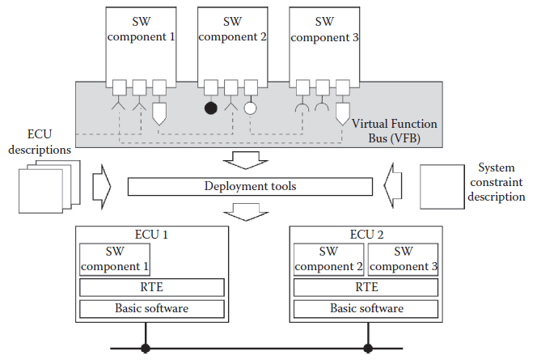
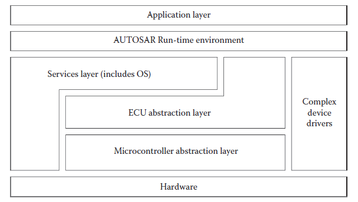
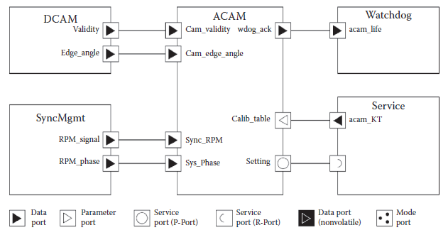
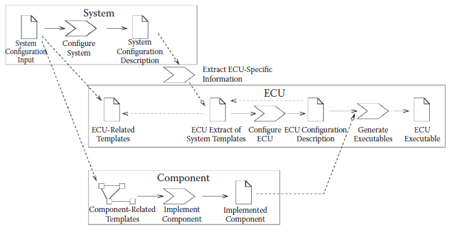
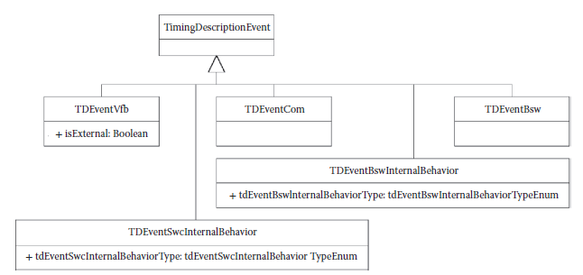
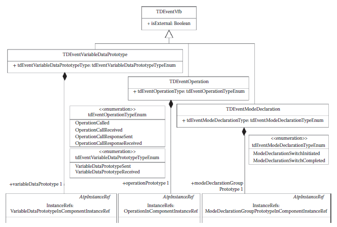
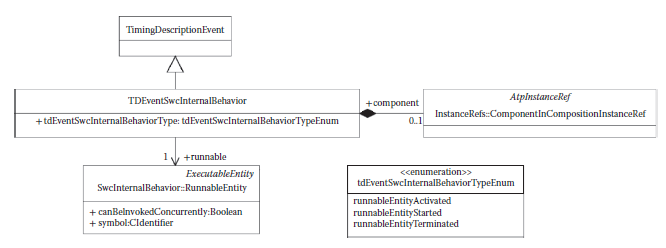
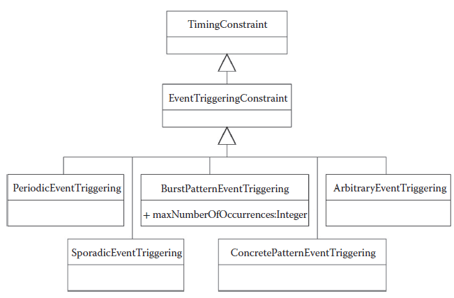
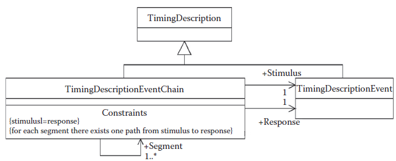

[21.1 <--- ](21_1.md) [   Зміст   ](README.md) [--> 21.3](21_3.md)

## 21.2 INTRODUCTION TO AUTOSAR

AUTOSAR was created to develop an open industry standard with a common software infrastructure based on standardized interfaces for SWC specification and integration at different layers. In agreement with the move toward an integrated architecture, the AUTOSAR goal is to enable the definition of SWCs that can execute independently from their placement in a complex, distributed platform.

AUTOSAR було створено для розробки відкритого галузевого стандарту із спільною програмною інфраструктурою на основі стандартизованих інтерфейсів для специфікації SWC та інтеграції на різних рівнях. Відповідно до руху до інтегрованої архітектури мета AUTOSAR полягає в тому, щоб уможливити визначення SWC, які можуть виконуватися незалежно від їх розміщення на складній розподіленій платформі.

The AUTOSAR architecture has three major domains. In the first, at the level of the *Virtual Functional Bus* (VFB), the system is described as a collection of application SWCs, cooperating over ports in a purely functional architecture (top part of Figure 21.1, which outlines the tool-assisted match between the AUTOSAR functional model and the execution platform). The VFB consists of the set of logical connections linking the interfaces of the cooperating SWCs. AUTOSAR separates communication from computation and synchronization. The component interface is defined as a collection of ports, and the execution of the procedures of a component is represented by a set of *runnables*, activated in response to events and defined in a *behavior level*.

Архітектура AUTOSAR має три основні домени. У першому, на рівні *Віртуальної функціональної шини* (VFB), система описується як набір SWC додатків, які взаємодіють через порти в чисто функціональній архітектурі (верхня частина рисунка 21.1, на якій представлено інструментальний підхід). відповідність між функціональною моделлю AUTOSAR і платформою виконання). VFB складається з набору логічних з’єднань, що зв’язують інтерфейси взаємодіючих SWC. AUTOSAR відокремлює зв'язок від обчислень і синхронізації. Інтерфейс компонента визначається як набір портів, а виконання процедур компонента представлено набором *runnables*, активованих у відповідь на події та визначених на *рівні поведінки*.

At runtime, the set of SWCs is executed on a standard software abstraction layer. This layer is automatically generated according to the specification of the (possibly distributed) execution platform supporting the computations and according to the specifications of the VFB layer and the behaviors of the components. The software layer between the platform and the realization of the SWCs using the standard API is called RTE (run-time environment). The RTE is the runtime implementation of the VFB and has the responsibility of implementing the virtual communication occurring over the component ports redirecting it to a concrete communication protocol. The concrete implementation differs according to the task mapping and the ECU allocation of the communicating runnables. In addition, the RTE generates events resulting from the component interactions and is responsible for the generation of periodic events.

Під час виконання набір SWC виконується на стандартному рівні абстракції програмного забезпечення. Цей рівень автоматично генерується відповідно до специфікації (можливо, розподіленої) платформи виконання, що підтримує обчислення, і відповідно до специфікацій рівня VFB і поведінки компонентів. Рівень програмного забезпечення між платформою та реалізацією SWC з використанням стандартного API називається RTE (середовище виконання). RTE є реалізацією VFB під час виконання та відповідає за реалізацію віртуального зв’язку, що відбувається через порти компонента, перенаправляючи його на конкретний протокол зв’язку. Конкретна реалізація відрізняється залежно від відображення завдань і розподілу ECU виконуваних елементів, що підключаються. Крім того, RTE генерує події в результаті взаємодії компонентів і відповідає за генерацію періодичних подій.

**FIGURE 21.1** The AUTOSAR functional model and a deployment onto a distributed architecture.

**FIGURE 21.2** The AUTOSAR standard software platform.

The RTE, in turn, runs on a standardized architecture of additional abstraction layers, device drivers, and operating system functions, which is collectively referred to as *BSW* (an outline of the standard SW platform is in Figure 21.2).

RTE, у свою чергу, працює на стандартизованій архітектурі додаткових рівнів абстракції, драйверів пристроїв і функцій операційної системи, яка спільно називається *BSW* (схема стандартної платформи SW наведена на малюнку 21.2).

The third element of the specification is the AUTOSAR process itself, or better the definition of a basic workflow that connects the main development stages, with the expected results and the definition of the tools to be used in each stage.

Третім елементом специфікації є сам процес AUTOSAR, або, краще, визначення базового робочого процесу, який поєднує основні етапи розробки, з очікуваними результатами та визначенням інструментів, які будуть використовуватися на кожному етапі.

### 21.2.1 VFB Level

The first level for the definition of an AUTOSAR system is the Functional Model, where SWCs encapsulating sets of system-level functions are connected and cooperate over a VFB ([Figure 21.1](#_bookmark126)). Later, they are bound to an execution platform consisting of ECUs connected by communication buses. AUTOSAR components may be defined hierarchically. At the bottom of the hierarchy, components are “atomic,” meaning that each instance is assigned to one ECU (cannot be distributed).

Першим рівнем для визначення системи AUTOSAR є функціональна модель, де SWC, що інкапсулюють набори функцій системного рівня, з’єднані та співпрацюють через VFB ([Рис. 21.1](#_bookmark126)). Пізніше вони прив’язуються до платформи виконання, що складається з ECU, з’єднаних комунікаційними шинами. Компоненти AUTOSAR можуть бути визначені ієрархічно. У нижній частині ієрархії компоненти є «атомарними», тобто кожен екземпляр призначається одному ECU (не може бути розподілений).

In AUTOSAR, a component defines its required and provided interface through ports, which are the only means to interact with other components. Ports may provide or require access to data or services. A port defining a provided point of access is defined as a P-Port, and a required port is called R-Port. An Interface, attached to each port, may be of type client/server, defining the signatures of the operations that are invoked or provided, or of type sender/receiver, defining a model of the data structures that are written or read. The formal description of the interface is in the *software component template*, an XML file, which includes the formal specification of the data types and the description of the communication behavior, as specified by attributes.

У AUTOSAR компонент визначає необхідний і наданий інтерфейс через порти, які є єдиним засобом взаємодії з іншими компонентами. Порти можуть надавати або вимагати доступу до даних або послуг. Порт, що визначає надану точку доступу, визначається як P-Port, а необхідний порт називається R-Port. Інтерфейс, прикріплений до кожного порту, може бути типу клієнт/сервер, що визначає сигнатури операцій, які викликаються або надаються, або типу відправник/одержувач, що визначає модель структур даних, які записуються або читаються. Формальний опис інтерфейсу міститься в *шаблоні компонента програмного забезпечення*, XML-файлі, який містить формальну специфікацію типів даних і опис поведінки зв’язку, визначеної атрибутами.

**FIGURE 21.3** AUTOSAR components and ports.

Those attributes define (among others) the length of the queues for the data ports and the behavior of receivers (blocking, nonblocking, etc.) and senders (send cyclic, etc.). Figure 21.3 shows an example of AUTOSAR components interacting over sender/receiver ports and client/server ports.

Ці атрибути визначають (серед іншого) довжину черг для портів даних і поведінку одержувачів (блокування, неблокування тощо) і відправників (циклічне надсилання тощо). На малюнку 21.3 показано приклад компонентів AUTOSAR, які взаємодіють через порти відправника/одержувача та порти клієнт/сервер.

The port syntax identifies several types of data ports: regular data type, parameter ports, and nonvolatile ports. Furthermore, the language syntax identifies special ports for the definition of mode switches and also provides for a distinction between application ports and ports that connect application components to AUTOSAR services. 

Синтаксис порту визначає кілька типів портів даних: звичайний тип даних, порти параметрів і енергонезалежні порти. Крім того, синтаксис мови визначає спеціальні порти для визначення перемикачів режимів, а також забезпечує розрізнення між портами додатків і портами, які підключають компоненти додатків до послуг AUTOSAR.

### 21.2.2 Behavioral Level

In AUTOSAR, the behavior of atomic SWCs is represented by a set of *runnable entities* (*runnables* for short) that are in essence entry points of procedures or, as stated in the standardization documents, atomic schedulable units (sequential segments of code, to be executed under the control of a scheduler), communicating with each other over the component *ports*. AUTOSAR provides several mechanisms for runnables to access the data items in the ports for *sender/receiver* communication and the services of *client/server* communication ports. In particular, access to ports of type Send/Receive can be *implicit* or *explicit*. In the case of an explicit access, it is the job of the developer to insert calls to the standard RTE API functions for reading from and writing into ports inside the runnables. If a port is accessed in an implicit way by a runnable, then the port contents are copied from the port automatically by the RTE before starting the runnable code (for receive ports) or written at the end of the runnable execution (for sender ports). The activation model, the communication among runnables, and the synchronization in the execution of runnables (local and remote) is specified in a middle-level RTE layer.

В AUTOSAR поведінка атомарних SWC представлена набором *виконуваних об’єктів* (скорочено *runnables*), які, по суті, є точками входу процедур або, як зазначено в документах стандартизації, атомарними планованими одиницями (послідовними сегментами коду). , які будуть виконуватися під керуванням планувальника), спілкуючись один з одним через *порти* компонента. AUTOSAR надає кілька механізмів для доступу до елементів даних у портах для зв’язку *відправник/одержувач* і послуг портів зв’язку *клієнт/сервер*. Зокрема, доступ до портів типу Send/Receive може бути *неявним* або *явним*. У випадку явного доступу завдання розробника полягає в тому, щоб вставити виклики стандартних функцій RTE API для читання з портів і запису в них усередині виконуваних елементів. Якщо доступ до порту виконується неявним способом, тоді вміст порту автоматично копіюється з порту RTE перед запуском виконуваного коду (для портів отримання) або записується в кінці виконання виконуваного коду (для портів відправника). . Модель активації, зв’язок між виконуваними елементами та синхронізація під час виконання виконуваних елементів (локальних і віддалених) визначені на рівні RTE середнього рівня.

### 21.2.3 RTE Level

The run-time environment (RTE) is the runtime implementation of the VFB. The RTE is local to each ECU. It is a complex layer that must provide location independence in the request of services and data communication among components. The RTE also takes care of the management and forwarding of events to runnables (for triggering their execution or releasing them from wait points). In practice, in the case of local communication, service requests are simply remapped to local function calls. In the case of remote services, the RTE forwards the call to a stub that performs marshalling of parameters in a message, selects the appropriate communication network and the corresponding device driver, transmits the message, and waits for the reply message. When the reply message arrives, the RTE extracts the returned value and closes the remote service request by returning to the caller and generating (if requested) the appropriate event.

Середовище виконання (RTE) — це реалізація VFB під час виконання. RTE є локальним для кожного ECU. Це складний рівень, який повинен забезпечувати незалежність розташування в запиті послуг і передачі даних між компонентами. RTE також піклується про керування та пересилання подій до виконуваних елементів (для ініціювання їх виконання або звільнення від точок очікування). На практиці, у випадку локального зв’язку, запити на обслуговування просто перевідображаються на локальні виклики функцій. У разі віддалених служб RTE перенаправляє виклик до заглушки, яка виконує маршалінг параметрів у повідомленні, вибирає відповідну мережу зв’язку та відповідний драйвер пристрою, передає повідомлення та очікує на повідомлення відповіді. Коли надходить повідомлення-відповідь, RTE витягує повернуте значення та закриває запит на віддалену послугу, повертаючись до абонента та генеруючи (за запитом) відповідну подію.

The available RTE events are the following: 

•   *Timing Event* triggering periodical execution of runnables.

•   *DataReceivedEvent* upon reception of a sender/receiver communication.

•   *OperationInvokedEvent* for the invocation of client/server service.

•   *DataSendCompleteEvent* upon sending a sender/receiver communication. 

Доступні такі події RTE:

• *Подія часу*, що запускає періодичне виконання виконуваних елементів.

• *DataReceivedEvent* після отримання повідомлення відправника/одержувача.

• *OperationInvokedEvent* для виклику служби клієнт/сервер.

• *DataSendCompleteEvent* після надсилання повідомлення відправника/одержувача.

Each runnable must be associated with at least one RTE event, defining its activation. The scope of each RTE event is limited to the component. For example, two periodic events with the same period activating runnables on different components are not guaranteed to be synchronous. Actually, their relative phase is unspecified unless explicitly modeled by using synchronization components (typically at the BSW level). In case a runnable is activated by more than one event, it must be reentrant or the developer must take care of protecting its internal state variables. A *WaitPoint* can be used to block a runnable while waiting for an event. Runnables that may block during their execution are called type 2, as opposed to the others, defined as type 1 (this definition impacts the selection of the operating system scheduler and of the scheduling policies). For instance, for an operation defined as part of a component interface, the behavior specifies which runnable is activated as a consequence of the operation invocation event.

Кожен runnable має бути пов’язаний принаймні з однією подією RTE, що визначає його активацію. Сфера дії кожної події RTE обмежена компонентом. Наприклад, дві періодичні події з однаковим періодом, що активують виконувані модулі на різних компонентах, не гарантовано будуть синхронними. Насправді їх відносна фаза не визначена, якщо вона явно не змодельована за допомогою компонентів синхронізації (як правило, на рівні BSW). Якщо runnable активується кількома подіями, він повинен бути повторним входом або розробник повинен подбати про захист його внутрішніх змінних стану. *WaitPoint* можна використовувати, щоб заблокувати виконуваний файл під час очікування події. Виконувані елементи, які можуть блокуватися під час виконання, називаються типом 2, на відміну від інших, визначених як тип 1 (це визначення впливає на вибір планувальника операційної системи та політики планування). Наприклад, для операції, визначеної як частина інтерфейсу компонента, поведінка вказує, який запуск активується внаслідок події виклику операції.

The only possible definition of an AUTOSAR MoC emerges from the composition of the behavior options that are attached to each interface and runnable specifications, with no guarantee of consistency. The concept of time and time-related events, which is necessary for the formal definition of an MoC, has only appeared in release 4.0 of the standard. The time model is briefly addressed and discussed in Section 21.2.5.

Єдине можливе визначення AUTOSAR MoC випливає зі складу параметрів поведінки, які додаються до кожного інтерфейсу та робочих специфікацій, без гарантії узгодженості. Концепція часу та пов’язаних із часом подій, необхідна для формального визначення MoC, з’явилася лише у версії 4.0 стандарту. Модель часу коротко розглядається та обговорюється в розділі 21.2.5.

Finally, there is the description of components/runnables at the implementation level. The language for the description of the internal behavior of runnables is not part of AUTOSAR. AUTOSAR does not require a model-based development flow: a component may be handwritten or generated from a model. For the definition of the models of the runnables, it relies on external tools such as Simulink and ASCET, which brings the issue of the composition of heterogeneous models. The lowest (most concrete) level of description specifies a reference to the code files implementing the runnables of the components and the resource consumption of SWCs. This resource requirements model includes the worst-case execution time of runnables, for which a special section is reserved in the implementation description of the runnables.

Нарешті, є опис компонентів/запусків на рівні впровадження. Мова для опису внутрішньої поведінки виконуваних програм не є частиною AUTOSAR. AUTOSAR не потребує процесу розробки на основі моделі: компонент може бути написаний від руки або згенерований з моделі. Для визначення моделей виконуваних елементів він покладається на зовнішні інструменти, такі як Simulink і ASCET, що створює проблему композиції гетерогенних моделей. Найнижчий (найконкретніший) рівень опису визначає посилання на файли коду, що реалізують запуск компонентів і споживання ресурсів SWC. Ця модель вимог до ресурсів включає найгірший час виконання runnables, для якого зарезервовано спеціальний розділ в описі реалізації runnables.

AUTOSAR defines the methodology and tool support to build a concrete system of ECUs. This includes the configuration and generation of the runtime environment (RTE) and the BSW (including the real-time operating system) on each ECU. The generation of the RTE and BSW layer is the responsibility of the *deployment tools*, which define the mapping of the function to the architecture and the generation of code based on the model of the execution platform, defined (in XML format) by the ECU *description files*.

AUTOSAR визначає методологію та підтримку інструментів для створення конкретної системи ECU. Це включає конфігурацію та створення середовища виконання (RTE) і BSW (включаючи операційну систему реального часу) на кожному ECU. За створення рівня RTE та BSW відповідають *інструменти розгортання*, які визначають відображення функції в архітектурі та генерацію коду на основі моделі платформи виконання, визначеної (у форматі XML) ECU *файли опису*.

Finally, the definition and realization of components is not limited to the application level. Designers can define runnables and components at the level of the BSW as well, with less restrictive rules. These runnables and components are included in the code automatically generated by the deployment tools and can be directly activated by events generated at the operating system level (interrupt handlers, counters, and alarms in AUTOSAR).

Нарешті, визначення та реалізація компонентів не обмежується прикладним рівнем. Розробники також можуть визначати виконувані елементи та компоненти на рівні BSW з менш обмежувальними правилами. Ці запускні елементи та компоненти включені в код, автоматично створений інструментами розгортання, і можуть бути безпосередньо активовані подіями, згенерованими на рівні операційної системи (обробники переривань, лічильники та сигнали тривоги в AUTOSAR).

### 21.2.4 AUTOSAR Process

AUTOSAR requires a common technical approach for selected steps in the development process, from the system-level configuration to the generation of the executables for each ECU. The AUTOSAR Methodology (a graphical representation is in Figure 21.4) is the description of these activities, with their inputs and outputs. The AUTOSAR Methodology is formally not a true process description since it does not prescribe the order in which the activities should be performed, neither the actors involved.

AUTOSAR вимагає спільного технічного підходу для окремих етапів процесу розробки, від конфігурації системного рівня до створення виконуваних файлів для кожного ECU. Методологія AUTOSAR (графічне зображення наведено на малюнку 21.4) є описом цих видів діяльності з їх вхідними та вихідними даними. Методологія AUTOSAR формально не є справжнім описом процесу, оскільки вона не визначає порядок, у якому слід виконувати дії, ані залучених учасників.

The first step is the creation of the *System Configuration Input*, which defines the SWCs, the hardware execution platform, and the system constraints that apply to the mapping of the components onto the ECUs. The format for the formal description is defined in a standard XML schema and includes the following templates.

Першим кроком є створення *System Configuration Input*, який визначає SWC, апаратну платформу виконання та системні обмеження, які застосовуються до відображення компонентів на ECU. Формат формального опису визначено в стандартній схемі XML і включає наступні шаблони.

**FIGURE 21.4** The AUTOSAR process.

•   *Software Components*: Each SWC is described in terms of its ports and interfaces, including the data types and the port attributes.

•   *ECU Resources*: Each ECU requires specifications regarding the processor unit(s), the available memory, and the available peripheral devices, including sensors and actuators.

•   *System Constraints*: Regarding the mapping of the signals into bus messages as well as the mapping of the component runnables into tasks and the allocation of tasks into the ECUs.

• *Програмні компоненти*: кожен SWC описується з точки зору його портів та інтерфейсів, включаючи типи даних і атрибути порту.

• *Ресурси ECU*: для кожного ECU потрібні специфікації щодо процесорного блоку(ів), доступної пам’яті та доступних периферійних пристроїв, включаючи датчики та виконавчі механізми.

• *Системні обмеження*: Стосовно відображення сигналів у повідомленнях шини, а також відображення виконуваних компонентів у завдання та розподіл завдань у ECU.

The System Configuration Input includes or references various constraints. These constraints are very simple and mostly consist of forced or forbidden mapping configurations. In reality, the template allows for the definition of estimates on the availability of resources on ECUs, thereby providing less intuitive constraints to mapping configurations.

Вхідні дані конфігурації системи містять або посилаються на різні обмеження. Ці обмеження дуже прості і здебільшого складаються з примусових або заборонених конфігурацій відображення. Насправді шаблон дозволяє визначити оцінки доступності ресурсів на ECU, таким чином забезпечуючи менш інтуїтивні обмеження для відображення конфігурацій.

The *Configure System* activity has the responsibility to map all the SWCs to ECUs and also to define the system communication matrix. This matrix describes the message frames exchanged over the system networks, that is, the mapping of the signal information (the data exchanged over ports) into the frames. Deriving such a mapping is extremely complex and consists of a system optimization problem, in which system metrics of interest, including performance and possibly reliability, extensibility, and composability should be maximized considering constraints on resources and timing requirements [4,5]. In the mind of the AUTOSAR developers, this synthesis and optimization process should be assisted by a set of tools, defined as *System Configuration*. The output of this activity is the *System Configuration Description* including system information (e.g., bus mapping and topology) and the mapping of SWCs to ECUs.

Дія *Налаштування системи* несе відповідальність за зіставлення всіх SWC з ECU, а також за визначення матриці зв’язку системи. Ця матриця описує кадри повідомлень, якими обмінюються системні мережі, тобто відображення сигнальної інформації (даних, якими обмінюються через порти) у кадри. Отримання такого відображення є надзвичайно складним і складається із задачі оптимізації системи, у якій системні показники, що цікавлять, включаючи продуктивність і, можливо, надійність, розширюваність і здатність до компонування, повинні бути максимізовані з урахуванням обмежень на ресурси та вимоги до часу [4,5]. На думку розробників AUTOSAR, цьому процесу синтезу та оптимізації має сприяти набір інструментів, визначених як *Конфігурація системи*. Результатом цієї дії є *Опис конфігурації системи*, включаючи інформацію про систему (наприклад, відображення шини та топологію) і відображення SWC в ECU.

Further steps must be performed for each ECU in the system. The activity denoted as *Extract ECU-Specific Information* extracts the information from the System Configuration Description for a specific ECU, thereby generating the *ECU Extract of System Configuration*. This step is rather simple since it consists of a projection of the elements of the System Configuration Description that are allocated to a specific ECU. At the ECU level, the system configuration stage is mirrored by the *Configure ECU* activity, where the RTE and the BSW modules are configured for each ECU. This includes the definition of the task model (the assignment of runnables to tasks) and the configuration of the scheduler and of the BSW components (driver included). The result of the activity is included in the *ECU Configuration Description*. The configuration is based on the information extracted from the *ECU Extract of System Configuration*, the definition of the *Available SWC Implementations*, and the *BSW Module Description*. The latter contains the vendor-specific information for the ECU configuration.

Подальші кроки необхідно виконати для кожного ECU в системі. Діяльність, позначена як *Extract ECU-Specific Information*, витягує інформацію з опису конфігурації системи для конкретного ECU, таким чином генеруючи *ECU Extract of System Configuration*. Цей крок є досить простим, оскільки він складається з проекції елементів опису конфігурації системи, призначених для певного ECU. На рівні ECU етап конфігурації системи відображається діяльністю *Configure ECU*, де модулі RTE та BSW налаштовуються для кожного ECU. Це включає в себе визначення моделі завдання (призначення виконуваних завдань завданням) і конфігурацію планувальника та компонентів BSW (включаючи драйвер). Результат діяльності включено в *Опис конфігурації ECU*. Конфігурація базується на інформації, отриманій з *Витягу конфігурації системи ECU*, визначення *Доступних реалізацій SWC* і *Опису модуля BSW*. Останній містить спеціальну інформацію постачальника для конфігурації ECU.

This activity defines the detailed scheduling information, the configuration of the communication module, the operating system, and other AUTOSAR services. Moreover, this is the time when an implementation must be provided for each atomic SWC. In contrast to the extraction of ECU-specific information, the configuration activity is actually a complex design synthesis and optimization step.

Ця дія визначає детальну інформацію про планування, конфігурацію модуля зв’язку, операційну систему та інші служби AUTOSAR. Крім того, це час, коли необхідно забезпечити впровадження для кожного атомарного SWC. На відміну від вилучення інформації, специфічної для ECU, конфігураційна діяльність насправді є складним етапом синтезу та оптимізації конструкції.

In *Build Executable* (last step), an executable is generated based on the configuration of the ECU. This step typically involves generating code (e.g., for the RTE and the BSW), compiling code (compiling generated code or compiling SWCs available as source code), and linking everything together into an executable.

У *Build Executable* (останній крок) виконуваний файл генерується на основі конфігурації ECU. Цей крок зазвичай включає генерацію коду (наприклад, для RTE та BSW), компіляцію коду (компіляцію згенерованого коду або компіляцію SWC, доступних як вихідний код), і зв’язування всього разом у виконуваний файл.

Parallel to these steps are several steps performed for every application SWC (to be integrated later into the system), including the generation of the component’s API and the implementation of the component’s functionality.

Паралельно з цими кроками виконується кілька кроків для кожного SWC додатка (що буде пізніше інтегровано в систему), включаючи створення API компонента та реалізацію функціональних можливостей компонента.

The initial work in this context starts with providing the necessary parts of the SWC description. That means at least the *Component Internal Behavior Description* as part of the SWC-related templates has to be filled in. The internal behavior describes the scheduling-relevant aspects of a component, that is, the runnable entities and the events they respond to. Furthermore, the behavior specifies how a component (or more precisely which runnable) responds to events like receiving data elements. However, it does not describe the detailed functional behavior of the component, which is only filled in later, when the *Component Implementation* (typically the C sources) is provided, together with additional implementation-specific information and information about the further build process steps (e.g., compiler settings, optimizations, etc.). 

Початкова робота в цьому контексті починається з надання необхідних частин опису SWC. Це означає, що принаймні *Опис внутрішньої поведінки компонента* як частину шаблонів, пов’язаних із SWC, має бути заповнено. Внутрішня поведінка описує аспекти компонента, пов’язані з плануванням, тобто запущені об’єкти та події, на які вони реагують. . Крім того, поведінка визначає, як компонент (або, точніше, який запускається) реагує на такі події, як отримання елементів даних. Однак у ньому не описується детальна функціональна поведінка компонента, яка заповнюється лише пізніше, коли надається *Реалізація компонента* (зазвичай вихідні коди C), а також додаткова інформація про реалізацію та інформація про подальший процес побудови кроки (наприклад, налаштування компілятора, оптимізація тощо).

### 21.2.5 AUTOSAR Timing Model

Starting from version 4.0, AUTOSAR includes a *Specification of Timing Extensions* [6]: a language overlaid on top of the existing AUTOSAR concepts with the primary purpose of enabling the definition of timing contracts and the (worst-case) schedulability analysis of the timing behavior of a system. Unfortunately, the keywords “simulation,” “model of computation,” or “model-to-model transformation” never appear among the list of the requirements for the timing model, which is indeed lacking with respect to the needs of a formal semantics for simulation and verification.

Починаючи з версії 4.0, AUTOSAR включає *Специфікацію розширень синхронізації* [6]: мову, яка накладається на існуючі концепції AUTOSAR з основною метою надання можливості визначення контрактів про терміни та (найгіршого) аналізу планованості тимчасова поведінка системи. На жаль, ключові слова «симуляція», «модель обчислення» або «перетворення від моделі до моделі» ніколи не з’являються в списку вимог до моделі синхронізації, чого справді бракує щодо потреб формальної семантики для моделювання та перевірка.

With respect to the AUTOSAR process, the timing specification extends the AUTOSAR metamodel, without necessitating a separate template. Also, the extension is introduced without the indication of any additional process steps. Hence, the description of the previous subsection remains fundamentally unchanged.

Що стосується процесу AUTOSAR, специфікація синхронізації розширює метамодель AUTOSAR, не вимагаючи окремого шаблону. Крім того, розширення вводиться без зазначення будь-яких додаткових етапів процесу. Отже, опис попереднього підрозділу залишається принципово незмінним.

In the specification of timing extensions for AUTOSAR, the event is the basic entity. It is used to refer to an observable behavior within a system (e.g., the activation of a *RunnableEntity* and the transmission of a frame) at a point in time. The AUTOSAR timed event is formally derived from a generic abstract concept defined as *TimedDescriptionEvent*. Unfortunately, timed events are not specializations of RTE events, but define a partly independent structure of timing annotations and constraints. As a consequence, it becomes problematic to maintain and enforce the consistency between the RTE events defining the behavior semantics (i.e., the activation and the synchronization among runnables) and the timed events providing time attributes and constraints that apply to the behaviors. The description of the timing elements follows the organization of the AUTOSAR-level views ([Figure 21.5](#_bookmark127)).

У специфікації розширень часу для AUTOSAR подія є основною сутністю. Він використовується для позначення спостережуваної поведінки в системі (наприклад, активації *RunnableEntity* і передачі кадру) у певний момент часу. Часова подія AUTOSAR формально походить від загальної абстрактної концепції, визначеної як *TimedDescriptionEvent*. На жаль, синхронізовані події не є спеціалізацією подій RTE, але визначають частково незалежну структуру часових анотацій і обмежень. Як наслідок, стає проблематично підтримувати та підтримувати узгодженість між подіями RTE, що визначають семантику поведінки (тобто активацію та синхронізацію серед запущених елементів), і тимчасовими подіями, що надають часові атрибути та обмеження, які застосовуються до поведінки. Опис елементів синхронізації відповідає організації переглядів рівня AUTOSAR ([Малюнок 21.5](#_bookmark127)).

**FIGURE 21.5** Types of events by modeling level.

**FIGURE 21.6** Timed events defined for the virtual functional bus level. 

Timing events and constraints can be applied to a *VFB-level view*. Functional end-to-end timing constraints (including possibly the physical sensors and actuators) can be captured in this view. Of course, the VFB view is independent of the platform design and of the allocation of the execution resources. Therefore, the analysis does not include any timing issues from resource scheduling, nor the description of platform overheads. Also, the internal behavior of components is not considered. In conclusion, the constraints that can be defined and analyzed are execution intervals, as opposed to deadlines, defined between events on component ports. As shown in Figure 21.6, the timed events allowed at this level mirror the corresponding RTE events on ports (such as, for example, the time at which data is sent or received, an operation called, or an operation call received). When adding the *internal behavior description*, timed events can refer to the activation, start, and termination (see Figure 21.7) of the execution of RunnableEntities. This specification still mostly applies to the definition, and possibly verification, of end-to-end deadline constraints. After the BSW and ECU generation stage, more information is available on the resources of the execution platform, and the allocation of runnables to tasks and of tasks to ECUs. Also, the model now includes the specification of schedulers and the composition of the message frames. Therefore, the events that are defined at these levels also apply to tasks and message frames. This is the level where schedulability analysis can be performed and also the level where timed events could be leveraged to simulate the impact of platform-dependent delays.

Події та обмеження синхронізації можна застосувати до *подання рівня VFB*. Функціональні наскрізні часові обмеження (включаючи, можливо, фізичні датчики та виконавчі механізми) можуть бути зафіксовані в цьому поданні. Звичайно, перегляд VFB не залежить від дизайну платформи та розподілу ресурсів виконання. Таким чином, аналіз не включає будь-які проблеми з часом, пов’язані з плануванням ресурсів, а також опис накладних витрат платформи. Також не враховується внутрішня поведінка компонентів. Підсумовуючи, обмеженнями, які можна визначити та проаналізувати, є інтервали виконання, на відміну від крайніх термінів, визначених між подіями на портах компонентів. Як показано на малюнку 21.6, тимчасові події, дозволені на цьому рівні, відображають відповідні події RTE на портах (такі як, наприклад, час надсилання або отримання даних, виклик операції або отримання виклику операції). При додаванні *внутрішнього опису поведінки*, тимчасові події можуть посилатися на активацію, початок і завершення (див. Малюнок 21.7) виконання RunnableEntities. Ця специфікація все ще в основному стосується визначення та, можливо, перевірки наскрізних обмежень кінцевих термінів. Після етапу генерації BSW і ECU доступна додаткова інформація про ресурси платформи виконання, а також про розподіл елементів виконання для завдань і завдань для ECU. Крім того, модель тепер включає специфікацію планувальників і композицію кадрів повідомлень. Тому події, визначені на цих рівнях, також застосовуються до завдань і кадрів повідомлень. Це рівень, на якому можна виконати аналіз запланованості, а також рівень, на якому можна використовувати тимчасові події для імітації впливу залежних від платформи затримок.

In general, at all levels, the occurrence of a timing event can be described by an *Event Triggering Constraint*. AUTOSAR offers four basic types of event triggering constraints as described in [Figure 21.8](#_bookmark128): *periodic events*, *sporadic events*, which are characterized by a minimum interarrival time, and *bursty events*, in which the specification defines periodic bursts occurring with a given period, and the composition of each burst in terms of number of events and minimum interarrival time. Finally, streams determined by the *position in time of each event and fully arbitrary patterns* complete the available categories.

Загалом, на всіх рівнях виникнення події синхронізації можна описати за допомогою *Обмеження запуску події*. AUTOSAR пропонує чотири основні типи обмежень ініціювання подій, як описано на [Рисунок 21.8](#_bookmark128): *періодичні події*, *спорадичні події*, які характеризуються мінімальним часом між надходженнями, і *вибухові події*, у яких специфікація визначає періодичні пакети, що відбуваються з заданим періодом, і склад кожного пакету в термінах кількості подій і мінімального часу між надходженнями. Нарешті, потоки, визначені *позицією в часі кожної події та повністю довільними шаблонами*, доповнюють доступні категорії.

In addition, the extension defines constraints and properties that apply to pairs or sets of events (their relations). One notable example of a relation among events is the event chain, with which the concept of end-to-end timing constraint is associated ([Figure 21.9](#_bookmark128)). For the purposes of simulation, an important requirement is the possibility of defining causality dependencies, that is, to enforce a partial order of execution among the system actions and the possibility of enforcing synchronization among the actions. Before the timing extensions, expressing a causal dependency and synchronizing the events triggering the execution of runnables was extremely difficult if even possible at all (an example of this difficulty is provided in the following section dealing with model-to-model transformations).

Крім того, розширення визначає обмеження та властивості, які застосовуються до пар або наборів подій (їх відносин). Одним із яскравих прикладів зв’язку між подіями є ланцюжок подій, з яким пов’язано поняття наскрізного тимчасового обмеження ([Рис. 21.9](#_bookmark128)). Для цілей моделювання важливою вимогою є можливість визначення причинно-наслідкових зв’язків, тобто забезпечення часткового порядку виконання серед дій системи та можливість забезпечення синхронізації між діями. До розширення часу вираження причинно-наслідкової залежності та синхронізація подій, що викликають виконання виконуваних елементів, було надзвичайно складним, якщо взагалі можливим (приклад цієї складності наведено в наступному розділі, присвяченому трансформаціям моделі в модель).

Unfortunately, the new timing extensions only provide a partial solution. Causality constraints can indeed be expressed by an *Execution Order Constraint*, which is used to express the functional dependency between ExecutableEntities (runnables) and to restrict their order of execution at runtime. The AUTOSAR *Synchronization Timing Constraint*, however, is not intended to be used to define a consistent time base for timed events and, in turn, for the system behavior. The definition of a set of system-wide synchronized timed events could have allowed the AUTOSAR modeling of discrete-time systems and the translation of synchronous models in AUTOSAR. However, the original purpose of the specification is different and synchronization constraints do not apply to sets of individual events but to event chains, with the possibility of synchronizing the initial stimulus or the final response times. The motivation for the current definition of timed events is to reduce the pessimism in the worst-case analysis of end-to-end response times. Indeed, the synchronization constraint is intended to be defined together with a tolerance, indicating a true specification constraint on the runtime behavior of complex chains of reactions rather than (for example) a method for enforcing a discrete-time framework.

На жаль, нові розширення часу забезпечують лише часткове рішення. Обмеження причинно-наслідкового зв’язку справді можна виразити за допомогою *Обмеження порядку виконання*, яке використовується для вираження функціональної залежності між ExecutableEntities (виконуваними елементами) і для обмеження їх порядку виконання під час виконання. Однак AUTOSAR *Обмеження часу синхронізації* не призначене для використання для визначення узгодженої бази часу для синхронізованих подій і, у свою чергу, для поведінки системи. Визначення набору загальносистемних синхронізованих за часом подій могло б дозволити моделювати AUTOSAR систем з дискретним часом і транслювати синхронні моделі в AUTOSAR. Однак початкова мета специфікації інша, і обмеження синхронізації не застосовуються до наборів окремих подій, а до ланцюжків подій, з можливістю синхронізації початкового стимулу або кінцевого часу відповіді. Мотивація для поточного визначення часових подій полягає в тому, щоб зменшити песимізм у найгіршому випадку аналізу наскрізного часу відповіді. Дійсно, обмеження синхронізації призначено для визначення разом із допуском, що вказує на справжнє обмеження специфікації на поведінку складних ланцюгів реакцій під час виконання, а не (наприклад) на метод для забезпечення виконання рамки дискретного часу.

**FIGURE 21.7** Timed events that apply to the behavior description.

**FIGURE 21.8** Metamodel of timing events in AUTOSAR 4.0.

**FIGURE 21.9** Metamodel of timing event chains in AUTOSAR 4.0.

Another set of constraints can be used for the purpose of synchronization: the offset constraints. These constraints are somewhat more suited to the synchronization of events since they explicitly target individual events rather than chains. However, an offset always refers to a single pair of events (a source and a target), which once again makes its use cumbersome for a system-wide synchronization of reactions.

З метою синхронізації можна використовувати інший набір обмежень: обмеження зсуву. Ці обмеження дещо більше підходять для синхронізації подій, оскільки вони явно націлені на окремі події, а не на ланцюги. Однак зсув завжди відноситься до однієї пари подій (джерело та ціль), що ще раз робить його використання громіздким для загальносистемної синхронізації реакцій.

In conclusion, it is worth noting that version 4.0 of the standard is very recent and still not supported by commercial tools. The hope is that future evolve and become more suited to the goals of simulation and allow for better integration (meaning on formal grounds) of heterogeneous models. 

На завершення варто зазначити, що версія 4.0 стандарту є нещодавньою і досі не підтримується комерційними інструментами. Сподіваємося, що майбутнє розвиватиметься та стане більш відповідним цілям моделювання та дозволить краще інтегрувати (тобто на формальних підставах) різнорідні моделі.

### 21.2.6 AUTOSAR Tools and the Role of Tools

From the description of the AUTOSAR process, it is very clear how the use of tools is recommended or even mandatory in several activities, such as the code generation and configuration stages. Indeed, there are currently several AUTOSAR tools available on the market. In addition, the AUTOSAR consortium members realized that there is a common or core module that is required by all tool providers. This core module includes the functions for the management of the metamodel and the enforcement of its rules in the construction of a model, the representation of the model in memory, the generation and parsing of the input and output files at each stage of the AUTOSAR process in the standard ARXML format, and basic capabilities for model editing.

З опису процесу AUTOSAR дуже чітко видно, як рекомендовано або навіть обов’язково використовувати інструменти в кількох діях, наприклад на етапах генерації коду та налаштування. Дійсно, зараз на ринку є кілька інструментів AUTOSAR. Крім того, члени консорціуму AUTOSAR зрозуміли, що існує загальний або основний модуль, який потрібен усім постачальникам інструментів. Цей основний модуль містить функції для керування метамоделлю та забезпечення дотримання її правил у побудові моделі, представлення моделі в пам’яті, генерацію та аналіз вхідних і вихідних файлів на кожному етапі процесу AUTOSAR. у стандартному форматі ARXML і базові можливості для редагування моделі.

The consortium members launched a common initiative to create an open project (Artop, an open source project, although open for contribution and use by the consortium members only [7]) that leverages the metamodeling and modeling features of the Eclipse platform [8] to develop a common foundation that could be exploited by all AUTOSAR tools developers, vendors, and users. The code of the Artop project is available to the members of the consortium that can contribute to its development and use it in the form they see fit, either directly (in the case of OEMs and Tier 1 suppliers) or, more likely, as a common starting point for the development of commercial tools in the case of tool vendors. Artop does not have simulation and analysis capabilities and does not include code generators or the mapping synthesis capability for matching a functional model to an execution platform. These components are intended to be developed as custom extensions by tool vendors.

Члени консорціуму започаткували спільну ініціативу щодо створення відкритого проекту (Artop, проект з відкритим кодом, хоча відкритий для внесення та використання лише членами консорціуму [7]), який використовує функції метамоделювання та моделювання платформи Eclipse [8] для розробити загальну основу, яку могли б використовувати всі розробники інструментів AUTOSAR, постачальники та користувачі. Код проекту Artop доступний для членів консорціуму, які можуть сприяти його розробці та використовувати його у формі, яку вони вважають за потрібне, або безпосередньо (у випадку OEM-виробників і постачальників рівня 1), або, що більш імовірно, як загальна відправна точка для розробки комерційних інструментів у випадку постачальників інструментів. Artop не має можливостей моделювання та аналізу, а також не містить генераторів коду чи можливості синтезу відображення для зіставлення функціональної моделі з платформою виконання. Ці компоненти призначені для розробки постачальниками інструментів як власних розширень.

Currently, tool vendors tend to specialize in the different process activities that are requested by the standard. Several companies offer tools for the design of AUTOSAR models. Examples of products in this area are SystemDesk by dSPACE [9], DaVinci by Vector [10], and AUTOSAR Builder by Geensoft [11]. These tools include RTE generators, but not the configuration of the BSW. Also, they offer (somewhat limited) simulation capabilities (mostly at the VFB and behavior level as discussed in more detail in the following section).

Зараз постачальники інструментів, як правило, спеціалізуються на різних процесах, які вимагаються стандартом. Кілька компаній пропонують інструменти для проектування моделей AUTOSAR. Прикладами продуктів у цій галузі є SystemDesk від dSPACE [9], DaVinci від Vector [10] і AUTOSAR Builder від Geensoft [11]. Ці інструменти включають генератори RTE, але не конфігурацію BSW. Крім того, вони пропонують (дещо обмежені) можливості моделювання (переважно на рівні VFB та поведінки, як обговорюється більш детально в наступному розділі).

Other companies provide products, such as Tresos from Elektrobit [12], specialized in the stages of BSW generation and configuration, including the operating system.

Інші компанії пропонують продукти, такі як Tresos від Elektrobit [12], спеціалізовані на етапах генерації та конфігурації BSW, включаючи операційну систему.

In general, the mapping of the functional model into the execution platform is quite far from being a synthesis process supported by an optimization engine. Currently, tools typically provide a default configuration of the task model and require a complete user specification with respect to the mapping of the tasks onto the ECUs.

Загалом, відображення функціональної моделі в платформу виконання є досить далеким від процесу синтезу, який підтримується механізмом оптимізації. Наразі інструменти зазвичай забезпечують конфігурацію моделі завдань за замовчуванням і вимагають повної специфікації користувача щодо відображення завдань на ECU.

Limited support for AUTOSAR is also offered by other modeling tools, including, for example, Simulink. The support does not include full model-to-model transformation capabilities (not surprisingly, given the sematics distance between the two models), but focuses on these areas:

•   Integration of code generated from a Simulink model with the RTE generated by AUTOSAR tools

•   Generation of a component or runnable specification by wrapping a (virtual) Simulink subsystem to allow its inclusion in an AUTOSAR model

•   Importing an AUTOSAR component specification into Simulink by automatically generating an equivalent subsystem interface model

Обмежена підтримка AUTOSAR також пропонується іншими інструментами моделювання, включаючи, наприклад, Simulink. Підтримка не включає повні можливості трансформації від моделі до моделі (що не дивно, враховуючи сематичну відстань між двома моделями), але зосереджена на таких областях:

• Інтеграція коду, створеного з моделі Simulink, із RTE, створеним інструментами AUTOSAR

• Генерація компонента або робочої специфікації шляхом обгортання (віртуальної) підсистеми Simulink для її включення в модель AUTOSAR

• Імпортування специфікації компонента AUTOSAR у Simulink шляхом автоматичного створення еквівалентної моделі інтерфейсу підсистеми

[21.1 <--- ](21_1.md) [   Зміст   ](README.md) [--> 21.3](21_3.md)