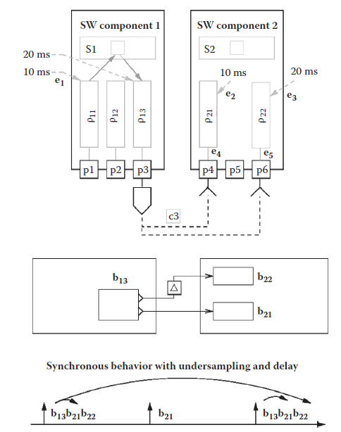
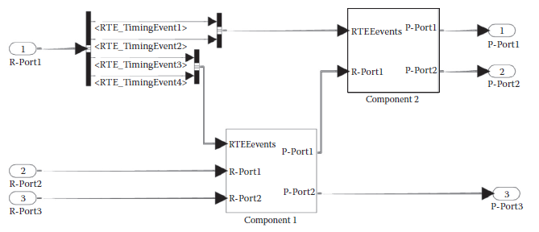
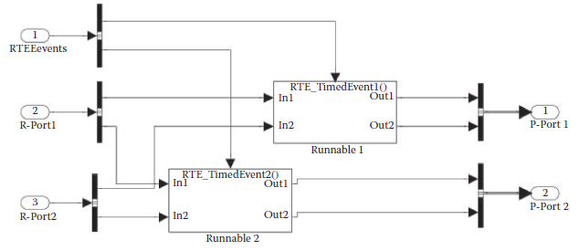
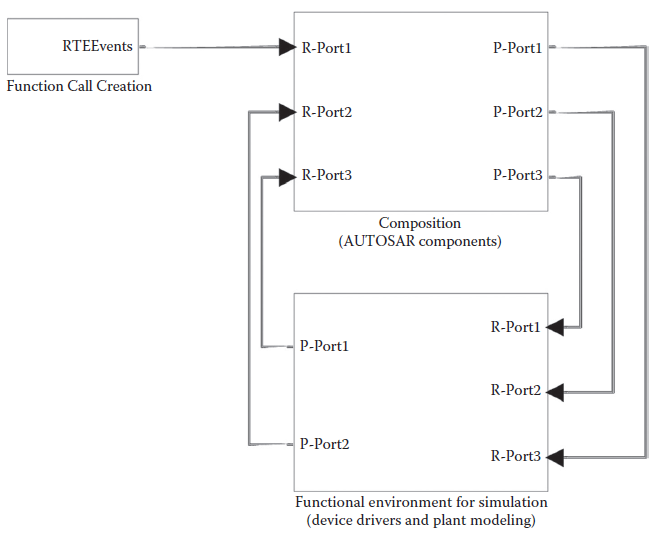

[21.3 <--- ](21_3.md) [   Зміст   ](README.md) [--> 21.5](21_5.md)

### 21.4 MODEL-TO-MODEL INTEGRATION AND TRANSLATION: FROM SIMULINK® TO AUTOSAR AND FROM AUTOSAR TO SIMULINK®

Because of the AUTOSAR limitations, including the difficulty in the definition and integration of plant models, it is quite unlikely that an AUTOSAR model is used for the early stages of control validation. Therefore, it is important to allow designers to develop controls first in a suitable environment, such as, for example Simulink. Later, the information can be translated into an AUTOSAR model that can provide the additional definition of the execution architecture and the software architecture, including the task model, with the delays and overheads that are characteristic of the execution platform, such as scheduling latencies and communication delays.

Через обмеження AUTOSAR, включаючи труднощі у визначенні та інтеграції моделей заводу, дуже малоймовірно, що модель AUTOSAR використовується на ранніх етапах перевірки контролю. Тому важливо дозволити розробникам спочатку розробляти елементи керування у відповідному середовищі, такому як, наприклад, Simulink. Пізніше інформацію можна перевести в модель AUTOSAR, яка може надати додаткове визначення архітектури виконання та архітектури програмного забезпечення, включаючи модель завдання, із затримками та накладними витратами, характерними для платформи виконання, такими як затримки планування та зв’язок затримки.

In this second step, however, there are several difficulties involved. Simulink is based on a synchronous/reactive MoC, even if without a formal definition of the model semantics. In a Simulink model in which the continuous part of the model is solved with a fixed-step solver (which is a practical requirement when the final target is generating a computer-executable implementation), all the system blocks are modeled to be executed according to a system-wide synchronous discrete-time framework. Activation events occur instantanously and synchronously across the system. Computations and communications are performed in zero logical time.

Однак на цьому другому етапі виникає кілька труднощів. Simulink базується на синхронному/реактивному MoC, навіть якщо без формального визначення семантики моделі. У моделі Simulink, у якій безперервна частина моделі розв’язується за допомогою розв’язувача з фіксованими кроками (що є практичною вимогою, коли кінцевою метою є генерація виконуваної комп’ютером реалізації), усі системні блоки моделюються для виконання відповідно до загальносистемна синхронна структура дискретного часу. Події активації відбуваються миттєво та синхронно в системі. Обчислення та обмін даними виконуються за нульовий логічний час.

In contrast, AUTOSAR is not based on a formal MoC. Completeness of behavior modeling is not mandatory since runnables are only required to be entry points to a sequential program. RTE events are local, and their scope (including periodic events) is at the component level. Therefore, the system-level behavior is defined as emerging from the cooperation of components. Several issues arise because of this choice. 

Навпаки, AUTOSAR не базується на офіційному MoC. Повнота моделювання поведінки не є обов’язковою, оскільки виконувані елементи повинні бути лише точками входу в послідовну програму. Події RTE є локальними, а їх обсяг (включаючи періодичні події) знаходиться на рівні компонентів. Таким чином, поведінка на системному рівні визначається як поява в результаті взаємодії компонентів. Через цей вибір виникає кілька проблем.

•   Communication semantics is partly specified using port attributes at the VFB-functional level and partly specified using the RTE events that define the activation of runnables following communication-related events at the RTE level. This would require semantics rules and tool support for guaranteeing the consistency of the two definitions. Similarly, timed events add yet another superstructure of specifications, which must be kept in agreement with the others.

• Семантика зв’язку частково вказується за допомогою атрибутів порту на функціональному рівні VFB і частково вказується за допомогою подій RTE, які визначають активацію виконуваних елементів після подій, пов’язаних із зв’язком, на рівні RTE. Для цього знадобляться правила семантики та інструментальна підтримка для гарантування узгодженості двох визначень. Подібним чином, часові події додають ще одну надбудову специфікацій, яка повинна узгоджуватися з іншими.

•   Activation and synchronization semantics among runnables is specified using RTE events that are local to each ECU. This makes the realization of a system-level semantics difficult. Consider, for example, the synchronous model of Figure 21.10 (in the middle) in which a block b13, activated at 20 ms and part of a subsystem communicates with two other blocks on a different subsystem: b21, activated at 10 ms (oversampling the output stream of b13), and b22, activated at 20 ms and communicating with a unit delay. According to the synchronous semantics, the activation and communication pattern for the example is represented at the bottom of the figure. The corresponding AUTOSAR system is depicted at the top of Figure 21.10. A component corresponds to each subsystem and a runnable to each block with matching index (ρ13 is the implementation of b13). The activation and communication events are represented in the figure in a nonstandard notation (in practice, when using commercial tools, they would be part of an XML description). Also, the connections between runnables and ports and the state and communication variables are expressed in a nonstandard graphical description. Assume also that the components are implemented on different ECUs. The synchronous semantics illustrated in the bottom part of the figure cannot be easily defined using the available RTE events:

• Семантика активації та синхронізації серед виконуваних елементів визначається за допомогою подій RTE, які є локальними для кожного ECU. Це ускладнює реалізацію семантики системного рівня. Розглянемо, наприклад, синхронну модель на малюнку 21.10 (посередині), у якій блок b13, активований через 20 мс і частина підсистеми, спілкується з двома іншими блоками в іншій підсистемі: b21, активований через 10 мс (передискретизація вихідний потік b13) і b22, активований через 20 мс і обмінюючись даними з одиничною затримкою. Відповідно до синхронної семантики, шаблон активації та зв’язку для прикладу представлений у нижній частині малюнка. Відповідна система AUTOSAR зображена у верхній частині рисунка 21.10. Компонент відповідає кожній підсистемі, а виконуваний — кожному блоку з відповідним індексом (ρ13 — реалізація b13). Події активації та зв’язку представлені на малюнку в нестандартній нотації (на практиці, коли використовуються комерційні інструменти, вони будуть частиною опису XML). Крім того, зв’язки між виконуваними елементами та портами, а також змінними стану та зв’язку виражені в нестандартному графічному описі. Припустимо також, що компоненти реалізовані на різних ECU. Синхронну семантику, зображену в нижній частині малюнка, не можна легко визначити за допомогою доступних подій RTE:

•   The activation events of the blocks are synchronized, whereas RTE periodic events are local to each ECU and, in principle, with an unspecified relative phase.

• Події активації блоків синхронізовані, тоді як періодичні події RTE є локальними для кожного ECU і, в принципі, з невизначеною відносною фазою.

•   The causal dependency between the inputs and outputs of blocks b21 and b22 defines a partial order (a set of precedence constraints) in the execution of blocks. Expressing this partial order using the RTE timer events or the events on data ports is not trivial. In our example, ρ21 must be activated after the production of data from ρ13 but only once every two activations of ρ13.

• Причинно-наслідкова залежність між входами та виходами блоків b21 і b22 визначає частковий порядок (набір обмежень пріоритету) у виконанні блоків. Вираження цього часткового порядку за допомогою подій таймера RTE або подій на портах даних не є тривіальним. У нашому прикладі ρ21 має бути активовано після виробництва даних з ρ13, але лише один раз кожні дві активації ρ13.

•   Finally, communication with a unit delay is difficult to express without adding a dedicated runnable.  

• Нарешті, комунікацію із затримкою блоку важко висловити без додавання спеціального запуску.

**FIGURE 21.10** Semantics issues when mapping a typical synchronous behavior in AUTOSAR. 

In reality, even if a translator from a Simulink to an AUTOSAR model would be highly appropriate for matching the needs of a model-based development flow, it is the inverse transformation that has received most of the attention and support from both sides (the AUTOSAR consortium and MathWorks®).

Насправді, навіть якщо транслятор із Simulink на модель AUTOSAR був би дуже доречним для відповідності потребам потоку розробки на основі моделі, саме зворотне перетворення отримало найбільшу увагу та підтримку з обох сторін (AUTOSAR консорціум і MathWorks®).

As part of the AUTOSAR specification, the document “Applying Simulink to AUTOSAR” [20] defines the rules to translate an AUTOSAR component (or a set of components) into a corresponding set of Simulink subsystems. Although one of the purposes of the document is to allow simulation of AUTOSAR components in a Simulink environment, a large part of the document is dedicated to the definition of translation methods that allow seamless integration of the code generated using the tools by MathWorks tools with the code generated by AUTOSAR tools for the RTE layer.

Як частина специфікації AUTOSAR, документ «Застосування Simulink до AUTOSAR» [20] визначає правила перетворення компонента AUTOSAR (або набору компонентів) у відповідний набір підсистем Simulink. Хоча одна з цілей документа полягає в тому, щоб дозволити симуляцію компонентів AUTOSAR у середовищі Simulink, значна частина документа присвячена визначенню методів перекладу, які дозволяють бездоганну інтеграцію коду, створеного за допомогою інструментів інструментами MathWorks, із код, створений інструментами AUTOSAR для рівня RTE.

Also, the Real-Time Workshop® and Simulink Coder® [21] code generator products for the Simulink simulation environment today include a large section that is dedicated to the production of AUTOSAR components specifications and AUTOSAR-compatible code from sections of a Simulink model. However, a careful read of these user manuals reveals that in essence what is provided is not a general- purpose translator from Simulink to AUTOSAR, but a set of modeling guidelines and configurations of the code generators to produce an implementation of Simulink subsystems that is compliant with the AUTOSAR interfacing conventions and the RTE event semantics, including the automatic generation of AUTOSAR (XML) component specifications.

Крім того, Real-Time Workshop® і Simulink Coder® [21] продукти для створення коду для середовища моделювання Simulink сьогодні містять великий розділ, присвячений створенню специфікацій компонентів AUTOSAR і сумісного з AUTOSAR коду з розділів моделі Simulink. Однак уважне ознайомлення з цими посібниками користувача показує, що, по суті, надається не транслятор загального призначення з Simulink на AUTOSAR, а набір інструкцій з моделювання та конфігурацій генераторів коду для реалізації підсистем Simulink, які відповідають вимогам з правилами інтерфейсу AUTOSAR і семантикою подій RTE, включаючи автоматичне створення специфікацій компонентів AUTOSAR (XML).

In essence, the model-to-model translation is straightforward (the code generation issues are more involved). AUTOSAR runnables are made to correspond to Simulink subsystems. When the AUTOSAR component has a single runnable, the subsystem models both the component and its runnable. When multiple runnables are part of the AUTOSAR component, each runnable corresponds to an atomic subsystem and the component to a wrapping (virtual) subsystem.

По суті, трансляція від моделі до моделі є простою (проблеми генерації коду є більш складними). Виконувані файли AUTOSAR відповідають підсистемам Simulink. Коли компонент AUTOSAR має єдиний запуск, підсистема моделює як компонент, так і його запуск. Якщо кілька виконуваних елементів є частиною компонента AUTOSAR, кожен виконуваний елемент відповідає атомарній підсистемі, а компонент — обгортковій (віртуальній) підсистемі.

Sender/receiver ports map onto Simulink ports. A required port or R-Port is a Simulink input and a P-Port is a Simulink output port, with the corresponding definition of interfaces mapped onto Simulink BusObjects. Some more complexities are necessary to represent the client/server (method-oriented) interfaces of AUTOSAR. The AUTOSAR standard declares the client/server communication among application components out of scope and limits itself to modeling the client ports of application components that are requesting (standardized) services from the BSW or the ECU abstraction. Also, in the case of ports modeling BSW services, the correspondence consists of a block (Stateflow® or S-function) obtaining as input the set of required arguments and calling internally the desired function with its standardized signature. Of course, capturing the semantics for the time at which the service is invoked is entirely another story, given that this semantics is not explicit in the AUTOSAR model.

Порти відправника/одержувача відображаються на портах Simulink. Необхідний порт або R-Port є входом Simulink, а P-Port — це вихідним портом Simulink, з відповідним визначенням інтерфейсів, відображеним у Simulink BusObjects. Для представлення клієнт/серверних (орієнтованих на методи) інтерфейсів AUTOSAR необхідні деякі додаткові складності. Стандарт AUTOSAR оголошує зв’язок клієнт/сервер між компонентами програми поза сферою дії та обмежує себе моделюванням клієнтських портів компонентів програми, які запитують (стандартизовані) послуги від BSW або абстракції ECU. Крім того, у випадку портів, що моделюють сервіси BSW, відповідність складається з блоку (Stateflow® або S-функції), який отримує як вхідний набір необхідних аргументів і внутрішньо викликає потрібну функцію з її стандартизованою сигнатурою. Звичайно, фіксація семантики для часу, коли послуга викликається, це зовсім інша історія, враховуючи, що ця семантика не є явною в моделі AUTOSAR.

With runnables, however, the situation is clear: runnables are executed in response to RTE events, which can be periodic (time driven) or generated by operations on ports. Correspondingly, in Ref. [20], a canonical pattern is defined where runnables are function-call subsystems in Simulink and for each SWC the corresponding Simulink subsystem defines an additional port, dedicated to the set of RTE events that trigger its runnables. The RTE events are collectively joined in a bus that is input to this special port. A bus selector is then used to route the appropriate events as triggers to the runnable subsystem. An example is shown in Figure 21.11 showing two cooperating components with their RTE event ports and the internals of the Component 1 subsystem in [Figure 21.12](#_bookmark129) showing the bus selector with the two outgoing function call signals for the runnables.

Однак із runnables ситуація зрозуміла: runnables виконуються у відповідь на події RTE, які можуть бути періодичними (в залежності від часу) або згенерованими операціями на портах. Відповідно, у вих. [20], визначено канонічний шаблон, де виконувані елементи є підсистемами виклику функцій у Simulink, а для кожного SWC відповідна підсистема Simulink визначає додатковий порт, призначений для набору подій RTE, які запускають його виконувані елементи. Події RTE спільно об’єднуються в шину, яка вводиться в цей спеціальний порт. Потім селектор шини використовується для маршрутизації відповідних подій як тригерів до підсистеми, що виконується. Приклад показано на малюнку 21.11, де показано два взаємодіючі компоненти з їхніми портами подій RTE та внутрішні елементи підсистеми Компонента 1 на [Малюнок 21.12] (#_bookmark129), де показано селектор шини з двома вихідними сигналами виклику функцій для виконуваних елементів.

Inter-runnable communication is handled by inter-runnable ports, which correspond to additional input and output ports on the runnables subsystems. The implicit or explicit communication model affects the code generation mode but not the simulation model, where access to the ports always occurs implicitly according to the Simulink semantics.

Міжвиконуваний зв’язок забезпечується міжвиконуваними портами, які відповідають додатковим вхідним і вихідним портам у підсистемах виконуваних пристроїв. Неявна або явна модель зв’язку впливає на режим генерації коду, але не на модель імітації, де доступ до портів завжди відбувається неявно відповідно до семантики Simulink.

When it comes to the composition of the AUTOSAR components and the system-level simulation, the recommended canonical pattern is the one represented in [Figure 21.13](#_bookmark129). In this pattern, the RTE events are generated by a single subsystem labeled as *Function Call Creation*. The rationale for such a centralized generation is to collect in a single block the logic controlling the execution order of runnables. The internals of this subsystem are not specified in Ref. [20] as it states that “it is up to the user to implement this in an appropriate way.”

Що стосується складу компонентів AUTOSAR і симуляції на системному рівні, рекомендований канонічний шаблон представлений на [Рис. 21.13] (#_bookmark129). У цьому шаблоні події RTE генеруються однією підсистемою, позначеною як *Створення виклику функції*. Обґрунтування такої централізованої генерації полягає в тому, щоб зібрати в одному блоці логіку, що контролює порядок виконання виконуваних елементів. Внутрішні елементи цієї підсистеми не вказані в Ref. [20], оскільки в ньому зазначено, що «користувач повинен реалізувати це належним чином».

**FIGURE 21.11** Simulink® model for forwarding runtime executable events to components and realizing data communication.

**FIGURE 21.12** Simulink® model for an AUTOSAR component with two runnables.

 

**FIGURE 21.13** Canonical pattern for the Simulink® representation of an AUTOSAR composite.

[21.3 <--- ](21_3.md) [   Зміст   ](README.md) [--> 21.5](21_5.md)