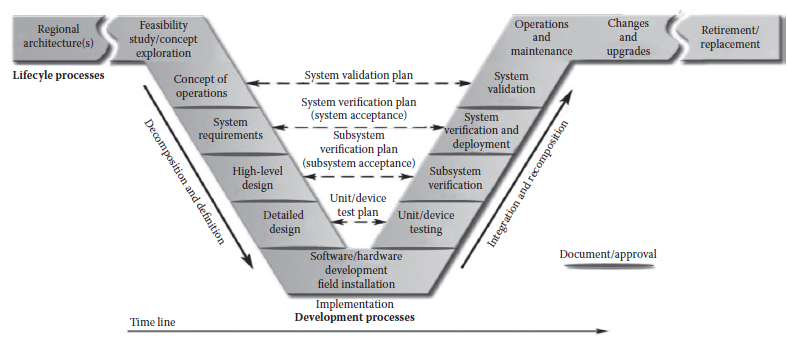

[22 <--- ](22.md) [   Зміст   ](README.md) [--> 22.2](22_2.md)

## 22.1 INTRODUCTION

With the growing adoption of model-based system development to shorten product development cycles and reduce costs and hardware prototypes, modeling of physical and control systems has emerged as a critical element in modern systems engineering efforts. The systems engineering V is a standard way to describe the processes that encompass a system engineering effort. While the V model has been refined as applied in particular industries, the core process steps are largely similar across applications. One representation of the systems engineering V as applied to intelligent transportation systems is shown in [Figure 22.1](#_bookmark130). Modeling and simulation supports the systems engineering V throughout the entire product development process. In the early stages of the V, upfront modeling supports initial concept assessment and target and requirements cascade moving down the left side of the V. Computer-aided engineering (CAE) methods such as finite element analysis (FEA) and computational fluid dynamics (CFD) are typically employed at the bottom of the V to support detailed design and development efforts. Moving back up the right side of the V, the integration and verification phases routinely involve verification and validation (V&V) using model-based representations of the engineered system. After system deployment, models can be used to help understand and diagnose issues in the field and can even provide simulation-based maintenance opportunities. Although the type of modeling naturally evolves with engineering tasks and data availability throughout the product development process, it is quite clear that models can and do play a critical role in complex systems engineering efforts.

Із зростаючим впровадженням розробки систем на основі моделей для скорочення циклів розробки продукту та зменшення витрат і прототипів апаратного забезпечення, моделювання фізичних систем і систем керування стало критичним елементом у сучасних зусиллях системної інженерії. Системна інженерія V — це стандартний спосіб опису процесів, які охоплюють роботу системної інженерії. Незважаючи на те, що модель V була вдосконалена для застосування в окремих галузях промисловості, основні кроки процесу в основному схожі для різних програм. Одне представлення системної інженерії V у застосуванні до інтелектуальних транспортних систем показано на [Рис. 22.1] (#_bookmark130). Моделювання та імітація підтримують системну інженерію V протягом усього процесу розробки продукту. На ранніх етапах V попереднє моделювання підтримує початкову оцінку концепції та каскад цілей і вимог, що рухається вниз по лівій стороні V. Методи автоматизованого проектування (CAE), такі як аналіз кінцевих елементів (FEA) і обчислювальна динаміка рідини (CFD). ) зазвичай використовуються в нижній частині V для підтримки детального проектування та розробки. Повертаючись до правого боку V, етапи інтеграції та верифікації зазвичай включають верифікацію та валідацію (V&V) з використанням представлень розробленої системи на основі моделі. Після розгортання системи моделі можна використовувати, щоб допомогти зрозуміти та діагностувати проблеми в польових умовах і навіть надати можливості обслуговування на основі моделювання. Незважаючи на те, що тип моделювання природно розвивається разом з інженерними завданнями та доступністю даних протягом усього процесу розробки продукту, цілком очевидно, що моделі можуть і відіграють вирішальну роль у складних зусиллях з розробки систем.

**FIGURE 22.1** Systems engineering V. (From National ITS Architecture Team, *Systems Engineering for Intelligent Transportation Systems*, Report no. FHWA-HOP-07-069, United States Department of Transportation, 2007, [http://www.ops.fhwa.dot.gov/publications/](http://www.ops.fhwa.dot.gov/) [seitsguide/index.htm ](http://www.ops.fhwa.dot.gov/)(accessed June 30, 2010). With permission.)

**РИСУНОК 22.1** Системна інженерія V. (Від Національної команди ITS Architecture, *Systems Engineering for Intelligent Transportation Systems*, звіт № FHWA-HOP-07-069, Міністерство транспорту США, 2007, [http:// www.ops.fhwa.dot.gov/publications/](http://www.ops.fhwa.dot.gov/) [seitsguide/index.htm ](http://www.ops.fhwa.dot.gov /) (переглянуто 30 червня 2010 р.). З дозволу.)

While upstream modeling efforts may be wholly contained in the virtual realm, the necessity to integrate models with hardware increases during the later stages of the product development process as virtual prototypes are replaced by their physical representations. Computational efficiency becomes a key issue during this stage of the integration as models must simulate in real time to satisfy hardware interface requirements. Satisfying real-time simulation constraints is often one of the most challenging tasks for model developers. Making appropriate trade-offs between model complexity and model fidelity requires keen understanding of the underlying system dynamics and the spectrum of time scales inherent in the modeled system and input drivers.

У той час як спроби моделювання на першому етапі можуть повністю міститися у віртуальній сфері, потреба в інтеграції моделей з апаратним забезпеченням зростає на пізніших етапах процесу розробки продукту, оскільки віртуальні прототипи замінюються їх фізичними представленнями. Ефективність обчислень стає ключовим питанням на цьому етапі інтеграції, оскільки моделі повинні симулюватися в режимі реального часу, щоб задовольнити вимоги до апаратного інтерфейсу. Задовольнення обмежень симуляції в реальному часі часто є одним із найскладніших завдань для розробників моделей. Встановлення належного компромісу між складністю моделі та точністю моделі вимагає глибокого розуміння базової динаміки системи та спектру часових масштабів, властивих змодельованій системі та вхідним драйверам.

This chapter introduces the modeling language Modelica [1] as a modeling platform to support real-time simulations. A brief introduction to the Modelica language and its fundamental language features will be given. The focus of this work is on the features of the Modelica language that make it desirable for modeling of physical systems for real-time targets. While the Modelica language itself is open and can be interpreted by a wide variety of free and commercial tools [54] for potential generation of real-time executables, the intent is not to focus on any particular tool or application but rather the language itself.

У цьому розділі представлено мову моделювання Modelica [1] як платформу моделювання для підтримки моделювання в реальному часі. Буде надано короткий вступ до мови Modelica та її основних мовних особливостей. Ця робота зосереджена на особливостях мови Modelica, які роблять її бажаною для моделювання фізичних систем для цілей реального часу. Незважаючи на те, що сама мова Modelica є відкритою і може бути інтерпретована широким спектром безкоштовних і комерційних інструментів [54] для потенційного створення виконуваних файлів у реальному часі, намір полягає не в тому, щоб зосередитися на якомусь конкретному інструменті чи програмі, а скоріше на самій мові.

[22 <--- ](22.md) [   Зміст   ](README.md) [--> 22.2](22_2.md)