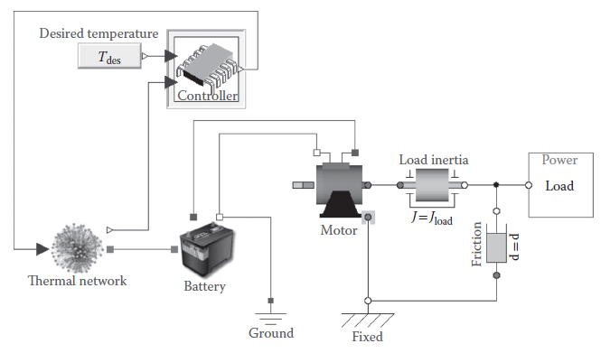
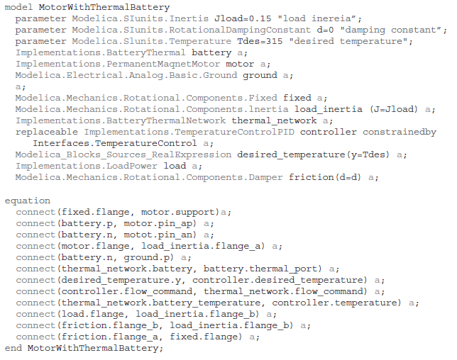
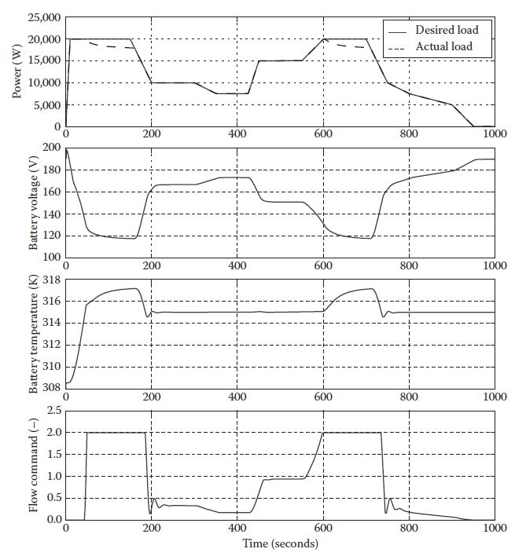
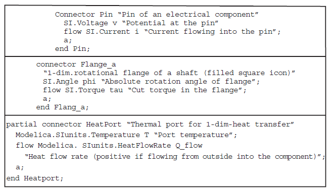
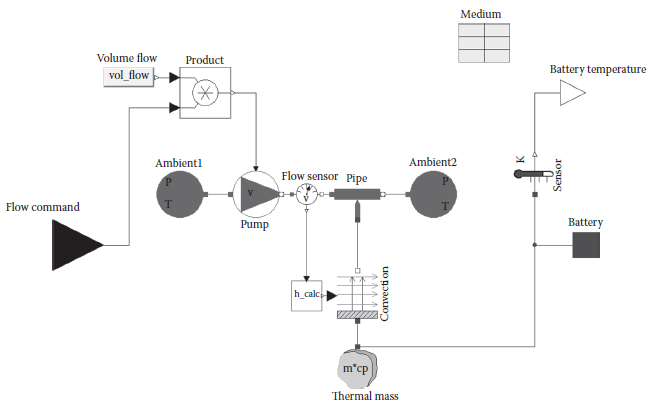

[22.1 <--- ](22_1.md) [   Зміст   ](README.md) [--> 22.3](22_3.md)

## 22.2 MODELICA OVERVIEW

Modelica is a nonproprietary, object-oriented modeling language for multidomain physical systems. Models in Modelica are described by differential, algebraic, and discrete equations. Modelica has been used to model a wide variety of complex physical systems in the mechanical, electrical, thermal, hydraulic, pneumatic, and fluid domains with significant industrial application in the aerospace, automotive, and process industries. An extensive list of publications, including the full proceedings from all Modelica conferences, is available on the publication page of the Modelica website [2]. As a complement to modeling of acausal physical behavior, Modelica also supports modeling of systems with prescribed input/output (I/O) relationships (i.e., causal systems), such as control systems and hierarchical state machines. This section gives a brief overview of the Modelica language and its fundamental language features. 

### 22.2.1 History

The Modelica language has evolved as a collaboration between computer scientists and engineers to provide a modeling language to describe the behavior of multidomain physical systems in an open format not tied to a particular tool. The roots of the Modelica language can be traced back to Hilding Elmqvist’s PhD thesis [3] in which he designed and implemented the Dymola modeling language. The Dymola language used an object-oriented, equation-based approach to formulate models of physical systems. Rather than forcing modelers to pose the problem using ordinary differential equations (ODEs) for which many solvers exist, the Dymola language allowed the problem to be posed as differential-algebraic equations (DAEs), which is generally considered a more natural way to describe physical problems [4]. Sophisticated symbolic algorithms were used in the language implementation to transform the mathematical model into a form capable of solution by existing numerical solvers. As symbolic algorithms advanced, in particular, the Pantelides algorithm [5] for DAE index reduction, it became possible to solve an even larger class of problems using the new approach pioneered by the Dymola language. Within the context of the ESPRIT project “Simulation in Europe Basic Research Working Group (SiE-WG),” Hilding Elmqvist in 1996 sought to bring together a group of object-oriented modeling language developers and engineering simulation experts in an attempt to develop a new modeling language to describe physical systems over a wide range of engineering domains. After a series of 19 meetings over the course of the next 3 years, version 1.3 of the Modelica language specification was released in December 1999.

The Modelica language specification is maintained by the Modelica Association, a nonprofit, nongovernmental organization established in 2000. The Modelica Association consists of individual and organizational members who actively participate in the design of the Modelica language. Since the initial release of the language specification, several major updates to the language have been released that incorporate additional language elements. The current version of the Modelica specification is version 3.2 [1]. The current and the previous versions of the Modelica specification are available on the Modelica website [6]. In addition to the Modelica language specification, the Modelica Association also develops and maintains the Modelica Standard Library (MSL), a large, free, multidomain library of Modelica models. The MSL serves as a common link between free and commercial library developers to promote compatibility between implementations. A listing of free and commercial libraries is available on the libraries page of the Modelica website [7]. For more history on the Modelica language, the interested reader is referred to the two published books on the language [8,9]. The most current information on the Modelica language can be found on the Modelica website at [www.modelica.org ](http://www.modelica.org/)[10]. 

### 22.2.2 Modelica Example

To illustrate a few key features of the Modelica language, consider the example shown in Figure 22.2. This multiphysics model consists of a battery connected to a motor driving a load. The battery model includes the heat-generation effects of the dissipative resistance and the resulting degradation in voltage due to thermal effects. The thermal network model includes a lumped model of the battery thermal mass along with simple flow-based cooling through convection. A controller controls the battery cooling by monitoring the battery temperature and actuating the flow rate in the cooling system to achieve the desired battery temperature. This multidomain physical system model contains elements from the mechanical (rotational), electrical, and thermal domains. The model was constructed both from component models in the MSL and from models implemented by the authors.

The Modelica source code for the example model is shown in [Figure 22.3](#_bookmark132). The Modelica source code completely describes the dynamics of the system, but a compiler is necessary to actually simulate the example. As will be described later in this chapter in more detail, the compiler flattens the equations in the Modelica source code and combines them into a causal set from which computer code can be generated for integration with existing numerical solvers.

**FIGURE 22.2** Modelica example model.

**FIGURE 22.3** Modelica code for example model.

To provide further understanding of the dynamics of the model, [Figure 22.4](#_bookmark133) shows simulation results as generated by the commercial tool Dymola* [11] (\* Dymola was used to generate all simulation results shown throughout this work though nearly any Modelica-compliant tool could have been used.). The load applied to the system is shown along with the resulting battery terminal voltage, battery temperature, and the controlled flow command for battery cooling. Note that the cooling system has a fixed cooling capacity that is insufficient to maintain the battery temperature under high-load conditions. Since the battery voltage is a function of the temperature, the desired load power is not met under all conditions. This example model will be used in Sections 22.3.4 and 22.3.5 to illustrate key concepts related to real-time modeling capability and model configuration.

A key language feature in Modelica is the connector concept. Connectors are used to define the interfaces of the models. A unique connector is defined once for each physical domain. A connector definition primarily consists of two kinds of variables: a potential variable and a flow variable. These variables can also be described as “across and through” or “effort and flow” variables. Special semantics apply to connections made between connectors, and such connections result in equations between variables in the connectors. In a connection set, all matching potential variables are equated, and all matching flow variables are summed to zero at the connection point. Referring to the example model in [Figure 22.2](#_bookmark131), the rotational connectors are depicted as gray circles, the electrical connectors as blue squares, and the thermal connectors as red squares connected between the battery and the thermal network components. The definitions of the connectors from the MSL are shown in [Figure 22.5](#_bookmark134).

**FIGURE 22.4** Sample simulation results from the motor battery example.

The connector concept is extremely powerful as it facilitates natural, acausal modeling of physical systems where connections between components in the Modelica model mimic connections seen in the physical world. As will be discussed in more detail, acausal models include no a priori assumptions about causality and allow quick and effortless model construction and reconfiguration. For example, a connection between rotational connectors is equivalent to a rigid connection (i.e., a kinematic constraint or an inertialess shaft) between physical elements. In the electrical domain, a connection between components is equivalent to a lossless wire connection (i.e., a perfect short). Just as physical systems are constructed through connections between hardware components, Modelica models are constructed through connections between equivalent virtual components. In this way, the virtual representation is consistent with system design schematics used by engineers.

**FIGURE 22.5** Connector definitions.

Another key feature of the connector-based approach is the ability to seamlessly integrate models from various sources. The use of the standard connectors defined in the MSL ensures model compatibility between the MSL, user-implemented, free, and commercial libraries. Thus, Modelica with its open language specification is also an ideal model exchange format. As mentioned previously, the example model in [Figure 22.2 ](#_bookmark131)consists primarily of models from the MSL. At the top level of the model, the motor, damper, and inertia components are from the MSL. The thermal network, battery, load, and controller were primarily implemented as subsystems constructed from lower-level components of the MSL. The thermal network subsystem model is shown in [Figure 22.6](#_bookmark135). The only author-implemented model in the thermal network is the component that calculates the heat transfer coefficient for the convection element based on the cooling flow rate. With established multidomain connectors, model implementations using those connectors in the MSL, and other core language features to promote model reuse and configurability, the Modelica language provides a powerful platform for model-based systems engineering.

**FIGURE 22.6** Thermal network subsystem from example model.

[22.1 <--- ](22_1.md) [   Зміст   ](README.md) [--> 22.3](22_3.md)