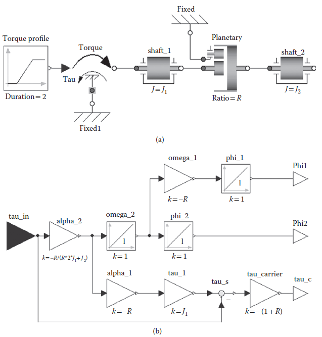
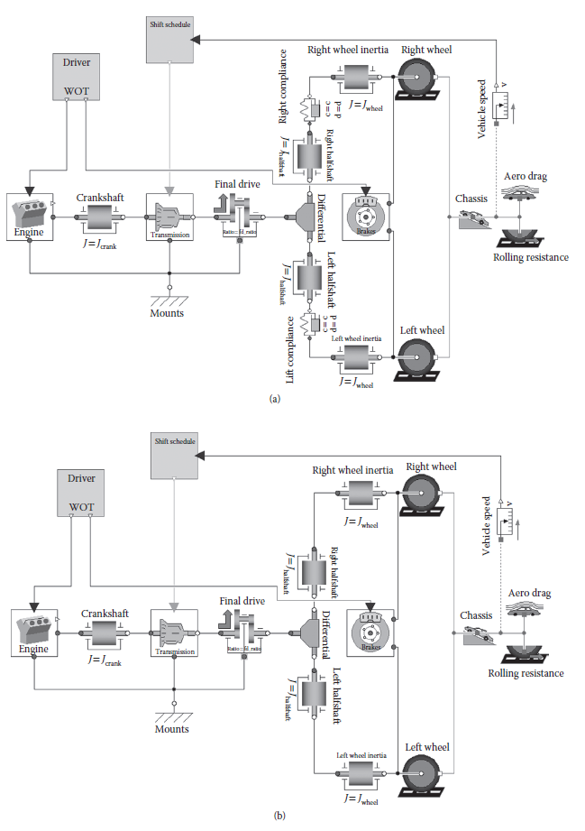
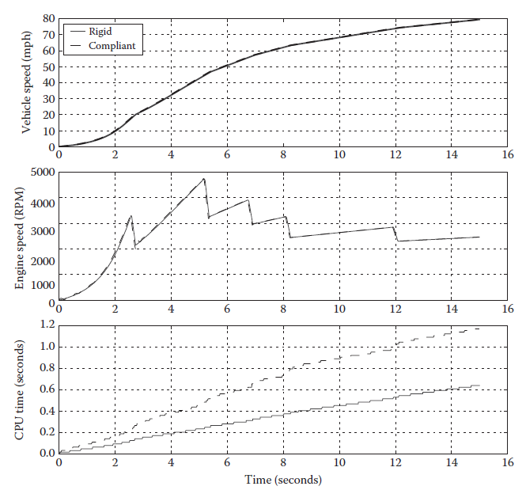
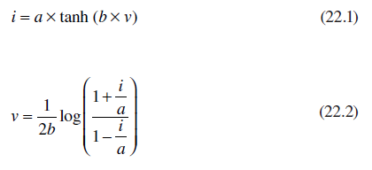
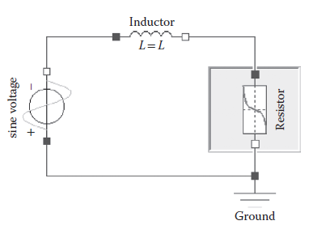
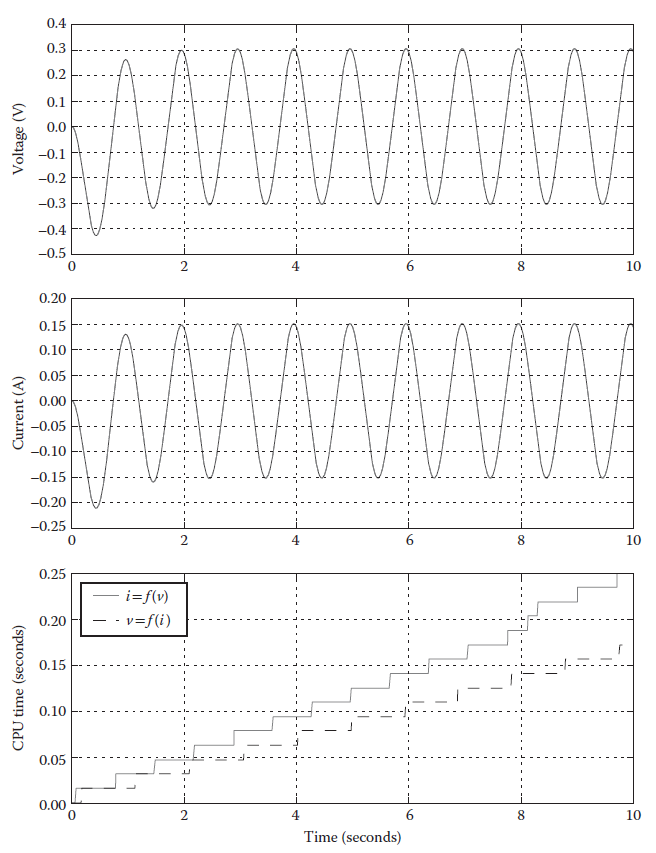
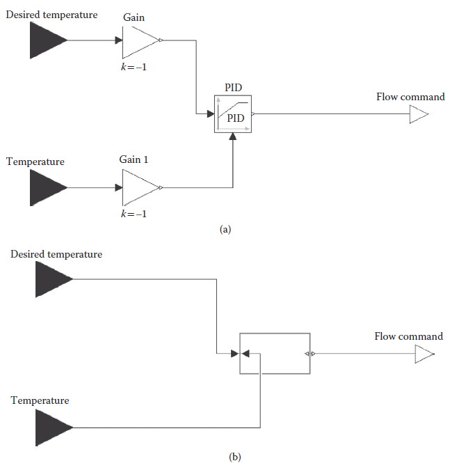
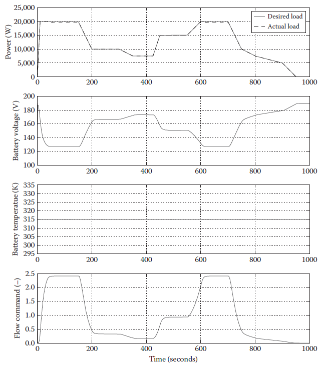
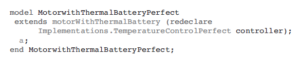
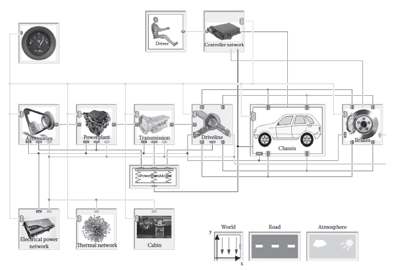

[22.2 <--- ](22_2.md) [   Зміст   ](README.md) [--> 22.4](22_4.md)

## 22.3 MODELICA FEATURES

With that brief introduction to the Modelica language, this section elaborates more specifically on Modelica language features and associated attributes that make Modelica a desirable platform for real-time simulation. The focus will be primarily on Modelica although a few tool-specific implementations relative to real-time simulation capability are briefly discussed.

З цим коротким вступом до мови Modelica цей розділ детальніше розкриває особливості мови Modelica та пов’язані з нею атрибути, які роблять Modelica бажаною платформою для симуляції в реальному часі. Основна увага буде зосереджена на Modelica, хоча коротко обговорено кілька реалізацій інструментів, пов’язаних із можливостями моделювання в реальному часі.

### 22.3.1 Open Platform

Modelica is a nonproprietary language and thus offers an open platform for model and application development. The nonproprietary nature of the language allows intellectual property captured in models to be maintained separate from the tools thereby allowing model developers to move freely among Modelica-capable tools based on their relative merits. This situation is in stark contrast to other simulation tools where the models are integrated with the tools in a proprietary way and thus are not portable to other tools. While conformance to the same language syntax allows tool-independent model formulation, it should be noted that simulating the same model identically between tools also requires that the execution engine is formalized and used as reference semantics for each of the tools.

Modelica є непатентованою мовою, тому пропонує відкриту платформу для розробки моделей і додатків. Непатентований характер мови дозволяє зберігати інтелектуальну власність, зафіксовану в моделях, окремо від інструментів, що дозволяє розробникам моделей вільно переміщатися між інструментами, сумісними з Modelica, на основі їхніх відносних переваг. Ця ситуація різко контрастує з іншими інструментами моделювання, де моделі інтегровані з інструментами запатентованим способом і, отже, не переносяться на інші інструменти. Хоча відповідність одному і тому ж синтаксису мови дозволяє незалежне від інструментів формулювання моделі, слід зазначити, що імітація тієї самої моделі між інструментами також вимагає, щоб механізм виконання був формалізований і використовувався як еталонна семантика для кожного інструменту.

Another opportunity that arises from the open platform is that of accessibility. Since the Modelica specification is open and freely available, any interested party is welcome to create a parser and even a compiler to interpret Modelica source code. With source code for many solvers already available, it is certainly feasible to create custom tools for Modelica model development and simulation. For example, the Modelica Software Development Kit (SDK) [12] provides an API and Modelica compiler to allow Modelica code to be embedded into existing software and tools.

Ще одна можливість, яку відкриває відкрита платформа, — це доступність. Оскільки специфікація Modelica є відкритою та вільно доступною, будь-яка зацікавлена сторона може створити аналізатор і навіть компілятор для інтерпретації вихідного коду Modelica. Завдяки вихідному коду для багатьох розв’язувачів уже доступно, безсумнівно, можливо створювати спеціальні інструменти для розробки моделей Modelica та моделювання. Наприклад, Modelica Software Development Kit (SDK) [12] надає API і компілятор Modelica, що дозволяє вбудовувати код Modelica в існуюче програмне забезпечення та інструменти.

The open platform also supports innovation from small companies and universities. Several open-source, Modelica-based projects have been initiated. OpenModelica [13] is an open-source Modelica modeling and simulation environment. JModelica.org [14] is an open-source Modelica-based platform for simulation and optimization. Scicos [15] developed at INRIA is a modeling and simulation environment that includes partial support for Modelica. While these offerings may not be as comprehensive in their support of the Modelica language as existing commercial tools, they certainly illustrate potential for innovative offerings based on the open Modelica platform.

Відкрита платформа також підтримує інновації невеликих компаній та університетів. Було започатковано кілька проектів з відкритим кодом на основі Modelica. OpenModelica [13] — це середовище моделювання та імітації Modelica з відкритим кодом. JModelica.org [14] є відкритою платформою на основі Modelica для моделювання та оптимізації. Scicos [15], розроблений в INRIA, є середовищем моделювання та імітації, яке включає часткову підтримку Modelica. Хоча ці пропозиції можуть бути не такими повними щодо підтримки мови Modelica, як існуючі комерційні інструменти, вони, безсумнівно, демонструють потенціал для інноваційних пропозицій на основі відкритої платформи Modelica.

Besides accessibility to the Modelica language for custom tool development, another benefit of the open platform is the large quantity of high-quality models that are available in the MSL and free Modelica libraries. Rather than working on simplified, academic problems, the existing Modelica model base provides high-quality, relevant models in multiple engineering domains that can be used to fully support tool and algorithm development. These models allow tool and algorithm innovators to work on real technical problems with models that are already available thus reducing the burden of creating complex examples to showcase new algorithm or tool capabilities.

Крім доступу до мови Modelica для розробки спеціальних інструментів, ще однією перевагою відкритої платформи є велика кількість високоякісних моделей, доступних у MSL і безкоштовних бібліотеках Modelica. Замість того, щоб працювати над спрощеними академічними проблемами, існуюча база моделей Modelica надає високоякісні релевантні моделі в багатьох інженерних областях, які можна використовувати для повної підтримки розробки інструментів і алгоритмів. Ці моделі дозволяють новаторам інструментів і алгоритмів працювати над реальними технічними проблемами з уже доступними моделями, таким чином зменшуючи навантаження на створення складних прикладів для демонстрації нових можливостей алгоритму чи інструменту.

### 22.3.2 Acausal Modeling

Modelica supports two of the most common modeling formalisms for continuous systems: block diagram and acausal modeling [8]. The block diagram approach involves constructing systems of component blocks to calculate unknown quantities from known quantities. The block diagram, or causal, approach is very well suited to modeling of controllers where the signal flow concept is quite natural. The sensor signals are known inputs, and the controller model is responsible for calculating actuation signals based on the sensed signals. The block diagram approach is not as well suited to physical system modeling in which the relevant mathematical description for the behavioral dynamics consists of conservation equations. For example, what would be the “input” to a resistor?

Modelica підтримує два найпоширеніші формалізми моделювання для неперервних систем: блок-схему та акаузальне моделювання [8]. Підхід блок-схеми передбачає побудову систем компонентних блоків для обчислення невідомих величин з відомих величин. Блок-схема або причинно-наслідковий підхід дуже добре підходить для моделювання контролерів, де концепція потоку сигналу є цілком природною. Сигнали датчиків є відомими входами, а модель контролера відповідає за обчислення сигналів приведення в дію на основі отриманих сигналів. Підхід блок-схеми не так добре підходить для моделювання фізичної системи, у якій відповідний математичний опис динаміки поведінки складається з рівнянь збереження. Наприклад, яким буде «вхід» для резистора?

Acausal modeling involves modeling components from a free body or first principles sense without a priori assumptions about I/O causality. Acausal models specify relationships in which potentials across components drive flow of conserved quantities. Physical components are naturally acausal and are naturally described by the Modelica connec- tor-based approach. [Figure 22.7 ](#_bookmark136)shows an example of a mechanical system modeled with both acausal and block diagram formalisms in Modelica. For those familiar with the physical system schematics, the acausal representation is a natural virtual representation. Furthermore, the acausal component models can be reused regardless of the causality imposed by the system while the implementation of the block diagram model changes drastically because of fundamental changes in the inputs and thus the model structure.

Акаузальне моделювання передбачає моделювання компонентів із вільного тіла або сенс перших принципів без апріорних припущень щодо причинності введення/виведення. Акаузальні моделі визначають відносини, в яких потенціали між компонентами керують потоком збережених величин. Фізичні компоненти природно акаузальні та природно описуються за допомогою підходу на основі з’єднувача Modelica. [Рисунок 22.7 ](#_bookmark136) показує приклад механічної системи, змодельованої як акаузальним, так і блок-схемним формалізмом у Modelica. Для тих, хто знайомий зі схемами фізичної системи, акаузальне представлення є природним віртуальним представленням. Крім того, моделі акаузальних компонентів можна повторно використовувати незалежно від причинності, нав’язаної системою, тоді як реалізація моделі блок-схеми різко змінюється через фундаментальні зміни вхідних даних і, отже, структури моделі.

Another benefit of the acausal modeling formalism as implemented in Modelica is that components can generally be connected in a physical way without restriction. This feature has a profound impact both on model management and configuration and on model computational efficiency, a critical factor in real-time simulation. One of the key challenges in real-time simulations is striking a balance between model fidelity and computational expense. To achieve this balance, idealizations to improve performance are often required.

Ще одна перевага формалізму акаузального моделювання, реалізованого в Modelica, полягає в тому, що компоненти загалом можна з’єднувати фізично без обмежень. Ця функція суттєво впливає як на керування та конфігурацію моделі, так і на обчислювальну ефективність моделі, критичний фактор у моделюванні в реальному часі. Однією з ключових проблем у моделюванні в реальному часі є досягнення балансу між точністю моделі та витратами на обчислення. Щоб досягти цього балансу, часто потрібна ідеалізація для покращення продуктивності.

**FIGURE 22.7** Sample model in (a) acausal and (b) block diagram formalisms. 

To illustrate this point, a vehicle modeling example is considered. There are many compliant elements in a vehicle drivetrain, and these elements can lead to significant noise, vibration, and harshness (NVH) issues in the driveline as excited under various driving conditions. Capturing the NVH effects in the driveline necessitates the modeling of the key compliances in the system and results in higher-order dynamics in the vehicle drivetrain. These higher-order dynamics are, in fact, the focus of the NVH modeling effort. In addition to the NVH model, another class of vehicle models is focused on the simulation of vehicle performance and fuel economy. Performance and fuel economy models are typically simulated over long time scales, including drive cycles that can be thousands of seconds in length. On this time scale, the higher-frequency NVH effects do not typically impact the vehicle-level results significantly. Thus, the idealization of the drivetrain as rigid is a perfectly reasonable assumption for a performance and fuel economy model.

Щоб проілюструвати це положення, розглянуто приклад моделювання автомобіля. У трансмісії транспортного засобу є багато сумісних елементів, і ці елементи можуть призводити до значних проблем із шумом, вібрацією та різкістю (NVH) у трансмісії під час збудження за різних умов водіння. Врахування ефектів NVH у трансмісії вимагає моделювання ключових відповідностей у системі та призводить до динаміки вищого порядку трансмісії автомобіля. Ця динаміка вищого порядку є, по суті, центром зусиль моделювання NVH. На додаток до моделі NVH, інший клас моделей транспортних засобів орієнтований на моделювання продуктивності автомобіля та економії палива. Моделі продуктивності та економії палива зазвичай моделюються протягом тривалого часу, включаючи цикли руху, які можуть тривати тисячі секунд. У цьому часовому масштабі високочастотні ефекти NVH зазвичай не впливають суттєво на результати на рівні автомобіля. Таким чином, ідеалізація трансмісії як жорсткої є цілком розумним припущенням для моделі продуктивності та економії палива.

**FIGURE 22.8** Simplified vehicle models with a (a) compliant and (b) rigid drivetrain.

To illustrate the two classes of vehicle models, consider Figure 22.8, which shows a simplified vehicle model with a compliant and rigid drivetrain. The two models are identical save for the spring-damper element that represents the compliance of the half shafts. Note that the rigid model actually has two inertia elements connected together representing the wheel and half shaft inertias. While many physical modeling tools have difficulties with such configurations (because they lead to high-index DAEs), this is not the case in Modelica, which was designed with high-index systems in mind. Connecting two inertias together might seem odd, especially in a flat model such as the ones shown in [Figure 22.8](#_bookmark137). This topic will be addressed shortly as part of the configuration management discussion.

Щоб проілюструвати два класи моделей транспортних засобів, розглянемо малюнок 22.8, на якому зображено спрощену модель транспортного засобу із сумісною та жорсткою трансмісією. Дві моделі є ідентичними, за винятком пружинно-демпферного елемента, який представляє податливість півосі. Зауважте, що жорстка модель фактично має два з’єднані разом інерційні елементи, що представляють інерцію колеса та півосі. Хоча багато інструментів фізичного моделювання мають труднощі з такими конфігураціями (оскільки вони призводять до DAE з високим індексом), це не так у Modelica, яка була розроблена з урахуванням систем з високим індексом. Поєднання двох інерцій може здатися дивним, особливо в плоскій моделі, як показано на [Рис. 22.8] (#_bookmark137). Ця тема буде незабаром розглянута в рамках обговорення керування конфігурацією.

Now consider the situation where the compliant model is used for performance and fuel economy simulations, perhaps because of limitations in the modeling tool to handle rigid, kinematic connections. In an attempt to stiffen the compliant model to mimic the behavior of a truly rigid model, the stiffness of the compliant element is increased. Figure 22.9 shows simulation results from a wide open throttle (WOT) simulation of the rigid and compliant vehicle model. The stiffness of the compliant vehicle model has been set to roughly twice the typical half shaft stiffness to approach the behavior of the rigid model. The vehicle-level behavior of the two models is nearly identical as can be seen from the vehicle speed and the engine speed comparisons. However, the computational expense is nearly twice as great for the compliant model as illustrated by the CPU time required for the simulation. In particular, note the jumps in CPU time corresponding to each shift event in the compliant model. While this evaluation was performed with an open loop WOT test to try and isolate the compliant effects, it should be noted also that the WOT simulation is not nearly as dynamic as a drive cycle where the driver inputs could be changing much more rapidly thus introducing even more shift events and likely resulting in even larger differences in simulation time between the compliant and the rigid models.

Тепер розглянемо ситуацію, коли сумісна модель використовується для моделювання продуктивності та економії палива, можливо, через обмеження в інструменті моделювання для обробки жорстких кінематичних з’єднань. У спробі підсилити податливу модель, щоб імітувати поведінку дійсно жорсткої моделі, жорсткість податливого елемента збільшується. На рисунку 22.9 показано результати моделювання моделі транспортного засобу з широко відкритим дроселем (WOT). Жорсткість сумісної моделі транспортного засобу була встановлена приблизно вдвічі більшою за типову жорсткість півосі, щоб наблизитися до поведінки жорсткої моделі. Поведінка двох моделей на рівні транспортного засобу майже однакова, як можна побачити з порівняння швидкості автомобіля та частоти обертання двигуна. Однак витрати на обчислення майже вдвічі більші для сумісної моделі, як це видно з процесорного часу, необхідного для моделювання. Зокрема, зверніть увагу на стрибки процесорного часу, що відповідають кожній події зсуву в сумісній моделі. Хоча це оцінювання було виконано за допомогою тесту WOT з відкритим циклом, щоб спробувати виділити сумісні ефекти, слід також зазначити, що симуляція WOT не є настільки динамічною, як цикл приводу, де вхідні дані драйвера можуть змінюватися набагато швидше, таким чином вводячи навіть більше подій зсуву, що, ймовірно, призведе до ще більшої різниці в часі моделювання між сумісною та жорсткою моделями.

**FIGURE 22.9** Simulation results from rigid and compliant vehicle model.

While the simple vehicle model shown in [Figure 22.8 ](#_bookmark137)modeled the drivetrain in a flat fashion at the top level of the model without introducing another level of hierarchy, this modeling approach was primarily used to make it easier to illustrate the differences between the rigid and the compliant models. In fact, even this simple model includes enough components and connections that the top level of the model is becoming crowded and would benefit in terms of readability from the grouping of additional components into logical subsystems. As mentioned previously, it may seem that the potential need for the compliant element in the vehicle model is an artifact of the modeling of the half shaft and wheel as two separate inertias instead of a single effective inertia. While it is easy to see the two inertias connected together in the flat model, it would not be as obvious if the two inertias were part of separate subsystems. Another benefit of grouping components into subsystems is to take advantage of an architecture-based modeling and model configuration approach. This topic will be discussed in more detail later in this chapter. An architecture-based modeling approach hinges on the ability to arbitrarily connect components. If the modeling tool cannot handle arbitrarily connected components, one remedy for the underlying conflict between the configuration management and the model mathematics is to insert unphysical interfaces, such as stiff springs in a mechanical system to ensure that the two inertias are not connected together, at the expense of computational efficiency. With no restrictions on component connections in Modelica, Modelica can support architecture-based model configuration while maintaining the natural physical interfaces between components, even if those interfaces include rigid connections.

У той час як проста модель транспортного засобу, показана на [Рис. 22.8 ](#_bookmark137), змоделювала трансмісію рівномірно на верхньому рівні моделі без введення іншого рівня ієрархії, цей підхід до моделювання в основному використовувався для того, щоб легше проілюструвати відмінності між жорсткою та сумісною моделями. Насправді, навіть ця проста модель містить достатньо компонентів і зв’язків, тому верхній рівень моделі стає переповненим і виграє з точки зору зручності читання від групування додаткових компонентів у логічні підсистеми. Як згадувалося раніше, може здатися, що потенційна потреба в сумісному елементі в моделі транспортного засобу є артефактом моделювання півосі та колеса як двох окремих інерцій замість однієї ефективної інерції. Хоча легко побачити дві інерції, пов’язані разом у плоскій моделі, це було б не так очевидно, якби дві інерції були частинами окремих підсистем. Ще однією перевагою групування компонентів у підсистеми є використання переваг моделювання на основі архітектури та підходу конфігурації моделі. Ця тема буде розглянута більш детально далі в цій главі. Підхід до моделювання на основі архітектури залежить від можливості довільного з’єднання компонентів. Якщо інструмент моделювання не може обробляти довільно з’єднані компоненти, одним із способів вирішення основного конфлікту між керуванням конфігурацією та математикою моделі є введення нефізичних інтерфейсів, таких як жорсткі пружини в механічну систему, щоб гарантувати, що дві інерції не з’єднані разом, на за рахунок ефективності обчислень. Без обмежень на підключення компонентів у Modelica, Modelica може підтримувати конфігурацію моделі на основі архітектури, зберігаючи природні фізичні інтерфейси між компонентами, навіть якщо ці інтерфейси містять жорсткі з’єднання.

### 22.3.3 Symbolic Manipulation

While acausal models are clearly preferable to block diagram implementations for physical systems modeling, acausal models do introduce simulation challenges. While ODEs are convenient to solve, most physical problems in science and engineering are naturally described by DAEs. Acausal models require the solution of DAEs that include both ODEs and algebraic equations representing the system constraints. The efficient solution of DAEs, particularly high-index DAEs that result from structurally singular systems that have constraints between states, requires a combination of symbolic and numerical approaches and is an active research topic. The Modelica language has been designed to specifically protect for these approaches and optimizations to support the generation of efficient code from DAEs.

Хоча для моделювання фізичних систем акаузальні моделі є явно кращими перед реалізаціями блок-схеми, акаузальні моделі створюють проблеми моделювання. Хоча ODE зручно розв’язувати, більшість фізичних проблем у науці та техніці природно описуються DAE. Акаузальні моделі вимагають вирішення DAE, які включають як ODE, так і алгебраїчні рівняння, що представляють системні обмеження. Ефективне вирішення DAE, особливо DAE з високим індексом, які є результатом структурно сингулярних систем, які мають обмеження між станами, вимагає поєднання символічного та числового підходів і є активною темою дослідження. Мова Modelica була розроблена спеціально для захисту цих підходів і оптимізацій для підтримки створення ефективного коду з DAE.

While Modelica provides the language to allow the expression of mathematical models, it does not prescribe the method for solving the resulting DAEs. The solution method and solver integration falls into the realm of the Modelica compiler, be it commercial or open source as described previously. This section briefly describes some of the symbolic and numerical techniques used in the solution of DAEs. The intent is not to focus on the algorithms or techniques but is instead to focus on the Modelica language elements that support them. The interested reader is referred to the works by Cellier et al. [4], Cellier and Kofman [16], Celier [53], and Anderson [17] for more details on the algorithms and numerical techniques briefly introduced here.

Незважаючи на те, що Modelica надає мову, яка дозволяє вираження математичних моделей, вона не визначає метод розв’язання отриманих DAE. Метод рішення та інтеграція розв’язувача належать до сфери компілятора Modelica, будь то комерційний чи відкритий, як описано раніше. У цьому розділі коротко описано деякі символічні та числові методи, які використовуються для вирішення DAE. Намір полягає не в тому, щоб зосередитися на алгоритмах чи техніках, а натомість зосередитися на елементах мови Modelica, які їх підтримують. Зацікавлений читач відсилає до робіт Сельє та ін. [4], Сельє та Кофмана [16], Сельє [53] та Андерсона [17] для отримання більш детальної інформації про алгоритми та чисельні методи, коротко представлені тут.

The mathematical description of models in Modelica consists of Boolean, discrete, and DAEs. On the basis of a Modelica model, the resulting set of Boolean equations, discrete equations, and DAEs can be obtained. However, there are no general-purpose solvers for these sets of equations. Direct numerical DAE solvers typically result in slow simulations. The standard approach in Modelica-based tools is to translate the DAE into an ODE form for solution. Since a Modelica model preserves the equations that describe the relationships between variables in symbolic form, it is possible to perform symbolic analysis and manipulation to aid in the solution of the resulting set of equations. Symbolic analysis helps determine an efficient way to develop a causal set of equations that can be solved numerically or even symbolically if possible.

Математичний опис моделей у Modelica складається з булевих, дискретних і DAE. На основі моделі Modelica можна отримати результуючий набір булевих рівнянь, дискретних рівнянь і DAE. Однак для цих наборів рівнянь не існує універсальних розв’язників. Прямі чисельні розв’язувачі DAE зазвичай призводять до повільного моделювання. Стандартним підходом в інструментах на основі Modelica є переклад DAE у форму ODE для вирішення. Оскільки модель Modelica зберігає рівняння, які описують зв’язки між змінними в символічній формі, можна виконати символічний аналіз і маніпуляції, щоб допомогти розв’язати отриманий набір рівнянь. Символьний аналіз допомагає визначити ефективний спосіб розробки причинно-наслідкового набору рівнянь, які можна розв’язати чисельно або навіть символічно, якщо це можливо.

To generate a causal set of equations, the first task is to understand the structure of the problem. One way to understand the problem structure is through a structure incidence matrix [16,17]. The rows of the matrix are indexed by the equations and the columns by the variables or unknowns. If an equation contains a given variable, the number one is placed in the corresponding entry in the matrix. Using the information provided in the matrix, a rule-based approach can be used to determine which variable should be solved from each equation. Another method to generate a causal set of equations is an algorithm based on graph theory and first proposed by Tarjan [18]. In this method, a structure digraph shows the equations and unknowns as nodes in vertical columns with lines drawn between nodes if an unknown appears in a given equation. On the basis of the information in the structured digraph, the algorithm defines an approach that can sort the equations into a causal, executable sequence. The resulting equivalent structure incidence matrix is lower triangular, and therefore, there is an equation to compute each of the unknowns from variables that have already been computed. The Pantelides algorithm [5] is a popular causalization algorithm because of its compact recursive implementation [16].

Щоб створити причинно-наслідковий набір рівнянь, перше завдання полягає в тому, щоб зрозуміти структуру проблеми. Одним із способів зрозуміти структуру проблеми є матриця інцидентності структури [16,17]. Рядки матриці індексуються рівняннями, а стовпці – змінними чи невідомими. Якщо рівняння містить задану змінну, номер один ставиться у відповідний запис у матриці. Використовуючи інформацію, надану в матриці, можна використовувати підхід, заснований на правилах, щоб визначити, яку змінну потрібно розв’язати з кожного рівняння. Іншим методом генерації причинно-наслідкового набору рівнянь є алгоритм, заснований на теорії графів і вперше запропонований Тар’яном [18]. У цьому методі структурний орграф показує рівняння та невідомі у вигляді вузлів у вертикальних стовпцях із лініями, проведеними між вузлами, якщо невідоме з’являється в даному рівнянні. На основі інформації в структурованому орграфі алгоритм визначає підхід, який може сортувати рівняння в причинно-наслідкову, виконувану послідовність. Отримана еквівалентна структурна матриця інцидентності є нижньою трикутною формою, і тому існує рівняння для обчислення кожного з невідомих із змінних, які вже були обчислені. Алгоритм Пантелідеса [5] є популярним алгоритмом причинності через його компактну рекурсивну реалізацію [16].

While equation sorting is a key component in the solving of DAEs, it is not entirely sufficient for full triangularization, in particular, in case of cyclic dependencies between variables, or so-called *algebraic loops*. Instead of a true lower triangular incidence matrix, the sorting algorithms result in block lower triangular form with the blocks containing the equations that are part of the algebraic loops. Depending on the nature of the problem, the loop equations could be either linear or nonlinear, and there are many techniques to solve the resulting equations. Blocks containing linear equations can be solved efficiently (and symbolically if they are small enough), but nonlinear equations will generally require Newton iterations.

Хоча сортування рівнянь є ключовим компонентом у розв’язанні DAE, його недостатньо для повної триангуляризації, зокрема, у випадку циклічних залежностей між змінними або так званих *алгебраїчних циклів*. Замість справжньої нижньої трикутної матриці інцидентності алгоритми сортування призводять до блокової нижньої трикутної форми з блоками, що містять рівняння, які є частиною алгебраїчних циклів. Залежно від характеру проблеми циклічні рівняння можуть бути лінійними або нелінійними, і існує багато методів вирішення отриманих рівнянь. Блоки, що містять лінійні рівняння, можна розв’язувати ефективно (і символічно, якщо вони досить малі), але для нелінійних рівнянь, як правило, потрібні ітерації Ньютона.

An approach that has a profound impact on computational efficiency for algebraic loops is tearing. A tearing algorithm seeks to break apart a system of equations by assuming values for variables and then solving the resulting set of equations with residual equations for the torn variables based on the system of equations. By analyzing the structure of the underlying system, it is possible to identify tearing variables that can have a drastic impact on computational efficiency [16]. Tearing often leads to a reduction in the number of iteration variables for solving the nonlinear equations. It may also result in significant decoupling of simultaneous systems of equations with the potential for more efficient solution of the decoupled equations based on the known value of the tearing variable.

Підхід, який має глибокий вплив на ефективність обчислень для алгебраїчних циклів, розриває. Алгоритм розриву прагне розбити систему рівнянь, припускаючи значення для змінних, а потім розв’язуючи отриманий набір рівнянь із залишковими рівняннями для розірваних змінних на основі системи рівнянь. Аналізуючи структуру основної системи, можна визначити змінні розриву, які можуть мати значний вплив на ефективність обчислень [16]. Розрив часто призводить до зменшення кількості ітераційних змінних для вирішення нелінійних рівнянь. Це також може призвести до значного роз’єднання одночасних систем рівнянь з потенціалом для більш ефективного розв’язання роз’єднаних рівнянь на основі відомого значення змінної розриву.

A key element to computationally efficient modeling is the handling of events where logical expressions change value [16]. Event handling is especially important since discontinuous equations or changes in model behavior must be handled as discrete events for numerical integration schemes. Since the integration is typically interrupted to resolve each event, unnecessary events can severely hamper computational speed. Modelica includes language semantics to control the handling of events. The semantics of the *smooth* operator indicate to the Modelica compiler that an expression is continuously differentiable up to the order provided by the user [1]. Since the expression on which the *smooth* operator acts can involve complex branching constructs such as *if* statements, the *smooth* operator aids the Modelica compiler in identifying the structure of the problem regarding continuity of the variables and partial derivatives of the variables in the expression and potentially avoiding unnecessary events at branching conditions since the modeler has guaranteed continuity up to a particular order. The *noEvent* operator in Modelica is also used to avoid the generation of events by controlling the generation of crossing functions from complex expressions with branching conditions based on variables of type real [1].

Ключовим елементом обчислювально ефективного моделювання є обробка подій, коли логічні вирази змінюють значення [16]. Обробка подій є особливо важливою, оскільки розривні рівняння або зміни в поведінці моделі повинні оброблятися як дискретні події для схем чисельного інтегрування. Оскільки інтеграція зазвичай переривається для вирішення кожної події, непотрібні події можуть серйозно знизити швидкість обчислення. Modelica включає мовну семантику для керування обробкою подій. Семантика оператора *smooth* вказує компілятору Modelica, що вираз безперервно диференційований до порядку, наданого користувачем [1]. Оскільки вираз, на який діє оператор *smooth*, може включати складні конструкції розгалуження, такі як оператори *if*, оператор *smooth* допомагає компілятору Modelica ідентифікувати структуру проблеми щодо безперервності змінних і часткових похідних змінних у виразі та потенційно уникати непотрібних подій в умовах розгалуження, оскільки модельєр гарантує безперервність до певного порядку. Оператор *noEvent* у Modelica також використовується, щоб уникнути генерації подій, керуючи генерацією функцій перетину зі складних виразів з умовами розгалуження на основі змінних типу real [1].

As noted previously, minimizing the number and size of nonlinear equations that must be solved can also have a significant impact on computational efficiency. The *semiLinear* operator in Modelica is used to help the Modelica compiler identify situations where an expression is linear with respect to a given variable but with two different slopes when the variable is positive and negative [1]. This operator can help the compiler to generate sets of linear equations rather than nonlinear ones. The *semiLinear* operator is symbolic in nature and gives the underlying tool a greater understanding of the modeler’s intent, which can help resolve some ambiguities in certain classes of models. One example of such *semiLinear* operator usage is in the handling of reversing flow in fluid systems where the flow enthalpy is either the upstream enthalpy or the downstream enthalpy based on the direction of mass flow [19].

Як зазначалося раніше, мінімізація кількості та розміру нелінійних рівнянь, які необхідно розв’язати, також може мати значний вплив на ефективність обчислень. Оператор *semiLinear* у Modelica використовується, щоб допомогти компілятору Modelica ідентифікувати ситуації, коли вираз є лінійним щодо даної змінної, але з двома різними нахилами, коли змінна є додатною та від’ємною [1]. Цей оператор може допомогти компілятору генерувати набори лінійних рівнянь, а не нелінійних. Оператор *semiLinear* є символічним за своєю природою та дає базовому інструменту краще розуміння намірів моделювача, що може допомогти вирішити деякі неоднозначності в певних класах моделей. Одним із прикладів використання такого *напівлінійного* оператора є обробка реверсивного потоку в рідинних системах, де ентальпія потоку є або ентальпією вище за течією, або ентальпією вниз за течією на основі напрямку масового потоку [19].

Another example where symbolic information is very useful is in state selection. For acausal models, state selection is not trivial since variables introduced in completely different subsystems can end up being kinematically coupled through the connection graph. Therefore, it is necessary to symbolically analyze the entire model to identify such cases and resolve a unique set of states. Furthermore, the selection of appropriate states for integration can drastically affect computational efficiency. For example, the modeler might want to control the states that are selected as part of the symbolic manipulation process based on knowledge of the problem or details of the formulation. In thermodynamic problems, the conservation equations are written in terms of mass and energy, but it is typically preferable to select the intensive variables pressure and temperature as states rather than the extensive variables that depend on the size of the system and can vary greatly over a given simulation. Furthermore, consider that property relationships, such as enthalpy and internal energy, are often explicitly written as nonlinear functions of pressure and temperature, and any other state selection would require the solution of a nonlinear equation to determine the intensive variables. The Modelica language includes the *stateSelect* language element to help the modeler control the selection of states [1]. The *stateSelect* element also allows the modeler to exert varying degrees of control over the state selection. Using the *stateSelect* attribute, it is possible to specify that a given variable is always selected as a state, that it should be preferred as a state, that it should not have any preference with regard to state selection, that it should be avoided as a state, or, finally, that it should never be chosen as a state. The Modelica language even allows initial equations to be specified for variables that are not states. For example, in a thermodynamic system with mass and energy as states, pressure and temperature can be specified for initialization. Another example of the impact of state selection on computational efficiency is in three phase electrical systems where the dq0 or Park transformation [20] can be applied to calculate alternative currents that exhibit more DC-like behavior. The choice of the alternative currents as states can drastically improve computational speed and can be easily achieved in Modelica using the *stateSelect* construct [21].

Ще один приклад, коли символьна інформація є дуже корисною, це вибір стану. Для акаузальних моделей вибір стану не є тривіальним, оскільки змінні, введені в абсолютно різні підсистеми, можуть у підсумку бути кінематично пов’язаними через граф зв’язків. Тому необхідно символічно проаналізувати всю модель, щоб ідентифікувати такі випадки та вирішити унікальний набір станів. Крім того, вибір відповідних станів для інтеграції може різко вплинути на ефективність обчислень. Наприклад, модельєр може захотіти контролювати стани, які вибираються як частина процесу символічної маніпуляції на основі знання проблеми або деталей формулювання. У термодинамічних задачах рівняння збереження записуються в термінах маси та енергії, але зазвичай краще вибирати інтенсивні змінні тиск і температуру як стани, а не екстенсивні змінні, які залежать від розміру системи і можуть сильно змінюватися протягом часу. задане моделювання. Крім того, врахуйте, що властивості властивостей, такі як ентальпія та внутрішня енергія, часто явно записуються як нелінійні функції тиску та температури, і будь-який інший вибір стану вимагатиме вирішення нелінійного рівняння для визначення інтенсивних змінних. Мова Modelica включає мовний елемент *stateSelect*, який допомагає розробнику моделей контролювати вибір станів [1]. Елемент *stateSelect* також дозволяє розробнику моделей здійснювати різний ступінь контролю над вибором стану. Використовуючи атрибут *stateSelect*, можна вказати, що дана змінна завжди вибирається як стан, що їй слід надавати перевагу як стан, що вона не повинна мати жодних переваг щодо вибору стану, що її слід уникати як держава, або, нарешті, що вона ніколи не повинна бути обрана як держава. Мова Modelica навіть дозволяє вказати початкові рівняння для змінних, які не є станами. Наприклад, у термодинамічній системі з масою та енергією як станами для ініціалізації можна вказати тиск і температуру. Іншим прикладом впливу вибору стану на обчислювальну ефективність є трифазні електричні системи, де dq0 або перетворення Парка [20] можуть бути застосовані для обчислення альтернативних струмів, які демонструють більш схожу на постійний струм поведінку. Вибір альтернативних струмів як станів може значно підвищити швидкість обчислень, і цього можна легко досягти в Modelica за допомогою конструкції *stateSelect* [21].

To illustrate the impact of equation sorting, state selection, and causality on computational efficiency, consider the following electrical example reproduced from the excellent tutorial by Bernhard Bachmann [21] on the mathematical aspects of objectoriented modeling. The model shown in Figure 22.10 is a simple electrical circuit consisting of sinusoidal voltage source, inductor, and a nonlinear resistor implementation. Two equivalent models are formulated for the nonlinear resistor with *i* = *f*(*v*) causality as shown in Equation 22.1 and *v* = *f*(*i*) causality as shown in Equation 22.2:

Щоб проілюструвати вплив сортування рівнянь, вибору стану та причинного зв’язку на ефективність обчислень, розглянемо наступний електричний приклад, відтворений із чудового підручника Бернхарда Бахмана [21] про математичні аспекти об’єктно-орієнтованого моделювання. Модель, показана на малюнку 22.10, є простим електричним ланцюгом, що складається з джерела синусоїдальної напруги, котушки індуктивності та нелінійного резистора. Для нелінійного резистора сформульовано дві еквівалентні моделі з *i* = *f*(*v*) причинним зв’язком, як показано в рівнянні 22.1, і *v* = *f*(*i*) причинним зв’язком, як показано в рівнянні 22.2:

**FIGURE 22.10** Electrical example model with nonlinear resistor.

Figure 22.11 shows the simulation results from the circuit with the two resistor implementations. The voltage and the current in the resistor are identical as expected, but the computational expense is significantly higher for the *i* = *f*(*v*) formulation. The explanation for this effect is a result of the interaction between the state selection and the causality of the nonlinear equation. For this model, the typical state selection where differentiated variables are automatically chosen as states results in the current as a state. With the *i* = *f*(*v*) causality, a nonlinear equation must be solved to determine the voltage drop across the resistor. With the *v* = *f*(*i*) causality, a solution of nonlinear equations is not required as the nonlinear equation can simply be evaluated for the voltage drop. Bachmann [21] notes that the causality that results in the most efficient solution depends on the model topology. If the inductor and the resistor were placed in parallel rather than in series as in [Figure 22.10](#_bookmark138), then the *i* = *f*(*v*) implementation would be the more efficient formulation. This example also highlights why it is so important to have symbolic model representations where the formulation details are visible such that these issues can be diagnosed and understood.

На малюнку 22.11 показано результати моделювання схеми з двома реалізаціями резисторів. Напруга та сила струму в резисторі ідентичні, як і очікувалося, але витрати на обчислення значно вищі для формулювання *i* = *f*(*v*). Пояснення цього ефекту є результатом взаємодії між вибором стану та причинністю нелінійного рівняння. Для цієї моделі типовий вибір стану, де диференційовані змінні автоматично вибираються як стани, призводить до поточного як стану. З причинним зв’язком *i* = *f*(*v*) потрібно розв’язати нелінійне рівняння, щоб визначити падіння напруги на резисторі. З причинним зв’язком *v* = *f*(*i*) розв’язування нелінійних рівнянь не потрібне, оскільки нелінійне рівняння можна просто оцінити для падіння напруги. Бахман [21] зазначає, що причинність, яка призводить до найефективнішого рішення, залежить від топології моделі. Якби котушку індуктивності та резистор розташували паралельно, а не послідовно, як на [Мал. 22.10](#_bookmark138), то реалізація *i* = *f*(*v*) була б ефективнішою формулою. Цей приклад також підкреслює, чому так важливо мати символічне представлення моделі, де деталі формулювання видно, щоб ці проблеми можна було діагностувати та зрозуміти.

**FIGURE 22.11** Simulation results from electrical example with nonlinear resistor.

### 22.3.4 Inverse Models

Another benefit of acausal modeling is the support for inverse models. An inverse model is formulated by specifying model outputs rather than model inputs. The resulting executable model must then calculate the model inputs such that the model outputs are as prescribed. Causality is reversed in an inverse model since outputs are known and inputs are unknown thus requiring an acausal model formulation. Inverse models are sometimes denoted as backward models as opposed to forward models that are conventionally driven with known or calculated inputs. Inverse models can be used in place of controller logic to support rapid, upfront design concept assessment and feasibility without requiring a detailed controller design and tuning effort that would otherwise be required to reasonably assess the concept design [22]. Inverse models are also extremely useful for providing insight into control system design. A few examples of inverse modeling with Modelica involve the formulation of driver models that perfectly follow a prescribed vehicle speed trace for powertrain simulations [23], energy consumption studies in aircraft equipment systems in response to prescribed load traces [24], and model-embedded control applications [22].

Іншою перевагою акаузального моделювання є підтримка інверсних моделей. Інверсна модель формулюється шляхом визначення вихідних даних моделі, а не вхідних даних моделі. Потім отримана виконувана модель повинна обчислити вхідні дані моделі таким чином, щоб вихідні дані моделі відповідали вимогам. Причинно-наслідковий зв’язок змінюється в зворотній моделі, оскільки результати відомі, а входи невідомі, тому потрібна формулювання акаузальної моделі. Зворотні моделі іноді позначають як зворотні моделі на відміну від прямих моделей, які традиційно керуються відомими або обчисленими вхідними даними. Інверсні моделі можна використовувати замість логіки контролера для підтримки швидкої попередньої оцінки концепції дизайну та здійсненності без необхідності детального проектування контролера та зусиль з налаштування, які в іншому випадку були б потрібні для розумної оцінки дизайну концепції [22]. Зворотні моделі також надзвичайно корисні для надання розуміння дизайну системи керування. Кілька прикладів інверсного моделювання за допомогою Modelica включають формулювання моделей водіїв, які ідеально відповідають заданій трасі швидкості транспортного засобу для симуляції трансмісії [23], дослідження енергоспоживання в системах обладнання літака у відповідь на задані траси навантаження [24] та вбудовані в моделі моделі. контрольні програми [22].

Inverse modeling approaches can also be used to impact computational efficiency. Inverse models can be used to implement perfect control in lieu of proportional– integral–derivative (PID) controller implementations with high gains. While high gains can improve the ability of the system to follow a desired trace, significant tuning is often required to achieve desired control response. A side effect of high gains is the introduction of high-frequency inputs that can excite high-frequency response in the model thus affecting computational efficiency. The situation is especially acute if the high-frequency response is beyond the bandwidth of interest for the simulation. Ultimately, however, the high-gain implementation is simply trying to mimic the perfect control response.

Підходи зворотного моделювання також можна використовувати для впливу на ефективність обчислень. Інверсні моделі можна використовувати для реалізації ідеального керування замість реалізацій пропорційно-інтегрально-похідного (ПІД) регулятора з високим коефіцієнтом підсилення. У той час як високі коефіцієнти підсилення можуть покращити здатність системи слідувати бажаній трасі, часто потрібна значна настройка для досягнення бажаної реакції керування. Побічним ефектом високого підсилення є введення високочастотних вхідних сигналів, які можуть збуджувати високочастотний відгук у моделі, таким чином впливаючи на ефективність обчислень. Ситуація особливо гостра, якщо високочастотна характеристика виходить за межі смуги частот, що представляє інтерес для моделювання. Зрештою, однак, реалізація з високим коефіцієнтом посилення просто намагається імітувати ідеальну реакцію керування.

Inverse models can also be used to implement localized perfect control in the context of a complex control architecture where a particular control feature is replaced by a perfect control implementation. One can imagine this model inversion acting as a sort of “perfect control,” which, assuming the system is sufficiently invertible, ensures that the desired response is exactly achieved. By implementing perfect control, one or more states in the model can typically be removed thus reducing the total number of states in the system as well as potentially eliminating eigenmodes that slow down the integration as well. Reduction in the number of states is especially useful for model embedded control applications where the computational expense grows nonlinearly with the number of states in the system [22]. It should be noted that, depending on the linearity of the model being controlled, perfect control can result in nonlinear systems that were not present in the forward facing model. The ability of a Modelica compiler to tear nonlinear systems is the key to minimizing the impact of nonlinear systems generated by a perfect control approach. If the nonlinear systems are too extensive or prove difficult to solve, it is certainly possible that the computational efficiency of the perfect control approach could be degraded compared to the forward facing implementation. The trade-off between nonlinear systems and more states with potentially linear systems must be evaluated on a per problem basis.

Інверсні моделі також можна використовувати для реалізації локалізованого ідеального керування в контексті складної архітектури керування, де конкретна функція керування замінюється реалізацією ідеального керування. Можна уявити, що ця інверсія моделі діє як своєрідний «ідеальний контроль», який, припускаючи, що система достатньо оборотна, забезпечує точне досягнення бажаної реакції. Реалізуючи ідеальний контроль, один або більше станів у моделі зазвичай можна видалити, таким чином зменшуючи загальну кількість станів у системі, а також потенційно усуваючи власні моди, які також сповільнюють інтеграцію. Зменшення кількості станів особливо корисно для програм вбудованого керування моделлю, де витрати на обчислення зростають нелінійно з кількістю станів у системі [22]. Слід зазначити, що залежно від лінійності керованої моделі ідеальний контроль може призвести до нелінійних систем, яких не було в моделі, спрямованій вперед. Здатність компілятора Modelica розривати нелінійні системи є ключем до мінімізації впливу нелінійних систем, створених підходом ідеального керування. Якщо нелінійні системи занадто великі або їх важко розв’язати, цілком можливо, що обчислювальна ефективність підходу досконалого керування може бути знижена порівняно з прямою реалізацією. Компроміс між нелінійними системами та більшою кількістю станів із потенційно лінійними системами має бути оцінений на основі кожної проблеми.

As an illustration of perfect control in Modelica, consider again the model shown in [Figure 22.2](#_bookmark131). Figure 22.12 shows the original controller implementation with a PID controller and also a perfect control implementation. Note that the PID controller has been replaced by a block from the MSL to handle inverse problems. Simulations were conducted by simply replacing the original controller with the perfect controller using the Modelica language features for model configuration. [Figure 22.13 ](#_bookmark139)shows results from running the simulation with the perfect control. The flow command limits have been removed to illustrate the commands issued by the perfect controller to achieve the desired battery temperature. With perfect temperature control, the system can also meet the desired load command. It should be noted that the unconstrained perfect control simulation yields the dynamic range necessary by the controller to achieve the desired output response. Thus, the results are not identical to those in [Figure 22.4](#_bookmark133) using the PID controller for which the flow command was limited. Note, however, that there is evidence of some oscillatory behavior in the flow command signal from the PID controller implementation in Figure 22.4. For this sample problem, no effort was expended to tune the controller to potentially reduce or eliminate the oscillatory commands for the PID implementation; obviously, no tuning is required for the perfect control implementation to identically achieve the desired target.

Як ілюстрацію ідеального контролю в Modelica розглянемо знову модель, показану на [Рис. 22.2] (#_bookmark131). На малюнку 22.12 показано оригінальну реалізацію регулятора з ПІД-регулятором, а також ідеальну реалізацію керування. Зауважте, що ПІД-регулятор було замінено блоком з MSL для вирішення зворотних проблем. Моделювання проводилося шляхом простої заміни оригінального контролера ідеальним контролером з використанням функцій мови Modelica для конфігурації моделі. [Малюнок 22.13 ](#_bookmark139) показує результати моделювання з ідеальним керуванням. Обмеження команд потоку було видалено, щоб проілюструвати команди, які видає ідеальний контролер для досягнення бажаної температури батареї. Завдяки ідеальному контролю температури система також може відповідати бажаному навантаженню. Слід зазначити, що симуляція ідеального керування без обмежень дає динамічний діапазон, необхідний контролеру для досягнення бажаної вихідної характеристики. Таким чином, результати не є ідентичними результатам [Малюнок 22.4] (#_bookmark133) з використанням ПІД-регулятора, для якого була обмежена команда потоку. Однак зауважте, що є докази деякої коливальної поведінки в сигналі команди потоку від реалізації ПІД-регулятора на малюнку 22.4. Для цього прикладу проблеми не було докладено жодних зусиль для налаштування контролера, щоб потенційно зменшити або усунути коливальні команди для реалізації ПІД; Очевидно, що для ідеальної реалізації керування для ідентичного досягнення бажаної цілі не потрібно жодного налаштування.

**FIGURE 22.12** PID (a) and perfect control (b) temperature implementations.

**FIGURE 22.13** Sample simulation results from the motor battery example with perfect controller.

### 22.3.5 Model Configuration

With a distributed, acausal model development approach, system models are constructed through connections between component or subsystem models. While it is possible to assess model fidelity with testing at the component and subsystem level, the impact of individual model implementations on computational efficiency is often not revealed until the system model is assembled and tested. As models transition from desktop simulations to real-time platforms, variants of individual models may be required to support real-time execution.

За допомогою розподіленого акаузального підходу до розробки моделі системні моделі будуються через зв’язки між моделями компонентів або підсистем. Хоча можна оцінити точність моделі за допомогою тестування на рівні компонентів і підсистем, вплив окремих реалізацій моделі на обчислювальну ефективність часто не виявляється, доки модель системи не буде зібрана та протестована. У міру переходу моделей від настільних симуляцій до платформ реального часу можуть знадобитися варіанти окремих моделей для підтримки виконання в реальному часі.

Model configuration and variant management are key components of effective model management for any model-based systems development effort. The Modelica language includes several language features that directly support model configuration. To support plug-and-play model configuration, the Modelica language allows configuration management through the replaceable language construct. The replaceable semantics allow model variants to be created by replacing individual models with other compatible models. With a strong typing system, compatible models can be easily identified. Returning to the motor battery example, consider the construction of the model with the perfect controller. The perfect controller model variant is constructed by replacing the original controller with the perfect controller (note the replaceable qualifier before the instantiation of the controller component in [Figure 22.3](#_bookmark132)). The Modelica code to create the model variant is shown in Figure 22.14. Since Modelica supports inheritance, the model variant is created by inheriting from the original model shown in Figure 22.3 and simply replacing the original controller implementation with the PID implementation. While this example illustrates configuration of a top-level model component, model configuration through the replaceable construct can occur at any level of the model hierarchy. The ability to create model variants without code duplication increases modeling efficiency and aids in effective model management. The replaceable construct allows plug-and-play configuration of different versions of the same model with selected model variants to support realtime applications.

Конфігурація моделі та керування варіантами є ключовими компонентами ефективного керування моделлю для будь-якої роботи з розробки систем на основі моделі. Мова Modelica містить кілька мовних функцій, які безпосередньо підтримують конфігурацію моделі. Щоб підтримувати конфігурацію моделі plug-and-play, мова Modelica дозволяє керувати конфігурацією за допомогою замінної мовної конструкції. Замінна семантика дозволяє створювати варіанти моделі шляхом заміни окремих моделей на інші сумісні моделі. Завдяки надійній системі введення сумісні моделі можна легко визначити. Повертаючись до прикладу батареї двигуна, розглянемо конструкцію моделі з ідеальним контролером. Варіант ідеальної моделі контролера створюється шляхом заміни оригінального контролера ідеальним контролером (зверніть увагу на кваліфікатор replaceable перед створенням екземпляра компонента контролера на [Рис. 22.3] (#_bookmark132)). Код Modelica для створення варіанту моделі показано на малюнку 22.14. Оскільки Modelica підтримує успадкування, варіант моделі створюється шляхом успадкування оригінальної моделі, показаної на малюнку 22.3, і простої заміни оригінальної реалізації контролера на реалізацію PID. Хоча цей приклад ілюструє конфігурацію компонента моделі верхнього рівня, конфігурація моделі за допомогою замінної конструкції може відбуватися на будь-якому рівні ієрархії моделі. Можливість створювати варіанти моделі без дублювання коду підвищує ефективність моделювання та сприяє ефективному управлінню моделлю. Змінна конструкція дозволяє конфігурувати різні версії однієї моделі з вибраними варіантами моделей для підтримки додатків у реальному часі.

As shown in the motor battery example, Modelica models can be easily constructed by connecting component models, and model variants can be created using the replaceable construct. The next level in model configuration management uses prewired model architectures of configurable components for plug-and-play construction of model variants. [Figure 22.15 ](#_bookmark140)shows a sample model architecture to support vehicle system modeling [23]. Model architectures offer an even more powerful platform for managing model variants as many different applications can be supported with the same architecture. The same architecture can support models of varying levels of detail, a key feature for real-time modeling.

Як показано на прикладі батареї двигуна, моделі Modelica можна легко побудувати шляхом з’єднання моделей компонентів, а варіанти моделей можна створити за допомогою змінної конструкції. Наступний рівень керування конфігурацією моделі використовує попередньо підключену архітектуру моделі конфігурованих компонентів для побудови варіантів моделі за принципом plug-and-play. [Малюнок 22.15 ](#_bookmark140) показує зразок архітектури моделі для підтримки моделювання системи транспортного засобу [23]. Архітектури моделей пропонують ще потужнішу платформу для керування варіантами моделей, оскільки одна архітектура може підтримувати багато різних програм. Та сама архітектура може підтримувати моделі різного рівня деталізації, що є ключовою функцією для моделювання в реальному часі.

**FIGURE 22.14** Modelica code for example model with perfect controller.

**FIGURE 22.15** Vehicle model architecture. (From Batteh, J., and M. Tiller, *Proceedings of the 7th International Modelica Conference*, Como, Italy, pp. 823–32, Modelica Association, 2009. With permission.)

### 22.3.6 Real-Time Language Extensions and Interfaces

As a result of increased interest in real-time computing and model-based control system development, new language elements have been introduced in Modelica for use in embedded systems. Stemming from the ITEA2 EUROSYSLIB and ITEA2 MODELISAR projects, Modelica language extensions have been designed and included in the Modelica 3.2 Specification [1] that allow models of embedded systems to be partitioned into various elements to support model-in-the-loop, software-in-the-loop (SiL), hardware-in-the-loop (HiL) applications, rapid prototyping, [25,26] and code generation [27]. The language elements facilitate the mapping between the logical system architecture where the functional and logical behavior of the control system are specified and the technical system architecture where the concrete implementation of the logic is defined. The intent is to allow the Modelica tool to automatically translate between the logical and the technical systems given mapping information formally defined in Modelica semantics. A key feature of the implementation allows the mapping to the technical system to be defined without modification of the logical system so that a single logical model can be configured for different embedded system use cases.

У результаті підвищеного інтересу до обчислень у реальному часі та розробки систем керування на основі моделей у Modelica було введено нові елементи мови для використання у вбудованих системах. Виходячи з проектів ITEA2 EUROSYSLIB і ITEA2 MODELISAR, розширення мови Modelica були розроблені та включені до специфікації Modelica 3.2 [1], що дозволяє розділити моделі вбудованих систем на різні елементи для підтримки моделі в циклі, програмного забезпечення. In-the-Loop (SiL), апаратні програми в циклі (HiL), швидке створення прототипів [25,26] і генерація коду [27]. Елементи мови сприяють відображенню між логічною архітектурою системи, де визначено функціональну та логічну поведінку системи керування, та технічною архітектурою системи, де визначено конкретну реалізацію логіки. Мета полягає в тому, щоб дозволити інструменту Modelica автоматично перекладати між логічною та технічною системами, надавши інформацію про відображення, формально визначену в семантиці Modelica. Ключова особливість реалізації дозволяє визначати відображення технічної системи без модифікації логічної системи, щоб єдину логічну модель можна було налаштувати для різних варіантів використання вбудованої системи.

The new free Modelica_EmbeddedSystems library [27] provides access to the new language elements. The library provides interfaces and examples to define the partitioning of a distributed model into tasks and subtasks, the appropriate configuration between software and hardware elements, and the communication and I/O interfaces between various elements. The configuration definition includes specifications for the various tasks, subtasks, sampling rates, target processors, device drivers, integration methods, synchronization, initialization, and so on*.* These features allow a model of an embedded system to integrate both model-based and hardware elements in a state-of-the-art control system development environment. In conjunction with the Modelica_EmbeddedSystems library, the new Modelica_StateGraph2 library [28] offers improved hierarchical state machines for simulation of hybrid systems and real-time applications.

Нова безкоштовна бібліотека Modelica_EmbeddedSystems [27] надає доступ до нових елементів мови. Бібліотека надає інтерфейси та приклади для визначення поділу розподіленої моделі на завдання та підзадачі, відповідну конфігурацію між елементами програмного та апаратного забезпечення, а також інтерфейси зв’язку та введення/виведення між різними елементами. Визначення конфігурації включає в себе специфікації для різних завдань, підзадач, частот дискретизації, цільових процесорів, драйверів пристроїв, методів інтеграції, синхронізації, ініціалізації тощо*.* Ці функції дозволяють моделі вбудованої системи інтегрувати як засновані на моделі, так і апаратні елементи в середовищі розробки найсучаснішої системи керування. У поєднанні з бібліотекою Modelica_EmbeddedSystems нова бібліотека Modelica_StateGraph2 [28] пропонує вдосконалені ієрархічні автомати стану для моделювання гібридних систем і програм реального часу.

A related development from the ITEA2 MODELISAR project is the development of the Functional Mockup Interface (FMI), a tool-independent standard for model exchange and cosimulation [29]. The FMI is a result of collaboration between vendors of Modelica and non-Modelica tools to facilitate model exchange between simulation tools. The goal of this effort is to gain acceptance as an open standard in the CAE community to improve model exchange between suppliers and original equipment manufacturers (OEMs). The FMI standard consists of FMI for Model Exchange and FMI for Co-Simulation. The FMI looks to be a very promising development for real-time applications, including planned support for AUTOSAR, the upcoming standard for embedded system software in vehicles.

Пов’язаною розробкою проекту ITEA2 MODELISAR є розробка інтерфейсу функціонального макету (FMI), незалежного від інструментів стандарту для обміну моделями та косимуляції [29]. FMI є результатом співпраці між постачальниками інструментів Modelica та не-Modelica для полегшення обміну моделями між інструментами моделювання. Мета цих зусиль — отримати визнання як відкритий стандарт у спільноті CAE для покращення обміну моделями між постачальниками та виробниками оригінального обладнання (OEM). Стандарт FMI складається з FMI для обміну моделями та FMI для спільного моделювання. FMI виглядає дуже багатообіцяючою розробкою для програм реального часу, включаючи заплановану підтримку AUTOSAR, майбутнього стандарту для вбудованого системного програмного забезпечення в автомобілях.

### 22.3.7 Tool-Specific Features

While the focus of this work is on the Modelica language, a Modelica compiler is required to generate executable code and is thus an integral part of the realtime platform. As such, there are a number of tool-specific features that have been developed to support real-time applications. These features, in conjunction with the Modelica language, are of paramount importance and merit the following overview.

Хоча ця робота зосереджена на мові Modelica, компілятор Modelica потрібен для створення виконуваного коду, і тому він є невід’ємною частиною платформи реального часу. Таким чином, існує ряд спеціальних інструментальних функцій, які були розроблені для підтримки програм реального часу. Ці функції, у поєднанні з мовою Modelica, мають першорядне значення і заслуговують на наступний огляд.

The majority of the published results for real-time simulation of Modelica models were obtained using Dymola [11]. A good discussion of the various symbolic and numerical techniques employed in Dymola to solve DAEs and generate efficient code for real-time simulation is provided in the work by Elmqvist et al. [30]. Dymola has implemented a number of advanced symbolic/numeric techniques to support real-time simulation. A key challenge for multiphysics models is the disparate time scales in a model. Resolving the fastest time scales in stiff models with explicit fixed-step integration schemes requires small step sizes, which negatively impact computational efficiency. Implicit schemes allow larger time steps but require the solution of nonlinear systems of equations. Inline integration attempts to resolve this issue by combining the discretization formulas of the integration method with the model equations [31]. The resulting set of difference equations are then subject to symbolic manipulation in an attempt to generate efficient code for real-time simulation. Mixed-mode integration involves the use of implicit schemes for fast states and explicit schemes for slow states [32]. Event handling for fixed time steps is a challenge as iteration to find zero-crossings can cause computational overruns. Thus, Dymola has implemented several techniques for event handling such as predicting the occurrence of events and step size modification to detect events and synchronize with real time following event detection. These techniques can have a drastic impact on the ability to satisfy real-time constraints for complex physical systems in Modelica [33].

Більшість опублікованих результатів моделювання в реальному часі моделей Modelica були отримані за допомогою Dymola [11]. Гарне обговорення різних символьних і числових методів, що використовуються в Dymola для вирішення DAE і створення ефективного коду для моделювання в реальному часі, представлено в роботі Elmqvist et al. [30]. Dymola реалізувала низку передових символічних/числових методів для підтримки моделювання в реальному часі. Ключовою проблемою для мультифізичних моделей є розрізненість часових масштабів у моделі. Розв’язання найшвидших часових масштабів у жорстких моделях із явними схемами інтеграції з фіксованим кроком вимагає малих розмірів кроків, що негативно впливає на ефективність обчислень. Неявні схеми допускають більші часові кроки, але вимагають вирішення нелінійних систем рівнянь. Внутрішня інтеграція намагається вирішити цю проблему шляхом поєднання формул дискретизації методу інтеграції з рівняннями моделі [31]. Отриманий набір різницевих рівнянь потім піддається символьному маніпулюванню в спробі створити ефективний код для моделювання в реальному часі. Інтеграція в змішаному режимі передбачає використання неявних схем для швидких станів і явних схем для повільних станів [32]. Обробка подій для фіксованих часових кроків є проблемою, оскільки ітерація для пошуку перетинів нуля може спричинити перевищення обчислень. Таким чином, Dymola реалізувала кілька методів обробки подій, таких як прогнозування виникнення подій і зміна розміру кроку для виявлення подій і синхронізації з реальним часом після виявлення подій. Ці методи можуть суттєво вплинути на здатність задовольняти обмеження реального часу для складних фізичних систем у Modelica [33].

A common way of addressing real-time computational constraints is the development of model variants with varying complexity and potentially varying structure. Now consider the situation where a given simulation requires a more complex model during some phases of the simulation but a reduced order model can suffice otherwise. This modeling approach results in the potential for variable structure systems with structural changes at runtime, which are difficult to handle because of the semantics of the Modelica language. A derivative language of Modelica called Sol has been developed to provide a development platform for the investigation of technical solutions for variable structure systems [34]. Sol relaxes some of the semantics of the Modelica language regarding the creation and deletion of equations at runtime to more naturally handle variable structure systems. While not a commercial tool, this impressive, open research effort includes a formal definition of the language, a parser, and even a solution platform for numerical simulation. Published results demonstrate the application of the Sol framework to a rotational mechanical system driven by an engine model [34] and on a multibody trebuchet model [35]. The work is aimed at providing guidance and suggestions for potential improvements to the Modelica language. This effort is another example of the power of an open platform to support innovation.

Поширеним способом вирішення обчислювальних обмежень у реальному часі є розробка варіантів моделі з різною складністю та потенційно різною структурою. Тепер розглянемо ситуацію, коли дана симуляція вимагає більш складної моделі на деяких етапах моделювання, але в іншому випадку може бути достатньо моделі зменшеного порядку. Цей підхід до моделювання створює потенціал для систем зі змінною структурою зі структурними змінами під час виконання, з якими важко працювати через семантику мови Modelica. Похідна мова Modelica під назвою Sol була розроблена, щоб забезпечити платформу розробки для дослідження технічних рішень для систем зі змінною структурою [34]. Sol послаблює частину семантики мови Modelica щодо створення та видалення рівнянь під час виконання, щоб більш природно обробляти системи зі змінною структурою. Хоча цей вражаючий відкритий дослідницький інструмент не є комерційним інструментом, він включає формальне визначення мови, аналізатор і навіть платформу рішення для чисельного моделювання. Опубліковані результати демонструють застосування каркаса Sol до обертової механічної системи, що приводиться в рух моделлю двигуна [34] та моделі багатотільного требюше [35]. Робота спрямована на надання вказівок і пропозицій щодо потенційних покращень мови Modelica. Ці зусилля є ще одним прикладом потужності відкритої платформи для підтримки інновацій.

[22.2 <--- ](22_2.md) [   Зміст   ](README.md) [--> 22.4](22_4.md)