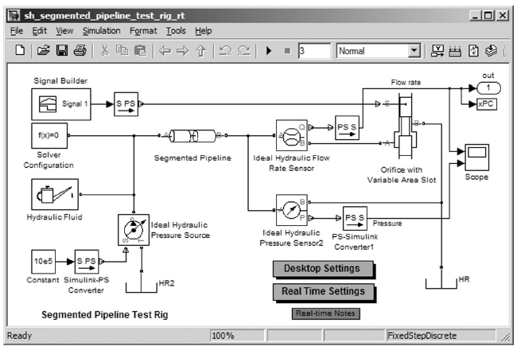
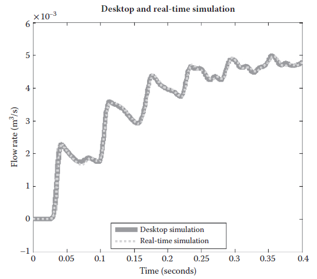

[23 <--- ](23.md) [   Зміст   ](README.md) [--> 23.2](23_2.md)

## 23.1 INTRODUCTION

Real-time simulation of multidomain physical system models (mechanical, electrical, hydraulic, etc.) requires finding a combination of model complexity, solver choice, solver settings, and real-time target that permit execution in real time. A better understanding of the trade-offs involved in each of these areas makes it easier to achieve this goal and use Model-Based Design to reap the benefits of using virtual systems before building hardware prototypes. This chapter outlines the steps in moving from desktop to real-time simulation and illustrates this process using models built from MathWorks® products based on Simscape™ simulation technology. The steps described apply to real-time simulation regardless of which real-time hardware is used.

### 23.1.1 Examples of Real-Time Simulation

Replacing physical devices, such as vehicles, robots, or planes, with virtual devices can drastically reduce the cost of testing control systems, software, and hardware. It can also improve the quality of the final product by enabling more complete testing of the entire system. Often it is necessary to run the computer simulation representing the virtual system in real time. This means that the inputs and outputs (I/O) in the virtual world of simulation must be read or updated synchronously with the physical world. When the simulation time reaches 5, 50, or 500 seconds, the exact same amount of time has passed in the physical world.

 

**FIGURE 23.1** SimHydraulics demonstration model of water hammer in a pipeline.

Configuring a model and the numerical integrator to simulate in this manner can be difficult. The simulation execution time per step must be consistent and sufficiently shorter than the time step of the simulation to permit any other tasks that the simulation environment must perform, such as reading sensor inputs or outputting transducer signals. This is a challenging prospect because the conditions vary during simulation. Switches open, valves close, and these occasional events can require more computations to achieve an accurate result. To be successful, the solver settings, simulation step size, and the level of model fidelity must be adjusted to find a combination that permits real-time simulation while delivering accurate results.

Advances in solver technology have made it easier to configure simulations to simulate in this fashion. Features added to simulation tools, such as fixed-cost algorithms (algorithms where the computational cost per time step is nearly constant) and local solvers added to Simscape from MathWorks, make it possible to simulate even complex models such as hydraulic pipelines in real time. As an example, we simulated the SimHydraulics® demonstration model sh_segmented_pipeline_test_ rig (Figure 23.1) on a desktop computer using solver ode15s, a maximum step size of 0.03 seconds, and a relative tolerance of 1e-3. After applying the process covered in this chapter to the model, accurate results were achieved when running the model in real time using xPC Target™ [1] from MathWorks on an Intel Core 2 Duo E6700 (2.66 GHz) with a simulation step size of 1 millisecond ([Figure 23.2](#_bookmark141)).

This is a particularly challenging model numerically for it includes the water hammer effect, which takes place when a valve is abruptly opened or closed creating rapid changes in flow rate. Even with the restrictions imposed by executing on a realtime target, the simulation results capture the oscillations in the hydraulic circuit. To develop this process, the steps described in this chapter for moving from desktop to real-time simulation have been applied to this and more than 30 other models in different physical domains built with MathWorks physical modeling products, all of which were able to run in real time.

**FIGURE 23.2** Desktop and real-time simulation results. The results are nearly identical.

### 23.1.2 Benefits of Real-Time Simulation

Real-time simulation is used in a number of steps in the development process and in some cases in the final product. In Model-Based Design, the plant model is used to develop and test the control and signal processing algorithms in desktop simulation. Once the designs are complete and the algorithms exist in production code, it is necessary to test that code as well as the production controller. Instead of connecting it directly to a hardware prototype, the plant model used in the design phase can be used to test the production code and processor if it is capable of running in real time. This is referred to as hardware-in-the-loop testing and offers many benefits, including the following:

1. Ability to test conditions that would damage equipment or personnel

2. Ability to test systems where no prototypes exist

3. Reduced costs in the later phases of development

4. Ability to test 24 hours a day, 7 days a week

In addition to the development process, real-time simulation is also used in the final product. Products that have a human in the simulation loop require real-time simulation. For example, flight simulators that are used to train pilots require real- time simulation of the plane, control system, weather conditions, and other aspects of their environment (see also Chapter 15).

### 23.1.3 Challenges of Real-Time Simulation

For a simulation to execute in real time, the amount of time spent calculating the solution for a given time step must be less than the duration of that time step. This requires that the execution time per simulation time step be bounded. Variable-step solvers, which are often used in desktop simulation, take smaller steps to accurately capture events that occur during the simulation. However, varying the step size is not an option for real-time simulation, and therefore, a fixed-step solver (implicit or explicit) must be used. This can make real-time simulation more challenging than desktop simulation. The model and fixed-step solvers must be configured so that system dynamics can be accurately captured without changing the step size. These requirements are constraints imposed by hard real-time systems, such as those used to test controller software and hardware. Soft real-time systems, such as video game physics, often have less stringent requirements.

A fixed-step solver that provides accurate results at a step size large enough to permit real-time simulation must be chosen. Most fixed-step solvers will produce equally accurate simulation results as a variable-step solver if a small enough step size is chosen. However, different fixed-step solver algorithms (implicit, explicit, lower/higher order, etc.) will require different step sizes to produce accurate results. They also require different amounts of computational effort per time step [2].

Once a solver is chosen, determining an appropriate step size is the next challenge. Increasing the time step to permit more time to calculate the result can lead to inaccurate results. Reducing the time step to improve the accuracy of the simulation results may make it impossible to execute in real time. Trial and error may be required to find the combination of settings that permit real-time simulation while producing accurate simulation results. The eigenvalues [3] of the system can give an indication of the time constants in the system and help determine what the required minimum step size is.

If this combination of settings cannot be found, it may be that the model contains effects that a fixed-step solver cannot handle at a step size that permits real- time simulation. These effects can be events in the simulation (hard stops, stick-slip friction, switches that open and close, etc.) or portions of the system that have a very small time constant (small masses attached to stiff springs, current or pressure oscillations, etc.). Identifying and modifying these elements is then required before searching for the combination of solver settings and step size that will permit real- time simulation.

Section 23.2 will cover the process of configuring a model used in desktop simulation for real-time simulation. The process involves determining if the model is built at an appropriate level of fidelity for real-time simulation, simplifying if necessary, and configuring solver settings to achieve accurate results.

[23 <--- ](23.md) [   Зміст   ](README.md) [--> 23.2](23_2.md)