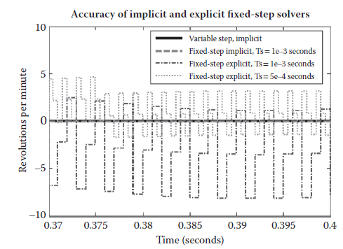

[23.1 <--- ](23_1.md) [   Зміст   ](README.md) [--> 23.3](23_3.md)

## 23.2 MOVING FROM DESKTOP TO REAL-TIME SIMULATION

To move from desktop simulation to real-time simulation on the chosen real-time hardware, the following items must be adjusted until the simulation can execute in real time and deliver results sufficiently close to the results obtained from desktop simulation:

1. Solver choice

2. Number of solver iterations

3. Step size

4. Model size and fidelity

Щоб перейти від симуляції настільного комп’ютера до симуляції в режимі реального часу на вибраному апаратному забезпеченні в режимі реального часу, потрібно налаштувати такі елементи, доки симуляція не зможе виконуватися в режимі реального часу та надаватиме результати, достатньо близькі до результатів, отриманих за допомогою симуляції настільного комп’ютера:

1. Вибір розв'язувача

2. Кількість ітерацій розв'язувача

3. Розмір кроку

4. Розмір моделі та вірність

The procedure depicted in the flowchart in Figure 23.3 shows how to configure a model for real-time simulation.

Процедура, зображена на блок-схемі на рисунку 23.3, показує, як налаштувати модель для симуляції в реальному часі.

This process has been applied to over 30 models containing hydraulic, electrical, mechanical, pneumatic, and thermal components that include a range of linear and nonlinear elements. In each case, real-time execution was achieved with very accurate results. The modeling concepts in these models included the following:

Цей процес був застосований до понад 30 моделей, що містять гідравлічні, електричні, механічні, пневматичні та термічні компоненти, які включають ряд лінійних і нелінійних елементів. У кожному випадку було досягнуто виконання в реальному часі з дуже точними результатами. Концепції моделювання в цих моделях включали наступне:

**FIGURE 23.3** Flowchart depicting the process that helps engineers move from desktop simulation to real-time simulation.

**МАЛЮНОК 23.3** Блок-схема, що зображує процес, який допомагає інженерам перейти від симуляції робочого столу до моделювання в реальному часі.

1. Combined multibody (3D-mechanical) and hydraulic or electrical systems

2. Dynamic, compressible fluid flow (hydraulic and pneumatic)

3. Physical phenomena (friction and clutch events)

4. Hybrid models (continuous-time plants plus discrete logic control systems)

5. Multirate systems (multiple sample rates within the model)

1. Комбіновані багатокорпусні (3D-механічні) та гідравлічні або електричні системи

2. Динамічний стисливий потік рідини (гідравлічний і пневматичний)

3. Фізичні явища (тертя та зчеплення)

4. Гібридні моделі (станції безперервного часу плюс системи дискретного логічного керування)

5. Багатошвидкісні системи (кілька частот дискретизації в моделі)

### 23.2.1 Proce dure for Tuning Solver Sett ings

*Step 1: Obtain a converged set of results with a variable-step solver*.

To ensure that the results obtained with the fixed-step solver are accurate, a set of reference results are needed. These can be obtained by simulating the system with a variable-step solver and ensuring that the results are converged by tightening the error tolerances until the simulation results do not change. For Simscape models, the recommended variable-step solvers are ode15s and ode23t. 

*Крок 1. Отримайте конвергентний набір результатів за допомогою розв’язувача зі змінними кроками*.

Щоб гарантувати точність результатів, отриманих за допомогою вирішувача з фіксованим кроком, потрібен набір еталонних результатів. Їх можна отримати шляхом моделювання системи за допомогою розв’язувача зі змінними кроками та забезпечення збіжності результатів шляхом збільшення допусків похибок, доки результати моделювання не зміняться. Для моделей Simscape рекомендованими розв’язувачами зі змінним кроком є ode15s і ode23t.

*Step 2: Examine the step sizes during the simulation to determine if the model is likely to run with a large enough step size to permit real-time simulation*.

A variable-step solver will vary the step size to stay within the error tolerances and to react to zero-crossing events [4]. If the solver abruptly reduces the step size to a small value (e.g., 1e-15s), this indicates that the solver is attempting to accurately identify a zero-crossing event. A fixed-step solver may have trouble capturing these events at a step size that is sufficiently large to permit real-time simulation.

The following MATLAB® commands can be used to generate a plot that shows how the time step varies during the simulation: 

*Крок 2. Вивчіть розмір кроку під час моделювання, щоб визначити, чи ймовірно, що модель працюватиме з достатньо великим розміром кроку, щоб дозволити моделювання в реальному часі*.

Розв’язувач зі змінним кроком змінюватиме розмір кроку, щоб залишатися в межах допусків похибок і реагувати на події перетину нуля [4]. Якщо розв’язувач раптово зменшує розмір кроку до невеликого значення (наприклад, 1e-15s), це вказує на те, що розв’язувач намагається точно визначити подію перетину нуля. Вирішувач із фіксованими кроками може мати проблеми з фіксацією цих подій із розміром кроку, який є достатньо великим, щоб дозволити моделювання в реальному часі.

Наступні команди MATLAB® можна використовувати для створення графіка, який показує, як змінюється часовий крок під час моделювання:

 

The plots in [Figures 23.4 ](#_bookmark142)and 23.5 illustrate the concepts explained above. They are produced by executing the preceding MATLAB code on the simulation results from the SimHydraulics model shown in [Figures 23.6 ](#_bookmark143)and 23.7, which contains a number of components that create zero-crossing events.

Діаграми на [Рис. 23.4 ](#_bookmark142) і 23.5 ілюструють концепції, пояснені вище. Вони створюються шляхом виконання попереднього коду MATLAB на результатах моделювання з моделі SimHydraulics, показаної на [рис. 23.6 ](#_bookmark143) і 23.7, яка містить низку компонентів, які створюють події перетину нуля.

This analysis should provide a rough idea of a step size that can be used to run the simulation. Determining what effects are causing these events and modifying or eliminating them will make it easier to run the system with a fixed-step solver at a larger step size and produce results comparable to the variable-step simulation.

Цей аналіз повинен дати приблизне уявлення про розмір кроку, який можна використовувати для запуску моделювання. Визначення ефектів, що спричиняють ці події, і їх модифікація або усунення полегшить роботу системи з розв’язувачем із фіксованим кроком із більшим розміром кроку та отримання результатів, порівнянних із моделюванням із змінним кроком.

*Step 3: Simulate the system with a fixed-step, fixed-cost solver and compare the results to the reference set of results obtained from the variable-step simulation*.

*Крок 3: Змоделюйте систему за допомогою розв’язувача з фіксованими кроками та фіксованою вартістю та порівняйте результати з еталонним набором результатів, отриманих із моделювання зі змінними кроками*.

As explained in Section 23.1.3, a fixed-step solver (implicit or explicit) must be used to run the simulation in real time. The chosen solver must provide robust performance and deliver accurate results at a step size large enough to permit real-time simulation. The solver should be chosen to minimize the amount of computation required per time step while providing robust performance at the largest step size possible. To decide which type of fixed-step solver to use, it is necessary to determine if the model describes a stiff or a nonstiff problem. The problem is stiff if the solution the solver is seeking varies slowly, but there are other solutions within the error tolerances that vary rapidly [2].

Як пояснюється в Розділі 23.1.3, для запуску симуляції в реальному часі необхідно використовувати розв’язувач із фіксованими кроками (явний або неявний). Вибраний розв’язувач має забезпечувати надійну продуктивність і видавати точні результати з розміром кроку, достатньо великим для моделювання в реальному часі. Розв’язувач має бути обраний таким чином, щоб мінімізувати кількість обчислень, необхідних для кожного кроку в часі, забезпечуючи надійну продуктивність із максимально можливим розміром кроку. Щоб вирішити, який тип розв’язувача з фіксованими кроками використовувати, необхідно визначити, чи модель описує жорстку чи нежорстку проблему. Проблема є жорсткою, якщо розв’язок, який шукає розв’язувач, змінюється повільно, але існують інші рішення в межах допусків похибок, які швидко змінюються [2].

**FIGURE 23.4** Plot of step size during variable-step simulation. Abrupt drops in step size indicate zero-crossing events. The amount of zero-crossing events and how easily the simulation recovers give a rough indication of how difficult it will be for a fixed-step solver to produce accurate results at the largest step size the variable-step solver uses.

**МАЛЮНОК 23.4** Діаграма розміру кроку під час моделювання зі змінними кроками. Різкі падіння розміру кроку вказують на події, що перетинають нуль. Кількість подій переходу через нуль і те, наскільки легко відновлюється симуляція, дають приблизне уявлення про те, наскільки важко розв’язувачу з фіксованим кроком буде отримати точні результати з найбільшим розміром кроку, який використовує розв’язувач із змінним кроком.

**FIGURE 23.5** Plot of a smaller range of the step size during simulation. (1) indicates the step size that will meet the error tolerances for most of the simulation. (2) are examples of zero-crossing events where the solver recovered instantly and may not be difficult for the fixed-step solver. (3) are examples of zero-crossing events where the variable-step solver took longer to recover and will likely require a smaller step size for the fixed-step solver to deliver results with acceptable accuracy.

**МАЛЮНОК 23.5** Графік меншого діапазону розміру кроку під час моделювання. (1) вказує на розмір кроку, який буде відповідати допустимим відхиленням для більшої частини моделювання. (2) є прикладами подій перетину нуля, коли розв’язувач миттєво відновився, і це може бути неважким для розв’язувача з фіксованим кроком. (3) є прикладами подій переходу через нуль, де розв’язувач зі змінними кроками потребував більше часу для відновлення та, ймовірно, потребуватиме меншого розміру кроку для розв’язувача з фіксованими кроками, щоб отримати результати з прийнятною точністю.

**FIGURE 23.6** Hydraulic model of a pipeline system modeled in SimHydraulics containing valves, junctions, and a centrifugal pump.

**МАЛ. 23.6** Гідравлічна модель системи трубопроводу, змодельованої в SimHydraulics, що містить клапани, з’єднання та відцентровий насос.

     

**FIGURE 23.7** Portion of SimHydraulics model containing directional valves, flow control valves, and orifices.

Comparing the simulation results generated by a fixed-step implicit solver and a fixed-step explicit solver for the same model of a pneumatic system ([Figure 23.8](#_bookmark144)) shows a difference in accuracy that is dependent on step size ([Figure 23.9](#_bookmark144)) and model stiffness ([Figure 23.10](#_bookmark145)).

**МАЛЮНОК 23.7** Частина моделі SimHydraulics, що містить напрямні клапани, клапани регулювання потоку та отвори.

Порівняння результатів моделювання, отриманих за допомогою неявного розв’язувача з фіксованим кроком і явного розв’язувача з фіксованим кроком для однієї моделі пневматичної системи ([Малюнок 23.8](#_bookmark144)), показує різницю в точності, яка залежить від розміру кроку ([ Малюнок 23.9](#_bookmark144)) і жорсткість моделі ([Малюнок 23.10](#_bookmark145)).

    

**FIGURE 23.8** Pneumatic system containing a pump, valve, and motor, simulated using implicit and explicit fixed-step solvers.

**FIGURE 23.9** Plot showing simulation results for the same model simulated with a variable-step solver, fixed-step implicit solver, and fixed-step explicit solver. The explicit solver requires a smaller time step to achieve accuracy comparable to the implicit solver.

**МАЛЮНОК 23.9** Діаграма, на якій показано результати моделювання для тієї самої моделі, змодельованої за допомогою розв’язувача зі змінним кроком, неявного розв’язувача з фіксованим кроком і явного розв’язувача з фіксованим кроком. Явний розв’язувач потребує меншого кроку за часом для досягнення точності, порівнянної з неявним розв’язувачем.

**FIGURE 23.10** Plot showing simulation results for the same model simulated with a variable-step solver, fixed-step implicit solver, and fixed-step explicit solver. The oscillations in the fixed-step explicit solver simulation results suggest this is a stiff problem.

**МАЛЮНОК 23.10** Діаграма, на якій показано результати моделювання для тієї самої моделі, змодельованої за допомогою розв’язувача зі змінним кроком, неявного розв’язувача з фіксованим кроком і явного розв’язувача з фіксованим кроком. Коливання в результатах моделювання явного розв’язувача з фіксованим кроком свідчать про те, що це складна проблема.

Explicit and implicit solvers use different numerical methods to solve the system of equations. An explicit algorithm samples the local gradient to find a solution, whereas an implicit algorithm uses matrix operations to solve a system of simultaneous equations that helps predict the evolution of the solution [2]. As a result, an implicit algorithm does more work per simulation step but can take larger steps. For stiff systems, implicit solvers should be used.

Явні та неявні розв’язувачі використовують різні чисельні методи для розв’язування системи рівнянь. Явний алгоритм відбирає локальний градієнт для пошуку рішення, тоді як неявний алгоритм використовує матричні операції для вирішення системи одночасних рівнянь, що допомагає передбачити еволюцію рішення [2]. У результаті неявний алгоритм виконує більше роботи за крок симуляції, але може виконувати більші кроки. Для жорстких систем слід використовувати неявні розв’язувачі.

Both accuracy and computational effort must be taken into account when choosing a fixed-step solver. Simulating physical systems often involves multiple iterations per time step to converge on a solution. For a real-time simulation, the amount of computational effort per time step must be bounded. To have a bounded amount of execution time per simulation time step, it is necessary to limit the number of iterations per time step. This is known as a fixed-cost simulation. Fixed-cost simulation is used to prevent overruns, which occur when the execution time is longer than the sample time. [Figure 23.11 ](#_bookmark146)shows how an overrun can occur if the number of iterations is not limited.

При виборі розв’язувача з фіксованим кроком необхідно враховувати як точність, так і обчислювальну роботу. Симуляція фізичних систем часто передбачає кілька ітерацій за крок у часі для досягнення рішення. Для симуляції в реальному часі кількість обчислювальних зусиль на крок у часі має бути обмежена. Щоб мати обмежений час виконання на часовий крок моделювання, необхідно обмежити кількість ітерацій на часовий крок. Це відоме як моделювання з фіксованою вартістю. Моделювання з фіксованою вартістю використовується для запобігання перевитратам, які виникають, коли час виконання перевищує час вибірки. [Малюнок 23.11 ](#_bookmark146) показує, як може статися перевиконання, якщо кількість ітерацій не обмежена.

Iterations are necessary with implicit solvers. The iterations are handled automatically with variable-step solvers, but for the implicit fixed-step solver ode14x in Simulink®, the number of iterations per time step must be set. This is controlled by the parameter “Number Newton’s iterations” in the Solver pane of the Configuration Parameters dialog box in Simulink.

Ітерації необхідні з неявними вирішувачами. Ітерації обробляються автоматично за допомогою розв’язувачів зі змінним кроком, але для неявного розв’язувача з фіксованими кроками ode14x у Simulink® необхідно встановити кількість ітерацій на часовий крок. Це контролюється параметром «Кількість ітерацій Ньютона» на панелі Solver діалогового вікна Configuration Parameters у Simulink.

Iterations are also often necessary for each Simscape physical network for both explicit and implicit solvers. The iterations in Simscape are limited by setting the checkbox, “Use fixed-cost runtime consistency iterations” and entering the number of nonlinear iterations in the Solver Configuration block (see [Figure 23.12](#_bookmark146)). If the local solver option is used, it is recommended to initially set the number of nonlinear iterations to two or three.

Ітерації також часто необхідні для кожної фізичної мережі Simscape як для явних, так і для неявних розв’язувачів. Ітерації в Simscape обмежуються встановленням прапорця «Використовувати ітерації узгодженості виконання з фіксованою вартістю» та введенням кількості нелінійних ітерацій у блоці конфігурації розв’язувача (див. [Рис. 23.12](#_bookmark146)). Якщо використовується варіант локального вирішувача, рекомендується спочатку встановити кількість нелінійних ітерацій на дві або три.

**FIGURE 23.11** A fixed-step solver keeps the time step constant. Limiting any needed iterations per time step is necessary for fixed-cost simulation.

**МАЛЮНОК 23.11** Розв’язувач із фіксованим кроком підтримує постійний крок часу. Обмеження будь-яких необхідних ітерацій на часовий крок є необхідним для моделювання з фіксованою вартістю.

**FIGURE 23.12** In Simscape, the Solver Configuration block permits limitation of the iterations per time step.

The amount of computational effort required by a solver varies with respect to a number of factors, including model complexity. To provide an indication of the relative cost for the fixed-step solvers available, a nonlinear model of a pneumatic actuation system (shown in [Figure 23.8](#_bookmark144)) containing a single Simscape physical network was simulated with each of the fixed-step solvers. These simulations were conducted at the same step size with similar settings for the total number of solver iterations. [Figure 23.13 ](#_bookmark147)shows the normalized execution time.

Обсяг обчислювальних зусиль, необхідних розв’язувачу, залежить від ряду факторів, включаючи складність моделі. Для визначення відносної вартості доступних розв’язувачів із фіксованими кроками була змодельована нелінійна модель пневматичної системи приводу (показана на [Рис. 23.8](#_bookmark144)), що містить одну фізичну мережу Simscape, з кожним із фіксованих покрокові розв'язувачі. Ці симуляції проводилися з однаковим розміром кроку з однаковими налаштуваннями для загальної кількості ітерацій розв’язувача. [Малюнок 23.13 ](#_bookmark147) показує нормалізований час виконання.

From this plot, it is clear that for this example, most explicit fixed-step solvers require less computational effort than the implicit fixed-step solver ode14x. Although an explicit solver may require less computational effort, for stiff problems, an implicit solver is necessary for accurate results. For this example, the two local Simscape solvers (Backward Euler and Trapezoidal Rule) required the least computational effort. In most cases, they provide the best combination of speed and accuracy.

З цього графіка видно, що для цього прикладу більшість явних розв’язувачів із фіксованим кроком вимагають менше обчислювальних зусиль, ніж неявний розв’язувач з фіксованим кроком ode14x. Хоча явний розв’язувач може вимагати менше обчислювальних зусиль, для жорстких задач необхідний неявний розв’язувач для отримання точних результатів. Для цього прикладу два локальні розв’язувачі Simscape (зворотний Ейлер і трапецієподібне правило) вимагали найменших обчислювальних зусиль. У більшості випадків вони забезпечують найкраще поєднання швидкості та точності.

**FIGURE 23.13** Plot of the normalized cost of all fixed-step solvers that can be used on Simscape models. The results were obtained by simulating a nonlinear model containing a single Simscape physical network with each solver at the same step size and similar settings for the total number of solver iterations.

**МАЛЮНОК 23.13** Графік нормалізованої вартості всіх розв’язувачів із фіксованим кроком, які можна використовувати в моделях Simscape. Результати були отримані шляхом моделювання нелінійної моделі, що містить одну фізичну мережу Simscape з кожним розв’язувачем з однаковим розміром кроку та подібними налаштуваннями для загальної кількості ітерацій розв’язувача. 

A powerful option available in Simscape is to use a local solver on physical networks [5] . By using this option, it is possible to use an implicit fixed-step solver only on the stiff portions of the model and an explicit fixed-step solver on the remainder of the model ([Figure 23.14](#_bookmark148)). This minimizes the computations performed per time step, making it more likely the model will run in real time.

Потужним варіантом, доступним у Simscape, є використання локального вирішувача у фізичних мережах [5] . Використовуючи цей параметр, можна використовувати неявний розв’язувач із фіксованими кроками лише для жорстких частин моделі та явний розв’язувач з фіксованими кроками для решти моделі ([Малюнок 23.14](#_bookmark148)). Це мінімізує обчислення, які виконуються за часовий крок, що підвищує ймовірність виконання моделі в режимі реального часу.

For Simscape models, the Backward Euler and the Trapezoidal Rule should always be tested and will most likely provide the best performance and the most flexibility because they can be configured per physical network. [Figure 23.15 ](#_bookmark148)shows how to enable the local solver and the settings associated with it. The Backward Euler solver is designed to be robust and tends to damp out oscillations. The Trapezoidal Rule solver is designed to be more accurate and preserve oscillations. The Backward Euler algorithm tends to be less accurate than the Trapezoidal Rule but more numerically stable.

Для моделей Simscape завжди слід перевіряти зворотний Ейлер і трапецієподібне правило, які, швидше за все, забезпечать найкращу продуктивність і найбільшу гнучкість, оскільки їх можна налаштувати для кожної фізичної мережі. [Малюнок 23.15 ](#_bookmark148) показує, як увімкнути локальний розв’язувач і пов’язані з ним налаштування. Вирішувач зворотного Ейлера розроблено як надійний і має тенденцію гасити коливання. Розв’язувач правил трапеції створений для більш точного та збереження коливань. Алгоритм зворотного Ейлера, як правило, менш точний, ніж правило трапеції, але більш чисельно стабільний.

To summarize recommendations for setting up fixed-cost simulations:

1. If the system is nonstiff and is described by ordinary differential equations (ODEs), an explicit solver is usually the best choice.

2. If the system is stiff, an implicit solver (ode14x, Backward Euler, or Trapezoidal Rule) should be used and the number of iterations must be limited.

3. For Simscape models:

Щоб узагальнити рекомендації щодо налаштування моделювання з фіксованою вартістю:

1. Якщо система нежорстка і описується звичайними диференціальними рівняннями (ОДВ), явний розв’язувач зазвичай є найкращим вибором.

2. Якщо система є жорсткою, слід використовувати неявний розв’язувач (ode14x, зворотне правило Ейлера або трапецієподібне правило), а кількість ітерацій має бути обмежена.

3. Для моделей Simscape:

a.   Performing a fixed-cost simulation requires setting the number of iterations to prevent overruns. This is done by selecting the “Use fixed-cost runtime consistency iterations” setting in the Solver Configuration block attached to the Simscape physical network.

a. Виконання моделювання з фіксованою вартістю вимагає встановлення кількості ітерацій, щоб запобігти перевитратам. Це робиться шляхом вибору параметра «Використовувати ітерації узгодженості виконання з фіксованою вартістю» в блоці конфігурації Solver, підключеному до фізичної мережі Simscape.

**FIGURE 23.14** Using local solvers permits configuring implicit solvers on the stiff portions of the model and explicit solvers on the remainder of the model, minimizing execution time while maintaining accuracy.

**МАЛЮНОК 23.14** Використання локальних розв’язувачів дозволяє налаштовувати неявні розв’язувачі для жорстких частин моделі та явні розв’язувачі для решти моделі, мінімізуючи час виконання, зберігаючи точність.

**FIGURE 23.15** In Simscape, the Solver Configuration block permits configuration of local solvers on Simscape physical networks.

b.   The local solvers in Simscape should always be tested. Using a local solver is often the best choice for fixed-cost simulations.

c.   When performing fixed-cost simulation using the local solvers in Simscape, it is recommended to initially set the number of nonlinear iterations to two or three.

d.   If you are using ode14x on a model with a Simscape physical network, to perform a fixed-cost simulation, it is necessary to enable fixed cost and set the number of nonlinear iterations in the Solver Configuration block.

b. Локальні розв’язувачі в Simscape слід завжди перевіряти. Використання локального вирішувача часто є найкращим вибором для моделювання з фіксованою вартістю.

в. При виконанні моделювання з фіксованою вартістю з використанням локальних вирішувачів у Simscape рекомендується спочатку встановити кількість нелінійних ітерацій на дві або три.

d. Якщо ви використовуєте ode14x на моделі з фізичною мережею Simscape, щоб виконати моделювання з фіксованою вартістю, необхідно ввімкнути фіксовану вартість і встановити кількість нелінійних ітерацій у блоці конфігурації Solver.

*Step 4: Find the combination of step size and number of nonlinear iterations where the step size is small enough to produce results that are sufficiently close to the set of reference results obtained from variable-step simulation and large enough so that there is enough safety margin to prevent an overrun*.

*Крок 4: знайдіть комбінацію розміру кроку та кількості нелінійних ітерацій, де розмір кроку є достатньо малим, щоб отримати результати, які є достатньо близькими до набору еталонних результатів, отриманих із моделювання зі змінними кроками, і достатньо великими, щоб було достатньо безпеки запас для запобігання перевитрати*.

During each time step, the real-time system must calculate the simulation results for the next time step (simulation execution) and read the inputs and write the outputs (processing I/O and other tasks). If this takes less than the specified time step, the processor remains idle during the remainder of the step. These quantities are illustrated in Figure 23.16.

Під час кожного кроку часу система реального часу повинна обчислювати результати моделювання для наступного кроку часу (виконання моделювання) і зчитувати вхідні дані та записувати вихідні дані (обробка вводу/виводу та інші завдання). Якщо це займає менше, ніж указаний крок часу, процесор залишається бездіяльним протягом решти кроку. Ці величини зображено на малюнку 23.16.

The challenge is to find appropriate settings that provide accurate results while permitting real-time simulation. In each case, it is a trade-off of accuracy versus speed. Choosing a computationally intensive solver, increasing the number of nonlinear iterations, or reducing the step size both increases the accuracy and reduces the amount of idle time, raising the risk that the simulation will not run in real time. Adjusting these settings in the opposite direction will increase the amount of idle time but reduce accuracy.

Завдання полягає в тому, щоб знайти відповідні параметри, які забезпечують точні результати, дозволяючи симуляцію в реальному часі. У кожному випадку це компроміс між точністю та швидкістю. Вибір розв’язувача, що потребує інтенсивних обчислень, збільшення кількості нелінійних ітерацій або зменшення розміру кроку підвищує точність і зменшує час простою, підвищуючи ризик того, що моделювання не працюватиме в реальному часі. Налаштування цих параметрів у протилежному напрямку збільшить час простою, але знизить точність.

It is necessary to leave sufficient safety margin to avoid an overrun when simulating in real time. If the amount of time spent processing inputs, outputs, and other tasks as well as the desired percentage of idle time are known, the amount of time available for simulation execution can be calculated as follows:

Необхідно залишити достатній запас безпеки, щоб уникнути перевиконання під час моделювання в реальному часі. Якщо відома кількість часу, витраченого на обробку входів, виходів та інших завдань, а також бажаний відсоток часу простою, кількість часу, доступного для виконання моделювання, можна розрахувати наступним чином:

Estimating the budget for the execution time helps ensure a feasible combination of settings is chosen.

**FIGURE 23.16** Trade-off involving solver choice, number of nonlinear iterations, and step size. For a given model, these must be chosen to deliver maximum accuracy and robustness with enough idle time to provide a sufficient safety margin.

**МАЛЮНОК 23.16** Компроміс, що включає вибір розв’язувача, кількість нелінійних ітерацій і розмір кроку. Для даної моделі їх потрібно вибирати так, щоб забезпечити максимальну точність і надійність із достатнім часом простою, щоб забезпечити достатній запас безпеки.

The speed of simulation on the desktop can be used to estimate the execution time on the real-time target. There are many factors that affect the execution time on the real-time target, and therefore, simply comparing processor speed may not be sufficient. A better method is to measure the execution time during desktop simulation and then to determine the average execution time per time step on the real-time target for a given model. Knowing how these values relate for one model makes it possible to estimate execution time on the real-time target from the execution time during desktop simulation when testing other models.

Швидкість симуляції на робочому столі може бути використана для оцінки часу виконання на цілі реального часу. Існує багато факторів, які впливають на час виконання цільового завдання реального часу, тому простого порівняння швидкості процесора може бути недостатньо. Кращим методом є вимірювання часу виконання під час симуляції настільного комп’ютера, а потім визначення середнього часу виконання на часовий крок на цільовому рівні реального часу для даної моделі. Знання того, як ці значення співвідносяться з однією моделлю, дає змогу оцінити час виконання на цілі в реальному часі на основі часу виконання під час симуляції робочого столу під час тестування інших моделей.

*Step 5: Using the selected solver, number of nonlinear iterations, and step size, simulate on the real-time platform and determine if the simulation can run in real time*. The tests run on the real-time platform should cover a representative set of tests to ensure that the worst-case scenario for the idle time is captured. This may include varying parameter values, inputs, and a range of conditions for the external hardware (reading/writing the I/O). The model needs to be robust enough to handle all situations that it may encounter.

*Крок 5: використовуючи вибраний розв’язувач, кількість нелінійних ітерацій і розмір кроку, змоделюйте на платформі реального часу та визначте, чи можна моделювання виконувати в реальному часі*. Тести, що виконуються на платформі реального часу, повинні охоплювати репрезентативний набір тестів, щоб переконатися, що найгірший сценарій для часу простою зафіксований. Це може включати різні значення параметрів, вхідні дані та низку умов для зовнішнього обладнання (читання/запис введення/виведення). Модель має бути достатньо надійною, щоб впоратися з усіма ситуаціями, з якими вона може зіткнутися.

*Step 6: If the simulation does not run in real time on the selected real-time platform, it will be necessary to determine the cause and choose an appropriate solution*.

If the simulation does not run in real time on the real-time platform, it may be due to the fact that the model is not real-time capable. The combination of effects captured in the model and the speed of the real-time platform may make it impossible to find solver settings that will permit it to run in real time (Figure 23.17).

*Крок 6: Якщо симуляція не виконується в режимі реального часу на вибраній платформі реального часу, необхідно буде визначити причину та вибрати відповідне рішення*.

Якщо симуляція не виконується в реальному часі на платформі реального часу, це може бути пов’язано з тим, що модель не підтримує роботу в реальному часі. Поєднання ефектів, зафіксованих у моделі, і швидкість платформи реального часу може унеможливити пошук налаштувань розв’язувача, які дозволять йому працювати в реальному часі (Малюнок 23.17).

If the simulation is not real-time capable, there are some options that can be explored: 

1. Use a faster real-time computer.

2. Determine new settings that reduce the execution time (e.g., reducing the number of nonlinear iterations) or permit a larger step size.

Якщо симуляція не працює в режимі реального часу, є кілька варіантів, які можна вивчити:

1. Використовуйте швидший комп’ютер реального часу.

2. Визначте нові налаштування, які зменшують час виконання (наприклад, зменшення кількості нелінійних ітерацій) або дозволяють більший розмір кроку.

 

**FIGURE 23.17** Diagram showing when a simulation is not real-time capable. The minimum possible step size permitting real-time execution is larger than the maximum possible step size that permits acceptable accuracy and robustness.

**МАЛЮНОК 23.17** Діаграма, яка показує, коли симуляція не підтримує роботу в реальному часі. Мінімально можливий розмір кроку, що дозволяє виконання в реальному часі, перевищує максимально можливий розмір кроку, який забезпечує прийнятну точність і надійність.

3. Eliminate effects that require significant computational effort or that require a small time step to accurately capture them.

4. If possible, configure the model and the real-time system to evaluate the physical networks in parallel. This can be done if for a given time step the networks are not dependent on one another. Experience with the generated code and the real-time target is required to use this option. 

3. Усуньте ефекти, які вимагають значних обчислювальних зусиль або які вимагають невеликого кроку за часом для їх точного фіксування.

4. Якщо можливо, налаштуйте модель і систему реального часу для паралельної оцінки фізичних мереж. Це можна зробити, якщо на певному часовому етапі мережі не залежать одна від одної. Щоб використовувати цю опцію, потрібен досвід роботи зі згенерованим кодом і ціллю реального часу.

### 23.2.2 Adjusting Models to Make Them Real-Time Capable

In the event that no settings can be found that permit the simulation to run in real time on the available real-time computer while delivering accurate results, it is necessary to modify or remove effects from the model that prevent real-time simulation. Here are two categories and some examples.

У випадку, якщо не вдається знайти параметри, які дозволяють виконувати симуляцію в режимі реального часу на доступному комп’ютері, що працює в режимі реального часу, надаючи точні результати, необхідно змінити або видалити ефекти з моделі, які перешкоджають моделюванню в режимі реального часу. Ось дві категорії та кілька прикладів.

1. Elements that create events

In this case, an event occurs so that the solution changes nearly instantaneously. The rapid change can be difficult for a fixed-step solver to step over and find the correct solution on the other side of the event. If it fails to find the solution, the solver may go unstable. Examples of elements that create these kinds of events include the following:

1. Елементи, що створюють події

У цьому випадку відбувається така подія, що рішення змінюється майже миттєво. Швидку зміну може бути важко для розв’язувача з фіксованими кроками переступити та знайти правильне рішення з іншого боку події. Якщо не вдасться знайти рішення, розв’язувач може стати нестабільним. Приклади елементів, які створюють такі види подій, включають:

a.   Hard stops, backlash

b.   Stick-slip friction

c.   Switches or clutches

a. Жорсткі упори, люфт

b. Тертя прилипання-ковзання

в. Перемикачі або муфти

2. Elements with a small time constant

In this case, an element or a group of elements has a very small time constant as compared to the desired simulation step size. These elements create fast dynamics that require a small step size so that a fixed-step solver can accurately capture the dynamics. Examples of systems that have a small time constant include the following:

2. Елементи з малою постійною часу

У цьому випадку елемент або група елементів має дуже малу постійну часу порівняно з бажаним розміром кроку моделювання. Ці елементи створюють швидку динаміку, яка вимагає невеликого розміру кроку, щоб розв’язувач із фіксованим кроком міг точно зафіксувати динаміку. Приклади систем, які мають малу постійну часу, включають наступне:

a.   Small masses attached to stiff springs with minimal damping

b.   Electrical circuits with fast dynamics

c.   Hydraulic circuits with small compressible volumes

a. Невеликі маси, прикріплені до жорстких пружин з мінімальним демпфуванням

b. Електричні схеми з швидкою динамікою

в. Гідравлічні схеми з малими стисливими об'ємами

If a scripting environment that has commands permitting interrogation of the model, such as MATLAB, is available, identifying these components and parameters can be done very quickly, which narrows the search for the effects that must be modified. There are methods to automate these searches using tools such as the Simulink Model Advisor that makes it easier to apply these searches to other models. Examining the eigenmodes of the system can indicate which states have the highest frequency, and mapping those states to the individual components may point to the source of the problem. For nonlinear models, this can only be done at an individual operating point and that operating point can be identified by looking for small step sizes during a variable-step simulation.

Якщо доступне середовище сценаріїв, яке має команди, що дозволяють опитувати модель, наприклад MATLAB, ідентифікація цих компонентів і параметрів може бути виконана дуже швидко, що звужує пошук ефектів, які необхідно змінити. Існують методи автоматизації цих пошуків за допомогою таких інструментів, як Simulink Model Advisor, який полегшує застосування цих пошуків до інших моделей. Дослідження власних мод системи може вказати, які стани мають найвищу частоту, а відображення цих станів на окремі компоненти може вказати на джерело проблеми. Для нелінійних моделей це можна зробити лише в окремій робочій точці, і цю робочу точку можна визначити шляхом пошуку малих розмірів кроку під час моделювання зі змінними кроками.

Once the effects have been identified, the next step is to modify or eliminate them. Methods that can be used to modify these effects include the following:

Після виявлення наслідків наступним кроком є їх модифікація або усунення. Методи, які можна використовувати для зміни цих ефектів, включають наступне:

1. Replacing nonlinear component models with linearized versions of those models

2. Using lookup tables to simplify complex equations

3. Producing a simplified model by using system identification theory on the I/O data

4. Smoothing discontinuous functions (step changes) by using filters and other techniques.

1. Заміна нелінійних компонентних моделей лінеаризованими версіями цих моделей

2. Використання таблиць пошуку для спрощення складних рівнянь

3. Створення спрощеної моделі за допомогою теорії ідентифікації системи на даних введення/виведення

4. Згладжування розривних функцій (крокові зміни) за допомогою фільтрів та інших прийомів.

Once the model is modified, the process described in Section 23.2 can be applied to identify the appropriate solver configuration and settings to enable real-time simulation.

Після модифікації моделі процес, описаний у Розділі 23.2, може бути застосований для визначення відповідної конфігурації розв’язувача та параметрів, щоб увімкнути моделювання в реальному часі.

[23.1 <--- ](23_1.md) [   Зміст   ](README.md) [--> 23.3](23_3.md)