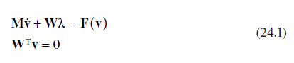
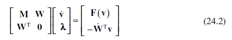

[24 <--- ](24.md) [   Зміст   ](README.md) [--> 24.2](24_2.md)

## 24.1 INTRODUCTION

Simulation models of plant or actuator dynamics are utilized throughout the development cycle of new control systems. They can be used to validate the performance of a single controller in the presence of parameter variation or to investigate the behavior when the control loop is embedded within a larger system model. The models may be for desktop analysis or as part of a real-time test harness to validate the response of hardware components to simulated inputs. Whatever the application, efficient models are required whenever large numbers of simulations are to be carried out or where there are limits on the time available to update the model at each time step. To achieve this efficiency often requires that some simplifying assumptions must be made. This chapter aims to develop a systematic approach to developing models that maintain the inherent nonlinear behavior of a hydraulic circuit but that are based on a simplified representation of fluid dynamics.

### 24.1.1 Hydraulic Simulation Models

Individual hydraulic component models are traditionally built up from basic foundation blocks based on the dynamics of a volume of compressible fluid and the orifice equation. More complex system models can be developed either by connecting component models directly together or by using very small volumes of fluid as interface blocks at the junctions. These interface blocks may represent actual volumes of fluid or be artificial modeling artifacts used to connect self-contained subsystem models together. The benefits of this approach are that the model can be built up in a modular fashion and that the dynamics are described in terms of systems of ordinary differential equations (ODEs), for which there are numerous robust solvers available.

It is for this reason that many commercially available hydraulic simulation packages use this approach. The disadvantage is that small volumes of compressible fluid introduce very high-frequency dynamics into the model. These high-frequency modes require small time steps to be taken and hence results in longer simulation times. The problem can be partly alleviated by the use of “stiff” solvers if real-time code is not required. If real-time code is required, then one solution is to abstract the high-frequency dynamics by assuming that these small volumes of fluid are incompressible. It is shown in Ref. [1] that making this assumption leads to a model description in terms of differential algebraic equations (DAEs), that is, the model consists of a system of unconstrained dynamic equations, along with a number of algebraic constraints that the dynamic states must satisfy. 

### 24.1.2 Simulating Differential Algebraic Equations

Model descriptions in terms of DAEs arise in many applications, for example, in the simulation of electrical circuits, mechanical multibody dynamics, and chemical process models. An overview of current techniques used in the simulation of multibody dynamics is given in Ref. [2], which breaks down the approaches into three categories, namely Coupled-Force Balance, Lagrange, and Kane. The Coupled-Force Balance approach assumes that each body is free to move independently, and contact between bodies is maintained by applying external forces using stiff spring damper systems. This is analogous to connecting hydraulic components by small volumes of compressible fluid. The approach suffers from generating very stiff systems of ODEs, which, as previously discussed, can be difficult to simulate.

In the Lagrange approach, it is assumed that contact is defined by a system of algebraic constraints, which are adjoined to the unconstrained dynamic equations using what are termed “undetermined,” or Lagrange, multipliers. A simplified form of the equations used to describe the dynamics of constrained rigid bodies is given in Equation 24.1, where **v** is the state vector of velocities, **M** is a positive-definite mass matrix, and **F** are the external forces acting on the system. The state constraints are described by the system of linear equality constraints on the velocities (**W**), and the Lagrange multipliers **λ** then represent the internal constraint forces acting at the joints.

The Lagrange approach to simulating this type of DAE is to augment the dynamic equations with the derivatives of the constraints, as shown in Equation 24.2. This results in a system of equations where the number of states equals the number of states in the original unconstrained system, plus the number of constraints. There are a number of problems with simulating this system of equations. Firstly, the initial state values must be consistent, that is, they must be chosen so that they satisfy the constraints. Secondly, because the constraints have been differentiated, any drift from the constraint manifold during simulation must be controlled. Finally, if the constraints are functions of the position states, then they must be differentiated twice before they can be augmented with the unconstrained dynamic equations. These acceleration constraints can be unstable and hence require additional stabilization to produce a stable system of equations.

The third approach to simulating multibody dynamic systems is based on the work of Kane [3], and a description of a practical simulator using this approach is given in Ref. [4]. The Kane method projects the unconstrained dynamic equations onto the constraint manifold, reducing the model to a minimal order system of ODEs, with a state vector equal in size to the number of unconstrained dynamic equations minus the number of constraints. The ability to generate a minimal order set of dynamic equations that can be simulated using standard ODE solvers makes the projection approach very appealing when simulating hydraulic models. There is one drawback, namely that a new set of minimal order ODEs must be derived whenever the number of constraints change. For example, the number of constraints will change in a hydraulic circuit model whenever a valve opens creating a new flow path or when a cylinder piston reaches its end-stop.

There are a number of approaches to handling systems with intermittent constraints. One method is to split the constraints into those that are always present and those that are likely to change. The projection approach can be used to reduce the number of equations based on the fixed number of constraints, and the remaining constraints can be implemented using the Lagrange approach as and when they become active.

This approach still suffers from the issues associated with the Lagrange approach. An alternative is to treat the system as a form of Hybrid System Model, whereby the model switches between systems of minimal order ODEs whenever the circuit topology changes. A discussion on the application of this approach to multibody system dynamics is given in Ref. [5], and an overview of a number of packages to support the simulation of this type of model is given in Ref. [6]. The decision that has to be made is whether to embed all possible sets of dynamic equations within the model before simulation or to derive new systems of equations online during the simulation. As the intent is to derive models that can run as efficiently as possible, a system by which all models are implemented before simulation is demonstrated in this chapter.

### 24.1.3 Parameter Abstraction of Small Mass es

The mass matrix **M** is always assumed to be of full rank when using the constraint embedding techniques described in Refs. [1,4]. This means that the mass matrix of the reduced order equations will also have full rank and hence be invertible during the simulation. To fully specify the dynamics of a hydraulic circuit may require that some very small masses are introduced to act as connecting elements between larger objects, and these small masses can introduce high-frequency dynamics, leading to slow simulations, and potential instabilities. This chapter extends the work by Pfeiffer and Borchsenius [1] by introducing an approach that can simulate the resulting minimum order dynamic equations when the mass matrix is singular due to making these small masses to zero. 

### 24.1.4 Structure of Chapter

The remainder of the chapter is organized as follows. In Section 24.2, the DAEs are derived that describe the dynamics of a hydraulic system when the fluid in the pipes, cylinders, or orifices is assumed to be incompressible. The approach by which these DAEs are reduced to a minimal order system of ODEs is then outlined in Section 24.3. In Section 24.4, the method of simulating the minimal order ODEs when the mass matrix is singular is described. The approach is demonstrated in Section 24.5 using, as an example, a circuit consisting of a servo valve controlling the fluid pressure in a closed pipe. Finally, conclusions are presented in Section 24.6.

[24 <--- ](24.md) [   Зміст   ](README.md) [--> 24.2](24_2.md)