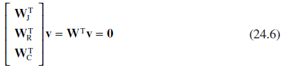

[24.1 <--- ](24_1.md) [   Зміст   ](README.md) [--> 24.3](24_3.md)

## 24.2 NETWORK EQUATIONS FOR INCOMPRESSIBLE FLUID MODELS

The basis for a simulation model of connected hydraulic components containing incompressible fluid is a system of unconstrained momentum equations and a system of linear algebraic constraints. The unconstrained momentum equations are given in Equation 24.3, where **v** is the vector of fluid velocities augmented with states describing the motion of mechanical components such as cylinder pistons and valve spools. **M** is a diagonal matrix of fluid and component masses, and **F(v)** is the known forcing function given in Equation 24.4. For the type of hydraulic system under consideration, the forcing function consists of terms representing the external pressure sources at the interfaces to the system (**P**I), velocity-dependent friction terms (**W**V **v**), and the pressure drop across open orifices (∆**P**O). The pressure drop across an orifice is assumed to obey the orifice equation in Equation 24.5. In this case, flow through an orifice is assumed to be turbulent, and the fluid density (ρ) is independent of pressure and temperature. This does not discount extending the equations to include changes in flow regime as described in Ref. [7], by making ρ and *C*d functions of the current state values.

Основою імітаційної моделі з’єднаних гідравлічних компонентів, що містять нестисливу рідину, є система рівнянь необмеженого імпульсу та система лінійних алгебраїчних обмежень. Рівняння необмеженого імпульсу наведено в рівнянні 24.3, де **v** — вектор швидкостей рідини, доповнений станами, що описують рух механічних компонентів, таких як поршні циліндрів і золотники клапанів. **M** — це діагональна матриця рідини та мас компонентів, а **F(v)** — відома функція примусу, наведена в рівнянні 24.4. Для типу гідравлічної системи, що розглядається, функція примусу складається з членів, що представляють зовнішні джерела тиску на інтерфейсі системи (**P**I), тертя, що залежить від швидкості (**W**V **v **) і падіння тиску на відкритих отворах (∆**P**O). Припускається, що перепад тиску через отвір відповідає рівнянню отвору в рівнянні 24.5. У цьому випадку потік через отвір вважається турбулентним, а густина рідини (ρ) не залежить від тиску та температури. Це не скасовує розширення рівнянь для включення змін у режимі потоку, як описано в Ref. [7], зробивши ρ і *C*d функціями значень поточного стану.

In addition to the known forcing functions, there are unknown internal constraint forces as illustrated in Figure 24.1. The constraint forces consist of pressure forces acting at fluid junctions (**PJ**), reaction forces between components in contact with their end-stops (**FR**), and the pressure drop across closed orifices (∆**P**C).

На додаток до відомих функцій примусу, існують невідомі внутрішні сили обмеження, як показано на малюнку 24.1. Обмежувальні сили складаються із сил тиску, що діють на з’єднаннях рідини (**PJ**), сил реакції між компонентами, що контактують з їх кінцевими упорами (**FR**), і перепаду тиску на закритих отворах (∆**P **C).

  The unknown constraint forces are related to a system of algebraic constraints. The velocity constraints include the requirement that the sum of the flows into a junction must be zero (**WJ**), that flow through closed orifices (**WC**) must be zero, and that the motion of components that have reached their end-stops (**WR**) must be zero. The combined system of constraints can then be represented by **W** in Equation 24.6.

Невідомі сили зв’язку пов’язані з системою алгебраїчних обмежень. Обмеження швидкості включають вимогу дорівнювати нулю сумі потоків у з’єднанні (**WJ**), що потік через закриті отвори (**WC**) має дорівнювати нулю та рух компонентів, які мають досягли своїх кінцевих зупинок (**WR**) має дорівнювати нулю. Комбінована система обмежень може бути представлена **W** у рівнянні 24.6.

**FIGURE 24.1** Internal constraint forces acting in hydraulic system models.

[24.1 <--- ](24_1.md) [   Зміст   ](README.md) [--> 24.3](24_3.md)