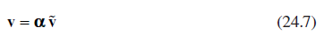
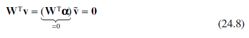
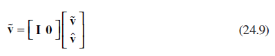
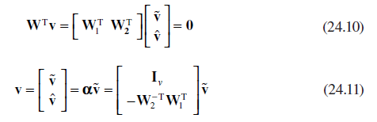
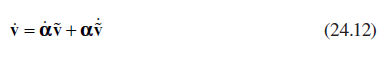
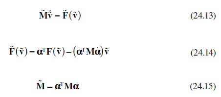
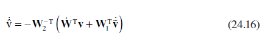
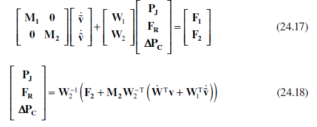

[24.2 <--- ](24_2.md) [   Зміст   ](README.md) [--> 24.4](24_4.md)

## 24.3 SIMULATION WITH LINEAR VELOCITY CONSTRAINTS

The aim in this section is to derive a minimal order system of ODEs, which satisfies the unconstrained dynamics in Equation 24.3, subject to the system of linear constraints on the velocities in Equation 24.6. The basis for the derivation is that a system of *n* dynamic equations subject to *m* constraints can be reduced to a system of equations with *v* = *n* − *m* independent states.

### 24.3.1 Reduced Order State Vector

The relationship between the full state vector (**v**) and the reduced set of independent states (**v** ) is through the transformation matrix **α** in Equation 24.7.

The transformation matrix **α** is not unique but has to be determined so that the full state vector will always satisfy the constraint equations. This can be achieved if the columns of **α** form the basis vectors of the null space of the constraint equations. If **α** satisfies that requirement, then the inner matrix product in Equation 24.8 will be satisfied for all values of the independent states.

One method for deriving **α** is given in Ref. [8]. In this case, the independent states are selected to be a subset of the full state vector as shown in Equation 24.9.

If the constraint matrix is partitioned as in Equation 24.10, then **v**ˆ can be defined in terms of **v** , and α is given by Equation 24.11.

This approach works well provided the selection of the independent states leads to a tractable system of linear equations (i.e., **W2** is invertible). Making a suitable selection is not always straightforward either when there are a large number of states or when there are a large number of models to be analyzed. An alternative approach described in Ref. [9] uses the singular value decomposition (SVD) of the constraint matrix to derive the basis vectors of the null space at each time step during the simulation. This provides a robust and numerically stable approach, but can be computationally expensive and leads to the integration of states that are not directly related to the physical states of the system.

The approach taken is to determine which states can be selected as independent states before creating the simulation model. There are functions available in MathWorks Symbolic Math Toolbox™ [10] to derive the null space of the constraint matrix symbolically, and as the form of the resulting matrix is the same as in Equation 24.7, the independent states can be determined by a simple inspection of the rows of the matrix for a single entry of a unit gain. Within the simulation model, the null space matrix is regenerated using the indices of the selected states to be integrated and the formulation in Equation 24.11. The main benefit of doing this is that only a minimal amount of information must be stored with the model to define the independent state vector for each mode. 

### 24.3.2 Minimum Order Momentum Equations

The minimum order dynamic equations can be derived once the relationship between the full and the reduced order state vectors has been established. The time derivative of the full state vector is related to the reduced state vector by Equation 24.12.

Substituting Equation 24.12 into the unconstrained dynamic equations in Equations 24.3 and projecting the equations onto the constraint manifold by multiplying through by **α**T leads to a minimum order system of ODEs that have the form given by Equation 24.13. The forcing function **F** in Equation 24.13 is given by

Equation 24.14, and the mass matrix **M** is given by Equation 24.15.

 

### 24.3.3 Junction Press ures and Reaction Forces

The reduction procedure described in Section 24.3.2 creates a system of ODEs that can be simulated using standard solvers. In the process, the constraint forces have been lost from the model description. The first stage to regenerate these forces is to derive an expression for the rate of change of the dependent states as a function of the independent states. If the constraint matrix is partitioned in Equation 24.10, then after differentiation, it can be rearranged to give the expression for **v**ˆ in Equation 24.16.

The dynamic equations in Equation 24.3 can also be partitioned as shown in Equation 24.17. The unknown internal forces can be regenerated by substituting Equation 24.16 into Equation 24.17 and rearranging to give Equation 24.18.

 

[24.2 <--- ](24_2.md) [   Зміст   ](README.md) [--> 24.4](24_4.md)