[24.3 <--- ](24_3.md) [   Зміст   ](README.md) [--> 24.5](24_5.md)

## 24.4 SIMULATION WITH A SINGULAR MASS MATRIX

In Section 24.3, the mass matrix of the unconstrained dynamic equations must have full rank if the mass matrix of the reduced order equations (**M** ) is to be inverted during simulation. If some of the very small masses of fluid are made equal to zero to remove the high-frequency dynamics that they introduce, then this assumption will no longer hold. If **M** is singular, then the dynamic equations in Equation 24.13 are said to be quasi-linear DAEs, and an extensive description of the techniques available to solve this type of system is given in Ref. [11]. Sections 24.4.1 to 24.4.5 describe the method of determining the index of the resulting DAEs when the mass matrix is singular and also a method of simulating the equations.

У розділі 24.3 матриця мас необмежених динамічних рівнянь повинна мати повний ранг, якщо матрицю мас рівнянь приведеного порядку (**M**) потрібно інвертувати під час моделювання. Якщо деякі з дуже малих мас рідини дорівнюють нулю, щоб усунути високочастотну динаміку, яку вони вносять, то це припущення більше не буде справедливим. Якщо **M** є сингулярним, то динамічні рівняння в рівнянні 24.13 називаються квазілінійними DAE, і розгорнутий опис методів, доступних для вирішення цього типу системи, наведено в Ref. [11]. Розділи з 24.4.1 по 24.4.5 описують метод визначення індексу результуючих DAE, коли матриця мас є сингулярною, а також метод моделювання рівнянь.

### 24.4.1 Index of Differential Algebraic Equations

The index of the DAEs is found by extracting the “hidden” algebraic constraints from the original equations. The algebraic constraints **G0** are determined by projecting the dynamic equations in Equation 24.13 onto the null space of the mass matrix using the projection **β** that satisfies Equation 24.19. The resulting constraint equations in Equation 24.20 define the manifold on which the states can travel.

Індекс DAE знайдено шляхом вилучення «прихованих» алгебраїчних обмежень з вихідних рівнянь. Алгебраїчні обмеження **G0** визначаються проектуванням динамічних рівнянь у рівнянні 24.13 на нульовий простір матриці мас за допомогою проекції **β**, яка задовольняє рівняння 24.19. Отримані рівняння обмежень у рівнянні 24.20 визначають різновид, по якому можуть рухатися стани.

The dynamics of the constrained system is then found by augmenting the original equations with motion at a local tangent to the constraint manifold, as shown in Equation 24.21. If the augmented mass matrix has full column rank, then the system has index 1. If the mass matrix does not have full column rank, then the above procedure is repeated. That is, the hidden constraints of the augmented system are determined and a new system of equations is derived by augmenting the dynamic equations with the derivative of the new constraints. The index of the DAEs is defined by the number of times the procedure must be repeated before the augmented mass matrix has full column rank.

Потім динаміка системи з обмеженнями визначається доповненням початкових рівнянь рухом по локальній дотичній до різноманіття обмежень, як показано в рівнянні 24.21. Якщо розширена матриця мас має повний ранг стовпця, то система має індекс 1. Якщо матриця мас не має повного рангу стовпця, то описана вище процедура повторюється. Тобто визначаються приховані обмеження доповненої системи та виводиться нова система рівнянь шляхом доповнення динамічних рівнянь похідною нових обмежень. Індекс DAE визначається кількістю повторів процедури, перш ніж розширена матриця мас матиме повний ранг стовпця.

 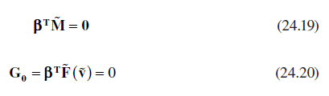

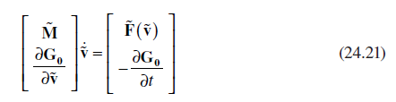

The hydraulics models in Equation 24.13 have index 1, and it is feasible to simulate the system of overdetermined equations in Equation 24.21 directly. The problem is that the number of independent states is defined by the size of the state vector minus the number of hidden algebraic constraints. The initial values of the full state vector must therefore be consistent (i.e., lie on the constraint manifold), and any drift from the constraint manifold during the simulation must be controlled. The approach discussed in Ref. [11] overcomes these issues by selecting a minimum number of independent integrated states from the state vector. The integrated states can then be used to determine algebraically the remaining states so that the hidden constraints are satisfied. This is similar to the method described in Section 24.3, but now, the constraints are defined by nonlinear functions of the states, and they are implicit within the model description. 

Гідравлічні моделі в рівнянні 24.13 мають індекс 1, і можливо моделювати систему перевизначених рівнянь у рівнянні 24.21 безпосередньо. Проблема полягає в тому, що кількість незалежних станів визначається розміром вектора стану мінус кількість прихованих алгебраїчних обмежень. Тому початкові значення повного вектора стану повинні бути послідовними (тобто лежати на різноманітті обмежень), і будь-який дрейф від різноманіття обмежень під час моделювання повинен контролюватися. Підхід, розглянутий у Ref. [11] долає ці проблеми шляхом вибору мінімальної кількості незалежних інтегрованих станів із вектора стану. Потім інтегровані стани можна використовувати для алгебраїчного визначення станів, що залишилися, щоб задовольнити приховані обмеження. Це подібно до методу, описаного в Розділі 24.3, але тепер обмеження визначаються нелінійними функціями станів, і вони є неявними в описі моделі.

### 24.4.2 Minimum Order Dynamic Equations

A minimal order system of dynamic equations can be derived by partitioning the state vector **v** in Equation 24.22 into independent states v i that are integrated in time and algebraic states **v** a that are derived at each time step from a function of the integrated states. The reordering of the integrated and algebraic states into the full state vector is achieved through the permutation matrix **Π**. The selection of which independent states are chosen from the full state vector is the same as in Section 24.3, namely by inspection of the symbolically derived null-space matrix **β**.

Систему динамічних рівнянь мінімального порядку можна вивести шляхом поділу вектора стану **v** у рівнянні 24.22 на незалежні стани v i, які інтегровані в часі, та алгебраїчні стани **v** a, які виводяться на кожному часовому кроці з a функції інтегрованих держав. Перевпорядкування інтегрованих і алгебраїчних станів у повний вектор стану досягається за допомогою матриці перестановок **Π**. Вибір того, які незалежні стани вибираються з повного вектора стану, такий самий, як і в Розділі 24.3, а саме перевіркою символічно отриманої матриці нульового простору **β**.

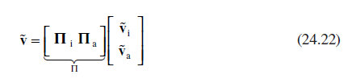

The rate of change of the algebraic states is derived by differentiating the constraint equations in Equation 24.20 to give Equation 24.23, where the time dependency of the orifice areas in the constraint equations is accounted for by the third term in *t* .

Швидкість зміни алгебраїчних станів виводиться диференціюванням рівнянь обмежень у рівнянні 24.20, щоб отримати рівняння 24.23, де залежність від часу площ отворів у рівняннях обмежень враховується третім членом у *t*.

 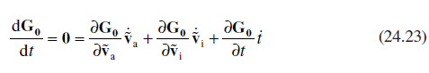

Rearranging Equation 24.23 into Equation 24.24, and substituting into the original equations in Equation 24.13, produces the minimum order dynamic equations in Equation 24.25, where the columns of **P** form the the basis vectors of the range space of the mass matrix. These equations represent a minimal order system of ODEs that satisfy **G0** and where the resulting mass matrix is invertible. The problem is now to determine the relationship between the integrated and algebraic states when the constraint equations are nonlinear in nature.

Перегрупування рівняння 24.23 у рівняння 24.24 та заміна вихідних рівнянь у рівняння 24.13 дає динамічні рівняння мінімального порядку у рівнянні 24.25, де стовпці **P** утворюють базисні вектори простору діапазонів матриці мас. Ці рівняння представляють систему мінімального порядку ОДУ, які задовольняють **G0** і де результуюча матриця мас є оборотною. Тепер проблема полягає у визначенні зв’язку між інтегрованим і алгебраїчним станами, коли рівняння обмежень мають нелінійний характер.

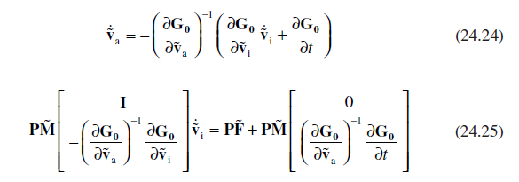

This section describes the derivation of the relationship between the integrated and the algebraic states in the reduced order model. On the basis of the original formulation of the forcing function in Equation 24.5, the algebraic constraints can be expressed in Equation 24.26 in terms of the partitioning of the state vector in Equation 24.7. The matrix representing the pressure drop across open orifices (**WO**) is partitioned in Equation 24.27, and the dependent states (**v**ˆ) are related to the independent states (**v** ) by Equation 24.28. The notation **v** |**v**| in Equation 24.26 defines the signed square value of each element in the state vector.

У цьому розділі описано визначення зв’язку між інтегрованими та алгебраїчними станами в моделі приведеного порядку. На основі оригінального формулювання функції примусу в рівнянні 24.5 алгебраїчні обмеження можуть бути виражені в рівнянні 24.26 через розбиття вектора стану в рівнянні 24.7. Матриця, що представляє перепад тиску через відкриті отвори (**WO**), розділена у рівнянні 24.27, а залежні стани (**v**ˆ) пов’язані з незалежними станами (**v**) рівнянням 24.28. . Позначення **v** |**v**| у рівнянні 24.26 визначає квадратне значення зі знаком кожного елемента у векторі стану.

 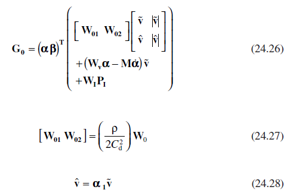

The constraints in Equation 24.26 can be rearranged in Equation 24.29 for the unknowns **v** a, where the matrices **A**, **B**, **C**, **D** are given by Equations 24.30 through 24.33.

Обмеження в рівнянні 24.26 можна переставити в рівняння 24.29 для невідомих **v** a, де матриці **A**, **B**, **C**, **D** задані як Рівняння з 24.30 по 24.33.

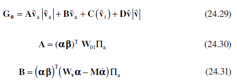

### 24.4.4 Solving Systems of Polynomial Equations

There are a number of ways to solve the system of polynomial equations in Equation 24.29 for the unknown states. The approach chosen is the iterative Newton (or Newton–Raphson) method given in Equation 24.34, where the Jacobian of the constraint matrix is given by Equation 24.35. This approach has proven to be robust, and standard ODE solvers can still be utilized as the iterative procedure is only invoked when the solver requires the derivatives of the independent integrated states. The iterative procedure is still considered an acceptable approach if the equations are to be implemented in a real-time simulation code, as the maximum number of iterations can be limited to guarantee that the solution will be found in the available time.

Існує кілька способів розв’язання системи поліноміальних рівнянь у рівнянні 24.29 для невідомих станів. Обраним підходом є ітераційний метод Ньютона (або Ньютона-Рафсона), поданий у рівнянні 24.34, де якобіан матриці обмежень задано рівнянням 24.35. Цей підхід виявився надійним, і стандартні розв’язувачі ODE все ще можна використовувати, оскільки ітераційна процедура викликається лише тоді, коли розв’язувачу потрібні похідні незалежних інтегрованих станів. Ітераційна процедура все ще вважається прийнятним підходом, якщо рівняння мають бути реалізовані в коді моделювання в реальному часі, оскільки максимальну кількість ітерацій можна обмежити, щоб гарантувати, що рішення буде знайдено за доступний час.

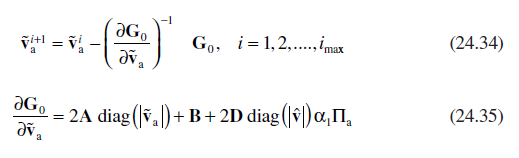

Rather than inverting the Jacobian matrix, the velocity states are updated at each iteration by solving the system of linear equations in Equation 24.36 for the increment in the velocity estimates ∆**v**.

Замість інвертування матриці Якобіа стани швидкості оновлюються на кожній ітерації шляхом розв’язання системи лінійних рівнянь у рівнянні 24.36 для приросту оцінок швидкості ∆**v**.

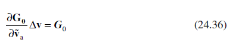

The equations in Equation 24.36 are solved using the **QR** decomposition of the Jacobian matrix in Equation 24.37, where **Q** is orthogonal, **R** is upper triangular, and **E** is a permutation matrix determined so that the values on the leading diagonal of **R** are in decreasing order. The **QR** decomposition is determined during the simulation using the FORTRAN **DGEQP3** function provided in the work by Anderson et al. [12] and described in the work by Quintana-Ort et al. [13]. The efficiency of these routines compared to other implementations is outlined in the work by Foster and Liu [14].

Рівняння в рівнянні 24.36 розв’язуються за допомогою **QR** розкладання матриці Якобі в рівнянні 24.37, де **Q** є ортогональним, **R** є верхнім трикутником, а **E** є перестановкою матриця, визначена таким чином, що значення на головній діагоналі **R** розташовані в порядку зменшення. Розклад **QR** визначається під час моделювання за допомогою функції FORTRAN **DGEQP3**, наданої в роботі Anderson et al. [12] і описано в роботі Quintana-Ort et al. [13]. Ефективність цих підпрограм порівняно з іншими реалізаціями описана в роботі Фостера та Лю [14].

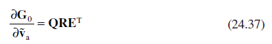

Substituting the matrix **QR** decomposition into Equation 24.36 and multiplying through by **Q****T** leads to Equation 24.38. This equation can easily be solved for ∆**z** as **R** is upper triangular. The calculated solution is reordered into the desired vector of increments using the permutation matrix in Equation 24.39.

Підставляючи матричний розклад **QR** у рівняння 24.36 і множення на **Q****T** призводить до рівняння 24.38. Це рівняння можна легко розв’язати для ∆**z**, оскільки **R** є верхнім трикутником. Обчислене рішення перевпорядковується в потрібний вектор приростів за допомогою матриці перестановок у рівнянні 24.39.

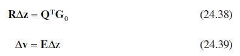

An additional benefit of decomposing the Jacobian in this way is that it provides an estimate for the rank of the matrix. The diagonal elements of **R** provide an approximation to the singular values, and any singular value near zero indicates that the matrix is rank deficient. If that is the case, then a minimum norm solution can be derived using the more accurate SVD described in Section 24.4.5.

Додаткова перевага розкладання якобіана таким чином полягає в тому, що воно забезпечує оцінку рангу матриці. Діагональні елементи **R** забезпечують наближення до сингулярних значень, а будь-яке сингулярне значення поблизу нуля вказує на те, що матриця не має рангу. Якщо це так, то рішення мінімальної норми можна отримати за допомогою більш точного SVD, описаного в розділі 24.4.5.

### 24.4.5 Local Singularities in Algebraic Equations

Under certain conditions, the Jacobian of the constraint equations may be locally singular. This can occur when the orifice areas become very small just before, or after, a transition between modes. In this case, a modified Newton’s method is used (see Ref. [15]), where the aim is to determine the minimum norm solution to the equations, that is, the solution where the state vector has the smallest magnitude. The method uses a generalized outer inverse of the Jacobian to update the state vector. The outer inverse is determined using the more robust SVD of the Jacobian. The form of the decomposition is given in Equation 24.40, where **U** and **V** are orthogonal matrices, **Σ** is a diagonal matrix containing the singular values, and the rank of the Jacobian (*r*) is given by the number of nonzero diagonal elements in Σ.

За певних умов якобіан рівнянь зв’язку може бути локально сингулярним. Це може статися, коли площі отворів стають дуже маленькими безпосередньо перед або після переходу між режимами. У цьому випадку використовується модифікований метод Ньютона (див. [15]), метою якого є визначення мінімального норми розв’язку рівнянь, тобто розв’язку, де вектор стану має найменшу величину. Метод використовує узагальнений зовнішній обернений якобіан для оновлення вектора стану. Зовнішня обернена величина визначається за допомогою більш стійкого SVD якобіана. Форма розкладання наведена в рівнянні 24.40, де **U** і **V** є ортогональними матрицями, **Σ** є діагональною матрицею, що містить сингулярні значення, а ранг якобіана (*r *) задається кількістю ненульових діагональних елементів у Σ.

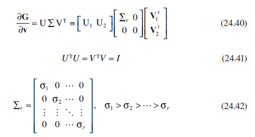

An outer inverse (denoted by #) of the Jacobian is defined as any matrix where the relationship in Equation 24.43 is satisfied. On the basis of the SVD, an outer inverse can be shown to be given by Equation 24.44, and the modified Newton method is then given by Equation 24.45. The SVD is calculated during the simulation using the FORTRAN **DGESVD** function in Ref. [12], and although it is computationally more expensive to calculate compared to the **QR** decomposition described previously, the fact that it is only required at a few points during the simulation means that it does not adversely affect the efficiency of the simulation approach.

Зовнішня обернена матриця (позначена #) якобіана визначається як будь-яка матриця, де виконується співвідношення в рівнянні 24.43. На основі SVD можна показати, що зовнішня зворотна величина задана рівнянням 24.44, а модифікований метод Ньютона потім задано рівнянням 24.45. SVD розраховується під час моделювання за допомогою функції **DGESVD** FORTRAN у Ref. [12], і хоча його обчислення обчислюється дорожче в порівнянні з **QR** розкладом, описаним раніше, той факт, що він потрібний лише в кількох точках під час моделювання, означає, що він не впливає негативно на ефективність симуляційний підхід.

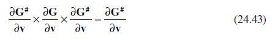

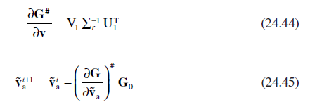

[24.3 <--- ](24_3.md) [   Зміст   ](README.md) [--> 24.5](24_5.md)